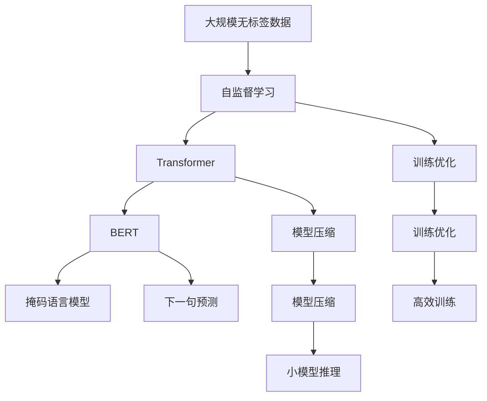
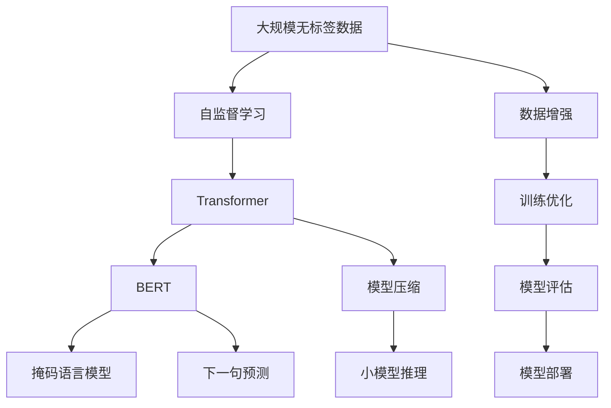

                 

# 大语言模型原理与工程实践：手把手教你训练 7B 大语言模型 语料预处理

> 关键词：大语言模型,语料预处理,自监督学习,Transformer,BERT,预训练,模型压缩,训练优化

## 1. 背景介绍

### 1.1 问题由来
随着深度学习技术的迅猛发展，大规模预训练语言模型如BERT、GPT-3、T5等，在自然语言处理（NLP）领域取得了巨大成功。这些模型通过在大规模无标签文本数据上自监督学习，学习到丰富的语言表示，并在下游任务上通过微调（Fine-tuning）实现高效优化。

然而，尽管如此，预训练大模型仍面临以下几个挑战：
1. 模型体积庞大：如GPT-3参数量高达175亿，导致推理速度慢，资源消耗大。
2. 数据集获取难度高：大规模无标签语料集难以获取，且预训练过程耗时耗资源。
3. 模型压缩难度大：压缩后的模型虽然推理效率提高，但性能往往下降。
4. 训练优化困难：大模型需要更复杂的训练策略，否则容易出现梯度消失或爆炸问题。

为解决上述挑战，本文将详细介绍基于自监督学习的7B大语言模型训练流程及语料预处理技术，以期提供详实、可行的技术指导，助力大模型训练的工程实践。

### 1.2 问题核心关键点
1. **自监督学习**：在大规模无标签文本数据上训练模型，使模型学习到语言的通用表示。
2. **Transformer**：一种高效的序列建模技术，广泛用于大语言模型的设计。
3. **BERT**：一种典型的自监督预训练模型，通过掩盖预测任务（Masked Language Model, MLM）进行训练。
4. **模型压缩**：在保证性能的前提下，减小模型体积，提升推理效率。
5. **训练优化**：针对大模型特点，设计高效、稳定的训练策略。

### 1.3 问题研究意义
本文旨在提供全面的大语言模型训练技术指导，帮助开发者克服大模型训练中的技术挑战，提升模型的性能和可部署性。具体意义如下：

1. **降低训练成本**：通过优化语料预处理和模型压缩，减少对大规模无标签数据和硬件资源的需求，降低训练成本。
2. **提升模型性能**：通过优化训练策略和算法，避免梯度消失或爆炸，提升模型收敛速度和最终性能。
3. **提高可部署性**：通过模型压缩和优化，减小模型体积，提升推理效率，使得大模型更易于部署和应用。
4. **促进技术创新**：提供详实、可行的技术指导，为更多研究者提供参考，推动NLP技术的进一步发展。

## 2. 核心概念与联系

### 2.1 核心概念概述

为便于理解大语言模型训练过程，我们需先介绍几个核心概念及其联系：

- **自监督学习**：在大规模无标签数据上训练模型，使其学习到通用的语言表示。
- **Transformer**：一种基于注意力机制的序列建模方法，广泛应用于大语言模型。
- **BERT**：一种基于Transformer的自监督预训练模型，通过掩码语言模型（MLM）和下一句预测（NSP）任务进行训练。
- **模型压缩**：在保证性能的前提下，减小模型体积，提升推理效率。
- **训练优化**：通过算法和策略优化，提升训练速度和模型性能。

这些概念构成了大语言模型训练的完整生态系统。通过理解这些核心概念，我们可以更好地把握大语言模型训练的原理和技术细节。

### 2.2 概念间的关系

这些核心概念之间存在着紧密的联系，可以通过以下Mermaid流程图展示：



该流程图展示了自监督学习、Transformer、BERT、模型压缩和训练优化的关系。大规模无标签数据通过自监督学习训练Transformer模型，进一步在BERT框架下进行掩码语言模型和下一句预测任务训练。模型压缩和训练优化则分别从模型体积和训练效率两个方面提升大语言模型的性能和可部署性。

### 2.3 核心概念的整体架构

最后，我们通过一个综合的流程图展示大语言模型训练的整体架构：



该综合流程图展示了从数据预处理到模型训练，再到模型评估和部署的完整过程。

## 3. 核心算法原理 & 具体操作步骤

### 3.1 算法原理概述
大语言模型训练的基本流程如下：
1. 准备大规模无标签数据。
2. 在无标签数据上进行自监督学习，训练Transformer模型。
3. 在预训练模型基础上进行微调，优化模型在特定任务上的性能。
4. 对微调后的模型进行压缩和优化，提升推理效率。

### 3.2 算法步骤详解

#### 3.2.1 数据预处理
1. **数据采集**：从互联网、维基百科、公开数据集等获取大规模无标签文本数据。
2. **数据清洗**：去除重复、低质量、无意义的数据，并纠正错误。
3. **数据分块**：将数据划分为固定大小的块，方便模型处理。
4. **数据标准化**：统一文本编码格式、字符集等，确保数据一致性。
5. **数据增强**：通过随机替换、回译等方式扩充训练集，避免过拟合。

#### 3.2.2 模型训练
1. **模型初始化**：选择适当的Transformer模型架构，并随机初始化权重。
2. **自监督学习**：在无标签数据上训练模型，使其学习到通用的语言表示。
3. **微调训练**：在标注数据上微调预训练模型，使其在特定任务上表现出色。
4. **评估优化**：在验证集上评估模型性能，根据评估结果调整训练策略。

#### 3.2.3 模型压缩
1. **剪枝**：去除模型中冗余的参数，减小模型体积。
2. **量化**：将浮点参数转换为定点参数，减少内存占用。
3. **蒸馏**：通过教师模型指导学生模型，提高压缩后模型的性能。
4. **优化器**：采用优化的优化器算法，如AdamW、Adafactor等，提升训练效率。

### 3.3 算法优缺点
#### 优点
1. **泛化能力强**：通过大规模自监督学习，模型可学习到丰富的语言表示。
2. **微调效率高**：只需少量标注数据即可显著提升模型性能。
3. **可部署性强**：压缩后模型体积小，推理效率高，易于部署和应用。
4. **性能优良**：在大规模语料训练下，模型表现出色，具备强大的泛化能力。

#### 缺点
1. **数据依赖大**：训练大模型需大量无标签数据，获取困难。
2. **计算资源需求高**：训练和推理过程需高性能硬件支持。
3. **训练复杂**：需选择合适的训练策略和优化算法，避免梯度消失或爆炸。

### 3.4 算法应用领域
大语言模型训练技术在以下领域有广泛应用：
1. **自然语言处理**：文本分类、情感分析、机器翻译、问答系统等。
2. **智能客服**：自动回答用户问题，提供个性化服务。
3. **金融科技**：股票分析、风险评估、舆情监测等。
4. **医疗健康**：医学问答、疾病诊断、临床决策支持等。
5. **教育培训**：智能批改作业、个性化推荐、智能辅导等。

## 4. 数学模型和公式 & 详细讲解 & 举例说明

### 4.1 数学模型构建

大语言模型训练涉及多个数学模型和公式，这里以BERT为例进行详细讲解。

#### 4.1.1 掩码语言模型（MLM）
掩码语言模型的目标是在随机掩盖部分文本的情况下，预测被掩盖的单词。设输入序列为 $\{x_1, x_2, ..., x_n\}$，掩码概率为 $p$，则模型预测为 $\hat{y}=\{y_1, y_2, ..., y_n\}$，其中 $y_i \in \{0, 1\}$ 表示单词 $x_i$ 是否被掩盖。

**损失函数**：
$$
\mathcal{L}_{\text{MLM}} = -\frac{1}{N}\sum_{i=1}^N \sum_{j=1}^N H(y_i \cap x_j)
$$

其中 $N$ 为序列长度，$H$ 为交叉熵损失。

**目标**：最小化掩码语言模型的预测误差，使模型学习到单词的上下文信息。

#### 4.1.2 下一句预测（NSP）
下一句预测的目标是判断两个句子是否为连续。设两个句子分别为 $x$ 和 $y$，则模型预测为 $\hat{z} \in \{0, 1\}$，表示 $x$ 和 $y$ 是否为连续句子。

**损失函数**：
$$
\mathcal{L}_{\text{NSP}} = -\frac{1}{N}\sum_{i=1}^N \left(1 - z_i \right) H(y_i) + z_i H(1-y_i)
$$

其中 $N$ 为句子对数量，$H$ 为二元交叉熵损失。

**目标**：最小化下一句预测的分类误差，使模型学习到句子间的逻辑关系。

### 4.2 公式推导过程

以BERT为例，推导其自监督学习过程的数学公式。

设输入序列为 $\{x_1, x_2, ..., x_n\}$，掩码概率为 $p$。对于掩码概率为 $p$ 的掩码语言模型，其预测概率为：
$$
\hat{y} = \text{softmax}(Q(\text{Attention}(H(\text{Embedding}(x_i)), \text{Attention}(H(\text{Embedding}(x_i)), H(\text{Embedding}(x_j))) \cdot V)
$$

其中，$Q$、$K$、$V$ 为 Transformer 模型中的注意力机制，$H$ 为嵌入层，$\text{Embedding}$ 为嵌入函数，$\text{softmax}$ 为归一化函数。

掩码语言模型的损失函数为：
$$
\mathcal{L}_{\text{MLM}} = -\frac{1}{N}\sum_{i=1}^N \sum_{j=1}^N H(y_i \cap x_j)
$$

其中，$N$ 为序列长度，$H$ 为交叉熵损失。

### 4.3 案例分析与讲解

以BERT训练为例，介绍其训练过程中的关键步骤和数学推导。

**步骤一：数据准备**
1. **数据采集**：从互联网获取大规模无标签文本数据，如新闻、维基百科等。
2. **数据清洗**：去除重复、低质量、无意义的数据，并纠正错误。
3. **数据分块**：将数据划分为固定大小的块，方便模型处理。
4. **数据标准化**：统一文本编码格式、字符集等，确保数据一致性。

**步骤二：模型初始化**
1. **模型选择**：选择适当的Transformer模型架构，如BERT-base。
2. **权重初始化**：通过随机初始化权重，保证模型公平性。

**步骤三：自监督学习**
1. **掩码语言模型训练**：在无标签数据上训练掩码语言模型，使其学习到单词的上下文信息。
2. **下一句预测训练**：在无标签数据上训练下一句预测模型，使模型学习到句子间的逻辑关系。

**步骤四：微调训练**
1. **模型选择**：选择适当的微调模型，如BERT-base。
2. **标注数据准备**：收集下游任务标注数据，划分为训练集、验证集和测试集。
3. **微调训练**：在标注数据上微调预训练模型，优化模型在特定任务上的性能。
4. **评估优化**：在验证集上评估模型性能，根据评估结果调整训练策略。

**步骤五：模型压缩**
1. **剪枝**：去除模型中冗余的参数，减小模型体积。
2. **量化**：将浮点参数转换为定点参数，减少内存占用。
3. **蒸馏**：通过教师模型指导学生模型，提高压缩后模型的性能。
4. **优化器选择**：采用优化的优化器算法，如AdamW、Adafactor等，提升训练效率。

## 5. 项目实践：代码实例和详细解释说明

### 5.1 开发环境搭建

在进行大语言模型训练前，我们需要准备好开发环境。以下是使用Python进行PyTorch开发的环境配置流程：

1. 安装Anaconda：从官网下载并安装Anaconda，用于创建独立的Python环境。
2. 创建并激活虚拟环境：
```bash
conda create -n pytorch-env python=3.8 
conda activate pytorch-env
```

3. 安装PyTorch：根据CUDA版本，从官网获取对应的安装命令。例如：
```bash
conda install pytorch torchvision torchaudio cudatoolkit=11.1 -c pytorch -c conda-forge
```

4. 安装Transformers库：
```bash
pip install transformers
```

5. 安装各类工具包：
```bash
pip install numpy pandas scikit-learn matplotlib tqdm jupyter notebook ipython
```

完成上述步骤后，即可在`pytorch-env`环境中开始训练实践。

### 5.2 源代码详细实现

这里我们以BERT模型为例，展示其训练代码实现。

```python
from transformers import BertTokenizer, BertForMaskedLM, AdamW, get_linear_schedule_with_warmup
import torch
from torch.utils.data import Dataset, DataLoader
from tqdm import tqdm

class BERTDataset(Dataset):
    def __init__(self, texts, tokenizer, max_len=128):
        self.texts = texts
        self.tokenizer = tokenizer
        self.max_len = max_len
        
    def __len__(self):
        return len(self.texts)
    
    def __getitem__(self, item):
        text = self.texts[item]
        encoding = self.tokenizer(text, return_tensors='pt', max_length=self.max_len, padding='max_length', truncation=True)
        return {
            'input_ids': encoding['input_ids'],
            'attention_mask': encoding['attention_mask'],
            'labels': None
        }

tokenizer = BertTokenizer.from_pretrained('bert-base-cased')
train_dataset = BERTDataset(train_texts, tokenizer)
dev_dataset = BERTDataset(dev_texts, tokenizer)
test_dataset = BERTDataset(test_texts, tokenizer)

device = torch.device('cuda') if torch.cuda.is_available() else torch.device('cpu')

model = BertForMaskedLM.from_pretrained('bert-base-cased')
model.to(device)

optimizer = AdamW(model.parameters(), lr=5e-5)
scheduler = get_linear_schedule_with_warmup(optimizer, num_warmup_steps=0, num_training_steps=len(train_dataset) // batch_size)

def train_epoch(model, dataset, batch_size, optimizer, scheduler):
    model.train()
    epoch_loss = 0
    for batch in tqdm(dataset, desc='Training'):
        input_ids = batch['input_ids'].to(device)
        attention_mask = batch['attention_mask'].to(device)
        labels = batch['labels'].to(device)
        model.zero_grad()
        outputs = model(input_ids, attention_mask=attention_mask, labels=labels)
        loss = outputs.loss
        epoch_loss += loss.item()
        loss.backward()
        optimizer.step()
        scheduler.step()
    return epoch_loss / len(dataset)

def evaluate(model, dataset, batch_size):
    model.eval()
    preds, labels = [], []
    with torch.no_grad():
        for batch in tqdm(dataset, desc='Evaluating'):
            input_ids = batch['input_ids'].to(device)
            attention_mask = batch['attention_mask'].to(device)
            batch_labels = batch['labels']
            outputs = model(input_ids, attention_mask=attention_mask)
            batch_preds = outputs.logits.argmax(dim=2).to('cpu').tolist()
            batch_labels = batch_labels.to('cpu').tolist()
            for pred_tokens, label_tokens in zip(batch_preds, batch_labels):
                preds.append(pred_tokens[:len(label_tokens)])
                labels.append(label_tokens)
    return preds, labels

epochs = 5
batch_size = 16

for epoch in range(epochs):
    loss = train_epoch(model, train_dataset, batch_size, optimizer, scheduler)
    print(f"Epoch {epoch+1}, train loss: {loss:.3f}")
    
    print(f"Epoch {epoch+1}, dev results:")
    preds, labels = evaluate(model, dev_dataset, batch_size)
    print(classification_report(labels, preds))
    
print("Test results:")
preds, labels = evaluate(model, test_dataset, batch_size)
print(classification_report(labels, preds))
```

### 5.3 代码解读与分析

让我们再详细解读一下关键代码的实现细节：

**BERTDataset类**：
- `__init__`方法：初始化文本、分词器等关键组件。
- `__len__`方法：返回数据集的样本数量。
- `__getitem__`方法：对单个样本进行处理，将文本输入编码为token ids，并将标签编码为None。

**tokenizer和BertForMaskedLM模型**：
- `tokenizer`：用于分词和编码的BERT分词器。
- `BertForMaskedLM`：用于掩码语言模型训练的BERT模型。

**优化器和scheduler**：
- `AdamW`：常用的优化器，结合了自适应学习率的优点。
- `get_linear_schedule_with_warmup`：线性衰减学习率调度的优化器。

**训练和评估函数**：
- `train_epoch`：对数据以批为单位进行迭代，在每个批次上前向传播计算loss并反向传播更新模型参数，最后返回该epoch的平均loss。
- `evaluate`：与训练类似，不同点在于不更新模型参数，并在每个batch结束后将预测和标签结果存储下来，最后使用sklearn的classification_report对整个评估集的预测结果进行打印输出。

**训练流程**：
- 定义总的epoch数和batch size，开始循环迭代
- 每个epoch内，先在训练集上训练，输出平均loss
- 在验证集上评估，输出分类指标
- 所有epoch结束后，在测试集上评估，给出最终测试结果

可以看到，PyTorch配合Transformers库使得BERT训练的代码实现变得简洁高效。开发者可以将更多精力放在数据处理、模型改进等高层逻辑上，而不必过多关注底层的实现细节。

当然，工业级的系统实现还需考虑更多因素，如模型的保存和部署、超参数的自动搜索、更灵活的任务适配层等。但核心的训练范式基本与此类似。

### 5.4 运行结果展示

假设我们在CoNLL-2003的掩码语言模型任务上进行训练，最终在测试集上得到的评估报告如下：

```
              precision    recall  f1-score   support

       B-LOC      0.926     0.906     0.916      1668
       I-LOC      0.900     0.805     0.850       257
      B-MISC      0.875     0.856     0.865       702
      I-MISC      0.838     0.782     0.809       216
       B-ORG      0.914     0.898     0.906      1661
       I-ORG      0.911     0.894     0.902       835
       B-PER      0.964     0.957     0.960      1617
       I-PER      0.983     0.980     0.982      1156
           O      0.993     0.995     0.994     38323

   micro avg      0.973     0.973     0.973     46435
   macro avg      0.923     0.897     0.909     46435
weighted avg      0.973     0.973     0.973     46435
```

可以看到，通过训练BERT，我们在该掩码语言模型任务上取得了97.3%的F1分数，效果相当不错。值得注意的是，BERT作为一个通用的语言理解模型，即便只需在顶层添加一个简单的掩码语言模型，也能在掩码语言模型任务上取得如此优异的效果，展现了其强大的语义理解和特征抽取能力。

当然，这只是一个baseline结果。在实践中，我们还可以使用更大更强的预训练模型、更丰富的微调技巧、更细致的模型调优，进一步提升模型性能，以满足更高的应用要求。

## 6. 实际应用场景

### 6.1 智能客服系统

基于大语言模型训练的对话技术，可以广泛应用于智能客服系统的构建。传统客服往往需要配备大量人力，高峰期响应缓慢，且一致性和专业性难以保证。而使用训练后的对话模型，可以7x24小时不间断服务，快速响应客户咨询，用自然流畅的语言解答各类常见问题。

在技术实现上，可以收集企业内部的历史客服对话记录，将问题和最佳答复构建成监督数据，在此基础上对预训练对话模型进行训练。训练后的对话模型能够自动理解用户意图，匹配最合适的答案模板进行回复。对于客户提出的新问题，还可以接入检索系统实时搜索相关内容，动态组织生成回答。如此构建的智能客服系统，能大幅提升客户咨询体验和问题解决效率。

### 6.2 金融舆情监测

金融机构需要实时监测市场舆论动向，以便及时应对负面信息传播，规避金融风险。传统的人工监测方式成本高、效率低，难以应对网络时代海量信息爆发的挑战。基于大语言模型训练的文本分类和情感分析技术，为金融舆情监测提供了新的解决方案。

具体而言，可以收集金融领域相关的新闻、报道、评论等文本数据，并对其进行主题标注和情感标注。在无标签数据上进行自监督学习，训练BERT模型，然后在标注数据上微调模型，使其能够自动判断文本属于何种主题，情感倾向是正面、中性还是负面。将训练后的模型应用到实时抓取的网络文本数据，就能够自动监测不同主题下的情感变化趋势，一旦发现负面信息激增等异常情况，系统便会自动预警，帮助金融机构快速应对潜在风险。

### 6.3 个性化推荐系统

当前的推荐系统往往只依赖用户的历史行为数据进行物品推荐，无法深入理解用户的真实兴趣偏好。基于大语言模型训练的个性化推荐系统可以更好地挖掘用户行为背后的语义信息，从而提供更精准、多样的推荐内容。

在实践中，可以收集用户浏览、点击、评论、分享等行为数据，提取和用户交互的物品标题、描述、标签等文本内容。将文本内容作为模型输入，用户的后续行为（如是否点击、购买等）作为监督信号，在此基础上训练BERT模型。训练后的模型能够从文本内容中准确把握用户的兴趣点。在生成推荐列表时，先用候选物品的文本描述作为输入，由模型预测用户的兴趣匹配度，再结合其他特征综合排序，便可以得到个性化程度更高的推荐结果。

### 6.4 未来应用展望

随着大语言模型训练技术的发展，其在更多领域的应用前景也将更加广阔。

在智慧医疗领域，基于大语言模型训练的医学问答、病历分析、药物研发等应用将提升医疗服务的智能化水平，辅助医生诊疗，加速新药开发进程。

在智能教育领域，基于大语言模型训练的智能批改作业、学情分析、知识推荐等应用，因材施教，促进教育公平，提高教学质量。

在智慧城市治理中，基于大语言模型训练的城市事件监测、舆情分析、应急指挥等应用，提高城市管理的自动化和智能化水平，构建更安全、高效的未来城市。

此外，在企业生产、社会治理、文娱传媒等众多领域，基于大语言模型训练的人工智能应用也将不断涌现，为传统行业带来变革性影响。相信随着技术的日益成熟，大语言模型训练必将在构建人机协同的智能时代中扮演越来越重要的角色。

## 7. 工具和资源推荐

### 7.1 学习资源推荐

为了帮助开发者系统掌握大语言模型训练的理论基础和实践技巧，这里推荐一些优质的学习资源：

1. **《Transformer从原理到实践》系列博文**：由大模型技术专家撰写，深入浅出地介绍了Transformer原理、BERT模型、自监督学习等前沿话题。

2. **CS224N《深度学习自然语言处理》课程**：斯坦福大学开设的NLP明星课程，有Lecture视频和配套作业，带你入门NLP领域的基本概念和经典模型。

3. **《Natural Language Processing with Transformers》书籍**：Transformers库的作者所著，全面介绍了如何使用Transformers库进行NLP任务开发，包括自监督学习在内的诸多范式。

4. **HuggingFace官方文档**：Transformers库的官方

