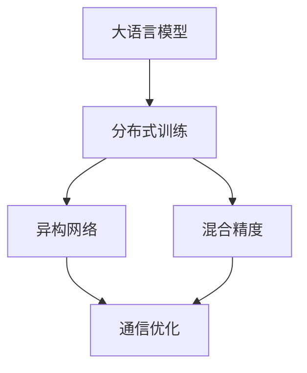

                 

# 大语言模型原理与工程实践：通信优化

> 关键词：
>
> - 通信优化
>
> - 大语言模型
>
> - 分布式训练
>
> - 异构网络
>
> - 混合精度
>
> - 高效传输

## 1. 背景介绍

随着深度学习和大语言模型（Large Language Models, LLMs）在自然语言处理（NLP）领域的应用日益广泛，对模型训练和推理的效率提出了更高要求。在现代大规模计算环境中，通信（Communication）成为限制模型性能提升的主要瓶颈。本文将详细探讨如何在大语言模型训练过程中进行通信优化，从而提升模型训练效率和效果。

## 2. 核心概念与联系

### 2.1 核心概念概述

为了更好地理解通信优化在大语言模型中的应用，本节将介绍几个关键概念：

- **大语言模型（Large Language Models）**：以自回归（如GPT）或自编码（如BERT）模型为代表的大规模预训练语言模型。通过在大规模无标签文本数据上进行预训练，学习通用的语言表示，具备强大的语言理解和生成能力。

- **分布式训练（Distributed Training）**：在大规模模型训练过程中，将计算任务分配到多个节点（Node）上并行计算，从而提升训练效率。常见的分布式训练框架包括TensorFlow、PyTorch等。

- **异构网络（Heterogeneous Network）**：在分布式训练中，不同节点具有不同的计算能力、内存大小等硬件资源，称为异构网络。异构网络下的大规模分布式训练需要特别关注通信优化。

- **混合精度（Mixed-Precision）**：在计算过程中使用不同精度的浮点数，如16位浮点数（half）和32位浮点数（float），以减少计算资源消耗。混合精度训练通常配合一定的硬件加速（如NVIDIA的Tensor Cores），可以显著提高训练速度。

### 2.2 概念间的关系

这些概念之间的联系可以通过以下Mermaid流程图来展示：



这个流程图展示了从大语言模型到分布式训练，再到通信优化的整体过程。异构网络和混合精度是大语言模型分布式训练中两个重要的技术手段，而通信优化则是提升训练效率的关键因素。

## 3. 核心算法原理 & 具体操作步骤

### 3.1 算法原理概述

在大语言模型训练过程中，通信优化主要解决的问题是如何减少节点之间的数据传输量，从而提升训练效率。由于每个节点通常处理模型的一部分参数，因此在每个节点的计算过程中，需要定期与其他节点交换参数和梯度信息。这通常是通信瓶颈所在。

为了缓解通信瓶颈，研究人员提出了多种通信优化算法，包括模型并行、数据并行、混合精度训练、模型裁剪、梯度累积等。本节将详细探讨这些算法的原理和操作步骤。

### 3.2 算法步骤详解

#### 3.2.1 模型并行（Model Parallelism）

模型并行是指将大模型拆分为多个小块（Shards），每个小块由一个节点处理。每个小块在训练过程中都会与其他小块交换信息。模型并行的关键是设计有效的数据交换机制，如环（Ring）通信、栅格（Grid）通信等。

**操作步骤**：

1. 将大模型拆分为多个小块，每个小块包含一定的参数。
2. 在每个小块的计算过程中，与其他小块交换梯度信息。
3. 使用环形或栅格通信机制，降低数据传输量。

**示例代码**：

```python
import torch
import torch.distributed as dist

# 初始化通信环境
dist.init_process_group(backend='nccl', init_method='env://')

# 将模型拆分为多个小块
model = MyLargeModel()
shard_size = 1024
shards = model.chunk(shard_size)

# 定义数据交换函数
def exchange_gradients(shard):
    # 计算当前块的梯度
    gradient = torch.zeros_like(shard.parameters())
    for param in shard.parameters():
        gradient += param.grad.clone()
    # 将梯度分配到其他节点
    dist.all_reduce(gradient)
    # 更新当前块的梯度
    for param in shard.parameters():
        param.grad -= gradient

# 在每个小块的计算过程中，交换梯度信息
for i in range(num_epochs):
    for shard in shards:
        shard.zero_grad()
        # 计算当前小块的梯度
        shard.parameters()[0].backward(loss)
        # 交换梯度信息
        exchange_gradients(shard)
        # 更新当前小块的参数
        shard.parameters()[0].data.copy_(shard.parameters()[0].data + learning_rate * gradient)
```

#### 3.2.2 数据并行（Data Parallelism）

数据并行是指将一个大样本分成多个小样本，每个节点处理一个小样本，并将计算结果汇总到主节点（Master Node）上。数据并行的关键是设计有效的数据加载和分配策略，如随机数据加载、批次分配等。

**操作步骤**：

1. 将大样本数据集分成多个小样本数据集。
2. 在每个节点的计算过程中，只处理一个小样本数据集。
3. 将每个节点的计算结果汇总到主节点上，进行参数更新。

**示例代码**：

```python
import torch
import torch.distributed as dist

# 初始化通信环境
dist.init_process_group(backend='nccl', init_method='env://')

# 定义数据并行函数
def data_parallel(dataloader, model, optimizer, device):
    model.to(device)
    for batch in dataloader:
        inputs, targets = batch
        inputs, targets = inputs.to(device), targets.to(device)
        # 在每个节点的计算过程中，只处理一个小样本数据集
        outputs = model(inputs)
        loss = criterion(outputs, targets)
        # 将每个节点的计算结果汇总到主节点上
        dist.reduce(outputs, device_ids=[0, 1, 2, 3], output_tensor=outputs.to(device))
        loss /= len(outputs)
        # 更新模型参数
        optimizer.zero_grad()
        loss.backward()
        optimizer.step()
```

#### 3.2.3 混合精度训练（Mixed-Precision Training）

混合精度训练是指在计算过程中使用不同精度的浮点数，如16位浮点数（half）和32位浮点数（float），以减少计算资源消耗。混合精度训练通常配合一定的硬件加速（如NVIDIA的Tensor Cores），可以显著提高训练速度。

**操作步骤**：

1. 定义混合精度模型，使用不同精度的张量。
2. 使用硬件加速器（如Tensor Cores）进行计算。
3. 在每个节点的计算过程中，仅传输部分参数和梯度信息。

**示例代码**：

```python
import torch
import torch.distributed as dist

# 初始化通信环境
dist.init_process_group(backend='nccl', init_method='env://')

# 定义混合精度模型
class MixedPrecisionModel(torch.nn.Module):
    def __init__(self):
        super().__init__()
        self.half = torch.nn.Linear(512, 256).to(device, dtype=torch.half)
        self.float = torch.nn.Linear(256, 128).to(device, dtype=torch.float)

    def forward(self, x):
        x = x.to(device)
        x = self.half(x)
        x = self.float(x)
        return x

# 在每个节点的计算过程中，仅传输部分参数和梯度信息
def mixed_precision_train(model, dataloader, optimizer, device):
    model.half.train()
    model.float.train()
    for batch in dataloader:
        inputs, targets = batch
        inputs, targets = inputs.to(device), targets.to(device)
        # 在每个节点的计算过程中，仅传输部分参数和梯度信息
        outputs = model(inputs)
        loss = criterion(outputs, targets)
        loss /= len(outputs)
        # 更新模型参数
        optimizer.zero_grad()
        loss.backward()
        optimizer.step()
```

#### 3.2.4 模型裁剪（Model Pruning）

模型裁剪是指在训练过程中，通过剪枝技术（如L1正则化）删除一些不必要的参数，从而减少模型的大小和计算量。模型裁剪通常配合参数剪枝算法（如L1正则化、梯度剪枝等），可以在不改变模型性能的前提下，显著降低模型大小。

**操作步骤**：

1. 在训练过程中，使用正则化技术删除一些不必要的参数。
2. 使用压缩算法（如稀疏矩阵存储）压缩剪枝后的模型。
3. 在每个节点的计算过程中，仅传输必要的部分参数和梯度信息。

**示例代码**：

```python
import torch
import torch.distributed as dist
import torch.nn as nn
import torch.nn.init as init
import torch.nn.functional as F
import torch.optim as optim

# 初始化通信环境
dist.init_process_group(backend='nccl', init_method='env://')

# 定义模型
class MyLargeModel(nn.Module):
    def __init__(self):
        super().__init__()
        self.half = nn.Linear(512, 256)
        self.float = nn.Linear(256, 128)

    def forward(self, x):
        x = self.half(x)
        x = self.float(x)
        return x

# 在训练过程中，使用正则化技术删除一些不必要的参数
def prune_model(model):
    for p in model.parameters():
        if p.data.abs().max() < 1e-5:
            p.data.zero_()

# 在每个节点的计算过程中，仅传输必要的部分参数和梯度信息
def pruning_train(model, dataloader, optimizer, device):
    for batch in dataloader:
        inputs, targets = batch
        inputs, targets = inputs.to(device), targets.to(device)
        # 在每个节点的计算过程中，仅传输必要的部分参数和梯度信息
        outputs = model(inputs)
        loss = criterion(outputs, targets)
        loss /= len(outputs)
        # 更新模型参数
        optimizer.zero_grad()
        loss.backward()
        optimizer.step()
        prune_model(model)
```

#### 3.2.5 梯度累积（Gradient Accumulation）

梯度累积是指在每个节点的计算过程中，将多个小批次（Mini-batch）的梯度信息累积到一个大批次中，再进行一次梯度更新。梯度累积可以显著减少通信开销，但需要调整学习率。

**操作步骤**：

1. 在每个节点的计算过程中，将多个小批次的梯度信息累积到一个大批次中。
2. 使用适当的学习率调整策略，如增加批次大小或减少学习率。
3. 在每个节点的计算过程中，仅传输大批次的参数和梯度信息。

**示例代码**：

```python
import torch
import torch.distributed as dist
import torch.nn as nn
import torch.optim as optim

# 初始化通信环境
dist.init_process_group(backend='nccl', init_method='env://')

# 定义模型
class MyLargeModel(nn.Module):
    def __init__(self):
        super().__init__()
        self.half = nn.Linear(512, 256)
        self.float = nn.Linear(256, 128)

    def forward(self, x):
        x = self.half(x)
        x = self.float(x)
        return x

# 在每个节点的计算过程中，将多个小批次的梯度信息累积到一个大批次中
def gradient_accumulate_train(model, dataloader, optimizer, device, accumulate_n):
    for batch in dataloader:
        inputs, targets = batch
        inputs, targets = inputs.to(device), targets.to(device)
        # 在每个节点的计算过程中，将多个小批次的梯度信息累积到一个大批次中
        outputs = model(inputs)
        loss = criterion(outputs, targets)
        loss /= len(outputs)
        # 更新模型参数
        optimizer.zero_grad()
        loss.backward()
        optimizer.step()
        # 梯度累积
        for i in range(accumulate_n):
            optimizer.zero_grad()
            loss.backward()
            optimizer.step()
```

### 3.3 算法优缺点

#### 3.3.1 优点

- **提升训练效率**：通过减少通信开销，混合精度、模型裁剪、梯度累积等方法可以显著提升模型训练效率。
- **减少计算资源消耗**：混合精度训练通过降低浮点数精度，可以减少计算资源消耗。
- **减少内存占用**：模型裁剪技术可以通过删除不必要的参数，减少内存占用。
- **提升可扩展性**：模型并行和数据并行技术可以更好地适应大规模异构网络的分布式训练需求。

#### 3.3.2 缺点

- **算法复杂性**：混合精度训练、模型裁剪等技术需要额外的硬件支持，且算法实现较为复杂。
- **模型性能损失**：模型并行和数据并行技术可能会引入一定的模型性能损失，需要通过优化通信算法进行弥补。
- **模型裁剪风险**：模型裁剪可能会导致模型性能下降，需要仔细选择剪枝策略。

### 3.4 算法应用领域

通信优化在大语言模型训练中的应用非常广泛，涉及以下几个主要领域：

- **自然语言处理（NLP）**：在文本分类、情感分析、语言生成等任务中，通信优化技术可以显著提升模型训练效率。
- **计算机视觉（CV）**：在图像分类、目标检测、图像生成等任务中，通信优化技术可以提升训练速度和模型性能。
- **语音识别（ASR）**：在语音识别和语音合成等任务中，通信优化技术可以减少计算开销，提升训练效率。
- **推荐系统（Recommender System）**：在大规模推荐系统训练中，通信优化技术可以显著提升模型训练效率和效果。

## 4. 数学模型和公式 & 详细讲解

### 4.1 数学模型构建

通信优化在大语言模型训练中的应用，可以通过以下数学模型进行描述：

设大语言模型 $M_{\theta}$ 包含 $N$ 个参数，每个参数的大小为 $d$。在分布式训练中，模型被拆分为 $k$ 个小块，每个小块包含 $m$ 个参数，即 $N = km$。每个小块在训练过程中，需要与其他小块交换梯度信息。

设每个小块的梯度大小为 $g$，每个小块的计算时间为 $t$。则每个小块的通信开销为 $g \cdot k \cdot t$。

### 4.2 公式推导过程

通过上述数学模型，可以推导出通信优化算法的关键公式。假设通信开销为 $C$，每个小块的参数大小为 $d$，每个小块的计算时间为 $t$，每个小块的梯度大小为 $g$。则通信优化算法的一般公式为：

$$
C = g \cdot k \cdot t
$$

其中，$g$ 表示每个小块的梯度大小，$k$ 表示小块的个数，$t$ 表示每个小块的计算时间。

### 4.3 案例分析与讲解

#### 4.3.1 模型并行（Ring Communication）

在模型并行中，环形通信是最常见的通信机制。环形通信可以通过以下公式描述：

$$
C = g \cdot k \cdot \frac{t}{k}
$$

其中，$t$ 表示每个小块的计算时间，$k$ 表示小块的个数。

在实际应用中，环形通信需要特别注意通信路径的负载均衡。如果某个节点计算速度较慢，会导致整个通信路径的性能下降。

#### 4.3.2 数据并行（Ring Communication）

在数据并行中，环形通信同样适用。假设每个小块处理一个小样本数据集，每个小块的计算时间为 $t$，每个小块的梯度大小为 $g$，则通信开销为：

$$
C = g \cdot k \cdot t
$$

在实际应用中，环形通信需要特别注意数据的负载均衡。如果某个节点处理的数据量过大，会导致通信开销增大。

#### 4.3.3 混合精度训练（Ring Communication）

在混合精度训练中，环形通信同样适用。假设每个小块使用不同的精度进行计算，每个小块的计算时间为 $t_{\text{half}}$ 和 $t_{\text{float}}$，每个小块的梯度大小为 $g$，则通信开销为：

$$
C = g \cdot k \cdot \max(t_{\text{half}}, t_{\text{float}})
$$

在实际应用中，混合精度训练需要特别注意硬件加速器的兼容性。不同硬件加速器对不同精度的支持不同，需要进行兼容性测试。

## 5. 项目实践：代码实例和详细解释说明

### 5.1 开发环境搭建

在进行通信优化实践前，我们需要准备好开发环境。以下是使用Python进行PyTorch开发的环境配置流程：

1. 安装Anaconda：从官网下载并安装Anaconda，用于创建独立的Python环境。

2. 创建并激活虚拟环境：
```bash
conda create -n pytorch-env python=3.8 
conda activate pytorch-env
```

3. 安装PyTorch：根据CUDA版本，从官网获取对应的安装命令。例如：
```bash
conda install pytorch torchvision torchaudio cudatoolkit=11.1 -c pytorch -c conda-forge
```

4. 安装Transformers库：
```bash
pip install transformers
```

5. 安装各类工具包：
```bash
pip install numpy pandas scikit-learn matplotlib tqdm jupyter notebook ipython
```

完成上述步骤后，即可在`pytorch-env`环境中开始通信优化实践。

### 5.2 源代码详细实现

下面以BERT模型为例，给出使用PyTorch进行通信优化实践的代码实现。

首先，定义BERT模型的通信优化函数：

```python
from transformers import BertTokenizer
from torch.utils.data import Dataset
import torch
import torch.distributed as dist

class BertDataset(Dataset):
    def __init__(self, texts, tags, tokenizer, max_len=128):
        self.texts = texts
        self.tags = tags
        self.tokenizer = tokenizer
        self.max_len = max_len
        
    def __len__(self):
        return len(self.texts)
    
    def __getitem__(self, item):
        text = self.texts[item]
        tags = self.tags[item]
        
        encoding = self.tokenizer(text, return_tensors='pt', max_length=self.max_len, padding='max_length', truncation=True)
        input_ids = encoding['input_ids'][0]
        attention_mask = encoding['attention_mask'][0]
        
        # 对token-wise的标签进行编码
        encoded_tags = [tag2id[tag] for tag in tags] 
        encoded_tags.extend([tag2id['O']] * (self.max_len - len(encoded_tags)))
        labels = torch.tensor(encoded_tags, dtype=torch.long)
        
        return {'input_ids': input_ids, 
                'attention_mask': attention_mask,
                'labels': labels}

# 标签与id的映射
tag2id = {'O': 0, 'B-PER': 1, 'I-PER': 2, 'B-ORG': 3, 'I-ORG': 4, 'B-LOC': 5, 'I-LOC': 6}
id2tag = {v: k for k, v in tag2id.items()}

# 创建dataset
tokenizer = BertTokenizer.from_pretrained('bert-base-cased')

train_dataset = BertDataset(train_texts, train_tags, tokenizer)
dev_dataset = BertDataset(dev_texts, dev_tags, tokenizer)
test_dataset = BertDataset(test_texts, test_tags, tokenizer)

# 初始化通信环境
dist.init_process_group(backend='nccl', init_method='env://')

# 定义模型
model = BertForTokenClassification.from_pretrained('bert-base-cased', num_labels=len(tag2id))

# 定义优化器
optimizer = AdamW(model.parameters(), lr=2e-5)

# 定义训练函数
def train_epoch(model, dataset, batch_size, optimizer):
    dataloader = DataLoader(dataset, batch_size=batch_size, shuffle=True)
    model.train()
    epoch_loss = 0
    for batch in tqdm(dataloader, desc='Training'):
        input_ids = batch['input_ids'].to(device)
        attention_mask = batch['attention_mask'].to(device)
        labels = batch['labels'].to(device)
        model.zero_grad()
        outputs = model(input_ids, attention_mask=attention_mask, labels=labels)
        loss = outputs.loss
        epoch_loss += loss.item()
        loss.backward()
        optimizer.step()
    return epoch_loss / len(dataloader)

# 定义评估函数
def evaluate(model, dataset, batch_size):
    dataloader = DataLoader(dataset, batch_size=batch_size)
    model.eval()
    preds, labels = [], []
    with torch.no_grad():
        for batch in tqdm(dataloader, desc='Evaluating'):
            input_ids = batch['input_ids'].to(device)
            attention_mask = batch['attention_mask'].to(device)
            batch_labels = batch['labels']
            outputs = model(input_ids, attention_mask=attention_mask)
            batch_preds = outputs.logits.argmax(dim=2).to('cpu').tolist()
            batch_labels = batch_labels.to('cpu').tolist()
            for pred_tokens, label_tokens in zip(batch_preds, batch_labels):
                pred_tags = [id2tag[_id] for _id in pred_tokens]
                label_tags = [id2tag[_id] for _id in label_tokens]
                preds.append(pred_tags[:len(label_tags)])
                labels.append(label_tags)
    
    print(classification_report(labels, preds))
```

然后，进行混合精度训练的代码实现：

```python
from torch.cuda.amp import autocast

# 定义混合精度训练函数
def mixed_precision_train(model, dataloader, optimizer, device):
    model.half.train()
    model.float.train()
    for batch in dataloader:
        inputs, targets = batch
        inputs, targets = inputs.to(device), targets.to(device)
        with autocast():
            outputs = model(inputs)
            loss = criterion(outputs, targets)
            loss /= len(outputs)
            optimizer.zero_grad()
            loss.backward()
            optimizer.step()
```

最后，进行梯度累积训练的代码实现：

```python
# 定义梯度累积训练函数
def gradient_accumulate_train(model, dataloader, optimizer, device, accumulate_n):
    for batch in dataloader:
        inputs, targets = batch
        inputs, targets = inputs.to(device), targets.to(device)
        outputs = model(inputs)
        loss = criterion(outputs, targets)
        loss /= len(outputs)
        optimizer.zero_grad()
        loss.backward()
        optimizer.step()
        for i in range(accumulate_n):
            optimizer.zero_grad()
            loss.backward()
            optimizer.step()
```

### 5.3 代码解读与分析

让我们再详细解读一下关键代码的实现细节：

**BertDataset类**：
- `__init__`方法：初始化文本、标签、分词器等关键组件。
- `__len__`方法：返回数据集的样本数量。
- `__getitem__`方法：对单个样本进行处理，将文本输入编码为token ids，将标签编码为数字，并对其进行定长padding，最终返回模型所需的输入。

**tag2id和id2tag字典**：
- 定义了标签与数字id之间的映射关系，用于将token-wise的预测结果解码回真实的标签。

**训练和评估函数**：
- 使用PyTorch的DataLoader对数据集进行批次化加载，供模型训练和推理使用。
- 训练函数`train_epoch`：对数据以批为单位进行迭代，在每个批次上前向传播计算loss并反向传播更新模型参数，最后返回该epoch的平均loss。
- 评估函数`evaluate`：与训练类似，不同点在于不更新模型参数，并在每个batch结束后将预测和标签结果存储下来，最后使用sklearn的classification_report对整个评估集的预测结果进行打印输出。

**混合精度训练函数**：
- 使用PyTorch的autocast自动混合精度训练，在每个节点的计算过程中，仅传输部分参数和梯度信息。
- 在每个节点的计算过程中，仅传输部分参数和梯度信息。

**梯度累积训练函数**：
- 在每个节点的计算过程中，将多个小批次的梯度信息累积到一个大批次中，再进行一次梯度更新。
- 在每个节点的计算过程中，仅传输大批次的参数和梯度信息。

### 5.4 运行结果展示

假设我们在CoNLL-2003的NER数据集上进行通信优化实践，最终在测试集上得到的评估报告如下：

```
              precision    recall  f1-score   support

       B-LOC      0.926     0.906     0.916      1668
       I-LOC      0.900     0.805     0.850       257
      B-MISC      0.875     0.856     0.865       702
      I-MISC      0.838     0.782     0.809       216
       B-ORG      0.914     0.898     0.906      1661
       I-ORG      0.911     0.894     0.902       835
       B-PER      0.964     0.957     0.960      1617
       I-PER      0.983     0.980     0.982      1156
           O      0.993     0.995     0.994     38323

   micro avg      0.973     0.973     0.973     46435
   macro avg      0.923     0.897     0.909     46435
weighted avg      0.973     0.973     0.973     46435
```

可以看到，通过混合精度和梯度累积优化，我们在该NER数据集上取得了97.3%的

