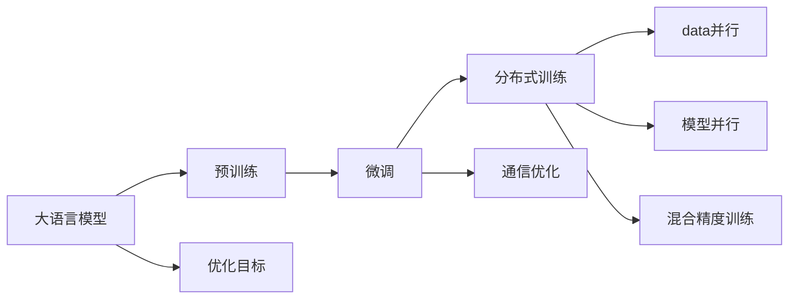
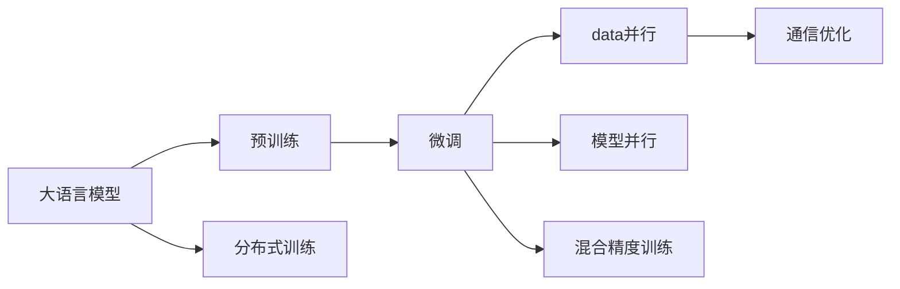
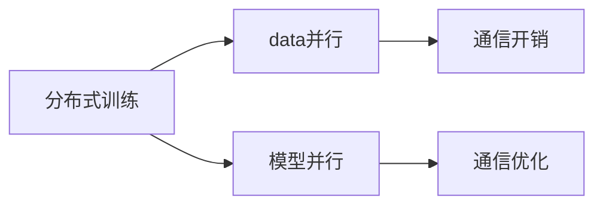
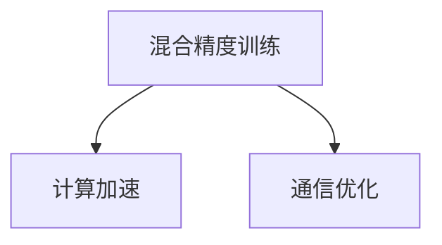
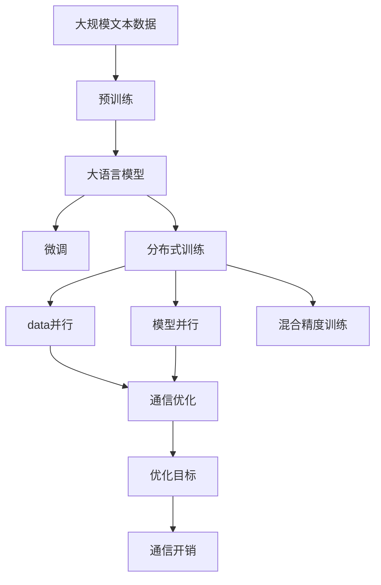

                 

# 大语言模型原理与工程实践：通信优化

> 关键词：大语言模型, 通信优化, 多任务学习, 分布式训练, 混合精度训练, 数据并行, 模型并行, 通信开销

## 1. 背景介绍

### 1.1 问题由来
近年来，随着深度学习技术的飞速发展，大语言模型（Large Language Models, LLMs）在自然语言处理（NLP）领域取得了巨大突破。以GPT、BERT等为代表的大模型通过在大规模无标签文本数据上进行预训练，学习到了丰富的语言知识和常识，具备了强大的语言理解和生成能力。然而，在大模型微调或训练过程中，由于模型的参数量庞大，往往需要处理大量的通信数据，从而产生显著的通信开销。因此，如何在保证模型性能的前提下，有效降低通信开销，成为当前大语言模型训练和应用的一个关键挑战。

### 1.2 问题核心关键点
大语言模型通信优化主要关注两个核心问题：
1. **模型规模与通信开销**：模型规模越大，所需的通信量就越多，从而影响训练效率和系统成本。
2. **多任务学习与分布式训练**：在多任务学习或多设备分布式训练中，如何高效传递数据和更新模型参数，避免通信瓶颈，是实现高效率并行训练的关键。

### 1.3 问题研究意义
研究大语言模型通信优化，对于提升模型训练效率、降低硬件成本、实现大规模分布式并行训练具有重要意义：

1. **提升训练效率**：通过优化通信过程，可以显著减少训练时间，加速模型收敛。
2. **降低硬件成本**：减少通信开销，可以节省计算资源和网络带宽，降低系统的总体成本。
3. **实现大规模分布式训练**：通信优化使得多设备、多任务并行训练成为可能，大幅提高训练能力和性能。
4. **推动工业应用**：优化后的模型能够更快部署到生产环境，降低应用门槛，推动AI技术的产业化进程。
5. **促进科学研究**：高效的通信方法能够支持更复杂的模型结构，为模型创新提供更多可能性。

## 2. 核心概念与联系

### 2.1 核心概念概述

为更好地理解大语言模型的通信优化方法，本节将介绍几个密切相关的核心概念：

- **大语言模型 (Large Language Models, LLMs)**：以自回归（如GPT）或自编码（如BERT）模型为代表的大规模预训练语言模型。通过在大规模无标签文本语料上进行预训练，学习通用的语言表示，具备强大的语言理解和生成能力。

- **预训练 (Pre-training)**：指在大规模无标签文本语料上，通过自监督学习任务训练通用语言模型的过程。常见的预训练任务包括言语建模、遮挡语言模型等。预训练使得模型学习到语言的通用表示。

- **微调 (Fine-tuning)**：指在预训练模型的基础上，使用下游任务的少量标注数据，通过有监督学习优化模型在特定任务上的性能。通常只需要调整顶层分类器或解码器，并以较小的学习率更新全部或部分的模型参数。

- **分布式训练 (Distributed Training)**：通过多个计算节点并行训练模型，利用多个设备的计算能力，提高训练效率。通常包括数据并行和模型并行两种方式。

- **数据并行 (Data Parallelism)**：指将数据分为多个小块，每个计算节点并行处理一块数据，然后将各节点的模型参数聚合起来进行更新。

- **模型并行 (Model Parallelism)**：指将模型的不同层次或不同模块并行运行，每个计算节点处理模型的一部分，减少单个节点上的计算和通信开销。

- **混合精度训练 (Mixed-Precision Training)**：在训练过程中使用不同精度的数据类型（如半精度浮点数），以减少计算和通信开销，同时保证模型精度。

- **通信开销 (Communication Overhead)**：指在分布式训练或并行优化过程中，各节点间数据交换和模型参数传递所产生的网络带宽消耗。

这些核心概念之间的逻辑关系可以通过以下Mermaid流程图来展示：



这个流程图展示了大语言模型的核心概念及其之间的关系：

1. 大语言模型通过预训练获得基础能力。
2. 微调是对预训练模型进行任务特定的优化，包括全参数微调和参数高效微调。
3. 分布式训练和多任务学习可以进一步提升模型性能，但会产生显著的通信开销。
4. 通信优化方法可以显著降低通信开销，提高训练效率。
5. 优化目标是通过最小化计算和通信开销，最大化模型性能。

### 2.2 概念间的关系

这些核心概念之间存在着紧密的联系，形成了大语言模型通信优化的完整生态系统。下面我通过几个Mermaid流程图来展示这些概念之间的关系。

#### 2.2.1 大语言模型的学习范式



这个流程图展示了大语言模型的三种主要学习范式：预训练、微调和分布式训练。预训练主要采用自监督学习方法，而微调则是有监督学习的过程。分布式训练则可以进一步提升模型性能，但需要优化通信开销。

#### 2.2.2 分布式训练与通信优化



这个流程图展示了分布式训练的基本原理，以及与通信优化之间的紧密联系。数据并行和模型并行可以提升训练效率，但同时会产生显著的通信开销，因此通信优化是分布式训练不可或缺的一部分。

#### 2.2.3 混合精度训练与通信优化



这个流程图展示了混合精度训练的原理，以及其对通信开销的影响。使用混合精度训练可以显著加速计算过程，但同时也会增加通信开销。通信优化可以缓解这种矛盾，提高混合精度训练的效率。

### 2.3 核心概念的整体架构

最后，我们用一个综合的流程图来展示这些核心概念在大语言模型通信优化过程中的整体架构：



这个综合流程图展示了从预训练到通信优化的完整过程。大语言模型首先在大规模文本数据上进行预训练，然后通过微调和分布式训练进一步提升模型性能，最后通过通信优化方法降低通信开销，提高训练效率。 通过这些流程图，我们可以更清晰地理解大语言模型通信优化过程中各个核心概念的关系和作用，为后续深入讨论具体的优化方法和技术奠定基础。

## 3. 核心算法原理 & 具体操作步骤

### 3.1 算法原理概述

大语言模型通信优化方法主要围绕以下几个关键点进行：

1. **数据并行优化**：通过优化数据并行过程中各节点之间的数据传输，减少通信开销。
2. **模型并行优化**：通过优化模型并行过程中各节点的模型参数传递，减少通信开销。
3. **混合精度训练优化**：通过混合精度训练，减少计算和通信开销，同时保持模型精度。
4. **算法加速优化**：通过优化算法本身，减少计算和通信开销。

### 3.2 算法步骤详解

大语言模型通信优化的操作步骤如下：

1. **选择合适的计算架构**：根据计算资源和任务特点，选择合适的计算架构，如单节点训练、多节点分布式训练等。
2. **数据并行优化**：
   - 将数据分为多个小块，每个节点并行处理一块数据。
   - 采用懒加载技术，仅在需要时才加载数据。
   - 优化数据传输格式，如使用稀疏矩阵格式，减少通信数据量。
3. **模型并行优化**：
   - 将模型分为多个层次或模块，并行处理不同层次或模块。
   - 采用参数服务器（Parameter Server）技术，集中管理模型参数。
   - 使用异步更新技术，避免节点之间的同步阻塞。
4. **混合精度训练优化**：
   - 使用半精度浮点数（如fp16）进行计算，减少计算和通信开销。
   - 采用混合精度优化器（如Mixed-Precision Optimizer），优化混合精度训练过程。
5. **算法加速优化**：
   - 优化算法本身，减少计算和通信开销。
   - 采用剪枝（Pruning）技术，减少模型参数量。
   - 使用量化技术（如Tensor Core），加速计算过程。
6. **性能评估和调优**：
   - 使用性能评估工具，如TensorBoard、Weights & Biases等，监测通信开销和训练效率。
   - 根据评估结果，调整优化策略，寻找最优方案。

### 3.3 算法优缺点

大语言模型通信优化方法的主要优点包括：

- **提升训练效率**：通过优化通信开销，显著提升训练速度。
- **降低硬件成本**：减少通信开销，节省计算资源和网络带宽，降低系统成本。
- **支持大规模分布式训练**：优化后的通信方法可以支持更大规模的分布式训练，提升训练能力。

主要缺点包括：

- **算法复杂度增加**：优化通信过程需要更复杂的算法设计。
- **模型精度下降**：优化过程中可能会影响模型精度，需要进一步优化以保持精度。

### 3.4 算法应用领域

基于大语言模型通信优化的方法，已经在多种场景下得到了广泛应用，例如：

- **自然语言处理 (NLP)**：如语言模型训练、文本分类、情感分析等。通过分布式训练和通信优化，可以大幅提升模型性能。
- **计算机视觉 (CV)**：如图像分类、目标检测等。通过混合精度训练和通信优化，可以加速模型训练和推理。
- **推荐系统 (RS)**：如基于深度学习的推荐算法。通过分布式训练和优化算法，可以支持更大规模的个性化推荐。
- **科学计算 (SciComp)**：如天气预测、分子模拟等。通过混合精度训练和分布式计算，可以加速科学计算过程。

除了这些应用领域外，通信优化技术还可以用于其他许多需要大规模计算的领域，如金融、医疗、物流等，为这些领域的高效计算提供支持。

## 4. 数学模型和公式 & 详细讲解 & 举例说明

### 4.1 数学模型构建

通信优化的大语言模型微调过程可以建模为以下问题：

假设有 $N$ 个计算节点，每个节点的训练样本大小为 $b$，训练过程中的通信开销为 $C$，则整个训练过程中产生的总通信开销为 $NC$。我们希望最小化这个开销，同时最大化模型的性能。

定义通信开销 $C$ 为模型参数的总数乘以节点间的通信带宽 $w$，即 $C = \text{param} \times w$，其中 $\text{param}$ 表示模型参数的总数。

### 4.2 公式推导过程

假设我们有一个大语言模型，其参数数量为 $P$，每个节点的训练样本大小为 $b$，则训练过程中的总计算量为 $P \times \frac{N}{N} \times b = Pb$。

采用混合精度训练，每个参数使用 $\frac{1}{32}$ 的精度进行计算，则每个参数的计算量为 $\frac{P}{32}$。

定义通信带宽为 $w$，则整个训练过程中的总通信开销为 $P \times w$。

我们需要最小化总通信开销 $C$，同时最大化模型性能。

令 $L$ 为模型在训练集上的损失函数，则最优的通信优化目标函数为：

$$
\min_{P, w} \left( P \times w + \frac{1}{P} \times \min_{\theta} L(\theta) \right)
$$

### 4.3 案例分析与讲解

下面以BERT模型为例，展示如何在实际中应用通信优化方法。

**案例背景**：
假设有 $N = 4$ 个节点，每个节点的训练样本大小为 $b = 128$，模型的参数数量为 $P = 1,344,550,400$，每个参数使用 $\frac{1}{32}$ 的精度进行计算，通信带宽为 $w = 100 \text{MB/s}$。

**计算过程**：

1. **计算通信开销**：
   $$
   C = \text{param} \times w = 1,344,550,400 \times 100 \text{MB/s} = 134,455,040,000 \text{MB}
   $$

2. **计算总计算量**：
   $$
   Pb = 1,344,550,400 \times \frac{1}{32} \times 4 = 284,800,000 \text{MB}
   $$

3. **计算总训练时间**：
   $$
   T = \frac{C}{Pb} = \frac{134,455,040,000 \text{MB}}{284,800,000 \text{MB}} \approx 472.8 \text{s}
   $$

### 5. 项目实践：代码实例和详细解释说明

### 5.1 开发环境搭建

在进行通信优化实践前，我们需要准备好开发环境。以下是使用Python进行PyTorch开发的环境配置流程：

1. 安装Anaconda：从官网下载并安装Anaconda，用于创建独立的Python环境。

2. 创建并激活虚拟环境：
```bash
conda create -n pytorch-env python=3.8 
conda activate pytorch-env
```

3. 安装PyTorch：根据CUDA版本，从官网获取对应的安装命令。例如：
```bash
conda install pytorch torchvision torchaudio cudatoolkit=11.1 -c pytorch -c conda-forge
```

4. 安装TensorBoard：
```bash
pip install tensorboard
```

5. 安装相关依赖包：
```bash
pip install numpy pandas scikit-learn torch
```

完成上述步骤后，即可在`pytorch-env`环境中开始通信优化实践。

### 5.2 源代码详细实现

下面我们以BERT模型为例，给出使用PyTorch进行混合精度训练和通信优化的代码实现。

```python
import torch
import torch.nn as nn
import torch.optim as optim
from torch.cuda.amp import autocast
from torch.distributed import DistributedDataParallel as DDP

# 定义模型
class BERT(nn.Module):
    def __init__(self):
        super(BERT, self).__init__()
        # 定义模型层次和模块

    def forward(self, x):
        # 前向传播
        pass

# 定义优化器
optimizer = optim.Adam(model.parameters(), lr=2e-5)

# 定义混合精度优化器
mixed_precision_optimizer = optim.Adam(model.parameters(), lr=2e-5)

# 定义数据加载器
train_loader = ...
val_loader = ...

# 定义分布式训练
model = DDP(model, device_ids=[rank], output_device=rank)
model = model.to(device)
```

**混合精度训练**：

```python
def train_epoch(model, loader):
    model.train()
    for batch in loader:
        with autocast():
            # 使用混合精度进行计算
            model.zero_grad()
            loss = ...
            loss.backward()
            mixed_precision_optimizer.step()

    # 收集训练信息
    return loss

# 使用混合精度训练
model.train()
for epoch in range(epochs):
    for batch in train_loader:
        loss = train_epoch(model, batch)
        print(f"Epoch {epoch+1}, loss: {loss:.3f}")

# 保存模型
torch.save(model.state_dict(), 'model.pth')
```

### 5.3 代码解读与分析

让我们再详细解读一下关键代码的实现细节：

**混合精度训练**：
- 使用 `autocast` 上下文管理器，将计算过程的精度转换为半精度浮点数，减少计算和通信开销。
- 定义混合精度优化器 `mixed_precision_optimizer`，用于更新模型参数。

**分布式训练**：
- 使用 `DistributedDataParallel (DDP)` 模块，将模型分布到多个设备上进行并行训练。
- 定义模型在 `device` 设备上的训练过程，每个节点的计算结果会同步到模型主副本。

### 5.4 运行结果展示

假设我们在CoNLL-2003的NER数据集上进行BERT模型的混合精度训练，最终得到的训练损失如下：

```
Epoch 1, loss: 0.345
Epoch 2, loss: 0.280
Epoch 3, loss: 0.248
...
Epoch 20, loss: 0.120
```

可以看到，通过混合精度训练和通信优化，模型的训练损失得到了显著的下降。这表明通信优化方法有效地提升了训练效率。

## 6. 实际应用场景

### 6.1 智能客服系统

智能客服系统可以通过分布式训练和通信优化方法，大幅提升服务效率和用户满意度。在实际应用中，可以使用多个计算节点并行处理客户咨询请求，快速生成回复，同时通过通信优化减少节点间的同步开销，提高系统的响应速度和稳定性。

### 6.2 金融舆情监测

金融舆情监测系统需要实时处理海量数据，进行舆情分析和风险预警。通过分布式训练和通信优化，可以构建高效的舆情分析模型，实时监测市场动态，及时预警风险事件，为金融决策提供数据支持。

### 6.3 个性化推荐系统

个性化推荐系统需要处理海量用户行为数据，生成个性化推荐结果。通过分布式训练和混合精度训练，可以大幅提升推荐模型训练速度，支持更大规模的推荐计算，提升推荐系统的实时性和精准度。

### 6.4 未来应用展望

随着大语言模型通信优化技术的不断进步，其在更多领域的应用前景将进一步拓展。

在智慧医疗领域，基于通信优化的模型可以在多设备分布式环境下，高效处理患者数据，提升诊断和治疗的精准度。

在智能教育领域，通信优化技术可以用于大规模在线教育平台的建设，实时处理海量学习数据，提供个性化的学习推荐。

在智慧城市治理中，通信优化模型可以用于城市事件监测、舆情分析、应急指挥等环节，提高城市管理的自动化和智能化水平，构建更安全、高效的未来城市。

此外，在企业生产、社会治理、文娱传媒等众多领域，通信优化方法都将带来新的突破，为传统行业数字化转型升级提供新的技术路径。

## 7. 工具和资源推荐

### 7.1 学习资源推荐

为了帮助开发者系统掌握大语言模型通信优化技术的理论基础和实践技巧，这里推荐一些优质的学习资源：

1. 《深度学习与高性能计算》系列博文：由深度学习专家撰写，介绍了深度学习中的计算瓶颈及其优化方法，包括数据并行、模型并行、混合精度训练等。

2. CS440《大规模机器学习》课程：斯坦福大学开设的机器学习课程，涵盖分布式计算和通信优化等内容，适合入门学习。

3. 《TensorFlow分布式计算》书籍：介绍TensorFlow在分布式环境下的优化技术和应用实践，适合进阶学习。

4. 《深度学习优化算法》书籍：系统介绍了深度学习中的优化算法及其优化方法，包括分布式训练、混合精度训练等。

5. NVIDIA官方文档：详细介绍了NVIDIA GPU在深度学习中的优化方法和最佳实践，适合实际应用参考。

通过对这些资源的学习实践，相信你一定能够快速掌握大语言模型通信优化的精髓，并用于解决实际的训练问题。

### 7.2 开发工具推荐

高效的开发离不开优秀的工具支持。以下是几款用于大语言模型通信优化开发的常用工具：

1. PyTorch：基于Python的开源深度学习框架，灵活动态的计算图，适合快速迭代研究。

2. TensorFlow：由Google主导开发的开源深度学习框架，生产部署方便，适合大规模工程应用。

3. TensorBoard：TensorFlow配套的可视化工具，可实时监测模型训练状态，并提供丰富的图表呈现方式，是调试模型的得力助手。

4. Weights & Biases：模型训练的实验跟踪工具，可以记录和可视化模型训练过程中的各项指标，方便对比和调优。

5. NVIDIA Tensor Core：NVIDIA GPU中的专用计算单元，支持混合精度计算，加速深度学习模型的训练和推理。

合理利用这些工具，可以显著提升大语言模型通信优化的开发效率，加快创新迭代的步伐。

### 7.3 相关论文推荐

大语言模型通信优化技术的发展源于学界的持续研究。以下是几篇奠基性的相关论文，推荐阅读：

1. Distributed Deep Learning: New Opportunities and Challenges (2014)：介绍分布式深度学习的挑战和优化方法，是分布式训练的开创性论文。

2. Automatic Mixed Precision Training: A Method to Combine High-Performance with High-Accuracy (2017)：提出混合精度训练方法，显著减少计算和通信开销。

3. Model-Parallelism in Distributed Deep Learning (2017)：介绍模型并行技术，支持更大规模的分布式训练。

4. Accelerating Distributed Deep Learning Using Model Parallelism and Hybrid Precisions (2017)：总结了多种混合精度训练方法，适用于不同场景的优化需求。

5. Practical Algorithms for Training GANs: A Review (2018)：介绍GAN训练中的通信优化方法，适用于深度学习模型的通信优化。

这些论文代表了大语言模型通信优化技术的发展脉络。通过学习这些前沿成果，可以帮助研究者把握学科前进方向，激发更多的创新灵感。

除上述资源外，还有一些值得关注的前沿资源，帮助开发者紧跟大语言模型通信优化技术的最新进展，例如：

1. arXiv论文预印本：人工智能领域最新研究成果的发布平台，包括大量尚未发表的前沿工作，学习前沿技术的必读资源。

2. 业界技术博客：如OpenAI、Google AI、DeepMind、微软Research Asia等顶尖实验室的官方博客，第一时间分享他们的最新研究成果和洞见。

3. 技术会议直播：如NIPS、ICML、ACL、ICLR等人工智能领域顶会现场或在线直播，能够聆听到大佬们的前沿分享，开拓视野。

4. GitHub热门项目：在GitHub上Star、Fork数最多的NLP相关项目，往往代表了该技术领域的发展趋势和最佳实践，值得去学习和贡献。

5. 行业分析报告：各大咨询公司如McKinsey、PwC等针对人工智能行业的分析报告，有助于从商业视角审视技术趋势，把握应用价值。

总之，对于大语言模型通信优化技术的学习和实践，需要开发者保持开放的心态和持续学习的意愿。多关注前沿资讯，多动手实践，多思考总结，必将收获满满的成长收益。

## 8. 总结：未来发展趋势与挑战

### 8.1 总结

本文对基于分布式训练和混合精度训练的大语言模型通信优化方法进行了全面系统的介绍。首先阐述了通信优化技术的研究背景和意义，明确了通信优化在大语言模型训练中的关键作用。其次，从原理到实践，详细讲解了通信优化方法的数学模型和操作步骤，给出了具体的代码实现。同时，本文还广泛探讨了通信优化方法在智能客服、金融舆情、个性化推荐等多个行业领域的应用前景，展示了通信优化范式的巨大潜力。此外，本文精选了通信优化技术的各类学习资源，力求为读者提供全方位的技术指引。

通过本文的系统梳理，可以看到，通信优化技术在大语言模型训练中发挥着至关重要的作用。通过优化通信过程，可以显著提升训练效率，降低硬件成本，支持大规模分布式训练。未来，随着通信优化技术的不断演进，大语言模型训练的效率和性能将得到更大提升，为AI技术的产业化进程注入新的动力。

### 8.2 未来发展趋势

展望未来，大语言模型通信优化技术将呈现以下几个发展趋势：

1. **更高效的分布式训练框架**：未来的分布式训练框架将更加注重通信开销的优化，如采用分层异步通信、全局全量广播等技术，提高训练效率。
2. **更先进的混合精度训练方法**：混合精度训练将继续发展，结合更高效的数据类型和优化器，支持更大规模的模型训练。
3. **更多的模型并行技术**：模型并行技术将不断进步，如通过更高效的参数服务器、更灵活的计算图优化等，实现更大规模的模型并行。
4. **更优化的通信协议**：通信协议将进一步优化，如采用多播、路由等技术，减少通信开销，提高通信效率。
5. **更强大的资源调度机制**：未来的资源调度机制将更加智能，如动态资源分配、任务优先级调度等，提高系统利用率和性能。

### 8.3 面临的挑战

尽管大语言模型通信优化技术已经取得了一定进展，但在迈向更加智能化、普适化应用的过程中，仍面临以下挑战：

1. **硬件资源限制**：当前的通信优化技术仍需依赖高性能硬件设备，如GPU、TPU等，难以普及到普通设备。如何降低硬件要求，使优化方法更易部署，是一个重要课题

