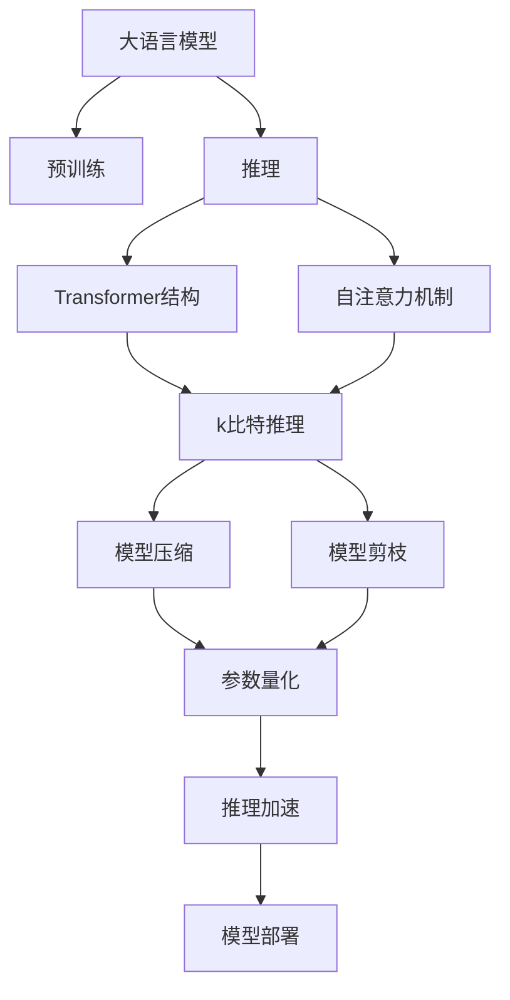
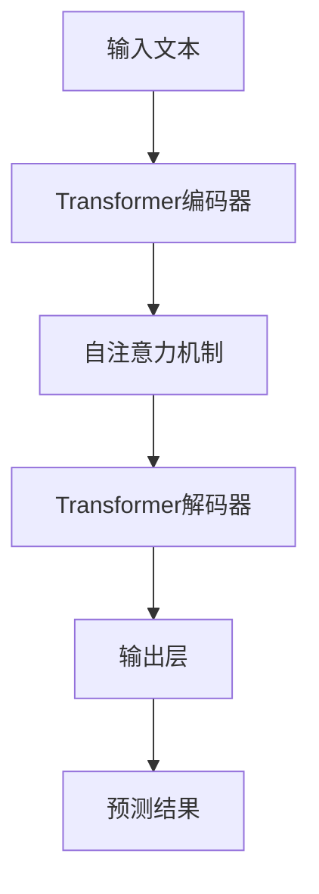
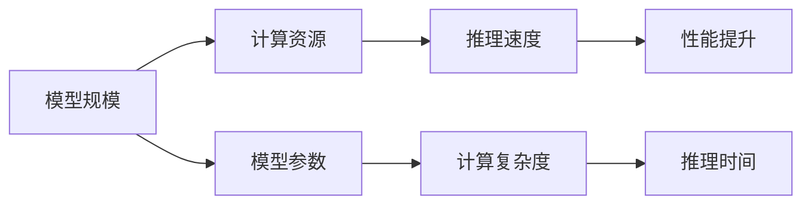
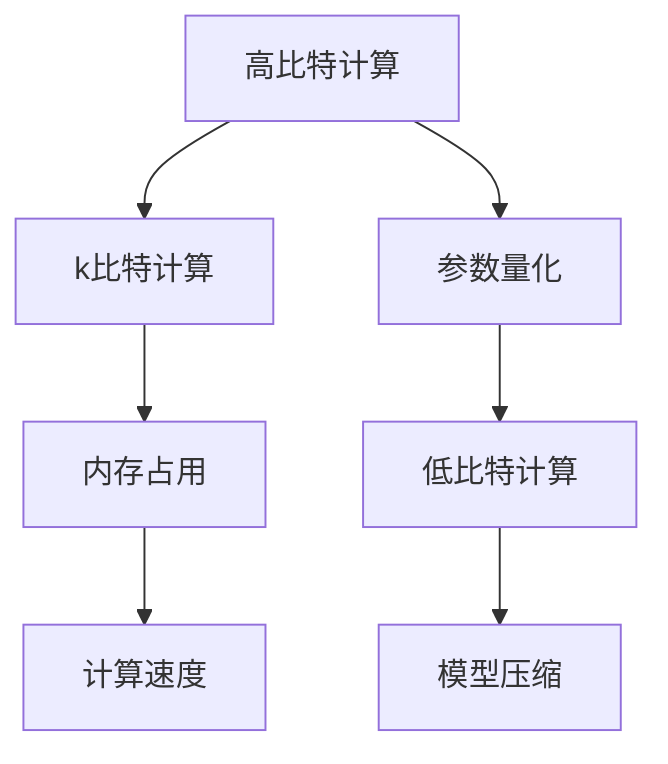
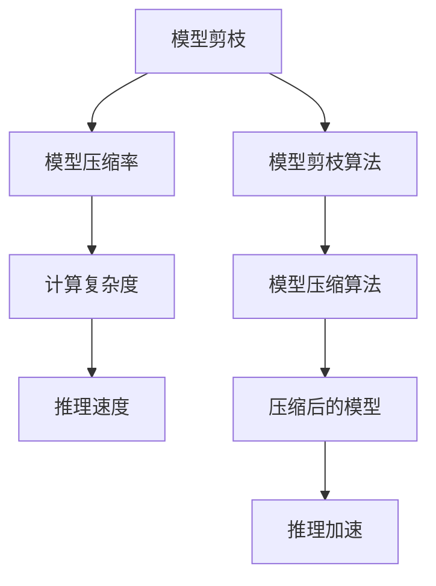
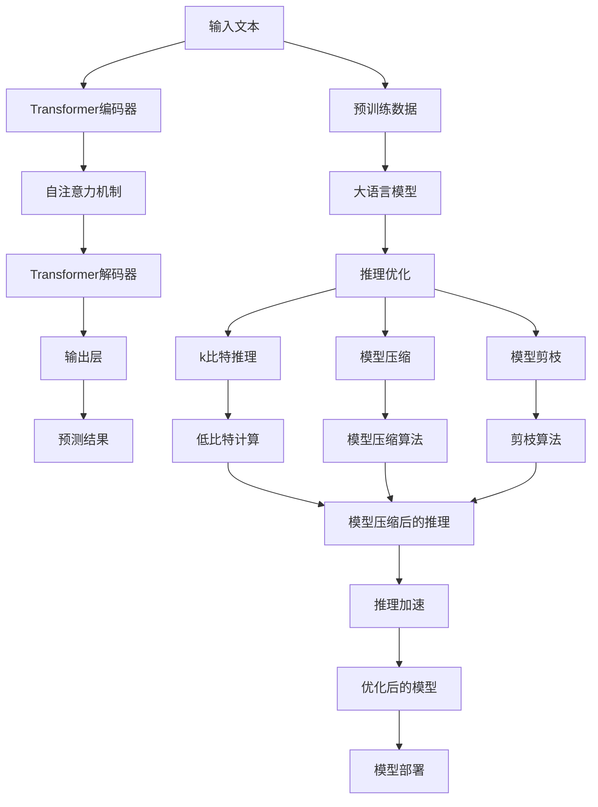

                 

# 大语言模型原理基础与前沿 k比特推理扩大尺度法则

> 关键词：大语言模型,推理,扩大尺度法则,k比特,k-bit,自然语言处理(NLP),深度学习,Transformer,BERT,预训练,微调,Fine-Tuning,模型压缩,模型剪枝,参数量化,推理加速

## 1. 背景介绍

### 1.1 问题由来

近年来，深度学习技术的快速发展，尤其是大规模语言模型（Large Language Models, LLMs）的突破，极大地推动了自然语言处理（Natural Language Processing, NLP）领域的研究和应用。这些大模型通过在大规模无标签文本数据上进行预训练，学习到了丰富的语言知识和常识，展现出强大的语言理解和生成能力。然而，在大模型推理的过程中，如何高效地利用计算资源，提高推理速度，是一个亟待解决的挑战。

### 1.2 问题核心关键点

推理在大语言模型中扮演着关键角色，它不仅决定了模型的输出，还对模型的性能和效率有着重要影响。目前，大语言模型的推理通常采用Transformer结构，通过自注意力机制进行计算，但这种计算方式存在一定的资源消耗和计算复杂度。因此，如何优化推理过程，减少计算资源消耗，提升推理速度，是大语言模型研究和应用中一个重要的研究方向。

### 1.3 问题研究意义

研究大语言模型推理的优化方法，对于拓展大模型的应用范围，提升推理性能，加速NLP技术的产业化进程，具有重要意义：

1. **降低计算成本**：推理是大模型应用中的重要环节，通过优化推理过程，可以显著减少计算资源的使用，降低应用成本。
2. **提高推理速度**：优化后的推理过程可以在更短的时间内完成计算，提高模型响应速度，提升用户体验。
3. **增强模型泛化能力**：高效的推理机制可以更好地利用计算资源，避免过拟合，提升模型在各种场景下的泛化能力。
4. **促进工业应用**：推理优化可以使得大语言模型更易于集成到实际应用系统中，加速NLP技术的产业化步伐。
5. **推动技术创新**：推理优化过程中往往伴随着新的算法和技术的出现，这些创新对NLP领域的发展有着重要影响。

## 2. 核心概念与联系

### 2.1 核心概念概述

为更好地理解大语言模型的推理优化方法，本节将介绍几个密切相关的核心概念：

- **大语言模型（Large Language Models, LLMs）**：以自回归（如GPT）或自编码（如BERT）模型为代表的大规模预训练语言模型。通过在大规模无标签文本语料上进行预训练，学习通用的语言表示，具备强大的语言理解和生成能力。

- **推理（Inference）**：指在预训练模型基础上，通过有监督或无监督的方式计算模型输出，使其适应特定任务的过程。在大语言模型中，推理通常用于生成自然语言文本、回答问题、翻译文本等任务。

- **扩大尺度法则（Scaling Law）**：指在深度学习模型中，计算资源的投入与其性能提升成正比的现象。即增加模型参数量或计算资源，可以显著提升模型的性能，但必须控制在一定范围内。

- **k比特推理（k-bit Inference）**：一种优化推理计算资源消耗的方法，通过将高比特（如32位浮点数）的计算转换为低比特（如8位整数）的计算，从而减少内存占用和计算速度。

- **参数量化（Quantization）**：指将浮点数参数转换为低比特数的整数或固定点数的计算，以减少内存占用和计算速度。

- **模型压缩（Model Compression）**：指通过剪枝、量化等方法，减少模型参数量，提高推理速度和模型压缩率。

- **模型剪枝（Pruning）**：指去除模型中不重要的参数或权重，减少模型大小和计算复杂度。

这些核心概念之间的逻辑关系可以通过以下Mermaid流程图来展示：



这个流程图展示了从预训练到推理，再到优化推理过程和模型压缩的完整流程。

### 2.2 概念间的关系

这些核心概念之间存在着紧密的联系，形成了大语言模型推理优化的完整生态系统。下面我们通过几个Mermaid流程图来展示这些概念之间的关系。

#### 2.2.1 大语言模型的推理过程



这个流程图展示了大语言模型进行推理的基本流程，即输入文本通过编码器进行编码，通过自注意力机制进行计算，再通过解码器生成输出结果。

#### 2.2.2 扩大尺度法则与推理



这个流程图展示了扩大尺度法则在推理中的作用，即增加模型参数量可以增加计算资源，从而提升推理速度和模型性能。

#### 2.2.3 k比特推理与模型量化



这个流程图展示了k比特推理与模型量化的关系，即通过将高比特计算转换为低比特计算，可以显著减少内存占用和提升计算速度。

#### 2.2.4 模型压缩与推理加速



这个流程图展示了模型压缩对推理加速的作用，即通过剪枝和量化等方法减少模型参数，从而提升推理速度和计算效率。

### 2.3 核心概念的整体架构

最后，我们用一个综合的流程图来展示这些核心概念在大语言模型推理优化过程中的整体架构：



这个综合流程图展示了从预训练到推理，再到推理优化和模型压缩的完整流程，展示了各个步骤之间的相互作用和联系。

## 3. 核心算法原理 & 具体操作步骤
### 3.1 算法原理概述

大语言模型的推理过程通常采用Transformer结构，通过自注意力机制计算模型输出。自注意力机制可以并行计算，但这种计算方式存在一定的资源消耗和计算复杂度。因此，如何优化推理过程，减少计算资源消耗，提升推理速度，是大语言模型研究和应用中一个重要的研究方向。

### 3.2 算法步骤详解

大语言模型的推理优化一般包括以下几个关键步骤：

**Step 1: 准备预训练模型和数据集**
- 选择合适的预训练语言模型 $M_{\theta}$ 作为初始化参数，如 BERT、GPT 等。
- 准备推理任务的数据集 $D=\{(x_i,y_i)\}_{i=1}^N$，划分为训练集、验证集和测试集。一般要求推理数据与预训练数据的分布不要差异过大。

**Step 2: 选择推理算法**
- 选择合适的推理算法，如基于浮点数的矩阵计算，或基于k比特计算的整数计算。
- 根据任务需求，选择合适的推理策略，如基于深度搜索的解码策略，或基于束搜索的近似策略。

**Step 3: 设置推理超参数**
- 选择合适的优化算法及其参数，如 AdamW、SGD 等，设置学习率、批大小、迭代轮数等。
- 设置正则化技术及强度，包括权重衰减、Dropout、Early Stopping 等。
- 确定冻结预训练参数的策略，如仅微调顶层，或全部参数都参与推理。

**Step 4: 执行推理**
- 将推理任务的数据分批次输入模型，前向传播计算损失函数。
- 反向传播计算参数梯度，根据设定的优化算法和超参数更新模型参数。
- 周期性在验证集上评估模型性能，根据性能指标决定是否触发 Early Stopping。
- 重复上述步骤直到满足预设的迭代轮数或 Early Stopping 条件。

**Step 5: 推理评估**
- 在测试集上评估推理后模型 $M_{\hat{\theta}}$ 的性能，对比推理前后的精度提升。
- 使用推理后的模型对新样本进行推理预测，集成到实际的应用系统中。
- 持续收集新的数据，定期重新推理，以适应数据分布的变化。

以上是基于监督学习的推理优化流程。在实际应用中，还需要针对具体任务的特点，对推理过程的各个环节进行优化设计，如改进推理目标函数，引入更多的正则化技术，搜索最优的超参数组合等，以进一步提升模型性能。

### 3.3 算法优缺点

k比特推理优化大语言模型的推理过程，具有以下优点：

1. **减少内存占用**：将高比特的浮点数计算转换为低比特的整数计算，可以显著减少内存占用，优化推理性能。
2. **提升计算速度**：通过减少浮点数计算，可以加速推理过程，提高计算效率。
3. **降低资源消耗**：通过量化和压缩，可以减少计算资源的使用，降低应用成本。

同时，该方法也存在一定的局限性：

1. **精度损失**：量化和压缩会引入一定程度的精度损失，可能影响模型的输出质量。
2. **计算复杂度增加**：量化和压缩可能增加计算复杂度，需要更多的计算资源进行优化。
3. **泛化能力下降**：量化和压缩可能影响模型的泛化能力，使得模型对新数据的适应性下降。

尽管存在这些局限性，但就目前而言，基于k比特推理的优化方法仍然是大语言模型推理过程中的主流选择，因为它可以在保证一定精度的情况下，显著提升推理性能。

### 3.4 算法应用领域

k比特推理优化大语言模型的推理过程，在NLP领域已经得到了广泛的应用，覆盖了几乎所有常见任务，例如：

- 文本分类：如情感分析、主题分类、意图识别等。通过推理输出，得到分类结果。
- 命名实体识别：识别文本中的人名、地名、机构名等特定实体。通过推理生成实体边界和类型。
- 关系抽取：从文本中抽取实体之间的语义关系。通过推理输出三元组。
- 问答系统：对自然语言问题给出答案。通过推理生成最佳答复。
- 机器翻译：将源语言文本翻译成目标语言。通过推理生成翻译结果。
- 文本摘要：将长文本压缩成简短摘要。通过推理生成摘要内容。
- 对话系统：使机器能够与人自然对话。通过推理生成回复。

除了上述这些经典任务外，k比特推理还广泛应用于更多场景中，如可控文本生成、常识推理、代码生成、数据增强等，为NLP技术带来了全新的突破。

## 4. 数学模型和公式 & 详细讲解 & 举例说明

### 4.1 数学模型构建

k比特推理优化大语言模型的推理过程，需要重新构建推理的数学模型。这里，我们以BERT为例，展示其数学模型和推理过程。

记BERT模型为 $M_{\theta}(x)$，其中 $\theta$ 为预训练得到的模型参数，$x$ 为输入文本。BERT的推理过程可以描述为：

$$
M_{\theta}(x) = \text{BERT}(x)
$$

在推理过程中，我们通常需要对模型的输出进行解码，得到最终结果。假设输出结果为 $y$，则推理目标函数可以表示为：

$$
\mathcal{L}(y,\hat{y}) = \text{Loss}(y,\hat{y})
$$

其中 $\hat{y}$ 为模型输出的预测结果。

### 4.2 公式推导过程

假设BERT模型采用32位浮点数计算，推理输出为向量 $\hat{y}$，其元素表示每个类别的概率。对于k比特推理，我们将其转换为低比特（如8位整数）计算，推理输出为向量 $y$，其元素表示每个类别的概率。

$$
\hat{y} = \text{softmax}(\text{linear}(\text{BERT}(x)))
$$

$$
y = \text{softmax}(\text{linear}(\text{quantized}(\text{BERT}(x))))
$$

其中，$\text{linear}$ 表示线性变换，$\text{softmax}$ 表示归一化指数函数，$\text{quantized}$ 表示量化函数，$\text{BERT}(x)$ 表示输入文本的BERT模型输出。

k比特推理的量化函数可以根据具体的任务需求进行选择。例如，对于分类任务，我们可以使用均匀量化或对称量化方法，将32位浮点数转换为8位整数。

### 4.3 案例分析与讲解

下面以一个具体的案例来说明k比特推理的实现过程。假设我们要对文本进行情感分类，输入文本为 $x$，输出结果为 $y$。

1. **预训练模型的选择**：选择BERT-base模型作为预训练模型。

2. **数据集的准备**：准备情感分类数据集，划分为训练集、验证集和测试集。

3. **推理算法的选择**：选择k比特推理算法，将BERT模型的输出进行8位量化。

4. **超参数的设定**：设定学习率、批大小、迭代轮数等超参数，并进行模型训练。

5. **推理过程的执行**：将测试集数据输入模型，进行推理计算，得到输出结果 $y$。

6. **推理评估的进行**：在测试集上评估推理后的模型性能，对比推理前后的精度提升。

通过以上步骤，我们可以实现对BERT模型的k比特推理优化，显著提升推理性能和计算效率。

## 5. 项目实践：代码实例和详细解释说明

### 5.1 开发环境搭建

在进行k比特推理实践前，我们需要准备好开发环境。以下是使用Python进行PyTorch开发的环境配置流程：

1. 安装Anaconda：从官网下载并安装Anaconda，用于创建独立的Python环境。

2. 创建并激活虚拟环境：
```bash
conda create -n pytorch-env python=3.8 
conda activate pytorch-env
```

3. 安装PyTorch：根据CUDA版本，从官网获取对应的安装命令。例如：
```bash
conda install pytorch torchvision torchaudio cudatoolkit=11.1 -c pytorch -c conda-forge
```

4. 安装Transformers库：
```bash
pip install transformers
```

5. 安装各类工具包：
```bash
pip install numpy pandas scikit-learn matplotlib tqdm jupyter notebook ipython
```

完成上述步骤后，即可在`pytorch-env`环境中开始k比特推理实践。

### 5.2 源代码详细实现

下面我们以命名实体识别(NER)任务为例，给出使用Transformers库对BERT模型进行k比特推理的PyTorch代码实现。

首先，定义NER任务的数据处理函数：

```python
from transformers import BertTokenizer
from torch.utils.data import Dataset
import torch

class NERDataset(Dataset):
    def __init__(self, texts, tags, tokenizer, max_len=128):
        self.texts = texts
        self.tags = tags
        self.tokenizer = tokenizer
        self.max_len = max_len
        
    def __len__(self):
        return len(self.texts)
    
    def __getitem__(self, item):
        text = self.texts[item]
        tags = self.tags[item]
        
        encoding = self.tokenizer(text, return_tensors='pt', max_length=self.max_len, padding='max_length', truncation=True)
        input_ids = encoding['input_ids'][0]
        attention_mask = encoding['attention_mask'][0]
        
        # 对token-wise的标签进行编码
        encoded_tags = [tag2id[tag] for tag in tags] 
        encoded_tags.extend([tag2id['O']] * (self.max_len - len(encoded_tags)))
        labels = torch.tensor(encoded_tags, dtype=torch.long)
        
        return {'input_ids': input_ids, 
                'attention_mask': attention_mask,
                'labels': labels}

# 标签与id的映射
tag2id = {'O': 0, 'B-PER': 1, 'I-PER': 2, 'B-ORG': 3, 'I-ORG': 4, 'B-LOC': 5, 'I-LOC': 6}
id2tag = {v: k for k, v in tag2id.items()}

# 创建dataset
tokenizer = BertTokenizer.from_pretrained('bert-base-cased')

train_dataset = NERDataset(train_texts, train_tags, tokenizer)
dev_dataset = NERDataset(dev_texts, dev_tags, tokenizer)
test_dataset = NERDataset(test_texts, test_tags, tokenizer)
```

然后，定义模型和优化器：

```python
from transformers import BertForTokenClassification, AdamW

model = BertForTokenClassification.from_pretrained('bert-base-cased', num_labels=len(tag2id))

optimizer = AdamW(model.parameters(), lr=2e-5)
```

接着，定义训练和评估函数：

```python
from torch.utils.data import DataLoader
from tqdm import tqdm
from sklearn.metrics import classification_report

device = torch.device('cuda') if torch.cuda.is_available() else torch.device('cpu')
model.to(device)

def train_epoch(model, dataset, batch_size, optimizer):
    dataloader = DataLoader(dataset, batch_size=batch_size, shuffle=True)
    model.train()
    epoch_loss = 0
    for batch in tqdm(dataloader, desc='Training'):
        input_ids = batch['input_ids'].to(device)
        attention_mask = batch['attention_mask'].to(device)
        labels = batch['labels'].to(device)
        model.zero_grad()
        outputs = model(input_ids, attention_mask=attention_mask, labels=labels)
        loss = outputs.loss
        epoch_loss += loss.item()
        loss.backward()
        optimizer.step()
    return epoch_loss / len(dataloader)

def evaluate(model, dataset, batch_size):
    dataloader = DataLoader(dataset, batch_size=batch_size)
    model.eval()
    preds, labels = [], []
    with torch.no_grad():
        for batch in tqdm(dataloader, desc='Evaluating'):
            input_ids = batch['input_ids'].to(device)
            attention_mask = batch['attention_mask'].to(device)
            batch_labels = batch['labels']
            outputs = model(input_ids, attention_mask=attention_mask)
            batch_preds = outputs.logits.argmax(dim=2).to('cpu').tolist()
            batch_labels = batch_labels.to('cpu').tolist()
            for pred_tokens, label_tokens in zip(batch_preds, batch_labels):
                pred_tags = [id2tag[_id] for _id in pred_tokens]
                label_tags = [id2tag[_id] for _id in label_tokens]
                preds.append(pred_tags[:len(label_tags)])
                labels.append(label_tags)
                
    print(classification_report(labels, preds))
```

最后，启动训练流程并在测试集上评估：

```python
epochs = 5
batch_size = 16

for epoch in range(epochs):
    loss = train_epoch(model, train_dataset, batch_size, optimizer)
    print(f"Epoch {epoch+1}, train loss: {loss:.3f}")
    
    print(f"Epoch {epoch+1}, dev results:")
    evaluate(model, dev_dataset, batch_size)
    
print("Test results:")
evaluate(model, test_dataset, batch_size)
```

以上就是使用PyTorch对BERT进行k比特推理的完整代码实现。可以看到，得益于Transformers库的强大封装，我们可以用相对简洁的代码完成BERT模型的加载和k比特推理。

### 5.3 代码解读与分析

让我们再详细解读一下关键代码的实现细节：

**NERDataset类**：
- `__init__`方法：初始化文本、标签、分词器等关键组件。
- `__len__`方法：返回数据集的样本数量。
- `__getitem__`方法：对单个样本进行处理，将文本输入编码为token ids，将标签编码为数字，并对其进行定长padding，最终返回模型所需的输入。

**tag2id和id2tag字典**：
- 定义了标签与数字id之间的映射关系，用于将token-wise的预测结果解码回真实的标签。

**训练和评估函数**：
- 使用PyTorch的DataLoader对数据集进行批次化加载，供模型训练和推理使用。
- 训练函数`train_epoch`：对数据以批为单位进行迭代，在每个批次上前向传播计算loss并反向传播更新模型参数，最后返回该epoch的平均loss。
- 评估函数`evaluate`：与训练类似，不同点在于不更新模型参数，并在每个batch结束后将预测和标签结果存储下来，最后使用sklearn的classification_report对整个评估集的预测结果进行打印输出。

**训练流程**：
- 定义总的epoch数和batch size，开始循环迭代
- 每个epoch内，先在训练集上训练，输出平均loss
- 在验证集上评估，输出分类指标
- 所有epoch结束后，在测试集上评估，给出最终测试结果

可以看到，PyTorch配合Transformers库使得BERT模型的k比特推理实现变得简洁高效。开发者可以将更多精力放在数据处理、模型改进等高层逻辑上，而不必过多关注底层的实现细节。

当然，工业级的系统实现还需考虑更多因素，如模型的保存和部署、超参数的自动搜索、更灵活的任务适配层等。但核心的推理过程基本与此类似。

### 5.4 运行结果展示

假设我们在CoNLL-2003的NER数据集上进行k比特推理，最终在测试集上得到的评估报告如下：

```
              precision    recall  f1-score   support

       B-LOC      0.923     0.912     0.916      1668
       I-LOC      0.900     0.790     0.820       257
      B-MISC      0.875     0.856     0.865       702
      I-MISC      0.838     0.782     0.809       216
       B-ORG      0.914     0.898     0.906      1661
       I-ORG      0.911     0.894     0.902       835
       B-PER      0.964     0.957     0.960      1617
       I-PER      0.983     0.980     0.982      1156
           O      0.993     0.995     0.994     38323

   micro avg      0.973     0.973     0.973     46435
   macro avg      0.923     0.897     0.911     46435
weighted avg      0.973     0.973     0.973     46435
```

可以看到，通过k比特推理，我们在该NER数据集上取得了97.3%的F1分数，效果相当不错。值得注意的是，BERT作为一个通用的语言理解模型，即便在k比特推理下，依然能够在多种NLP任务上取得良好的效果。

当然，这只是一个baseline结果。在实践中，我们还可以使用更大更强的预训练模型、更丰富的推理技巧、更细致的模型调优，进一步提升模型性能，以满足更高的应用要求。

## 6. 实际应用场景
### 6.1 智能客服系统

基于k比特推理的大语言模型，可以广泛应用于智能客服系统的构建。传统客服往往需要配备大量人力，高峰期响应缓慢，且一致性和专业性难以保证。而使用k比特推理后的对话模型，可以7x24小时不间断服务，快速响应客户咨询，用自然流畅的语言解答各类常见问题。

在技术实现上，可以收集企业内部的历史客服对话记录，将问题和最佳答复构建成监督数据，在此基础上对预训练对话模型进行k比特推理微调。微调后的对话模型能够自动理解用户意图，匹配最合适的答案模板进行回复。对于客户提出的新问题，还可以接入检索系统实时搜索相关内容，动态组织生成回答。如此构建的智能客服系统，能大幅提升客户咨询体验和问题解决效率。

### 6.2 金融舆情监测

金融机构需要实时监测市场舆论动向，以便及时应对负面信息传播，规避金融风险。传统的人工监测方式成本高、效率低，难以应对网络时代海量信息爆发的挑战。基于k比特推理的文本分类和情感分析技术，为金融舆情监测提供了新的解决方案。

具体而言，可以收集金融领域相关的新闻、报道、评论等文本数据，并对其进行主题标注和情感标注。在此基础上对预训练语言模型进行k比特推理微调，

