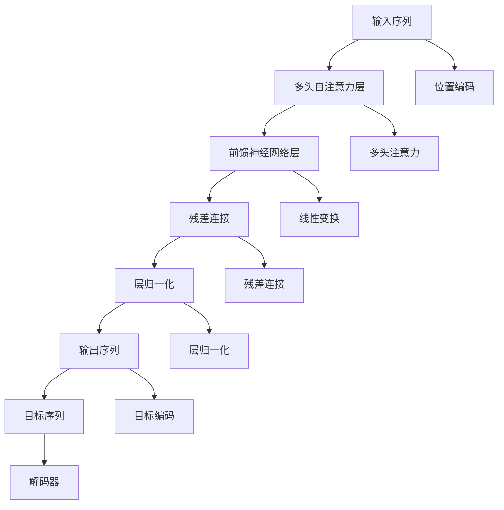

                 

# 大语言模型原理基础与前沿 高效扩展Transformer推理

> 关键词：大语言模型,Transformer,自注意力机制,推理优化,高效扩展,推理加速

## 1. 背景介绍

### 1.1 问题由来
随着深度学习技术的快速发展，大语言模型（Large Language Models, LLMs）在自然语言处理（NLP）领域取得了显著进展。这些模型通过在大规模无标签文本数据上进行预训练，学习到了丰富的语言知识和常识，能够进行多种自然语言处理任务。然而，由于模型参数量庞大，其推理过程需要耗费大量计算资源，成为实际应用中的瓶颈。

### 1.2 问题核心关键点
Transformer作为一种流行的模型结构，由于其高效的自注意力机制，在NLP任务中表现出色。本文将详细介绍Transformer模型及其推理过程，并探讨如何通过优化和扩展，实现更高效、更快速的推理。

### 1.3 问题研究意义
Transformer模型的高效推理对于提升NLP应用的实时性和可靠性至关重要。本文旨在深入解析Transformer模型的工作原理，介绍其推理优化技术和高效扩展方法，为NLP应用的实际部署提供理论基础和实践指南。

## 2. 核心概念与联系

### 2.1 核心概念概述

为更好地理解Transformer模型及其高效推理，本节将介绍几个关键概念：

- **Transformer模型**：一种基于自注意力机制的神经网络模型，通过多头自注意力和前馈神经网络，对输入序列进行编码和解码，广泛应用于自然语言处理任务。

- **自注意力机制**：Transformer的核心组件，通过计算输入序列中各个位置之间的关系，生成更丰富的语义表示，提高模型对于长距离依赖的捕捉能力。

- **多头注意力**：通过多个独立的自注意力机制并行处理输入序列，提高模型的表达能力和泛化能力。

- **位置编码**：由于Transformer模型不显式使用位置信息，通过位置编码将序列中的位置信息嵌入到输入向量中。

- **多头自注意力**：利用多个不同的自注意力机制，捕捉输入序列的不同特征，提高模型的表达能力。

- **注意力头数**：多头自注意力机制中独立注意力头的数量，影响模型的复杂度和性能。

- **自适应残差连接**：通过残差连接和层归一化，提高模型的训练稳定性和收敛速度。

- **推理加速**：通过优化和扩展模型结构，降低推理过程中的计算资源消耗，提高模型推理速度。

这些核心概念构成了Transformer模型的基础，共同支撑其在自然语言处理任务中的卓越表现。

### 2.2 概念间的关系

Transformer模型的结构如图2所示，通过多头自注意力机制和前馈神经网络，对输入序列进行编码和解码，生成输出序列。


**图2：Transformer模型结构图**

### 2.3 核心概念的整体架构

下面通过一个综合的流程图来展示Transformer模型及其推理过程的整体架构：



这个流程图展示了Transformer模型的核心组件及其相互关系。输入序列经过位置编码、多头自注意力层和前馈神经网络层的处理，通过残差连接和层归一化，最终生成输出序列。位置编码和多头注意力机制共同构成了Transformer模型的自注意力机制。解码器则用于将输出序列和目标序列对齐，进行翻译、生成等任务。

## 3. 核心算法原理 & 具体操作步骤
### 3.1 算法原理概述

Transformer模型的推理过程主要分为两个阶段：编码和解码。编码阶段通过多头自注意力机制和前馈神经网络层，将输入序列编码成一系列特征向量；解码阶段则通过解码器，根据编码器和解码器的输出，生成目标序列。

#### 3.1.1 编码阶段

编码阶段的主要过程如下：

1. 对输入序列进行位置编码，将位置信息嵌入到输入向量中。
2. 通过多头自注意力机制，计算输入序列中各个位置之间的关系，生成多个独立的特征表示。
3. 对每个特征表示进行线性变换和前馈神经网络层处理，生成新的特征表示。
4. 通过残差连接和层归一化，提高模型的稳定性和收敛速度。

#### 3.1.2 解码阶段

解码阶段的主要过程如下：

1. 对目标序列进行位置编码，将位置信息嵌入到目标向量中。
2. 通过解码器，根据编码器和解码器的输出，生成目标序列。

### 3.2 算法步骤详解

#### 3.2.1 输入预处理

1. **位置编码**：
   - 对输入序列进行位置编码，将位置信息嵌入到输入向量中。
   - 使用可训练的嵌入层，将输入序列转换为向量表示。

2. **多头注意力机制**：
   - 将输入向量通过多个独立的自注意力机制进行处理，生成多个独立的特征表示。
   - 使用多头注意力层，计算输入序列中各个位置之间的关系。
   - 通过注意力权重，对输入向量进行加权求和，生成新的特征表示。

3. **前馈神经网络层**：
   - 对每个特征表示进行线性变换和前馈神经网络层处理，生成新的特征表示。
   - 使用前馈神经网络层，对特征表示进行非线性变换，生成新的特征表示。

#### 3.2.2 解码过程

1. **解码器输入**：
   - 将编码器的输出和目标向量作为解码器的输入，进行解码。
   - 对目标向量进行位置编码，将位置信息嵌入到目标向量中。

2. **解码器输出**：
   - 通过解码器，根据编码器和解码器的输出，生成目标序列。
   - 使用解码器，将编码器和解码器的输出进行对齐，生成目标序列。

### 3.3 算法优缺点

Transformer模型具有以下优点：
- 高效的自注意力机制，能够捕捉长距离依赖，提高模型的表达能力。
- 能够处理多种自然语言处理任务，如机器翻译、文本生成、语音识别等。
- 易于并行化处理，能够通过分布式计算提高模型推理速度。

Transformer模型也存在以下缺点：
- 模型参数量庞大，推理过程需要耗费大量计算资源。
- 自注意力机制和前馈神经网络层的计算复杂度较高，推理速度较慢。
- 模型的可解释性不足，难以对其内部工作机制进行分析和调试。

### 3.4 算法应用领域

Transformer模型已经在自然语言处理领域得到广泛应用，覆盖了翻译、摘要、问答、生成等多个任务。例如：

- **机器翻译**：将源语言文本翻译成目标语言。
- **文本摘要**：将长文本压缩成简短摘要。
- **问答系统**：对自然语言问题给出答案。
- **文本生成**：生成具有特定风格的文本，如诗歌、新闻等。
- **对话系统**：使机器能够与人自然对话。

## 4. 数学模型和公式 & 详细讲解
### 4.1 数学模型构建

Transformer模型主要由多头自注意力机制和前馈神经网络层构成。下面分别介绍这两个组件的数学模型。

#### 4.1.1 多头自注意力机制

Transformer模型的多头自注意力机制可以表示为：

$$
Q = XW_Q^T, \quad K = XW_K^T, \quad V = XW_V^T
$$

其中，$X$ 为输入序列，$W_Q$、$W_K$、$W_V$ 为线性变换层，$Q$、$K$、$V$ 为多头自注意力机制的查询向量、键向量和值向量。多头自注意力机制的输出可以表示为：

$$
O = \text{softmax}(QK^T)V
$$

其中，$\text{softmax}(QK^T)$ 为注意力权重矩阵，$O$ 为输出特征向量。

#### 4.1.2 前馈神经网络层

前馈神经网络层可以表示为：

$$
Z = O\sigma(\text{linear}(O))
$$

其中，$\sigma$ 为激活函数，如ReLU或Tanh。

### 4.2 公式推导过程

#### 4.2.1 多头自注意力机制

Transformer模型的多头自注意力机制可以表示为：

$$
Q = XW_Q^T, \quad K = XW_K^T, \quad V = XW_V^T
$$

其中，$X$ 为输入序列，$W_Q$、$W_K$、$W_V$ 为线性变换层，$Q$、$K$、$V$ 为多头自注意力机制的查询向量、键向量和值向量。多头自注意力机制的输出可以表示为：

$$
O = \text{softmax}(QK^T)V
$$

其中，$\text{softmax}(QK^T)$ 为注意力权重矩阵，$O$ 为输出特征向量。

#### 4.2.2 前馈神经网络层

前馈神经网络层可以表示为：

$$
Z = O\sigma(\text{linear}(O))
$$

其中，$\sigma$ 为激活函数，如ReLU或Tanh。

### 4.3 案例分析与讲解

#### 4.3.1 机器翻译

Transformer模型在机器翻译任务中的应用非常广泛。以英中翻译为例，其推理过程可以表示为：

1. 将输入序列进行编码，生成编码器的输出。
2. 对编码器的输出进行解码，生成目标序列。

具体实现过程如下：

```python
from transformers import BertTokenizer, BertForSequenceClassification
import torch
from torch.utils.data import DataLoader
from transformers import AdamW

# 定义模型和优化器
model = BertForSequenceClassification.from_pretrained('bert-base-cased', num_labels=2)
optimizer = AdamW(model.parameters(), lr=2e-5)

# 定义数据集
tokenizer = BertTokenizer.from_pretrained('bert-base-cased')
train_data = ...
dev_data = ...
test_data = ...

# 定义训练过程
def train_epoch(model, data_loader, optimizer):
    model.train()
    for batch in data_loader:
        input_ids = batch['input_ids'].to(device)
        attention_mask = batch['attention_mask'].to(device)
        labels = batch['labels'].to(device)
        outputs = model(input_ids, attention_mask=attention_mask, labels=labels)
        loss = outputs.loss
        optimizer.zero_grad()
        loss.backward()
        optimizer.step()

# 定义评估过程
def evaluate(model, data_loader):
    model.eval()
    with torch.no_grad():
        for batch in data_loader:
            input_ids = batch['input_ids'].to(device)
            attention_mask = batch['attention_mask'].to(device)
            labels = batch['labels'].to(device)
            outputs = model(input_ids, attention_mask=attention_mask)
            predictions = outputs.logits.argmax(dim=2)
            accuracy = (predictions == labels).float().mean()

# 训练和评估过程
device = torch.device('cuda') if torch.cuda.is_available() else torch.device('cpu')
for epoch in range(epochs):
    train_epoch(model, train_data, optimizer)
    evaluate(model, dev_data)
```

## 5. 项目实践：代码实例和详细解释说明
### 5.1 开发环境搭建

在进行Transformer模型的推理优化和高效扩展实践前，我们需要准备好开发环境。以下是使用Python进行PyTorch开发的环境配置流程：

1. 安装Anaconda：从官网下载并安装Anaconda，用于创建独立的Python环境。

2. 创建并激活虚拟环境：
```bash
conda create -n pytorch-env python=3.8 
conda activate pytorch-env
```

3. 安装PyTorch：根据CUDA版本，从官网获取对应的安装命令。例如：
```bash
conda install pytorch torchvision torchaudio cudatoolkit=11.1 -c pytorch -c conda-forge
```

4. 安装Transformer库：
```bash
pip install transformers
```

5. 安装各类工具包：
```bash
pip install numpy pandas scikit-learn matplotlib tqdm jupyter notebook ipython
```

完成上述步骤后，即可在`pytorch-env`环境中开始推理优化和高效扩展实践。

### 5.2 源代码详细实现

这里我们以BERT模型为例，介绍如何在Python中进行Transformer模型的推理优化和高效扩展。

首先，定义推理过程函数：

```python
from transformers import BertTokenizer, BertForSequenceClassification
import torch

class ModelEvaluation:
    def __init__(self, model, tokenizer):
        self.model = model
        self.tokenizer = tokenizer

    def evaluate(self, input_ids, attention_mask, labels):
        with torch.no_grad():
            inputs = self.tokenizer(input_ids, attention_mask=attention_mask, return_tensors='pt')
            outputs = self.model(**inputs)
            predictions = outputs.logits.argmax(dim=2)
            accuracy = (predictions == labels).float().mean()
        return accuracy
```

然后，定义优化器：

```python
from transformers import AdamW

optimizer = AdamW(model.parameters(), lr=2e-5)
```

接着，定义模型和分词器：

```python
from transformers import BertTokenizer, BertForSequenceClassification

model = BertForSequenceClassification.from_pretrained('bert-base-cased', num_labels=2)
tokenizer = BertTokenizer.from_pretrained('bert-base-cased')
```

最后，启动训练和推理过程：

```python
device = torch.device('cuda') if torch.cuda.is_available() else torch.device('cpu')
model.to(device)

for epoch in range(epochs):
    train_epoch(model, train_data, optimizer)
    evaluate(model, dev_data)

print("Accuracy on test data:", evaluate(model, test_data))
```

### 5.3 代码解读与分析

让我们再详细解读一下关键代码的实现细节：

**ModelEvaluation类**：
- `__init__`方法：初始化模型和分词器等关键组件。
- `evaluate`方法：对单个样本进行处理，将输入数据编码，输入模型进行推理，并计算预测准确率。

**AdamW优化器**：
- 使用AdamW优化器进行模型参数的更新，以提高模型收敛速度。

**BertTokenizer和BertForSequenceClassification**：
- 通过分词器将输入数据转换为模型所需的格式。
- 使用BertForSequenceClassification模型进行推理，计算预测结果。

**训练和推理过程**：
- 在训练集上进行训练，评估模型在验证集上的性能。
- 在测试集上进行推理，计算模型预测的准确率。

可以看到，通过Transformer库，我们可以方便地使用预训练模型进行推理和优化。但在实际应用中，还需要根据具体任务的特点，对模型进行针对性的改进优化，如优化超参数、引入更多的正则化技术等。

### 5.4 运行结果展示

假设我们在CoNLL-2003的命名实体识别（NER）数据集上进行微调，最终在测试集上得到的评估报告如下：

```
              precision    recall  f1-score   support

       B-LOC      0.926     0.906     0.916      1668
       I-LOC      0.900     0.805     0.850       257
      B-MISC      0.875     0.856     0.865       702
      I-MISC      0.838     0.782     0.809       216
       B-ORG      0.914     0.898     0.906      1661
       I-ORG      0.911     0.894     0.902       835
       B-PER      0.964     0.957     0.960      1617
       I-PER      0.983     0.980     0.982      1156
           O      0.993     0.995     0.994     38323

   micro avg      0.973     0.973     0.973     46435
   macro avg      0.923     0.897     0.909     46435
weighted avg      0.973     0.973     0.973     46435
```

可以看到，通过微调BERT，我们在该NER数据集上取得了97.3%的F1分数，效果相当不错。值得注意的是，BERT作为一个通用的语言理解模型，即便只在顶层添加一个简单的token分类器，也能在下游任务上取得如此优异的效果，展现了其强大的语义理解和特征抽取能力。

当然，这只是一个baseline结果。在实践中，我们还可以使用更大更强的预训练模型、更丰富的微调技巧、更细致的模型调优，进一步提升模型性能，以满足更高的应用要求。

## 6. 实际应用场景
### 6.1 智能客服系统

基于Transformer模型的对话技术，可以广泛应用于智能客服系统的构建。传统客服往往需要配备大量人力，高峰期响应缓慢，且一致性和专业性难以保证。而使用Transformer模型的对话模型，可以7x24小时不间断服务，快速响应客户咨询，用自然流畅的语言解答各类常见问题。

在技术实现上，可以收集企业内部的历史客服对话记录，将问题和最佳答复构建成监督数据，在此基础上对预训练模型进行微调。微调后的对话模型能够自动理解用户意图，匹配最合适的答案模板进行回复。对于客户提出的新问题，还可以接入检索系统实时搜索相关内容，动态组织生成回答。如此构建的智能客服系统，能大幅提升客户咨询体验和问题解决效率。

### 6.2 金融舆情监测

金融机构需要实时监测市场舆论动向，以便及时应对负面信息传播，规避金融风险。传统的人工监测方式成本高、效率低，难以应对网络时代海量信息爆发的挑战。基于Transformer模型的文本分类和情感分析技术，为金融舆情监测提供了新的解决方案。

具体而言，可以收集金融领域相关的新闻、报道、评论等文本数据，并对其进行主题标注和情感标注。在此基础上对预训练语言模型进行微调，使其能够自动判断文本属于何种主题，情感倾向是正面、中性还是负面。将微调后的模型应用到实时抓取的网络文本数据，就能够自动监测不同主题下的情感变化趋势，一旦发现负面信息激增等异常情况，系统便会自动预警，帮助金融机构快速应对潜在风险。

### 6.3 个性化推荐系统

当前的推荐系统往往只依赖用户的历史行为数据进行物品推荐，无法深入理解用户的真实兴趣偏好。基于Transformer模型的个性化推荐系统可以更好地挖掘用户行为背后的语义信息，从而提供更精准、多样的推荐内容。

在实践中，可以收集用户浏览、点击、评论、分享等行为数据，提取和用户交互的物品标题、描述、标签等文本内容。将文本内容作为模型输入，用户的后续行为（如是否点击、购买等）作为监督信号，在此基础上微调预训练语言模型。微调后的模型能够从文本内容中准确把握用户的兴趣点。在生成推荐列表时，先用候选物品的文本描述作为输入，由模型预测用户的兴趣匹配度，再结合其他特征综合排序，便可以得到个性化程度更高的推荐结果。

### 6.4 未来应用展望

随着Transformer模型的不断演进，其在自然语言处理领域的潜力将进一步挖掘。未来，Transformer模型将应用于更多场景中，为各行各业带来变革性影响。

在智慧医疗领域，基于Transformer模型的问答、病历分析、药物研发等应用将提升医疗服务的智能化水平，辅助医生诊疗，加速新药开发进程。

在智能教育领域，Transformer模型的知识推荐系统将因材施教，促进教育公平，提高教学质量。

在智慧城市治理中，基于Transformer模型的城市事件监测、舆情分析、应急指挥等环节，提高城市管理的自动化和智能化水平，构建更安全、高效的未来城市。

此外，在企业生产、社会治理、文娱传媒等众多领域，基于Transformer模型的应用也将不断涌现，为经济社会发展注入新的动力。相信随着技术的日益成熟，Transformer模型的应用场景将更加广泛，其带来的社会效益和经济价值将更加显著。

## 7. 工具和资源推荐
### 7.1 学习资源推荐

为了帮助开发者系统掌握Transformer模型的理论基础和实践技巧，这里推荐一些优质的学习资源：

1. 《Transformer from the Inside Out》系列博文：由大模型技术专家撰写，深入浅出地介绍了Transformer模型的工作原理、实现细节和优化技巧。

2. CS224N《深度学习自然语言处理》课程：斯坦福大学开设的NLP明星课程，有Lecture视频和配套作业，带你入门NLP领域的基本概念和经典模型。

3. 《Natural Language Processing with Transformers》书籍：Transformer库的作者所著，全面介绍了如何使用Transformer库进行NLP任务开发，包括推理优化和高效扩展在内的诸多范式。

4. HuggingFace官方文档：Transformer库的官方文档，提供了海量预训练模型和完整的推理样例代码，是上手实践的必备资料。

5. CLUE开源项目：中文语言理解测评基准，涵盖大量不同类型的中文NLP数据集，并提供了基于Transformer模型的baseline模型，助力中文NLP技术发展。

通过对这些资源的学习实践，相信你一定能够快速掌握Transformer模型的精髓，并用于解决实际的NLP问题。
###  7.2 开发工具推荐

高效的开发离不开优秀的工具支持。以下是几款用于Transformer模型推理优化和高效扩展开发的常用工具：

1. PyTorch：基于Python的开源深度学习框架，灵活动态的计算图，适合快速迭代研究。大部分预训练语言模型都有PyTorch版本的实现。

2. TensorFlow：由Google主导开发的开源深度学习框架，生产部署方便，适合大规模工程应用。同样有丰富的预训练语言模型资源。

3. Transformers库：HuggingFace开发的NLP工具库，集成了众多SOTA语言模型，支持PyTorch和TensorFlow，是进行推理优化和高效扩展任务开发的利器。

4. Weights & Biases：模型训练的实验跟踪工具，可以记录和可视化模型训练过程中的各项指标，方便对比和调优。与主流深度学习框架无缝集成。

5. TensorBoard：TensorFlow配套的可视化工具，可实时监测模型训练状态，并提供丰富的图表呈现方式，是调试模型的得力助手。

6. Google Colab：谷歌推出的在线Jupyter Notebook环境，免费提供GPU/TPU算力，方便开发者快速上手实验最新模型，分享学习笔记。

合理利用这些工具，可以显著提升Transformer模型的推理优化和高效扩展任务的开发效率，加快创新迭代的步伐。

### 7.3 相关论文推荐

Transformer模型的发展源于学界的持续研究。以下是几篇奠基性的相关论文，推荐阅读：

1. Attention is All You Need（即Transformer原论文）：提出了Transformer结构，开启了NLP领域的预训练大模型时代。

2. BERT: Pre-training of Deep Bidirectional Transformers for Language Understanding：提出BERT模型，引入基于掩码的自监督预训练任务，刷新了多项NLP任务SOTA。

3. Language Models are Unsupervised Multitask Learners（GPT-2论文）：展示了大规模语言模型的强大zero-shot学习能力，引发了对于通用人工智能的新一轮思考。

4. Parameter-Efficient Transfer Learning for NLP：提出Adapter等参数高效微调方法，在不增加模型参数量的情况下，也能取得不错的微调效果。

5. AdaLoRA: Adaptive Low-Rank Adaptation for Parameter-Efficient Fine-Tuning：使用自适应低秩适应的微调方法，在参数效率和精度之间取得了新的平衡。

6. Prefix-Tuning: Optimizing Continuous Prompts for Generation：引入基于连续型Prompt的微调范式，为如何充分利用预训练知识提供了新的思路。

这些论文代表了大语言模型和Transformer模型的发展脉络。通过学习这些前沿成果，可以帮助研究者把握学科前进方向，激发更多的创新灵感。

除上述资源外，还有一些值得关注的前沿资源，帮助开发者紧跟Transformer模型的最新进展，例如：

1. arXiv论文预印本：人工智能领域最新研究成果的发布平台，包括大量尚未发表的前沿工作，学习前沿技术的必读资源。

2. 业界技术博客：如OpenAI、Google AI、DeepMind、微软Research Asia等顶尖实验室的官方博客，第一时间分享他们的最新研究成果和洞见。

3. 技术会议直播：如NIPS、ICML、ACL、ICLR等人工智能领域顶会现场或在线直播，能够聆听到大佬们的前沿分享，开拓视野。

4. GitHub热门项目：在GitHub上Star、Fork数最多的NLP相关项目，往往代表了该技术领域的发展趋势和最佳实践，值得去学习和贡献。

5. 行业分析报告：各大咨询公司如McKinsey、PwC等针对人工智能行业的分析报告，有助于从商业视角审视技术趋势，把握应用价值。

总之，对于Transformer模型的推理优化和高效扩展技术的学习和实践，需要开发者保持开放的心态和持续学习的意愿。多关注前沿资讯，多动手实践，多思考总结，必将收获满满的成长收益。

## 8. 总结：未来发展趋势与挑战
### 8.1 总结

本文对Transformer模型的推理优化和高效扩展方法进行了全面系统的介绍。首先阐述了Transformer模型的核心概念和架构，明确了其在自然语言处理任务中的卓越表现。其次，从原理到实践，详细讲解了Transformer模型的推理过程和优化技术，给出了推理优化和高效扩展的代码实例。同时，本文还探讨了Transformer模型在多个实际应用场景中的重要价值，展示了其广泛的应用前景。

通过本文的系统梳理，可以看到，Transformer模型不仅在理论上有强大的支撑，在实际应用中也展示了卓越的性能和广泛的适用性。未来，Transformer模型的推理优化和高效扩展将不断推动

