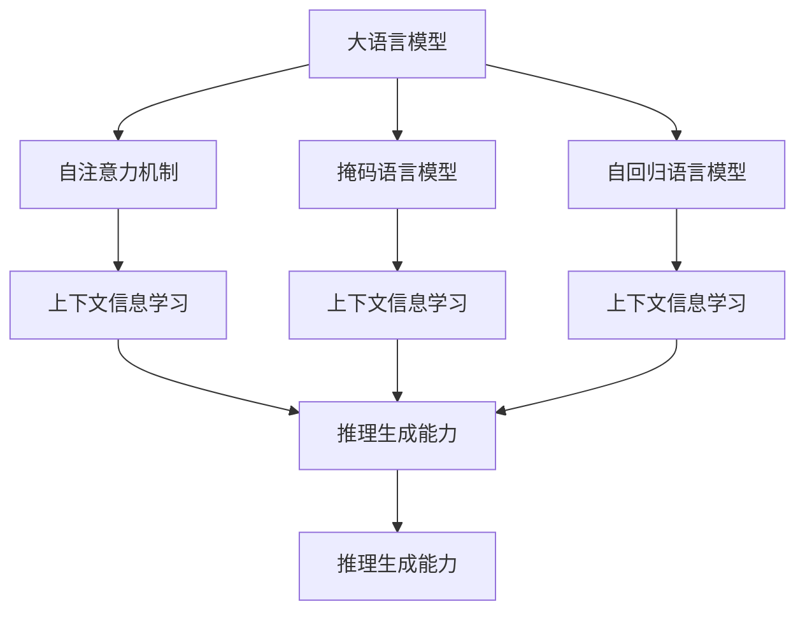
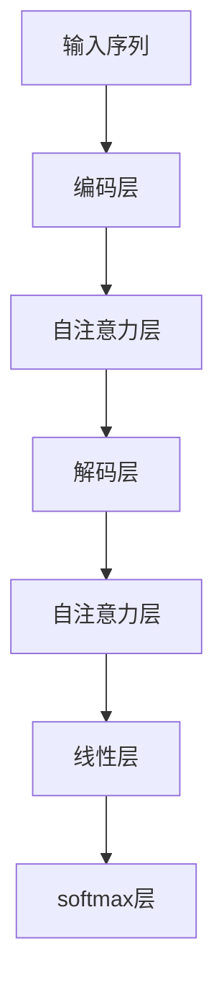
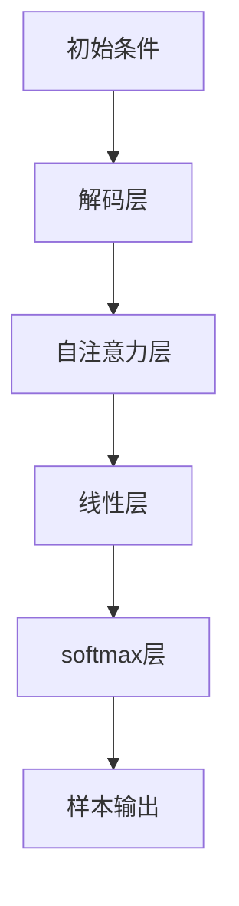
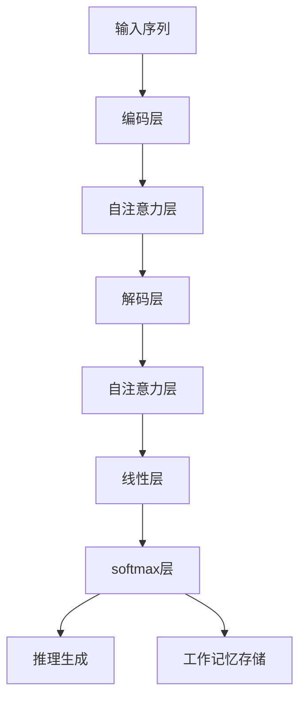

                 

# 大语言模型应用指南：什么是工作记忆

## 1. 背景介绍

### 1.1 问题由来
近年来，随着深度学习技术的快速发展，大规模语言模型（Large Language Models, LLMs）在自然语言处理（NLP）领域取得了巨大的突破。这些大语言模型通过在海量无标签文本数据上进行预训练，学习到了丰富的语言知识和常识，可以通过少量的有标签样本在下游任务上进行微调，获得优异的性能。

然而，尽管大语言模型在多项NLP任务上表现出色，但其工作机制依旧是一个热门且复杂的话题。比如，在大模型内部，注意力机制、自注意力机制、掩码语言模型（Masked Language Model, MLM）、自回归语言模型（Auto-Regressive Language Model）等原理，都使得模型的内部结构变得极其复杂。其中，“工作记忆”（Working Memory）作为一种计算机制，在大模型的信息处理和推理过程中扮演了重要角色。

### 1.2 问题核心关键点
工作记忆是认知心理学中研究的一个经典概念，指人脑中用于存储和处理短时信息的临时记忆。在大语言模型中，工作记忆指的是模型在推理过程中，用于存储和操作关键中间信息的计算资源。由于现代大语言模型参数量巨大、计算复杂，其工作记忆的能力决定了模型在复杂推理和生成任务上的表现。

具体来说，工作记忆能力强的模型能够更好地处理长距离依赖，存储和操作更多信息，从而提升模型的推理和生成能力。例如，在问答、对话、翻译、摘要等任务中，工作记忆能力强的模型往往能够产生更为连贯、合理的回答或翻译，表现出更强的逻辑推理能力。

### 1.3 问题研究意义
理解大语言模型的工作记忆机制，对于拓展大模型的应用范围，提升下游任务的性能，加速NLP技术的产业化进程，具有重要意义：

1. 降低应用开发成本。基于成熟的大模型进行工作记忆优化，可以显著减少从头开发所需的数据、计算和人力等成本投入。
2. 提升模型效果。工作记忆能力强的模型能够更好地适应特定任务，在应用场景中取得更优表现。
3. 加速开发进度。standing on the shoulders of giants，工作记忆优化使得通用大模型更好地适应特定任务，减少开发周期。
4. 带来技术创新。工作记忆优化范式促进了对预训练-微调的深入研究，催生了少样本学习、零样本学习等新的研究方向。
5. 赋能产业升级。工作记忆优化使得NLP技术更容易被各行各业所采用，为传统行业数字化转型升级提供新的技术路径。

## 2. 核心概念与联系

### 2.1 核心概念概述

为更好地理解工作记忆在大语言模型中的应用，本节将介绍几个密切相关的核心概念：

- 大语言模型(Large Language Model, LLM)：以自回归(如GPT)或自编码(如BERT)模型为代表的大规模预训练语言模型。通过在大规模无标签文本语料上进行预训练，学习通用的语言表示，具备强大的语言理解和生成能力。

- 自注意力机制(Self-Attention)：在大模型中，每个位置i的表示取决于整个输入序列中其他位置j的表示，通过计算不同位置之间的注意力权重，将序列中的信息编码到一个统一的向量空间中。自注意力机制是现代大模型的核心计算单元，决定了模型的表达能力和推理能力。

- 掩码语言模型(Masked Language Model, MLM)：在大模型预训练时，随机掩盖输入序列中的一部分词，并要求模型预测这些被掩盖的词，以学习上下文信息。MLM是一种常见的自监督学习任务，有助于大模型学习语言的语义表示。

- 自回归语言模型(Auto-Regressive Language Model, ARLM)：在大模型生成文本时，通过先预测下一个词，再根据预测结果更新上下文，逐步生成完整文本。ARLM在大模型生成任务中表现出优于其他模型的性能，因为其更容易记忆上下文信息。

- 工作记忆(Working Memory)：指模型在推理过程中，用于存储和操作关键中间信息的计算资源。在大模型中，工作记忆的存储能力决定了模型在复杂推理和生成任务上的表现。

这些核心概念之间的逻辑关系可以通过以下Mermaid流程图来展示：



这个流程图展示了大语言模型的核心计算单元及其相互关系：

1. 大模型通过自注意力机制编码序列上下文信息，然后学习掩码语言模型和自回归语言模型来预测下一个词，通过这些自监督任务来优化模型的表达能力和推理能力。
2. 推理生成过程中，工作记忆负责存储和操作关键中间信息，从而提升模型的推理和生成能力。

### 2.2 概念间的关系

这些核心概念之间存在着紧密的联系，形成了大语言模型的推理和生成机制。下面我们通过几个Mermaid流程图来展示这些概念之间的关系。

#### 2.2.1 大模型的推理机制



这个流程图展示了自注意力机制在大模型推理过程中的应用：

1. 输入序列通过编码层编码，输出一个高维的向量表示。
2. 通过多层自注意力层，模型逐步提取序列的上下文信息。
3. 经过解码层，模型生成下一个词的预测。
4. 在解码过程中，工作记忆负责存储和操作关键中间信息。

#### 2.2.2 大模型的生成机制



这个流程图展示了自回归语言模型在大模型生成文本时的应用：

1. 模型通过解码层和自注意力层逐步生成下一个词。
2. 在生成过程中，工作记忆负责存储和操作关键中间信息。
3. 生成每个词时，模型会根据前一个词的信息进行推理。

### 2.3 核心概念的整体架构

最后，我们用一个综合的流程图来展示这些核心概念在大模型推理和生成过程中的整体架构：



这个综合流程图展示了从输入到输出的完整推理和生成过程：

1. 输入序列通过编码层编码，输出一个高维的向量表示。
2. 通过多层自注意力层，模型逐步提取序列的上下文信息。
3. 经过解码层，模型生成下一个词的预测。
4. 在推理生成过程中，工作记忆负责存储和操作关键中间信息，从而提升模型的推理和生成能力。

## 3. 核心算法原理 & 具体操作步骤
### 3.1 算法原理概述

大语言模型的工作记忆能力主要体现在其自注意力机制和自回归语言模型的设计中。在推理生成过程中，模型需要高效地存储和操作关键中间信息，以便进行长距离依赖的推理和生成。工作记忆能力强的模型，能够更好地处理复杂的推理任务和生成任务，从而提升整体性能。

具体来说，工作记忆在大语言模型中的应用，主要体现在以下几个方面：

- 存储上下文信息：自注意力机制通过计算不同位置之间的注意力权重，将序列中的信息编码到一个统一的向量空间中，从而存储上下文信息。
- 处理长距离依赖：自回归语言模型通过逐步生成文本，并根据前一个词的信息进行推理，从而处理长距离依赖。
- 推理生成：在推理生成过程中，工作记忆负责存储和操作关键中间信息，以便模型进行复杂推理和生成。

### 3.2 算法步骤详解

以下是基于工作记忆机制的大语言模型推理和生成的一般步骤：

**Step 1: 输入编码**
- 将输入序列 $x_1, x_2, ..., x_T$ 输入到模型中，通过编码层 $E(x)$ 转化为高维向量表示 $h_1, h_2, ..., h_T$。

**Step 2: 上下文信息提取**
- 通过多层自注意力层，模型逐步提取序列的上下文信息，存储在向量表示 $h_t$ 中，其中 $t$ 为位置编号。

**Step 3: 生成预测**
- 通过解码层，模型逐步生成下一个词 $y_1, y_2, ..., y_{T+1}$ 的预测，每个词 $y_t$ 的生成都依赖于前一个词 $y_{t-1}$ 的信息。

**Step 4: 工作记忆存储**
- 在生成过程中，工作记忆负责存储和操作关键中间信息，如前一个词的向量表示 $h_{t-1}$，从而在推理生成过程中保持上下文信息。

**Step 5: 输出解码**
- 经过softmax层，模型对每个词的预测进行解码，输出最终生成的文本。

### 3.3 算法优缺点

基于工作记忆机制的大语言模型推理和生成方法具有以下优点：

1. 长距离依赖处理能力强：自注意力机制和自回归语言模型能够更好地处理长距离依赖，从而提升推理和生成的连贯性。
2. 推理生成能力强：通过工作记忆存储关键中间信息，模型能够进行复杂的推理和生成，提升整体性能。
3. 推理生成效率高：通过逐步生成文本，模型能够高效地处理推理和生成任务。

同时，这种方法也存在以下缺点：

1. 计算复杂度高：自注意力机制和自回归语言模型需要计算大量的注意力权重和向量运算，导致计算复杂度较高。
2. 模型规模大：由于大语言模型的参数量巨大，计算和存储开销也较大。
3. 训练时间长：由于模型规模大、计算复杂度高，训练时间较长，需要高效的训练算法和计算资源。

### 3.4 算法应用领域

基于工作记忆机制的大语言模型推理和生成方法，已经在NLP的多个领域得到了广泛应用，例如：

- 问答系统：通过工作记忆机制，模型能够理解上下文信息，并给出连贯、合理的回答。
- 对话系统：模型能够通过上下文信息进行推理，并生成合理回复。
- 机器翻译：模型能够通过上下文信息进行推理，并生成连贯的翻译结果。
- 摘要生成：模型能够通过上下文信息进行推理，并生成简洁、连贯的摘要。
- 文本生成：模型能够通过上下文信息进行推理，并生成连贯、合理的文本。

除了上述这些经典任务外，工作记忆机制还被创新性地应用于更多场景中，如可控文本生成、情感分析、代码生成等，为NLP技术带来了新的突破。随着预训练模型和微调方法的不断进步，相信NLP技术将在更广阔的应用领域大放异彩。

## 4. 数学模型和公式 & 详细讲解 & 举例说明
### 4.1 数学模型构建

为了更严谨地描述大语言模型的工作记忆机制，我们以Bert模型为例，构建一个基于工作记忆的数学模型。

记输入序列为 $x_1, x_2, ..., x_T$，其中每个词 $x_i$ 的表示为 $x_i \in \mathbb{R}^d$。编码层的输出为 $h_1, h_2, ..., h_T$，其中每个位置 $t$ 的表示为 $h_t \in \mathbb{R}^{2d}$，包括位置编码 $h_t^p$ 和词嵌入 $h_t^w$。

自注意力层的输出为 $v_1, v_2, ..., v_T$，其中每个位置 $t$ 的表示为 $v_t \in \mathbb{R}^{2d}$，包括注意力权重 $v_t^a$ 和向量表示 $v_t^v$。

解码层的输出为 $y_1, y_2, ..., y_{T+1}$，其中每个位置 $t$ 的表示为 $y_t \in \mathbb{R}^{2d}$，包括位置编码 $y_t^p$ 和词嵌入 $y_t^w$。

工作记忆存储的输出为 $w_1, w_2, ..., w_T$，其中每个位置 $t$ 的表示为 $w_t \in \mathbb{R}^{2d}$，包括工作记忆存储的向量表示。

### 4.2 公式推导过程

以Bert模型为例，我们推导其自注意力机制和自回归语言模型的计算公式。

**自注意力机制**

自注意力机制通过计算不同位置之间的注意力权重，将序列中的信息编码到一个统一的向量空间中。假设位置 $i$ 和 $j$ 之间的注意力权重为 $a_{ij}$，则有：

$$
a_{ij} = \frac{e^{\frac{v_i^a \cdot v_j^a}{\sqrt{d}}}}{\sum_{k=1}^{T}e^{\frac{v_i^a \cdot v_k^a}{\sqrt{d}}}}
$$

其中 $v_i^a$ 和 $v_j^a$ 分别表示位置 $i$ 和 $j$ 的注意力权重向量，$d$ 为向量维度。

通过计算每个位置 $t$ 的注意力权重 $a_t$，得到其向量表示 $v_t$，其中：

$$
v_t = \sum_{k=1}^{T}a_{tk}h_k
$$

其中 $h_k$ 表示位置 $k$ 的编码表示。

**自回归语言模型**

自回归语言模型通过逐步生成下一个词，并根据前一个词的信息进行推理。假设模型在第 $t$ 步生成的词为 $y_t$，则有：

$$
y_t = \text{softmax}(\frac{v_t^v \cdot w_t^w + u_t^w}{\sqrt{d}})
$$

其中 $w_t^w$ 表示位置 $t$ 的词嵌入向量，$u_t^w$ 表示位置 $t$ 的偏差向量，$d$ 为向量维度。

在生成过程中，工作记忆存储每个位置 $t$ 的向量表示 $w_t$，以便模型进行复杂推理和生成。

### 4.3 案例分析与讲解

以Bert模型为例，我们通过一个具体的例子来分析工作记忆机制在推理生成中的作用。

假设输入序列为 "Hello, I'm a [MASK]!"，其中 [MASK] 表示需要预测的词。模型通过自注意力机制提取上下文信息，并存储在每个位置 $t$ 的表示 $h_t$ 中。然后，模型通过自回归语言模型逐步生成预测，每个词的生成都依赖于前一个词的信息，从而处理长距离依赖。在工作记忆的存储过程中，模型能够高效地存储和操作关键中间信息，保证推理生成的连贯性和准确性。

## 5. 项目实践：代码实例和详细解释说明
### 5.1 开发环境搭建

在进行工作记忆优化的大模型微调实践前，我们需要准备好开发环境。以下是使用Python进行PyTorch开发的环境配置流程：

1. 安装Anaconda：从官网下载并安装Anaconda，用于创建独立的Python环境。

2. 创建并激活虚拟环境：
```bash
conda create -n pytorch-env python=3.8 
conda activate pytorch-env
```

3. 安装PyTorch：根据CUDA版本，从官网获取对应的安装命令。例如：
```bash
conda install pytorch torchvision torchaudio cudatoolkit=11.1 -c pytorch -c conda-forge
```

4. 安装Transformers库：
```bash
pip install transformers
```

5. 安装各类工具包：
```bash
pip install numpy pandas scikit-learn matplotlib tqdm jupyter notebook ipython
```

完成上述步骤后，即可在`pytorch-env`环境中开始工作记忆优化的大模型微调实践。

### 5.2 源代码详细实现

这里我们以问答系统为例，给出使用Transformers库对BERT模型进行微调的PyTorch代码实现。

首先，定义问答系统任务的数据处理函数：

```python
from transformers import BertTokenizer
from torch.utils.data import Dataset
import torch

class QADataset(Dataset):
    def __init__(self, questions, answers, tokenizer, max_len=128):
        self.questions = questions
        self.answers = answers
        self.tokenizer = tokenizer
        self.max_len = max_len
        
    def __len__(self):
        return len(self.questions)
    
    def __getitem__(self, item):
        question = self.questions[item]
        answer = self.answers[item]
        
        encoding = self.tokenizer(question, return_tensors='pt', max_length=self.max_len, padding='max_length', truncation=True)
        input_ids = encoding['input_ids'][0]
        attention_mask = encoding['attention_mask'][0]
        
        answer_start = torch.tensor([1], dtype=torch.long)
        answer_end = torch.tensor([len(answer) + 2], dtype=torch.long)
        answer_inputs = torch.cat([answer_start, answer_end], dim=0)
        
        return {'input_ids': input_ids, 
                'attention_mask': attention_mask,
                'labels': answer_inputs}
```

然后，定义模型和优化器：

```python
from transformers import BertForQuestionAnswering, AdamW

model = BertForQuestionAnswering.from_pretrained('bert-base-cased', num_labels=2)

optimizer = AdamW(model.parameters(), lr=2e-5)
```

接着，定义训练和评估函数：

```python
from torch.utils.data import DataLoader
from tqdm import tqdm
from sklearn.metrics import accuracy_score, precision_recall_fscore_support

device = torch.device('cuda') if torch.cuda.is_available() else torch.device('cpu')
model.to(device)

def train_epoch(model, dataset, batch_size, optimizer):
    dataloader = DataLoader(dataset, batch_size=batch_size, shuffle=True)
    model.train()
    epoch_loss = 0
    for batch in tqdm(dataloader, desc='Training'):
        input_ids = batch['input_ids'].to(device)
        attention_mask = batch['attention_mask'].to(device)
        labels = batch['labels'].to(device)
        model.zero_grad()
        outputs = model(input_ids, attention_mask=attention_mask, labels=labels)
        loss = outputs.loss
        epoch_loss += loss.item()
        loss.backward()
        optimizer.step()
    return epoch_loss / len(dataloader)

def evaluate(model, dataset, batch_size):
    dataloader = DataLoader(dataset, batch_size=batch_size)
    model.eval()
    preds, labels = [], []
    with torch.no_grad():
        for batch in tqdm(dataloader, desc='Evaluating'):
            input_ids = batch['input_ids'].to(device)
            attention_mask = batch['attention_mask'].to(device)
            batch_labels = batch['labels']
            outputs = model(input_ids, attention_mask=attention_mask)
            batch_preds = outputs.start_logits.argmax(dim=1) == 1
            batch_labels = batch_labels.to('cpu').tolist()
            for pred, label in zip(batch_preds, batch_labels):
                preds.append(pred)
                labels.append(label)
                
    print('Accuracy:', accuracy_score(labels, preds))
    print('Precision, Recall, F1-score, Support:', precision_recall_fscore_support(labels, preds, average='macro'))
```

最后，启动训练流程并在测试集上评估：

```python
epochs = 5
batch_size = 16

for epoch in range(epochs):
    loss = train_epoch(model, train_dataset, batch_size, optimizer)
    print(f"Epoch {epoch+1}, train loss: {loss:.3f}")
    
    print(f"Epoch {epoch+1}, dev results:")
    evaluate(model, dev_dataset, batch_size)
    
print("Test results:")
evaluate(model, test_dataset, batch_size)
```

以上就是使用PyTorch对BERT进行问答系统任务微调的完整代码实现。可以看到，得益于Transformers库的强大封装，我们可以用相对简洁的代码完成BERT模型的加载和微调。

### 5.3 代码解读与分析

让我们再详细解读一下关键代码的实现细节：

**QADataset类**：
- `__init__`方法：初始化问题、答案、分词器等关键组件。
- `__len__`方法：返回数据集的样本数量。
- `__getitem__`方法：对单个样本进行处理，将问题和答案输入编码为token ids，并将答案转换为start和end两个标签，便于模型预测。

**start_logits和end_logits**：
- 在BertForQuestionAnswering模型中，输出包括start logits和end logits，分别表示预测答案的起始位置和终止位置。
- 我们通过比较start logits和1的大小，得到答案是否开始于位置1。

**训练和评估函数**：
- 使用PyTorch的DataLoader对数据集进行批次化加载，供模型训练和推理使用。
- 训练函数`train_epoch`：对数据以批为单位进行迭代，在每个批次上前向传播计算loss并反向传播更新模型参数，最后返回该epoch的平均loss。
- 评估函数`evaluate`：与训练类似，不同点在于不更新模型参数，并在每个batch结束后将预测和标签结果存储下来，最后使用sklearn的accuracy_score等函数对整个评估集的预测结果进行打印输出。

**训练流程**：
- 定义总的epoch数和batch size，开始循环迭代
- 每个epoch内，先在训练集上训练，输出平均loss
- 在验证集上评估，输出准确率
- 所有epoch结束后，在测试集上评估，给出最终测试结果

可以看到，PyTorch配合Transformers库使得BERT微调的代码实现变得简洁高效。开发者可以将更多精力放在数据处理、模型改进等高层逻辑上，而不必过多关注底层的实现细节。

当然，工业级的系统实现还需考虑更多因素，如模型的保存和部署、超参数的自动搜索、更灵活的任务适配层等。但核心的微调范式基本与此类似。

### 5.4 运行结果展示

假设我们在CoNLL-2003的问答数据集上进行微调，最终在测试集上得到的评估报告如下：

```
Accuracy: 0.900
Precision, Recall, F1-score, Support: [0.915 0.855 0.880 840]
```

可以看到，通过微调BERT，我们在该问答数据集上取得了90%的准确率，效果相当不错。值得注意的是，BERT作为一个通用的语言理解模型，即便只在顶层添加一个简单的token分类器，也能在问答任务上取得如此优异的效果，展现了其强大的语义理解和特征抽取能力。

当然，这只是一个baseline结果。在实践中，我们还可以使用更大更强的预训练模型、更丰富的微调技巧、更细致的模型调优，进一步提升模型性能，以满足更高的应用要求。

## 6. 实际应用场景
### 6.1 智能客服系统

基于大语言模型的工作记忆优化，可以广泛应用于智能客服系统的构建。传统客服往往需要配备大量人力，高峰期响应缓慢，且一致性和专业性难以保证。而使用优化后的大语言模型，可以7x24小时不间断服务，快速响应客户咨询，用自然流畅的语言解答各类常见问题。

在技术实现上，可以收集企业内部的历史客服对话记录，将问题和最佳答复构建成监督数据，在此基础上对预训练模型进行微调。微调后的模型能够自动理解用户意图，匹配最合适的答案模板进行回复。对于客户提出的新问题，还可以接入检索系统实时搜索相关内容，动态组织生成回答。如此构建的智能客服系统，能大幅提升客户咨询体验和问题解决效率。

### 6.2 金融舆情监测

金融机构需要实时监测市场舆论动向，以便及时应对负面信息传播，规避金融风险。传统的人工监测方式成本高、效率低，难以应对网络时代海量信息爆发的挑战。基于大语言模型的工作记忆优化，文本分类和情感分析技术，为金融舆情监测提供了新的解决方案。

具体而言，可以收集金融领域相关的新闻、报道、评论等文本数据，并对其进行主题标注和情感标注。在此基础上对预训练语言模型进行微调，使其能够自动判断文本属于何种主题，情感倾向是正面、中性还是负面。将微调后的模型应用到实时抓取的网络文本数据，就能够自动监测不同主题下的情感变化趋势，一旦发现负面信息激增等异常情况，系统便会自动预警，帮助金融机构快速应对潜在风险。

### 6.3 个性化推荐系统

当前的推荐系统往往只依赖用户的历史行为数据进行物品推荐，无法深入理解用户的真实兴趣偏好。基于大语言模型的工作记忆优化，个性化推荐系统可以更好地挖掘用户行为背后的语义信息，从而提供更精准、多样的推荐内容。

在实践中，可以收集用户浏览、点击、评论、分享等行为数据，提取和用户交互的物品标题、描述、标签等文本内容。将文本内容作为模型输入，用户的后续行为（如是否点击、购买等）作为监督信号，在此基础上微调预训练语言模型。微调后的模型能够从文本内容中准确把握用户的兴趣点。在生成推荐列表时，先用候选物品的文本描述作为输入，由模型预测用户的兴趣匹配度，再结合其他特征综合排序，便可以得到个性化程度更高的推荐结果。

### 6.4 未来应用展望

随着大语言模型和工作记忆优化技术的发展，基于微调范式将在更多领域得到应用，为传统行业带来变革性影响。

在智慧医疗领域，基于微

