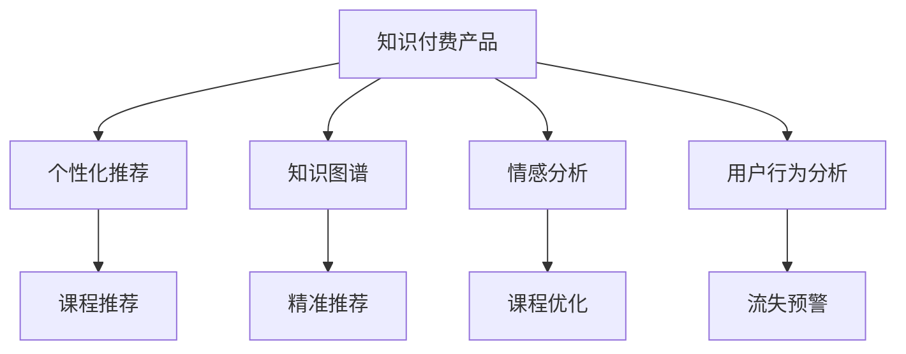
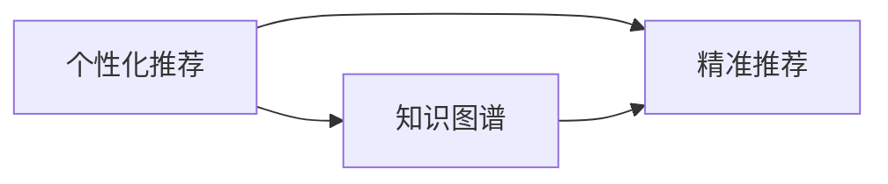

                 

# 如何提高知识付费产品的用户粘性

## 1. 背景介绍

随着互联网和智能手机的普及，知识付费成为越来越多人的学习方式。根据艾媒咨询的最新数据，预计到2024年，中国的知识付费用户规模将达到4.41亿人。如此庞大的用户基数，无疑为知识付费平台带来了巨大的机遇。然而，如何从众多平台中脱颖而出，增强用户粘性，提升用户留存率，成为知识付费行业面临的重大挑战。

## 2. 核心概念与联系

### 2.1 核心概念概述

为更好地理解知识付费产品的用户粘性，本节将介绍几个密切相关的核心概念：

- **知识付费产品**：指通过订阅、购买等方式，向用户提供专业知识的在线平台，如得到、喜马拉雅、知乎live等。知识付费产品的本质是知识与服务的结合，旨在通过知识提升用户认知水平和技能。

- **用户粘性**：指用户对知识付费产品的持续依赖和兴趣，是衡量产品用户忠诚度的重要指标。用户粘性高，说明平台能持续提供有价值的内容，满足用户需求。

- **个性化推荐**：指根据用户历史行为和偏好，推荐相关课程或内容，提升用户满意度和留存率。个性化推荐是提升用户粘性的关键手段之一。

- **知识图谱**：指基于知识和关系的图结构，用于描述和组织知识，支持精准推荐和智能搜索。知识图谱的应用能显著提升个性化推荐的效果。

- **情感分析**：指通过分析用户评论和反馈，了解用户对课程的情感倾向，辅助优化课程内容和推荐策略。情感分析是衡量课程质量和用户满意度的重要工具。

- **用户行为分析**：指通过跟踪用户的浏览、互动、购买等行为数据，评估用户对平台的依赖程度，发现潜在流失用户。用户行为分析是提升用户粘性的重要手段。

这些核心概念之间的逻辑关系可以通过以下Mermaid流程图来展示：



这个流程图展示了一系列提高知识付费产品用户粘性的关键技术手段：

1. 知识付费产品作为基础，通过个性化推荐、知识图谱、情感分析和用户行为分析等手段，不断优化推荐和用户体验，从而提升用户粘性。
2. 个性化推荐利用知识图谱，提升推荐的精准度。
3. 情感分析帮助优化课程内容，提升用户满意度。
4. 用户行为分析发现潜在流失用户，及时采取措施挽回。

### 2.2 概念间的关系

这些核心概念之间存在着紧密的联系，形成了知识付费产品用户粘性的完整生态系统。下面我通过几个Mermaid流程图来展示这些概念之间的关系。

#### 2.2.1 用户粘性的实现路径


这个流程图展示了大语言模型微调过程中各个概念之间的关系：

1. 知识付费产品作为起点，通过个性化推荐、知识图谱、情感分析和用户行为分析等手段，不断优化推荐和用户体验，从而提升用户粘性。
2. 个性化推荐利用知识图谱，提升推荐的精准度。
3. 情感分析帮助优化课程内容，提升用户满意度。
4. 用户行为分析发现潜在流失用户，及时采取措施挽回。

#### 2.2.2 个性化推荐与知识图谱的关系



这个流程图展示了个性化推荐与知识图谱之间的关系：

1. 个性化推荐需要知识图谱的支持，才能进行精准推荐。
2. 知识图谱存储了大量的知识信息，为个性化推荐提供了丰富的依据。
3. 精准推荐提升了用户粘性，从而促进知识付费产品的持续发展。

## 3. 核心算法原理 & 具体操作步骤
### 3.1 算法原理概述

提高知识付费产品用户粘性的核心算法原理，可以归纳为以下几个方面：

1. **个性化推荐算法**：利用机器学习和数据挖掘技术，根据用户行为和偏好，推荐最适合用户的内容。
2. **知识图谱构建**：通过深度学习技术，构建大规模的知识图谱，描述和组织知识。
3. **情感分析技术**：通过自然语言处理技术，分析用户对课程的情感倾向，优化课程内容和推荐策略。
4. **用户行为分析模型**：利用数据挖掘技术，跟踪用户行为，发现潜在流失用户，及时采取措施挽回。

这些算法共同构成了提升知识付费产品用户粘性的完整框架，旨在通过精准推荐、知识图谱、情感分析和用户行为分析等手段，不断优化用户体验，提升用户满意度，最终实现用户粘性的提升。

### 3.2 算法步骤详解

为了更好地理解这些算法，下面将详细讲解它们的具体操作步骤。

**Step 1: 数据收集与预处理**

- 收集用户的历史行为数据，包括浏览课程、购买课程、评论课程等行为。
- 收集课程的元数据信息，如课程名称、难度、讲师、评分等。
- 进行数据清洗和预处理，去除噪音和异常值，确保数据的完整性和一致性。

**Step 2: 个性化推荐算法训练**

- 选择合适的算法模型，如协同过滤、基于内容的推荐、矩阵分解等。
- 对用户和课程数据进行特征工程，提取有意义的特征。
- 使用训练集数据训练推荐模型，验证模型效果。
- 进行模型调参，优化模型性能。

**Step 3: 知识图谱构建与查询**

- 收集结构化的知识数据，如书籍、论文、网页等。
- 使用深度学习技术，将知识数据构建为知识图谱，描述知识之间的关联关系。
- 对知识图谱进行实体关系抽取、知识推理等操作，提升知识表示的准确性。
- 设计高效的图谱查询算法，支持精准推荐。

**Step 4: 情感分析技术应用**

- 收集用户对课程的评论数据，进行文本预处理。
- 使用情感分析算法，对评论进行情感极性分类。
- 分析情感极性分布，发现用户对课程的情感倾向。
- 根据情感分析结果，优化课程内容和推荐策略。

**Step 5: 用户行为分析模型构建**

- 收集用户行为数据，包括浏览历史、购买历史、互动行为等。
- 设计用户行为分析模型，如用户流失模型、用户行为预测模型等。
- 使用历史行为数据训练模型，评估模型的预测效果。
- 对模型进行调参优化，提升预测准确度。

### 3.3 算法优缺点

**优点**：

1. **提升用户满意度**：通过个性化推荐和情感分析，能够满足用户的个性化需求，提升用户满意度。
2. **精准推荐**：利用知识图谱，提升推荐的精准度，减少用户筛选信息的时间成本。
3. **预警流失**：通过用户行为分析，及时发现流失用户，采取措施挽回，提升用户留存率。

**缺点**：

1. **数据依赖**：算法效果依赖于数据质量和数据量，数据不足时难以取得理想效果。
2. **模型复杂**：部分算法模型较为复杂，需要较高的计算资源和时间成本。
3. **隐私风险**：需要处理大量用户数据，存在隐私泄露的风险。

### 3.4 算法应用领域

基于这些算法，知识付费产品的用户粘性提升已经广泛应用于多个领域，例如：

- **在线教育**：如得到、新东方在线、网易公开课等平台，通过个性化推荐和知识图谱，提升用户学习效果和留存率。
- **职业培训**：如Coursera、Udacity、LinkedIn Learning等平台，利用用户行为分析和情感分析，优化课程内容和推荐策略，提升用户学习动力。
- **文化娱乐**：如喜马拉雅、蜻蜓FM、得到等平台，通过情感分析和个性化推荐，提升用户听书体验和黏性。
- **健康医疗**：如丁香医生、好大夫在线等平台，利用用户行为分析和知识图谱，推荐相关健康知识和课程，提升用户健康意识。
- **技能培训**：如网易云课堂、慕课网、腾讯课堂等平台，通过个性化推荐和知识图谱，推荐适合用户的技能课程，提升用户技能水平。

## 4. 数学模型和公式 & 详细讲解 & 举例说明

### 4.1 数学模型构建

本节将使用数学语言对提高知识付费产品用户粘性的算法进行更加严格的刻画。

假设知识付费产品的用户集合为 $U$，课程集合为 $C$。令 $x_{ui}$ 表示用户 $u$ 对课程 $c$ 的评分，$x_{ui}=1$ 表示用户喜欢该课程，$x_{ui}=0$ 表示用户不喜欢该课程。令 $Y_{ui}$ 表示用户 $u$ 对课程 $c$ 的实际评分，$Y_{ui}\in[0,1]$。令 $X_{ui}$ 表示用户 $u$ 的特征向量，$X_{ui}\in\mathbb{R}^d$。令 $W_{ui}$ 表示用户 $u$ 对课程 $c$ 的评分权重，$W_{ui}\in[0,1]$。

模型的目标是最小化用户实际评分与预测评分的均方误差，即：

$$
\min_{W} \frac{1}{n}\sum_{i=1}^n\sum_{j=1}^m(x_{ij}-\hat{x}_{ij})^2
$$

其中 $n$ 为训练集样本数，$m$ 为课程数量。

模型的训练过程可以描述为：

1. 输入用户 $u$ 和课程 $c$ 的特征向量 $X_{ui}$ 和 $X_{ci}$。
2. 通过矩阵乘法计算预测评分 $\hat{x}_{ij}=W_{ij}^T X_{ui}$。
3. 计算预测评分与实际评分的误差 $\hat{x}_{ij}-y_{ij}$。
4. 更新权重 $W_{ij}$，最小化误差平方和。

### 4.2 公式推导过程

以协同过滤算法为例，推导其公式和计算过程。

假设 $X$ 为用户特征矩阵，$Y$ 为课程特征矩阵，$W$ 为评分权重矩阵。协同过滤的评分预测公式为：

$$
\hat{x}_{ij}=\sum_{k=1}^{K}W_{ik}W_{kj}X_{uk}
$$

其中 $K$ 为隐向量维度。

模型的训练过程可以描述为：

1. 输入用户特征向量 $X_{ui}$ 和课程特征向量 $X_{ci}$。
2. 计算隐向量 $H=\hat{X}X^{-1}W$，其中 $\hat{X}=X^TX^{-1}X$。
3. 计算预测评分 $\hat{x}_{ij}=H_iH_j^T$。
4. 更新权重 $W$，最小化误差平方和。

### 4.3 案例分析与讲解

以得到平台为例，分析其如何通过个性化推荐提升用户粘性。

**数据收集**：得到平台收集了用户浏览、购买、互动等行为数据，以及课程的元数据信息。

**个性化推荐算法**：得到平台使用了协同过滤、基于内容的推荐、深度学习推荐等算法。

**知识图谱构建**：得到平台构建了课程知识图谱，描述了课程之间的关联关系。

**情感分析技术**：得到平台对用户评论进行情感分析，发现用户对课程的情感倾向。

**用户行为分析模型**：得到平台利用用户行为数据，构建了用户流失模型和行为预测模型。

**实际应用**：得到平台根据个性化推荐、知识图谱、情感分析和用户行为分析等手段，不断优化推荐和用户体验，从而提升用户粘性。

## 5. 项目实践：代码实例和详细解释说明

### 5.1 开发环境搭建

在进行知识付费产品用户粘性提升实践前，我们需要准备好开发环境。以下是使用Python进行TensorFlow开发的环境配置流程：

1. 安装Anaconda：从官网下载并安装Anaconda，用于创建独立的Python环境。

2. 创建并激活虚拟环境：
```bash
conda create -n tf-env python=3.7 
conda activate tf-env
```

3. 安装TensorFlow：根据CUDA版本，从官网获取对应的安装命令。例如：
```bash
conda install tensorflow -c tensorflow -c conda-forge
```

4. 安装各类工具包：
```bash
pip install numpy pandas scikit-learn matplotlib tqdm jupyter notebook ipython
```

完成上述步骤后，即可在`tf-env`环境中开始实践。

### 5.2 源代码详细实现

下面我们以个性化推荐算法为例，给出使用TensorFlow进行实现的具体代码。

```python
import tensorflow as tf
from tensorflow.keras.layers import Input, Embedding, Dot
from tensorflow.keras.models import Model

# 定义输入层
user_input = Input(shape=(1,), name='user')
course_input = Input(shape=(1,), name='course')

# 定义嵌入层
user_embedding = Embedding(input_dim=10000, output_dim=128, name='user_embedding')(user_input)
course_embedding = Embedding(input_dim=10000, output_dim=128, name='course_embedding')(course_input)

# 定义点积层
dot_layer = Dot(axes=[2, 1], normalize=True)([user_embedding, course_embedding])

# 定义输出层
output = tf.keras.layers.Dense(1, activation='sigmoid')(dot_layer)

# 定义模型
model = Model(inputs=[user_input, course_input], outputs=output)

# 编译模型
model.compile(optimizer='adam', loss='binary_crossentropy', metrics=['accuracy'])

# 训练模型
model.fit([X_train, Y_train], Y_train, epochs=10, batch_size=128, validation_data=[[X_val, Y_val], Y_val])
```

以上代码实现了基本的协同过滤算法，用于预测用户对课程的评分。

### 5.3 代码解读与分析

让我们再详细解读一下关键代码的实现细节：

**输入层定义**：
- `user_input` 和 `course_input` 分别表示用户和课程的输入，采用1D张量表示。

**嵌入层定义**：
- 使用 `Embedding` 层，将用户和课程的输入映射到高维空间，生成用户和课程的嵌入向量。

**点积层定义**：
- 使用 `Dot` 层，计算用户和课程的嵌入向量之间的点积，得到预测评分的初始值。

**输出层定义**：
- 使用 `Dense` 层，将预测评分的初始值进行非线性变换，得到最终的预测评分。

**模型定义**：
- 将输入层、嵌入层、点积层和输出层组装成模型，定义模型的输入和输出。

**模型编译**：
- 使用 `compile` 方法，设置优化器、损失函数和评估指标。

**模型训练**：
- 使用 `fit` 方法，传入训练集数据和验证集数据，进行模型的训练。

## 6. 实际应用场景

### 6.1 智能推荐系统

智能推荐系统是知识付费产品提升用户粘性的核心工具。通过个性化推荐，平台能够满足用户的个性化需求，提升用户满意度。

**技术实现**：
- 平台收集用户行为数据，包括浏览、购买、评分等行为。
- 利用协同过滤、基于内容的推荐等算法，对用户和课程进行特征表示和相似度计算。
- 通过点积等方法，计算用户和课程的预测评分。
- 将预测评分排序，推荐最适合用户的课程。

**实际应用**：
- 平台如得到、新东方在线等，通过个性化推荐，提升用户学习效果和留存率。
- 平台如Coursera、Udacity等，利用用户行为分析，优化推荐策略，提升用户学习动力。

### 6.2 情感分析系统

情感分析系统是提升知识付费产品用户粘性的重要工具。通过情感分析，平台能够了解用户对课程的情感倾向，优化课程内容和推荐策略。

**技术实现**：
- 平台收集用户评论数据，进行文本预处理。
- 使用情感分析算法，对评论进行情感极性分类。
- 分析情感极性分布，发现用户对课程的情感倾向。
- 根据情感分析结果，优化课程内容和推荐策略。

**实际应用**：
- 平台如喜马拉雅、得到等，通过情感分析，提升用户听书体验和黏性。
- 平台如知乎live等，利用情感分析，优化课程内容和推荐策略，提升用户学习动力。

### 6.3 用户行为分析系统

用户行为分析系统是提升知识付费产品用户粘性的重要工具。通过用户行为分析，平台能够发现潜在流失用户，及时采取措施挽回。

**技术实现**：
- 平台收集用户行为数据，包括浏览历史、购买历史、互动行为等。
- 设计用户流失模型和行为预测模型，对用户进行行为分析。
- 根据分析结果，及时采取措施，如发送推荐课程、提供优惠活动等，挽回潜在流失用户。

**实际应用**：
- 平台如得到、得到等，通过用户行为分析，发现潜在流失用户，及时采取措施挽回。
- 平台如Coursera、Udacity等，利用用户行为分析，优化课程内容和推荐策略，提升用户学习动力。

### 6.4 未来应用展望

随着知识付费产品的不断演进，基于用户粘性的优化也将变得更加智能和个性化。未来，知识付费产品将朝着以下几个方向发展：

1. **深度学习的应用**：未来的推荐算法将更加依赖深度学习技术，能够更好地处理复杂和多样化的数据。
2. **多模态数据融合**：未来的推荐系统将融合文本、图像、音频等多种数据模态，提供更加全面和个性化的推荐服务。
3. **用户行为建模**：未来的用户行为分析将更加精细化和动态化，能够更好地预测用户行为变化。
4. **实时推荐系统**：未来的推荐系统将更加注重实时性，能够即时响应用户需求，提升用户体验。
5. **个性化内容定制**：未来的推荐系统将更加注重个性化内容定制，能够根据用户偏好提供定制化的课程和服务。
6. **用户社区构建**：未来的知识付费产品将更加注重社区建设，通过用户互动和内容生成，增强用户粘性。

总之，未来的知识付费产品将朝着更加智能、个性化和互动化的方向发展，不断提升用户粘性，增强用户留存率，为知识付费行业的持续健康发展提供有力保障。

## 7. 工具和资源推荐
### 7.1 学习资源推荐

为了帮助开发者系统掌握知识付费产品用户粘性的相关技术，这里推荐一些优质的学习资源：

1. **《推荐系统实战》书籍**：介绍了推荐系统的基础理论和算法实现，适用于初学者和进阶者。
2. **Coursera《Recommender Systems》课程**：斯坦福大学开设的推荐系统课程，包含深度学习、协同过滤等算法。
3. **Kaggle推荐系统竞赛**：参与Kaggle推荐系统竞赛，实践推荐算法，积累经验。
4. **Github推荐系统项目**：在Github上寻找优秀的推荐系统项目，学习其代码实现和优化技巧。
5. **推荐系统论文综述**：了解推荐系统的最新研究成果和应用进展。

通过对这些资源的学习实践，相信你一定能够快速掌握知识付费产品用户粘性提升的精髓，并用于解决实际的推荐问题。

### 7.2 开发工具推荐

高效的开发离不开优秀的工具支持。以下是几款用于知识付费产品用户粘性提升开发的常用工具：

1. **TensorFlow**：由Google主导开发的深度学习框架，支持高效的矩阵运算和模型训练。
2. **PyTorch**：由Facebook主导开发的深度学习框架，灵活高效，适用于研究和工程实践。
3. **TF-IDF**：基于TF-IDF算法，计算文本的相似度，用于推荐系统中的内容推荐。
4. **Spark MLlib**：Apache Spark提供的机器学习库，支持大规模数据处理和分布式计算。
5. **Scikit-learn**：基于Python的机器学习库，提供多种经典算法实现。
6. **Elasticsearch**：高可扩展、高性能的搜索和分析引擎，适用于海量数据的实时查询和分析。

合理利用这些工具，可以显著提升知识付费产品用户粘性提升任务的开发效率，加快创新迭代的步伐。

### 7.3 相关论文推荐

知识付费产品用户粘性提升的研究源于学界的持续研究。以下是几篇奠基性的相关论文，推荐阅读：

1. **《协同过滤推荐算法》**：介绍了协同过滤推荐算法的原理和实现方法。
2. **《基于内容的推荐系统》**：介绍了基于内容的推荐系统，利用用户特征和物品特征进行推荐。
3. **《知识图谱在推荐系统中的应用》**：探讨了知识图谱在推荐系统中的应用，提升了推荐的精准度。
4. **《深度学习在推荐系统中的应用》**：介绍了深度学习在推荐系统中的应用，提升了推荐算法的复杂度和效果。
5. **《用户行为分析在推荐系统中的应用》**：介绍了用户行为分析在推荐系统中的应用，提升了推荐策略的优化效果。

这些论文代表了大语言模型微调技术的发展脉络。通过学习这些前沿成果，可以帮助研究者把握学科前进方向，激发更多的创新灵感。

除上述资源外，还有一些值得关注的前沿资源，帮助开发者紧跟知识付费产品用户粘性提升技术的最新进展，例如：

1. **arXiv论文预印本**：人工智能领域最新研究成果的发布平台，包括大量尚未发表的前沿工作，学习前沿技术的必读资源。
2. **业界技术博客**：如得到、Coursera、Udacity等顶尖实验室的官方博客，第一时间分享他们的最新研究成果和洞见。
3. **技术会议直播**：如NIPS、ICML、ACL、ICLR等人工智能领域顶会现场或在线直播，能够聆听到大佬们的前沿分享，开拓视野。
4. **Github热门项目**：在Github上Star、Fork数最多的知识付费推荐系统项目，往往代表了该技术领域的发展趋势和最佳实践，值得去学习和贡献。
5. **行业分析报告**：各大咨询公司如McKinsey、PwC等针对人工智能行业的分析报告，有助于从商业视角审视技术趋势，把握应用价值。

总之，对于知识付费产品用户粘性提升技术的学习和实践，需要开发者保持开放的心态和持续学习的意愿。多关注前沿资讯，多动手实践，多思考总结，必将收获满满的成长收益。

## 8. 总结：未来发展趋势与挑战

### 8.1 总结

本文对提高知识付费产品用户粘性的方法进行了全面系统的介绍。首先阐述了知识付费产品用户粘性的重要性和影响因素，明确了个性化推荐、知识图谱、情感分析和用户行为分析等关键技术手段的作用。其次，从原理到实践，详细讲解了这些算法的具体操作步骤，给出了实际应用的代码实例。最后，总结了这些算法的优缺点和应用领域，展望了未来的发展趋势。

通过本文的系统梳理，可以看到，提高知识付费产品用户粘性的技术手段已经相当丰富，形成了完整的技术体系。这些技术手段在实践中已经被广泛应用于多个领域，取得了显著的成效。

### 8.2 未来发展趋势

展望未来，知识付费产品用户粘性提升技术将呈现以下几个发展趋势：

1. **推荐算法的多样化**：未来的推荐算法将更加多样化，涵盖协同过滤、基于内容的推荐、深度学习推荐等多种算法，满足不同用户的需求。
2. **知识图谱的智能化**：未来的知识图谱将更加智能化，利用深度学习技术，提升知识表示的准确性和推理能力。
3. **情感分析的细粒度**：未来的情感分析将更加细粒度化，能够更好地理解用户情感的变化，优化课程内容和推荐策略。
4. **用户行为分析的动态化**：未来的用户行为分析将更加动态化，能够实时跟踪用户行为变化，及时发现潜在流失用户。
5. **实时推荐系统的构建**：未来的推荐系统将更加注重实时性，能够即时响应用户需求，提升用户体验。
6. **个性化内容的定制化**：未来的推荐系统将更加注重个性化内容定制，能够根据用户偏好提供定制化的课程和服务。
7. **用户社区的构建**：未来的知识付费产品将更加注重社区建设，通过用户互动和内容生成，增强用户粘性。

这些趋势凸显了知识付费产品用户粘性提升技术的广阔前景。这些方向的探索发展，必将进一步提升知识付费系统的性能和应用范围，为知识付费行业的持续健康发展提供有力保障。

### 8.3 面临的挑战

尽管知识付费产品用户粘性提升技术已经取得了瞩目成就，但在迈向更加智能化、普适化应用的过程中，它仍面临着诸多挑战：

1. **数据质量问题**：数据质量的优劣直接影响推荐算法的性能，低质量数据可能导致推荐效果不佳。
2. **计算资源消耗**：深度学习和分布式计算需要大量的计算资源，对硬件设施要求较高。
3. **隐私保护问题**：知识付费产品需要处理大量用户数据，存在隐私泄露的风险。
4. **推荐系统公平性**：推荐算法可能导致用户推荐结果的偏见，影响用户体验。
5. **个性化推荐多样性**：过度个性化推荐可能导致用户陷入信息茧房，降低用户满意度。
6. **系统鲁棒性**：推荐系统需要具备一定的鲁棒性，避免恶意攻击和数据注入等风险。


