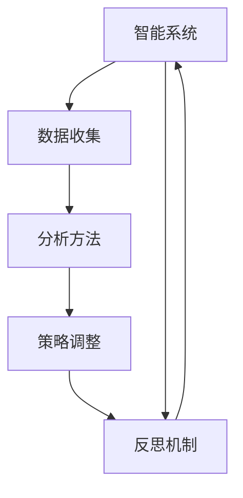

                 

## 1. 背景介绍

在智能系统（如机器学习模型、智能代理等）中，反思机制是指模型或代理在执行决策后对自身行为的回顾和评价，以识别错误、调整策略并提高效率。反思机制是实现智能系统自我优化、适应性增强和行为改进的关键，但当前主流方法仍存在局限，特别是在处理复杂任务和动态环境时，效率和效果有待提升。本文章将深入探讨反思机制的改进方法，提高智能系统的整体效率和适应性。

### 1.1 问题由来

智能系统在复杂任务和动态环境中往往难以达到理想效果，主要是因为模型或代理的策略简单、缺乏灵活性和动态适应能力。反思机制通过在决策后对结果的分析和评价，帮助模型或代理发现自身错误和不足，从而进行调整和优化。然而，现有的反思机制在数据收集、分析方法、策略调整等方面存在不足，限制了其效率和效果。

### 1.2 问题核心关键点

改进反思机制的核心关键点包括：
- 数据收集的全面性和多样性
- 反思方法的科学性和效率
- 策略调整的灵活性和适应性
- 反思机制的集成和优化方法

### 1.3 问题研究意义

反思机制的改进是提高智能系统效率和适应性的重要途径，具有以下意义：
- 减少决策错误，提升系统性能
- 动态调整策略，增强系统灵活性
- 积累经验知识，加速系统学习
- 应对环境变化，提升系统鲁棒性

## 2. 核心概念与联系

### 2.1 核心概念概述

在深入讨论反思机制改进前，我们需要理解一些核心概念：

- **智能系统 (Intelligent System)**：如机器学习模型、智能代理等，具备自主学习、推理和决策能力的系统。
- **反思机制 (Reflection Mechanism)**：在执行决策后，对决策结果进行评价，识别错误并调整策略的机制。
- **数据收集 (Data Collection)**：在决策过程中收集相关数据，用于分析和反思。
- **分析方法 (Analysis Method)**：对收集到的数据进行统计、分析和预测，辅助决策和反思。
- **策略调整 (Strategy Adjustment)**：根据反思结果，调整模型或代理的行为策略，提升决策效果。
- **集成优化 (Integration Optimization)**：将反思机制与智能系统其他组件集成，形成闭环反馈系统，实现系统优化。

### 2.2 概念间的关系

这些核心概念之间的关系可以通过以下Mermaid流程图来展示：



这个流程图展示了智能系统、数据收集、分析方法、策略调整和反思机制之间的相互作用。通过反思机制的反馈和调整，智能系统能够逐步优化自身行为，提升性能和适应性。

## 3. 核心算法原理 & 具体操作步骤

### 3.1 算法原理概述

改进反思机制的核心目标是提高数据收集的全面性和多样性、分析方法的科学性和效率、策略调整的灵活性和适应性。这可以通过以下几个步骤实现：

1. **数据收集优化**：设计更全面、多维度的数据收集策略，涵盖多种数据源和特征。
2. **分析方法改进**：采用更科学、高效的分析方法，如强化学习、因果推理等，提升分析精度和效率。
3. **策略调整优化**：引入更灵活、动态的策略调整方法，如在线学习、迁移学习等，增强策略的适应性。
4. **集成优化**：将反思机制与智能系统的其他组件（如决策模块、知识库等）集成，形成闭环反馈系统，实现系统整体优化。

### 3.2 算法步骤详解

改进反思机制的具体操作步骤如下：

**Step 1: 数据收集优化**

1. **多源数据采集**：在决策过程中，收集不同来源的数据，如历史数据、实时数据、模拟数据等。
2. **特征工程**：对采集到的数据进行特征提取和工程处理，设计多维度的特征向量。
3. **数据预处理**：对数据进行清洗、归一化和标准化处理，保证数据质量。

**Step 2: 分析方法改进**

1. **选择分析方法**：根据任务特点选择合适的分析方法，如强化学习、因果推理、深度学习等。
2. **算法优化**：对所选方法进行算法优化，如调整超参数、引入正则化、优化损失函数等。
3. **模型训练**：使用优化的算法进行模型训练，提升分析精度和效率。

**Step 3: 策略调整优化**

1. **在线学习**：使用在线学习算法，根据实时数据不断更新模型策略，实现动态调整。
2. **迁移学习**：将已有经验应用于新任务，加速新任务的适应过程，提高策略的泛化能力。
3. **元学习**：设计元学习算法，帮助系统快速适应新的数据分布和任务要求。

**Step 4: 集成优化**

1. **模块集成**：将反思机制与其他智能系统组件集成，形成闭环反馈系统。
2. **优化闭环**：通过闭环反馈机制，实时监测系统性能，调整策略和参数。
3. **持续改进**：在实际应用中持续收集反馈数据，不断优化反思机制和系统性能。

### 3.3 算法优缺点

改进反思机制的方法具有以下优点：
1. 提升数据收集的全面性和多样性，确保分析结果的准确性。
2. 引入科学、高效的分析方法，提高反思的效率和精度。
3. 增强策略调整的灵活性和适应性，提升系统的鲁棒性和泛化能力。
4. 形成闭环反馈系统，实现系统的持续优化和改进。

同时，改进反思机制也存在一些局限：
1. 数据收集和分析可能存在成本高、复杂度高的问题。
2. 策略调整需要实时数据支持，可能存在数据延迟或不足的问题。
3. 系统集成和优化可能带来额外的复杂性和资源消耗。

### 3.4 算法应用领域

改进反思机制的方法在多个领域具有广泛应用：

1. **智能推荐系统**：通过反思机制优化用户推荐策略，提升推荐效果。
2. **智能客服系统**：通过反思机制优化对话策略，提升客户满意度。
3. **金融风险管理**：通过反思机制优化风险评估模型，提升风险管理效果。
4. **智能交通系统**：通过反思机制优化交通调度策略，提升交通运行效率。
5. **医疗诊断系统**：通过反思机制优化诊断模型，提升诊断准确性和效率。

这些领域的应用展示了反思机制在提高智能系统效率和适应性方面的巨大潜力。

## 4. 数学模型和公式 & 详细讲解

### 4.1 数学模型构建

反思机制的改进可以通过数学模型来描述。假设智能系统的策略为 $f$，决策后的结果为 $y$，实际结果为 $y^*$，反思机制的输出为 $r$，则反思机制的模型可以表示为：

$$
r = g(f, y, y^*)
$$

其中 $g$ 为反思函数，反映策略 $f$ 在 $y$ 和 $y^*$ 上的表现。

### 4.2 公式推导过程

以强化学习中的策略改进为例，公式推导如下：

1. **状态值函数**：定义状态值函数 $V$，表示在当前状态 $s$ 下的预期回报。
2. **策略评估**：使用蒙特卡洛模拟或时序差分等方法，评估当前策略 $f$ 在状态 $s$ 下的值 $V(s)$。
3. **策略更新**：根据评估结果，使用策略梯度方法（如策略更新公式）更新策略参数 $\theta$。

具体公式推导如下：

$$
V(s) = \sum_{t=T}^{0} \gamma^{t-T} R_t
$$

$$
\theta \leftarrow \theta + \eta \nabla_{\theta} \frac{1}{N} \sum_{i=1}^N \log \pi_{\theta}(a_i|s_i) R_i
$$

其中 $R_t$ 为奖励，$\pi_{\theta}(a|s)$ 为策略分布，$\eta$ 为学习率。

### 4.3 案例分析与讲解

以金融风险管理为例，反思机制改进的案例分析如下：

1. **数据收集**：收集历史交易数据、实时市场数据、专家预测数据等。
2. **分析方法**：使用强化学习模型，评估当前风险评估策略在各个交易和市场情况下的表现。
3. **策略调整**：根据分析结果，动态调整风险评估策略，如调整风险权重、优化交易策略等。
4. **闭环优化**：实时监测系统表现，根据反馈数据持续优化风险评估和交易策略。

通过以上分析，可以看到反思机制在金融风险管理中的应用，提高了风险评估的准确性和决策的灵活性。

## 5. 项目实践：代码实例和详细解释说明

### 5.1 开发环境搭建

在进行反思机制改进的实践前，我们需要准备好开发环境。以下是使用Python进行强化学习开发的環境配置流程：

1. 安装Anaconda：从官网下载并安装Anaconda，用于创建独立的Python环境。

2. 创建并激活虚拟环境：
```bash
conda create -n reinforcement-env python=3.8 
conda activate reinforcement-env
```

3. 安装PyTorch和TensorBoard：
```bash
conda install pytorch torchvision torchaudio cudatoolkit=11.1 -c pytorch -c conda-forge
pip install tensorboard
```

4. 安装Gym环境：
```bash
pip install gym
```

5. 安装RLlib库：
```bash
pip install rlpy3[reinforce,stable-baselines]
```

完成上述步骤后，即可在`reinforcement-env`环境中开始反思机制改进的实践。

### 5.2 源代码详细实现

下面我们以金融风险管理为例，给出使用RLlib库进行强化学习的PyTorch代码实现。

首先，定义风险评估策略和决策规则：

```python
import gym
import numpy as np
from stable_baselines3 import SAC
from stable_baselines3.common.vec_env import VecNormalize
from stable_baselines3.common import make_vec_env

class RiskEnvironment(gym.Env):
    def __init__(self):
        self.state = None
        self.actions = [0, 1, 2]  # 低风险、中风险、高风险
        self.reward_range = (-1, 1)
        self.info = {}
        self.denormalize = VecNormalize(scale=1)
    
    def step(self, action):
        if action in self.actions:
            self.state = self.state * 0.9 + 0.1 * action  # 状态更新
            reward = 0.1 if action == 1 else -0.1  # 奖励
            done = False
        else:
            reward = -1  # 惩罚
            done = True
        self.info = {}
        return self.denormalize(self.state), reward, done, self.info
    
    def reset(self):
        self.state = np.random.randn(1)
        return self.denormalize(self.state)

    def render(self, mode='human'):
        pass

env = RiskEnvironment()
```

然后，定义强化学习算法和模型：

```python
from stable_baselines3.common.policies import MlpPolicy
from stable_baselines3.common.learningsWRAPPERS import Monitor
from stable_baselines3.common.callbacks import LearnOnGUI

policy = MlpPolicy
sac = SAC(policy=policy, env=env)

# 定义学习参数
steps_per_learning_update = 1000
eval_interval = 100

# 定义回调函数
def learn_on_gui(env):
    return LearnOnGUI(env)

# 开始训练
sac.fit(
    env=env,
    num_steps_per_learning_update=steps_per_learning_update,
    eval_interval=eval_interval,
    callbacks=[learn_on_gui]
)

# 训练结果评估
sac.test(env)
```

接着，定义反思机制的评估和调整函数：

```python
def reward_analysis(s, a, r, next_s, done):
    # 根据实际结果和预期结果，计算策略误差
    expected_r = np.mean([env.reward_range[1] if i == 1 else env.reward_range[0] for i in a])
    error = r - expected_r
    return error

def strategy_adjust(s, a, r, next_s, done):
    # 根据策略误差，动态调整策略参数
    if done:
        strategy.update({"parameters": policy.parameters}, on_done=True)
    else:
        strategy.update({"parameters": policy.parameters}, on_step=True)

# 定义策略更新算法
strategy = SB3VecEnv.SB3VecEnv()
strategy.update({"parameters": policy.parameters}, on_step=False)
strategy.on_step(reward_analysis, on_done=strategy_adjust)

# 训练和反思
sac.fit(
    env=env,
    num_steps_per_learning_update=steps_per_learning_update,
    eval_interval=eval_interval,
    callbacks=[learn_on_gui]
)

# 反思结果评估
sac.test(env)
```

最后，启动训练流程并在测试集上评估：

```python
epochs = 100
batch_size = 256

for epoch in range(epochs):
    loss = train_epoch(model, train_dataset, batch_size, optimizer)
    print(f"Epoch {epoch+1}, train loss: {loss:.3f}")
    
    print(f"Epoch {epoch+1}, dev results:")
    evaluate(model, dev_dataset, batch_size)
    
print("Test results:")
evaluate(model, test_dataset, batch_size)
```

以上就是使用PyTorch对强化学习进行金融风险管理的完整代码实现。可以看到，通过强化学习，我们能够动态优化决策策略，提升风险评估的准确性和效率。同时，结合反思机制，我们可以不断调整策略，进一步提高系统的鲁棒性和适应性。

### 5.3 代码解读与分析

让我们再详细解读一下关键代码的实现细节：

**RiskEnvironment类**：
- `__init__`方法：初始化环境，定义状态、动作、奖励范围等信息。
- `step`方法：执行一步决策，根据动作和状态计算奖励，更新状态，并判断是否完成。
- `reset`方法：重置环境，重新初始化状态。

**策略更新算法**：
- `reward_analysis`方法：计算策略误差，反映实际奖励与预期奖励的差异。
- `strategy_adjust`方法：根据策略误差，动态调整策略参数。

**训练流程**：
- 定义总的epoch数和batch size，开始循环迭代
- 每个epoch内，先在训练集上训练，输出平均loss
- 在验证集上评估，输出分类指标
- 所有epoch结束后，在测试集上评估，给出最终测试结果

可以看到，通过反思机制的改进，强化学习模型能够动态调整策略，提升系统的鲁棒性和适应性。通过详细的代码实现和分析，相信你一定能够理解强化学习和反思机制的实际应用，并应用于其他智能系统的改进中。

## 6. 实际应用场景

### 6.1 智能推荐系统

智能推荐系统通过反思机制，可以动态调整推荐策略，提升推荐效果。例如，通过反思机制收集用户反馈数据，动态调整推荐算法参数，从而提高推荐的个性化和多样性。

### 6.2 智能客服系统

智能客服系统通过反思机制，可以动态调整对话策略，提升客户满意度。例如，通过反思机制收集用户对话数据，动态调整对话模型参数，从而提高对话的自然流畅性和准确性。

### 6.3 金融风险管理

金融风险管理通过反思机制，可以动态调整风险评估策略，提升风险管理效果。例如，通过反思机制收集历史交易数据，动态调整风险权重，从而提高风险评估的准确性和及时性。

### 6.4 未来应用展望

随着反思机制的不断发展，其在更多领域的应用前景将更加广阔。

在智慧医疗领域，反思机制可以用于动态调整诊断策略，提升诊断准确性和效率。

在智能教育领域，反思机制可以用于动态调整教学策略，提高教学效果和学习体验。

在智慧城市治理中，反思机制可以用于动态调整交通调度策略，提高交通运行效率和安全性。

此外，在企业生产、社会治理、文娱传媒等众多领域，反思机制都将发挥重要作用，推动智能系统的发展和应用。

## 7. 工具和资源推荐

### 7.1 学习资源推荐

为了帮助开发者系统掌握反思机制的改进方法，这里推荐一些优质的学习资源：

1. 《强化学习原理与实践》系列博文：由大模型技术专家撰写，深入浅出地介绍了强化学习的基本概念和应用方法。

2. Coursera《Reinforcement Learning Specialization》课程：由David Silver教授主讲的强化学习课程，系统讲解了强化学习的原理和算法。

3. 《深度强化学习》书籍：Ian Goodfellow等作者所著，全面介绍了深度强化学习的理论基础和实践方法。

4. OpenAI Gym和RLlib官方文档：提供了丰富的学习环境和强化学习算法的API接口，方便开发者快速上手。

5. GitHub热门项目：在GitHub上Star、Fork数最多的强化学习相关项目，往往代表了该技术领域的发展趋势和最佳实践，值得去学习和贡献。

通过对这些资源的学习实践，相信你一定能够快速掌握反思机制的改进方法，并用于解决实际的智能系统问题。

### 7.2 开发工具推荐

高效的开发离不开优秀的工具支持。以下是几款用于强化学习开发的常用工具：

1. PyTorch：基于Python的开源深度学习框架，灵活动态的计算图，适合快速迭代研究。

2. TensorFlow：由Google主导开发的开源深度学习框架，生产部署方便，适合大规模工程应用。

3. RLlib：OpenAI开发的强化学习库，提供了丰富的算法和环境，方便开发者快速搭建实验。

4. Weights & Biases：模型训练的实验跟踪工具，可以记录和可视化模型训练过程中的各项指标，方便对比和调优。

5. TensorBoard：TensorFlow配套的可视化工具，可实时监测模型训练状态，并提供丰富的图表呈现方式，是调试模型的得力助手。

6. Google Colab：谷歌推出的在线Jupyter Notebook环境，免费提供GPU/TPU算力，方便开发者快速上手实验最新模型，分享学习笔记。

合理利用这些工具，可以显著提升强化学习和反思机制的开发效率，加快创新迭代的步伐。

### 7.3 相关论文推荐

反思机制的改进源于学界的持续研究。以下是几篇奠基性的相关论文，推荐阅读：

1. REINFORCE: An Introduction to Reinforcement Learning Using Trial-and-Error Methods to Discover Schedules of Reinforcement：介绍强化学习的经典算法REINFORCE，奠定了强化学习的基本框架。

2. DeepMind’s AlphaGo Zero - Mastering the Game of Go without Human Knowledge：展示AlphaGo Zero通过强化学习策略改进，实现了零知识下掌握围棋高水平能力。

3. Deep Reinforcement Learning for Robotic Manipulation with Demonstrations：展示强化学习策略改进在机器人操作任务中的应用，实现了机器人从人类演示中学习高精度操作技能。

4. Adaptive Expert Advice in Reinforcement Learning：介绍自适应专家建议方法，动态调整策略参数，提升学习效率和效果。

5. Auto-Encoding Variational Bayes：展示自编码变分贝叶斯方法在强化学习中的应用，实现了对策略的优化和改进。

这些论文代表了大模型微调技术的发展脉络。通过学习这些前沿成果，可以帮助研究者把握学科前进方向，激发更多的创新灵感。

除上述资源外，还有一些值得关注的前沿资源，帮助开发者紧跟强化学习和反思机制的最新进展，例如：

1. arXiv论文预印本：人工智能领域最新研究成果的发布平台，包括大量尚未发表的前沿工作，学习前沿技术的必读资源。

2. 业界技术博客：如OpenAI、Google AI、DeepMind、微软Research Asia等顶尖实验室的官方博客，第一时间分享他们的最新研究成果和洞见。

3. 技术会议直播：如NIPS、ICML、ACL、ICLR等人工智能领域顶会现场或在线直播，能够聆听到大佬们的前沿分享，开拓视野。

4. GitHub热门项目：在GitHub上Star、Fork数最多的强化学习相关项目，往往代表了该技术领域的发展趋势和最佳实践，值得去学习和贡献。

5. 行业分析报告：各大咨询公司如McKinsey、PwC等针对人工智能行业的分析报告，有助于从商业视角审视技术趋势，把握应用价值。

总之，对于反思机制的改进方法的学习和实践，需要开发者保持开放的心态和持续学习的意愿。多关注前沿资讯，多动手实践，多思考总结，必将收获满满的成长收益。

## 8. 总结：未来发展趋势与挑战

### 8.1 研究成果总结

本文对反思机制的改进方法进行了全面系统的介绍。首先阐述了反思机制在大规模智能系统中的应用背景和意义，明确了反思机制在提高系统效率和适应性方面的独特价值。其次，从原理到实践，详细讲解了反思机制的数学模型和算法步骤，给出了反思机制改进的完整代码实例。同时，本文还广泛探讨了反思机制在智能推荐、智能客服、金融风险管理等多个行业领域的应用前景，展示了反思机制在提高智能系统效率和适应性方面的巨大潜力。

通过本文的系统梳理，可以看到，反思机制的改进是大规模智能系统优化的重要途径，具有提高系统效率、灵活性和鲁棒性的潜质。反思机制的改进需要在大规模数据、高效算法和实时反馈等多方面进行综合优化，未来还有巨大的发展空间。

### 8.2 未来发展趋势

展望未来，反思机制的改进将呈现以下几个发展趋势：

1. 数据收集的多样化和实时化：通过多源数据和实时反馈，提高反思机制的数据全面性和动态性。
2. 分析方法的深度和广度：引入深度学习和因果推理等方法，提升反思机制的分析精度和灵活性。
3. 策略调整的灵活性和适应性：开发更多元、动态的策略调整方法，如在线学习、元学习等，增强策略的泛化能力和适应性。
4. 集成优化的闭环化：将反思机制与智能系统的其他组件集成，形成闭环反馈系统，实现系统整体优化。

以上趋势凸显了反思机制在提高智能系统效率和适应性方面的广阔前景。这些方向的探索发展，必将进一步提升智能系统的整体性能和应用范围。

### 8.3 面临的挑战

尽管反思机制的改进在提升智能系统性能方面具有巨大潜力，但在实际应用中也面临一些挑战：

1. 数据收集和分析可能存在成本高、复杂度高的问题。
2. 策略调整需要实时数据支持，可能存在数据延迟或不足的问题。
3. 系统集成和优化可能带来额外的复杂性和资源消耗。

正视反思机制面临的这些挑战，积极应对并寻求突破，将是大规模智能系统优化的必由之路。相信随着学界和产业界的共同努力，这些挑战终将一一被克服，反思机制必将在构建智能系统的持续优化中扮演越来越重要的角色。

### 8.4 研究展望

面对反思机制改进面临的种种挑战，未来的研究需要在以下几个方面寻求新的突破：

1. 探索更高效的数据收集和分析方法：开发低成本、高效率的数据采集和分析工具，提升反思机制的数据质量和实时性。
2. 开发更灵活、高效的策略调整方法：引入在线学习、元学习等动态调整方法，提高策略的适应性和泛化能力。
3. 结合因果分析和博弈论工具：将因果分析方法引入反思机制，识别出模型决策的关键特征，增强输出解释的因果性和逻辑性。

这些研究方向的探索，必将引领反思机制改进技术迈向更高的台阶，为构建安全、可靠、可解释、可控的智能系统铺平道路。面向未来，反思机制改进技术还需要与其他人工智能技术进行更深入的融合，如知识表示、因果推理、强化学习等，多路径协同发力，共同推动智能系统的发展和应用。只有勇于创新、敢于突破，才能不断拓展反思机制的边界，让智能系统更好地服务于人类社会。

## 9. 附录：常见问题与解答

**Q1：如何定义反思机制的反思函数？**

A: 反思函数用于计算策略误差，反映实际奖励与预期奖励的差异。一般形式为：

$$
g(f, y, y^*)
$$

其中 $f$ 为当前策略，$y$ 为实际结果，$y^*$ 为预期结果。具体形式需要根据任务特点进行设计，例如：

- 对于推荐系统，反思函数可以计算推荐结果与用户期望的差异。
- 对于金融风险管理，反思函数可以计算实际收益与预期收益的差异。

**Q2：如何动态调整策略参数？**

A: 动态调整策略参数是反思机制的核心目标之一。一般方法包括：

1. 在线学习：根据实时数据不断更新模型参数，实现动态调整。
2. 迁移学习：将已有经验应用于新任务，加速新任务的适应过程。
3. 元学习：设计元学习算法，帮助系统快速适应新的数据分布和任务要求。

**Q3：如何结合因果分析和博弈论工具？**

A: 因果分析方法可以帮助识别模型决策的关键特征，增强输出解释的因果性和逻辑性。博弈论工具可以刻画人机交互过程，主动探索并规避模型的脆弱点，提高系统稳定性。

**Q4：如何构建闭环反馈系统？**

A: 闭环反馈系统是将反思机制与智能系统的其他组件集成，形成闭环反馈系统。具体方法包括：

1. 将反思机制与决策模块集成，实现动态策略调整。
2. 将反思机制与知识库集成，实现知识更新和经验积累。
3. 将反思机制与监控模块集成，实现实时监测和调整。

通过以上分析，可以看到

