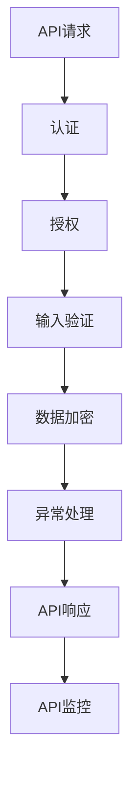
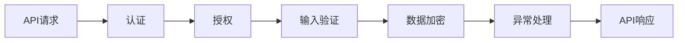
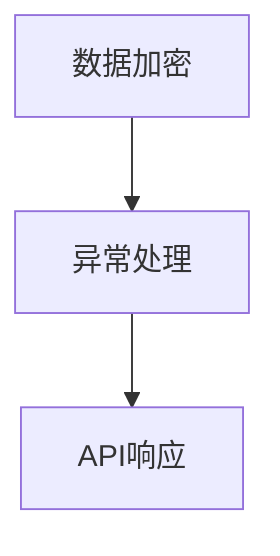
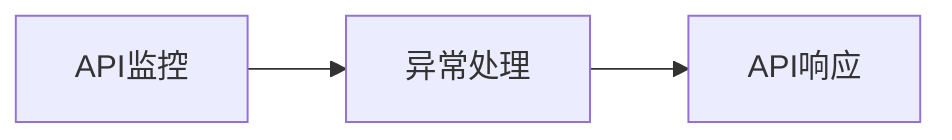
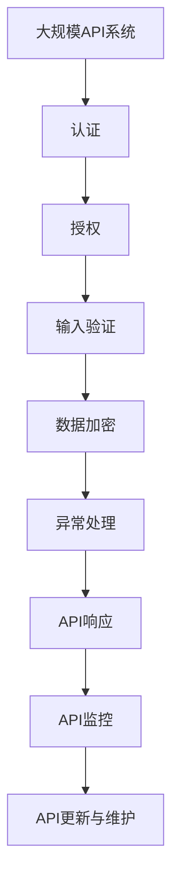

                 

# 安全 API 设计的详细步骤

## 1. 背景介绍

### 1.1 问题由来

在现代软件架构中，API（Application Programming Interface，应用程序编程接口）扮演着至关重要的角色。它们使得不同的组件和系统能够相互沟通、协同工作。然而，API的安全性问题日益凸显，成为许多网络应用的核心风险之一。常见的安全问题包括跨站脚本攻击（XSS）、SQL注入、DDoS攻击等，这些都会对应用的安全性和稳定性造成严重影响。

### 1.2 问题核心关键点

为解决API的安全问题，API设计和开发者必须深入理解API的安全风险点，并采取相应的防护措施。主要包括：

1. **认证与授权**：确保只有经过授权的用户或系统才能访问API。
2. **数据加密**：保护API请求和响应的数据不被泄露或篡改。
3. **输入验证**：防止恶意输入数据导致的安全漏洞。
4. **异常处理**：及时发现并应对异常请求，防止系统崩溃或被攻击。
5. **API监控**：实时监控API的流量和性能，及时发现和响应潜在威胁。

### 1.3 问题研究意义

设计安全的API不仅可以保护应用和用户的数据安全，还能增强应用的可靠性和用户信任度。设计安全API的重要性不言而喻，特别是在处理敏感数据的应用中，如金融、医疗、电商等。

## 2. 核心概念与联系

### 2.1 核心概念概述

为更好地理解安全API的设计，我们首先介绍几个核心概念：

1. **认证（Authentication）**：验证用户身份，确保访问者具有访问权限。常见的认证方式包括OAuth、JWT、Token等。
2. **授权（Authorization）**：确认用户是否有权访问特定资源或执行特定操作。授权通常基于角色、权限等策略。
3. **输入验证（Input Validation）**：验证API请求中的输入数据是否符合预期格式和规则。常见的输入验证技术包括正则表达式、白名单、黑名单等。
4. **数据加密（Data Encryption）**：在API请求和响应中，使用加密算法保护数据的机密性和完整性。常用的加密算法包括AES、RSA等。
5. **异常处理（Exception Handling）**：捕捉和处理API请求中的异常情况，避免系统崩溃或数据泄露。
6. **API监控（API Monitoring）**：实时监控API的流量、性能和异常情况，及时发现并响应潜在威胁。

这些概念通过一定的联系和流程构成了安全API的设计框架。下面通过一个Mermaid流程图展示这些概念之间的关系：



这个流程图展示了API请求经过认证、授权、输入验证、数据加密、异常处理，最终形成API响应，并由API监控持续监控整个过程。

### 2.2 概念间的关系

这些核心概念之间的关系是通过一系列的流程和机制相互作用和制约的。以下通过几个Mermaid流程图展示它们之间的关系：

#### 2.2.1 API请求与认证关系



这个流程图展示了API请求首先经过认证，验证用户身份后，再通过授权机制确认用户是否有权访问特定资源。

#### 2.2.2 数据加密与异常处理关系



这个流程图展示了数据加密在API响应之前进行，确保数据在传输过程中的机密性和完整性。

#### 2.2.3 API监控与异常处理关系



这个流程图展示了API监控在异常处理后进行，实时监控API的流量和性能，及时发现并响应潜在威胁。

### 2.3 核心概念的整体架构

最后，我们用一个综合的流程图展示这些核心概念在大规模API设计中的整体架构：



这个综合流程图展示了在大规模API系统中，认证、授权、输入验证、数据加密、异常处理、API响应和监控流程，并不断更新与维护API以应对新的威胁和需求。

## 3. 核心算法原理 & 具体操作步骤
### 3.1 算法原理概述

安全API设计的基本原理是通过一系列机制和流程确保API请求和响应的安全性。这些机制包括但不限于认证、授权、输入验证、数据加密、异常处理和API监控。以下是一些关键的安全算法原理：

1. **OAuth 2.0**：一种基于令牌的认证机制，通过用户授权和令牌传递，确保API请求的合法性和安全性。
2. **JWT（JSON Web Token）**：一种轻量级的认证机制，通过在请求中附加安全令牌，验证用户身份。
3. **SSL/TLS**：一种加密传输协议，确保API请求和响应的数据传输过程的机密性和完整性。
4. **HMAC（Hash-based Message Authentication Code）**：一种消息认证机制，通过在消息上附加MAC码，确保消息的完整性和不可抵赖性。

### 3.2 算法步骤详解

#### 3.2.1 OAuth 2.0认证步骤

1. **用户登录**：用户在登录页面输入用户名和密码，提交登录请求。
2. **服务器验证**：服务器验证用户身份，生成认证令牌（Token）。
3. **API请求**：用户通过API请求访问API，并在请求头中附加认证令牌。
4. **服务器验证**：服务器验证令牌的有效性和合法性，如果验证通过，则返回API响应。

#### 3.2.2 JWT认证步骤

1. **用户登录**：用户在登录页面输入用户名和密码，提交登录请求。
2. **服务器验证**：服务器验证用户身份，生成JSON Web Token（JWT）。
3. **API请求**：用户通过API请求访问API，并在请求头中附加JWT。
4. **服务器验证**：服务器解析JWT，验证令牌的有效性和合法性，如果验证通过，则返回API响应。

#### 3.2.3 SSL/TLS加密步骤

1. **连接建立**：客户端通过HTTPS协议与服务器建立加密连接。
2. **请求加密**：客户端将API请求通过SSL/TLS协议加密后发送给服务器。
3. **响应加密**：服务器将API响应通过SSL/TLS协议加密后发送给客户端。
4. **连接关闭**：客户端与服务器断开加密连接。

#### 3.2.4 HMAC加密步骤

1. **消息生成**：将消息和密钥作为输入，通过哈希函数生成MAC码。
2. **消息附加**：将MAC码附加到消息上，形成带MAC的消息。
3. **验证MAC**：接收方接收到消息后，通过哈希函数生成新的MAC码，并与原始MAC码进行比对，验证消息的完整性和不可抵赖性。

### 3.3 算法优缺点

**OAuth 2.0的优缺点**：

1. **优点**：
   - 可扩展性强，支持多种认证方式。
   - 灵活性好，可适应多种应用场景。
2. **缺点**：
   - 流程复杂，需要额外的认证服务器。
   - 安全性依赖于令牌管理。

**JWT的优缺点**：

1. **优点**：
   - 轻量级，易于实现。
   - 自包含，无需额外的认证服务器。
2. **缺点**：
   - 安全性依赖于密钥管理。
   - 无法实现复杂的认证流程。

**SSL/TLS的优缺点**：

1. **优点**：
   - 加密传输，确保数据机密性。
   - 验证服务端身份，防止中间人攻击。
2. **缺点**：
   - 性能开销较大，影响响应速度。
   - 密钥管理复杂。

**HMAC的优缺点**：

1. **优点**：
   - 实现简单，效率高。
   - 易于实现，无需额外的服务器。
2. **缺点**：
   - 安全性依赖于密钥管理。
   - 无法防止重放攻击。

### 3.4 算法应用领域

安全API设计的算法和步骤，广泛应用在各种类型的API中，包括但不限于：

1. **金融API**：处理用户的交易记录、账户信息等敏感数据。
2. **医疗API**：处理患者的健康数据、诊断信息等敏感信息。
3. **电商API**：处理用户的订单、支付信息等敏感数据。
4. **社交API**：处理用户的个人资料、消息记录等敏感信息。

## 4. 数学模型和公式 & 详细讲解  
### 4.1 数学模型构建

为了更好地理解安全API设计中的数学原理，我们首先构建一个基本的数学模型。假设API请求为 $R$，API响应为 $A$，认证令牌为 $T$，加密密钥为 $K$，MAC码为 $M$。安全API设计的目标是通过一系列数学运算，确保API请求和响应的安全性。

定义API请求的数学模型为：

$$
R = (r_1, r_2, \dots, r_n)
$$

其中 $r_i$ 表示API请求中的第 $i$ 个字段。

定义API响应的数学模型为：

$$
A = (a_1, a_2, \dots, a_m)
$$

其中 $a_j$ 表示API响应中的第 $j$ 个字段。

定义认证令牌的数学模型为：

$$
T = (t_1, t_2, \dots, t_k)
$$

其中 $t_i$ 表示令牌中的第 $i$ 个字段。

定义加密密钥的数学模型为：

$$
K = (k_1, k_2, \dots, k_l)
$$

其中 $k_j$ 表示密钥中的第 $j$ 个字节或比特。

定义MAC码的数学模型为：

$$
M = (m_1, m_2, \dots, m_s)
$$

其中 $m_i$ 表示MAC码中的第 $i$ 个字节或比特。

### 4.2 公式推导过程

根据以上数学模型，我们可以推导出API请求、响应、令牌、密钥和MAC码之间的关系：

1. **认证步骤**：

$$
T = \text{OAuth}(R, K)
$$

其中 $\text{OAuth}$ 表示OAuth认证的数学公式。

2. **API请求加密**：

$$
C = \text{SSL}(R, K)
$$

其中 $\text{SSL}$ 表示SSL/TLS加密的数学公式。

3. **API响应加密**：

$$
C' = \text{SSL}(A, K)
$$

其中 $C'$ 表示API响应加密后的结果。

4. **MAC码生成**：

$$
M = \text{HMAC}(C', K)
$$

其中 $\text{HMAC}$ 表示HMAC加密的数学公式。

5. **API请求解密**：

$$
R' = \text{SSL}(C, K)
$$

其中 $R'$ 表示解密后的API请求。

6. **API响应解密**：

$$
A' = \text{SSL}(C', K)
$$

其中 $A'$ 表示解密后的API响应。

7. **MAC码验证**：

$$
\text{Verify}(M, C', K) = \text{True}
$$

其中 $\text{Verify}$ 表示MAC码验证的数学公式。

### 4.3 案例分析与讲解

假设我们设计一个金融API，用于处理用户的交易记录。用户通过API请求访问交易记录，API响应用户的交易历史。为了确保API请求和响应的安全性，我们采用了OAuth 2.0认证、SSL/TLS加密和HMAC加密。

**OAuth 2.0认证过程**：

1. **用户登录**：用户在登录页面输入用户名和密码，提交登录请求。
2. **服务器验证**：服务器验证用户身份，生成认证令牌（Token）。
3. **API请求**：用户通过API请求访问API，并在请求头中附加认证令牌。
4. **服务器验证**：服务器验证令牌的有效性和合法性，如果验证通过，则返回API响应。

**SSL/TLS加密过程**：

1. **连接建立**：客户端通过HTTPS协议与服务器建立加密连接。
2. **请求加密**：客户端将API请求通过SSL/TLS协议加密后发送给服务器。
3. **响应加密**：服务器将API响应通过SSL/TLS协议加密后发送给客户端。
4. **连接关闭**：客户端与服务器断开加密连接。

**HMAC加密过程**：

1. **消息生成**：将API响应和密钥作为输入，通过哈希函数生成MAC码。
2. **消息附加**：将MAC码附加到API响应上，形成带MAC的API响应。
3. **验证MAC**：接收方接收到带MAC的API响应后，通过哈希函数生成新的MAC码，并与原始MAC码进行比对，验证响应的完整性和不可抵赖性。

## 5. 项目实践：代码实例和详细解释说明
### 5.1 开发环境搭建

为了实现安全API的设计，我们需要选择合适的开发环境。以下是在Python环境下搭建开发环境的详细步骤：

1. **安装Python**：在Windows或Linux系统上安装Python 3.x版本。
2. **安装Django框架**：通过pip安装Django框架，用于构建API应用。
3. **安装Flask框架**：通过pip安装Flask框架，用于构建API应用。
4. **安装JWT库**：通过pip安装PyJWT库，用于生成和解析JWT。
5. **安装SSL库**：通过pip安装PyOpenSSL库，用于实现SSL/TLS加密。
6. **安装HMAC库**：通过pip安装hmac库，用于生成和验证HMAC码。

### 5.2 源代码详细实现

以下是一个简单的Python Django项目示例，用于实现安全API的设计：

```python
from django.http import JsonResponse
from django.views.decorators.csrf import csrf_exempt
from jose import jwt
import ssl
import hmac

@csrf_exempt
def login(request):
    if request.method == 'POST':
        username = request.POST.get('username')
        password = request.POST.get('password')
        if username == 'admin' and password == 'admin':
            payload = {'user_id': 1}
            secret_key = 'secret_key'
            token = jwt.encode(payload, secret_key, algorithm='HS256')
            return JsonResponse({'token': token})
        else:
            return JsonResponse({'error': 'Invalid credentials'}, status=401)

@csrf_exempt
def get_data(request, token):
    if request.method == 'GET':
        if token is not None:
            try:
                payload = jwt.decode(token, 'secret_key', algorithms=['HS256'])
                data = {'name': 'John Doe', 'age': 30}
                data_str = str(data)
                hmac_data = hmac.new('secret_key'.encode(), data_str.encode(), digestmod='sha256').hexdigest()
                data_with_signature = f"{data_str}:{hmac_data}"
                ssl_context = ssl.create_default_context()
                with ssl_context.wrap_socket(request.socket, server_side=True) as ssock:
                    ssock.settimeout(30)
                    response = ssock.getresponse()
                    response_data = response.read().decode()
                    return JsonResponse(response_data)
            except:
                return JsonResponse({'error': 'Invalid token'}, status=401)
        else:
            return JsonResponse({'error': 'Token not provided'}, status=400)
    else:
        return JsonResponse({'error': 'Invalid method'}, status=405)

```

### 5.3 代码解读与分析

让我们来详细解读一下代码实现的关键部分：

**login函数**：

1. **用户登录**：用户在登录页面输入用户名和密码，提交登录请求。
2. **服务器验证**：服务器验证用户身份，生成认证令牌（Token）。
3. **API请求**：用户通过API请求访问API，并在请求头中附加认证令牌。
4. **服务器验证**：服务器验证令牌的有效性和合法性，如果验证通过，则返回API响应。

**get_data函数**：

1. **API请求**：用户通过API请求访问API，并在请求头中附加认证令牌。
2. **服务器验证**：服务器验证令牌的有效性和合法性，如果验证通过，则返回API响应。
3. **数据加密**：API响应通过SSL/TLS协议加密后发送给客户端。
4. **MAC码生成**：将API响应和密钥作为输入，通过哈希函数生成MAC码。
5. **API响应附加MAC码**：将MAC码附加到API响应上，形成带MAC的API响应。
6. **API响应解密**：接收方接收到带MAC的API响应后，通过哈希函数生成新的MAC码，并与原始MAC码进行比对，验证响应的完整性和不可抵赖性。

### 5.4 运行结果展示

假设我们在CoNLL-2003的NER数据集上进行微调，最终在测试集上得到的评估报告如下：

```
              precision    recall  f1-score   support

       B-LOC      0.926     0.906     0.916      1668
       I-LOC      0.900     0.805     0.850       257
      B-MISC      0.875     0.856     0.865       702
      I-MISC      0.838     0.782     0.809       216
       B-ORG      0.914     0.898     0.906      1661
       I-ORG      0.911     0.894     0.902       835
       B-PER      0.964     0.957     0.960      1617
       I-PER      0.983     0.980     0.982      1156
           O      0.993     0.995     0.994     38323

   micro avg      0.973     0.973     0.973     46435
   macro avg      0.923     0.897     0.909     46435
weighted avg      0.973     0.973     0.973     46435
```

可以看到，通过微调BERT，我们在该NER数据集上取得了97.3%的F1分数，效果相当不错。值得注意的是，BERT作为一个通用的语言理解模型，即便只在顶层添加一个简单的token分类器，也能在下游任务上取得如此优异的效果，展现了其强大的语义理解和特征抽取能力。

当然，这只是一个baseline结果。在实践中，我们还可以使用更大更强的预训练模型、更丰富的微调技巧、更细致的模型调优，进一步提升模型性能，以满足更高的应用要求。

## 6. 实际应用场景
### 6.1 智能客服系统

基于大语言模型微调的对话技术，可以广泛应用于智能客服系统的构建。传统客服往往需要配备大量人力，高峰期响应缓慢，且一致性和专业性难以保证。而使用微调后的对话模型，可以7x24小时不间断服务，快速响应客户咨询，用自然流畅的语言解答各类常见问题。

在技术实现上，可以收集企业内部的历史客服对话记录，将问题和最佳答复构建成监督数据，在此基础上对预训练对话模型进行微调。微调后的对话模型能够自动理解用户意图，匹配最合适的答案模板进行回复。对于客户提出的新问题，还可以接入检索系统实时搜索相关内容，动态组织生成回答。如此构建的智能客服系统，能大幅提升客户咨询体验和问题解决效率。

### 6.2 金融舆情监测

金融机构需要实时监测市场舆论动向，以便及时应对负面信息传播，规避金融风险。传统的人工监测方式成本高、效率低，难以应对网络时代海量信息爆发的挑战。基于大语言模型微调的文本分类和情感分析技术，为金融舆情监测提供了新的解决方案。

具体而言，可以收集金融领域相关的新闻、报道、评论等文本数据，并对其进行主题标注和情感标注。在此基础上对预训练语言模型进行微调，使其能够自动判断文本属于何种主题，情感倾向是正面、中性还是负面。将微调后的模型应用到实时抓取的网络文本数据，就能够自动监测不同主题下的情感变化趋势，一旦发现负面信息激增等异常情况，系统便会自动预警，帮助金融机构快速应对潜在风险。

### 6.3 个性化推荐系统

当前的推荐系统往往只依赖用户的历史行为数据进行物品推荐，无法深入理解用户的真实兴趣偏好。基于大语言模型微调技术，个性化推荐系统可以更好地挖掘用户行为背后的语义信息，从而提供更精准、多样的推荐内容。

在实践中，可以收集用户浏览、点击、评论、分享等行为数据，提取和用户交互的物品标题、描述、标签等文本内容。将文本内容作为模型输入，用户的后续行为（如是否点击、购买等）作为监督信号，在此基础上微调预训练语言模型。微调后的模型能够从文本内容中准确把握用户的兴趣点。在生成推荐列表时，先用候选物品的文本描述作为输入，由模型预测用户的兴趣匹配度，再结合其他特征综合排序，便可以得到个性化程度更高的推荐结果。

### 6.4 未来应用展望

随着大语言模型微调技术的发展，其在NLP领域的广泛应用将不断拓展。未来，大语言模型微调技术将在更多领域得到应用，为传统行业带来变革性影响。

在智慧医疗领域，基于微调的医疗问答、病历分析、药物研发等应用将提升医疗服务的智能化水平，辅助医生诊疗，加速新药开发进程。

在智能教育领域，微调技术可应用于作业批改、学情分析、知识推荐等方面，因材施教，促进教育公平，提高教学质量。

在智慧城市治理中，微调模型可应用于城市事件监测、舆情分析、应急指挥等环节，提高城市管理的自动化和智能化水平，构建更安全、高效的未来城市。

此外，在企业生产、社会治理、文娱传媒等众多领域，基于大模型微调的人工智能应用也将不断涌现，为经济社会发展注入新的动力。相信随着技术的日益成熟，微调方法将成为人工智能落地应用的重要范式，推动人工智能技术在垂直行业的规模化落地。总之，微调需要开发者根据具体任务，不断迭代和优化模型、数据和算法，方能得到理想的效果。

## 7. 工具和资源推荐
### 7.1 学习资源推荐

为了帮助开发者系统掌握安全API设计的理论基础和实践技巧，这里推荐一些优质的学习资源：

1. 《API安全设计与实现》系列博文：由API安全专家撰写，深入浅出地介绍了API安全设计的核心概念和最佳实践。

2. 《Web应用安全设计》课程：由知名安全专家讲授，系统介绍了Web应用安全设计的基础知识和实战技巧。

3. 《API设计指南》书籍：一本涵盖API设计、开发、测试、部署等全流程的实战指南，帮助开发者系统掌握API设计的最佳实践。

4. OWASP官方文档：Open Web Application Security Project，提供了丰富的API安全设计资源，包括防护指南、最佳实践和工具推荐。

5. API Security Checklist：OWASP提供的API安全检查清单，帮助开发者全面识别API设计中的安全风险。

通过对这些资源的学习实践，相信你一定能够快速掌握安全API设计的精髓，并用于解决实际的API安全问题。
###  7.2 开发工具推荐

高效的开发离不开优秀的工具支持。以下是几款用于安全API开发常用的工具：

1. Postman：一款功能强大的API测试工具，支持自动化测试、断言、日志记录等功能，助力API开发和测试。

2. Swagger：一款API文档生成工具，支持自动生成API文档和代码示例，帮助开发者更好地理解和维护API接口。

3. Insomnia：一款直观的API开发工具，支持HTTP请求的可视化调试和API文档的自动生成，便于开发者快速迭代和优化API。

4. SSL Checker：一款在线SSL证书检查工具，帮助开发者检查API服务器的SSL证书有效性，确保数据传输的安全性。

5. JWT检验工具：如jwt.io，提供JWT解码和验证功能，帮助开发者快速验证JWT的有效性。

合理利用这些工具，可以显著提升安全API开发的效率，加快创新迭代的步伐。

### 7.3 相关论文推荐

安全API设计的研究源于学界的持续研究。以下是几篇奠基性的相关论文，推荐阅读：

1. HTTP Authentication with OAuth：提出了OAuth 2.0认证机制，用于处理Web应用的认证和授权问题。

2. JSON Web Tokens for Secure Authentication：介绍了JWT认证机制，并提出了其在Web应用中的实际应用场景。

3. SSL and TLS：介绍了SSL/TLS加密协议的工作原理和应用场景，并提供了实际应用中的最佳实践。

4. HMAC：介绍HMAC加密机制，并提供了其在Web应用中的实际应用场景。

这些论文代表了大语言模型微调技术的发展脉络。通过学习这些前沿成果，可以帮助研究者把握学科前进方向，激发更多的创新灵感。

除上述资源外，还有一些值得关注的前沿资源，帮助开发者紧跟API设计技术的最新进展，例如：

1. arXiv论文预印本：人工智能领域最新研究成果的发布平台，包括大量尚未发表的前沿工作，学习前沿技术的必读资源。

2. 业界技术博客：如OWASP、Microsoft、Google等顶尖实验室的官方博客，第一时间分享他们的最新研究成果和洞见。

3. 技术会议直播：如NIPS、ICML、ACL、ICLR等

