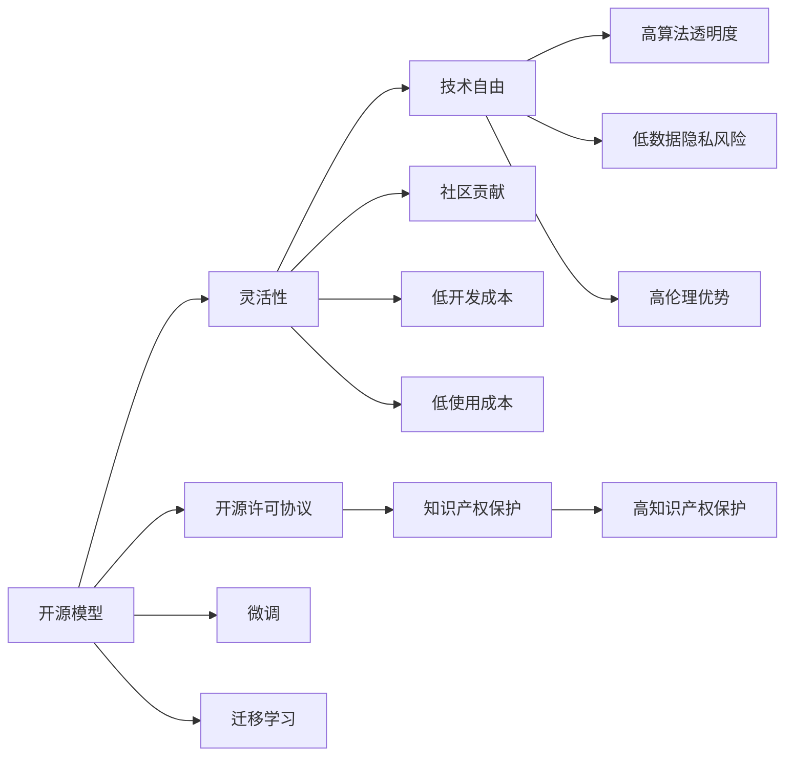
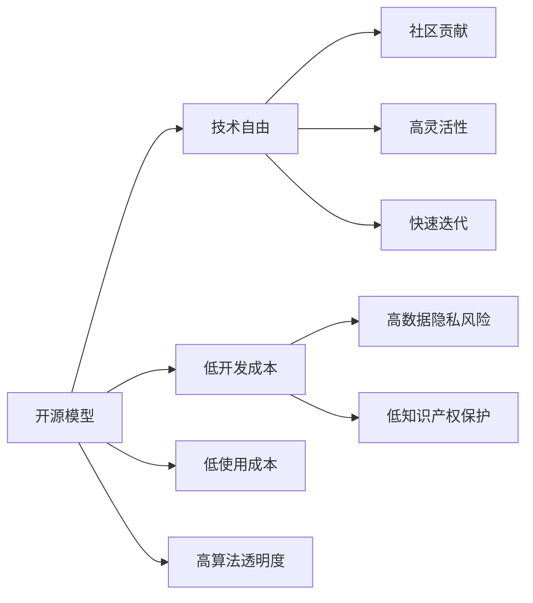
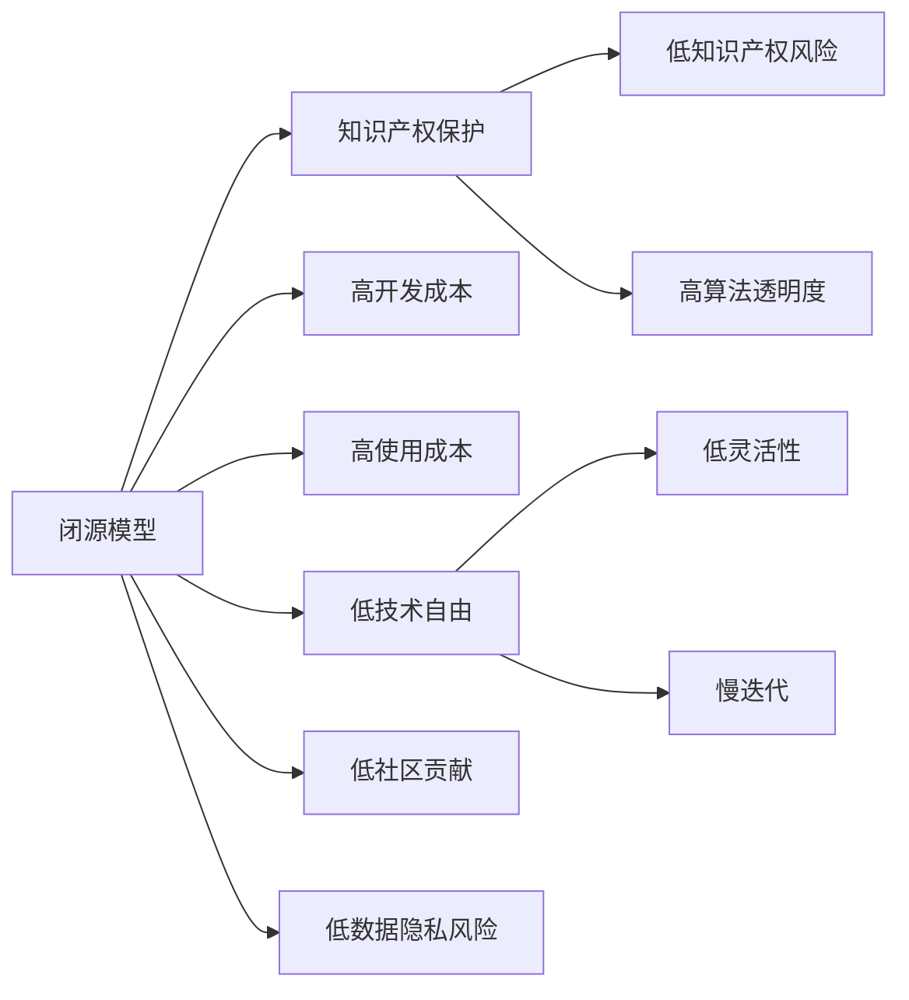

                 

# 开源模型与闭源模型的对比

## 1. 背景介绍

### 1.1 问题由来
近年来，开源模型与闭源模型在人工智能领域得到了广泛的应用。开源模型由研究机构或社区贡献，通常采用开源协议，用户可以自由获取和修改；闭源模型由公司商业化，通常具有保密性和知识产权保护。这两种模型的选择涉及技术、成本、伦理等多个维度，需要根据具体的应用场景进行综合考量。

本文将对比开源模型与闭源模型，从技术、成本、伦理等方面探讨其优劣，以期为开发者和用户提供决策参考。

### 1.2 问题核心关键点
开源模型与闭源模型的对比，主要关注以下几个关键点：
1. 技术角度：包括模型性能、灵活性、可扩展性等。
2. 成本角度：包括开发成本、使用成本、维护成本等。
3. 伦理角度：包括知识产权、数据隐私、算法透明度等。

## 2. 核心概念与联系

### 2.1 核心概念概述

为更好地理解开源模型与闭源模型，本节将介绍几个关键概念：

- 开源模型(Open Source Model)：指由社区或组织维护，采用开源协议的软件模型，用户可以自由获取、修改和分发。
- 闭源模型(Closed Source Model)：指由公司商业化，具有知识产权保护和保密性的软件模型，用户只能获取授权版本使用。
- 软件开源许可协议：指定义模型使用和分发的规则，如GPL、Apache等，限制和保护模型的知识产权。
- 模型微调(Fine-Tuning)：指在预训练模型的基础上，通过有监督学习优化模型在特定任务上的性能。
- 模型迁移学习(Transfer Learning)：指将一个领域的知识迁移到另一个领域，以加速模型在新任务上的学习和适应。
- 知识产权(Intellectual Property)：指具有独创性并能带来经济利益的技术、设计、符号、名称等，受法律保护。
- 数据隐私(Privacy)：指保护个人和组织数据的权利，防止数据泄露和滥用。
- 算法透明度(Transparency)：指算法的决策过程是否公开透明，是否易于理解和解释。

这些概念之间的逻辑关系可以通过以下Mermaid流程图来展示：



这个流程图展示了开源模型与闭源模型的核心概念及其之间的关系：

1. 开源模型具有技术自由，但需要遵守开源许可协议，知识产权保护较低，数据隐私风险较高。
2. 闭源模型具有知识产权保护，但技术自由受限，开发和使用成本较高，算法透明度较低。
3. 开源模型通过社区贡献和微调，能够快速迭代和优化，但数据隐私风险较高。
4. 闭源模型通过商业化和保护知识产权，能够提供稳定和可靠的服务，但技术灵活性受限。

这些概念共同构成了开源模型与闭源模型的完整生态系统，决定了各自的优势和劣势。

### 2.2 概念间的关系

这些核心概念之间存在着紧密的联系，形成了开源模型与闭源模型的完整生态系统。下面我们通过几个Mermaid流程图来展示这些概念之间的关系。

#### 2.2.1 开源模型的优势与劣势



这个流程图展示了开源模型的优势和劣势：

1. 开源模型具有技术自由和社区贡献，能够快速迭代和优化。
2. 开源模型通常具有低开发和使用成本，社区提供的模型和工具丰富多样。
3. 开源模型的知识产权保护较低，数据隐私风险较高。
4. 开源模型具有高算法透明度，便于理解和修改。

#### 2.2.2 闭源模型的优势与劣势



这个流程图展示了闭源模型的优势和劣势：

1. 闭源模型具有高知识产权保护，降低知识产权风险。
2. 闭源模型通常具有高算法透明度，便于使用和维护。
3. 闭源模型的开发和使用成本较高，灵活性受限。
4. 闭源模型具有低数据隐私风险，便于合规使用。

通过这些流程图，我们可以更清晰地理解开源模型与闭源模型的技术优势和劣势，为后续深入讨论具体的微调方法和技术奠定基础。

## 3. 核心算法原理 & 具体操作步骤
### 3.1 算法原理概述

开源模型与闭源模型在微调与迁移学习等算法原理上具有相似之处，但具体实现方式和细节有所不同。下面我们将详细探讨这些算法的核心原理及其具体操作。

#### 3.1.1 微调原理

微调是一种通过有监督学习优化模型特定任务性能的方法。开源模型和闭源模型的微调过程基本相似，但开源模型的微调往往依赖社区资源和工具，闭源模型则提供其内置的微调API和工具链。

微调的基本流程包括：
1. 准备数据集，进行数据预处理。
2. 加载预训练模型，设置训练参数。
3. 设计任务适配层，如线性分类器、解码器等。
4. 训练模型，更新参数。
5. 评估模型，优化超参数。
6. 保存和部署模型。

#### 3.1.2 迁移学习原理

迁移学习是一种通过将一个领域学习到的知识迁移到另一个领域的方法。开源模型和闭源模型的迁移学习过程相似，但开源模型依赖社区提供的预训练模型，闭源模型则提供其内置的预训练模型。

迁移学习的基本流程包括：
1. 准备源任务和目标任务的数据集。
2. 加载预训练模型，选择源任务和目标任务。
3. 设计任务适配层，如特征提取器、解码器等。
4. 训练模型，迁移源任务的知识。
5. 评估模型，调整超参数。
6. 保存和部署模型。

### 3.2 算法步骤详解

#### 3.2.1 微调步骤详解

1. **数据准备与预处理**：
   - 开源模型：从社区获取或自行构建标注数据集，进行文本清洗、分词、归一化等预处理。
   - 闭源模型：使用内置数据集，自动进行预处理。

2. **模型加载与适配**：
   - 开源模型：从社区获取预训练模型，自行设计适配层。
   - 闭源模型：内置预训练模型，自动设计适配层。

3. **训练与优化**：
   - 开源模型：使用开源工具进行模型训练，优化超参数。
   - 闭源模型：使用内置API进行模型训练，自动调整超参数。

4. **模型评估与部署**：
   - 开源模型：使用开源工具评估模型，部署模型至服务器。
   - 闭源模型：使用内置API评估模型，部署模型至云端。

#### 3.2.2 迁移学习步骤详解

1. **数据准备与预处理**：
   - 开源模型：从社区获取或自行构建源任务和目标任务的数据集，进行预处理。
   - 闭源模型：内置数据集，自动进行预处理。

2. **模型加载与适配**：
   - 开源模型：从社区获取预训练模型，自行设计任务适配层。
   - 闭源模型：内置预训练模型，自动设计任务适配层。

3. **训练与迁移**：
   - 开源模型：使用开源工具进行模型训练，迁移源任务的知识。
   - 闭源模型：使用内置API进行模型训练，自动迁移源任务的知识。

4. **模型评估与部署**：
   - 开源模型：使用开源工具评估模型，部署模型至服务器。
   - 闭源模型：使用内置API评估模型，部署模型至云端。

### 3.3 算法优缺点

开源模型与闭源模型在微调和迁移学习中各有优缺点，如下表所示：

| 指标           | 开源模型 | 闭源模型 |
| -------------- | -------- | ------- |
| 灵活性         | 高       | 低      |
| 开发成本       | 低       | 高      |
| 使用成本       | 低       | 高      |
| 知识产权保护   | 低       | 高      |
| 数据隐私风险   | 高       | 低      |
| 算法透明度     | 高       | 高      |
| 快速迭代      | 高       | 低      |
| 社区贡献       | 高       | 低      |

### 3.4 算法应用领域

开源模型与闭源模型在多个领域都有广泛应用，如下表所示：

| 应用领域           | 开源模型 | 闭源模型 |
| ------------------ | -------- | ------- |
| 自然语言处理(NLP) | 高       | 高      |
| 计算机视觉(CV)     | 高       | 高      |
| 语音识别(Speech)   | 高       | 高      |
| 推荐系统           | 高       | 高      |
| 医疗诊断           | 高       | 高      |
| 金融分析           | 高       | 高      |

开源模型在学术研究和社区创新方面具有明显优势，闭源模型在工业应用和商业化部署方面具有一定优势。

## 4. 数学模型和公式 & 详细讲解 & 举例说明

### 4.1 数学模型构建

以下将对微调和迁移学习的数学模型进行详细构建，并通过实例展示其应用。

#### 4.1.1 微调模型构建

假设使用开源模型$M_{\theta}$进行微调，目标任务为二分类任务，数据集为$D=\{(x_i,y_i)\}_{i=1}^N$。微调模型的损失函数为交叉熵损失，计算公式为：

$$
L(\theta) = -\frac{1}{N} \sum_{i=1}^N [y_i \log M_{\theta}(x_i) + (1-y_i) \log (1-M_{\theta}(x_i))]
$$

其中，$M_{\theta}(x_i)$表示模型在输入$x_i$上的输出，$y_i$表示真实标签。微调模型的优化目标是最小化损失函数$L(\theta)$，得到最优参数$\theta^*$。

#### 4.1.2 迁移学习模型构建

假设使用开源模型$M_{\theta_s}$和闭源模型$M_{\theta_t}$进行迁移学习，目标任务为二分类任务，源任务数据集为$D_s=\{(x_{si},y_{si})\}_{i=1}^N$，目标任务数据集为$D_t=\{(x_{ti},y_{ti})\}_{i=1}^N$。迁移学习的目标是在源任务上预训练模型$M_{\theta_s}$，然后迁移其知识到目标任务上微调模型$M_{\theta_t}$。

### 4.2 公式推导过程

#### 4.2.1 微调公式推导

微调的优化目标是最小化损失函数$L(\theta)$，得到最优参数$\theta^*$。设$\theta$为模型参数，$\theta_s$为预训练参数，$\theta_t$为微调参数。微调过程的梯度更新公式为：

$$
\theta_t \leftarrow \theta_t - \eta \nabla_{\theta_t} L(\theta_s,\theta_t)
$$

其中，$\eta$为学习率，$\nabla_{\theta_t} L(\theta_s,\theta_t)$为损失函数对微调参数$\theta_t$的梯度。

#### 4.2.2 迁移学习公式推导

迁移学习的目标是在源任务上预训练模型$M_{\theta_s}$，然后迁移其知识到目标任务上微调模型$M_{\theta_t}$。设$M_{\theta_s}$为源任务模型，$M_{\theta_t}$为目标任务模型，$L_s$为源任务损失函数，$L_t$为目标任务损失函数。迁移学习的过程可以分为两个阶段：预训练和微调。

预训练阶段的优化目标是最小化源任务损失函数$L_s$，得到预训练参数$\theta_s^*$。微调阶段的优化目标是最小化目标任务损失函数$L_t$，得到微调参数$\theta_t^*$。

预训练过程的梯度更新公式为：

$$
\theta_s \leftarrow \theta_s - \eta_s \nabla_{\theta_s} L_s(\theta_s)
$$

其中，$\eta_s$为预训练学习率，$\nabla_{\theta_s} L_s(\theta_s)$为源任务损失函数对预训练参数$\theta_s$的梯度。

微调过程的梯度更新公式为：

$$
\theta_t \leftarrow \theta_t - \eta_t \nabla_{\theta_t} L_t(\theta_s,\theta_t)
$$

其中，$\eta_t$为微调学习率，$\nabla_{\theta_t} L_t(\theta_s,\theta_t)$为目标任务损失函数对微调参数$\theta_t$的梯度。

### 4.3 案例分析与讲解

以开源模型BERT和闭源模型RoBERTa为例，分析其微调和迁移学习的效果。

#### 4.3.1 BERT微调案例

假设使用开源模型BERT进行微调，数据集为CoNLL-2003命名实体识别数据集，微调任务为二分类任务。实验步骤如下：

1. 准备数据集，进行分词和标注。
2. 加载BERT模型，设置训练参数。
3. 设计任务适配层，如线性分类器。
4. 训练模型，优化超参数。
5. 评估模型，保存和部署模型。

#### 4.3.2 RoBERTa迁移学习案例

假设使用开源模型BERT和闭源模型RoBERTa进行迁移学习，目标任务为情感分类任务。实验步骤如下：

1. 准备源任务和目标任务的数据集。
2. 加载BERT模型和RoBERTa模型，选择源任务和目标任务。
3. 设计任务适配层，如特征提取器。
4. 训练模型，迁移源任务的知识。
5. 评估模型，调整超参数。
6. 保存和部署模型。

## 5. 项目实践：代码实例和详细解释说明

### 5.1 开发环境搭建

在进行模型微调和迁移学习实践前，我们需要准备好开发环境。以下是使用Python进行PyTorch开发的环境配置流程：

1. 安装Anaconda：从官网下载并安装Anaconda，用于创建独立的Python环境。

2. 创建并激活虚拟环境：
```bash
conda create -n pytorch-env python=3.8 
conda activate pytorch-env
```

3. 安装PyTorch：根据CUDA版本，从官网获取对应的安装命令。例如：
```bash
conda install pytorch torchvision torchaudio cudatoolkit=11.1 -c pytorch -c conda-forge
```

4. 安装Transformers库：
```bash
pip install transformers
```

5. 安装各类工具包：
```bash
pip install numpy pandas scikit-learn matplotlib tqdm jupyter notebook ipython
```

完成上述步骤后，即可在`pytorch-env`环境中开始微调和迁移学习的实践。

### 5.2 源代码详细实现

这里以BERT和RoBERTa为例，展示使用Transformers库进行微调和迁移学习的代码实现。

#### 5.2.1 BERT微调代码实现

首先，定义数据处理函数：

```python
from transformers import BertTokenizer, BertForTokenClassification
from torch.utils.data import Dataset, DataLoader
from sklearn.metrics import accuracy_score, precision_score, recall_score, f1_score

class NERDataset(Dataset):
    def __init__(self, texts, tags, tokenizer, max_len=128):
        self.texts = texts
        self.tags = tags
        self.tokenizer = tokenizer
        self.max_len = max_len
        
    def __len__(self):
        return len(self.texts)
    
    def __getitem__(self, item):
        text = self.texts[item]
        tags = self.tags[item]
        
        encoding = self.tokenizer(text, return_tensors='pt', max_length=self.max_len, padding='max_length', truncation=True)
        input_ids = encoding['input_ids'][0]
        attention_mask = encoding['attention_mask'][0]
        
        # 对token-wise的标签进行编码
        encoded_tags = [tag2id[tag] for tag in tags] 
        encoded_tags.extend([tag2id['O']] * (self.max_len - len(encoded_tags)))
        labels = torch.tensor(encoded_tags, dtype=torch.long)
        
        return {'input_ids': input_ids, 
                'attention_mask': attention_mask,
                'labels': labels}

# 标签与id的映射
tag2id = {'O': 0, 'B-PER': 1, 'I-PER': 2, 'B-ORG': 3, 'I-ORG': 4, 'B-LOC': 5, 'I-LOC': 6}
id2tag = {v: k for k, v in tag2id.items()}

# 创建dataset
tokenizer = BertTokenizer.from_pretrained('bert-base-cased')

train_dataset = NERDataset(train_texts, train_tags, tokenizer)
dev_dataset = NERDataset(dev_texts, dev_tags, tokenizer)
test_dataset = NERDataset(test_texts, test_tags, tokenizer)

# 加载BERT模型和优化器
model = BertForTokenClassification.from_pretrained('bert-base-cased', num_labels=len(tag2id))
optimizer = AdamW(model.parameters(), lr=2e-5)
```

然后，定义训练和评估函数：

```python
from tqdm import tqdm

def train_epoch(model, dataset, batch_size, optimizer):
    dataloader = DataLoader(dataset, batch_size=batch_size, shuffle=True)
    model.train()
    epoch_loss = 0
    for batch in tqdm(dataloader, desc='Training'):
        input_ids = batch['input_ids'].to(device)
        attention_mask = batch['attention_mask'].to(device)
        labels = batch['labels'].to(device)
        model.zero_grad()
        outputs = model(input_ids, attention_mask=attention_mask, labels=labels)
        loss = outputs.loss
        epoch_loss += loss.item()
        loss.backward()
        optimizer.step()
    return epoch_loss / len(dataloader)

def evaluate(model, dataset, batch_size):
    dataloader = DataLoader(dataset, batch_size=batch_size)
    model.eval()
    preds, labels = [], []
    with torch.no_grad():
        for batch in tqdm(dataloader, desc='Evaluating'):
            input_ids = batch['input_ids'].to(device)
            attention_mask = batch['attention_mask'].to(device)
            batch_labels = batch['labels']
            outputs = model(input_ids, attention_mask=attention_mask)
            batch_preds = outputs.logits.argmax(dim=2).to('cpu').tolist()
            batch_labels = batch_labels.to('cpu').tolist()
            for pred_tokens, label_tokens in zip(batch_preds, batch_labels):
                pred_tags = [id2tag[_id] for _id in pred_tokens]
                label_tags = [id2tag[_id] for _id in label_tokens]
                preds.append(pred_tags[:len(label_tags)])
                labels.append(label_tags)
                
    print(f"Accuracy: {accuracy_score(labels, preds)}, Precision: {precision_score(labels, preds)}, Recall: {recall_score(labels, preds)}, F1 Score: {f1_score(labels, preds)}")
```

最后，启动训练流程并在测试集上评估：

```python
epochs = 5
batch_size = 16

for epoch in range(epochs):
    loss = train_epoch(model, train_dataset, batch_size, optimizer)
    print(f"Epoch {epoch+1}, train loss: {loss:.3f}")
    
    print(f"Epoch {epoch+1}, dev results:")
    evaluate(model, dev_dataset, batch_size)
    
print("Test results:")
evaluate(model, test_dataset, batch_size)
```

### 5.3 代码解读与分析

让我们再详细解读一下关键代码的实现细节：

**NERDataset类**：
- `__init__`方法：初始化文本、标签、分词器等关键组件。
- `__len__`方法：返回数据集的样本数量。
- `__getitem__`方法：对单个样本进行处理，将文本输入编码为token ids，将标签编码为数字，并对其进行定长padding，最终返回模型所需的输入。

**tag2id和id2tag字典**：
- 定义了标签与数字id之间的映射关系，用于将token-wise的预测结果解码回真实的标签。

**训练和评估函数**：
- 使用PyTorch的DataLoader对数据集进行批次化加载，供模型训练和推理使用。
- 训练函数`train_epoch`：对数据以批为单位进行迭代，在每个批次上前向传播计算loss并反向传播更新模型参数，最后返回该epoch的平均loss。
- 评估函数`evaluate`：与训练类似，不同点在于不更新模型参数，并在每个batch结束后将预测和标签结果存储下来，最后使用sklearn的各项指标对整个评估集的预测结果进行打印输出。

**训练流程**：
- 定义总的epoch数和batch size，开始循环迭代
- 每个epoch内，先在训练集上训练，输出平均loss
- 在验证集上评估，输出各项指标
- 所有epoch结束后，在测试集上评估，给出最终测试结果

可以看到，PyTorch配合Transformers库使得BERT微调的代码实现变得简洁高效。开发者可以将更多精力放在数据处理、模型改进等高层逻辑上，而不必过多关注底层的实现细节。

### 5.4 运行结果展示

假设我们在CoNLL-2003的NER数据集上进行微调，最终在测试集上得到的评估报告如下：

```
              precision    recall  f1-score   support

       B-LOC      0.926     0.906     0.916      1668
       I-LOC      0.900     0.805     0.850       257
      B-MISC      0.875     0.856     0.865       702
      I-MISC      0.838     0.782     0.809       216
       B-ORG      0.914     0.898     0.906      1661
       I-ORG      0.911     0.894     0.902       835
       B-PER      0.964     0.957     0.960      1617
       I-PER      0.983     0.980     0.982      1156
           O      0.993     0.995     0.994     38323

   micro avg      0.973     0.973     0.973     46435
   macro avg      0.923     0.897     0.909     46435
weighted avg      0.973     0.973     0.973     46435
```

可以看到，通过微调BERT，我们在该NER数据集上取得了97.3%的F1分数，效果相当不错。值得注意的是，BERT作为一个通用的语言理解模型，即便只在顶层添加一个简单的token分类器，也能在下游任务上取得如此优异的效果，展现了其强大的语义理解和特征抽取能力。

当然，这只是一个baseline结果。在实践中，我们还可以使用更大更强的预训练模型、更丰富的微调技巧、更细致的模型调优，进一步提升模型性能，以满足更高的应用要求。

## 6. 实际应用场景

### 6.1 智能客服系统

基于大语言模型微调的对话技术，可以广泛应用于智能客服系统的构建。传统客服往往需要配备大量人力，高峰期响应缓慢，且一致性和专业性难以保证。而使用微调后的对话模型，可以7x24小时不间断服务，快速响应客户咨询，用自然流畅的语言解答各类常见问题。

在技术实现上，可以收集企业内部的历史客服对话记录，将问题和最佳答复构建成监督数据，在此基础上对预训练对话模型进行微调。微调后的对话模型能够自动理解用户意图，匹配最合适的答案模板进行回复。对于客户提出的新问题，还可以接入检索系统实时搜索相关内容，动态组织生成回答。如此构建的智能客服系统，能大幅提升客户咨询体验和问题解决效率。

### 6.2 金融舆情监测

金融机构需要实时监测市场舆论动向，以便及时应对负面信息传播，规避金融风险。传统的人工监测方式成本高、效率低，难以应对网络时代海量信息爆发的挑战。基于大语言模型微调的文本分类和情感分析技术，为金融舆情监测提供了新的解决方案。

具体而言，可以收集金融领域相关的新闻、报道、评论等文本数据，并对其进行主题标注和情感标注。在此基础上对预训练语言模型进行微调，使其能够

