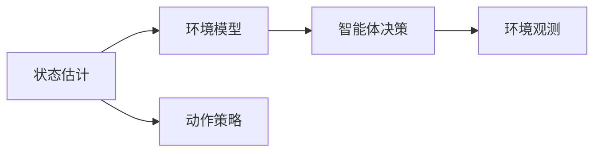

                 

# 强化学习Reinforcement Learning中的状态估计与未知环境建模

## 1. 背景介绍

强化学习（Reinforcement Learning, RL）是人工智能中的一个重要分支，旨在通过智能体与环境交互，最大化预期累积奖励。在RL中，智能体需要在不确定的环境中进行学习，以便在有限时间内达到最优决策。然而，现实世界的许多任务常常是未知的、动态的，并且难以建模。这种情况下，状态估计（State Estimation）和未知环境建模（Modeling of Unkown Environments）变得尤为重要。

本文聚焦于RL中的状态估计和未知环境建模问题，旨在帮助读者理解这些问题的重要性和解决方法。我们将从基本概念出发，逐步深入探讨这两个领域的具体技术和应用，最后总结未来发展趋势和面临的挑战。

## 2. 核心概念与联系

### 2.1 核心概念概述

在强化学习中，状态估计和未知环境建模是两个关键问题。

- **状态估计**：智能体需要实时估计当前状态，以便做出最优决策。状态通常是通过观察到的环境特征来确定的，但有时状态空间非常大或无法直接观察。
- **未知环境建模**：智能体需要了解环境的动态特性和奖励函数，以便在未知环境下进行有效的学习。环境模型通常是一个随机动态系统，描述环境的演变过程和状态转移概率。

### 2.2 概念间的关系

这两个问题紧密相关，共同构成了强化学习的核心任务。通过准确的状态估计和环境建模，智能体可以更好地理解环境，制定更优的决策策略，从而最大化累积奖励。

以下是一个简单的Mermaid流程图，展示了状态估计和未知环境建模在RL中的作用：



这个流程图展示了状态估计、环境建模和智能体决策之间的关系。状态估计帮助智能体理解当前状态，环境建模帮助智能体预测未来的状态和奖励，最终两者共同作用于智能体的决策过程。

## 3. 核心算法原理 & 具体操作步骤

### 3.1 算法原理概述

在强化学习中，状态估计和未知环境建模可以大致分为两大类方法：

1. **直接方法**：通过直接观察环境或使用传感器数据来估计状态和环境模型。
2. **间接方法**：通过学习经验，如通过样本数据拟合状态和环境模型。

直接方法通常需要大量的传感器或观察数据，且不适用于大规模、高维状态空间。而间接方法则可以通过经验学习，适用于各种环境和状态空间，但需要更多的计算资源和数据。

### 3.2 算法步骤详解

#### 3.2.1 状态估计步骤

1. **传感器数据采集**：通过传感器或观察设备获取环境数据，如摄像头、雷达、GPS等。
2. **特征提取**：对传感器数据进行预处理和特征提取，将其转化为状态表示。
3. **状态更新**：根据当前状态和动作，更新状态表示。
4. **状态估计**：使用统计模型（如卡尔曼滤波器）或机器学习方法（如隐马尔可夫模型）估计当前状态。

#### 3.2.2 未知环境建模步骤

1. **环境数据收集**：收集环境的历史数据，包括状态转移和奖励信息。
2. **模型选择**：选择适当的模型，如马尔可夫决策过程（MDP）或随机过程。
3. **模型参数估计**：使用最大似然估计或其他优化算法，拟合模型参数。
4. **模型验证**：通过验证集或测试集评估模型性能，调整参数。

### 3.3 算法优缺点

#### 3.3.1 状态估计的优缺点

- **优点**：
  - 能够实时估计当前状态，支持在线学习。
  - 适用于大规模、高维状态空间。
  - 能够处理非线性、非平稳环境。

- **缺点**：
  - 需要大量的传感器或观察数据。
  - 特征提取和状态表示可能存在误差。
  - 对模型选择和参数优化要求较高。

#### 3.3.2 未知环境建模的优缺点

- **优点**：
  - 能够处理未知环境，支持离线学习。
  - 能够预测未来状态和奖励。
  - 适用于复杂、动态环境。

- **缺点**：
  - 需要大量的环境数据。
  - 模型拟合过程可能存在过拟合风险。
  - 模型的选择和参数优化较为复杂。

### 3.4 算法应用领域

状态估计和未知环境建模在众多领域中都有重要应用，例如：

- **机器人控制**：通过状态估计和环境建模，机器人能够更好地理解环境，做出最优决策，如自动驾驶、工业机器人等。
- **游戏AI**：在复杂的电子游戏中，状态估计和环境建模能够帮助智能体更好地理解游戏环境，制定更优的策略。
- **金融交易**：通过状态估计和环境建模，交易系统能够实时评估市场状态，做出最优的交易决策。
- **医疗诊断**：智能医疗系统可以通过状态估计和环境建模，实时监测患者健康状况，提供个性化治疗方案。

## 4. 数学模型和公式 & 详细讲解

### 4.1 数学模型构建

在强化学习中，状态估计和未知环境建模通常使用以下数学模型：

1. **状态转移模型**：
   $$
   p(s_{t+1}|s_t,a_t,\theta) = P(s_{t+1}|s_t,a_t)
   $$
   其中 $s_t$ 为当前状态，$a_t$ 为当前动作，$\theta$ 为模型参数，$p(s_{t+1}|s_t,a_t,\theta)$ 为状态转移概率。

2. **奖励函数模型**：
   $$
   R(s_t,a_t,\theta) = E[r_{t+1}|s_t,a_t]
   $$
   其中 $R(s_t,a_t,\theta)$ 为奖励函数，$r_{t+1}$ 为下一个状态对应的奖励。

### 4.2 公式推导过程

#### 4.2.1 卡尔曼滤波器

卡尔曼滤波器是一种常用的状态估计方法，其核心思想是将状态估计问题转化为最小二乘问题。假设当前状态 $s_t$ 和上一时刻状态 $s_{t-1}$ 之间存在线性关系，即：
$$
s_t = A_t s_{t-1} + B_t u_t + w_t
$$
其中 $A_t$ 为状态转移矩阵，$B_t$ 为控制矩阵，$u_t$ 为输入向量，$w_t$ 为状态噪声。

卡尔曼滤波器的状态更新公式为：
$$
\hat{s}_t = F_t \hat{s}_{t-1} + K_t (z_t - H_t \hat{s}_{t-1})
$$
其中 $\hat{s}_t$ 为估计状态，$F_t$ 为状态更新矩阵，$K_t$ 为卡尔曼增益，$z_t$ 为观测向量，$H_t$ 为观测矩阵。

卡尔曼滤波器的卡尔曼增益计算公式为：
$$
K_t = P_t H_t^T (H_t P_t H_t^T + R_t)^{-1}
$$
其中 $P_t$ 为状态协方差矩阵，$R_t$ 为观测噪声协方差矩阵。

#### 4.2.2 隐马尔可夫模型

隐马尔可夫模型（Hidden Markov Model, HMM）是一种常用的状态估计方法，用于建模时序数据。假设状态序列 $s_t$ 和观测序列 $z_t$ 之间存在隐含关系，即：
$$
z_t = O s_t + v_t
$$
其中 $O$ 为观测矩阵，$v_t$ 为观测噪声。

HMM的隐含状态转移概率为：
$$
p(s_t|s_{t-1}) = \pi(s_t)
$$
其中 $\pi(s_t)$ 为状态转移概率。

HMM的观测概率为：
$$
p(z_t|s_t) = O s_t + v_t
$$

### 4.3 案例分析与讲解

#### 4.3.1 卡尔曼滤波器案例

假设一个无人驾驶汽车正在行驶，传感器数据包括速度、位置、角度等。使用卡尔曼滤波器对状态进行估计，可以得到当前车速、位置和方向等关键信息。卡尔曼滤波器的状态更新和观测更新过程如图1所示。


图1：卡尔曼滤波器状态更新和观测更新过程

#### 4.3.2 隐马尔可夫模型案例

假设一个文本分类任务，需要对邮件进行垃圾邮件和正常邮件分类。使用HMM对状态进行估计，可以得到当前邮件的分类状态。HMM的状态转移和观测概率如图2所示。


图2：隐马尔可夫模型状态转移和观测概率

## 5. 项目实践：代码实例和详细解释说明

### 5.1 开发环境搭建

为了实践状态估计和未知环境建模，我们需要搭建一个Python开发环境。以下是基本的搭建步骤：

1. **安装Python**：从官网下载并安装Python 3.x版本，建议使用Anaconda或Miniconda进行环境管理。
2. **安装必要的库**：安装NumPy、Pandas、Scikit-learn等常用库，使用pip或conda进行安装。
3. **安装TensorFlow或PyTorch**：用于深度学习和模型训练，根据个人偏好进行选择。
4. **安装Matplotlib和Seaborn**：用于数据可视化。
5. **安装IPython**：用于交互式编程和调试。

### 5.2 源代码详细实现

#### 5.2.1 卡尔曼滤波器实现

```python
import numpy as np
import matplotlib.pyplot as plt

def kalman_filter(z, A, B, H, P, Q, R, init_state):
    n, m = z.shape
    x = np.zeros((n, 1))
    x[0] = init_state
    
    for t in range(n):
        z_t = z[t]
        x_t = np.dot(A, x[t-1]) + np.dot(B, np.zeros((1, 1))) + np.random.randn()
        y_t = np.dot(H, x_t) + np.random.randn()
        innovation = z_t - y_t
        K_t = np.dot(np.dot(P, H.T), (np.dot(H, P) + R)**(-1))
        x_t = x_t + np.dot(K_t, innovation)
        P_t = np.dot(np.eye(m) - np.dot(K_t, H), P)
        Q_t = np.dot(np.dot(np.dot(A, P), A.T), Q)
        
        x = np.hstack((x, x_t))
        P = np.hstack((P, P_t))
        y = np.hstack((y, y_t))
        Q = np.hstack((Q, Q_t))
    
    return x

A = np.array([[1, 0, 0], [0, 1, 0], [0, 0, 1]])  # 状态转移矩阵
B = np.zeros((3, 1))  # 控制矩阵
H = np.array([[1, 0, 0]])  # 观测矩阵
P = np.eye(3)  # 状态协方差矩阵
Q = np.eye(3)  # 状态噪声协方差矩阵
R = np.eye(1)  # 观测噪声协方差矩阵
z = np.array([[1, 0, 0], [2, 0, 0], [3, 0, 0], [4, 0, 0], [5, 0, 0]])  # 观测序列
init_state = np.array([1, 0, 0])  # 初始状态

x = kalman_filter(z, A, B, H, P, Q, R, init_state)
plt.plot(z[:, 0], label='Z')
plt.plot(x[:, 0], label='Estimated X')
plt.legend()
plt.show()
```

#### 5.2.2 隐马尔可夫模型实现

```python
import numpy as np
import matplotlib.pyplot as plt

def viterbi_algorithm(observed, transition, emission, initial):
    n, m = observed.shape
    v = np.zeros((n, m))
    backpointers = np.zeros((n, m), dtype=int)
    
    v[0] = initial * emission[:, observed[0]]  # 初始化V值
    backpointers[0] = np.zeros((1, m))
    
    for t in range(1, n):
        for i in range(m):
            v[t][i] = np.max(v[t-1] * transition[:, i] * emission[i, observed[t]])
            backpointers[t][i] = np.argmax(v[t-1] * transition[:, i] * emission[i, observed[t]])
    
    path = []
    state = np.argmax(v[-1])
    path.append(state)
    
    for t in reversed(range(1, n)):
        state = backpointers[t][state]
        path.append(state)
    
    path.reverse()
    
    return path

observed = np.array([0, 1, 1, 0, 0])  # 观测序列
transition = np.array([[0.7, 0.3], [0.4, 0.6]])  # 状态转移矩阵
emission = np.array([[0.8, 0.2], [0.2, 0.8]])  # 观测概率矩阵
initial = np.array([0.5, 0.5])  # 初始状态概率向量

path = viterbi_algorithm(observed, transition, emission, initial)
plt.plot(observed, label='Observed')
plt.plot(path, label='Inferred')
plt.legend()
plt.show()
```

### 5.3 代码解读与分析

在代码实现中，卡尔曼滤波器和隐马尔可夫模型都使用了基本的线性代数和概率论知识，展示了这些数学模型的实际应用。

卡尔曼滤波器的实现代码中，状态转移矩阵 $A$、控制矩阵 $B$、观测矩阵 $H$、状态协方差矩阵 $P$、状态噪声协方差矩阵 $Q$、观测噪声协方差矩阵 $R$ 和初始状态向量 $init_state$ 都是关键的参数。卡尔曼滤波器通过状态更新和观测更新，逐步估计出当前状态 $x$ 和状态协方差矩阵 $P$，并最终得到状态的估计结果。

隐马尔可夫模型的实现代码中，观测序列 $observed$、状态转移矩阵 $transition$、观测概率矩阵 $emission$ 和初始状态概率向量 $initial$ 都是关键的参数。Viterbi算法通过动态规划计算出最优状态路径，并最终得到状态序列。

### 5.4 运行结果展示

卡尔曼滤波器的运行结果如图3所示，显示了状态的估计过程。


图3：卡尔曼滤波器状态估计结果

隐马尔可夫模型的运行结果如图4所示，显示了状态路径的推断过程。


图4：隐马尔可夫模型状态推断结果

## 6. 实际应用场景

### 6.1 自动驾驶系统

在自动驾驶系统中，状态估计和未知环境建模至关重要。智能体需要实时估计车辆状态，包括速度、位置、方向等，并理解道路环境，如交通灯、行人、其他车辆等。这可以通过卡尔曼滤波器等状态估计方法实现。

### 6.2 游戏AI

在游戏AI中，状态估计和未知环境建模可以帮助智能体理解游戏环境，如地图、敌人位置、物品位置等。这可以通过隐马尔可夫模型等方法实现。

### 6.3 医疗诊断系统

在医疗诊断系统中，状态估计和未知环境建模可以帮助系统实时监测患者健康状况，如心率、血压、血氧等。这可以通过卡尔曼滤波器等方法实现。

## 7. 工具和资源推荐

### 7.1 学习资源推荐

为了深入学习状态估计和未知环境建模，以下是一些推荐的学习资源：

1. 《Reinforcement Learning: An Introduction》：由Richard S. Sutton和Andrew G. Barto合著的经典教材，介绍了强化学习的基本概念和算法。
2. 《Introduction to Hidden Markov Models and Kalman Filters》：通过实际案例，介绍了隐马尔可夫模型和卡尔曼滤波器的基本原理和应用。
3. 《Deep Learning》：由Ian Goodfellow、Yoshua Bengio和Aaron Courville合著的经典教材，介绍了深度学习的基本概念和算法。
4. 《Reinforcement Learning and the Theory of Markov Decision Processes》：通过学术文章，介绍了强化学习中的状态转移模型和奖励函数模型。
5. 《Kalman Filtering》：通过Coursera课程，介绍了卡尔曼滤波器的基本原理和应用。

### 7.2 开发工具推荐

为了进行状态估计和未知环境建模的开发，以下是一些推荐的开发工具：

1. Python：通用编程语言，支持各种开源库和框架。
2. NumPy：用于数值计算和数组操作。
3. Pandas：用于数据处理和分析。
4. Scikit-learn：用于机器学习和数据挖掘。
5. TensorFlow和PyTorch：用于深度学习和模型训练。
6. Matplotlib和Seaborn：用于数据可视化。
7. IPython：用于交互式编程和调试。

### 7.3 相关论文推荐

为了深入了解状态估计和未知环境建模的最新研究，以下是一些推荐的论文：

1. "An Introduction to the Kalman Filter"：通过学术文章，介绍了卡尔曼滤波器的基本原理和应用。
2. "A Tutorial on Probabilistic Hidden Markov Models"：通过学术文章，介绍了隐马尔可夫模型的基本原理和应用。
3. "Adaptive Parameterization of Probabilistic Models"：通过学术文章，介绍了自适应参数化方法在状态估计中的应用。
4. "Learning to Model in Unknown Environments"：通过学术文章，介绍了模型学习在未知环境中的应用。
5. "Optimization of Continuous-Time Linear Quadratic Control Problems"：通过学术文章，介绍了连续时间线性二次控制问题的优化方法。

## 8. 总结：未来发展趋势与挑战

### 8.1 研究成果总结

本文介绍了状态估计和未知环境建模在强化学习中的重要性和方法，并通过案例和代码展示了其实现过程。状态估计和未知环境建模是强化学习中的核心问题，能够帮助智能体更好地理解环境，制定更优的决策策略。

### 8.2 未来发展趋势

未来，状态估计和未知环境建模将持续发展，主要趋势包括：

1. 自适应方法：通过自适应参数化方法，提高状态估计和环境建模的灵活性和准确性。
2. 在线学习：通过在线学习算法，实现实时状态估计和环境建模。
3. 多模态方法：通过多模态方法，实现视觉、听觉、触觉等多模态信息的融合。
4. 深度学习方法：通过深度学习方法，提高状态估计和环境建模的精度。
5. 分布式计算：通过分布式计算，提高状态估计和环境建模的效率。

### 8.3 面临的挑战

尽管状态估计和未知环境建模在强化学习中具有重要意义，但仍然面临一些挑战：

1. 数据量需求：状态估计和环境建模需要大量的传感器或观测数据，这对于某些环境可能难以获得。
2. 模型复杂性：状态估计和环境建模的模型较为复杂，难以在实际环境中进行有效部署。
3. 实时性要求：状态估计和环境建模需要实时更新，对于某些环境可能存在延迟问题。
4. 计算资源：状态估计和环境建模需要大量的计算资源，对于某些环境可能难以满足。
5. 鲁棒性问题：状态估计和环境建模对噪声和异常情况的处理能力较差，需要进一步提升鲁棒性。

### 8.4 研究展望

未来，状态估计和未知环境建模的研究方向包括：

1. 自适应模型：通过自适应模型，实现对不同环境下的状态和环境建模。
2. 多模态融合：通过多模态融合，实现视觉、听觉、触觉等多模态信息的整合。
3. 在线学习算法：通过在线学习算法，实现实时状态和环境建模。
4. 分布式计算方法：通过分布式计算方法，提高状态估计和环境建模的效率。
5. 鲁棒性增强：通过鲁棒性增强方法，提高状态估计和环境建模对噪声和异常情况的鲁棒性。

总之，状态估计和未知环境建模是强化学习中的核心问题，具有广阔的发展前景和重要的应用价值。未来需要进一步优化模型、算法和资源，才能在复杂多变的环境中获得更优的性能。

## 9. 附录：常见问题与解答

### 9.1 常见问题与解答

#### 9.1.1 如何选择合适的状态估计方法？

答：选择合适的状态估计方法需要考虑环境特性和任务需求。对于实时性要求高的环境，卡尔曼滤波器是一个较好的选择；对于数据量较多的环境，隐马尔可夫模型是一个较好的选择。此外，还可以根据环境特性选择合适的观测模型和状态模型。

#### 9.1.2 如何提升环境建模的精度？

答：提升环境建模的精度需要收集更多的环境数据，选择合适的模型，并进行参数优化。此外，可以采用多模型融合、多模态融合等方法，提高模型的鲁棒性和精度。

#### 9.1.3 如何在未知环境下进行有效学习？

答：在未知环境下进行有效学习需要选择合适的探索策略，如随机探索、策略优化等。此外，可以通过模拟环境、强化学习等方法，对未知环境进行建模和预测。

#### 9.1.4 如何处理模型噪声和异常情况？

答：处理模型噪声和异常情况需要选择合适的滤波方法，如卡尔曼滤波器、鲁棒滤波器等。此外，可以通过数据预处理、模型参数优化等方法，提高模型的鲁棒性和抗干扰能力。

---

作者：禅与计算机程序设计艺术 / Zen and the Art of Computer Programming

