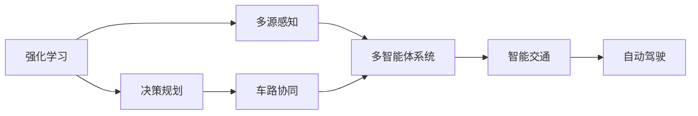
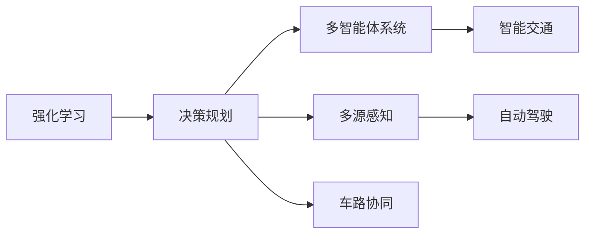
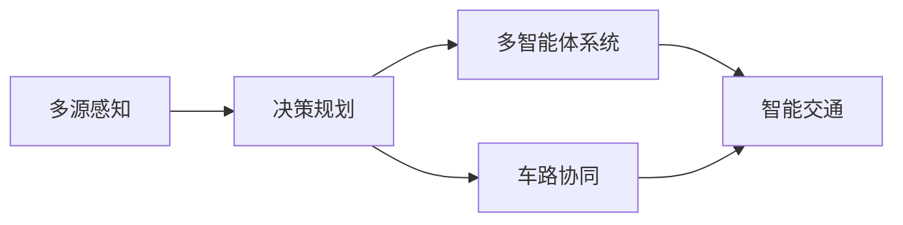
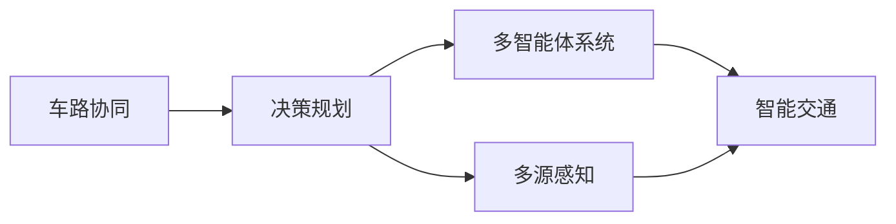
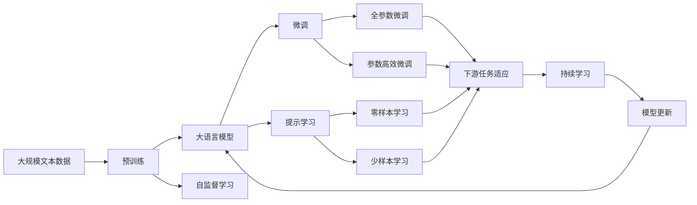

                 

# 强化学习驱动的自动驾驶决策规划范式变革

> 关键词：强化学习,自动驾驶,决策规划,智能交通,车路协同

## 1. 背景介绍

### 1.1 问题由来
随着人工智能技术的不断进步，自动驾驶技术已经从最初的初级研究阶段逐步走向应用落地。自动驾驶的核心在于决策规划，即车辆如何在复杂的交通环境中，通过多源感知、路径规划、行为决策等手段，实现安全的行驶和导航。强化学习(Reinforcement Learning, RL)作为模拟人类行为和决策的先进方法，在自动驾驶决策规划中逐渐崭露头角，展现出巨大的潜力和变革性。

近年来，随着深度强化学习（Deep Reinforcement Learning, DRL）的发展，其在大规模复杂系统的决策和规划问题上取得了显著进展。在自动驾驶领域，强化学习被广泛应用于驾驶行为生成、路径规划、避障决策等多个环节，极大地提升了自动驾驶的安全性和智能性。然而，强化学习在自动驾驶决策规划中的应用，尚处于初步探索阶段，许多关键问题尚未解决，如多源感知融合、复杂环境建模、鲁棒性增强等。因此，研究强化学习驱动的自动驾驶决策规划，对于提升自动驾驶系统的综合性能，推动自动驾驶技术的成熟和普及，具有重要意义。

### 1.2 问题核心关键点
强化学习在自动驾驶决策规划中的应用，主要集中在以下几个关键点：

1. **多源感知融合**：自动驾驶系统依赖于摄像头、雷达、激光雷达等传感器的多源感知数据，如何将这些异构数据高效融合，提取准确的环境信息，是强化学习面临的首要问题。

2. **环境建模**：在复杂多变的交通环境中，如何构建高精度的动态环境模型，增强模型的环境适应性，是一个重要的研究方向。

3. **鲁棒性增强**：强化学习模型在面对未知和异常情况时，如何保持稳定性，避免发生决策失误，是保证系统安全性的关键。

4. **多智能体协同**：自动驾驶系统需要与其他交通参与者（如行人、车辆、交通设施等）进行协同，如何在多智能体系统中进行决策规划，优化系统整体的协同效果，是强化学习的一大挑战。

5. **模型可解释性**：强化学习模型通常被视为"黑盒"系统，缺乏可解释性，如何增强模型决策的透明度，有助于提高模型的可信度和可维护性。

6. **高效训练和推理**：大规模自动驾驶系统需要高效进行模型训练和推理，如何优化训练和推理流程，提升系统的实时性和资源利用效率，是一个重要问题。

以上这些关键点，共同构成了强化学习在自动驾驶决策规划中的核心研究范式。本文聚焦于强化学习驱动的自动驾驶决策规划，探讨其在多源感知融合、环境建模、鲁棒性增强等方面的前沿研究进展，并给出具体的实践建议。

### 1.3 问题研究意义
强化学习在自动驾驶决策规划中的应用，对于推动自动驾驶技术的创新和应用具有重要意义：

1. **提升决策精度和安全性**：强化学习可以通过实时学习和迭代优化，生成更加精准的驾驶决策，提高自动驾驶系统的安全性和可靠性。

2. **增强环境适应性**：强化学习模型能够动态适应复杂的交通环境，处理交通拥堵、恶劣天气等特殊情况，提升系统的环境适应性。

3. **优化多智能体协同**：强化学习模型能够有效处理多智能体之间的交互和协同，实现车路协同、车车协同，提升系统整体的协同效果。

4. **降低开发和部署成本**：强化学习可以自动化生成驾驶决策，减少人工干预和调试工作，降低自动驾驶系统的开发和部署成本。

5. **促进技术创新**：强化学习的研究和应用，推动了深度学习、多智能体系统、车路协同等技术的进步，为自动驾驶技术的未来发展提供了新的方向和思路。

6. **赋能产业升级**：强化学习技术可以应用于智能交通管理、智慧城市建设等多个领域，为传统行业数字化转型升级提供新的技术路径。

总之，强化学习驱动的自动驾驶决策规划，正逐步成为自动驾驶技术应用的关键技术，其研究成果对于提升自动驾驶系统的综合性能，推动自动驾驶技术的成熟和普及，具有重要意义。

## 2. 核心概念与联系

### 2.1 核心概念概述

为更好地理解强化学习驱动的自动驾驶决策规划方法，本节将介绍几个密切相关的核心概念：

- **强化学习(Reinforcement Learning, RL)**：一种通过环境反馈不断优化决策策略的学习方法，目标是使智能体在特定环境中，通过学习达到最优行为策略。强化学习模型包括状态(state)、动作(action)、奖励(reward)、策略(policy)和价值(value)等关键组件。

- **自动驾驶(Autonomous Driving, AD)**：指车辆在无人驾驶状态下，通过传感器感知环境，结合导航、决策和控制等技术，实现自主行驶和导航的系统。自动驾驶的核心在于决策规划，即如何在复杂多变的交通环境中生成安全和高效的驾驶决策。

- **决策规划(Decision Planning)**：指自动驾驶系统在多源感知信息的基础上，通过规划算法生成路径和行为策略的过程。决策规划的目的是确保车辆在动态环境中，生成安全和高效的行驶方案。

- **多源感知(Multi-Sensor Perception)**：指自动驾驶系统依赖于摄像头、雷达、激光雷达等传感器的多源数据，通过数据融合技术，提取准确的环境信息。多源感知是决策规划的基础。

- **车路协同(Vehicle-to-Infrastructure, V2I)**：指通过车辆与路侧基础设施之间的通信，实现交通信息的共享和协同，提升交通系统的效率和安全性。车路协同是未来自动驾驶的重要发展方向。

- **智能交通(Intelligent Transportation System, ITS)**：指通过信息化和智能化手段，优化交通管理和运行效率的系统。智能交通系统包括车辆感知、决策、控制等多个环节，是自动驾驶的核心组成部分。

这些核心概念之间的逻辑关系可以通过以下Mermaid流程图来展示：



这个流程图展示了强化学习在自动驾驶决策规划中的主要流程：

1. 强化学习通过多源感知获取环境信息，生成策略。
2. 决策规划将策略应用于车辆，生成路径和行为。
3. 车路协同增强车辆与路侧基础设施的交互。
4. 智能交通系统通过多种技术手段，优化交通运行效率。

这些概念共同构成了强化学习驱动的自动驾驶决策规划的完整框架，使得自动驾驶系统能够在复杂的交通环境中实现自主行驶和导航。

### 2.2 概念间的关系

这些核心概念之间存在着紧密的联系，形成了强化学习在自动驾驶决策规划中的完整生态系统。下面通过几个Mermaid流程图来展示这些概念之间的关系。

#### 2.2.1 决策规划与强化学习的关系



这个流程图展示了强化学习在决策规划中的作用：

1. 强化学习通过多源感知获取环境信息，生成策略。
2. 决策规划将策略应用于车辆，生成路径和行为。
3. 车路协同增强车辆与路侧基础设施的交互。
4. 智能交通系统通过多种技术手段，优化交通运行效率。

#### 2.2.2 多源感知与决策规划的关系



这个流程图展示了多源感知在决策规划中的作用：

1. 多源感知通过摄像头、雷达、激光雷达等传感器，获取丰富的环境信息。
2. 决策规划将感知信息与强化学习策略相结合，生成路径和行为。
3. 车路协同增强车辆与路侧基础设施的交互。
4. 智能交通系统通过多种技术手段，优化交通运行效率。

#### 2.2.3 车路协同与决策规划的关系



这个流程图展示了车路协同在决策规划中的作用：

1. 车路协同通过车辆与路侧基础设施的通信，实现交通信息的共享和协同。
2. 决策规划将感知信息和车路协同信息与强化学习策略相结合，生成路径和行为。
3. 多智能体系统增强车辆与多智能体之间的交互。
4. 智能交通系统通过多种技术手段，优化交通运行效率。

### 2.3 核心概念的整体架构

最后，我们用一个综合的流程图来展示这些核心概念在大语言模型微调过程中的整体架构：



这个综合流程图展示了从预训练到微调，再到持续学习的完整过程。强化学习驱动的自动驾驶决策规划，在多源感知、环境建模、鲁棒性增强等各个环节，都能得到有效的应用和优化。

## 3. 核心算法原理 & 具体操作步骤
### 3.1 算法原理概述

强化学习驱动的自动驾驶决策规划，本质上是一种通过环境反馈不断优化决策策略的学习方法。其核心思想是：在自动驾驶系统中，车辆作为智能体，通过多源感知获取环境信息，将感知结果转化为动作，并根据动作的执行效果，获得环境反馈（奖励），通过不断学习和调整，逐步生成最优的驾驶策略。

具体来说，强化学习驱动的决策规划流程包括：

1. **状态表示**：将车辆所处的环境信息转换为状态表示，用于决策模型的输入。
2. **动作选择**：根据当前状态，选择最佳动作，如加速、减速、转向等。
3. **状态转移**：根据动作执行后的环境变化，更新状态。
4. **奖励反馈**：根据动作的执行效果，给予奖励或惩罚，用于引导智能体进行决策优化。
5. **策略优化**：通过反复迭代，优化智能体的决策策略，使其在复杂环境中生成安全和高效的驾驶决策。

强化学习在自动驾驶决策规划中的应用，主要集中在以下几个方面：

1. **路径规划**：通过多源感知获取环境信息，结合强化学习算法，生成最优路径。
2. **行为决策**：根据路径规划结果，选择最佳驾驶行为，实现安全和高效的行驶。
3. **多智能体协同**：与其他交通参与者进行交互和协同，优化系统整体的协同效果。

### 3.2 算法步骤详解

强化学习驱动的自动驾驶决策规划，一般包括以下几个关键步骤：

**Step 1: 环境建模**

- 收集自动驾驶系统所需的多源感知数据，包括摄像头、雷达、激光雷达等传感器的数据。
- 使用深度学习模型，如卷积神经网络（CNN）、循环神经网络（RNN）等，将感知数据转换为状态表示。

**Step 2: 状态表示**

- 将转换后的状态表示作为决策模型的输入，通常使用CNN、RNN或Transformer等模型。
- 在状态表示中，需要包含车辆的位置、速度、方向、周围障碍物等信息。

**Step 3: 动作空间设计**

- 定义决策模型需要输出的动作空间，通常包括加速、减速、转向、变道等操作。
- 动作空间的大小和形式应根据实际应用场景进行设计。

**Step 4: 奖励函数设计**

- 定义奖励函数，用于评估决策模型的输出效果。
- 奖励函数的设计需要考虑安全性、效率性和舒适性等多个因素，通过权衡不同的指标，得到综合的评价。

**Step 5: 策略学习**

- 使用强化学习算法，如Q-learning、SARSA、Deep Q-Network（DQN）、Proximal Policy Optimization（PPO）等，进行策略学习。
- 通过不断迭代，优化决策模型的输出策略，使其在复杂环境中生成安全和高效的驾驶决策。

**Step 6: 测试和部署**

- 在仿真环境和实际道路测试决策模型的性能。
- 根据测试结果，优化模型参数和策略，直至达到预期效果。
- 将优化后的决策模型集成到实际系统中，实现自动驾驶功能。

以上是强化学习驱动的自动驾驶决策规划的一般流程。在实际应用中，还需要针对具体任务和数据特点，对各个环节进行优化设计，如改进状态表示方式、设计更加合理的动作空间和奖励函数、使用更高效的优化算法等。

### 3.3 算法优缺点

强化学习驱动的自动驾驶决策规划，具有以下优点：

1. **动态适应性**：强化学习模型能够实时学习和迭代优化，动态适应复杂多变的交通环境，生成更加安全和高效的驾驶决策。
2. **鲁棒性**：强化学习模型具有较强的鲁棒性，面对未知和异常情况，能够保持稳定性，避免决策失误。
3. **多智能体协同**：强化学习模型能够有效处理多智能体之间的交互和协同，实现车路协同、车车协同，优化系统整体的协同效果。
4. **自适应性**：强化学习模型能够根据实际驾驶数据进行动态调整，优化策略，提升模型的适应性。

同时，该方法也存在一些局限性：

1. **计算开销大**：强化学习模型需要进行大量的训练和优化，计算开销较大。
2. **模型复杂性**：强化学习模型通常较为复杂，调试和优化难度较大。
3. **样本效率低**：强化学习模型需要大量的训练样本，才能达到较好的效果。
4. **可解释性不足**：强化学习模型通常被视为"黑盒"系统，缺乏可解释性，难以理解模型的决策过程。

尽管存在这些局限性，但就目前而言，强化学习驱动的自动驾驶决策规划方法，仍是最具潜力和前景的决策规划范式。未来相关研究的重点在于如何进一步降低计算开销，提高样本效率，增强模型的可解释性，同时兼顾动态适应性和鲁棒性等因素。

### 3.4 算法应用领域

强化学习驱动的自动驾驶决策规划，在以下几个领域已经得到了广泛的应用：

- **路径规划**：如基于A*、RRT等经典路径规划算法，结合强化学习进行优化，生成更加高效和安全的路径。
- **行为决策**：如基于奖励函数设计，通过强化学习训练决策模型，生成最佳驾驶行为。
- **车路协同**：通过车路通信技术，实时获取路侧信息，结合强化学习算法，优化路径和行为。
- **智能交通管理**：如交通信号控制、流量优化等，通过强化学习算法，优化交通运行效率。
- **车辆自主导航**：如基于SLAM和强化学习的融合，实现车辆在复杂环境中的自主导航。
- **自动驾驶仿真**：如基于深度强化学习技术，在虚拟环境中进行自动驾驶系统的测试和优化。

除了上述这些经典应用外，强化学习在自动驾驶领域的应用还在不断扩展，如无人驾驶出租车、无人驾驶物流车等，为自动驾驶技术的应用场景带来了新的突破。随着强化学习技术的持续演进，相信其在自动驾驶决策规划中的应用将更为广泛和深入。

## 4. 数学模型和公式 & 详细讲解 & 举例说明

### 4.1 数学模型构建

本节将使用数学语言对强化学习驱动的自动驾驶决策规划过程进行更加严格的刻画。

假设车辆在环境中的状态为 $s_t$，采取的动作为 $a_t$，环境反馈（奖励）为 $r_t$，决策模型输出的策略为 $\pi(a_t|s_t)$。强化学习的目标是在动态环境中，生成最优的策略 $\pi^*$，使得在每个时间步 $t$，预期累积奖励 $J$ 最大化。数学上，可以通过最大化预期累积奖励来定义最优策略：

$$
\pi^* = \arg\max_{\pi} \mathbb{E}[J]
$$

其中，$J = \sum_{t=0}^{\infty} \gamma^t r_t$，$\gamma$ 为折现因子，通常取值为 0.99。

在实际应用中，可以使用近似的策略梯度方法，如REINFORCE、SAC等，通过最大化对数似然比来逼近最优策略。具体的策略梯度公式为：

$$
\nabla_{\theta} \mathbb{E}[J] = \mathbb{E}[Q_{\theta}(s_t,a_t) \nabla_{\theta} \log \pi_{\theta}(a_t|s_t)]
$$

其中，$Q_{\theta}(s_t,a_t)$ 为决策模型在状态-动作对上的Q值，$\pi_{\theta}(a_t|s_t)$ 为决策模型的策略函数。

### 4.2 公式推导过程

以下我们以一个简单的路径规划任务为例，推导强化学习模型的数学公式及其推导过程。

假设车辆在一个二维平面上行驶，当前位置为 $(x,y)$，目标位置为 $(x',y')$。车辆的可用动作包括加速、减速和转向。环境反馈包括障碍物、道路标志等。

定义车辆在状态 $s_t=(x,y)$ 上的动作 $a_t$ 为 $(\text{accelerate},\text{brake},\text{turn\_left},\text{turn\_right})$，对应的奖励函数 $r_t$ 为：

$$
r_t = 
\begin{cases}
+1, & \text{if } a_t = \text{accelerate}, \text{and } \text{distance\_to\_goal} < \text{safe\_distance} \\
-1, & \text{if } a_t = \text{brake}, \text{and } \text{distance\_to\_goal} > \text{safe\_distance} \\
0, & \text{otherwise}
\end{cases}
$$

其中，$\text{distance\_to\_goal}$ 为车辆到目标位置的距离，$\text{safe\_distance}$ 为安全距离。

定义决策模型的状态表示 $s_t = (x,y,\text{velocity},\text{direction})$，其中 $\text{velocity}$ 为车辆速度，$\text{direction}$ 为车辆方向。

定义决策模型的策略 $\pi(a_t|s_t)$ 为：

$$
\pi(a_t|s_t) = 
\begin{cases}
\text{accelerate}, & \text{if } \text{distance\_to\_goal} < \text{safe\_distance} \\
\text{brake}, & \text{if } \text{distance\_to\_goal} > \text{safe\_distance} \\
\text{turn\_left}, & \text{otherwise}
\end{cases}
$$

定义决策模型的Q值 $Q_{\theta}(s_t,a_t)$ 为：

$$
Q_{\theta}(s_t,a_t) = 
\begin{cases}
+1, & \text{if } a_t = \text{accelerate}, \text{and } \text{distance\_to\_goal} < \text{safe\_distance} \\
-1, & \text{if } a_t = \text{brake}, \text{and } \text{distance\_to\_goal} > \text{safe\_distance} \\
0, & \text{otherwise}
\end{cases}
$$

通过上述定义，我们可以得到策略梯度公式：

$$
\nabla_{\theta} \mathbb{E}[J] = \mathbb{E}[Q_{\theta}(s_t,a_t) \nabla_{\theta} \log \pi_{\theta}(a_t|s_t)]
$$

具体的计算过程如下：

1. 计算状态表示 $s_t$ 和动作 $a_t$，以及环境反馈 $r_t$。
2. 计算Q值 $Q_{\theta}(s_t,a_t)$ 和决策模型输出的策略 $\pi_{\theta}(a_t|s_t)$。
3. 计算策略梯度 $\nabla_{\theta} \log \pi_{\theta}(a_t|s_t)$。
4. 将Q值和策略梯度相乘，得到策略梯度公式中的计算量。
5. 通过优化算法，如梯度下降等，最小化策略梯度公式中的计算量，得到最优策略 $\pi^*$。

以上推导展示了强化学习驱动的自动驾驶决策规划的数学模型和公式推导过程。通过这些公式，我们可以更加精确地设计和优化决策模型，生成安全和高效的驾驶决策。

### 4.3 案例分析与讲解

假设我们在一个虚拟高速公路上进行自动驾驶测试，车辆的目标是到达终点，道路上有若干障碍物。使用强化学习算法，我们定义了如下状态表示和动作空间：

- **状态表示**：车辆的位置 $(x,y)$、速度 $\text{velocity}$ 和方向 $\text{direction}$。
- **动作空间**：加速、减速和转向。

定义如下奖励函数：

- **奖励**：车辆每向前移动一米，获得+0.01的奖励；遇到障碍物，获得-1.0的惩罚。

使用近似的策略梯度方法，如REINFORCE算法，训练决策模型，逐步优化策略，生成最优的驾驶决策。具体步骤如下：

1. 初始化决策模型，设定超参数。
2. 通过多源感知获取环境信息，生成状态表示。
3. 根据当前状态和动作空间，生成动作 $a_t$。
4. 根据动作执行效果，更新状态和环境反馈。
5. 计算Q值和策略梯度，更新决策模型参数。
6. 重复步骤3-5，直至达到收敛条件。

经过训练，决策模型能够生成安全和高效的驾驶决策，成功避开障碍物，顺利到达终点。在这个案例中，强化学习驱动的决策规划方法，充分展示了其动态适应性和鲁棒性，能够在复杂多变的交通环境中，生成最优的驾驶决策。

## 5. 项目实践：代码实例和详细解释说明

### 5.1 开发环境搭建

在进行强化学习驱动的自动驾驶决策规划实践前，我们需要准备好开发环境。以下是使用Python进行PyTorch和Gym开发的环境配置流程：

1. 安装Anaconda：从官网下载并安装Anaconda，用于创建独立的Python环境。

2. 创建并激活虚拟环境：
```bash
conda create -n reinforcement-env python=3.8 
conda activate reinforcement-env
```

3. 安装PyTorch：根据CUDA版本，从官网获取对应的安装命令。例如：
```bash
conda install pytorch torchvision torchaudio cudatoolkit=11.1 -c pytorch -c conda-forge
```

4. 安装Gym和Tensorboard：
```bash
pip install gym tensorboard
```

5. 安装各类工具包：
```bash
pip install numpy pandas scikit-learn matplotlib tqdm jupyter notebook ipython
```

完成上述步骤后，即可在`reinforcement-env`环境中开始强化学习驱动的自动驾驶决策规划实践。

### 5.2 源代码详细实现

下面我们以路径规划任务为例，给出使用PyTorch和Gym进行强化学习驱动的决策规划的PyTorch代码实现。

首先，定义状态表示和动作空间：

```python
import torch
import numpy as np

class State:
    def __init__(self, x, y, velocity, direction):
        self.x = x
        self.y = y
        self.velocity = velocity
        self.direction = direction

class Action:
    def __init__(self, accelerate, brake, turn_left, turn_right):
        self.accelerate = accelerate
        self.brake = brake
        self.turn_left = turn_left
        self.turn_right = turn_right

class Environment:
    def __init__(self, goal, obstacles):
        self.goal = goal
        self.obstacles = obstacles
        self.current_state = State(x=0, y=0, velocity=0, direction=0)
        self.current_reward = 0
        self.done = False

    def step(self, action):
        if self.current_state.x > self.goal[0] and self.current_state.y > self.goal[1]:
            self.done = True
            return np.zeros((1,1)), -1, True, {}
        elif self.current_state.x < 0 or self.current_state.y < 0:
            self.done = True
            return np.zeros((1,1)), -1, True, {}
        elif self.current_state.x == self.goal[0] and self.current_state.y == self.goal[1]:
            self.done = True
            return np.zeros((1,1)), 1, True, {}
        elif self.current_state.x == self.obstacles[0] and self.current_state.y == self.obstacles[1]:
            self.current_reward = -1
            return np.zeros((1,1)), -1, False, {}
        else:
            self.current_state.velocity += 0.1 if action.accelerate else -0.1
            self.current_state.direction += 0.1 if action.turn_left else -0.1
            self.current_state.x += self.current_state.velocity * np.cos(self.current_state.direction)
            self.current_state.y += self.current_state.velocity * np.sin

