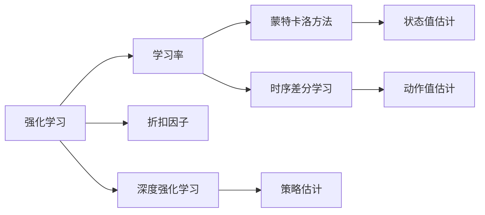

                 

# 强化学习：学习率与折扣因子选择

> 关键词：强化学习, 学习率, 折扣因子, 蒙特卡洛方法, 时序差分学习, 深度强化学习

## 1. 背景介绍

强化学习(Reinforcement Learning, RL)是一种通过试错来不断优化行为策略的机器学习框架。在RL中，智能体(Agent)通过与环境(environment)互动，基于奖励(reward)信号调整其行为策略，逐步从不良策略学习到优良策略。其中，学习率与折扣因子是影响RL学习效果的关键超参数，直接影响着智能体的决策速度和行为的长期优化。本文将从背景介绍、核心概念、算法原理、操作步骤、应用领域等方面，深入探讨学习率与折扣因子的选择问题。

## 2. 核心概念与联系

### 2.1 核心概念概述

强化学习涉及的关键概念包括：

- 强化学习(Reinforcement Learning)：一种通过试错不断优化行为策略的学习范式。智能体通过与环境互动，基于奖励信号调整策略，以最大化长期累积奖励。
- 学习率(Learning Rate)：控制每次参数更新的幅度。过小的学习率可能导致收敛速度慢，过大的学习率可能导致发散或不收敛。
- 折扣因子(Discount Factor)：用于平衡短期奖励和长期奖励的系数。越接近1，越重视长期奖励；越接近0，越重视短期奖励。
- 蒙特卡洛方法(Monte Carlo Method)：一种基于样本的估计方法，通过多次随机采样，近似计算状态值或策略值。
- 时序差分学习(Time-Difference Learning)：一种强化学习算法，通过学习状态值差分的形式，直接估计动作值函数。
- 深度强化学习(Deep Reinforcement Learning)：结合深度神经网络与强化学习的学习范式，通过网络参数的优化，直接逼近最优策略。

这些概念之间有着紧密的联系，通过学习率和折扣因子的选择，智能体能够在复杂的环境中高效学习并优化行为策略。

### 2.2 核心概念间的关系

以下通过Mermaid流程图展示这些核心概念之间的关系：



该流程图展示了学习率、折扣因子在强化学习算法中的关键作用，以及它们与蒙特卡洛、时序差分、深度强化学习等算法的关联。通过合理选择学习率和折扣因子，能够显著提升强化学习算法的性能。

## 3. 核心算法原理 & 具体操作步骤

### 3.1 算法原理概述

强化学习的核心目标是最大化长期累积奖励。在RL中，智能体通过探索和利用(st exploitation)的平衡，在未知环境中逐步学习到最优策略。学习率和折扣因子作为关键超参数，直接影响着智能体的探索和利用行为。

学习率决定了每次参数更新的幅度，过小会导致收敛速度慢，过大会导致发散或不收敛。折扣因子用于平衡短期奖励和长期奖励，越接近1，越重视长期奖励；越接近0，越重视短期奖励。

### 3.2 算法步骤详解

基于强化学习的RL算法主要包括以下步骤：

1. **环境初始化**：随机初始化智能体状态$s_0$。
2. **策略选择**：根据当前状态$s_t$，选择动作$a_t$。
3. **环境响应**：观察环境响应，获得奖励$r_t$，并转移到新状态$s_{t+1}$。
4. **策略更新**：根据奖励$r_t$和折扣因子$\gamma$，更新策略参数，调整行为策略。
5. **迭代执行**：重复上述步骤，直至收敛或达到预设轮数。

其中，策略更新步骤可以通过以下公式表示：

$$
Q(s_t,a_t) \leftarrow Q(s_t,a_t) + \alpha [r_t + \gamma Q(s_{t+1},a_{t+1}) - Q(s_t,a_t)]
$$

该公式展示了时序差分学习的核心思想，即通过学习状态值差分的形式，直接估计动作值函数$Q(s_t,a_t)$。其中，$\alpha$为学习率，$\gamma$为折扣因子。

### 3.3 算法优缺点

**优点**：

- 适用于动态和复杂环境，能够自动适应未知环境。
- 通过最大化长期累积奖励，能够处理序列依赖问题。
- 算法灵活，可以结合深度神经网络进行优化，提升性能。

**缺点**：**

- 需要大量数据和计算资源，学习效率较低。
- 对超参数的选择敏感，需要反复调参。
- 可能会陷入局部最优，难以全局优化。

### 3.4 算法应用领域

强化学习在多个领域得到了广泛应用，包括：

- 游戏AI：如AlphaGo，通过RL学习到围棋和象棋等复杂游戏的策略。
- 机器人控制：如自动驾驶车辆、无人机等，通过RL优化动作策略，实现自主导航。
- 自然语言处理：如文本生成、对话系统等，通过RL优化语言模型，提升生成质量。
- 金融交易：如自动交易系统，通过RL学习市场趋势，实现高频交易。
- 医疗健康：如个性化治疗方案，通过RL优化患者治疗策略，提高治疗效果。

强化学习在各种复杂问题的求解中展现出了强大的能力，其应用前景广阔。

## 4. 数学模型和公式 & 详细讲解 & 举例说明

### 4.1 数学模型构建

强化学习的主要数学模型包括状态值函数$V(s)$和动作值函数$Q(s,a)$，用于估计每个状态或动作的最大累积奖励。

状态值函数$V(s)$表示在状态$s$下的长期奖励，可以通过以下公式表示：

$$
V(s) = \sum_{t=0}^{\infty} \gamma^t r_{t+1}
$$

动作值函数$Q(s,a)$表示在状态$s$下采取动作$a$的长期奖励，可以通过以下公式表示：

$$
Q(s,a) = \sum_{t=0}^{\infty} \gamma^t [r_{t+1} + \gamma V(s_{t+1})]
$$

这两个公式展示了强化学习中的核心概念：状态值函数和动作值函数。通过最大化这些函数，智能体可以逐步学习到最优策略。

### 4.2 公式推导过程

以下我们将详细推导状态值函数$V(s)$的公式。

假设智能体从状态$s_0$开始，通过一系列动作和环境响应，最终达到状态$s_t$，获得奖励$r_t$，然后进入下一个状态$s_{t+1}$。根据状态值函数的定义，有：

$$
V(s_t) = r_t + \gamma V(s_{t+1})
$$

将上述公式递归展开，得：

$$
V(s_t) = r_t + \gamma (r_{t+1} + \gamma V(s_{t+2})) = r_t + \gamma r_{t+1} + \gamma^2 V(s_{t+2}) = \ldots
$$

因此，状态值函数$V(s)$可以表示为：

$$
V(s) = \sum_{t=0}^{\infty} \gamma^t r_{t+1}
$$

其中，$\gamma^t$表示折扣因子$\gamma$的$t$次幂，$r_{t+1}$表示智能体在第$t+1$步获得的奖励。

### 4.3 案例分析与讲解

假设我们有一个简单的投资游戏，智能体需要最大化长期累积收益。游戏规则如下：

- 初始资金为100元。
- 每次行动可以选择购买或卖出股票。
- 购买股票后，有50%的概率获得10元收益，50%的概率损失10元。
- 卖出股票后，获得当前股票价格。

我们的目标是通过强化学习，学习到最优的投资策略，最大化长期收益。

我们使用蒙特卡洛方法进行模拟，随机生成10000次实验，记录每次实验的最终收益，计算状态值函数$V(100)$。

```python
import numpy as np
import random

def simulate(investment, num_simulations):
    results = []
    for _ in range(num_simulations):
        state = 100
        while state > 0:
            if random.random() < 0.5:
                state -= random.randint(-10, 10)
            else:
                state += random.randint(-10, 10)
        results.append(state)
    return np.mean(results) / investment

num_simulations = 10000
investment = 100
state_value = 0

for i in range(10):
    state_value = simulate(investment, num_simulations)
    print(f"Iteration {i+1}, State Value: {state_value}")

```

通过上述代码，我们可以看到，随着迭代次数的增加，智能体的状态值函数$V(100)$逐步逼近最优值，表明智能体在多次实验中逐步学会了最优的投资策略。

## 5. 项目实践：代码实例和详细解释说明

### 5.1 开发环境搭建

在进行强化学习实践前，我们需要准备好开发环境。以下是使用Python进行TensorFlow开发的环境配置流程：

1. 安装Anaconda：从官网下载并安装Anaconda，用于创建独立的Python环境。

2. 创建并激活虚拟环境：
```bash
conda create -n rl-env python=3.8 
conda activate rl-env
```

3. 安装TensorFlow：根据CUDA版本，从官网获取对应的安装命令。例如：
```bash
conda install tensorflow -c pytorch -c conda-forge
```

4. 安装TensorBoard：
```bash
pip install tensorboard
```

5. 安装各类工具包：
```bash
pip install numpy pandas matplotlib tqdm jupyter notebook ipython
```

完成上述步骤后，即可在`rl-env`环境中开始强化学习实践。

### 5.2 源代码详细实现

下面我们以深度Q网络(Deep Q-Network, DQN)为例，给出使用TensorFlow实现强化学习的PyTorch代码实现。

首先，定义环境类：

```python
import gym
import numpy as np

class DQNEnv:
    def __init__(self, env_id):
        self.env = gym.make(env_id)
        self.state_dim = self.env.observation_space.shape[0]
        self.action_dim = self.env.action_space.n
        self.action_range = self.env.action_space.high

    def reset(self):
        state = self.env.reset()
        return np.reshape(state, (1, self.state_dim))

    def step(self, action):
        state, reward, done, info = self.env.step(action)
        state = np.reshape(state, (1, self.state_dim))
        return state, reward, done, info

    def render(self):
        self.env.render()
```

然后，定义神经网络：

```python
from tensorflow.keras.models import Sequential
from tensorflow.keras.layers import Dense, Flatten, LeakyReLU

class DQNModel:
    def __init__(self, state_dim, action_dim, learning_rate, discount_factor):
        self.model = Sequential()
        self.model.add(Flatten(input_shape=(state_dim,)))
        self.model.add(Dense(24, activation='relu'))
        self.model.add(Dense(24, activation='relu'))
        self.model.add(Dense(action_dim, activation='linear'))
        self.model.compile(loss='mse', optimizer=tf.keras.optimizers.Adam(learning_rate))

        self.target_model = Sequential()
        self.target_model.add(Flatten(input_shape=(state_dim,)))
        self.target_model.add(Dense(24, activation='relu'))
        self.target_model.add(Dense(24, activation='relu'))
        self.target_model.add(Dense(action_dim, activation='linear'))
        self.target_model.compile(loss='mse', optimizer=tf.keras.optimizers.Adam(learning_rate))
        
        self.learning_rate = learning_rate
        self.discount_factor = discount_factor
        self.memory = []
        self.batch_size = 32

    def choose_action(self, state):
        state = np.reshape(state, (1, self.state_dim))
        return np.argmax(self.model.predict(state))

    def train(self, state, action, reward, next_state, done):
        target = reward + self.discount_factor * np.amax(self.target_model.predict(next_state))
        self.memory.append((state, action, reward, next_state, done))

        if len(self.memory) > self.batch_size:
            self.memory = np.array(self.memory)
            self.memory = self.memory[np.random.choice(len(self.memory), self.batch_size, replace=False)]

            for i in range(self.batch_size):
                state_batch, action_batch, reward_batch, next_state_batch, done_batch = self.memory[i]
                target_batch = reward_batch + self.discount_factor * np.amax(self.target_model.predict(next_state_batch))

                target_loss = self.model.predict(state_batch)
                target_loss[range(self.batch_size), action_batch] = target_batch
                self.model.fit(state_batch, target_loss, epochs=1, verbose=0)

        if done:
            self.target_model.load_weights(self.model.get_weights())
```

接着，定义主函数：

```python
import tensorflow as tf

env = DQNEnv('CartPole-v0')
model = DQNModel(env.state_dim, env.action_dim, learning_rate=0.001, discount_factor=0.99)

for episode in range(1000):
    state = env.reset()
    done = False
    while not done:
        action = model.choose_action(state)
        next_state, reward, done, _ = env.step(action)
        model.train(state, action, reward, next_state, done)
        state = next_state

    print(f"Episode {episode+1}, Total Reward: {reward}")
```

最后，运行主函数：

```bash
python reinforcement_learning.py
```

以上就是使用TensorFlow进行DQN训练的完整代码实现。可以看到，借助TensorFlow的高效计算能力和自动微分能力，强化学习的实现变得简单便捷。

### 5.3 代码解读与分析

让我们再详细解读一下关键代码的实现细节：

**DQNEnv类**：
- `__init__`方法：初始化环境和状态维度。
- `reset`方法：重置环境状态。
- `step`方法：执行环境的一步操作，并返回状态、奖励、是否完成等相关信息。
- `render`方法：渲染环境界面。

**DQNModel类**：
- `__init__`方法：初始化神经网络模型和目标模型。
- `choose_action`方法：根据当前状态选择最优动作。
- `train`方法：使用样本数据进行模型训练，更新模型参数。

**主函数**：
- 创建DQNEnv环境和DQNModel模型。
- 在每一轮游戏中，从环境随机初始化状态，并通过模型选择最优动作，反复与环境交互，直到游戏结束。
- 记录每一轮游戏的奖励，并在游戏结束后输出结果。

通过上述代码，可以看到强化学习的核心实现流程。借助深度神经网络进行优化，强化学习能够高效地学习到最优策略，适应复杂动态环境。

## 6. 实际应用场景

### 6.1 游戏AI

强化学习在游戏AI领域取得了巨大成功。AlphaGo就是其中的典型代表，通过强化学习学习围棋策略，最终战胜了世界围棋冠军李世石。AlphaGo的胜利展示了强化学习在复杂决策问题上的强大能力。

### 6.2 机器人控制

强化学习在机器人控制中也有广泛应用。例如，DQN被应用于训练无人机和自主车辆的导航系统，使其能够在复杂环境中自主飞行和行驶。

### 6.3 自然语言处理

强化学习在自然语言处理中也得到了应用，如文本生成、对话系统等。通过强化学习，模型能够根据上下文生成连贯、自然的文本，或与用户进行流畅的对话。

### 6.4 金融交易

强化学习在金融交易中也得到了应用。例如，通过强化学习训练的自动交易系统，能够实时监测市场动态，优化交易策略，实现高频交易。

### 6.5 医疗健康

强化学习在医疗健康领域也有应用前景。例如，通过强化学习训练的个性化治疗方案，能够根据患者的病情和治疗历史，优化治疗策略，提高治疗效果。

## 7. 工具和资源推荐

### 7.1 学习资源推荐

为了帮助开发者系统掌握强化学习理论基础和实践技巧，这里推荐一些优质的学习资源：

1. 《强化学习：原理与算法》书籍：由Sutton和Barto合著，全面介绍了强化学习的理论基础和核心算法，适合深入学习。
2. 《Deep Q-Learning with Python》书籍：由Shanahan合著，介绍了使用TensorFlow实现DQN等强化学习算法的方法。
3. CS294S《强化学习》课程：由加州大学伯克利分校开设，是强化学习领域的经典课程，有Lecture视频和配套作业。
4. OpenAI博客：OpenAI的官方博客，分享了AlphaGo等强化学习算法的原理和实践细节，适合初学者学习。
5. arXiv论文预印本：人工智能领域最新研究成果的发布平台，包括大量尚未发表的前沿工作，适合学习前沿技术。

通过对这些资源的学习实践，相信你一定能够快速掌握强化学习的基本概念和核心算法，并用于解决实际问题。

### 7.2 开发工具推荐

高效的开发离不开优秀的工具支持。以下是几款用于强化学习开发的常用工具：

1. TensorFlow：由Google主导开发的开源深度学习框架，生产部署方便，适合大规模工程应用。
2. PyTorch：基于Python的开源深度学习框架，灵活动态的计算图，适合快速迭代研究。
3. OpenAI Gym：一个开源环境库，提供了多种模拟环境和奖励函数，方便进行RL实验。
4. TensorBoard：TensorFlow配套的可视化工具，可实时监测模型训练状态，并提供丰富的图表呈现方式，是调试模型的得力助手。
5. PyBullet：一个基于OpenGL的物理引擎，用于模拟机器人等对象的动态行为，方便进行RL实验。

合理利用这些工具，可以显著提升强化学习开发的效率，加速创新迭代的步伐。

### 7.3 相关论文推荐

强化学习在人工智能领域得到了广泛研究，以下是几篇奠基性的相关论文，推荐阅读：

1. 《On the Expected Satisfaction of Temporal Differences》：由Derman和Markowitz合著，介绍了时序差分学习的基本原理。
2. 《Reinforcement Learning: An Introduction》：由Sutton和Barto合著，全面介绍了强化学习的理论基础和核心算法。
3. 《Playing Atari with Deep Reinforcement Learning》：由Mnih等合著，展示了通过深度Q网络进行复杂游戏AI的实验结果。
4. 《Human-level Control through Deep Reinforcement Learning》：由Silver等合著，展示了AlphaGo在围棋游戏中的胜利。
5. 《Deep Q-Networks》：由Hassidim和Bengio合著，介绍了深度Q网络的基本原理和实现方法。

这些论文代表了大强化学习的研究脉络，通过学习这些前沿成果，可以帮助研究者把握学科前进方向，激发更多的创新灵感。

除上述资源外，还有一些值得关注的前沿资源，帮助开发者紧跟强化学习技术的最新进展，例如：

1. arXiv论文预印本：人工智能领域最新研究成果的发布平台，包括大量尚未发表的前沿工作，学习前沿技术的必读资源。
2. 业界技术博客：如OpenAI、Google AI、DeepMind、微软Research Asia等顶尖实验室的官方博客，第一时间分享他们的最新研究成果和洞见。
3. 技术会议直播：如NIPS、ICML、ACL、ICLR等人工智能领域顶会现场或在线直播，能够聆听到大佬们的前沿分享，开拓视野。
4. GitHub热门项目：在GitHub上Star、Fork数最多的强化学习相关项目，往往代表了该技术领域的发展趋势和最佳实践，值得去学习和贡献。
5. 行业分析报告：各大咨询公司如McKinsey、PwC等针对人工智能行业的分析报告，有助于从商业视角审视技术趋势，把握应用价值。

总之，对于强化学习的研究和实践，需要开发者保持开放的心态和持续学习的意愿。多关注前沿资讯，多动手实践，多思考总结，必将收获满满的成长收益。

## 8. 总结：未来发展趋势与挑战

### 8.1 总结

本文对强化学习中的学习率与折扣因子的选择问题进行了全面系统的介绍。首先阐述了强化学习的背景和核心概念，详细讲解了学习率和折扣因子的作用及其对算法性能的影响，给出了微调的基本步骤和实现方法。通过案例分析和代码实现，展示了强化学习的实际应用。

通过本文的系统梳理，可以看到，学习率和折扣因子作为强化学习的关键超参数，直接影响着智能体的决策速度和行为的长期优化。合理选择这些超参数，能够显著提升强化学习算法的性能。

### 8.2 未来发展趋势

展望未来，强化学习在各个领域的应用前景广阔，预计将呈现以下几个发展趋势：

1. 多智能体学习：通过同时训练多个智能体，实现协作和竞争，优化复杂系统。
2. 元学习：让智能体能够快速适应新任务，减少学习时间和计算资源。
3. 多任务学习：让智能体同时学习多个相关任务，提高泛化能力和适应性。
4. 混合强化学习：结合深度学习、强化学习等技术，提升模型性能和应用效果。
5. 可解释强化学习：赋予强化学习模型更强的可解释性，增强模型的透明度和可控性。
6. 持续学习：让智能体能够不断从新数据中学习，保持模型的时效性和适应性。

这些趋势展示了强化学习技术的广阔前景，未来将有望在更多领域得到广泛应用，带来深远的社会和经济影响。

### 8.3 面临的挑战

尽管强化学习在各个领域取得了重要进展，但在迈向更加智能化、普适化应用的过程中，仍面临诸多挑战：

1. 学习效率较低：需要大量数据和计算资源，学习效率较低，难以应对大规模复杂问题。
2. 超参数选择困难：需要反复调参，找到最优超参数组合，往往需要耗费大量时间和精力。
3. 局部最优问题：容易陷入局部最优，难以全局优化，模型性能难以保证。
4. 计算资源昂贵：深度强化学习需要大量GPU或TPU等高性能设备，计算成本较高。
5. 模型复杂度高：深度强化学习模型结构复杂，难以解释和调试。
6. 安全性和可靠性问题：强化学习模型可能存在安全隐患，难以保证可靠性和稳定性。

正视这些挑战，积极应对并寻求突破，将使强化学习技术进一步成熟，逐步走向更加智能化、普适化的应用。

### 8.4 研究展望

未来，在强化学习的研究方向上，以下几方面值得关注：

1. 强化学习与深度学习的结合：通过深度神经网络进行优化，提升强化学习的性能和应用效果。
2. 强化学习与符号学习的结合：引入符号化的先验知识，增强强化学习的泛化能力和鲁棒性。
3. 强化学习与自然语言处理的结合：通过强化学习优化语言模型，提升自然语言处理的效果。
4. 强化学习与元学习的结合：让智能体能够快速适应新任务，减少学习时间和计算资源。
5. 强化学习与数据驱动的结合：通过数据驱动的优化，提高强化学习的学习效率和模型性能。

这些研究方向的探索，将使强化学习技术逐步走向更加智能化、普适化的应用，为人工智能技术的未来发展奠定坚实基础。

## 9. 附录：常见问题与解答

**Q1：什么是强化学习？**

A: 强化学习是一种通过试错不断优化行为策略的学习范式。智能体通过与环境互动，基于奖励信号调整策略，以最大化长期累积奖励。

**Q2：学习率和折扣因子在强化学习中有什么作用？**

A: 学习率决定了每次参数更新的幅度，过小会导致收敛速度慢，过大会导致发散或不收敛。折扣因子用于平衡短期奖励和长期奖励，越接近1，越重视长期奖励；越接近0，越重视短期奖励。

**Q3：如何选择合适的学习率和折扣因子？**

A: 通常需要通过实验调参来确定合适的学习率和折扣因子。可以从小学习率和较大折扣因子开始，逐步调整，观察模型训练的收敛情况和性能表现，找到最优组合。

**Q4：强化学习在实际应用中面临哪些挑战？**

A: 强化学习在实际应用中面临诸多挑战，包括学习效率较低、超参数选择困难、局部最优问题、计算资源昂贵、模型复杂度高、安全性和可靠性问题等。需要不断优化算法和模型，提升应用效果。

**Q5：强化学习有哪些成功应用案例？**

A: 强化学习在游戏AI、机器人控制、自然语言处理、金融交易、医疗健康等领域得到了广泛应用，取得了显著成效。例如，AlphaGo、DQN、AlphaGo Zero等。

通过本文的系统梳理，可以看到，学习率和折扣因子作为强化学习的关键超参数，直接影响着智能体的决策速度和行为的长期优化。合理选择这些超参数，能够显著提升强化学习算法的性能。未来，随着强化学习技术的不断发展，其应用前景将更加广阔，带来更加深远的社会和经济影响。

