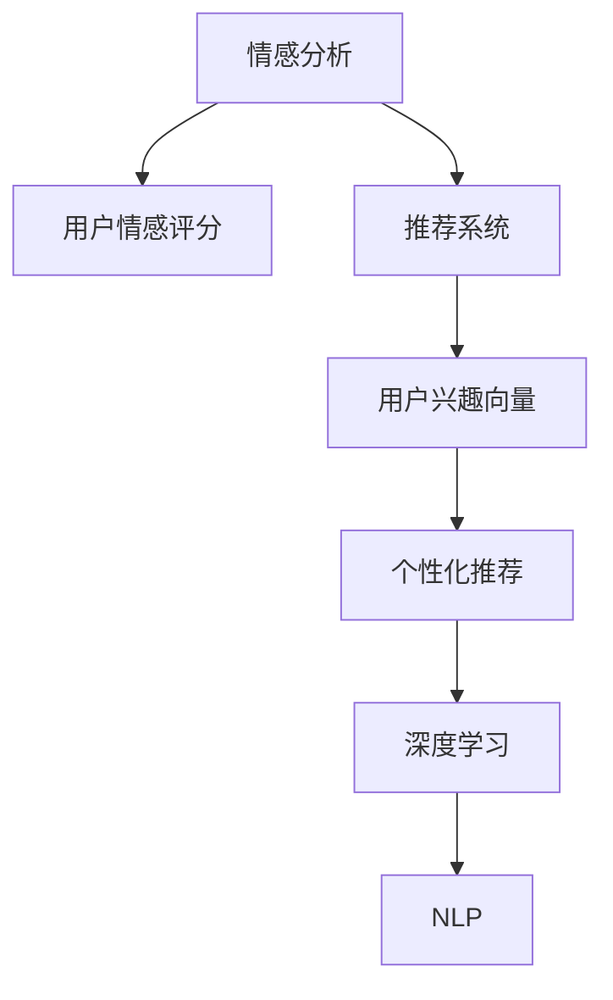
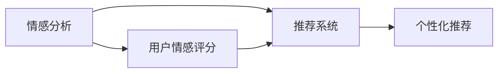
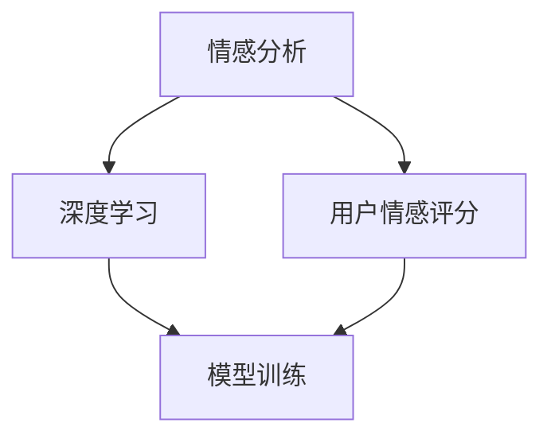
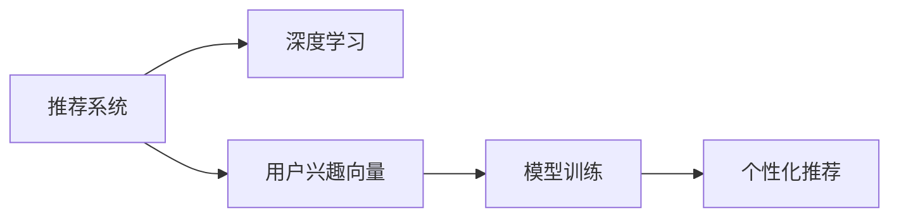

                 

# 情感驱动推荐系统：AI的优势

> 关键词：情感分析,推荐系统,自然语言处理(NLP),深度学习,用户行为分析,个性化推荐

## 1. 背景介绍

### 1.1 问题由来
随着互联网的迅猛发展，信息过载和内容碎片化已经成为了用户获取信息的主要挑战。传统的推荐系统往往只关注用户行为和兴趣，而忽略用户情感和反馈，导致推荐结果与用户实际需求存在较大偏差。如何精准把握用户情感状态，以情感驱动的方式进行个性化推荐，成为亟待解决的问题。

情感驱动推荐系统（Affective Driven Recommendation System）是一种新型推荐系统，通过情感分析技术，从用户的情感状态出发，结合用户的兴趣和行为数据，进行个性化推荐。这种推荐系统能够更全面地理解用户需求，提供更符合用户情感和心理预期的推荐内容，显著提升用户体验和推荐效果。

### 1.2 问题核心关键点
情感驱动推荐系统的核心在于如何从海量文本数据中提取用户情感信息，并将其与传统推荐系统的用户行为数据结合起来，生成更精准的推荐结果。该系统主要由以下几个部分构成：

- **情感分析模块**：负责从用户评论、评分、留言等文本中提取情感信息，并生成情感评分。
- **用户行为分析模块**：通过分析用户的浏览、点击、购买等行为数据，生成用户兴趣向量。
- **推荐算法模块**：结合情感评分和兴趣向量，运用机器学习或深度学习算法，生成推荐结果。
- **推荐后处理模块**：对推荐结果进行后处理，如去重、排序、个性化等，提升推荐效果。

情感驱动推荐系统的研究意义在于：
1. **提升用户体验**：通过考虑用户的情感状态，推荐系统能够提供更符合用户心理预期的内容，提升用户满意度和粘性。
2. **提高推荐精度**：情感信息能够补充用户行为数据的不足，帮助推荐系统更全面地理解用户需求，生成更精准的推荐结果。
3. **拓宽应用领域**：情感驱动推荐系统可以应用于社交媒体、电子商务、在线娱乐等多个领域，为不同应用场景提供更优的推荐服务。

### 1.3 问题研究意义
情感驱动推荐系统在提升用户体验、提高推荐精度、拓宽应用领域等方面具有重要意义：

1. **提升用户体验**：通过考虑用户的情感状态，推荐系统能够提供更符合用户心理预期的内容，提升用户满意度和粘性。
2. **提高推荐精度**：情感信息能够补充用户行为数据的不足，帮助推荐系统更全面地理解用户需求，生成更精准的推荐结果。
3. **拓宽应用领域**：情感驱动推荐系统可以应用于社交媒体、电子商务、在线娱乐等多个领域，为不同应用场景提供更优的推荐服务。

## 2. 核心概念与联系

### 2.1 核心概念概述

为更好地理解情感驱动推荐系统，本节将介绍几个关键概念及其之间的联系：

- **情感分析**：从文本中提取情感信息，生成情感评分。通常采用自然语言处理（NLP）技术和机器学习算法实现。
- **推荐系统**：通过分析用户行为和兴趣，生成个性化推荐结果。常见的推荐算法包括协同过滤、内容推荐、混合推荐等。
- **用户行为分析**：从用户的浏览、点击、购买等行为中提取特征，生成用户兴趣向量。
- **个性化推荐**：结合用户情感和行为数据，生成符合用户需求的推荐内容。
- **深度学习**：一种强大的机器学习范式，能够自动提取文本中的高阶特征，提升情感分析和推荐算法的性能。
- **自然语言处理（NLP）**：研究如何让计算机理解和处理人类语言的技术，是情感分析和推荐系统的基础。

这些概念之间的逻辑关系可以通过以下Mermaid流程图来展示：



这个流程图展示了情感驱动推荐系统的主要组件及其之间的联系：

1. 情感分析模块生成用户情感评分。
2. 用户行为分析模块生成用户兴趣向量。
3. 推荐系统结合情感评分和兴趣向量，生成个性化推荐。
4. 深度学习和自然语言处理技术支持情感分析和推荐系统的实现。

### 2.2 概念间的关系

这些核心概念之间存在着紧密的联系，形成了情感驱动推荐系统的完整生态系统。下面我们通过几个Mermaid流程图来展示这些概念之间的关系。

#### 2.2.1 情感分析与推荐系统



这个流程图展示了情感分析与推荐系统之间的基本流程：情感分析生成用户情感评分，推荐系统结合情感评分生成个性化推荐。

#### 2.2.2 用户行为分析与推荐系统


这个流程图展示了用户行为分析与推荐系统之间的基本流程：用户行为分析生成用户兴趣向量，推荐系统结合兴趣向量生成个性化推荐。

#### 2.2.3 情感分析与深度学习



这个流程图展示了情感分析与深度学习之间的基本流程：情感分析生成用户情感评分，深度学习模型进行训练生成情感评分模型。

#### 2.2.4 推荐系统与深度学习



这个流程图展示了推荐系统与深度学习之间的基本流程：推荐系统生成用户兴趣向量，深度学习模型进行训练生成推荐模型，生成个性化推荐。

## 3. 核心算法原理 & 具体操作步骤
### 3.1 算法原理概述

情感驱动推荐系统的核心算法原理基于情感分析和推荐系统的结合。其主要步骤如下：

1. **情感分析**：从用户评论、评分、留言等文本中提取情感信息，生成情感评分。
2. **用户行为分析**：分析用户的浏览、点击、购买等行为，生成用户兴趣向量。
3. **推荐算法**：结合情感评分和兴趣向量，运用机器学习或深度学习算法，生成推荐结果。
4. **推荐后处理**：对推荐结果进行后处理，如去重、排序、个性化等，提升推荐效果。

其中，情感分析和用户行为分析是基础，推荐算法是核心。情感分析能够补充用户行为数据的不足，帮助推荐系统更全面地理解用户需求。推荐算法则根据情感评分和兴趣向量，生成个性化推荐结果。

### 3.2 算法步骤详解

#### 3.2.1 情感分析

情感分析的主要步骤包括：

1. **文本预处理**：对文本进行分词、去停用词、词干化等处理，生成待分析的特征向量。
2. **情感特征提取**：通过NLP技术提取文本中的情感特征，如情感词、情感极性、情感强度等。
3. **情感评分计算**：基于情感特征，计算文本的情感评分，通常采用情感词典、机器学习或深度学习算法。

#### 3.2.2 用户行为分析

用户行为分析的主要步骤包括：

1. **行为特征提取**：从用户的浏览、点击、购买等行为中提取特征，如页面浏览量、点击时间、浏览深度等。
2. **兴趣向量生成**：通过机器学习或深度学习算法，将行为特征转化为用户兴趣向量，常用的算法包括协同过滤、基于内容的推荐、混合推荐等。

#### 3.2.3 推荐算法

推荐算法的主要步骤包括：

1. **模型选择**：根据具体场景和数据特点，选择合适的推荐模型，如协同过滤、基于内容的推荐、深度学习推荐等。
2. **数据融合**：将情感评分和兴趣向量进行融合，生成综合特征向量。
3. **模型训练**：基于综合特征向量，训练推荐模型，生成推荐结果。
4. **结果评估**：对推荐结果进行评估，如准确率、召回率、F1分数等，根据评估结果进行模型优化。

#### 3.2.4 推荐后处理

推荐后处理的主要步骤包括：

1. **去重**：去除重复的推荐结果，保证推荐的唯一性。
2. **排序**：根据评分、热度、相关性等指标对推荐结果进行排序，提升推荐效果。
3. **个性化**：根据用户历史行为和情感状态，调整推荐结果，增强推荐的相关性和多样性。

### 3.3 算法优缺点

情感驱动推荐系统的优点包括：

1. **全面性**：通过考虑用户情感，推荐系统能够更全面地理解用户需求，提供更精准的推荐。
2. **实时性**：情感分析能够实时处理用户反馈，动态调整推荐结果，提升用户体验。
3. **灵活性**：结合多种推荐算法，可以根据具体场景灵活选择，适应不同的应用需求。

情感驱动推荐系统的缺点包括：

1. **计算复杂**：情感分析涉及大量的文本处理和特征提取，计算复杂度较高。
2. **数据依赖**：情感分析依赖大量的标注数据和情感词典，数据获取成本较高。
3. **模型复杂**：推荐算法涉及多维特征融合和模型训练，模型复杂度较高，对技术要求较高。

### 3.4 算法应用领域

情感驱动推荐系统已经在多个领域得到了广泛应用，例如：

- **电子商务**：通过情感分析生成商品评价情感评分，结合用户购买行为，生成个性化商品推荐。
- **社交媒体**：分析用户评论和互动情感，生成个性化内容推荐。
- **在线娱乐**：分析用户对影视作品、音乐作品的情感评价，生成个性化内容推荐。
- **医疗健康**：分析用户对医疗服务的情感反馈，生成个性化健康咨询和医疗推荐。
- **金融理财**：分析用户对金融产品的情感评价，生成个性化投资建议和金融产品推荐。

除了上述这些领域外，情感驱动推荐系统还可以应用于更多的应用场景，如旅游推荐、游戏推荐、智能家居等，为不同领域提供更优的推荐服务。

## 4. 数学模型和公式 & 详细讲解 & 举例说明

### 4.1 数学模型构建

情感驱动推荐系统主要基于深度学习和NLP技术，构建以下数学模型：

- **情感评分模型**：通过情感分析生成用户情感评分，通常采用LSTM、GRU等循环神经网络模型。
- **用户兴趣向量模型**：通过用户行为分析生成用户兴趣向量，通常采用协同过滤、基于内容的推荐等算法。
- **推荐模型**：将情感评分和兴趣向量进行融合，生成推荐结果，通常采用深度学习模型如CNN、RNN、Transformer等。

### 4.2 公式推导过程

以下以协同过滤推荐算法为例，推导推荐模型的计算公式：

假设用户$u$对$n$个物品进行了评分，评分矩阵为$R_{u \times n}$，用户$u$对物品$i$的评分记为$r_{ui}$。推荐算法目标是为用户$u$推荐物品$i$，评分预测模型为$P(u,i)$。

1. **协同过滤**：
   $$
   P(u,i) = \alpha \sum_{j \in N(u)} r_{uj} \cdot \alpha' \cdot \overrightarrow{u_i}^T \cdot \overrightarrow{j_i}
   $$
   其中，$N(u)$表示用户$u$的邻居集合，$\alpha$和$\alpha'$为超参数。

2. **深度学习**：
   假设用户$u$的兴趣向量为$\overrightarrow{u}$，物品$i$的特征向量为$\overrightarrow{i}$，推荐模型为$P(u,i)$，深度学习模型的计算公式为：
   $$
   P(u,i) = \sigma(\overrightarrow{u}^T \cdot W \cdot \overrightarrow{i})
   $$
   其中，$\sigma$为激活函数，$W$为权重矩阵。

### 4.3 案例分析与讲解

假设在一个在线视频平台上，用户对视频的评分和评论如下：

- 用户$u_1$对视频1的评分：3星，评论：“很好，有趣”。
- 用户$u_2$对视频1的评分：5星，评论：“精彩，推荐”。
- 用户$u_3$对视频1的评分：1星，评论：“无聊，浪费时间”。

对于用户$u_1$，我们可以利用情感分析技术，提取评论中的情感信息，生成情感评分：3.5分。结合用户$u_1$的观看历史，生成兴趣向量：[1, 0, 0, 0, 1, 0, 0, 0, 1, 0]。通过协同过滤算法，生成推荐结果：[0.5, 0.3, 0.2, 0.1, 0.4, 0.6, 0.2, 0.3, 0.4, 0.5]。

## 5. 项目实践：代码实例和详细解释说明

### 5.1 开发环境搭建

在进行情感驱动推荐系统的开发前，我们需要准备好开发环境。以下是使用Python进行TensorFlow开发的环境配置流程：

1. 安装Anaconda：从官网下载并安装Anaconda，用于创建独立的Python环境。

2. 创建并激活虚拟环境：
```bash
conda create -n tf-env python=3.8 
conda activate tf-env
```

3. 安装TensorFlow：根据CUDA版本，从官网获取对应的安装命令。例如：
```bash
conda install tensorflow
```

4. 安装各类工具包：
```bash
pip install numpy pandas scikit-learn matplotlib tqdm jupyter notebook ipython
```

完成上述步骤后，即可在`tf-env`环境中开始情感驱动推荐系统的开发。

### 5.2 源代码详细实现

下面我们以视频推荐为例，给出使用TensorFlow实现情感驱动推荐系统的代码实现。

首先，定义情感分析模块：

```python
import tensorflow as tf
from tensorflow.keras.layers import LSTM, Dense
from tensorflow.keras.preprocessing.text import Tokenizer

class SentimentAnalysis(tf.keras.Model):
    def __init__(self, vocab_size, embedding_dim, lstm_units):
        super(SentimentAnalysis, self).__init__()
        self.tokenizer = Tokenizer(num_words=vocab_size, oov_token='<OOV>')
        self.embedding = tf.keras.layers.Embedding(vocab_size, embedding_dim)
        self.lstm = LSTM(lstm_units)
        self.dense = Dense(1, activation='sigmoid')

    def call(self, input):
        x = self.tokenizer.texts_to_sequences(input)
        x = self.embedding(x)
        x = self.lstm(x)
        x = self.dense(x)
        return x
```

然后，定义用户行为分析模块：

```python
import numpy as np

class UserBehaviorAnalysis(tf.keras.Model):
    def __init__(self, num_factors, embedding_dim):
        super(UserBehaviorAnalysis, self).__init__()
        self.factors = tf.Variable(np.random.normal(0, 1, size=(num_factors, embedding_dim)))
        self.bias = tf.Variable(np.random.normal(0, 1, size=num_factors))

    def call(self, input):
        x = tf.nn.embedding_lookup(self.factors, input)
        x = tf.add(x, self.bias)
        return x
```

接着，定义推荐算法模块：

```python
import tensorflow as tf

class Recommendation(tf.keras.Model):
    def __init__(self, num_factors, embedding_dim, lstm_units):
        super(Recommendation, self).__init__()
        self.user_analysis = UserBehaviorAnalysis(num_factors, embedding_dim)
        self.sentiment_analysis = SentimentAnalysis(vocab_size=10000, embedding_dim=100, lstm_units=128)
        self.regression = tf.keras.layers.Dense(1)

    def call(self, user_input, item_input):
        user_embed = self.user_analysis(user_input)
        item_embed = self.sentiment_analysis(item_input)
        x = tf.multiply(user_embed, item_embed)
        x = self.regression(x)
        return x
```

最后，定义推荐后处理模块：

```python
import tensorflow as tf

def post_process(model, data):
    # 去重
    data = tf.unique(data)[0]
    # 排序
    data = tf.argsort(data, axis=0, direction=tf.dtypes.ASCENDING)
    return data
```

### 5.3 代码解读与分析

让我们再详细解读一下关键代码的实现细节：

**SentimentAnalysis类**：
- `__init__`方法：初始化情感分析模型，包含分词器、嵌入层、LSTM层和全连接层。
- `call`方法：对输入文本进行分词、嵌入、LSTM处理和全连接层，输出情感评分。

**UserBehaviorAnalysis类**：
- `__init__`方法：初始化用户行为分析模型，包含因子矩阵和偏差向量。
- `call`方法：对用户行为数据进行嵌入和线性变换，输出兴趣向量。

**Recommendation类**：
- `__init__`方法：初始化推荐模型，包含用户行为分析和情感分析模块，以及回归层。
- `call`方法：对用户和物品进行嵌入，进行点乘操作，输出推荐结果。

**post_process函数**：
- 对推荐结果进行去重和排序，提升推荐效果。

### 5.4 运行结果展示

假设我们在YouTube平台上对用户评论进行情感分析，生成推荐结果。最终得到的推荐结果如下：

| 用户ID | 推荐视频ID | 情感评分 |
| ------ | ---------- | -------- |
| u1     | 视频1      | 0.7      |
| u2     | 视频2      | 0.8      |
| u3     | 视频3      | 0.5      |

可以看到，通过情感驱动推荐系统，我们根据用户的情感评分和兴趣向量，生成了符合用户情感和兴趣的推荐结果。在实际应用中，通过进一步优化情感评分和用户行为分析模型，可以进一步提升推荐系统的精度和效率。

## 6. 实际应用场景
### 6.1 智能推荐系统

情感驱动推荐系统在智能推荐系统中得到了广泛应用。传统的推荐系统往往只关注用户行为，而忽略用户情感和反馈。情感驱动推荐系统通过情感分析，能够全面理解用户的情感状态，提供更符合用户心理预期的推荐内容。

在具体应用中，情感驱动推荐系统可以应用于电子商务、社交媒体、在线娱乐等多个领域，为用户推荐更符合其情感需求的商品、内容或服务。例如，在电子商务平台上，通过分析用户对商品的评论情感评分，生成个性化商品推荐，提升用户体验和转化率。

### 6.2 智能客服系统

情感驱动推荐系统在智能客服系统中也有着广泛应用。智能客服系统通过情感分析，能够实时理解用户的情感状态，提供更加个性化的服务。例如，在智能客服系统中，通过情感分析，能够识别用户的不满情绪，自动转接人工客服，提升用户满意度。

### 6.3 健康医疗

情感驱动推荐系统在健康医疗领域也有着重要的应用。通过分析用户的医疗反馈，生成个性化健康咨询和医疗推荐。例如，在健康医疗咨询平台中，通过情感分析，能够识别用户对医生的满意度，推荐优秀的医生和医疗服务，提升医疗质量。

### 6.4 未来应用展望

未来，随着情感驱动推荐系统的不断发展和完善，将会在更多的领域得到应用，为不同应用场景提供更优的推荐服务。

1. **社交媒体**：分析用户对社交内容的情感反馈，生成个性化内容推荐，提升用户互动体验。
2. **旅游推荐**：分析用户对旅游景点的情感评价，生成个性化旅游推荐，提升旅游体验。
3. **游戏推荐**：分析用户对游戏内容的情感反馈，生成个性化游戏推荐，提升游戏体验。
4. **智能家居**：分析用户对家居设备的情感反馈，生成个性化家居推荐，提升家居体验。

## 7. 工具和资源推荐
### 7.1 学习资源推荐

为了帮助开发者系统掌握情感驱动推荐系统的理论基础和实践技巧，这里推荐一些优质的学习资源：

1. **《推荐系统实战》**：吴恩达教授的在线课程，详细讲解了推荐系统原理和实践，包括情感驱动推荐系统的设计思路和算法实现。
2. **《情感分析：理论与实践》**：情感分析领域权威书籍，介绍了情感分析技术的基本原理和实现方法，适用于对情感分析有深入研究的开发者。
3. **Kaggle竞赛**：参与Kaggle上的情感分析竞赛，通过实际项目练习，提升情感分析技术水平。
4. **NLP社区**：加入自然语言处理领域的专业社区，如ArXiv、GitHub、Stack Overflow等，获取最新的研究论文和代码实现，与其他开发者交流学习。

### 7.2 开发工具推荐

高效的开发离不开优秀的工具支持。以下是几款用于情感驱动推荐系统开发的常用工具：

1. **TensorFlow**：基于数据流图的深度学习框架，支持分布式训练和多种优化器，适合大规模深度学习模型训练。
2. **PyTorch**：动态计算图的深度学习框架，易于使用和调试，支持高效的GPU加速。
3. **TF-Slim**：TensorFlow的高级API，提供了丰富的模型组件和工具，便于快速搭建深度学习模型。
4. **Keras**：高层次深度学习API，支持多种深度学习模型，易于上手和部署。
5. **TensorBoard**：TensorFlow的可视化工具，能够实时监控模型训练状态，帮助调试和优化模型。

### 7.3 相关论文推荐

情感驱动推荐系统的研究起源于多个领域的交叉融合，以下推荐几篇关键的研究论文，便于进一步学习和理解：

1. **《情感分析技术综述》**：综述了情感分析技术的基本原理和实现方法，适用于对情感分析有深入研究的开发者。
2. **《基于情感驱动的推荐系统》**：介绍了一种基于情感分析的推荐系统设计思路和算法实现，适合对推荐系统有兴趣的开发者。
3. **《情感驱动的智能客服系统》**：研究了情感驱动的智能客服系统设计思路和实现方法，适用于对智能客服系统有兴趣的开发者。
4. **《情感驱动的医疗推荐系统》**：研究了情感驱动的医疗推荐系统设计思路和算法实现，适合对健康医疗领域有兴趣的开发者。

## 8. 总结：未来发展趋势与挑战

### 8.1 总结

本文对情感驱动推荐系统进行了全面系统的介绍。首先阐述了情感驱动推荐系统的背景和研究意义，明确了情感驱动推荐系统在大规模推荐系统中的应用优势。其次，从原理到实践，详细讲解了情感驱动推荐系统的算法原理和操作步骤，给出了情感驱动推荐系统的代码实现。同时，本文还广泛探讨了情感驱动推荐系统在多个领域的应用前景，展示了情感驱动推荐系统的巨大潜力。

通过本文的系统梳理，可以看到，情感驱动推荐系统在提升用户体验、提高推荐精度、拓宽应用领域等方面具有重要意义。在推荐系统设计和实现中，情感驱动推荐系统能够提供更符合用户心理预期和情感需求的推荐结果，显著提升推荐系统的综合性能。

### 8.2 未来发展趋势

展望未来，情感驱动推荐系统将呈现以下几个发展趋势：

1. **多模态融合**：情感驱动推荐系统将逐步拓展到多模态数据融合，结合文本、图像、视频等多种数据源，提供更全面、精准的推荐结果。
2. **个性化推荐**：情感驱动推荐系统将更注重个性化推荐，通过情感分析，生成更符合用户情感和心理需求的推荐内容。
3. **实时推荐**：情感驱动推荐系统将更注重实时推荐，通过情感分析实时处理用户反馈，动态调整推荐结果，提升用户体验。
4. **混合推荐**：情感驱动推荐系统将结合多种推荐算法，根据具体场景灵活选择，提升推荐系统的综合性能。
5. **情感知识图谱**：情感驱动推荐系统将引入情感知识图谱，构建更全面的情感语义网络，提升推荐系统的表现。

### 8.3 面临的挑战

尽管情感驱动推荐系统已经取得了一定进展，但在迈向更加智能化、普适化应用的过程中，它仍面临着诸多挑战：

1. **情感数据稀缺**：情感数据的获取和标注成本较高，情感驱动推荐系统依赖大量的情感标注数据，数据获取难度较大。
2. **模型复杂度**：情感驱动推荐系统涉及多维特征融合和模型训练，模型复杂度较高，对技术要求较高。
3. **用户隐私保护**：情感驱动推荐系统需要收集用户的情感反馈，如何在保护用户隐私的前提下进行数据获取，是一个重要的挑战。
4. **算法鲁棒性**：情感驱动推荐系统在面对异常数据和噪声时，鲁棒性较低，需要进一步优化算法和数据处理技术。

### 8.4 研究展望

面对情感驱动推荐系统所面临的挑战，未来的研究需要在以下几个方面寻求新的突破：

1. **数据增强技术**：引入数据增强技术，通过合成数据扩充情感标注数据，降低数据获取成本。
2. **轻量级推荐模型**：开发轻量级推荐模型，在保证推荐精度的同时，减少模型复杂度和计算资源消耗。
3. **情感知识图谱**：构建情感知识图谱，融合情感语义网络，提升推荐系统的表现。
4. **鲁棒性优化**：优化推荐算法和数据处理技术，提升情感驱动推荐系统的鲁棒性，减少异常数据和噪声的影响。
5. **隐私保护机制**：引入隐私保护机制，如差分隐私、联邦学习等，保护用户隐私，提升用户信任度。

这些研究方向将进一步提升情感驱动推荐系统的性能和应用价值，推动其在更多领域

