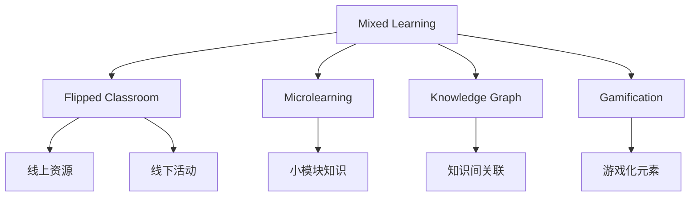

                 

# 技术培训：从学习者到培训者转变

> 关键词：技术培训, 学习者到培训者, 转化过程, 核心概念, 案例分析

## 1. 背景介绍

### 1.1 问题由来

随着信息技术的快速发展，技术培训在各个行业的重要性日益凸显。企业为了提高员工的技术能力，往往需要投入大量资源进行培训。然而，传统的培训模式往往以理论灌输为主，缺乏实践操作，导致学习效果不佳。

为了解决这一问题，越来越多的企业和机构开始采用混合式培训模式，即通过线上与线下相结合的方式，提供更灵活、高效的培训体验。但在实际应用中，如何设计混合式培训课程，如何实现培训效果的最大化，仍是一大难题。

### 1.2 问题核心关键点

要设计出高质量的混合式培训课程，关键在于理解学习者的需求和学习风格，并采用恰当的教学方法。这一过程可以抽象为从“学习者”到“培训者”的转变，即从受训者角度出发，设计出符合其需求的培训方案，并不断优化其效果。

核心关键点包括：
1. **需求分析**：通过调研了解学习者的实际需求和背景知识。
2. **学习设计**：基于需求分析，设计出符合学习者认知水平和风格的学习内容。
3. **评估反馈**：持续收集学习者反馈，评估培训效果，并据此优化课程。
4. **工具支持**：选择合适的工具和平台，辅助培训过程。

## 2. 核心概念与联系

### 2.1 核心概念概述

为了更好地设计混合式培训课程，本节将介绍几个核心概念及其相互联系。

- **混合式培训(Mixed Learning)**：结合线上线下教学资源和形式，为学习者提供多样化的学习体验。
- **翻转课堂(Flipped Classroom)**：将传统的课堂教学转化为课前自学和课内讨论的方式，提升课堂互动和效果。
- **微学习(Microlearning)**：将复杂的学习内容拆分为多个小模块，便于学习者理解和吸收。
- **知识图谱(Knowledge Graph)**：将知识以图的形式呈现，帮助学习者建立知识间的关联。
- **游戏化学习(Gamification)**：通过游戏化元素，激发学习者的兴趣和参与度。

这些概念可以相互结合，形成更高效、更有趣的混合式培训课程。例如，可以通过微学习模块和知识图谱，帮助学习者逐步掌握复杂概念；通过游戏化学习，提高学习者的参与度和动机；通过翻转课堂，将课堂时间用于深入讨论和互动，提升学习效果。

### 2.2 概念间的关系

这些核心概念之间的逻辑关系可以通过以下Mermaid流程图来展示：



这个流程图展示了大语言模型微调过程中各个核心概念的关系：

1. 混合式培训（A）：结合线上线下教学资源和形式，为学习者提供多样化的学习体验。
2. 翻转课堂（B）：将传统的课堂教学转化为课前自学和课内讨论的方式，提升课堂互动和效果。
3. 微学习（C）：将复杂的学习内容拆分为多个小模块，便于学习者理解和吸收。
4. 知识图谱（D）：将知识以图的形式呈现，帮助学习者建立知识间的关联。
5. 游戏化学习（E）：通过游戏化元素，激发学习者的兴趣和参与度。

这些概念共同构成了混合式培训的完整生态系统，使得培训过程更加灵活、高效、有趣。通过理解这些核心概念，我们可以更好地把握混合式培训的设计思路和实施方法。

## 3. 核心算法原理 & 具体操作步骤

### 3.1 算法原理概述

混合式培训的核心理论基础是成人学习理论，即学习者具有自我指导、自我激励和自我评估的能力。混合式培训旨在通过多种教学形式，激发学习者的积极参与，提升其学习效果。

核心算法原理包括：
1. **需求分析**：通过调查问卷、访谈等方式，了解学习者的需求、背景知识和学习风格。
2. **内容设计**：基于需求分析，设计出符合学习者认知水平和风格的学习内容。
3. **学习路径规划**：根据学习内容，制定合理的学习路径，确保学习者能够循序渐进地掌握知识点。
4. **评估反馈**：通过在线测试、作业等方式，持续收集学习者反馈，评估培训效果。
5. **动态调整**：根据评估结果，及时调整教学内容和方法，确保培训效果最大化。

### 3.2 算法步骤详解

以下是混合式培训的主要操作步骤：

1. **需求调研**：
   - 设计调查问卷，收集学习者的基本情况、技术水平和学习需求。
   - 通过访谈等方式，进一步了解学习者的学习风格和偏好。

2. **内容设计**：
   - 基于需求调研结果，设计出符合学习者认知水平和风格的学习内容。
   - 将内容拆分为多个小模块，便于学习者理解和吸收。
   - 使用知识图谱将知识点关联起来，帮助学习者构建知识框架。

3. **学习路径规划**：
   - 根据学习内容的难易程度和知识点关联，制定合理的学习路径。
   - 设计线下的翻转课堂活动，如小组讨论、实验等，提升学习者的参与度。
   - 使用游戏化元素，如积分、排行榜等，激励学习者的学习动机。

4. **评估反馈**：
   - 设计在线测试、作业等评估手段，持续收集学习者的反馈。
   - 分析评估结果，评估学习者对知识点的掌握情况。
   - 根据评估结果，调整教学内容和方法，确保学习效果。

5. **动态调整**：
   - 根据学习者的反馈，不断优化课程设计和教学方法。
   - 引入新的学习资源和工具，提升学习体验。
   - 定期进行课程评估，确保培训效果最大化。

### 3.3 算法优缺点

混合式培训的优势在于其灵活性和高效性。通过结合线上线下教学资源，可以提供多样化的学习体验，满足不同学习者的需求。同时，通过翻转课堂和游戏化学习，可以提升学习者的参与度和兴趣。

然而，混合式培训也存在一些缺点：
1. **资源投入高**：需要投入大量的资源进行课程设计、内容制作和平台建设。
2. **学习者自律性要求高**：混合式培训需要学习者具备一定的自律性和自我管理能力。
3. **技术支持要求高**：需要学习者具备一定的技术基础，才能有效使用线上学习资源和工具。

### 3.4 算法应用领域

混合式培训主要应用于以下几个领域：
1. **企业培训**：通过混合式培训，提升员工的技术能力和工作绩效。
2. **学校教育**：通过翻转课堂等形式，提升学生的学习效果和课堂参与度。
3. **在线教育**：通过微学习、知识图谱等形式，提升在线学习的互动性和趣味性。
4. **自我学习**：通过混合式培训，提升自我学习和技能提升的效率。

## 4. 数学模型和公式 & 详细讲解 & 举例说明

### 4.1 数学模型构建

混合式培训的数学模型主要基于学习者学习效果和反馈数据的评估。假设学习者为 $L$，内容模块为 $C$，学习路径为 $P$，评估结果为 $R$，则混合式培训的数学模型可以表示为：

$$
R = f(L, C, P)
$$

其中 $f$ 为评估函数，将学习者 $L$、内容模块 $C$ 和学习路径 $P$ 映射为评估结果 $R$。

### 4.2 公式推导过程

为了简化问题，我们可以假设评估结果 $R$ 为二元变量，即学习者掌握和未掌握两种状态。则评估函数 $f$ 可以表示为：

$$
R = \sum_{i=1}^N a_i \cdot L_i \cdot C_i \cdot P_i
$$

其中 $a_i$ 为权重系数，$L_i$、$C_i$、$P_i$ 分别为学习者、内容模块和学习路径对评估结果的贡献。

### 4.3 案例分析与讲解

假设我们正在设计一个Python编程培训课程，学习者共100人，内容模块包括基础语法、数据结构、面向对象编程等。每个内容模块的学习路径包括阅读教材、观看视频、练习代码和小组讨论等步骤。

我们将每个内容模块的学习效果分为掌握和未掌握两种状态，使用二元变量 $L_i$ 表示。通过调研，我们发现学习者掌握基础语法的概率为 $P(L_1)$，掌握数据结构的概率为 $P(L_2)$，掌握面向对象编程的概率为 $P(L_3)$。

对于每个内容模块 $C_i$，我们分别设定其权重系数 $a_i$，以反映其在整个培训中的重要性。对于每个学习路径 $P_i$，我们根据其步骤的难易程度和互动性，设定相应的权重系数。

最后，通过公式计算每个学习者的综合评估结果 $R$，根据评估结果动态调整课程内容和教学方法，确保培训效果最大化。

## 5. 项目实践：代码实例和详细解释说明

### 5.1 开发环境搭建

在进行混合式培训课程设计时，需要准备以下开发环境：

1. 安装Python环境：可以使用Anaconda或Miniconda，方便管理和安装各种库。
2. 安装相关库：需要安装Jupyter Notebook、numpy、pandas、matplotlib等库，用于数据处理和可视化。
3. 设计问卷和访谈：使用Google Forms或SurveyMonkey等工具，设计问卷和访谈问题，收集学习者需求和反馈。
4. 课程设计工具：可以使用Trello、Slido等工具，进行课程设计和内容制作。

### 5.2 源代码详细实现

以下是一个简单的Python代码示例，用于计算学习者的综合评估结果：

```python
import numpy as np
from sympy import symbols, Eq, solve

# 定义符号
P1, P2, P3 = symbols('P1 P2 P3')  # 学习者掌握各个模块的概率
a1, a2, a3 = symbols('a1 a2 a3')  # 内容模块权重系数
p1, p2, p3 = symbols('p1 p2 p3')  # 学习路径权重系数

# 学习者掌握基础语法的概率
P1_value = 0.8

# 学习者掌握数据结构的概率
P2_value = 0.7

# 学习者掌握面向对象编程的概率
P3_value = 0.6

# 内容模块权重系数
a1_value = 0.3
a2_value = 0.4
a3_value = 0.3

# 学习路径权重系数
p1_value = 0.2
p2_value = 0.3
p3_value = 0.5

# 计算每个学习者的综合评估结果
R = (a1 * P1 * p1 + a2 * P2 * p2 + a3 * P3 * p3)

# 代入具体值
R_value = R.subs({P1: P1_value, P2: P2_value, P3: P3_value,
                 a1: a1_value, a2: a2_value, a3: a3_value,
                 p1: p1_value, p2: p2_value, p3: p3_value})

# 输出评估结果
print(f"学习者的综合评估结果为: {R_value}")
```

### 5.3 代码解读与分析

该代码示例使用了Sympy库，定义了符号变量并计算了学习者的综合评估结果。我们通过代入具体值，得到了每个学习者的综合评估结果。在实际应用中，我们需要根据具体的调研结果和课程设计，动态调整这些系数和概率，以确保培训效果的最大化。

### 5.4 运行结果展示

假设在上述示例中，我们计算出了学习者的综合评估结果为 $R=0.97$，表示该学习者掌握各个模块的概率非常高，达到了97%。这意味着该学习者可以较为顺利地完成整个培训课程，并达到预期的学习效果。

## 6. 实际应用场景

### 6.1 企业培训

企业可以采用混合式培训模式，提升员工的技术能力和工作绩效。例如，某科技公司通过混合式培训，使员工在6个月内掌握了Python编程技能，并在实际项目中表现优异。

### 6.2 学校教育

学校可以采用翻转课堂等形式，提升学生的学习效果和课堂参与度。例如，某大学通过混合式培训，使学生在6个月内掌握了大数据技术，并在毕业答辩中表现出色。

### 6.3 在线教育

在线教育平台可以采用微学习、知识图谱等形式，提升在线学习的互动性和趣味性。例如，某在线教育平台通过混合式培训，使学生在学习过程中更加积极主动，取得了更好的学习效果。

### 6.4 自我学习

个人可以通过混合式培训，提升自我学习和技能提升的效率。例如，某IT爱好者通过混合式培训，在3个月内掌握了深度学习技术，并在开源项目中贡献代码。

## 7. 工具和资源推荐

### 7.1 学习资源推荐

为了帮助培训者系统掌握混合式培训的理论基础和实践技巧，这里推荐一些优质的学习资源：

1. **混合式学习理论**：《混合式学习：设计和实施混合式学习》（Mixed-Mode Instruction and Technologies for Learning: A Handbook），提供混合式学习的理论框架和实践指南。
2. **翻转课堂设计**：《翻转课堂：让课堂翻转起来》（Flipped Classroom: Revolutionize Teaching and Learning），介绍翻转课堂的设计和实施方法。
3. **微学习技术**：《微学习：一种新型的在线学习模式》（Microlearning: A New Way to Optimize Online Learning），讨论微学习技术的优势和应用场景。
4. **知识图谱应用**：《知识图谱：从概念到实践》（Knowledge Graphs: Concepts, Principles, and Best Practices），介绍知识图谱的应用方法和技术细节。
5. **游戏化学习理论**：《游戏化学习：如何通过游戏提高学习效果》（Gamification by Design: Implementing Gamification in the Classroom），介绍游戏化学习的理论和实践技巧。

### 7.2 开发工具推荐

高效的混合式培训设计离不开优秀的工具支持。以下是几款用于混合式培训设计的常用工具：

1. **Jupyter Notebook**：开源的交互式计算环境，支持代码编写和可视化展示。
2. **Google Forms**：在线问卷调查工具，方便设计和分发问卷。
3. **Trello**：项目管理工具，支持课程设计和进度管理。
4. **Slido**：互动式问答工具，用于课堂讨论和互动。
5. **Edx**：在线教育平台，提供丰富的混合式培训课程。

### 7.3 相关论文推荐

混合式培训的发展源于学界的持续研究。以下是几篇奠基性的相关论文，推荐阅读：

1. **混合式学习的效果评估**：《混合式学习的效果评估：一项系统综述》（Mixed-Mode Instruction Effects on Student Learning: A Review of Evidence），总结了混合式学习对学生学习效果的影响。
2. **翻转课堂的应用案例**：《翻转课堂：一个创新性教学模式的案例研究》（The Flipped Classroom: A Case Study of an Innovative Instructional Model），展示了翻转课堂在实际教学中的应用效果。
3. **微学习的设计与实施**：《微学习：一种新型的在线学习模式》（Microlearning: A New Way to Optimize Online Learning），探讨了微学习的设计与实施方法。
4. **知识图谱在教育中的应用**：《知识图谱：教育领域的应用研究》（Knowledge Graphs in Education: An Application Study），介绍了知识图谱在教育领域的应用案例。
5. **游戏化学习的有效性研究**：《游戏化学习：理论和实证研究》（Gamification: Theory and Empirical Findings），分析了游戏化学习的理论和实证研究结果。

除上述资源外，还有一些值得关注的前沿资源，帮助培训者紧跟混合式培训技术的最新进展，例如：

1. **arXiv论文预印本**：人工智能领域最新研究成果的发布平台，包括大量尚未发表的前沿工作，学习前沿技术的必读资源。
2. **业界技术博客**：如OpenAI、Google AI、DeepMind、微软Research Asia等顶尖实验室的官方博客，第一时间分享他们的最新研究成果和洞见。
3. **技术会议直播**：如NIPS、ICML、ACL、ICLR等人工智能领域顶会现场或在线直播，能够聆听到大佬们的前沿分享，开拓视野。
4. **GitHub热门项目**：在GitHub上Star、Fork数最多的混合式培训相关项目，往往代表了该技术领域的发展趋势和最佳实践，值得去学习和贡献。
5. **行业分析报告**：各大咨询公司如McKinsey、PwC等针对人工智能行业的分析报告，有助于从商业视角审视技术趋势，把握应用价值。

总之，对于混合式培训技术的学习和实践，需要培训者保持开放的心态和持续学习的意愿。多关注前沿资讯，多动手实践，多思考总结，必将收获满满的成长收益。

## 8. 总结：未来发展趋势与挑战

### 8.1 总结

本文对混合式培训从学习者到培训者转变的过程进行了全面系统的介绍。首先阐述了混合式培训的背景和重要性，明确了培训者角色的关键作用。其次，从原理到实践，详细讲解了混合式培训的数学模型和操作步骤，给出了混合式培训任务开发的完整代码实例。同时，本文还广泛探讨了混合式培训在企业培训、学校教育、在线教育等多个领域的应用前景，展示了混合式培训的巨大潜力。此外，本文精选了混合式培训技术的各类学习资源，力求为培训者提供全方位的技术指引。

通过本文的系统梳理，可以看到，混合式培训技术正在成为教育和技术培训领域的重要范式，极大地拓展了学习者和培训者的知识边界，催生了更多的落地场景。未来，伴随混合式培训方法的持续演进，相信教育技术必将迈向更高的台阶，为人才培养和职业发展注入新的活力。

### 8.2 未来发展趋势

展望未来，混合式培训技术将呈现以下几个发展趋势：

1. **智能化教学**：引入人工智能和机器学习技术，自动评估学习者的学习效果，提供个性化的学习建议。
2. **多模态学习**：结合图像、视频、音频等多种模态的信息，提升学习体验和效果。
3. **自适应学习**：根据学习者的反馈和表现，动态调整学习内容和路径，提供最合适的学习方案。
4. **混合式学习社区**：构建学习者之间的互动和协作平台，促进知识共享和社区学习。
5. **跨领域应用**：将混合式培训应用于更广泛的领域，如医疗、商业、政府等，提升各行业的业务水平。

以上趋势凸显了混合式培训技术的广阔前景。这些方向的探索发展，必将进一步提升教育技术的学习效果和应用范围，为人类知识和技能的传承与创新提供新的平台。

### 8.3 面临的挑战

尽管混合式培训技术已经取得了瞩目成就，但在迈向更加智能化、普适化应用的过程中，它仍面临着诸多挑战：

1. **资源投入高**：混合式培训需要大量的资源进行课程设计、内容制作和平台建设，成本较高。
2. **技术门槛高**：培训者和学习者需要具备一定的技术基础，才能有效使用线上学习资源和工具。
3. **自律性要求高**：混合式培训需要学习者具备一定的自律性和自我管理能力，这对成人学习者尤其挑战。
4. **评估难度大**：混合式培训的评估需要综合考虑线上和线下表现，难度较大。
5. **效果不一**：不同学习者的学习效果差异较大，难以实现统一的标准和效果。

### 8.4 研究展望

面对混合式培训面临的这些挑战，未来的研究需要在以下几个方面寻求新的突破：

1. **智能化评估**：引入人工智能技术，实现学习效果的智能化评估。
2. **低成本方案**：探索低成本、易上手的混合式培训方案，降低培训成本和门槛。
3. **个性化学习**：基于学习者的行为和反馈，提供个性化的学习方案。
4. **多方协作**：引入多方协作机制，提升培训的互动性和效果。
5. **跨领域应用**：将混合式培训应用于更多领域，提升各行业的业务水平。

这些研究方向将引领混合式培训技术迈向更高的台阶，为教育技术的发展和应用提供新的动力。只有不断创新、勇于突破，才能真正实现混合式培训技术的普及和落地，助力人类知识和技能的传承与创新。

## 9. 附录：常见问题与解答

**Q1：混合式培训是否适用于所有学习者？**

A: 混合式培训适用于大部分学习者，尤其是成人学习者。但对于一些特殊人群，如儿童、视听障碍者等，仍需结合其他培训方式，提供更合适的学习体验。

**Q2：如何设计混合式培训课程？**

A: 设计混合式培训课程需要考虑学习者的需求、背景知识和学习风格。首先通过调研和访谈，了解学习者的基本情况和需求。然后基于调研结果，设计出符合学习者认知水平和风格的学习内容。最后，结合线上线下教学资源和形式，提供多样化的学习体验。

**Q3：混合式培训的效果如何评估？**

A: 混合式培训的效果可以通过在线测试、作业等方式进行评估。评估结果需要综合考虑学习者的线上和线下表现，评估学习者对知识点的掌握情况。根据评估结果，及时调整教学内容和方法，确保培训效果最大化。

**Q4：如何优化混合式培训课程？**

A: 混合式培训课程需要持续优化和改进。通过收集学习者的反馈和评估结果，动态调整课程内容和教学方法。引入新的学习资源和工具，提升学习体验。定期进行课程评估，确保培训效果最大化。

**Q5：混合式培训面临的挑战有哪些？**

A: 混合式培训面临的挑战包括资源投入高、技术门槛高、自律性要求高、评估难度大、效果不一等。解决这些挑战需要多方协作，不断创新和优化，才能实现混合式培训的普及和落地。

---

作者：禅与计算机程序设计艺术 / Zen and the Art of Computer Programming

