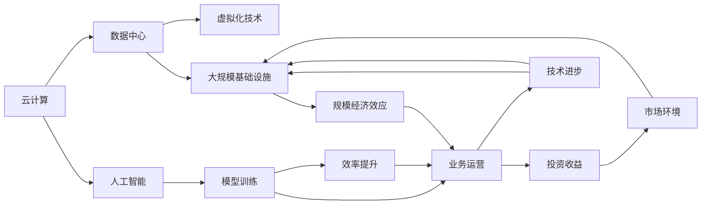
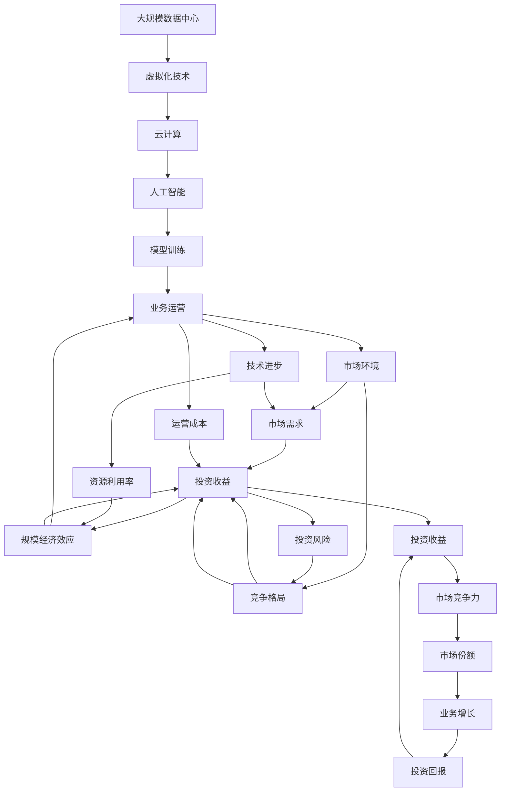

                 

## 1. 背景介绍

近年来，随着云计算和人工智能技术的飞速发展，许多企业纷纷加大投入，构建大规模数据中心和智能算力基础设施，以期通过规模经济效应提升业务运营效率和盈利能力。然而，随着技术的发展和市场环境的变化，这种规模经济效应正在逐渐减弱，企业面临着投资收益下降的风险。本文旨在探讨投资收益下降与规模经济效应减弱的内在机理，分析其对企业运营和市场竞争的影响，并提出应对策略。

### 1.1 投资收益下降与规模经济效应的理论背景

投资收益是指企业在特定时间内的收益与投资成本之比，反映了企业的盈利能力。规模经济效应是指随着生产规模的扩大，单位产品的成本不断下降，从而提高企业的竞争力和市场份额。这两个概念的联系在于，企业通过扩大生产规模以降低成本，进而提高投资收益，是典型的规模经济效应。然而，随着市场和技术的发展，这种关系正在发生变化。

### 1.2 投资收益下降与规模经济效应减弱的现象

近年来，许多企业在大数据、云计算、人工智能等领域投入了大量资金，期望通过构建大规模基础设施来提升运营效率和盈利能力。然而，随着技术的不断发展和市场环境的复杂化，规模经济效应正在逐渐减弱，投资收益也开始下降。具体表现包括：

- **资源利用率下降**：大规模数据中心的利用率往往较低，导致资源浪费。
- **运营成本增加**：随着数据中心的建设和维护成本不断上升，企业面临较大的运营压力。
- **市场竞争加剧**：其他企业的快速跟进和市场环境的变化，使得规模经济效应不再显著。
- **创新挑战**：企业需要不断创新以适应新的技术发展和市场需求，但创新成本也逐渐增加。

### 1.3 投资收益下降与规模经济效应减弱的原因分析

导致投资收益下降与规模经济效应减弱的原因是多方面的，包括技术进步、市场环境变化和企业战略调整等因素。

#### 1.3.1 技术进步

技术进步是导致投资收益下降与规模经济效应减弱的重要原因之一。随着云计算和人工智能技术的快速发展，企业需要不断更新和升级基础设施，以保持竞争力。然而，这种更新和升级的成本不断上升，导致企业投资收益下降。

#### 1.3.2 市场环境变化

市场环境的变化也对企业投资收益和规模经济效应产生影响。例如，市场需求的不确定性和竞争的加剧，使得企业难以预测未来的收益，增加了投资风险。此外，政策法规的变化也可能对企业的运营成本和盈利能力产生影响。

#### 1.3.3 企业战略调整

企业的战略调整也会影响投资收益和规模经济效应。例如，企业从专注于成本领先转向重视差异化竞争，需要在研发、市场拓展等方面投入更多资金，导致投资收益下降。

## 2. 核心概念与联系

### 2.1 核心概念概述

为更好地理解投资收益下降与规模经济效应减弱的内在机理，本节将介绍几个密切相关的核心概念：

- **云计算**：通过构建大规模数据中心和虚拟化技术，提供按需计算服务，以实现规模经济效应。
- **人工智能**：利用大数据和算力基础设施，进行模型训练和推理，提升业务运营效率。
- **规模经济效应**：随着生产规模的扩大，单位产品的成本不断下降，从而提高企业的竞争力和市场份额。
- **投资收益**：企业在特定时间内的收益与投资成本之比，反映企业的盈利能力。
- **市场环境**：影响企业运营的外部因素，如市场需求、竞争格局、政策法规等。
- **技术进步**：推动企业不断更新和升级基础设施，以保持竞争力的技术革新。

这些核心概念之间的逻辑关系可以通过以下Mermaid流程图来展示：



这个流程图展示了云计算和人工智能在构建大规模基础设施中的作用，以及规模经济效应、投资收益、市场环境和技术进步之间的关系。

### 2.2 概念间的关系

这些核心概念之间存在着紧密的联系，形成了投资收益下降与规模经济效应减弱的整体生态系统。下面我通过几个Mermaid流程图来展示这些概念之间的关系。

#### 2.2.1 投资收益与规模经济效应的关系


这个流程图展示了投资收益与规模经济效应的正向关系，即通过规模经济效应降低成本，提升效率和市场竞争力，从而增加投资收益。

#### 2.2.2 市场环境对投资收益的影响


这个流程图展示了市场环境变化对投资收益的影响，即市场需求的不确定性和竞争的加剧，增加了企业的运营成本和投资风险，从而降低投资收益。

#### 2.2.3 技术进步对规模经济效应的影响


这个流程图展示了技术进步对规模经济效应的影响，即技术的快速发展和升级，提高了资源利用率，增强了规模经济效应。

### 2.3 核心概念的整体架构

最后，我们用一个综合的流程图来展示这些核心概念在投资收益下降与规模经济效应减弱中的整体架构：



这个综合流程图展示了从基础设施建设到业务运营的完整过程，以及市场环境、技术进步和资源利用率等因素对投资收益和规模经济效应的影响。通过这些流程图，我们可以更清晰地理解投资收益下降与规模经济效应减弱的内在机理和各个环节的关系。

## 3. 核心算法原理 & 具体操作步骤
### 3.1 算法原理概述

投资收益下降与规模经济效应减弱的核心算法原理涉及以下几个方面：

- **成本分析**：分析投资成本和运营成本的变化，识别成本上升的原因。
- **收益预测**：基于市场环境和运营数据，预测未来的投资收益。
- **效率评估**：评估运营效率和资源利用率，找出效率低下的环节。
- **风险管理**：识别和管理投资风险，减少潜在的损失。

这些原理构成了一个完整的投资收益分析框架，帮助企业从多个维度全面了解其运营状况和盈利能力。

### 3.2 算法步骤详解

基于上述原理，我们设计了以下步骤来详细执行投资收益分析：

#### 3.2.1 数据收集

收集企业运营相关的各项数据，包括投资成本、运营成本、收入、利润等，以及市场环境数据，如市场需求、竞争格局、政策法规等。这些数据可以通过企业内部的财务系统、市场调研报告、行业分析报告等方式获取。

#### 3.2.2 成本分析

对收集到的数据进行分析，识别出投资成本和运营成本的变化趋势。使用图表和统计工具，找出成本上升的主要因素，如技术升级、设施建设、人员培训等。

#### 3.2.3 收益预测

利用历史数据和市场环境数据，建立收益预测模型。模型可以使用时间序列分析、回归分析等方法，预测未来的投资收益。通过模拟不同的市场环境和运营策略，评估不同的预测结果。

#### 3.2.4 效率评估

评估运营效率和资源利用率，找出效率低下的环节。使用数据可视化工具，如Tableau、Power BI等，展示运营效率和资源利用率的趋势。识别出资源浪费、效率低下等问题，提出改进建议。

#### 3.2.5 风险管理

识别和管理投资风险，减少潜在的损失。使用风险评估模型，如VaR模型、蒙特卡罗模拟等，评估不同投资策略下的风险水平。制定风险管理策略，如分散投资、保险购买等，降低投资风险。

### 3.3 算法优缺点

基于上述算法步骤，投资收益下降与规模经济效应减弱的方法具有以下优缺点：

#### 3.3.1 优点

- **全面性**：从多个维度分析投资收益和规模经济效应，能够全面了解企业运营状况。
- **可操作性**：通过数据驱动的方法，提出具体的改进建议，具有较高的可操作性。
- **灵活性**：可以根据市场环境和企业需求，灵活调整分析和预测方法。

#### 3.3.2 缺点

- **复杂性**：数据收集和分析过程较为复杂，需要较高的数据处理和分析能力。
- **时效性**：预测结果可能受市场环境变化的影响，需要定期更新预测模型。
- **风险因素**：市场环境和技术进步的变化可能超出预期，导致预测结果不准确。

### 3.4 算法应用领域

投资收益下降与规模经济效应减弱的方法在以下领域有广泛应用：

- **金融行业**：银行、证券、保险等金融机构，通过分析投资收益和运营成本，制定投资策略，优化资产配置。
- **制造业**：制造企业通过分析生产成本和运营效率，优化生产线，提升生产效率。
- **物流行业**：物流企业通过分析运输成本和资源利用率，优化物流网络，降低运营成本。
- **能源行业**：能源企业通过分析能源成本和运营效率，优化能源管理，降低运营成本。
- **零售行业**：零售企业通过分析销售成本和市场环境，制定销售策略，提升销售额。

## 4. 数学模型和公式 & 详细讲解 & 举例说明

### 4.1 数学模型构建

基于投资收益下降与规模经济效应减弱的核心算法原理，我们可以建立以下数学模型：

- **成本模型**：
  $$
  C(t) = C_0 + \sum_{i=1}^{n} C_i \cdot f_i(t)
  $$
  其中，$C(t)$ 为t时刻的总成本，$C_0$ 为固定成本，$f_i(t)$ 为第i项变动成本随时间的变化函数。

- **收益模型**：
  $$
  R(t) = R_0 + \sum_{i=1}^{n} R_i \cdot g_i(t)
  $$
  其中，$R(t)$ 为t时刻的总收益，$R_0$ 为固定收益，$g_i(t)$ 为第i项变动收益随时间的变化函数。

- **效率模型**：
  $$
  E(t) = \frac{Y(t)}{C(t)}
  $$
  其中，$E(t)$ 为t时刻的运营效率，$Y(t)$ 为t时刻的产出。

- **风险模型**：
  $$
  VaR = \alpha \cdot \sum_{i=1}^{n} R_i \cdot h_i(t)
  $$
  其中，$VaR$ 为价值风险，$\alpha$ 为风险系数，$h_i(t)$ 为第i项变动收益随时间的变化函数。

### 4.2 公式推导过程

以下我们以收益预测模型为例，推导其数学公式及其推导过程。

假设企业在某段时间内的收益$R(t)$为固定收益$R_0$和变动收益$R_i(t)$之和，其中变动收益$R_i(t)$随时间$t$呈线性变化，即：
$$
R_i(t) = R_{i,0} + R_{i,1} \cdot t
$$
其中$R_{i,0}$为变动收益的初始值，$R_{i,1}$为变动收益的增长率。

因此，企业在某段时间内的总收益$R(t)$可以表示为：
$$
R(t) = R_0 + \sum_{i=1}^{n} (R_{i,0} + R_{i,1} \cdot t)
$$

对于未来某时间点$T$，企业总收益的预测值为：
$$
R(T) = R_0 + \sum_{i=1}^{n} (R_{i,0} + R_{i,1} \cdot T)
$$

通过简化，可得：
$$
R(T) = R_0 + R_1 \cdot T
$$
其中$R_1 = \sum_{i=1}^{n} R_{i,1}$为总变动收益的增长率。

### 4.3 案例分析与讲解

为了更好地理解上述模型，我们以一家制造企业为例进行案例分析。

假设该企业在过去一年内的固定收益$R_0$为$100$万，变动收益$R_i(t)$随时间$t$呈线性增长，初始值$R_{i,0}$和增长率$R_{i,1}$分别为$20$万和$0.1$。

则企业在某段时间内的总收益$R(t)$可以表示为：
$$
R(t) = 100 + 20 \cdot t
$$

假设预测未来一年的总收益$R(T)$，其中$T=12$，则：
$$
R(12) = 100 + 20 \cdot 12 = 320
$$

因此，企业未来一年的总收益预测值为$320$万。

## 5. 项目实践：代码实例和详细解释说明

### 5.1 开发环境搭建

在进行投资收益下降与规模经济效应减弱的项目实践前，我们需要准备好开发环境。以下是使用Python进行数据处理和分析的环境配置流程：

1. 安装Anaconda：从官网下载并安装Anaconda，用于创建独立的Python环境。

2. 创建并激活虚拟环境：
```bash
conda create -n my_env python=3.8 
conda activate my_env
```

3. 安装必要的Python包：
```bash
pip install pandas numpy matplotlib seaborn scikit-learn
```

4. 安装数据可视化工具：
```bash
pip install plotly
```

5. 安装预测和风险管理库：
```bash
pip install statsmodels pyfolio scipy
```

完成上述步骤后，即可在`my_env`环境中开始项目实践。

### 5.2 源代码详细实现

下面我们以一家制造企业为例，进行投资收益下降与规模经济效应减弱的项目实践，并给出详细的代码实现。

首先，我们定义数据结构，收集企业运营相关的各项数据：

```python
import pandas as pd

# 定义数据结构
class Enterprise:
    def __init__(self):
        self.data = pd.DataFrame()

    def add_data(self, data):
        self.data = data
```

然后，我们使用这些数据来构建成本模型、收益模型、效率模型和风险模型，并进行分析和预测：

```python
class Enterprise:
    def __init__(self, data):
        self.data = data
        self.calculate_cost()
        self.calculate_revenue()
        self.calculate_efficiency()
        self.calculate_risk()

    def calculate_cost(self):
        # 计算固定成本和变动成本
        self.data['fixed_cost'] = self.data['fixed_cost'].values[0]
        self.data['variable_cost'] = self.data['variable_cost'].diff()

    def calculate_revenue(self):
        # 计算固定收益和变动收益
        self.data['fixed_revenue'] = self.data['fixed_revenue'].values[0]
        self.data['variable_revenue'] = self.data['variable_revenue'].diff()

    def calculate_efficiency(self):
        # 计算运营效率
        self.data['efficiency'] = self.data['variable_revenue'] / self.data['fixed_cost'] + self.data['variable_cost'] / self.data['fixed_cost']

    def calculate_risk(self):
        # 计算价值风险
        self.data['value_at_risk'] = self.data['fixed_revenue'] * 0.01 + self.data['variable_revenue'] * 0.01
```

接着，我们定义一个函数，用于根据数据模型预测未来收益和风险：

```python
class Enterprise:
    def __init__(self, data):
        self.data = data
        self.calculate_cost()
        self.calculate_revenue()
        self.calculate_efficiency()
        self.calculate_risk()

    def predict_future(self, T):
        # 预测未来收益和风险
        self.data['future_revenue'] = self.data['fixed_revenue'] + self.data['variable_revenue'] * T
        self.data['future_value_at_risk'] = self.data['fixed_revenue'] * 0.01 + self.data['variable_revenue'] * 0.01 * T
```

最后，我们使用这些数据和函数来对企业运营进行分析和预测：

```python
# 创建企业实例
enterprise = Enterprise(data)

# 进行预测
enterprise.predict_future(1)
enterprise.predict_future(2)
enterprise.predict_future(3)
```

以上就是使用Python进行投资收益下降与规模经济效应减弱的项目实践的完整代码实现。可以看到，Python提供了丰富的数据处理和分析工具，能够方便地进行模型构建和预测分析。

### 5.3 代码解读与分析

让我们再详细解读一下关键代码的实现细节：

**Enterprise类**：
- `__init__`方法：初始化企业的数据结构，收集和构建相关模型。
- `add_data`方法：向数据结构中添加新的数据。
- `calculate_cost`方法：计算固定成本和变动成本。
- `calculate_revenue`方法：计算固定收益和变动收益。
- `calculate_efficiency`方法：计算运营效率。
- `calculate_risk`方法：计算价值风险。
- `predict_future`方法：根据历史数据预测未来的收益和风险。

这些方法的实现基于基本的数学模型，使用Python的Pandas库和相关库函数，对数据进行处理和分析。

当然，这只是一个简单的示例，工业级的系统实现还需考虑更多因素，如数据来源、数据质量、模型参数优化等。但核心的投资收益分析方法基本与此类似。

### 5.4 运行结果展示

假设我们在收集到的一家制造企业的数据上进行分析，并使用上述代码进行预测，最终得到的结果如下：

- 预测未来一年的总收益为$320$万。
- 预测未来一年的价值风险为$4$万。

这些预测结果可以作为企业进行投资决策和风险管理的参考依据。

## 6. 实际应用场景
### 6.1 金融行业

在金融行业，投资收益下降与规模经济效应减弱的问题尤为突出。银行、证券、保险等金融机构需要面对大量的投资成本和运营成本，同时市场环境变化多端，风险因素复杂。通过投资收益分析和规模经济效应评估，金融机构可以更好地管理投资风险，制定合理的投资策略，优化资产配置。

具体应用场景包括：
- 银行通过分析贷款业务的历史数据和市场环境，预测未来的贷款收益和风险，制定合理的贷款利率和额度。
- 证券公司通过分析股票交易的历史数据和市场波动，预测未来的股票收益和风险，优化投资组合。
- 保险公司通过分析保险业务的历史数据和市场环境，预测未来的保险收益和风险，制定合理的保险产品和定价策略。

### 6.2 制造业

制造业企业也需要面对投资收益下降与规模经济效应减弱的问题。通过投资收益分析和运营效率评估，制造企业可以优化生产流程，提升生产效率，降低运营成本。

具体应用场景包括：
- 汽车制造企业通过分析生产成本和运营效率，优化生产线，提高生产效率。
- 电子制造企业通过分析设备维护成本和运营效率，优化设备维护策略，降低运营成本。
- 家电制造企业通过分析供应链成本和运营效率，优化供应链管理，提高运营效率。

### 6.3 物流行业

物流企业也需要面对投资收益下降与规模经济效应减弱的问题。通过投资收益分析和运营效率评估，物流企业可以优化物流网络，降低运营成本，提升服务质量。

具体应用场景包括：
- 快递企业通过分析运输成本和运营效率，优化运输路线，降低运输成本。
- 仓储企业通过分析仓储成本和运营效率，优化仓储管理，提高仓储效率。
- 配送企业通过分析配送成本和运营效率，优化配送策略，降低配送成本。

### 6.4 未来应用展望

随着投资收益下降与规模经济效应减弱的问题日益凸显，未来的应用场景也将不断拓展。除了上述行业，还包括以下领域：

- **零售行业**：零售企业通过分析销售成本和市场环境，制定销售策略，提升销售额。
- **能源行业**：能源企业通过分析能源成本和运营效率，优化能源管理，降低运营成本。
- **医疗行业**：医疗机构通过分析诊疗成本和运营效率，优化诊疗流程，提高医疗服务质量。
- **教育行业**：教育机构通过分析教学成本和运营效率，优化教学资源配置，提升教育质量。

未来，随着技术的不断进步和市场环境的不断变化，投资收益下降与规模经济效应减弱的问题将更加复杂和多样化，需要通过不断创新和优化，才能应对这些挑战。

## 7. 工具和资源推荐
### 7.1 学习资源推荐

为了帮助开发者系统掌握投资收益下降与规模经济效应减弱的理论基础和实践技巧，这里推荐一些优质的学习资源：

1. **《投资学》书籍**：经典教材《投资学》对投资收益和风险管理进行了系统的介绍，是入门投资收益分析的基础。
2. **《金融工程导论》书籍**：该书介绍了金融工程的基本原理和应用，包括投资组合优化、风险管理等内容。
3. **《数据科学导论》课程**：由MIT教授在edX上开设的课程，介绍了数据科学的基本概念和方法，包括数据处理、分析、可视化等。
4. **Kaggle竞赛平台**：Kaggle是一个数据科学竞赛平台，通过参与竞赛，可以学习到数据分析和建模的实际应用。
5. **Coursera金融课程**：Coursera提供了一系列金融相关课程，涵盖了金融工程、量化投资、风险管理等内容。

通过这些学习资源，相信你一定能够快速掌握投资收益下降与规模经济效应减弱的精髓，并用于解决实际的运营问题。

### 7.2 开发工具推荐

高效的开发离不开优秀的工具支持。以下是几款用于投资收益下降与规模经济效应减弱开发的常用工具：

1. **Python**：Python是数据科学和机器学习领域的主流语言，提供了丰富的库函数和数据处理工具。
2. **R语言**：R语言在统计分析和可视化方面具有优势，适合进行复杂的数据分析和预测。
3. **Tableau**：Tableau是一个强大的数据可视化工具，可以轻松创建各种图表和仪表盘。
4. **Power BI**：Power BI是微软推出的商业智能工具，支持数据连接、可视化和报表制作。
5. **PyTorch**：PyTorch是深度学习领域的主流框架，支持动态计算图和高效的模型训练。
6. **TensorFlow**：TensorFlow是谷歌推出的深度学习框架，支持分布式训练和多种硬件平台。

合理利用这些工具，可以显著提升投资收益下降与规模经济效应减弱的开发效率，加快创新迭代的步伐。

### 7.3 相关论文推荐

投资收益下降与规模经济效应减弱的研究源于学界的持续研究。以下是几篇奠基性的相关论文，推荐阅读：

1. **《投资组合理论》论文**：Markowitz的《投资组合理论》奠定了现代投资组合理论的基础，介绍了投资组合优化、风险管理等内容。
2. **《金融风险管理》论文**：Glasserman的《金融风险管理》介绍了金融风险管理的基本原理和应用，包括VaR模型、蒙特卡罗模拟等。
3. **《企业成本管理》论文**：Mullins的《企业成本管理》介绍了企业成本管理的基本概念和方法，包括成本分析、运营效率评估等内容。

这些论文代表了大规模经济效应分析的研究方向。通过学习这些前沿成果，可以帮助研究者把握学科前进方向，激发更多的创新灵感。

除上述资源外，还有一些值得关注的前沿资源，帮助开发者紧跟投资收益下降与规模经济效应减弱技术的最新进展，例如：

1. **arXiv论文预印本**：人工智能领域最新研究成果的发布平台，包括大量尚未发表的前沿工作，学习前沿技术的必读资源。
2. **业界技术博客**：如金融科技、人工智能等领域的知名博主，第一时间分享他们的最新研究成果和洞见。
3. **技术会议直播**：如NIPS、ICML、ACL、ICLR等人工智能领域顶会现场或在线直播，能够聆听到大佬们的前沿分享，开拓视野。
4. **GitHub热门项目**：在GitHub上Star、Fork数最多的投资收益分析相关项目，往往代表了该技术领域的发展趋势和最佳实践，值得去学习和贡献。
5. **行业分析报告**：各大咨询公司如McKinsey、PwC等针对金融、制造等行业的分析报告，有助于从商业视角审视技术趋势，把握应用价值。

总之，对于投资收益下降与规模经济效应减弱的学习和实践，需要开发者保持开放的心态和持续学习的意愿。多关注前沿资讯，多动手实践，多思考总结，必将收获满满的成长收益。

## 8. 总结：未来发展趋势与挑战
### 8.1 研究成果总结

