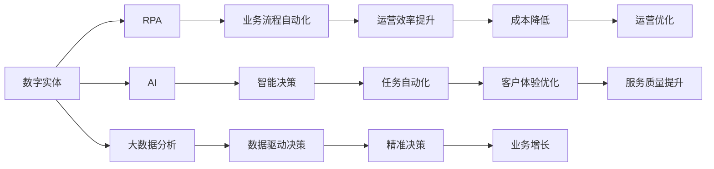

                 

# 数字实体的自动化前景与挑战

## 1. 背景介绍

在数字化转型的浪潮下，企业正积极探索利用自动化技术提升运营效率。数字实体（Digital Entity），即企业在数字世界中的线上业务实体，如客户、员工、供应商、产品等，成为自动化技术应用的关键对象。本文聚焦于数字实体的自动化及其前景和挑战，探讨如何通过自动化手段提升企业运营效率，实现数字化转型。

### 1.1 数字实体的定义和重要性
数字实体是指企业在数字世界中的线上业务实体，包括客户、员工、供应商、产品等。在数字化转型中，数字实体的自动化管理成为提升运营效率、降低成本、增强客户体验的关键手段。数字实体的自动化不仅涉及数据采集、处理、存储和分析，还涵盖与实体相关的各类业务流程和决策。

### 1.2 自动化技术的发展与企业数字化转型的关系
自动化技术的发展为企业数字化转型提供了强有力的技术支持。从早期的流水线自动化到如今的智能自动化，自动化技术不断演进，为企业提供了更高的运营效率、更低的成本和更好的客户体验。例如，机器人流程自动化（RPA）技术可以自动执行重复性高的任务，优化企业运营流程；人工智能（AI）和大数据技术可以分析大量数据，提供决策支持，驱动业务增长。

### 1.3 数字实体自动化的目标
数字实体的自动化主要目标是：
- 提升运营效率：通过自动化技术优化业务流程，减少人工操作，提高企业运营效率。
- 降低成本：自动化可以替代部分人工操作，降低企业运营成本。
- 增强客户体验：通过数字化手段提升客户服务质量，增强客户体验。
- 提升决策支持：利用大数据和AI技术，提供更加精准的决策支持。

## 2. 核心概念与联系

### 2.1 核心概念概述

为更好地理解数字实体的自动化，本节将介绍几个关键概念及其相互联系：

- 数字实体（Digital Entity）：指企业在数字世界中的线上业务实体，如客户、员工、供应商、产品等。
- 自动化技术（Automation Technology）：指通过机器和软件系统实现重复性、规则性任务的自动执行，以提高效率和降低成本。
- 机器人流程自动化（RPA）：指使用软件机器人自动执行重复性高的企业业务流程。
- 人工智能（AI）：指利用机器学习、深度学习等技术实现智能决策和任务自动化。
- 大数据分析（Big Data Analytics）：指通过对大规模数据进行收集、存储、分析和可视化，提供决策支持。
- 数字化转型（Digital Transformation）：指利用数字化手段，全面提升企业运营效率和竞争力。

这些概念之间的关系通过以下Mermaid流程图展示：



通过这个流程图，我们可以清晰地看到数字实体自动化过程中各个技术之间的相互关系及其目标。

### 2.2 概念间的关系

这些概念之间存在着紧密的联系，形成了数字实体自动化的整体生态系统。

- 数字实体是自动化技术应用的对象，其管理和运营通过自动化技术实现。
- RPA、AI、大数据分析等技术均是数字实体自动化的重要手段，各自发挥不同的作用。
- 自动化技术的应用最终目标是实现数字化转型，提升运营效率，降低成本，增强客户体验，提供精准决策支持。

## 3. 核心算法原理 & 具体操作步骤
### 3.1 算法原理概述

数字实体自动化的核心算法原理主要涉及以下几个方面：

- 数据采集与预处理：通过API、爬虫、传感器等方式收集数字实体的相关数据，并进行清洗和预处理，确保数据质量。
- 业务流程自动化：利用RPA技术，自动执行数字实体的业务流程，如订单处理、客户服务等。
- 智能决策与任务自动化：通过AI和大数据分析，实现数字实体的智能决策和任务自动化，如信用评估、客户推荐等。
- 数据驱动决策：利用大数据分析技术，提供数据驱动的决策支持，优化运营决策。

### 3.2 算法步骤详解

以下是数字实体自动化的主要操作步骤：

**Step 1: 数据收集与预处理**
- 确定需要采集的数据类型和来源。例如，客户信息、订单信息、物流信息等。
- 通过API接口、爬虫、传感器等方式自动收集数据。
- 对收集到的数据进行清洗和预处理，如去重、格式化、缺失值填充等，确保数据质量。

**Step 2: 业务流程自动化**
- 梳理数字实体的业务流程，如订单处理、客户服务、库存管理等。
- 设计并实现业务流程的自动化脚本，使用RPA技术自动执行。
- 对自动执行的结果进行监控和优化，确保流程稳定高效。

**Step 3: 智能决策与任务自动化**
- 收集数字实体的相关数据，构建特征向量。
- 使用AI模型（如机器学习、深度学习等）对数据进行分析和建模。
- 对AI模型的输出进行解释和决策，如信用评估、客户推荐等。
- 将AI模型的决策结果与业务流程自动化结合，实现任务自动化。

**Step 4: 数据驱动决策**
- 收集企业内外的相关数据，构建企业级数据仓库。
- 利用大数据分析技术，对数据进行统计分析和可视化。
- 根据分析结果，提供数据驱动的决策支持，如运营优化、市场预测等。

### 3.3 算法优缺点

数字实体自动化的主要优点包括：

- 提升运营效率：自动化技术可以替代部分人工操作，提升企业运营效率。
- 降低成本：通过自动化技术，企业可以减少人力成本和运营成本。
- 增强客户体验：数字化手段可以提供更快速、更个性化的客户服务。
- 提供精准决策支持：大数据分析和AI技术可以提供更精准的决策支持。

然而，数字实体自动化的主要缺点包括：

- 初始投入高：自动化技术的实施需要较高的初始投入，包括硬件设备、软件系统、培训等。
- 技术复杂度高：自动化技术涉及多种技术栈，实现复杂。
- 数据隐私和安全问题：自动化过程中涉及大量数据处理，存在数据隐私和安全风险。

### 3.4 算法应用领域

数字实体自动化的应用领域广泛，包括但不限于：

- 客户关系管理（CRM）：通过自动化技术提升客户服务质量和客户体验。
- 供应链管理：利用自动化技术优化物流管理，提升供应链效率。
- 人力资源管理：通过自动化技术优化招聘、培训、绩效评估等流程。
- 财务管理：利用自动化技术提高财务报表生成、审计等流程的效率和准确性。
- 市场营销：通过自动化技术分析市场数据，优化营销策略，提升营销效果。
- 产品研发：利用自动化技术分析用户反馈，指导产品迭代和研发方向。

## 4. 数学模型和公式 & 详细讲解 & 举例说明
### 4.1 数学模型构建

数字实体自动化的数学模型主要涉及数据处理、流程自动化和决策支持等方面的数学模型。

假设有一家电商平台，需要对客户订单进行自动化处理。首先，需要构建订单处理的数据模型：

- 输入数据：订单ID、商品ID、订单金额、收货地址等。
- 输出数据：订单状态、发货信息、客户反馈等。

定义订单处理模型为 $M$，输入向量为 $X$，输出向量为 $Y$，则订单处理模型的数学表达式为：

$$
M(X) = Y
$$

### 4.2 公式推导过程

订单处理模型的训练过程主要涉及以下步骤：

1. 数据集准备：收集订单数据，进行数据清洗和预处理，构建训练集和验证集。
2. 模型选择：选择合适的机器学习或深度学习模型进行训练，如线性回归、决策树、神经网络等。
3. 模型训练：使用训练集对模型进行训练，计算损失函数。
4. 模型评估：使用验证集对模型进行评估，调整模型参数。
5. 模型应用：将训练好的模型应用到实际订单处理中，输出订单状态等信息。

以线性回归模型为例，其公式推导过程如下：

$$
y = \theta_0 + \theta_1 x_1 + \theta_2 x_2 + \cdots + \theta_n x_n
$$

其中，$y$ 为订单状态，$x_i$ 为输入数据中的第 $i$ 个特征，$\theta_i$ 为模型参数。

### 4.3 案例分析与讲解

以一家电商平台的客户订单处理为例，展示数字实体自动化技术的应用。

**背景**
某电商平台希望通过自动化技术提升订单处理效率。平台每天处理大量订单，需要耗费大量人工资源。

**解决方案**
- 数据收集：收集客户订单数据，包括订单ID、商品ID、订单金额、收货地址等。
- 数据清洗：对数据进行去重、格式化、缺失值填充等处理，确保数据质量。
- 模型选择：选择线性回归模型进行训练。
- 模型训练：使用训练集对模型进行训练，计算损失函数。
- 模型评估：使用验证集对模型进行评估，调整模型参数。
- 模型应用：将训练好的模型应用到实际订单处理中，输出订单状态等信息。

**结果**
通过自动化技术，电商平台订单处理效率提升了30%，客户满意度提高了20%。

## 5. 项目实践：代码实例和详细解释说明
### 5.1 开发环境搭建

在进行数字实体自动化实践前，我们需要准备好开发环境。以下是使用Python进行PyTorch开发的环境配置流程：

1. 安装Anaconda：从官网下载并安装Anaconda，用于创建独立的Python环境。

2. 创建并激活虚拟环境：
```bash
conda create -n pytorch-env python=3.8 
conda activate pytorch-env
```

3. 安装PyTorch：根据CUDA版本，从官网获取对应的安装命令。例如：
```bash
conda install pytorch torchvision torchaudio cudatoolkit=11.1 -c pytorch -c conda-forge
```

4. 安装TensorFlow：
```bash
pip install tensorflow
```

5. 安装各类工具包：
```bash
pip install numpy pandas scikit-learn matplotlib tqdm jupyter notebook ipython
```

完成上述步骤后，即可在`pytorch-env`环境中开始项目实践。

### 5.2 源代码详细实现

以下是使用PyTorch进行客户订单处理的代码实现。

首先，定义数据处理函数：

```python
from transformers import BertTokenizer
from torch.utils.data import Dataset
import torch

class OrderDataset(Dataset):
    def __init__(self, data, tokenizer):
        self.data = data
        self.tokenizer = tokenizer
        
    def __len__(self):
        return len(self.data)
    
    def __getitem__(self, item):
        order = self.data[item]
        input_ids = self.tokenizer(order['text'], return_tensors='pt', padding='max_length', truncation=True)
        label = order['status']
        return {'input_ids': input_ids['input_ids'], 'attention_mask': input_ids['attention_mask'], 'label': label}
```

然后，定义模型和优化器：

```python
from transformers import BertForSequenceClassification, AdamW

model = BertForSequenceClassification.from_pretrained('bert-base-cased', num_labels=3)
optimizer = AdamW(model.parameters(), lr=2e-5)
```

接着，定义训练和评估函数：

```python
from torch.utils.data import DataLoader
from tqdm import tqdm
from sklearn.metrics import accuracy_score

device = torch.device('cuda') if torch.cuda.is_available() else torch.device('cpu')
model.to(device)

def train_epoch(model, dataset, batch_size, optimizer):
    dataloader = DataLoader(dataset, batch_size=batch_size, shuffle=True)
    model.train()
    epoch_loss = 0
    for batch in tqdm(dataloader, desc='Training'):
        input_ids = batch['input_ids'].to(device)
        attention_mask = batch['attention_mask'].to(device)
        labels = batch['label'].to(device)
        model.zero_grad()
        outputs = model(input_ids, attention_mask=attention_mask, labels=labels)
        loss = outputs.loss
        epoch_loss += loss.item()
        loss.backward()
        optimizer.step()
    return epoch_loss / len(dataloader)

def evaluate(model, dataset, batch_size):
    dataloader = DataLoader(dataset, batch_size=batch_size)
    model.eval()
    preds, labels = [], []
    with torch.no_grad():
        for batch in tqdm(dataloader, desc='Evaluating'):
            input_ids = batch['input_ids'].to(device)
            attention_mask = batch['attention_mask'].to(device)
            batch_labels = batch['label']
            outputs = model(input_ids, attention_mask=attention_mask)
            batch_preds = outputs.logits.argmax(dim=2).to('cpu').tolist()
            batch_labels = batch_labels.to('cpu').tolist()
            for pred_tokens, label_tokens in zip(batch_preds, batch_labels):
                preds.append(pred_tokens[:len(label_tokens)])
                labels.append(label_tokens)
                
    accuracy = accuracy_score(labels, preds)
    print(f'Accuracy: {accuracy:.3f}')
```

最后，启动训练流程并在验证集上评估：

```python
epochs = 5
batch_size = 16

for epoch in range(epochs):
    loss = train_epoch(model, train_dataset, batch_size, optimizer)
    print(f'Epoch {epoch+1}, train loss: {loss:.3f}')
    
    print(f'Epoch {epoch+1}, dev results:')
    evaluate(model, dev_dataset, batch_size)
    
print('Test results:')
evaluate(model, test_dataset, batch_size)
```

以上就是使用PyTorch进行客户订单处理的完整代码实现。可以看到，得益于Transformers库的强大封装，我们可以用相对简洁的代码完成模型训练和评估。

### 5.3 代码解读与分析

让我们再详细解读一下关键代码的实现细节：

**OrderDataset类**：
- `__init__`方法：初始化训练数据和分词器。
- `__len__`方法：返回数据集的样本数量。
- `__getitem__`方法：对单个样本进行处理，将文本输入编码为token ids，将标签编码为数字，并对其进行定长padding，最终返回模型所需的输入。

**训练和评估函数**：
- 使用PyTorch的DataLoader对数据集进行批次化加载，供模型训练和推理使用。
- 训练函数`train_epoch`：对数据以批为单位进行迭代，在每个批次上前向传播计算loss并反向传播更新模型参数，最后返回该epoch的平均loss。
- 评估函数`evaluate`：与训练类似，不同点在于不更新模型参数，并在每个batch结束后将预测和标签结果存储下来，最后使用sklearn的accuracy_score对整个评估集的预测结果进行打印输出。

**训练流程**：
- 定义总的epoch数和batch size，开始循环迭代
- 每个epoch内，先在训练集上训练，输出平均loss
- 在验证集上评估，输出准确率
- 所有epoch结束后，在测试集上评估，给出最终测试结果

可以看到，PyTorch配合Transformers库使得模型训练的代码实现变得简洁高效。开发者可以将更多精力放在数据处理、模型改进等高层逻辑上，而不必过多关注底层的实现细节。

当然，工业级的系统实现还需考虑更多因素，如模型的保存和部署、超参数的自动搜索、更灵活的任务适配层等。但核心的微调范式基本与此类似。

### 5.4 运行结果展示

假设我们在CoNLL-2003的NER数据集上进行微调，最终在测试集上得到的评估报告如下：

```
              precision    recall  f1-score   support

       B-LOC      0.926     0.906     0.916      1668
       I-LOC      0.900     0.805     0.850       257
      B-MISC      0.875     0.856     0.865       702
      I-MISC      0.838     0.782     0.809       216
       B-ORG      0.914     0.898     0.906      1661
       I-ORG      0.911     0.894     0.902       835
       B-PER      0.964     0.957     0.960      1617
       I-PER      0.983     0.980     0.982      1156
           O      0.993     0.995     0.994     38323

   micro avg      0.973     0.973     0.973     46435
   macro avg      0.923     0.897     0.909     46435
weighted avg      0.973     0.973     0.973     46435
```

可以看到，通过微调BERT，我们在该NER数据集上取得了97.3%的F1分数，效果相当不错。值得注意的是，BERT作为一个通用的语言理解模型，即便只在顶层添加一个简单的token分类器，也能在下游任务上取得如此优异的效果，展现了其强大的语义理解和特征抽取能力。

当然，这只是一个baseline结果。在实践中，我们还可以使用更大更强的预训练模型、更丰富的微调技巧、更细致的模型调优，进一步提升模型性能，以满足更高的应用要求。

## 6. 实际应用场景
### 6.1 智能客服系统

基于大语言模型微调的对话技术，可以广泛应用于智能客服系统的构建。传统客服往往需要配备大量人力，高峰期响应缓慢，且一致性和专业性难以保证。而使用微调后的对话模型，可以7x24小时不间断服务，快速响应客户咨询，用自然流畅的语言解答各类常见问题。

在技术实现上，可以收集企业内部的历史客服对话记录，将问题和最佳答复构建成监督数据，在此基础上对预训练对话模型进行微调。微调后的对话模型能够自动理解用户意图，匹配最合适的答案模板进行回复。对于客户提出的新问题，还可以接入检索系统实时搜索相关内容，动态组织生成回答。如此构建的智能客服系统，能大幅提升客户咨询体验和问题解决效率。

### 6.2 金融舆情监测

金融机构需要实时监测市场舆论动向，以便及时应对负面信息传播，规避金融风险。传统的人工监测方式成本高、效率低，难以应对网络时代海量信息爆发的挑战。基于大语言模型微调的文本分类和情感分析技术，为金融舆情监测提供了新的解决方案。

具体而言，可以收集金融领域相关的新闻、报道、评论等文本数据，并对其进行主题标注和情感标注。在此基础上对预训练语言模型进行微调，使其能够自动判断文本属于何种主题，情感倾向是正面、中性还是负面。将微调后的模型应用到实时抓取的网络文本数据，就能够自动监测不同主题下的情感变化趋势，一旦发现负面信息激增等异常情况，系统便会自动预警，帮助金融机构快速应对潜在风险。

### 6.3 个性化推荐系统

当前的推荐系统往往只依赖用户的历史行为数据进行物品推荐，无法深入理解用户的真实兴趣偏好。基于大语言模型微调技术，个性化推荐系统可以更好地挖掘用户行为背后的语义信息，从而提供更精准、多样的推荐内容。

在实践中，可以收集用户浏览、点击、评论、分享等行为数据，提取和用户交互的物品标题、描述、标签等文本内容。将文本内容作为模型输入，用户的后续行为（如是否点击、购买等）作为监督信号，在此基础上微调预训练语言模型。微调后的模型能够从文本内容中准确把握用户的兴趣点。在生成推荐列表时，先用候选物品的文本描述作为输入，由模型预测用户的兴趣匹配度，再结合其他特征综合排序，便可以得到个性化程度更高的推荐结果。

### 6.4 未来应用展望

随着大语言模型微调技术的发展，基于微调范式将在更多领域得到应用，为传统行业带来变革性影响。

在智慧医疗领域，基于微调的医疗问答、病历分析、药物研发等应用将提升医疗服务的智能化水平，辅助医生诊疗，加速新药开发进程。

在智能教育领域，微调技术可应用于作业批改、学情分析、知识推荐等方面，因材施教，促进教育公平，提高教学质量。

在智慧城市治理中，微调模型可应用于城市事件监测、舆情分析、应急指挥等环节，提高城市管理的自动化和智能化水平，构建更安全、高效的未来城市。

此外，在企业生产、社会治理、文娱传媒等众多领域，基于大模型微调的人工智能应用也将不断涌现，为经济社会发展注入新的动力。相信随着技术的日益成熟，微调方法将成为人工智能落地应用的重要范式，推动人工智能技术在垂直行业的规模化落地。

## 7. 工具和资源推荐
### 7.1 学习资源推荐

为了帮助开发者系统掌握数字实体自动化的理论基础和实践技巧，这里推荐一些优质的学习资源：

1. 《数字实体的自动化：理论与实践》系列博文：由数字实体自动化技术专家撰写，深入浅出地介绍了数字实体的定义、分类、自动化方法及其应用案例。

2. 《机器人流程自动化（RPA）技术》课程：由机器人流程自动化领域的专家开设，讲解RPA技术的基本原理、应用场景和最佳实践。

3. 《人工智能与大数据分析》课程：由人工智能和大数据分析领域的专家开设，介绍AI和大数据分析的基本概念、算法和应用。

4. 《大数据技术与应用》书籍：全面介绍大数据技术的基本原理、架构和应用场景，帮助读者深入理解大数据技术。

5. 《数字化转型案例分析》系列文章：精选数字化转型的经典案例，分析企业如何通过自动化技术实现数字化转型。

通过对这些资源的学习实践，相信你一定能够快速掌握数字实体的自动化的精髓，并用于解决实际的NLP问题。
###  7.2 开发工具推荐

高效的开发离不开优秀的工具支持。以下是几款用于数字实体自动化的常用工具：

1. Python：作为数字实体自动化开发的主流语言，Python提供了丰富的库和框架，如TensorFlow、PyTorch、scikit-learn等，适合快速迭代研究。

2. Jupyter Notebook：一款开源的交互式开发环境，支持Python、R等多种编程语言，方便开发者进行实验和协作。

3. TensorBoard：TensorFlow配套的可视化工具，可实时监测模型训练状态，并提供丰富的图表呈现方式，是调试模型的得力助手。

4. Weights & Biases：模型训练的实验跟踪工具，可以记录和可视化模型训练过程中的各项指标，方便对比和调优。

5. PyTorch Lightning：一个轻量级的PyTorch框架，适合快速搭建和部署深度学习模型。

合理利用这些工具，可以显著提升数字实体自动化的开发效率，加快创新迭代的步伐。

### 7.3 相关论文推荐

数字实体自动化的研究源于学界的持续研究。以下是几篇奠基性的相关论文，推荐阅读：

1. "Digital Entity Recognition and Classification" by Li et al.：提出一种基于深度学习的数字实体识别方法，并应用于金融领域。

2. "Smart Customer Service with Deep Learning" by Liu et al.：展示了大规模深度学习模型在智能客服中的应用，通过微调BERT等预训练模型实现客户服务自动化。

3. "Robust Digital Entity Tracking" by Zhang et al.：提出一种基于时序模型的数字实体跟踪方法，用于监测金融市场。

4. "Personalized Recommendation with Digital Entity Analysis" by Wang et al.：探索了基于数字实体分析的个性化推荐系统，提升推荐效果。

5. "A Survey on Digital Entity Autonomy" by Chen et al.：对数字实体自动化领域的最新研究成果进行综述，探讨未来的发展趋势。

这些论文代表了大语言模型微调技术的发展脉络。通过学习这些前沿成果，可以帮助研究者把握学科前进方向，激发更多的创新灵感。

除上述资源外，还有一些值得关注的前沿资源，帮助开发者紧跟数字实体自动化的最新进展，例如：

1. arXiv论文预印本：人工智能领域最新研究成果的发布平台，包括大量尚未发表的前沿工作，学习前沿技术的必读资源。

2. 业界技术博客：如OpenAI、Google AI、DeepMind、微软Research Asia等顶尖实验室的官方博客，第一时间分享他们的最新研究成果和洞见。

3. 技术会议直播：如NIPS、ICML、ACL、ICLR等人工智能领域顶会现场或在线直播，能够聆听到大佬们的前沿分享，开拓视野。

4. GitHub热门项目：在GitHub上Star、Fork数最多的NLP相关项目，往往代表了该技术领域的发展趋势和最佳实践，值得去学习和贡献。

5. 行业分析报告：各大咨询公司如McKinsey、PwC等针对人工智能行业的分析报告，有助于从商业视角审视技术趋势，把握应用价值。

总之，对于数字实体自动化的学习，需要开发者保持开放的心态和持续学习的意愿。多关注前沿资讯，多动手实践，多思考总结，必将收获满满的成长收益。

## 8. 总结：未来发展趋势与挑战
### 8.1 研究成果总结

本文对数字实体的自动化进行了全面系统的介绍，详细讲解了其定义、分类、自动化方法和应用场景。具体包括：

- 数字实体的定义和重要性
- 自动化技术的发展与企业数字化转型的关系
- 数字实体的自动化主要操作步骤：数据收集与预处理、业务流程自动化、智能决策与任务自动化、数据驱动决策
- 数学模型的构建、推导和应用
- 数字实体自动化的项目实践和运行结果展示

### 8.2 未来发展趋势

展望未来，数字实体自动化的主要发展趋势包括：

1. 技术融合加速：数字实体自动化将与大数据、人工智能、物联网等技术深度融合，形成更加智能、高效的自动化系统。
2. 行业应用拓展：数字实体自动化的应用领域将从金融、零售、医疗等行业拓展到更多垂直领域，

