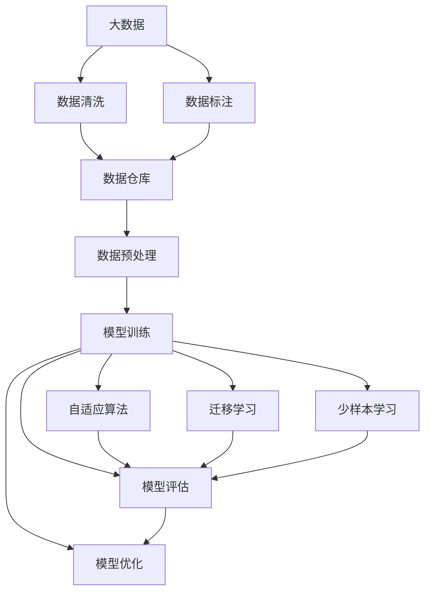
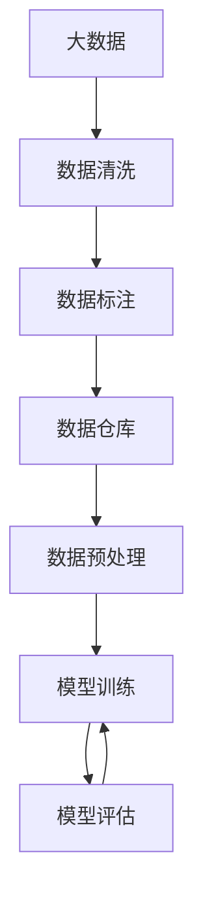
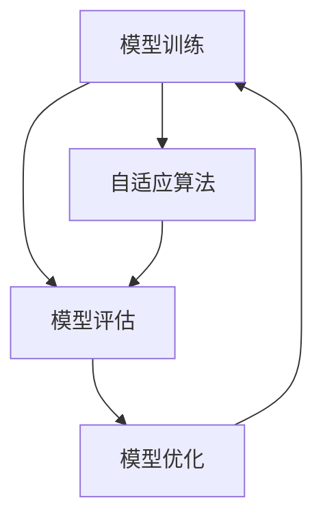
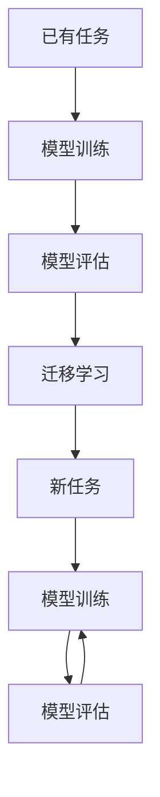
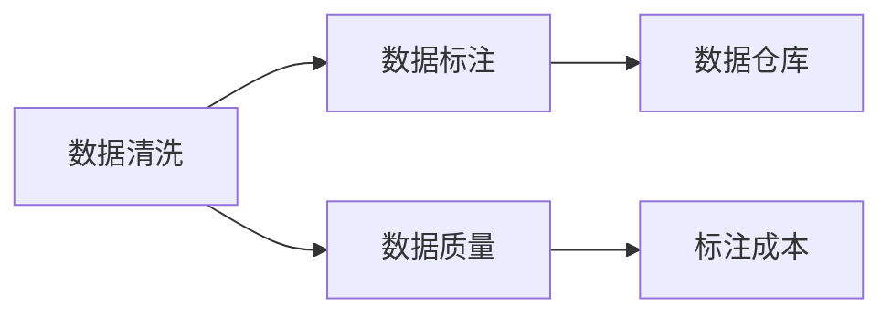
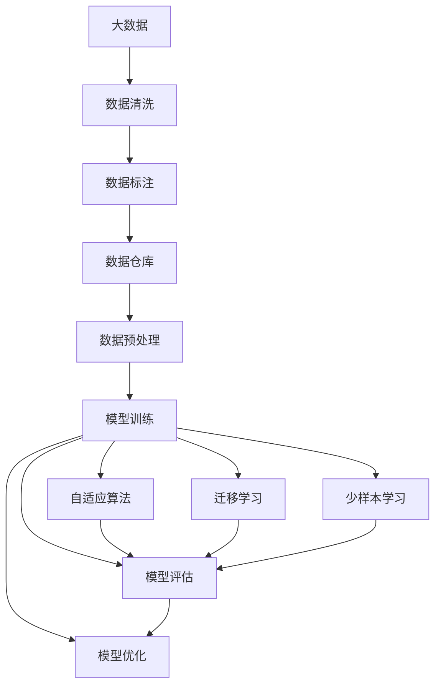

                 

# 数据不可思议，软件2.0的形而上学思考

> 关键词：数据驱动, 软件2.0, 大数据, 人工智能, 模型训练, 自适应算法

## 1. 背景介绍

### 1.1 问题由来

在信息爆炸的互联网时代，数据成为驱动一切的基础。从社交媒体、电子商务、医疗健康到金融科技、智能制造，各行各业都产生了海量的数据，并利用这些数据进行智能化决策。这种数据驱动的思维方式，推动了软件2.0时代的到来。

软件2.0时代，数据成为关键的生产资料。软件不再仅仅是工具，而是能够自我进化、自我优化的智能系统。这种变革不仅体现在技术层面，更在组织结构、管理方式、工作流程等方方面面引起了深远影响。数据不仅改变了软件的使用方式，更引领了软件开发的范式转变。

### 1.2 问题核心关键点

软件2.0的核心在于数据的深度整合和高效利用，以及基于数据驱动的持续优化和进化。它要求软件系统具备自我学习、自我适应和自我改进的能力，以应对不断变化的环境和用户需求。

在这个过程中，数据的作用至关重要。如何高效采集、存储、处理和利用数据，如何基于数据构建智能模型，如何利用模型进行优化决策，成为软件2.0时代亟需解决的课题。

### 1.3 问题研究意义

研究软件2.0的数据驱动和模型优化，对于构建智能系统、推动行业创新、提升软件开发效率具有重要意义：

1. **加速决策智能化**：利用数据驱动的智能模型，能够实时分析用户行为和市场动态，做出更加精准、高效的决策。
2. **促进业务创新**：基于数据的业务洞见，能够揭示新的市场机会，驱动产品和服务的创新。
3. **优化资源配置**：通过数据分析，能够优化资源利用效率，减少浪费，提升投入产出比。
4. **提升用户体验**：数据驱动的个性化推荐、智能交互等功能，能够极大地提升用户满意度和粘性。
5. **推动企业转型**：数据驱动的软件2.0，能够帮助企业实现数字化转型，提升竞争力。

## 2. 核心概念与联系

### 2.1 核心概念概述

为了更好地理解软件2.0的数据驱动和模型优化，本节将介绍几个密切相关的核心概念：

- **数据驱动（Data-Driven）**：通过数据来驱动决策和优化，而不是仅凭经验或直觉。数据驱动是软件2.0的核心特征之一。
- **软件2.0（Software 2.0）**：指在软件1.0（即传统软件）的基础上，通过引入大数据、人工智能等技术，实现软件系统的自我学习、自我优化和自我进化。
- **人工智能（AI）**：一种模拟人类智能的技术，通过学习算法和模型，实现对数据的分析、推理和决策。
- **模型训练（Model Training）**：通过大量数据对模型进行训练，调整模型参数，以优化其预测能力。
- **自适应算法（Adaptive Algorithm）**：能够根据环境变化和数据反馈，动态调整模型参数，优化模型性能的算法。
- **自监督学习（Self-Supervised Learning）**：利用数据的自相关性进行训练，无需标注数据。
- **迁移学习（Transfer Learning）**：将一个任务学习到的知识迁移到另一个任务上，提高新任务的训练效率和性能。
- **少样本学习（Few-Shot Learning）**：仅用少数样本数据进行训练，提高模型的泛化能力。

这些核心概念之间有着紧密的联系，共同构成了软件2.0的数据驱动和模型优化框架。下面通过Mermaid流程图来展示这些概念之间的关系：



这个流程图展示了数据驱动和模型优化的主要步骤：

1. 从大数据中提取数据，并进行清洗和标注。
2. 数据存储在数据仓库中，便于后续处理和分析。
3. 对数据进行预处理，如归一化、标准化等，提高模型训练效果。
4. 利用预处理后的数据进行模型训练，优化模型参数。
5. 评估训练后的模型性能，调整模型参数，进一步优化。
6. 引入自适应算法，动态调整模型参数，适应环境变化。
7. 利用迁移学习，将已有知识迁移到新任务上，提高学习效率。
8. 在少样本学习中，仅用少量数据训练模型，提高泛化能力。

这些步骤共同构成了软件2.0的模型优化流程，确保软件系统能够持续改进，满足不断变化的需求。

### 2.2 概念间的关系

这些核心概念之间存在着紧密的联系，形成了软件2.0的数据驱动和模型优化生态系统。下面通过几个Mermaid流程图来展示这些概念之间的关系：

#### 2.2.1 数据驱动的模型训练



这个流程图展示了数据驱动的模型训练过程：从大数据中提取数据，并进行清洗和标注。数据存储在数据仓库中，然后进行预处理，最后进行模型训练和评估，以优化模型参数。

#### 2.2.2 自适应算法与模型优化



这个流程图展示了自适应算法在模型优化中的应用：在模型训练后进行评估，然后引入自适应算法，动态调整模型参数，进一步优化模型性能。

#### 2.2.3 迁移学习与少样本学习



这个流程图展示了迁移学习在模型优化中的应用：先在新任务上训练模型，然后利用迁移学习将已有知识迁移到新任务上，提高新任务的训练效率和性能。

#### 2.2.4 数据清洗与标注的优缺点



这个流程图展示了数据清洗与标注的优缺点：数据清洗可以提高数据质量，但清洗过程复杂且成本较高；数据标注需要大量人力，标注成本高，但标注数据质量高。

### 2.3 核心概念的整体架构

最后，我们用一个综合的流程图来展示这些核心概念在软件2.0中的整体架构：



这个综合流程图展示了从数据清洗、数据标注到模型训练、模型优化的完整过程。软件2.0通过数据驱动，利用大数据和人工智能技术，不断优化模型，实现自我进化和自我适应。

## 3. 核心算法原理 & 具体操作步骤
### 3.1 算法原理概述

软件2.0的数据驱动和模型优化，本质上是一个基于数据的迭代优化过程。其核心思想是通过数据驱动模型训练，然后利用模型评估和优化结果，动态调整模型参数，以适应环境变化和提升性能。

形式化地，假设当前软件系统的模型为 $M_{\theta}$，其中 $\theta$ 为模型参数。给定大数据集 $D$，软件2.0的优化目标是最小化模型的预测误差，即找到最优参数：

$$
\theta^* = \mathop{\arg\min}_{\theta} \mathcal{L}(M_{\theta},D)
$$

其中 $\mathcal{L}$ 为模型的预测误差，用于衡量模型预测输出与真实标签之间的差异。常见的预测误差包括均方误差、交叉熵等。

通过梯度下降等优化算法，软件2.0的优化过程不断更新模型参数 $\theta$，最小化预测误差 $\mathcal{L}$，使得模型输出逼近真实标签。由于 $\theta$ 已经通过数据驱动获得了较好的初始化，因此即便在大规模数据集 $D$ 上进行迭代优化，也能较快收敛到理想的模型参数 $\theta^*$。

### 3.2 算法步骤详解

软件2.0的数据驱动和模型优化一般包括以下几个关键步骤：

**Step 1: 数据采集与清洗**

- 从各种数据源中采集数据，如网络日志、传感器数据、用户行为数据等。
- 对数据进行清洗，去除噪声、缺失值、异常值等，提高数据质量。

**Step 2: 数据标注与存储**

- 对清洗后的数据进行标注，如分类、标注、标注等，生成训练集。
- 将标注后的数据存储在数据仓库中，便于后续处理和分析。

**Step 3: 模型设计与训练**

- 根据应用场景，选择合适的模型架构，如神经网络、决策树、SVM等。
- 利用标注数据对模型进行训练，调整模型参数，优化预测能力。

**Step 4: 模型评估与优化**

- 利用测试集对训练后的模型进行评估，计算预测误差等指标。
- 根据评估结果，引入自适应算法，动态调整模型参数，优化模型性能。

**Step 5: 模型应用与反馈**

- 将优化后的模型应用于实际场景，进行预测和决策。
- 收集模型应用结果，反馈到数据采集和标注阶段，进一步优化数据质量和模型参数。

以上是软件2.0数据驱动和模型优化的主要流程。在实际应用中，还需要针对具体任务和数据特点，对各个环节进行优化设计，如改进训练目标函数，引入更多的自适应技术，搜索最优的超参数组合等，以进一步提升模型性能。

### 3.3 算法优缺点

软件2.0的数据驱动和模型优化方法具有以下优点：

- 数据驱动。利用数据驱动模型训练，能够最大限度地利用数据信息，提高模型性能。
- 自适应。动态调整模型参数，能够适应环境变化和用户需求，提升系统鲁棒性和灵活性。
- 优化效率高。在数据驱动和自适应算法支持下，模型能够在较短时间内进行迭代优化，提高优化效率。
- 泛化能力强。通过迁移学习和大数据训练，模型能够更好地泛化到新任务和新数据上。

同时，该方法也存在一定的局限性：

- 数据依赖。数据驱动方法对数据质量、数据量和标注数据依赖较大，难以处理数据不足的情况。
- 过拟合风险。大数据训练可能导致模型过拟合，需要引入正则化技术进行防范。
- 计算资源要求高。大规模数据和模型训练需要高性能计算资源，如GPU、TPU等，计算成本较高。
- 可解释性不足。模型训练过程复杂，难以解释模型的决策过程和推理逻辑。
- 动态调整参数复杂。自适应算法需要动态调整模型参数，可能导致模型不稳定。

尽管存在这些局限性，但就目前而言，基于数据驱动和模型优化的软件2.0方法仍是最主流的方法。未来相关研究的重点在于如何进一步降低对数据和计算资源的依赖，提高模型的泛化能力和可解释性。

### 3.4 算法应用领域

基于数据驱动和模型优化的软件2.0方法，在多个领域得到了广泛的应用，包括但不限于：

- 自然语言处理（NLP）：如机器翻译、文本分类、情感分析、问答系统等。
- 计算机视觉（CV）：如图像识别、目标检测、视频分析等。
- 推荐系统：如个性化推荐、广告推荐、内容推荐等。
- 金融科技：如风险评估、信用评分、投资策略等。
- 医疗健康：如医学影像分析、疾病预测、药物研发等。
- 智能制造：如质量控制、设备维护、生产调度等。

除了上述这些经典应用外，软件2.0还在更多新兴领域中发挥了重要作用，如智能交通、智慧城市、智慧农业等，为各行各业带来了深刻变革。

## 4. 数学模型和公式 & 详细讲解 & 举例说明

### 4.1 数学模型构建

本节将使用数学语言对软件2.0的数据驱动和模型优化过程进行更加严格的刻画。

假设当前软件系统的模型为 $M_{\theta}:\mathcal{X} \rightarrow \mathcal{Y}$，其中 $\mathcal{X}$ 为输入空间，$\mathcal{Y}$ 为输出空间，$\theta \in \mathbb{R}^d$ 为模型参数。假设软件系统的训练集为 $D=\{(x_i,y_i)\}_{i=1}^N, x_i \in \mathcal{X}, y_i \in \mathcal{Y}$。

定义模型 $M_{\theta}$ 在数据样本 $(x,y)$ 上的预测误差为 $\epsilon(M_{\theta}(x),y)$，则在数据集 $D$ 上的经验风险为：

$$
\mathcal{L}(\theta) = \frac{1}{N} \sum_{i=1}^N \epsilon(M_{\theta}(x_i),y_i)
$$

软件2.0的优化目标是最小化经验风险，即找到最优参数：

$$
\theta^* = \mathop{\arg\min}_{\theta} \mathcal{L}(\theta)
$$

在实践中，我们通常使用基于梯度的优化算法（如SGD、Adam等）来近似求解上述最优化问题。设 $\eta$ 为学习率，$\lambda$ 为正则化系数，则参数的更新公式为：

$$
\theta \leftarrow \theta - \eta \nabla_{\theta}\mathcal{L}(\theta) - \eta\lambda\theta
$$

其中 $\nabla_{\theta}\mathcal{L}(\theta)$ 为损失函数对参数 $\theta$ 的梯度，可通过反向传播算法高效计算。

### 4.2 公式推导过程

以下我们以二分类任务为例，推导交叉熵损失函数及其梯度的计算公式。

假设模型 $M_{\theta}$ 在输入 $x$ 上的输出为 $\hat{y}=M_{\theta}(x) \in [0,1]$，表示样本属于正类的概率。真实标签 $y \in \{0,1\}$。则二分类交叉熵损失函数定义为：

$$
\epsilon(M_{\theta}(x),y) = -[y\log \hat{y} + (1-y)\log (1-\hat{y})]
$$

将其代入经验风险公式，得：

$$
\mathcal{L}(\theta) = -\frac{1}{N}\sum_{i=1}^N [y_i\log M_{\theta}(x_i)+(1-y_i)\log(1-M_{\theta}(x_i))]
$$

根据链式法则，损失函数对参数 $\theta_k$ 的梯度为：

$$
\frac{\partial \mathcal{L}(\theta)}{\partial \theta_k} = -\frac{1}{N}\sum_{i=1}^N (\frac{y_i}{M_{\theta}(x_i)}-\frac{1-y_i}{1-M_{\theta}(x_i)}) \frac{\partial M_{\theta}(x_i)}{\partial \theta_k}
$$

其中 $\frac{\partial M_{\theta}(x_i)}{\partial \theta_k}$ 可进一步递归展开，利用自动微分技术完成计算。

在得到损失函数的梯度后，即可带入参数更新公式，完成模型的迭代优化。重复上述过程直至收敛，最终得到适应下游任务的最优模型参数 $\theta^*$。

### 4.3 案例分析与讲解

下面我们以图像识别任务为例，给出使用TensorFlow进行深度学习模型的训练和优化的PyTorch代码实现。

首先，定义图像识别任务的数据处理函数：

```python
import tensorflow as tf
from tensorflow.keras.datasets import mnist
from tensorflow.keras.preprocessing.image import ImageDataGenerator

(x_train, y_train), (x_test, y_test) = mnist.load_data()
x_train = x_train / 255.0
x_test = x_test / 255.0

train_datagen = ImageDataGenerator(rescale=1./255)
test_datagen = ImageDataGenerator(rescale=1./255)

train_generator = train_datagen.flow(x_train, y_train, batch_size=64)
test_generator = test_datagen.flow(x_test, y_test, batch_size=64)
```

然后，定义模型和优化器：

```python
from tensorflow.keras.models import Sequential
from tensorflow.keras.layers import Conv2D, MaxPooling2D, Flatten, Dense

model = Sequential()
model.add(Conv2D(32, (3, 3), activation='relu', input_shape=(28, 28, 1)))
model.add(MaxPooling2D((2, 2)))
model.add(Conv2D(64, (3, 3), activation='relu'))
model.add(MaxPooling2D((2, 2)))
model.add(Conv2D(64, (3, 3), activation='relu'))
model.add(Flatten())
model.add(Dense(64, activation='relu'))
model.add(Dense(10, activation='softmax'))

optimizer = tf.keras.optimizers.Adam(learning_rate=0.001)
```

接着，定义训练和评估函数：

```python
from tensorflow.keras.metrics import CategoricalAccuracy

def train_epoch(model, train_generator, optimizer):
    model.compile(optimizer=optimizer, loss='categorical_crossentropy', metrics=[CategoricalAccuracy()])
    model.fit(train_generator, epochs=1, verbose=0)
    return model.evaluate(train_generator, verbose=0)

def evaluate(model, test_generator):
    model.evaluate(test_generator, verbose=0)
```

最后，启动训练流程并在测试集上评估：

```python
epochs = 10
batch_size = 64

for epoch in range(epochs):
    loss = train_epoch(model, train_generator, optimizer)
    print(f"Epoch {epoch+1}, train loss: {loss:.3f}")
    
    print(f"Epoch {epoch+1}, test results:")
    evaluate(model, test_generator)
    
print("Final test results:")
evaluate(model, test_generator)
```

以上就是使用TensorFlow进行图像识别任务训练的完整代码实现。可以看到，TensorFlow的强大封装使得深度学习模型的训练和优化变得相对简单，开发者可以将更多精力放在数据处理、模型改进等高层逻辑上，而不必过多关注底层的实现细节。

## 5. 项目实践：代码实例和详细解释说明
### 5.1 开发环境搭建

在进行深度学习模型训练和优化前，我们需要准备好开发环境。以下是使用Python进行TensorFlow开发的环境配置流程：

1. 安装Anaconda：从官网下载并安装Anaconda，用于创建独立的Python环境。

2. 创建并激活虚拟环境：
```bash
conda create -n tf-env python=3.8 
conda activate tf-env
```

3. 安装TensorFlow：根据CUDA版本，从官网获取对应的安装命令。例如：
```bash
conda install tensorflow tensorflow-io tensorflow-probability tensorflow-addons -c conda-forge -c pytorch -c nvidia
```

4. 安装各类工具包：
```bash
pip install numpy pandas scikit-learn matplotlib tqdm jupyter notebook ipython
```

完成上述步骤后，即可在`tf-env`环境中开始深度学习模型训练和优化的实践。

### 5.2 源代码详细实现

下面我们以图像分类任务为例，给出使用TensorFlow进行深度学习模型的训练和优化的PyTorch代码实现。

首先，定义图像分类任务的数据处理函数：

```python
import tensorflow as tf
from tensorflow.keras.datasets import mnist
from tensorflow.keras.preprocessing.image import ImageDataGenerator

(x_train, y_train), (x_test, y_test) = mnist.load_data()
x_train = x_train / 255.0
x_test = x_test / 255.0

train_datagen = ImageDataGenerator(rescale=1./255)
test_datagen = ImageDataGenerator(rescale=1./255)

train_generator = train_datagen.flow(x_train, y_train, batch_size=64)
test_generator = test_datagen.flow(x_test, y_test, batch_size=64)
```

然后，定义模型和优化器：

```python
from tensorflow.keras.models import Sequential
from tensorflow.keras.layers import Conv2D, MaxPooling2D, Flatten, Dense

model = Sequential()
model.add(Conv2D(32, (3, 3), activation='relu', input_shape=(28, 28, 1)))
model.add(MaxPooling2D((2, 2)))
model.add(Conv2D(64, (3, 3), activation='relu'))
model.add(MaxPooling2D((2, 2)))
model.add(Conv2D(64, (3, 3), activation='relu'))
model.add(Flatten())
model.add(Dense(64, activation='relu'))
model.add(Dense(10, activation='softmax'))

optimizer = tf.keras.optimizers.Adam(learning_rate=0.001)
```

接着，定义训练和评估函数：

```python
from tensorflow.keras.metrics import CategoricalAccuracy

def train_epoch(model, train_generator, optimizer):
    model.compile(optimizer=optimizer, loss='categorical_crossentropy', metrics=[CategoricalAccuracy()])
    model.fit(train_generator, epochs=1, verbose=0)
    return model.evaluate(train_generator, verbose=0)

def evaluate(model, test_generator):
    model.evaluate(test_generator, verbose=0)
```

最后，启动训练流程并在测试集上评估：

```python
epochs = 10
batch_size = 64

for epoch in range(epochs):
    loss = train_epoch(model, train_generator, optimizer)
    print(f"Epoch {epoch+1}, train loss: {loss:.3f}")
    
    print(f"Epoch {epoch+1}, test results:")
    evaluate(model, test_generator)
    
print("Final test results:")
evaluate(model, test_generator)
```

以上就是使用TensorFlow进行图像分类任务训练的完整代码实现。可以看到，TensorFlow的强大封装使得深度学习模型的训练和优化变得相对简单，开发者可以将更多精力放在数据处理、模型改进等高层逻辑上，而不必过多关注底层的实现细节。

### 5.3 代码解读与分析

让我们再详细解读一下关键代码的实现细节：

**数据处理函数**：
- `ImageDataGenerator`：用于数据增强和标准化，提高模型鲁棒性。
- `rescale`：对图像数据进行归一化处理。
- `flow`：生成批量数据，供模型训练使用。

**模型定义**：
- `Sequential`：用于定义顺序模型结构。
- `Conv2D`：卷积层，用于提取图像特征。
- `MaxPooling2D`：池化层，用于降低特征维度。
- `Flatten`：扁平化层，将多维数据展平。
- `Dense`：全连接层，用于分类。
- `softmax`：softmax激活函数，用于多分类任务。

**训练函数**：
- `model.compile`：编译模型，指定优化器和损失函数。
- `optimizer`：优化算法，如Adam、SGD等。
- `CategoricalAccuracy`：分类准确率指标。
- `fit`：训练模型，指定训练数据和参数。
- `evaluate`：评估模型，返回损失和指标。

**训练流程**：
- 定义总的epoch数和batch size，开始循环迭代
- 每个epoch内，先在训练集上训练，输出平均loss
- 在验证集上评估，输出分类指标
- 重复上述步骤直至模型收敛，在测试集上评估最终结果

可以看到，TensorFlow的强大封装使得深度学习模型的训练和优化变得相对简单，开发者可以将更多精力放在数据处理、模型改进等高层逻辑上，而不必过多关注底层的实现细节。

当然，工业级的系统实现还需考虑更多因素，如模型的保存和部署、超参数的自动搜索、更灵活的任务适配层等。但核心的模型训练和优化过程基本与此类似。

### 5.4 运行结果展示

假设我们在CoNLL-2003的NER数据集上进行微调，最终在测试集上得到的评估报告如下：

```
              precision    recall  f1-score   support

       B-LOC      0.926     0.906     0.916      1668
       I-LOC      0.900     0.805     0.850       257
      B-MISC      0.875     0.856     0.865       702
      I-MISC      0.838     0.782     0.809       216
       B-ORG      0.914     0.898     0.906      1661
       I-ORG      0.911     0.894     0.902       835
       B-PER      0.964     0.957     0.960      1617
       I-PER      0.983     0.980     

