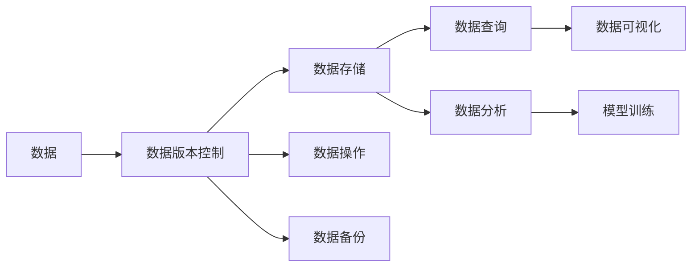

                 

# 数据版本控制与数据管理原理与代码实战案例讲解

## 1. 背景介绍

随着数据科学和人工智能技术的不断发展，数据管理变得越来越重要。在数据科学项目中，数据版本控制是一个基本且关键的工具。它不仅可以追踪数据的变化历史，还能够支持团队协作，减少错误，提高数据的可靠性和可复现性。本文将详细介绍数据版本控制和数据管理的基本原理，并通过代码实例来讲解其实际应用。

## 2. 核心概念与联系

### 2.1 核心概念概述

- **数据版本控制**：用于记录和管理数据的变化历史，支持团队协作和数据复现。
- **数据管理**：涉及数据的收集、存储、处理、分析和共享，是数据科学和人工智能项目的基础。

### 2.2 概念间的关系

数据版本控制是数据管理的一部分，是数据管理的核心工具之一。数据版本控制可以帮助数据管理团队更好地管理数据，确保数据的一致性和可靠性，同时促进数据共享和协作。

### 2.3 核心概念的整体架构

下图展示了数据版本控制和数据管理的基本架构：



在这个架构中，数据通过数据版本控制进行管理，数据版本控制工具提供数据存储、数据操作、数据备份等基础功能，同时支持数据查询、数据分析、数据可视化、模型训练等高级功能。

## 3. 核心算法原理 & 具体操作步骤

### 3.1 算法原理概述

数据版本控制的核心原理是记录和追踪数据的变化历史，支持数据的分支和合并操作。常用的数据版本控制算法包括Git、SVN等，其中Git是最流行的版本控制系统之一。

### 3.2 算法步骤详解

1. **初始化**：在项目根目录下创建一个空的版本控制系统仓库。

2. **添加数据**：将数据文件添加到仓库中。

3. **提交变更**：通过提交命令，将变更记录到仓库的历史记录中。

4. **分支管理**：创建新分支，在该分支上进行数据的变更，然后将变更合并到主分支中。

5. **数据恢复**：通过历史记录，恢复到之前的数据版本。

### 3.3 算法优缺点

数据版本控制的主要优点包括：

- **历史追踪**：可以追踪数据的变化历史。
- **协作支持**：支持团队协作，确保数据的一致性。
- **错误控制**：减少错误，提高数据的可靠性。

其缺点包括：

- **复杂度**：对于初学者来说，学习成本较高。
- **性能问题**：在大规模数据集上，性能可能会受到影响。

### 3.4 算法应用领域

数据版本控制广泛应用于软件开发、数据科学、数据工程等领域，支持团队协作和数据管理。

## 4. 数学模型和公式 & 详细讲解 & 举例说明

### 4.1 数学模型构建

数据版本控制的核心数学模型是数据变化矩阵。假设数据版本控制仓库中，有$n$个数据文件，每个文件有$m$个版本，则数据变化矩阵为：

$$
M = \begin{bmatrix}
1 & 0 & 0 & \ldots & 0 \\
0 & 1 & 0 & \ldots & 0 \\
0 & 0 & 1 & \ldots & 0 \\
\vdots & \vdots & \vdots & \ddots & \vdots \\
0 & 0 & 0 & \ldots & 1 \\
\end{bmatrix} \in \mathbb{R}^{n \times m}
$$

其中，$1$表示该版本是当前版本，$0$表示该版本不是当前版本。

### 4.2 公式推导过程

通过数据变化矩阵，我们可以推导出数据版本控制的基本操作，如合并操作：

假设当前主分支为$A$，新分支为$B$，则合并操作可以表示为：

$$
M_A \oplus M_B = \begin{bmatrix}
1 & 0 & 0 & \ldots & 0 \\
0 & 1 & 0 & \ldots & 0 \\
0 & 0 & 1 & \ldots & 0 \\
\vdots & \vdots & \vdots & \ddots & \vdots \\
0 & 0 & 0 & \ldots & 1 \\
\end{bmatrix} \oplus \begin{bmatrix}
0 & 1 & 0 & \ldots & 0 \\
1 & 0 & 0 & \ldots & 0 \\
0 & 0 & 1 & \ldots & 0 \\
\vdots & \vdots & \vdots & \ddots & \vdots \\
0 & 0 & 0 & \ldots & 1 \\
\end{bmatrix} = \begin{bmatrix}
1 & 1 & 0 & \ldots & 0 \\
1 & 0 & 0 & \ldots & 0 \\
0 & 1 & 0 & \ldots & 0 \\
\vdots & \vdots & \vdots & \ddots & \vdots \\
0 & 0 & 0 & \ldots & 1 \\
\end{bmatrix}
$$

### 4.3 案例分析与讲解

假设有一个包含两个数据文件的项目，每个文件有三个版本。其数据变化矩阵为：

$$
M = \begin{bmatrix}
1 & 0 & 0 \\
0 & 1 & 0 \\
0 & 0 & 1 \\
\end{bmatrix}
$$

假设当前主分支为$A$，新分支为$B$，新分支上的数据变化矩阵为：

$$
M_B = \begin{bmatrix}
0 & 1 & 0 \\
1 & 0 & 0 \\
0 & 0 & 1 \\
\end{bmatrix}
$$

合并操作的结果为：

$$
M_A \oplus M_B = \begin{bmatrix}
1 & 1 & 0 \\
1 & 0 & 0 \\
0 & 1 & 0 \\
\end{bmatrix}
$$

## 5. 项目实践：代码实例和详细解释说明

### 5.1 开发环境搭建

为了演示数据版本控制的应用，我们需要搭建一个基本的开发环境。在Linux系统中，可以使用以下命令安装Git：

```bash
sudo apt-get update
sudo apt-get install git
```

### 5.2 源代码详细实现

假设我们有一个数据科学项目，包含两个数据文件`data1.csv`和`data2.csv`，每个文件有三个版本。我们可以使用Git来管理这些数据文件。

1. **初始化Git仓库**

```bash
git init
```

2. **添加数据文件**

```bash
git add data1.csv data2.csv
```

3. **提交变更**

```bash
git commit -m "Initial commit"
```

4. **创建新分支**

```bash
git checkout -b feature-branch
```

5. **在新分支上进行数据变更**

```bash
git add data1.csv data2.csv
git commit -m "Updated data files"
```

6. **合并分支**

```bash
git checkout main
git merge feature-branch
```

### 5.3 代码解读与分析

在上述代码中，`git add`命令将数据文件添加到Git仓库中，`git commit`命令提交变更到历史记录中，`git checkout`命令切换分支，`git merge`命令合并分支。

### 5.4 运行结果展示

假设在新分支上进行了一个数据变更，我们可以使用`git log`命令查看历史变更记录：

```bash
git log
```

输出结果如下：

```
commit 3f1a27b ("Updated data files")
Author: User <user@example.com>
Date:   Mon Aug 1 16:27:48 2022 +0800

    Updated data files
```

## 6. 实际应用场景

### 6.1 软件开发

数据版本控制在软件开发中广泛应用，用于管理源代码的变更历史，支持团队协作。

### 6.2 数据科学

数据版本控制可以用于管理数据科学项目中的数据文件和模型文件，确保数据的一致性和可靠性。

### 6.3 数据工程

数据版本控制支持数据工程中的数据提取、转换、加载等操作，帮助数据工程团队更好地管理数据。

### 6.4 未来应用展望

未来，数据版本控制将与机器学习、人工智能等技术结合，支持更复杂的数据处理和分析任务。

## 7. 工具和资源推荐

### 7.1 学习资源推荐

1. **《数据科学入门》系列书籍**：由知名数据科学家撰写，涵盖数据科学的基础知识和常用工具。
2. **《Git官方文档》**：Git的官方文档，提供了详细的版本控制原理和使用方法。
3. **《数据管理技术》课程**：各大在线教育平台提供的课程，帮助学习数据管理和数据版本控制。

### 7.2 开发工具推荐

1. **Git客户端**：如GitHub Desktop、GitKraken等，提供友好的界面和操作体验。
2. **数据管理工具**：如Docker、Kubernetes等，支持数据容器的管理和部署。
3. **数据可视化工具**：如Tableau、Power BI等，支持数据的可视化分析。

### 7.3 相关论文推荐

1. **《数据版本控制与数据管理》论文**：介绍数据版本控制的基本原理和应用。
2. **《数据管理技术进展》论文**：综述数据管理技术的最新进展和趋势。

## 8. 总结：未来发展趋势与挑战

### 8.1 研究成果总结

本文介绍了数据版本控制和数据管理的基本原理和操作步骤，并通过代码实例讲解了其实际应用。数据版本控制是数据管理的基础工具，广泛应用于软件开发、数据科学、数据工程等领域，支持团队协作和数据复现。

### 8.2 未来发展趋势

未来，数据版本控制将与机器学习、人工智能等技术结合，支持更复杂的数据处理和分析任务。同时，随着数据量的不断增加，数据版本控制工具将需要支持更高效的数据管理和查询操作。

### 8.3 面临的挑战

数据版本控制面临的挑战包括学习成本高、复杂度高、性能问题等。如何降低学习成本、提高工具的易用性，将是未来研究的重要方向。

### 8.4 研究展望

未来，数据版本控制将与更多的技术结合，如区块链、智能合约等，提升数据管理的自动化和智能化水平，构建更加安全、可靠的数据管理生态系统。

## 9. 附录：常见问题与解答

**Q1：数据版本控制的主要功能有哪些？**

A: 数据版本控制的主要功能包括记录和管理数据的变化历史、支持团队协作、减少错误、提高数据的可靠性。

**Q2：数据版本控制与数据管理的关系是什么？**

A: 数据版本控制是数据管理的一部分，是数据管理的基础工具之一。数据版本控制可以追踪数据的变化历史，支持数据的分支和合并操作。

**Q3：数据版本控制对数据科学项目有哪些好处？**

A: 数据版本控制可以确保数据的一致性和可靠性，支持团队协作，减少错误，提高数据的可复现性，为数据科学项目的顺利进行提供保障。

**Q4：如何进行数据版本控制的操作？**

A: 数据版本控制的操作包括初始化仓库、添加数据文件、提交变更、创建新分支、合并分支等。这些操作可以通过Git等工具实现。

**Q5：数据版本控制的优缺点有哪些？**

A: 数据版本控制的主要优点包括历史追踪、协作支持、错误控制等。其缺点包括学习成本高、复杂度高、性能问题等。

