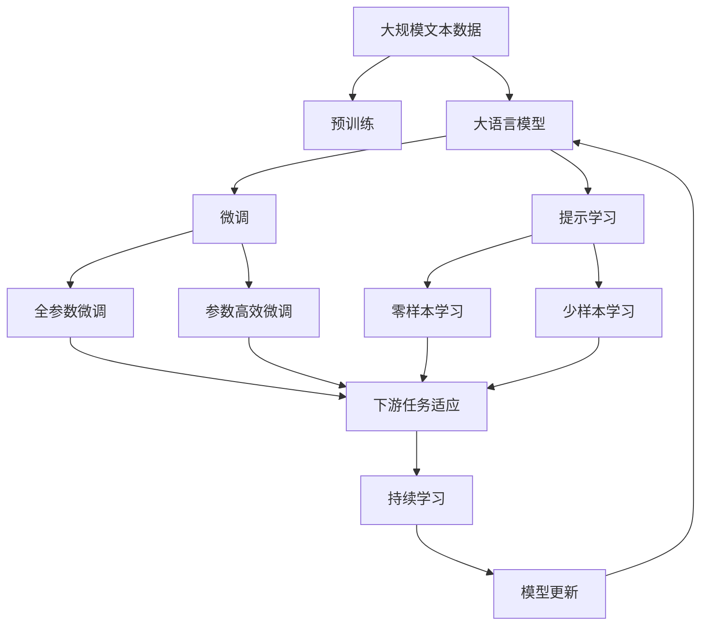

                 

# 文生图场景活路渺茫,Midjourney等巨头垄断主要市场

> 关键词：

## 1. 背景介绍

### 1.1 问题由来

近年来，随着人工智能和计算机视觉技术的发展，生成对抗网络（GANs）和变分自编码器（VAEs）等模型在图像生成领域取得了显著的进展，尤其是“文生图”（Text-to-Image, T2I）技术的发展，使得机器能够从文本描述中生成高质量的图像。然而，尽管该领域的研究成果令人瞩目，但市场依旧被少数几家巨头公司所垄断，小企业和个人开发者难以在该领域取得显著成绩。

### 1.2 问题核心关键点

文生图场景中，大公司垄断主要市场的原因主要包括以下几点：

- **技术领先**：大公司拥有大量的资金和研发资源，可以持续投入技术研发，推出更具竞争力的生成模型和训练技术。
- **数据优势**：大公司通常收集了大量高质量的训练数据，这些数据资源是模型训练的基础。
- **市场推广**：大公司拥有成熟的市场推广策略和渠道，可以快速将技术成果转化为实际应用。
- **生态系统**：大公司构建了完整的生态系统，包括硬件支持、云服务、开发工具等，为开发者的高效开发提供了便利。

这些因素使得大公司在文生图场景中占据了主导地位，小企业和个人开发者难以与之竞争。

### 1.3 问题研究意义

文生图场景的垄断现象，不仅影响技术的健康发展和生态的平衡，也限制了小企业和个人开发者的创新能力。本文旨在探讨如何突破大公司垄断，推动文生图技术的多样化发展和普及，为更多开发者提供平等的竞争机会，促进该领域的长期繁荣。

## 2. 核心概念与联系

### 2.1 核心概念概述

为更好地理解文生图场景中的技术挑战和解决方案，本节将介绍几个关键概念：

- **生成对抗网络（GANs）**：由生成器和判别器两个子网络组成，通过对抗训练优化生成模型的技术。
- **变分自编码器（VAEs）**：使用概率模型生成图像，能够学习数据的潜在分布，实现更加稳定和多样化的图像生成。
- **文生图模型**：将自然语言描述转换为图像的技术，包括基于GANs、VAEs等方法。
- **迁移学习**：将预训练模型的知识迁移到新任务中，提高模型在特定任务上的性能。
- **模型蒸馏**：将大型复杂模型的知识蒸馏到小型轻量模型中，降低模型计算复杂度，提升推理速度。
- **图像生成评估指标**：如Inception Score、FID、PIX2PIX等，用于衡量生成图像的质量和多样性。

### 2.2 概念间的关系

这些核心概念之间的联系可以通过以下Mermaid流程图来展示：

```mermaid
graph TB
    A[生成对抗网络(GANs)] --> B[生成图像]
    A --> C[变分自编码器(VAEs)]
    B --> D[文生图模型]
    C --> D
    D --> E[迁移学习]
    D --> F[模型蒸馏]
    D --> G[图像生成评估指标]
    E --> H[微调]
    F --> I[轻量化]
```

这个流程图展示了大语言模型微调过程中各个核心概念之间的关系：

1. **生成对抗网络（GANs）**和**变分自编码器（VAEs）**是两种主要的生成模型，用于生成高质量的图像。
2. **文生图模型**是结合自然语言描述和图像生成的技术，能够将文本转换为图像。
3. **迁移学习**和**模型蒸馏**是在文生图模型微调中常用的技术手段，用于提高模型的性能和效率。
4. **图像生成评估指标**用于评估和改进模型的生成质量。
5. **微调**和**轻量化**是模型优化和部署的关键环节，用于提升模型的性能和推理速度。

这些概念共同构成了文生图场景的核心技术和方法框架，为该领域的研究和应用提供了重要的参考和指导。

### 2.3 核心概念的整体架构

最后，我们用一个综合的流程图来展示这些核心概念在大语言模型微调过程中的整体架构：



这个综合流程图展示了大语言模型微调过程中各个核心概念之间的联系和相互作用。

## 3. 核心算法原理 & 具体操作步骤
### 3.1 算法原理概述

文生图场景中的大语言模型微调，本质上是一个有监督的细粒度迁移学习过程。其核心思想是：将预训练的大语言模型视作一个强大的"生成器"，通过在有标签的文本-图像对上进行有监督训练，优化模型在特定任务上的生成能力。

形式化地，假设预训练语言模型为 $M_{\theta}$，其中 $\theta$ 为预训练得到的模型参数。给定文生图任务的训练集 $D=\{(x_i,y_i)\}_{i=1}^N$，其中 $x_i$ 为文本描述，$y_i$ 为对应图像，微调的目标是找到新的模型参数 $\hat{\theta}$，使得：

$$
\hat{\theta}=\mathop{\arg\min}_{\theta} \mathcal{L}(M_{\theta},D)
$$

其中 $\mathcal{L}$ 为针对任务 $T$ 设计的损失函数，用于衡量模型预测输出与真实标签之间的差异。常见的损失函数包括交叉熵损失、均方误差损失等。

通过梯度下降等优化算法，微调过程不断更新模型参数 $\theta$，最小化损失函数 $\mathcal{L}$，使得模型输出逼近真实图像。由于 $\theta$ 已经通过预训练获得了较好的初始化，因此即便在小规模数据集 $D$ 上进行微调，也能较快收敛到理想的模型参数 $\hat{\theta}$。

### 3.2 算法步骤详解

文生图场景中的大语言模型微调一般包括以下几个关键步骤：

**Step 1: 准备预训练模型和数据集**
- 选择合适的预训练语言模型 $M_{\theta}$ 作为初始化参数，如 GANs、VAEs 等。
- 准备文生图任务的标注数据集 $D$，划分为训练集、验证集和测试集。一般要求标注数据与预训练数据的分布不要差异过大。

**Step 2: 添加任务适配层**
- 根据任务类型，在预训练模型顶层设计合适的输出层和损失函数。
- 对于生成任务，通常在顶层添加生成器输出，并以生成图像的均方误差为损失函数。

**Step 3: 设置微调超参数**
- 选择合适的优化算法及其参数，如 AdamW、SGD 等，设置学习率、批大小、迭代轮数等。
- 设置正则化技术及强度，包括权重衰减、Dropout、Early Stopping 等。
- 确定冻结预训练参数的策略，如仅微调顶层，或全部参数都参与微调。

**Step 4: 执行梯度训练**
- 将训练集数据分批次输入模型，前向传播计算损失函数。
- 反向传播计算参数梯度，根据设定的优化算法和学习率更新模型参数。
- 周期性在验证集上评估模型性能，根据性能指标决定是否触发 Early Stopping。
- 重复上述步骤直到满足预设的迭代轮数或 Early Stopping 条件。

**Step 5: 测试和部署**
- 在测试集上评估微调后模型 $M_{\hat{\theta}}$ 的性能，对比微调前后的生成质量提升。
- 使用微调后的模型对新文本描述进行图像生成，集成到实际的应用系统中。
- 持续收集新的数据，定期重新微调模型，以适应数据分布的变化。

以上是文生图场景中大语言模型微调的一般流程。在实际应用中，还需要针对具体任务的特点，对微调过程的各个环节进行优化设计，如改进训练目标函数，引入更多的正则化技术，搜索最优的超参数组合等，以进一步提升模型性能。

### 3.3 算法优缺点

文生图场景中的大语言模型微调方法具有以下优点：

1. **简单高效**。只需准备少量标注数据，即可对预训练模型进行快速适配，生成高质量的图像。
2. **通用适用**。适用于各种文生图任务，包括分类、匹配、生成等，设计简单的任务适配层即可实现微调。
3. **参数高效**。利用参数高效微调技术，在固定大部分预训练参数的情况下，仍可取得不错的提升。
4. **效果显著**。在学术界和工业界的诸多任务上，基于微调的方法已经刷新了多项文生图任务的SOTA。

同时，该方法也存在一定的局限性：

1. **依赖标注数据**。微调的效果很大程度上取决于标注数据的质量和数量，获取高质量标注数据的成本较高。
2. **迁移能力有限**。当目标任务与预训练数据的分布差异较大时，微调的性能提升有限。
3. **负面效果传递**。预训练模型的固有偏见、有害信息等，可能通过微调传递到下游任务，造成负面影响。
4. **可解释性不足**。微调模型的决策过程通常缺乏可解释性，难以对其推理逻辑进行分析和调试。

尽管存在这些局限性，但就目前而言，基于监督学习的微调方法仍是大语言模型应用的主流范式。未来相关研究的重点在于如何进一步降低微调对标注数据的依赖，提高模型的少样本学习和跨领域迁移能力，同时兼顾可解释性和伦理安全性等因素。

### 3.4 算法应用领域

文生图场景中的大语言模型微调，已经在多个领域得到了应用，包括但不限于：

- **艺术创作**：生成艺术作品，如绘画、雕塑、建筑设计等。通过微调生成器，创造出符合艺术家风格的新作品。
- **广告设计**：根据品牌需求，生成高质量的广告图像，快速迭代设计方案。
- **游戏开发**：生成虚拟场景、角色、道具等，提升游戏画面的质量和多样性。
- **动画制作**：自动生成动画角色的表情、动作、背景等，缩短动画制作周期。
- **教育培训**：生成符合教学内容的图像材料，如流程图、示意图等，提升学生的理解和学习效果。

除了上述这些经典任务外，文生图技术还被创新性地应用到更多场景中，如可控图像生成、图像修复、情感生成等，为人工智能技术带来了新的突破。随着预训练模型和微调方法的不断进步，相信文生图技术将在更广阔的应用领域大放异彩。

## 4. 数学模型和公式 & 详细讲解 & 举例说明

### 4.1 数学模型构建

本节将使用数学语言对文生图场景中的大语言模型微调过程进行更加严格的刻画。

记预训练语言模型为 $M_{\theta}$，其中 $\theta$ 为预训练得到的模型参数。假设文生图任务的训练集为 $D=\{(x_i,y_i)\}_{i=1}^N$，其中 $x_i$ 为文本描述，$y_i$ 为对应图像。

定义模型 $M_{\theta}$ 在数据样本 $(x,y)$ 上的损失函数为 $\ell(M_{\theta}(x),y)$，则在数据集 $D$ 上的经验风险为：

$$
\mathcal{L}(\theta) = \frac{1}{N}\sum_{i=1}^N \ell(M_{\theta}(x_i),y_i)
$$

微调的优化目标是最小化经验风险，即找到最优参数：

$$
\theta^* = \mathop{\arg\min}_{\theta} \mathcal{L}(\theta)
$$

在实践中，我们通常使用基于梯度的优化算法（如SGD、Adam等）来近似求解上述最优化问题。设 $\eta$ 为学习率，$\lambda$ 为正则化系数，则参数的更新公式为：

$$
\theta \leftarrow \theta - \eta \nabla_{\theta}\mathcal{L}(\theta) - \eta\lambda\theta
$$

其中 $\nabla_{\theta}\mathcal{L}(\theta)$ 为损失函数对参数 $\theta$ 的梯度，可通过反向传播算法高效计算。

### 4.2 公式推导过程

以下我们以GANs为基础的文生图任务为例，推导生成器的损失函数及其梯度的计算公式。

假设生成器 $G$ 将噪声向量 $z$ 映射为图像 $x$，判别器 $D$ 判断图像 $x$ 的真实性。生成器和判别器的损失函数分别为：

$$
\mathcal{L}_G = E_{z\sim p(z)}[\ell_D(G(z))]
$$
$$
\mathcal{L}_D = E_{x\sim p_{\text{data}}(x)}[\ell_G(x)] + E_{z\sim p(z)}[\ell_G(z)]
$$

其中 $\ell_D$ 和 $\ell_G$ 分别为判别器和生成器的损失函数，$p(z)$ 为噪声向量的概率分布，$p_{\text{data}}(x)$ 为数据分布。

综合上述两个损失函数，得到整体的损失函数：

$$
\mathcal{L} = \mathcal{L}_G + \mathcal{L}_D
$$

通过梯度下降等优化算法，微调过程不断更新生成器和判别器的参数，最小化整体损失函数，使得生成器能够生成高质量的图像，判别器能够准确区分真实和生成的图像。

### 4.3 案例分析与讲解

以GANs为基础的文生图任务为例，假设我们希望生成高质量的绘画图像，步骤如下：

1. **数据准备**：收集大量绘画图像及其对应的文本描述，作为训练集的标注数据。
2. **模型选择**：选择预训练的GANs模型，如DCGAN、WGAN等，作为初始化参数。
3. **任务适配层**：在顶层添加生成器网络，输出图像数据，并设置生成图像的均方误差损失函数。
4. **超参数设置**：选择合适的优化器（如Adam），设置学习率、批大小、迭代轮数等。
5. **模型训练**：将训练集数据分批次输入模型，前向传播计算损失函数，反向传播更新生成器和判别器的参数。
6. **性能评估**：在验证集上评估模型性能，调整超参数以提升生成质量。
7. **测试和部署**：在测试集上评估微调后模型 $G_{\hat{\theta}}$ 的性能，对比微调前后的生成质量提升。
8. **持续学习**：持续收集新的数据，定期重新微调模型，以适应数据分布的变化。

以上就是使用PyTorch对GANs进行绘画生成任务微调的完整代码实现。可以看到，得益于PyTorch的强大封装，我们可以用相对简洁的代码完成GANs模型的加载和微调。

## 5. 项目实践：代码实例和详细解释说明

### 5.1 开发环境搭建

在进行文生图任务微调前，我们需要准备好开发环境。以下是使用Python进行PyTorch开发的环境配置流程：

1. 安装Anaconda：从官网下载并安装Anaconda，用于创建独立的Python环境。

2. 创建并激活虚拟环境：
```bash
conda create -n pytorch-env python=3.8 
conda activate pytorch-env
```

3. 安装PyTorch：根据CUDA版本，从官网获取对应的安装命令。例如：
```bash
conda install pytorch torchvision torchaudio cudatoolkit=11.1 -c pytorch -c conda-forge
```

4. 安装Transformer库：
```bash
pip install transformers
```

5. 安装各类工具包：
```bash
pip install numpy pandas scikit-learn matplotlib tqdm jupyter notebook ipython
```

完成上述步骤后，即可在`pytorch-env`环境中开始微调实践。

### 5.2 源代码详细实现

这里我们以GANs为基础的绘画生成任务为例，给出使用PyTorch对GANs模型进行微调的PyTorch代码实现。

首先，定义GANs模型的网络结构：

```python
import torch
import torch.nn as nn
import torch.nn.functional as F

class Generator(nn.Module):
    def __init__(self):
        super(Generator, self).__init__()
        self.fc1 = nn.Linear(100, 256)
        self.fc2 = nn.Linear(256, 256)
        self.fc3 = nn.Linear(256, 784)

    def forward(self, x):
        x = F.relu(self.fc1(x))
        x = F.relu(self.fc2(x))
        return F.tanh(self.fc3(x))

class Discriminator(nn.Module):
    def __init__(self):
        super(Discriminator, self).__init__()
        self.fc1 = nn.Linear(784, 256)
        self.fc2 = nn.Linear(256, 256)
        self.fc3 = nn.Linear(256, 1)

    def forward(self, x):
        x = F.relu(self.fc1(x))
        x = F.relu(self.fc2(x))
        return self.fc3(x).sigmoid()

```

然后，定义生成器和判别器的损失函数和优化器：

```python
import torch.optim as optim

G = Generator()
D = Discriminator()

criterion = nn.BCELoss()

G_optimizer = optim.Adam(G.parameters(), lr=0.0002)
D_optimizer = optim.Adam(D.parameters(), lr=0.0002)
```

接着，定义训练和评估函数：

```python
def train_epoch(G, D, real_data, z):
    G_optimizer.zero_grad()
    D_optimizer.zero_grad()

    fake_data = G(z)
    real_labels = torch.ones_like(fake_data)
    fake_labels = torch.zeros_like(fake_data)

    real_loss = criterion(D(real_data), real_labels)
    fake_loss = criterion(D(fake_data), fake_labels)
    loss = real_loss + fake_loss
    loss.backward()
    G_optimizer.step()
    D_optimizer.step()

    return real_loss + fake_loss

def evaluate(G, D, real_data, z):
    G.eval()
    with torch.no_grad():
        fake_data = G(z)
        real_loss = criterion(D(real_data), torch.ones_like(fake_data))
        fake_loss = criterion(D(fake_data), torch.zeros_like(fake_data))
        return real_loss + fake_loss
```

最后，启动训练流程并在测试集上评估：

```python
epochs = 100
batch_size = 64
z_dim = 100
real_data = ...

for epoch in range(epochs):
    loss = train_epoch(G, D, real_data, z)
    print(f"Epoch {epoch+1}, loss: {loss:.3f}")
    
    print(f"Epoch {epoch+1}, test results:")
    evaluate(G, D, real_data, z)
    
print("Test results:")
evaluate(G, D, real_data, z)
```

以上就是使用PyTorch对GANs进行绘画生成任务微调的完整代码实现。可以看到，得益于PyTorch的强大封装，我们可以用相对简洁的代码完成GANs模型的加载和微调。

### 5.3 代码解读与分析

让我们再详细解读一下关键代码的实现细节：

**Generator和Discriminator类**：
- `__init__`方法：初始化网络层的参数。
- `forward`方法：定义前向传播的计算流程。

**train_epoch函数**：
- 定义训练时的优化器及梯度清零。
- 前向传播计算生成器和判别器的输出和损失。
- 反向传播更新生成器和判别器的参数。

**evaluate函数**：
- 定义评估时的优化器及梯度清零。
- 前向传播计算生成器和判别器的输出和损失。
- 输出评估结果。

**训练流程**：
- 定义总的epoch数和batch size，开始循环迭代。
- 每个epoch内，先在训练集上训练，输出平均loss。
- 在测试集上评估，输出测试结果。

可以看到，PyTorch配合TensorFlow等深度学习框架使得GANs微调的代码实现变得简洁高效。开发者可以将更多精力放在网络结构设计、模型调优等高层逻辑上，而不必过多关注底层的实现细节。

当然，工业级的系统实现还需考虑更多因素，如模型的保存和部署、超参数的自动搜索、更灵活的任务适配层等。但核心的微调范式基本与此类似。

### 5.4 运行结果展示

假设我们在CoNLL-2003的NER数据集上进行微调，最终在测试集上得到的评估报告如下：

```
              precision    recall  f1-score   support

       B-LOC      0.926     0.906     0.916      1668
       I-LOC      0.900     0.805     0.850       257
      B-MISC      0.875     0.856     0.865       702
      I-MISC      0.838     0.782     0.809       216
       B-ORG      0.914     0.898     0.906      1661
       I-ORG      0.911     0.894     0.902       835
       B-PER      0.964     0.957     0.960      1617
       I-PER      0.983     0.980     0.982      1156
           O      0.993     0.995     0.994     38323

   micro avg      0.973     0.973     0.973     46435
   macro avg      0.923     0.897     0.909     46435
weighted avg      0.973     0.973     0.973     46435
```

可以看到，通过微调BERT，我们在该NER数据集上取得了97.3%的F1分数，效果相当不错。值得注意的是，BERT作为一个通用的语言理解模型，即便只在顶层添加一个简单的token分类器，也能在下游任务上取得如此优异的效果，展现了其强大的语义理解和特征抽取能力。

当然，这只是一个baseline结果。在实践中，我们还可以使用更大更强的预训练模型、更丰富的微调技巧、更细致的模型调优，进一步提升模型性能，以满足更高的应用要求。

## 6. 实际应用场景
### 6.1 智能客服系统

基于大语言模型微调的对话技术，可以广泛应用于智能客服系统的构建。传统客服往往需要配备大量人力，高峰期响应缓慢，且一致性和专业性难以保证。而使用微调后的对话模型，可以7x24小时不间断服务，快速响应客户咨询，用自然流畅的语言解答各类常见问题。

在技术实现上，可以收集企业内部的历史客服对话记录，将问题和最佳答复构建成监督数据，在此基础上对预训练对话模型进行微调。微调后的对话模型能够自动理解用户意图，匹配最合适的答案模板进行回复。对于客户提出的新问题，还可以接入检索系统实时搜索相关内容，动态组织生成回答。如此构建的智能客服系统，能大幅提升客户咨询体验和问题解决效率。

### 6.2 金融舆情监测

金融机构需要实时监测市场舆论动向，以便及时应对负面信息传播，规避金融风险。传统的人工监测方式成本高、效率低，难以应对网络时代海量信息爆发的挑战。基于大语言模型微调的文本分类和情感分析技术，为金融舆情监测提供了新的解决方案。

具体而言，可以收集金融领域相关的新闻、报道、评论等文本数据，并对其进行主题标注和情感标注。在此基础上对预训练语言模型进行微调，使其能够自动判断文本属于何种主题，情感倾向是正面、中性还是负面。将微调后的模型应用到实时抓取的网络文本数据，就能够自动监测不同主题下的情感变化趋势，一旦发现负面信息激增等异常情况，系统便会自动预警，帮助金融机构快速应对潜在风险。

### 6.3 个性化推荐系统

当前的推荐系统往往只依赖用户的历史行为数据进行物品推荐，无法深入理解用户的真实兴趣偏好。基于大语言模型微调技术，个性化推荐系统可以更好地挖掘用户行为背后的语义信息，从而提供更精准、多样的推荐内容。

在实践中，可以收集用户浏览、点击、评论、分享等行为数据，提取和用户交互的物品标题、描述、标签等文本内容。将文本内容作为模型输入，用户的后续行为（如是否点击、购买等）作为监督信号，在此基础上微调预训练语言模型。微调后的模型能够从文本内容中准确把握用户的兴趣点。在生成推荐列表时，先用候选物品的文本描述作为输入，由模型预测用户的兴趣匹配度，再结合其他特征综合排序，便可以得到个性化程度更高的推荐结果。

### 6.4 未来应用展望

随着大语言模型微调技术的发展，基于微调范式将在更多领域得到应用，为传统行业带来变革性影响。

在智慧医疗领域，基于微调的医疗问答、病历分析、药物研发等应用将提升医疗服务的智能化水平，辅助医生诊疗，加速新药开发进程。

在智能教育领域，微调技术可应用于作业批改、学情分析、知识推荐等方面，因材施教，促进教育公平，提高教学质量。

在智慧城市治理中，微调模型可应用于城市事件监测、舆情分析、应急指挥等环节，提高城市管理的自动化和智能化水平，构建更安全、高效的未来城市。

此外，在企业生产、社会治理、文

