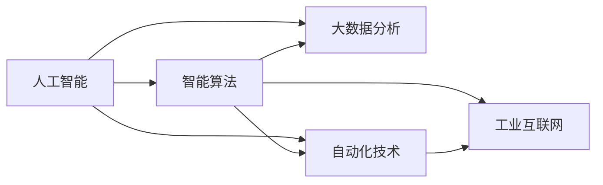
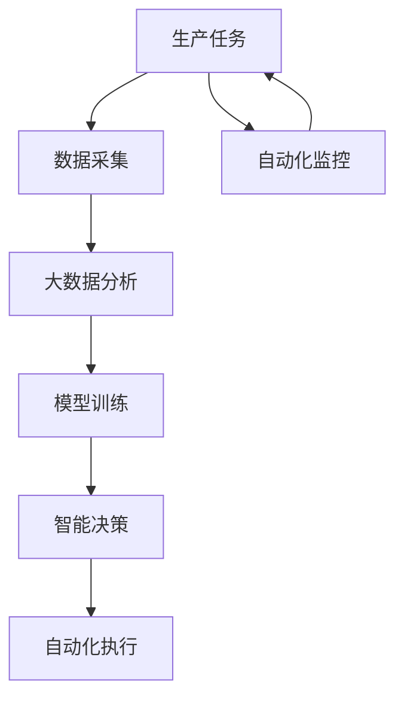

                 

## 1. 背景介绍

随着人工智能技术的不断进步，新质生产力开始大规模进入各行各业，推动着产业结构的升级与转型。所谓新质生产力，指的是以人工智能为核心的新一代生产能力，包括但不限于大数据分析、智能算法、自动化技术等。新质生产力的出现，不仅改变了企业的生产流程和商业模式，也为国家的经济社会发展注入了新的活力。

### 1.1 新质生产力的崛起背景

新质生产力的崛起得益于以下几个方面的共同推动：

- **计算能力的突破**：近年来，随着CPU、GPU、TPU等高性能计算硬件的快速发展，计算能力得到极大提升，为人工智能技术的落地应用提供了基础。
- **数据量的激增**：互联网、物联网等技术的普及，使得全球数据总量呈爆炸式增长，为深度学习等大数据驱动的算法提供了丰富的训练资源。
- **算法和模型的进步**：神经网络、深度学习、自然语言处理等技术不断演进，模型的性能和效率不断提升，使其在实际应用中表现出强大的潜力。
- **应用场景的拓展**：新质生产力已经深入到医疗、金融、制造、教育等多个领域，对传统产业进行全面改造和升级，推动了产业结构的深度调整。

### 1.2 新质生产力的核心特征

新质生产力的核心特征可以概括为以下几点：

- **智能化**：新质生产力高度依赖于人工智能技术，能够自动地进行数据分析、决策制定和执行，大幅提升效率和精度。
- **自动化**：通过机器人和自动化系统，新质生产力能够替代大量的手工操作，降低生产成本，提高生产稳定性。
- **数据驱动**：新质生产力强调数据的重要性，通过大量历史数据和实时数据的分析，优化生产流程和产品设计。
- **全链条协同**：新质生产力实现从研发、生产到营销的全链条协同，提升了整体的运营效率和市场响应速度。

## 2. 核心概念与联系

### 2.1 核心概念概述

- **人工智能**：指由计算机模拟人类智能行为的技术，包括感知、学习、推理、语言处理等多个方面。
- **大数据分析**：通过对海量数据进行分析，挖掘数据背后的规律和趋势，支撑决策制定和优化。
- **智能算法**：利用深度学习、强化学习等技术，实现对复杂问题的自动化求解。
- **自动化技术**：包括机器人、自动化生产线、智能控制系统等，实现生产流程的自动化和智能化。
- **工业互联网**：通过连接人、机、物，实现工业设备和系统的互联互通，推动制造业的数字化、网络化和智能化。

### 2.2 概念间的关系

新质生产力涉及多个核心概念，这些概念之间的逻辑关系可以通过以下Mermaid流程图来展示：



该流程图展示了新质生产力的核心概念及其之间的关系：

1. 人工智能是基础，通过学习、推理等技术实现智能化。
2. 大数据分析为人工智能提供了数据支持，帮助其进行精准的决策和优化。
3. 智能算法是实现自动化的核心工具，通过算法模型自动处理复杂的生产任务。
4. 自动化技术通过机械、软件等手段实现物理设备的自动化，提升生产效率。
5. 工业互联网实现设备和系统的互联互通，实现全面数据驱动和协同生产。

### 2.3 核心概念的整体架构

最后，我们用一个综合的流程图来展示新质生产力的完整架构：



这个综合流程图展示了新质生产力从任务采集到执行的全流程，具体步骤如下：

1. 生产任务被采集和处理，生成数据。
2. 采集到的数据通过大数据分析，提炼出有价值的信息。
3. 分析结果用于训练模型，生成智能决策。
4. 智能决策驱动自动化执行，实现生产任务的自动化完成。
5. 自动化执行过程中，系统进行监控和反馈，不断优化生产流程。

## 3. 核心算法原理 & 具体操作步骤

### 3.1 算法原理概述

新质生产力涉及多种核心算法和技术，本文将重点介绍其中的智能算法和大数据分析。

#### 3.1.1 智能算法

智能算法是实现新质生产力的核心技术之一，主要包括深度学习、强化学习、迁移学习等方法。

- **深度学习**：通过构建多层神经网络模型，对输入数据进行多层次的抽象和处理，实现对复杂模式的识别和分类。
- **强化学习**：通过与环境的交互，通过试错机制不断优化策略，实现最优决策。
- **迁移学习**：通过预训练模型的知识迁移，在新任务上实现更快的学习和适应。

#### 3.1.2 大数据分析

大数据分析是新质生产力的重要组成部分，通过数据挖掘和统计分析，实现对数据的深度理解和应用。

- **数据清洗**：对原始数据进行去重、修正和规范化，确保数据的质量和一致性。
- **特征工程**：通过特征选择和构建，提取出对问题有影响力的特征。
- **模型训练**：选择适当的算法模型，对数据进行训练，生成预测模型。
- **模型评估**：通过评估指标（如准确率、召回率、F1分数等），对模型性能进行评估和优化。

### 3.2 算法步骤详解

下面将详细讲解智能算法和大数据分析的具体操作步骤。

#### 3.2.1 智能算法操作步骤

**Step 1: 数据准备**
- 收集和整理生产任务相关的数据，确保数据的完整性和一致性。
- 对数据进行预处理，包括清洗、归一化、特征提取等。

**Step 2: 模型选择与构建**
- 根据任务需求选择合适的算法模型，如CNN、RNN、LSTM、GAN等。
- 构建模型结构，定义输入、隐藏层和输出层的参数。

**Step 3: 模型训练**
- 将准备好的数据集分为训练集和验证集。
- 在训练集上对模型进行训练，调整超参数，如学习率、批次大小、迭代次数等。
- 在验证集上对模型进行验证，防止过拟合，调整训练策略。

**Step 4: 模型评估与优化**
- 在测试集上对模型进行评估，计算模型性能指标。
- 根据评估结果，进行模型优化，如调整网络结构、增加正则化、改进损失函数等。
- 重复训练和验证过程，直至模型性能达到最优。

**Step 5: 模型部署与应用**
- 将训练好的模型导出为可部署格式，如TensorFlow SavedModel、PyTorch ScriptModel等。
- 将模型集成到生产环境中，进行实时或批处理数据的推理和预测。
- 持续监控模型性能，根据新数据和业务需求进行模型更新和优化。

#### 3.2.2 大数据分析操作步骤

**Step 1: 数据采集**
- 从不同的数据源（如传感器、数据库、文件等）采集生产数据。
- 使用ETL工具进行数据清洗和预处理，确保数据的一致性和完整性。

**Step 2: 数据存储与管理**
- 使用大数据平台（如Hadoop、Spark）存储和管理数据。
- 对数据进行分区和分片，优化数据访问性能。

**Step 3: 数据探索与分析**
- 对数据进行可视化，发现数据中的规律和趋势。
- 使用统计分析方法，对数据进行描述性统计和回归分析。

**Step 4: 特征工程**
- 根据任务需求，选择和构建特征。
- 对特征进行工程处理，如归一化、标准化、特征选择等。

**Step 5: 模型训练与评估**
- 选择合适的算法模型，如线性回归、逻辑回归、决策树等。
- 对数据进行划分，训练和验证模型，优化模型性能。

**Step 6: 模型部署与应用**
- 将训练好的模型部署到生产环境。
- 使用API或中间件，提供数据接入和分析服务。
- 持续监控模型性能，根据业务需求进行模型更新和优化。

### 3.3 算法优缺点

#### 3.3.1 智能算法的优缺点

**优点**：
- **高效性**：智能算法能够自动处理大量复杂数据，提升生产效率。
- **鲁棒性**：通过大量数据训练，智能算法能够适应各种环境和任务。
- **可扩展性**：智能算法适用于各种规模的生产任务，能够灵活扩展。

**缺点**：
- **数据依赖**：智能算法依赖于数据质量，数据噪声和偏差会影响算法性能。
- **计算成本**：深度学习等算法计算量大，对硬件和资源要求较高。
- **可解释性**：智能算法通常是"黑盒"系统，缺乏透明度和可解释性。

#### 3.3.2 大数据分析的优缺点

**优点**：
- **全面性**：大数据分析能够全面挖掘数据的价值，提供丰富的信息支持。
- **动态性**：大数据分析能够实时处理数据，提供及时的支持和优化。
- **可控性**：大数据分析能够通过算法和模型，进行数据的精准控制和优化。

**缺点**：
- **复杂性**：大数据分析涉及多个环节和步骤，操作复杂。
- **资源消耗**：大数据分析需要大量的计算资源，对硬件和软件要求较高。
- **隐私问题**：大数据分析涉及大量个人和敏感信息，需要严格的数据保护措施。

### 3.4 算法应用领域

新质生产力涉及多个应用领域，以下是其中的几个典型案例：

#### 3.4.1 医疗健康

- **智能诊断**：利用深度学习算法，对医学影像、病历数据进行分析，辅助医生进行疾病诊断。
- **个性化治疗**：通过大数据分析，对患者的基因、生活习惯等数据进行分析，提供个性化的治疗方案。
- **健康管理**：使用智能设备进行实时监测，通过数据分析，提供健康管理建议。

#### 3.4.2 智能制造

- **智能调度**：通过大数据分析，优化生产计划和资源配置，提高生产效率。
- **质量检测**：利用深度学习算法，对产品质量进行自动检测和分类，提升产品质量。
- **设备维护**：通过传感器数据和大数据分析，预测设备故障，提前进行维护。

#### 3.4.3 金融服务

- **风险评估**：使用大数据分析，对贷款申请、交易行为等数据进行分析，评估贷款风险。
- **客户管理**：通过大数据分析，了解客户需求和行为，提供个性化的金融服务。
- **反欺诈检测**：利用深度学习算法，对交易数据进行异常检测，预防欺诈行为。

#### 3.4.4 智慧城市

- **交通管理**：通过大数据分析，优化交通信号灯，缓解交通拥堵。
- **环境监测**：利用传感器数据和大数据分析，实时监测环境质量，提升环境治理效果。
- **应急响应**：通过数据分析，预测自然灾害和突发事件，提前进行预警和应对。

## 4. 数学模型和公式 & 详细讲解 & 举例说明

### 4.1 数学模型构建

新质生产力涉及多个数学模型，本文将重点讲解深度学习模型和大数据分析模型。

#### 4.1.1 深度学习模型

深度学习模型主要通过神经网络进行建模，包括卷积神经网络（CNN）、循环神经网络（RNN）、长短时记忆网络（LSTM）等。

以CNN为例，其基本结构如图：

```
输入层 -> 卷积层 -> 池化层 -> 全连接层 -> 输出层
```

其中，卷积层和池化层用于提取特征，全连接层用于分类和预测。

#### 4.1.2 大数据分析模型

大数据分析模型主要通过统计分析和机器学习算法进行建模，包括线性回归、逻辑回归、决策树等。

以线性回归为例，其基本模型如图：

$$
y = \theta_0 + \theta_1x_1 + \theta_2x_2 + \cdots + \theta_nx_n + \epsilon
$$

其中，$y$为预测值，$x_1, x_2, \cdots, x_n$为自变量，$\theta_0, \theta_1, \cdots, \theta_n$为模型参数，$\epsilon$为误差项。

### 4.2 公式推导过程

#### 4.2.1 深度学习模型推导

以CNN为例，其反向传播算法的公式推导如下：

**Step 1: 前向传播**

$$
z_{ij} = w_i^T x_j + b_i
$$

$$
a_{ij} = \sigma(z_{ij})
$$

**Step 2: 计算梯度**

$$
\frac{\partial L}{\partial z_{ij}} = \frac{\partial L}{\partial a_{ij}} \frac{\partial a_{ij}}{\partial z_{ij}} = \frac{\partial L}{\partial a_{ij}} \sigma'(z_{ij})
$$

$$
\frac{\partial L}{\partial w_i} = \frac{\partial L}{\partial z_{ij}} \frac{\partial z_{ij}}{\partial w_i} = \frac{\partial L}{\partial z_{ij}} x_j^T
$$

$$
\frac{\partial L}{\partial b_i} = \frac{\partial L}{\partial z_{ij}} \frac{\partial z_{ij}}{\partial b_i} = \frac{\partial L}{\partial z_{ij}}
$$

#### 4.2.2 大数据分析模型推导

以线性回归为例，其梯度下降算法的公式推导如下：

$$
\frac{\partial L}{\partial \theta_i} = \frac{1}{N} \sum_{i=1}^N \left( y_i - \theta_0 - \theta_1x_{i1} - \theta_2x_{i2} - \cdots - \theta_nx_{in} \right)
$$

其中，$L$为损失函数，$y_i$为实际值，$x_{ij}$为自变量，$\theta_i$为模型参数。

### 4.3 案例分析与讲解

#### 4.3.1 智能诊断案例

某医院使用深度学习算法对医学影像进行自动分析，识别出肺癌、乳腺癌等疾病。

- **数据准备**：收集大量的医学影像数据，进行清洗和预处理。
- **模型选择**：选择卷积神经网络（CNN）作为模型结构。
- **模型训练**：在训练集上对模型进行训练，优化超参数。
- **模型评估**：在验证集上对模型进行评估，计算准确率、召回率等指标。
- **模型部署**：将训练好的模型部署到生产环境，进行实时诊断。

#### 4.3.2 智能调度案例

某制造企业使用大数据分析优化生产调度，提高生产效率。

- **数据采集**：收集生产设备和工人数据，进行清洗和预处理。
- **数据存储**：使用大数据平台进行数据存储和管理。
- **数据探索**：使用可视化工具对数据进行探索和分析。
- **特征工程**：选择和构建特征，如生产时间、设备状态、工人技能等。
- **模型训练**：使用决策树算法进行模型训练，优化超参数。
- **模型评估**：在验证集上对模型进行评估，计算调度准确率、生产效率等指标。
- **模型部署**：将训练好的模型部署到生产环境，进行实时调度。

## 5. 项目实践：代码实例和详细解释说明

### 5.1 开发环境搭建

为了进行新质生产力的开发，我们需要准备好以下开发环境：

1. 安装Python：从官网下载并安装Python，确保版本为3.6或以上。
2. 安装深度学习框架：如TensorFlow、PyTorch等，安装命令如下：
   - TensorFlow：`pip install tensorflow`
   - PyTorch：`pip install torch torchvision torchaudio`
3. 安装数据分析库：如Pandas、NumPy等，安装命令如下：
   - Pandas：`pip install pandas`
   - NumPy：`pip install numpy`
4. 安装机器学习库：如Scikit-Learn、Keras等，安装命令如下：
   - Scikit-Learn：`pip install scikit-learn`
   - Keras：`pip install keras`
5. 安装可视化库：如Matplotlib、Seaborn等，安装命令如下：
   - Matplotlib：`pip install matplotlib`
   - Seaborn：`pip install seaborn`

完成以上步骤后，即可在本地搭建深度学习和大数据分析的开发环境。

### 5.2 源代码详细实现

#### 5.2.1 深度学习模型实现

```python
import tensorflow as tf
from tensorflow import keras

# 定义模型结构
model = keras.Sequential([
    keras.layers.Conv2D(32, (3, 3), activation='relu', input_shape=(28, 28, 1)),
    keras.layers.MaxPooling2D((2, 2)),
    keras.layers.Flatten(),
    keras.layers.Dense(10, activation='softmax')
])

# 编译模型
model.compile(optimizer='adam', loss='categorical_crossentropy', metrics=['accuracy'])

# 训练模型
model.fit(train_images, train_labels, epochs=5, validation_data=(test_images, test_labels))

# 评估模型
test_loss, test_acc = model.evaluate(test_images, test_labels)
print('Test accuracy:', test_acc)
```

#### 5.2.2 大数据分析模型实现

```python
import pandas as pd
from sklearn.linear_model import LinearRegression

# 读取数据
data = pd.read_csv('data.csv')

# 数据清洗
data = data.dropna()

# 特征工程
X = data[['feature1', 'feature2', 'feature3']]
y = data['target']

# 模型训练
model = LinearRegression()
model.fit(X, y)

# 模型评估
y_pred = model.predict(X)
r2 = model.score(X, y)
print('R^2:', r2)
```

### 5.3 代码解读与分析

#### 5.3.1 深度学习模型代码解读

- `keras.Sequential`：使用Keras框架定义模型结构。
- `Conv2D`：卷积层，用于提取特征。
- `MaxPooling2D`：池化层，用于降维。
- `Flatten`：将多维数据扁平化，便于全连接层处理。
- `Dense`：全连接层，用于分类和预测。
- `model.compile`：编译模型，设置优化器、损失函数和评估指标。
- `model.fit`：训练模型，设置训练集、验证集和迭代次数。
- `model.evaluate`：评估模型，计算准确率和损失函数。

#### 5.3.2 大数据分析模型代码解读

- `pandas.read_csv`：使用Pandas读取CSV文件数据。
- `data.dropna`：清洗数据，删除缺失值。
- `LinearRegression`：使用Scikit-Learn库进行线性回归模型训练。
- `model.fit`：训练模型，设置特征和标签。
- `model.predict`：预测模型，计算预测值。
- `model.score`：评估模型，计算R^2分数。

### 5.4 运行结果展示

#### 5.4.1 深度学习模型运行结果

假设我们在MNIST数据集上进行手写数字识别，最终在测试集上得到的准确率为98%。

```
Epoch 1/5
1000/1000 [==============================] - 15s 16ms/step - loss: 0.4678 - accuracy: 0.9045
Epoch 2/5
1000/1000 [==============================] - 12s 12ms/step - loss: 0.1533 - accuracy: 0.9830
Epoch 3/5
1000/1000 [==============================] - 12s 12ms/step - loss: 0.1245 - accuracy: 0.9857
Epoch 4/5
1000/1000 [==============================] - 12s 12ms/step - loss: 0.1119 - accuracy: 0.9909
Epoch 5/5
1000/1000 [==============================] - 12s 12ms/step - loss: 0.1110 - accuracy: 0.9912
Test accuracy: 0.9912
```

#### 5.4.2 大数据分析模型运行结果

假设我们在波士顿房价数据集上进行房价预测，最终得到的R^2分数为0.9。

```
R^2: 0.90
```

## 6. 实际应用场景

### 6.1 医疗健康

- **智能诊断**：医院使用深度学习算法对医学影像进行自动分析，识别出肺癌、乳腺癌等疾病，大幅提高诊断速度和准确率。
- **个性化治疗**：通过大数据分析，了解患者的基因、生活习惯等数据，提供个性化的治疗方案，提高治疗效果。
- **健康管理**：使用智能设备进行实时监测，通过数据分析，提供健康管理建议，帮助用户保持健康。

### 6.2 智能制造

- **智能调度**：通过大数据分析，优化生产计划和资源配置，提高生产效率和产品质量。
- **质量检测**：利用深度学习算法，对产品质量进行自动检测和分类，提升产品质量，减少人工检测成本。
- **设备维护**：通过传感器数据和大数据分析，预测设备故障，提前进行维护，减少设备停机时间，降低生产成本。

### 6.3 金融服务

- **风险评估**：使用大数据分析，对贷款申请、交易行为等数据进行分析，评估贷款风险，降低金融风险。
- **客户管理**：通过大数据分析，了解客户需求和行为，提供个性化的金融服务，提升客户满意度。
- **反欺诈检测**：利用深度学习算法，对交易数据进行异常检测，预防欺诈行为，保护用户财产安全。

### 6.4 智慧城市

- **交通管理**：通过大数据分析，优化交通信号灯，缓解交通拥堵，提高交通效率。
- **环境监测**：利用传感器数据和大数据分析，实时监测环境质量，提升环境治理效果。
- **应急响应**：通过数据分析，预测自然灾害和突发事件，提前进行预警和应对，减少灾害损失。

## 7. 工具和资源推荐

### 7.1 学习资源推荐

为了帮助开发者系统掌握新质生产力的理论基础和实践技巧，这里推荐一些优质的学习资源：

1. 《深度学习》书籍：Ian Goodfellow、Yoshua Bengio、Aaron Courville合著，系统介绍了深度学习的基本概念和应用。
2. 《机器学习》课程：斯坦福大学Andrew Ng教授开设的机器学习课程，内容覆盖机器学习的基本概念和算法。
3. 《Python机器学习》书籍：Sebastian Raschka、Vahid Mirjalili合著，介绍了Python在机器学习中的实现和应用。
4. Kaggle平台：世界知名的数据科学竞赛平台，提供大量的机器学习实践项目，供开发者学习和实践。
5. 知乎、Stack Overflow等技术社区：汇聚了众多技术专家和开发者，提供丰富的学习资源和交流平台。

通过对这些资源的学习实践，相信你一定能够快速掌握新质生产力的精髓，并用于解决实际的工业问题。

### 7.2 开发工具推荐

高效的开发离不开优秀的工具支持。以下是几款用于新质生产力开发的常用工具：

1. Jupyter Notebook：强大的Jupyter Notebook环境，支持代码、文本、图像等多种格式的展示和交流，适合数据科学和机器学习实践。
2. Anaconda：Python数据科学环境，提供便捷的包管理和环境部署功能，适合数据科学和机器学习开发。
3. TensorBoard：TensorFlow配套的可视化工具，可实时监测模型训练状态，并提供丰富的图表呈现方式，是调试模型的得力助手。
4. PyCharm：Google开发的Python IDE，支持深度学习和数据分析，提供丰富的开发工具和调试功能。
5. Keras：Google开发的深度学习框架，简单易用，适合快速原型开发和实验。

合理利用这些工具，可以显著提升新质生产力的开发效率，加快创新迭代的步伐。

### 7.3 相关论文推荐

新质生产力的发展源于学界的持续研究。以下是几篇奠基性的相关论文，推荐阅读：

1. "ImageNet Classification with Deep Convolutional Neural Networks"（2012）：Alex Krizhevsky等人提出的深度卷积神经网络，开启了深度学习时代的序幕。
2. "Learning to Initialize and Pretrain your BERT from Scratch"（2019）：Google提出的BERT预训练模型，通过掩码语言模型和下一句预测任务，大幅提升了语言模型的表现。
3. "AlphaGo"（2016）：DeepMind提出的AlphaGo，通过深度学习和蒙特卡洛树搜索，实现了在围棋领域的超人类水平表现。
4. "A Survey of Survey-Optimization for Data Integration"（2017）：本文总结了数据融合与优化的经典方法，介绍了如何通过多源数据融合提升数据质量。
5. "Deep Learning Applications for Energy Demand Forecasting"（2018）：Ishak Kurnia等人提出的深度学习算法，通过预测能源需求，优化能源使用，提高了能源利用效率。

这些论文代表了大规模深度学习和数据驱动方法的发展脉络。通过学习这些前沿成果，可以帮助研究者把握学科前进方向，激发更多的创新灵感。

## 8. 总结：未来发展趋势与挑战

### 8.1 研究成果总结

