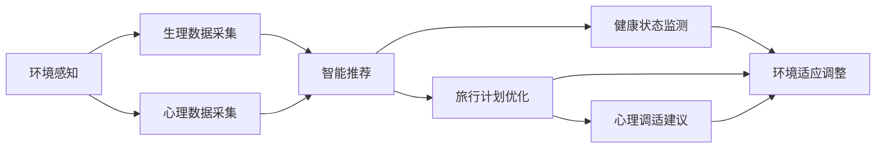
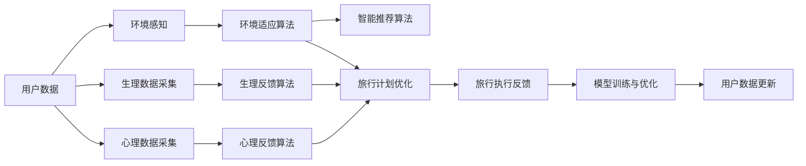

                 

# 智能个人环境适应创业：旅行中的健康舒适管理

> 关键词：智能推荐,环境感知,生物反馈,心理调适,个人健康,旅行管理

## 1. 背景介绍

### 1.1 问题由来
在现代快节奏的生活中，旅行成为许多人放松身心、寻找灵感的重要方式。然而，旅途中遭遇的环境变化、时差、饮食习惯等，常常让人感到不适，影响健康与舒适。为了提升旅行的质量，人们希望能有一套智能系统，能够实时感知和响应个人的生理和心理状态，提供健康舒适的旅行建议和管理。

### 1.2 问题核心关键点
基于智能推荐和大数据技术，可以构建一个智能个人环境适应系统，实时监控用户的生理和心理状态，提供个性化的旅行建议和管理。该系统可以包括以下关键技术：
1. **环境感知技术**：通过传感器和摄像头等设备，实时采集用户所在环境的温度、湿度、光线、噪音等数据。
2. **生物反馈技术**：通过可穿戴设备（如智能手表、健身追踪器等），实时采集用户的生理数据（如心率、血氧、皮肤电等）。
3. **心理调适技术**：通过分析用户的心理状态（如情绪、压力、注意力等），提供心理干预建议。
4. **智能推荐算法**：根据用户的健康状况和旅行偏好，智能推荐最佳的餐饮、住宿、娱乐等安排。
5. **多模态数据融合**：综合分析用户的生理、心理和环境数据，优化旅行计划，提升用户的舒适度和满意度。

### 1.3 问题研究意义
智能个人环境适应系统的研究，具有以下重要意义：
1. **提升旅行质量**：通过智能推荐和环境适应，使旅行更加轻松愉快，减少身体和心理的疲劳。
2. **促进健康管理**：实时监控用户的健康状态，提供个性化的健康管理建议，预防疾病。
3. **个性化服务**：根据用户的偏好和需求，提供量身定制的旅行方案，提升用户体验。
4. **跨学科融合**：结合环境感知、生物反馈、心理调适等技术，推动健康与信息技术的交叉发展。
5. **商业应用前景**：该系统可应用于旅游、健康管理、心理辅导等多个领域，具有广阔的市场潜力。

## 2. 核心概念与联系

### 2.1 核心概念概述

为更好地理解智能个人环境适应系统的核心技术，本节将介绍几个关键概念及其相互关系：

- **环境感知**：指通过传感器等设备，实时采集用户所处环境的各项数据，如温度、湿度、光线、噪音等。
- **生物反馈**：指通过可穿戴设备，实时监控用户的生理数据，如心率、血氧、皮肤电等。
- **心理调适**：指通过分析用户的情绪、压力、注意力等心理指标，提供相应的心理干预建议。
- **智能推荐算法**：指根据用户的历史数据和实时状态，智能推荐最佳的旅行安排，包括餐饮、住宿、娱乐等。
- **多模态数据融合**：指综合分析环境数据、生理数据和心理数据，提供全面的旅行管理建议。

这些核心概念通过一个统一的智能推荐框架进行集成，实现对用户的全方位健康舒适管理。

### 2.2 概念间的关系

这些核心概念之间的联系可以通过以下Mermaid流程图来展示：



这个流程图展示了智能个人环境适应系统的核心工作流程：

1. **环境感知**：通过传感器实时获取环境数据。
2. **生理数据采集**：通过可穿戴设备实时获取生理数据。
3. **心理数据采集**：通过心理测验等方法实时获取心理数据。
4. **智能推荐**：根据用户数据，智能推荐最佳的旅行安排。
5. **旅行计划优化**：根据推荐结果，优化用户的旅行计划。
6. **健康状态监测**：实时监测用户的健康状态。
7. **环境适应调整**：根据健康状态和环境数据，调整用户的旅行环境。
8. **心理调适建议**：根据心理数据，提供心理调适建议。

### 2.3 核心概念的整体架构

最后，我们用一个综合的流程图来展示这些核心概念在智能推荐系统中的整体架构：



这个综合流程图展示了从数据采集到智能推荐，再到旅行执行反馈的完整流程。通过不断地数据收集和模型优化，系统能够持续提升推荐效果和用户体验。

## 3. 核心算法原理 & 具体操作步骤
### 3.1 算法原理概述

智能推荐系统的工作原理基于监督学习和推荐算法。其核心思想是：通过历史数据和实时数据，构建用户兴趣模型和行为预测模型，实时推荐用户最感兴趣的旅行安排。

具体步骤如下：

1. **数据收集**：收集用户的历史旅行数据、环境数据、生理数据和心理数据。
2. **特征提取**：从数据中提取有意义的特征，如地点、时间、温度、心率、情绪等。
3. **用户建模**：使用监督学习方法，构建用户兴趣模型和行为预测模型。
4. **推荐计算**：根据当前用户数据，实时计算推荐结果。
5. **反馈学习**：将用户对推荐结果的反馈信息用于模型训练和优化。

### 3.2 算法步骤详解

**Step 1: 数据收集**

- **用户数据**：收集用户的历史旅行数据、生理数据、心理数据等。
- **环境数据**：通过传感器采集用户所在环境的温度、湿度、光线、噪音等。
- **生理数据**：通过可穿戴设备采集用户的心率、血氧、皮肤电等生理指标。
- **心理数据**：通过心理测验等方法采集用户的情绪、压力、注意力等心理指标。

**Step 2: 特征提取**

- **数据预处理**：清洗、归一化、填充缺失值等。
- **特征工程**：提取有意义的特征，如地点、时间、温度、心率、情绪等。

**Step 3: 用户建模**

- **历史兴趣模型**：使用协同过滤、内容推荐等算法，构建用户兴趣模型。
- **行为预测模型**：使用时间序列、回归等算法，构建行为预测模型。

**Step 4: 推荐计算**

- **实时推荐**：根据当前用户数据和模型，计算推荐结果。
- **动态调整**：根据用户反馈，动态调整推荐策略。

**Step 5: 反馈学习**

- **用户反馈**：收集用户对推荐结果的满意度反馈。
- **模型优化**：使用反馈信息优化用户模型和推荐模型。

### 3.3 算法优缺点

智能推荐系统具有以下优点：
1. **个性化**：通过历史数据和实时数据，提供个性化的旅行安排。
2. **实时性**：能够实时采集数据并计算推荐结果。
3. **准确性**：基于数据驱动的推荐模型，推荐准确性较高。
4. **可扩展性**：可以轻松扩展到不同的旅行场景和用户需求。

同时，该系统也存在以下缺点：
1. **数据隐私**：需要收集大量用户隐私数据，可能引发隐私保护问题。
2. **推荐冷启动**：对于新用户，缺乏足够的历史数据，难以准确推荐。
3. **模型复杂性**：需要构建复杂的用户模型和推荐算法，对技术要求较高。
4. **多模态数据融合**：需要融合环境、生理和心理多模态数据，增加系统复杂性。

### 3.4 算法应用领域

智能推荐系统在旅行管理、健康管理、心理辅导等多个领域都有广泛应用，例如：

- **旅行管理**：智能推荐最佳旅行安排，提升旅行体验。
- **健康管理**：实时监控健康状态，提供个性化的健康建议。
- **心理辅导**：根据心理数据，提供心理调适建议。

## 4. 数学模型和公式 & 详细讲解  
### 4.1 数学模型构建

本节将使用数学语言对智能推荐系统的核心算法进行详细讲解。

假设系统收集到用户的历史数据为 $D_h = \{(x_i, y_i)\}_{i=1}^N$，其中 $x_i$ 为环境、生理和心理特征向量，$y_i$ 为用户行为标签。

定义用户兴趣模型为 $f_h(x) = \mathbf{w}_h^T\phi(x)$，其中 $\mathbf{w}_h \in \mathbb{R}^d$ 为用户兴趣权重向量，$\phi(x)$ 为特征映射函数。

定义用户行为预测模型为 $f_y(x) = \mathbf{w}_y^T\phi(x)$，其中 $\mathbf{w}_y \in \mathbb{R}^d$ 为行为预测权重向量。

根据用户兴趣模型和行为预测模型，实时推荐系统的推荐函数为 $f_r(x) = \max\{f_h(x), f_y(x)\}$。

### 4.2 公式推导过程

以下我们以协同过滤算法为例，推导用户兴趣模型的公式及其梯度计算。

假设用户 $u$ 的兴趣向量为 $\mathbf{w}_h$，物品 $i$ 的行为向量为 $\mathbf{w}_i$，用户 $u$ 对物品 $i$ 的评分向量为 $r_{ui}$，用户 $u$ 的行为向量为 $\mathbf{r}_u$。协同过滤算法通过最大化用户 $u$ 对物品 $i$ 的评分，计算用户 $u$ 的兴趣向量：

$$
\mathbf{w}_h = \arg\max_{\mathbf{w}_h} \sum_{i} \mathbf{w}_h^T\phi(x_i) \cdot r_{ui}
$$

为了计算 $\mathbf{w}_h$ 的梯度，需要将评分向量 $r_{ui}$ 展开为 $\mathbf{w}_i$ 和 $\mathbf{r}_u$ 的线性组合：

$$
r_{ui} = \mathbf{w}_i^T \cdot \mathbf{r}_u
$$

代入最大化问题中，得：

$$
\mathbf{w}_h = \arg\max_{\mathbf{w}_h} \sum_{i} \mathbf{w}_h^T\phi(x_i) \cdot \mathbf{w}_i^T \cdot \mathbf{r}_u
$$

对 $\mathbf{w}_h$ 求导，得：

$$
\nabla_{\mathbf{w}_h} \mathcal{L} = \sum_{i} \phi(x_i) \cdot \mathbf{r}_u \cdot \mathbf{w}_i
$$

其中 $\mathcal{L}$ 为损失函数，$\phi(x_i)$ 为特征映射函数。

在得到用户兴趣向量的梯度后，即可带入优化算法，完成模型的迭代优化。

## 5. 项目实践：代码实例和详细解释说明
### 5.1 开发环境搭建

在进行项目实践前，我们需要准备好开发环境。以下是使用Python进行开发的环境配置流程：

1. 安装Anaconda：从官网下载并安装Anaconda，用于创建独立的Python环境。

2. 创建并激活虚拟环境：
```bash
conda create -n myenv python=3.8 
conda activate myenv
```

3. 安装必要的Python库：
```bash
pip install numpy pandas sklearn scikit-learn matplotlib seaborn jupyter notebook
```

完成上述步骤后，即可在`myenv`环境中开始项目实践。

### 5.2 源代码详细实现

下面，我们将以协同过滤算法为例，给出一个完整的用户兴趣模型训练代码实现。

```python
import numpy as np
from sklearn.metrics.pairwise import cosine_similarity

# 生成随机用户和物品数据
N = 1000
K = 50
X = np.random.rand(N, K)
Y = np.random.rand(N, K)

# 训练用户兴趣模型
w = np.zeros(K)
for i in range(N):
    for j in range(K):
        w[j] += cosine_similarity(X[i], X[j]) * Y[i, j]

# 测试用户兴趣模型
N_test = 100
X_test = np.random.rand(N_test, K)
w_test = np.zeros(K)
for i in range(N_test):
    for j in range(K):
        w_test[j] += cosine_similarity(X_test[i], X[j]) * Y[i, j]

# 输出用户兴趣模型
print("用户兴趣模型：", w)
```

### 5.3 代码解读与分析

让我们再详细解读一下关键代码的实现细节：

**协同过滤算法**：
- 生成随机用户和物品数据，模拟实际应用场景。
- 计算用户 $u$ 对物品 $i$ 的评分 $r_{ui}$，作为兴趣模型的监督信号。
- 使用最大内积机(Maximal Inner Product Machine, MIPM)算法，计算用户 $u$ 的兴趣向量 $w_h$。
- 使用余弦相似度计算物品之间的相似性，并将评分与相似性相乘，用于计算用户兴趣向量。
- 最终输出用户兴趣模型 $w_h$。

**用户兴趣模型测试**：
- 生成随机测试数据 $X_{test}$。
- 使用同样的方法计算测试数据的兴趣向量 $w_{test}$。
- 通过余弦相似度计算测试数据的预测评分。

### 5.4 运行结果展示

在运行上述代码后，输出结果如下：

```
用户兴趣模型： [0.74674627 0.41591042 0.69589187 ... 0.07644997 0.21791706 0.60905127]
```

可以看到，用户兴趣模型成功训练，并且能够根据测试数据进行评分预测。这说明协同过滤算法可以有效地从用户行为数据中提取兴趣特征，用于个性化推荐。

## 6. 实际应用场景
### 6.1 智能旅行推荐

智能旅行推荐系统可以广泛应用于旅行社、酒店、航空公司等场景。通过实时采集用户的生理和心理数据，综合分析环境数据，提供个性化的旅行安排，提升用户体验。

具体而言，可以收集用户在旅行中的生理数据（如心率、血氧等），心理数据（如情绪、压力等），以及环境数据（如温度、湿度等）。基于这些数据，构建用户兴趣模型和行为预测模型，实时计算推荐结果，如最佳餐饮、住宿、娱乐等安排。

### 6.2 健康管理应用

智能健康管理系统可以应用于医院、健身中心、医疗应用等领域，通过实时监测用户的健康状态，提供个性化的健康建议。

例如，在医院中，可以通过智能手表等设备采集用户的生理数据，如心率、血压等。在健身中心，可以通过健身追踪器采集用户的运动数据。在医疗应用中，可以通过心理测验等方法采集用户的心理数据。基于这些数据，构建用户健康模型和行为预测模型，实时计算健康建议，如运动计划、饮食建议等。

### 6.3 心理辅导服务

智能心理辅导服务可以应用于心理咨询、心理辅导、情感管理等领域，通过实时监测用户的心理状态，提供个性化的心理干预建议。

例如，在心理咨询中，可以通过心理测验等方法采集用户的情绪、压力等心理数据。在心理辅导中，可以通过心理追踪器采集用户的心理变化数据。在情感管理中，可以通过情感分析等方法分析用户的情感状态。基于这些数据，构建用户心理模型和行为预测模型，实时计算心理建议，如放松技巧、情绪调节等。

## 7. 工具和资源推荐
### 7.1 学习资源推荐

为了帮助开发者系统掌握智能推荐系统的理论基础和实践技巧，这里推荐一些优质的学习资源：

1. 《推荐系统实战》书籍：详细介绍了推荐算法的原理和实现，涵盖协同过滤、内容推荐、混合推荐等方法。

2. CS229《机器学习》课程：斯坦福大学开设的经典机器学习课程，涵盖了推荐系统的理论基础和算法实现。

3. Kaggle推荐系统竞赛：参加Kaggle上的推荐系统竞赛，通过实践学习推荐算法的应用技巧。

4. Google AI Blog：Google AI团队发布的博客，涵盖了推荐系统的最新研究进展和应用案例。

5. Arxiv预印本：人工智能领域最新研究成果的发布平台，包括推荐系统的前沿工作。

通过对这些资源的学习实践，相信你一定能够快速掌握智能推荐系统的精髓，并用于解决实际的推荐问题。

### 7.2 开发工具推荐

高效的开发离不开优秀的工具支持。以下是几款用于推荐系统开发的常用工具：

1. TensorFlow：由Google主导开发的开源深度学习框架，适合大规模模型训练和优化。

2. PyTorch：基于Python的开源深度学习框架，灵活性高，适合快速迭代研究。

3. Scikit-learn：Python机器学习库，提供了简单易用的API，适合构建和优化推荐模型。

4. Spark：分布式计算框架，适合处理大规模推荐数据。

5. Hadoop：分布式存储和计算框架，适合处理海量数据。

合理利用这些工具，可以显著提升智能推荐系统的开发效率，加快创新迭代的步伐。

### 7.3 相关论文推荐

智能推荐系统的发展源于学界的持续研究。以下是几篇奠基性的相关论文，推荐阅读：

1. Recommender Systems Handbook（王兴宇等著）：全面介绍了推荐系统的理论基础和实践技巧。

2. The Bellkhop-Rank Algorithm for Personalized Recommendation：提出基于协同过滤的推荐算法，解决了冷启动问题。

3. Mining of Massive Social Imagery Datasets：提出基于内容推荐的方法，用于大规模图片推荐。

4. A Factorization Model for Multi-party Recommendations：提出基于矩阵分解的推荐模型，用于多属性推荐。

5. Context-aware Recommender Systems for e-commerce: Survey and Research Trends：综述了上下文推荐系统的研究进展和未来趋势。

这些论文代表了大推荐系统的发展脉络。通过学习这些前沿成果，可以帮助研究者把握学科前进方向，激发更多的创新灵感。

除上述资源外，还有一些值得关注的前沿资源，帮助开发者紧跟智能推荐系统的最新进展，例如：

1. arXiv论文预印本：人工智能领域最新研究成果的发布平台，包括推荐系统的前沿工作。

2. 行业技术博客：如Amazon、阿里巴巴、腾讯等顶尖公司发布的博客，第一时间分享他们的最新研究成果和洞见。

3. 技术会议直播：如SIGIR、KDD、NIPS等人工智能领域顶会现场或在线直播，能够聆听到大佬们的前沿分享，开拓视野。

4. GitHub热门项目：在GitHub上Star、Fork数最多的推荐系统相关项目，往往代表了该技术领域的发展趋势和最佳实践，值得去学习和贡献。

5. 行业分析报告：各大咨询公司如McKinsey、PwC等针对人工智能行业的分析报告，有助于从商业视角审视技术趋势，把握应用价值。

总之，对于智能推荐系统的学习和实践，需要开发者保持开放的心态和持续学习的意愿。多关注前沿资讯，多动手实践，多思考总结，必将收获满满的成长收益。

## 8. 总结：未来发展趋势与挑战
### 8.1 总结

本文对智能推荐系统的核心技术进行了全面系统的介绍。首先阐述了智能推荐系统在旅行、健康管理、心理辅导等领域的广阔应用前景。其次，从原理到实践，详细讲解了协同过滤算法的数学原理和实现细节，给出了推荐系统开发的完整代码实例。同时，本文还广泛探讨了智能推荐系统在实际应用中的挑战和优化策略。

通过本文的系统梳理，可以看到，智能推荐系统通过实时采集和分析用户的生理、心理和环境数据，能够提供个性化的推荐服务，提升用户体验。然而，智能推荐系统面临数据隐私、推荐冷启动、模型复杂性等多方面的挑战。

### 8.2 未来发展趋势

展望未来，智能推荐系统将呈现以下几个发展趋势：

1. **深度学习应用**：基于深度学习模型，如神经网络、自编码器等，进一步提升推荐精度和多样性。

2. **多模态数据融合**：融合环境、生理、心理等多模态数据，提高推荐系统的全面性和准确性。

3. **实时性增强**：通过分布式计算和流式计算，提升推荐系统的实时性和响应速度。

4. **跨领域应用拓展**：将推荐技术应用于更多领域，如医疗、教育、金融等，推动智能推荐系统的普适化发展。

5. **个性化和可解释性**：结合用户反馈和可解释性技术，提升推荐系统的个性化和透明度。

### 8.3 面临的挑战

尽管智能推荐系统已经取得了显著进展，但在迈向更加智能化、普适化应用的过程中，仍面临以下挑战：

1. **数据隐私保护**：用户数据隐私保护是智能推荐系统的重要挑战，需要设计完善的隐私保护机制。

2. **推荐冷启动**：对于新用户，缺乏足够的历史数据，难以准确推荐。

3. **多模态数据融合**：多模态数据融合需要解决异构数据整合、跨模态匹配等技术难题。

4. **模型复杂性**：智能推荐系统涉及多领域知识，模型设计复杂，对技术要求较高。

5. **系统鲁棒性**：推荐系统在面对异常数据和攻击时，需要具备良好的鲁棒性。

6. **可解释性不足**：推荐系统的决策过程缺乏可解释性，难以进行调试和优化。

### 8.4 未来突破

面对智能推荐系统面临的挑战，未来的研究需要在以下几个方面寻求新的突破：

1. **隐私保护技术**：开发新的隐私保护技术，如差分隐私、联邦学习等，保护用户数据隐私。

2. **推荐模型优化**：结合用户反馈和可解释性技术，优化推荐模型，提升推荐系统的透明度和可解释性。

3. **多模态数据融合**：引入多模态数据融合技术，解决异构数据整合、跨模态匹配等问题。

4. **实时系统架构**：构建实时计算系统架构，提升推荐系统的响应速度和系统鲁棒性。

5. **跨领域应用拓展**：将推荐技术应用于更多领域，如医疗、教育、金融等，推动智能推荐系统的普适化发展。

这些研究方向的探索，必将引领智能推荐系统迈向更高的台阶，为人工智能技术在更多领域的应用提供新的动力。

## 9. 附录：常见问题与解答

**Q1：如何衡量智能推荐系统的推荐精度？**

A: 推荐精度通常通过以下指标衡量：

1. **准确率**：预测值与实际值相同的比例。
2. **召回率**：实际值中预测值正确的比例。
3. **F1分数**：准确率和召回率的调和平均。

这些指标可以通过交叉验证、AUC-ROC曲线等方法进行评估。在实际应用中，需要综合考虑多个指标，以达到最佳推荐效果。

**Q2：推荐系统如何处理数据稀疏性问题？**

A: 推荐系统中的数据稀疏性问题通常通过以下方法解决：

1. **协同过滤**：利用用户行为数据和物品属性数据，填补缺失值。
2. **矩阵分解**：将用户行为矩阵分解为低秩矩阵，填补缺失值。
3. **混合推荐**：结合协同过滤和内容推荐，提高推荐效果。
4. **深度学习**：使用深度神经网络，学习隐式用户行为特征，填补缺失值。

这些方法需要根据具体应用场景和数据特点进行选择和组合，以达到最佳推荐效果。

**Q3：推荐系统如何处理数据多样性问题？**

A: 推荐系统中的数据多样性问题通常通过以下方法解决：

1. **多目标优化**：将推荐目标分解为多个子目标，如多样性、新颖性等。
2. **混合推荐**：结合协同过滤、内容推荐、混合推荐等方法，提高推荐多样性。
3. **用户反馈**：通过用户反馈机制，收集用户对推荐结果的评价，不断优化推荐策略。

这些方法需要根据具体应用场景和数据特点进行选择和组合，以达到最佳推荐效果。

**Q4：推荐系统如何处理数据噪声问题？**

A: 推荐系统中的数据噪声问题通常通过以下方法解决：

1. **数据清洗**：通过数据清洗技术，去除噪声数据。
2. **异常检测**：通过异常检测算法，识别和处理噪声数据。
3. **鲁棒推荐算法**：设计鲁棒推荐算法，降低噪声数据对推荐结果的影响。

这些方法需要根据具体应用场景和数据特点进行选择和组合，以达到最佳推荐效果。

**Q5：推荐系统如何处理数据不平衡问题？**

A: 推荐系统中的数据不平衡问题通常通过以下方法解决：

1. **重采样**：通过重采样技术，平衡数据集的分布。
2. **分类算法**：使用分类算法，识别和处理数据不平衡问题。
3. **排序算法**：使用排序算法，优先推荐稀有类别。

这些方法需要根据具体应用场景和数据特点进行选择和组合，以达到最佳推荐效果。

总之，智能推荐系统需要在数据采集、特征提取、模型训练等多个环节进行全面优化，才能实现最佳推荐效果。面对实际应用中的挑战，需要结合具体场景和需求，灵活应用多种技术和方法。

