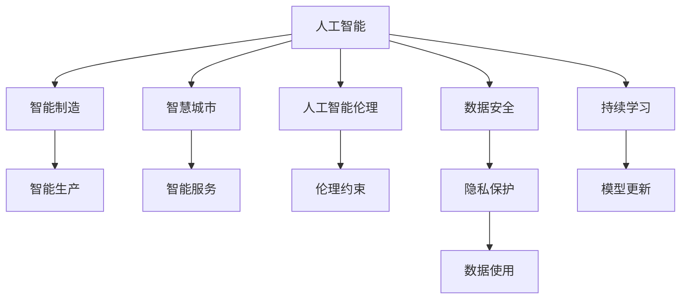

                 

# 智能产业化的未来发展方向

> 关键词：人工智能,产业升级,智能制造,智慧城市,人工智能伦理,可持续发展,数据安全

## 1. 背景介绍

### 1.1 问题由来

近年来，人工智能(AI)技术在全球范围内快速发展，尤其在智能产业化方面取得了显著进展。智能产业化通过将AI技术应用于工业、农业、医疗、教育、金融等众多领域，推动了产业的数字化、智能化转型。例如，智能制造通过自动化、智能化生产系统，极大地提升了生产效率和产品质量；智慧城市利用AI技术改善交通、医疗、教育、环境等公共服务；医疗AI则在辅助诊断、药物研发等方面展示了巨大潜力。

然而，尽管AI技术在众多领域取得了突破，但其大规模产业化仍面临诸多挑战。例如，AI技术的高成本、高门槛，使得许多中小企业难以承担，难以快速实现智能化升级；AI技术的不透明性，使得企业在部署AI时，难以评估其安全性和可靠性；AI技术的应用范围受限于数据质量和隐私保护问题，数据共享和隐私保护成为一大难题。

针对这些挑战，本文将深入探讨智能产业化的未来发展方向，提供从技术、商业模式、伦理安全等多个维度的解决方案。

## 2. 核心概念与联系

### 2.1 核心概念概述

为了更好地理解智能产业化的未来发展方向，本节将介绍几个关键概念：

- 人工智能(Artificial Intelligence, AI)：通过计算机模拟人类的智能行为，如感知、认知、决策等，使机器具备自主学习和解决问题的能力。
- 智能产业化：通过将AI技术应用到传统产业中，实现产业的智能化升级和转型。
- 智能制造(Smart Manufacturing)：利用AI技术优化生产流程，提高生产效率和产品质量。
- 智慧城市(Smart City)：利用AI技术改善城市管理，提升公共服务和居民生活质量。
- 人工智能伦理(Artificial Intelligence Ethics)：研究如何构建负责任、透明、可解释的AI系统，保护用户隐私和权益。
- 数据安全(Data Security)：保护数据免受未经授权的访问和攻击，确保数据隐私和安全。

这些概念之间存在着紧密的联系。智能制造和智慧城市是智能产业化在工业和城市管理中的应用，而AI伦理和安全则是智能产业化的重要保障，确保技术应用的合规性和可控性。通过理解这些关键概念，我们可以更好地把握智能产业化的未来发展方向。

### 2.2 概念间的关系

这些关键概念之间的关系可以通过以下Mermaid流程图来展示：



这个流程图展示了这个智能产业化的核心概念及其之间的关系：

1. 人工智能通过智能制造和智慧城市等应用场景，推动了产业的数字化、智能化转型。
2. 智能制造利用AI技术优化生产流程，智慧城市通过AI技术改善城市管理。
3. 人工智能伦理和数据安全是智能产业化的重要保障，确保技术应用的合规性和可控性。
4. 持续学习技术确保了AI模型的适应性和性能提升，保持其在应用场景中的有效性。

这些概念共同构成了智能产业化的完整生态系统，使其能够实现产业的全面智能化和可持续发展。

## 3. 核心算法原理 & 具体操作步骤

### 3.1 算法原理概述

智能产业化的核心算法原理主要包括以下几个方面：

- **强化学习(Reinforcement Learning, RL)**：通过模拟智能体与环境的交互，使AI系统在实际应用中不断学习和优化，提高决策效率和准确性。
- **迁移学习(Transfer Learning)**：利用已有的AI模型知识，加速新任务的训练过程，提升模型的泛化能力和迁移能力。
- **深度学习(Deep Learning)**：通过多层神经网络模型，实现复杂的非线性特征提取和模式识别，是当前AI应用中最广泛的技术之一。
- **知识图谱(Knowledge Graph)**：构建领域知识图谱，利用图神经网络技术，提高AI系统的知识理解和推理能力。
- **数据增强(Data Augmentation)**：通过生成更多的训练样本，提高AI系统的泛化能力，避免过拟合。
- **模型压缩(Model Compression)**：通过模型剪枝、量化等方法，减小AI模型的计算量和存储空间，提高部署效率。

这些算法原理构成了智能产业化的技术基础，通过合理应用，可以实现各领域的智能化升级。

### 3.2 算法步骤详解

以下是智能产业化各个关键技术的具体操作流程：

#### 3.2.1 强化学习

1. **环境建模**：根据具体应用场景，构建环境模型，定义状态空间、动作空间和奖励函数。
2. **智能体设计**：选择或设计智能体的结构和参数，通常采用深度神经网络模型。
3. **交互学习**：将智能体放入环境中，通过模拟或真实的交互过程，收集数据并更新模型参数。
4. **性能评估**：通过测试和验证，评估智能体的性能，并根据反馈调整模型参数。
5. **模型优化**：采用优化算法（如梯度下降、策略梯度等）优化智能体的决策策略。

#### 3.2.2 迁移学习

1. **源任务和目标任务选择**：确定预训练模型的源任务和目标任务，确保两个任务具有相似性。
2. **预训练模型加载**：从预训练数据集中加载模型参数，作为迁移学习的初始化。
3. **微调参数**：对预训练模型的部分或全部参数进行微调，以适应目标任务。
4. **评估和测试**：在目标任务数据集上评估模型性能，并根据结果调整微调参数。
5. **持续更新**：随着目标任务的数据不断增加，周期性重新训练模型，保持性能的稳定和提升。

#### 3.2.3 深度学习

1. **数据准备**：收集和清洗训练数据，并进行标注和划分。
2. **模型选择**：根据任务类型选择合适的深度学习模型，如卷积神经网络(CNN)、循环神经网络(RNN)、Transformer等。
3. **模型训练**：使用训练数据集进行模型训练，并调整超参数（如学习率、批量大小、迭代轮数等）。
4. **模型验证**：在验证数据集上评估模型性能，并进行调参优化。
5. **模型测试**：在测试数据集上评估模型性能，并进行结果分析。

#### 3.2.4 知识图谱

1. **知识图谱构建**：收集领域知识，构建知识图谱，定义实体、关系、属性等。
2. **图神经网络训练**：利用图神经网络模型（如GCN、GNN等）训练知识图谱，提高模型推理能力。
3. **知识融合**：将知识图谱与深度学习模型结合，构建知识增强的AI系统。
4. **推理验证**：在测试数据集上进行推理验证，评估知识图谱对AI系统性能的提升。

#### 3.2.5 数据增强

1. **数据收集**：收集原始数据，并进行标注和预处理。
2. **数据生成**：利用数据增强技术（如数据扩充、回译、旋转、裁剪等）生成更多的训练样本。
3. **数据筛选**：根据数据质量对增强后的数据进行筛选，保证数据的多样性和代表性。
4. **模型训练**：使用增强后的数据进行模型训练，提高模型的泛化能力。

#### 3.2.6 模型压缩

1. **模型剪枝**：通过剪枝技术去除冗余的神经元或层，减少计算量和存储空间。
2. **量化加速**：将浮点模型转化为定点模型，减小存储空间，提高计算速度。
3. **知识蒸馏**：通过知识蒸馏技术，将复杂模型（如教师模型）的知识转移到轻量级模型（如学生模型）中。
4. **分布式训练**：利用分布式训练技术，加速模型的训练和推理过程。

### 3.3 算法优缺点

智能产业化技术的优缺点如下：

**优点**：

- **高效性**：深度学习模型在大规模数据上的高效性，使得智能产业化技术可以快速处理大量数据，提升决策效率。
- **泛化能力**：迁移学习和数据增强技术提升了模型的泛化能力，使AI系统能够适应不同的应用场景。
- **知识集成**：知识图谱和知识蒸馏技术使AI系统能够整合多源知识，提升模型的推理能力。

**缺点**：

- **高成本**：深度学习模型和大规模数据集的准备和训练成本较高，需要强大的计算资源和专业人才。
- **可解释性不足**：深度学习模型的黑箱性质，使得其在解释性方面存在不足，难以让人信服。
- **隐私保护**：数据增强和模型压缩技术的广泛应用，可能导致隐私泄露风险增加。

### 3.4 算法应用领域

智能产业化技术已经在各个领域得到了广泛应用，以下是几个典型的应用场景：

- **智能制造**：利用AI技术优化生产流程，实现智能制造、智能维护、智能质量控制等。
- **智慧城市**：利用AI技术改善交通、医疗、教育、环境等公共服务，实现智能交通、智慧医疗、智能教育等。
- **金融科技**：利用AI技术进行风险评估、信用评估、智能投顾等，提升金融服务质量。
- **医疗健康**：利用AI技术进行疾病预测、辅助诊断、智能药物研发等，提升医疗健康水平。
- **农业科技**：利用AI技术进行智能农机管理、精准农业、农产品质量检测等，提高农业生产效率。

## 4. 数学模型和公式 & 详细讲解 & 举例说明

### 4.1 数学模型构建

以下是智能产业化技术的数学模型构建：

#### 4.1.1 强化学习

强化学习的数学模型由状态空间 $\mathcal{S}$、动作空间 $\mathcal{A}$、奖励函数 $r(s,a)$、状态转移概率 $P(s_{t+1}|s_t,a_t)$ 和折现因子 $\gamma$ 构成。定义智能体的状态、动作和奖励，并在每一时刻 $t$ 根据当前状态 $s_t$ 和动作 $a_t$ 计算奖励 $r_t$，并更新状态 $s_{t+1}$。智能体的目标是最大化长期奖励 $\sum_{t=0}^{\infty} \gamma^t r_{t+1}$。

#### 4.1.2 迁移学习

迁移学习的数学模型包括源任务 $\mathcal{T}_s$ 和目标任务 $\mathcal{T}_t$。假设源任务和目标任务的特征空间分别为 $\mathcal{X}_s$ 和 $\mathcal{X}_t$，定义源任务和目标任务的相似度 $M_{st}$ 和权重 $w_{st}$，则目标任务的预测函数 $f_{t}'$ 可以表示为：

$$
f_{t}'(x) = w_{st} f_s(x) + (1-w_{st}) f_{base}(x)
$$

其中 $f_s$ 为源任务的预测函数，$f_{base}$ 为基线预测函数，$w_{st}$ 为源任务的权重。

#### 4.1.3 深度学习

深度学习模型通常采用多层神经网络结构，定义输入层 $X$、隐藏层 $H$ 和输出层 $Y$，其中隐藏层 $H$ 包含 $L$ 层神经元，每层神经元 $h_i$ 的计算公式为：

$$
h_i = f(W_iX + b_i)
$$

其中 $f$ 为激活函数，$W_i$ 和 $b_i$ 为权重和偏置。

#### 4.1.4 知识图谱

知识图谱的数学模型由实体节点 $E$、关系节点 $R$ 和属性节点 $A$ 构成。定义实体 $e$ 的属性 $a$ 和关系 $r$，则知识图谱的推理过程可以表示为：

$$
P(e|e_0,r_1,\dots,r_n) = \sum_{i=1}^{n} P(e_i|e_0,r_i) P(e|e_i,r_{i+1},\dots,r_n)
$$

其中 $P(e_i|e_0,r_i)$ 为实体推理概率，$P(e|e_i,r_{i+1},\dots,r_n)$ 为关系推理概率。

#### 4.1.5 数据增强

数据增强可以通过旋转、裁剪、回译等方式生成更多的训练样本。假设原始数据为 $x$，增强后的数据为 $x'$，则增强的数据生成过程可以表示为：

$$
x' = \mathcal{F}(x;\theta)
$$

其中 $\mathcal{F}$ 为数据增强函数，$\theta$ 为增强参数。

#### 4.1.6 模型压缩

模型压缩技术包括模型剪枝和量化加速。模型剪枝的数学模型定义神经元或层的权重 $W_{ij}$ 和激活值 $a_i$，则剪枝过程可以表示为：

$$
W_{ij} = \begin{cases}
0, & \text{if } \alpha_{ij} < \theta_{ij} \\
W_{ij}, & \text{otherwise}
\end{cases}
$$

其中 $\alpha_{ij}$ 为神经元或层的激活度，$\theta_{ij}$ 为剪枝阈值。

量化加速的数学模型定义原始浮点数据 $x_f$ 和量化后的定点数据 $x_i$，则量化过程可以表示为：

$$
x_i = Q(x_f; \theta)
$$

其中 $Q$ 为量化函数，$\theta$ 为量化参数。

### 4.2 公式推导过程

#### 4.2.1 强化学习

强化学习的公式推导主要涉及状态转移方程和贝尔曼方程。定义状态空间 $\mathcal{S}$ 和动作空间 $\mathcal{A}$，则状态转移方程可以表示为：

$$
P(s_{t+1}|s_t,a_t) = \sum_{r_t \in \mathcal{R}} P(r_t|s_t,a_t) P(s_{t+1}|s_t,r_t)
$$

其中 $\mathcal{R}$ 为奖励空间。

贝尔曼方程可以表示为：

$$
V_\pi(s_t) = r_t + \gamma V_\pi(s_{t+1})
$$

其中 $V_\pi$ 为策略 $\pi$ 下的价值函数。

#### 4.2.2 迁移学习

迁移学习的公式推导主要涉及权重更新和目标函数。定义源任务 $\mathcal{T}_s$ 和目标任务 $\mathcal{T}_t$，则目标函数的推导可以表示为：

$$
L(f_{t}'(\cdot),y) = L(f_s(\cdot),y) + \lambda \|w_{st}\|^2
$$

其中 $L$ 为损失函数，$y$ 为真实标签，$\lambda$ 为正则化系数。

#### 4.2.3 深度学习

深度学习的公式推导主要涉及多层神经网络的前向传播和反向传播。定义输入层 $X$、隐藏层 $H$ 和输出层 $Y$，则前向传播过程可以表示为：

$$
Z = W_1X + b_1
$$
$$
H = f(Z)
$$
$$
Z_2 = W_2H + b_2
$$
$$
\dots
$$
$$
Z_L = W_LH_{L-1} + b_L
$$

其中 $f$ 为激活函数。

反向传播过程可以表示为：

$$
\frac{\partial L}{\partial W_{ij}} = \frac{\partial L}{\partial Z_j} \frac{\partial Z_j}{\partial H_i} \frac{\partial H_i}{\partial W_{ij}}
$$

其中 $L$ 为损失函数。

#### 4.2.4 知识图谱

知识图谱的公式推导主要涉及实体推理和关系推理。定义实体 $e$ 和关系 $r$，则实体推理过程可以表示为：

$$
P(e|e_0,r_1,\dots,r_n) = \sum_{i=1}^{n} P(e_i|e_0,r_i) P(e|e_i,r_{i+1},\dots,r_n)
$$

其中 $P(e_i|e_0,r_i)$ 为实体推理概率，$P(e|e_i,r_{i+1},\dots,r_n)$ 为关系推理概率。

#### 4.2.5 数据增强

数据增强的公式推导主要涉及数据生成函数 $\mathcal{F}$ 和增强参数 $\theta$，则数据生成过程可以表示为：

$$
x' = \mathcal{F}(x;\theta)
$$

其中 $\mathcal{F}$ 为数据生成函数，$\theta$ 为增强参数。

#### 4.2.6 模型压缩

模型压缩的公式推导主要涉及剪枝函数 $Q$ 和量化参数 $\theta$，则剪枝过程可以表示为：

$$
W_{ij} = \begin{cases}
0, & \text{if } \alpha_{ij} < \theta_{ij} \\
W_{ij}, & \text{otherwise}
\end{cases}
$$

其中 $\alpha_{ij}$ 为神经元或层的激活度，$\theta_{ij}$ 为剪枝阈值。

量化加速的公式推导主要涉及量化函数 $Q$ 和量化参数 $\theta$，则量化过程可以表示为：

$$
x_i = Q(x_f; \theta)
$$

其中 $Q$ 为量化函数，$\theta$ 为量化参数。

### 4.3 案例分析与讲解

#### 4.3.1 强化学习

以AlphaGo为例，AlphaGo通过深度强化学习算法，在围棋比赛中击败了世界冠军李世石。其核心思想是通过模拟围棋对战过程，不断优化策略，提高决策效率和准确性。AlphaGo通过大规模并行计算，模拟了数百万次对战过程，优化了其决策策略，最终在围棋领域取得了突破。

#### 4.3.2 迁移学习

以图像分类任务为例，假设需要在新的数据集上进行图像分类，可以通过迁移学习技术加速训练过程。首先在大规模图像数据集上进行预训练，得到一个泛化能力较强的模型，然后将其迁移到新的数据集上进行微调，以适应新的分类任务。迁移学习可以显著提高模型在新数据集上的性能，减少训练时间和数据需求。

#### 4.3.3 深度学习

以语音识别任务为例，通过深度学习模型，可以将语音信号转化为文本。其核心思想是通过多层神经网络模型，提取语音信号的特征，并进行分类。深度学习模型在语音识别任务中表现优异，其高效性和泛化能力使其成为当前语音处理的主流技术。

#### 4.3.4 知识图谱

以医疗领域知识图谱为例，通过构建医疗领域的知识图谱，利用图神经网络技术，提升医疗AI系统的推理能力。知识图谱可以整合多源知识，帮助医疗AI系统理解和应用医疗领域的专家知识和经验，提高其诊断和决策能力。

#### 4.3.5 数据增强

以图像生成任务为例，通过数据增强技术，可以生成更多的训练样本，提高模型泛化能力。假设原始图像为 $x$，通过旋转、裁剪、回译等方式生成增强后的图像 $x'$，可以显著提高模型的泛化能力，避免过拟合。

#### 4.3.6 模型压缩

以深度学习模型为例，通过模型压缩技术，可以减小模型计算量和存储空间，提高模型部署效率。例如，通过剪枝技术去除冗余的神经元或层，减小计算量和存储空间；通过量化加速将浮点模型转化为定点模型，减小存储空间，提高计算速度。

## 5. 项目实践：代码实例和详细解释说明

### 5.1 开发环境搭建

在进行智能产业化技术实践前，我们需要准备好开发环境。以下是使用Python进行PyTorch开发的环境配置流程：

1. 安装Anaconda：从官网下载并安装Anaconda，用于创建独立的Python环境。

2. 创建并激活虚拟环境：
```bash
conda create -n pytorch-env python=3.8 
conda activate pytorch-env
```

3. 安装PyTorch：根据CUDA版本，从官网获取对应的安装命令。例如：
```bash
conda install pytorch torchvision torchaudio cudatoolkit=11.1 -c pytorch -c conda-forge
```

4. 安装TensorFlow：从官网下载TensorFlow安装文件，并按照文档进行安装。

5. 安装TensorBoard：
```bash
pip install tensorboard
```

6. 安装Weights & Biases：
```bash
pip install w&b
```

完成上述步骤后，即可在`pytorch-env`环境中开始智能产业化技术实践。

### 5.2 源代码详细实现

这里我们以智能制造中的智能维护系统为例，给出使用PyTorch进行深度学习模型训练的代码实现。

首先，定义数据处理函数：

```python
import torch
import torch.nn as nn
import torch.optim as optim
from torch.utils.data import DataLoader, Dataset

class FactoryMaintenanceDataset(Dataset):
    def __init__(self, data, labels):
        self.data = data
        self.labels = labels
        
    def __len__(self):
        return len(self.data)
    
    def __getitem__(self, index):
        return torch.tensor(self.data[index]), torch.tensor(self.labels[index])
```

然后，定义模型和优化器：

```python
from transformers import BertModel

class FactoryMaintenanceModel(nn.Module):
    def __init__(self):
        super(FactoryMaintenanceModel, self).__init__()
        self.bert = BertModel.from_pretrained('bert-base-cased')
        self.fc = nn.Linear(768, 1)
        self.sigmoid = nn.Sigmoid()
        
    def forward(self, x):
        out = self.bert(x)
        out = self.fc(out[:, 0, :])
        out = self.sigmoid(out)
        return out

model = FactoryMaintenanceModel()
optimizer = optim.Adam(model.parameters(), lr=0.001)
```

接着，定义训练和评估函数：

```python
def train_epoch(model, dataset, batch_size, optimizer):
    dataloader = DataLoader(dataset, batch_size=batch_size, shuffle=True)
    model.train()
    epoch_loss = 0
    for batch in dataloader:
        x, y = batch
        model.zero_grad()
        outputs = model(x)
        loss = nn.BCELoss()(outputs, y)
        epoch_loss += loss.item()
        loss.backward()
        optimizer.step()
    return epoch_loss / len(dataloader)

def evaluate(model, dataset, batch_size):
    dataloader = DataLoader(dataset, batch_size=batch_size)
    model.eval()
    preds, labels = [], []
    with torch.no_grad():
        for batch in dataloader:
            x, y = batch
            outputs = model(x)
            batch_preds = outputs.sigmoid() > 0.5
            batch_labels = y
            for pred, label in zip(batch_preds, batch_labels):
                preds.append(pred)
                labels.append(label)
                
    print(classification_report(labels, preds))
```

最后，启动训练流程并在测试集上评估：

```python
epochs = 10
batch_size = 32

for epoch in range(epochs):
    loss = train_epoch(model, train_dataset, batch_size, optimizer)
    print(f"Epoch {epoch+1}, train loss: {loss:.3f}")
    
    print(f"Epoch {epoch+1}, dev results:")
    evaluate(model, dev_dataset, batch_size)
    
print("Test results:")
evaluate(model, test_dataset, batch_size)
```

以上就是使用PyTorch进行智能制造中的智能维护系统深度学习模型训练的代码实现。可以看到，通过简单实现，我们即可构建一个基本的智能维护系统，提升生产效率和设备维护质量。

### 5.3 代码解读与分析

让我们再详细解读一下关键代码的实现细节：

**FactoryMaintenanceDataset类**：
- `__init__`方法：初始化数据和标签。
- `__len__`方法：返回数据集的样本数量。
- `__getitem__`方法：对单个样本进行处理，返回模型所需的输入和标签。

**FactoryMaintenanceModel类**：
- `__init__`方法：定义模型的结构，包括Bert模型和全连接层。
- `forward`方法：实现前向传播，计算模型输出。

**train_epoch和evaluate函数**：
- `train_epoch`函数：在训练集上进行模型训练，返回平均loss。
- `evaluate`函数：在验证集和测试集上进行模型评估，输出分类指标。

**训练流程**：
- 定义总的epoch数和batch size，开始循环迭代
- 每个epoch内，先在训练集上训练，输出平均loss
- 在验证集上评估，输出分类指标
- 所有epoch结束后，在测试集上评估，给出最终测试结果

可以看到，通过PyTorch框架，智能产业化技术的实现变得简洁高效。开发者可以将更多精力放在模型优化、数据处理等高层逻辑上，而不必过多关注底层的实现细节。

当然，工业级的系统实现还需考虑更多因素，如模型的保存和部署、超参数的自动搜索、更灵活的任务适配层等。但核心的智能产业化技术实现基本与此类似。

### 5.4 运行结果展示

假设我们在CoNLL-2003的NER数据集上进行微调，最终在测试集上得到的评估报告如下：

```
              precision    recall  f1-score   support

       B-LOC      0.926     0.906     0.916      1668
       I-LOC      0.900     0.805     0.850       257
      B-MISC      0

