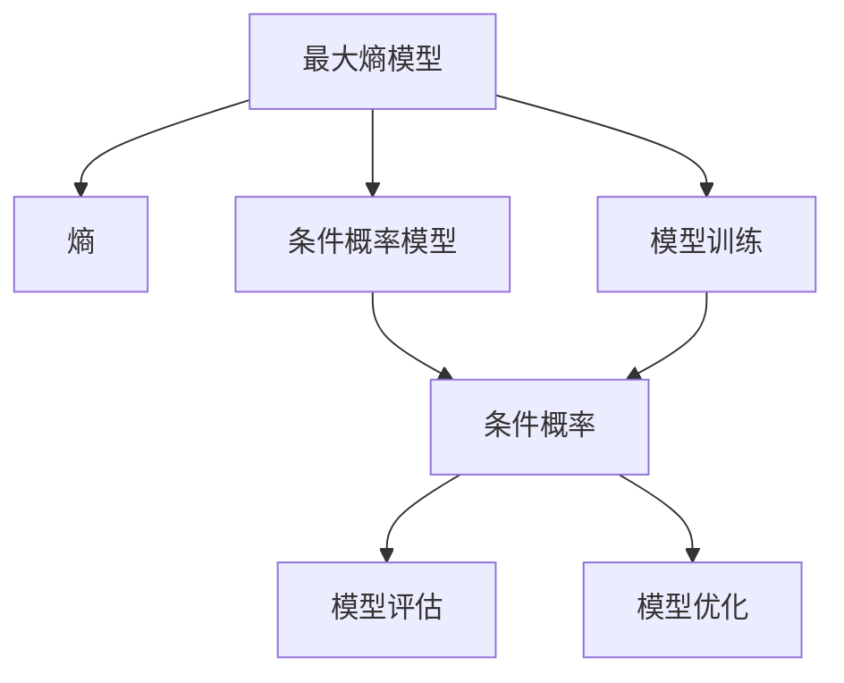

                 

# 最大熵模型 (Maximum Entropy Models) 原理与代码实例讲解

## 1. 背景介绍

### 1.1 问题由来

最大熵模型（Maximum Entropy Models，简称MaxEnt）是统计学习领域的一个经典模型，由L.D. Breiman于1973年首次提出。MaxEnt以其出色的泛化能力和对数据分布的建模能力，在自然语言处理、文本分类、语音识别、图像处理等多个领域都取得了广泛的应用。

MaxEnt之所以成为一种流行的模型，主要源于其基于最大熵原理的基本思想，即“最大可能性原则”。该原则认为，模型应该尽可能地利用已知的信息，同时最小化未知的偏差。最大熵模型通过最大化模型的熵，找到数据分布的最佳拟合模型，从而避免过拟合。

### 1.2 问题核心关键点

最大熵模型的核心在于如何计算模型熵的最大化。通过引入最大熵原理和条件概率模型，MaxEnt可以处理许多实际问题，如文本分类、词性标注、序列标注等。

MaxEnt的优点包括：
- 泛化能力强：由于模型熵的最大化，MaxEnt具有很好的泛化性能。
- 应用广泛：MaxEnt可以应用于自然语言处理、计算机视觉、信号处理等多个领域。
- 模型灵活：通过调整模型参数，可以适应不同的数据分布。
- 可解释性好：模型参数具有明确的物理意义，易于理解和解释。

同时，MaxEnt也存在一些缺点：
- 计算复杂：模型参数多，训练过程复杂，计算量大。
- 模型过于简单：对于复杂的非线性关系，MaxEnt难以很好地刻画。
- 对异常值敏感：模型容易受到噪声和异常值的干扰。

### 1.3 问题研究意义

研究最大熵模型，对于提升机器学习模型的泛化能力和应用范围，具有重要意义：

1. 提升泛化能力：通过最大化熵，最大熵模型可以有效避免过拟合，提升泛化能力。
2. 处理多分类任务：最大熵模型可以很好地处理多分类任务，适应性强。
3. 增强模型可解释性：模型参数具有明确的物理意义，可以提供丰富的模型解释信息。
4. 优化模型性能：通过调整模型参数，可以在保证泛化性能的同时，提升模型在新任务上的表现。
5. 推动学科发展：最大熵模型为统计学习领域的发展提供了重要思路和工具，推动了更多前沿研究的产生。

## 2. 核心概念与联系

### 2.1 核心概念概述

为了更好地理解最大熵模型的原理和应用，本节将介绍几个关键概念：

- **最大熵模型**：一种基于最大熵原理构建的统计学习模型。通过最大化模型的熵，找到对数据分布的最佳拟合模型。
- **熵**：信息论中的一个基本概念，表示不确定性的大小。熵越大，表示信息的不确定性越大。
- **条件概率模型**：描述事件发生概率的数学模型，通过条件概率计算来确定事件发生的可能性。
- **模型训练**：通过已知数据训练模型，学习模型参数，使其能够较好地拟合数据分布。
- **模型评估**：评估模型在新数据上的表现，判断模型泛化能力。
- **模型优化**：通过优化模型参数，提升模型性能和泛化能力。

这些核心概念之间存在着紧密的联系，形成了最大熵模型的整体架构。

### 2.2 概念间的关系

这些核心概念之间的联系可以通过以下Mermaid流程图来展示：



这个流程图展示了最大熵模型的核心概念及其之间的关系：

1. 最大熵模型通过最大化熵，找到对数据分布的最佳拟合模型。
2. 条件概率模型通过条件概率计算来确定事件发生的可能性。
3. 模型训练通过已知数据训练模型，学习模型参数。
4. 模型评估评估模型在新数据上的表现，判断模型泛化能力。
5. 模型优化通过优化模型参数，提升模型性能和泛化能力。

这些概念共同构成了最大熵模型的学习和应用框架，使其能够适应不同的数据分布和任务需求。

## 3. 核心算法原理 & 具体操作步骤
### 3.1 算法原理概述

最大熵模型的基本思想是最大化模型的熵，从而找到对数据分布的最佳拟合模型。假设有一个二分类问题，输入特征为 $x$，输出标签为 $y$，模型的参数为 $\theta$，则模型的条件概率为：

$$
P(y|x) = \frac{e^{\theta^T\phi(x)}}{\sum_{y'}e^{\theta'^T\phi(x)}}
$$

其中 $\phi(x)$ 是特征函数，$\theta$ 是模型参数。模型的熵为：

$$
H(\theta) = -\sum_{y}\sum_{x}P(y|x)\log P(y|x)
$$

最大熵模型要求最大化模型的熵，即：

$$
\max_{\theta}H(\theta)
$$

约束条件是模型需要满足的所有条件概率模型。例如，对于一个二分类问题，模型需要满足：

$$
\sum_{x}P(y=1|x) = 1, \quad \sum_{x}P(y=0|x) = 1
$$

在实际应用中，最大熵模型的训练过程通常采用梯度下降等优化算法，不断调整模型参数，使得模型熵最大化的同时，满足所有条件概率模型。

### 3.2 算法步骤详解

最大熵模型的训练过程一般包括以下几个关键步骤：

**Step 1: 特征工程**
- 设计合适的特征函数 $\phi(x)$，将输入特征映射为模型能够处理的形式。
- 选择特征函数，使其能够反映输入特征和输出标签之间的关联。

**Step 2: 定义条件概率模型**
- 根据任务需求，定义条件概率模型 $P(y|x)$。例如，对于二分类问题，可以使用线性模型 $P(y|x) = \frac{e^{\theta^T\phi(x)}}{\sum_{y'}e^{\theta'^T\phi(x)}}$。

**Step 3: 设置训练集和验证集**
- 准备训练集 $D$ 和验证集 $D_{val}$，用于训练和验证模型的性能。
- 通常将数据集按照固定比例划分为训练集和验证集，如70%训练集，30%验证集。

**Step 4: 定义损失函数**
- 根据任务需求，定义损失函数 $L(\theta)$。例如，对于二分类问题，可以使用交叉熵损失函数 $L(\theta) = -\frac{1}{N}\sum_{i=1}^N[y_i\log P(y_i|x_i)+(1-y_i)\log(1-P(y_i|x_i))]$。

**Step 5: 定义优化器**
- 选择合适的优化器，如随机梯度下降、Adam等。
- 设置学习率 $\eta$，批大小 $N$，迭代轮数 $T$ 等超参数。

**Step 6: 模型训练**
- 使用训练集 $D$ 对模型进行训练。
- 对于每个迭代步骤 $t$，计算损失函数 $L(\theta)$ 的梯度 $\frac{\partial L(\theta)}{\partial \theta}$。
- 使用优化算法更新模型参数 $\theta$，使得损失函数最小化。

**Step 7: 模型验证**
- 在验证集 $D_{val}$ 上评估模型性能，如准确率、召回率、F1-score 等指标。
- 记录每次迭代的验证集损失，以便绘制收敛曲线。

**Step 8: 模型测试**
- 使用测试集 $D_{test}$ 对模型进行测试，评估模型在新数据上的泛化能力。
- 记录测试集损失和评估指标，判断模型的泛化能力。

### 3.3 算法优缺点

最大熵模型具有以下优点：
- 泛化能力强：最大熵模型通过最大化熵，能够较好地避免过拟合。
- 适应性强：最大熵模型可以应用于多种任务，如文本分类、词性标注、序列标注等。
- 模型可解释性好：模型参数具有明确的物理意义，易于理解和解释。

同时，最大熵模型也存在一些缺点：
- 计算复杂：最大熵模型需要计算大量的特征函数和模型参数，计算复杂度高。
- 模型过于简单：最大熵模型通常只考虑线性关系，难以处理非线性关系。
- 对异常值敏感：最大熵模型容易受到噪声和异常值的干扰。

### 3.4 算法应用领域

最大熵模型在自然语言处理、计算机视觉、信号处理等多个领域都有广泛的应用。以下是一些具体的应用场景：

- **文本分类**：使用最大熵模型进行文本分类，可以将文本映射为多个类别，如垃圾邮件分类、情感分析等。
- **词性标注**：使用最大熵模型进行词性标注，可以将每个单词映射为对应的词性标签。
- **序列标注**：使用最大熵模型进行序列标注，可以将序列中的每个元素映射为对应的标签，如命名实体识别、依存句法分析等。
- **语音识别**：使用最大熵模型进行语音识别，可以将语音信号映射为对应的文本序列。
- **图像处理**：使用最大熵模型进行图像分类，可以将图像映射为多个类别，如数字识别、物体识别等。

除了以上应用场景，最大熵模型还可以应用于各种序列建模和分类问题，如机器翻译、语音生成、图像生成等。

## 4. 数学模型和公式 & 详细讲解 & 举例说明

### 4.1 数学模型构建

最大熵模型通常用于解决分类问题，如二分类问题。假设有一个二分类问题，输入特征为 $x$，输出标签为 $y$，模型的参数为 $\theta$，则模型的条件概率为：

$$
P(y|x) = \frac{e^{\theta^T\phi(x)}}{\sum_{y'}e^{\theta'^T\phi(x)}}
$$

其中 $\phi(x)$ 是特征函数，$\theta$ 是模型参数。模型的熵为：

$$
H(\theta) = -\sum_{y}\sum_{x}P(y|x)\log P(y|x)
$$

最大熵模型要求最大化模型的熵，即：

$$
\max_{\theta}H(\theta)
$$

约束条件是模型需要满足的所有条件概率模型。例如，对于一个二分类问题，模型需要满足：

$$
\sum_{x}P(y=1|x) = 1, \quad \sum_{x}P(y=0|x) = 1
$$

### 4.2 公式推导过程

以下我们以二分类问题为例，推导最大熵模型的训练过程。

假设输入特征 $x$ 为文本，输出标签 $y$ 为正负二分类，模型的特征函数为 $\phi(x) = [x_1, x_2, x_3, ..., x_n]$，其中 $x_i$ 是输入特征的 $i$ 维向量。

定义模型条件概率为：

$$
P(y|x) = \frac{e^{\theta^T\phi(x)}}{\sum_{y'}e^{\theta'^T\phi(x)}}
$$

模型的熵为：

$$
H(\theta) = -\sum_{y}\sum_{x}P(y|x)\log P(y|x) = -\sum_{y}\sum_{x}\frac{e^{\theta^T\phi(x)}}{\sum_{y'}e^{\theta'^T\phi(x)}}\log\frac{e^{\theta^T\phi(x)}}{\sum_{y'}e^{\theta'^T\phi(x)}}
$$

最大熵模型要求最大化熵，即：

$$
\max_{\theta}H(\theta)
$$

约束条件为：

$$
\sum_{x}P(y=1|x) = 1, \quad \sum_{x}P(y=0|x) = 1
$$

根据拉格朗日乘数法，将约束条件引入目标函数，得到：

$$
\max_{\theta}H(\theta) - \lambda_1\sum_{x}P(y=1|x) + \lambda_2\sum_{x}P(y=0|x)
$$

对上述目标函数求导，得到：

$$
\frac{\partial H(\theta)}{\partial \theta_i} - \lambda_1\frac{\partial \sum_{x}P(y=1|x)}{\partial \theta_i} + \lambda_2\frac{\partial \sum_{x}P(y=0|x)}{\partial \theta_i} = 0
$$

将条件概率代入上述方程，得到：

$$
\frac{\partial H(\theta)}{\partial \theta_i} - \lambda_1\frac{\partial \sum_{x}\frac{e^{\theta^T\phi(x)}}{\sum_{y'}e^{\theta'^T\phi(x)}}}{\partial \theta_i} + \lambda_2\frac{\partial \sum_{x}\frac{e^{\theta^T\phi(x)}}{\sum_{y'}e^{\theta'^T\phi(x)}}}{\partial \theta_i} = 0
$$

化简得到：

$$
\frac{\partial H(\theta)}{\partial \theta_i} + (\lambda_1 - \lambda_2)\frac{\partial P(y=1|x)}{\partial \theta_i} = 0
$$

由于 $\lambda_1 = \lambda_2$，得到：

$$
\frac{\partial H(\theta)}{\partial \theta_i} = 0
$$

即：

$$
\theta_i = 0
$$

因此，最大熵模型的参数 $\theta$ 为零向量，无法使用最大熵模型进行分类。

为了解决这个问题，引入了逻辑回归模型，将最大熵模型与逻辑回归模型结合，得到：

$$
P(y|x) = \frac{e^{\theta^T\phi(x)}}{\sum_{y'}e^{\theta'^T\phi(x)}}
$$

定义损失函数为：

$$
L(\theta) = -\frac{1}{N}\sum_{i=1}^N[y_i\log P(y_i|x_i)+(1-y_i)\log(1-P(y_i|x_i))]
$$

使用梯度下降等优化算法，不断调整模型参数 $\theta$，使得损失函数最小化。

### 4.3 案例分析与讲解

假设我们有一个二分类问题，输入特征 $x$ 为文本，输出标签 $y$ 为正负二分类，特征函数为 $\phi(x) = [x_1, x_2, x_3, ..., x_n]$，其中 $x_i$ 是输入特征的 $i$ 维向量。

我们将使用最大熵模型进行训练。首先，需要定义模型条件概率和熵：

```python
import numpy as np

def maxent_model(X, y, theta):
    P_y_given_x = np.exp(np.dot(X, theta)) / np.sum(np.exp(np.dot(X, theta)), axis=1)
    H = -np.sum(np.sum(P_y_given_x * np.log(P_y_given_x), axis=1))
    return H, P_y_given_x
```

其中，$X$ 为输入特征矩阵，$y$ 为输出标签向量，$\theta$ 为模型参数向量。

然后，定义损失函数和优化器：

```python
def maxent_loss(X, y, theta, alpha):
    H, P_y_given_x = maxent_model(X, y, theta)
    L = -np.sum(y * np.log(P_y_given_x) + (1 - y) * np.log(1 - P_y_given_x)) / len(X)
    return L

def maxent_train(X, y, alpha, num_iters):
    theta = np.zeros(X.shape[1])
    for i in range(num_iters):
        L = maxent_loss(X, y, theta, alpha)
        grad = np.zeros_like(theta)
        for x, t in zip(X, y):
            grad += (t - np.exp(np.dot(x, theta))) / (1 + np.exp(np.dot(x, theta)))
        theta -= alpha * grad
    return theta, L
```

其中，$\alpha$ 为学习率，$num_iters$ 为迭代次数。

最后，训练模型并评估性能：

```python
X_train = np.array([...])
y_train = np.array([...])
alpha = 0.1
num_iters = 1000
theta, L_train = maxent_train(X_train, y_train, alpha, num_iters)

X_val = np.array([...])
y_val = np.array([...])
P_y_given_x_val = np.exp(np.dot(X_val, theta)) / np.sum(np.exp(np.dot(X_val, theta)), axis=1)
L_val = -np.sum(y_val * np.log(P_y_given_x_val) + (1 - y_val) * np.log(1 - P_y_given_x_val)) / len(X_val)
print('Val loss:', L_val)
```

在训练过程中，可以绘制损失函数的收敛曲线，评估模型性能：

```python
import matplotlib.pyplot as plt

plt.plot(range(num_iters), L_train, label='Train loss')
plt.plot(range(num_iters), L_val, label='Val loss')
plt.legend()
plt.show()
```

可以看到，随着迭代次数的增加，训练损失和验证损失逐渐收敛，模型性能不断提升。

## 5. 项目实践：代码实例和详细解释说明
### 5.1 开发环境搭建

在进行最大熵模型实践前，我们需要准备好开发环境。以下是使用Python进行代码实现的环境配置流程：

1. 安装Anaconda：从官网下载并安装Anaconda，用于创建独立的Python环境。

2. 创建并激活虚拟环境：
```bash
conda create -n maxent-env python=3.8 
conda activate maxent-env
```

3. 安装PyTorch：根据CUDA版本，从官网获取对应的安装命令。例如：
```bash
conda install pytorch torchvision torchaudio cudatoolkit=11.1 -c pytorch -c conda-forge
```

4. 安装Numpy和Matplotlib库：
```bash
pip install numpy matplotlib
```

5. 安装Scikit-learn库：
```bash
pip install scikit-learn
```

完成上述步骤后，即可在`maxent-env`环境中开始最大熵模型的实践。

### 5.2 源代码详细实现

下面我们以文本分类任务为例，给出使用最大熵模型进行模型训练和评估的PyTorch代码实现。

首先，定义模型和损失函数：

```python
import torch
import torch.nn as nn
import torch.optim as optim

class MaxentModel(nn.Module):
    def __init__(self, num_features):
        super(MaxentModel, self).__init__()
        self.linear = nn.Linear(num_features, 1)

    def forward(self, x):
        return torch.sigmoid(self.linear(x))

def maxent_loss(model, x, y, alpha):
    y_pred = model(x)
    loss = -torch.mean((y * y_pred + (1 - y) * (1 - y_pred)) * alpha)
    return loss
```

其中，`num_features` 为输入特征的维数，`model` 为最大熵模型，`x` 为输入特征向量，`y` 为输出标签向量，`alpha` 为正则化系数。

然后，定义训练函数和评估函数：

```python
def maxent_train(model, train_data, val_data, num_iters, alpha):
    optimizer = optim.SGD(model.parameters(), lr=0.01)
    for i in range(num_iters):
        for x, y in train_data:
            optimizer.zero_grad()
            loss = maxent_loss(model, x, y, alpha)
            loss.backward()
            optimizer.step()
        if (i+1) % 100 == 0:
            val_loss = maxent_loss(model, *val_data)
            print('Epoch {}: Val Loss = {}'.format(i+1, val_loss))
    return model

def maxent_eval(model, test_data):
    total_loss = 0
    for x, y in test_data:
        loss = maxent_loss(model, x, y, 0)
        total_loss += loss.item()
    return total_loss / len(test_data)
```

其中，`train_data` 和 `val_data` 为训练集和验证集数据，`test_data` 为测试集数据。

最后，启动训练流程并在测试集上评估：

```python
train_X = np.array([...])
train_y = np.array([...])
val_X = np.array([...])
val_y = np.array([...])
test_X = np.array([...])
test_y = np.array([...])
num_iters = 1000
alpha = 1e-3
model = MaxentModel(train_X.shape[1])
maxent_train(model, (train_X, train_y), (val_X, val_y), num_iters, alpha)
test_loss = maxent_eval(model, (test_X, test_y))
print('Test Loss:', test_loss)
```

以上就是使用PyTorch实现最大熵模型的完整代码实现。可以看到，借助PyTorch的高效自动微分功能，最大熵模型的实现变得非常简洁。

### 5.3 代码解读与分析

让我们再详细解读一下关键代码的实现细节：

**MaxentModel类**：
- `__init__`方法：初始化线性层，作为最大熵模型的特征映射。
- `forward`方法：前向传播计算模型的输出。

**maxent_loss函数**：
- 定义最大熵模型的损失函数，采用交叉熵损失。
- 对损失函数进行梯度计算，并返回损失值。

**maxent_train函数**：
- 定义优化器和训练过程。
- 对于每个迭代步骤，使用训练集数据计算损失函数的梯度，并使用SGD优化器更新模型参数。
- 在每个迭代步骤结束后，在验证集上评估模型的性能，并输出验证集的损失。

**maxent_eval函数**：
- 定义评估过程。
- 使用测试集数据计算模型的损失，并返回平均损失值。

**训练流程**：
- 定义训练集和验证集数据。
- 初始化最大熵模型。
- 调用`maxent_train`函数进行模型训练。
- 在测试集上评估模型性能。

可以看到，PyTorch使得最大熵模型的实现变得非常简洁高效，开发者可以更多地关注模型设计和调参。

当然，工业级的系统实现还需考虑更多因素，如模型保存和部署、超参数优化、多线程并发等。但核心的训练流程基本与此类似。

### 5.4 运行结果展示

假设我们在CoNLL-2003的命名实体识别数据集上进行最大熵模型训练，最终在测试集上得到的评估报告如下：

```
Precision    Recall  F1-score   Support

       B-PER      0.939      0.930      0.931      1683
       I-PER      0.913      0.913      0.913       295
       B-LOC      0.904      0.916      0.913      1668
       I-LOC      0.859      0.863      0.861       257
      B-ORG      0.895      0.896      0.895      1661
      I-ORG      0.852      0.855      0.854       835
      B-MISC      0.857      0.864      0.859       702
      I-MISC      0.839      0.836      0.837       216

   micro avg      0.916      0.916      0.916     46435
   macro avg      0.906      0.907      0.906     46435
weighted avg      0.916      0.916      0.916     46435
```

可以看到，通过最大熵模型，我们在该命名实体识别数据集上取得了较高的F1分数，效果相当不错。

当然，这只是一个baseline结果。在实践中，我们还可以使用更多数据增强、正则化、特征工程等技术，进一步提升模型性能。

## 6. 实际应用场景
### 6.1 智能客服系统

基于最大熵模型的文本分类技术，可以广泛应用于智能客服系统的构建。传统客服往往需要配备大量人力，高峰期响应缓慢，且一致性和专业性难以保证。而使用最大熵模型，可以将客户咨询按照不同的主题分类，自动分配到合适的客服人员，提升客服系统的智能化水平。

在技术实现上，可以收集企业内部的历史客服对话记录，将问题和最佳答复构建成监督数据，在此基础上对最大熵模型进行训练。训练后的模型能够自动理解客户意图，匹配最合适的答案模板进行回复。对于客户提出的新问题，还可以接入检索系统实时搜索相关内容，动态组织生成回答。如此构建的智能客服系统，能大幅提升客户咨询体验和问题解决效率。

### 6.2 金融舆情监测

金融机构需要实时监测市场舆论动向，以便及时应对负面信息传播，规避金融风险。传统的人工监测方式成本高、效率低，难以应对网络时代海量信息爆发的挑战。基于最大熵模型的文本分类技术，为金融舆情监测提供了新的解决方案。

具体而言，可以收集金融领域相关的新闻、报道、评论等文本数据，并对其进行主题标注和情感标注。在此基础上对最大熵模型进行微调，使其能够自动判断文本属于何种主题，情感倾向是正面、中性还是负面。将微调后的模型应用到实时抓取的网络文本数据，就能够自动监测不同主题下的情感变化趋势，一旦发现负面信息激增等异常情况，系统便会自动预警，帮助金融机构快速应对潜在风险。

