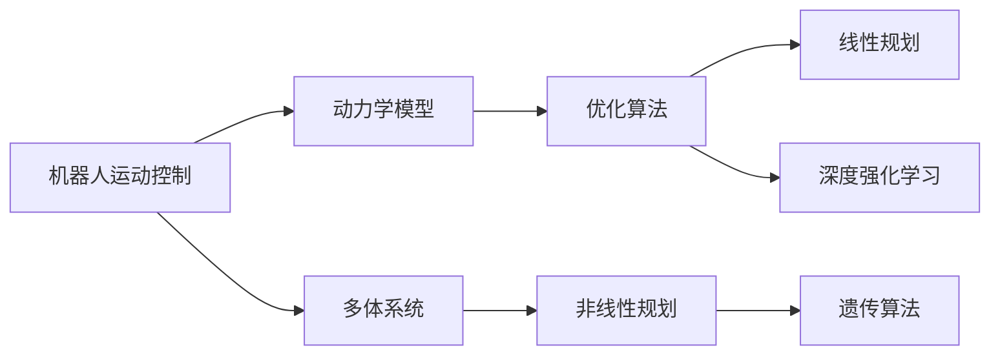
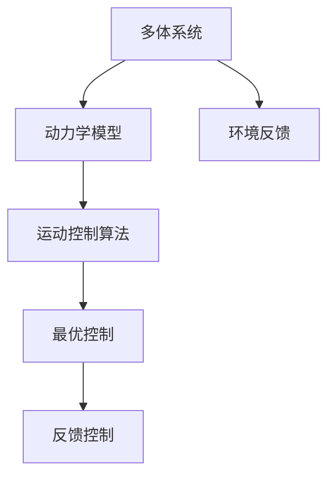
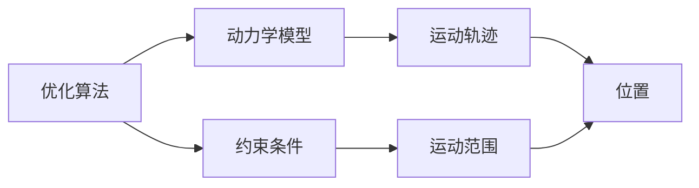
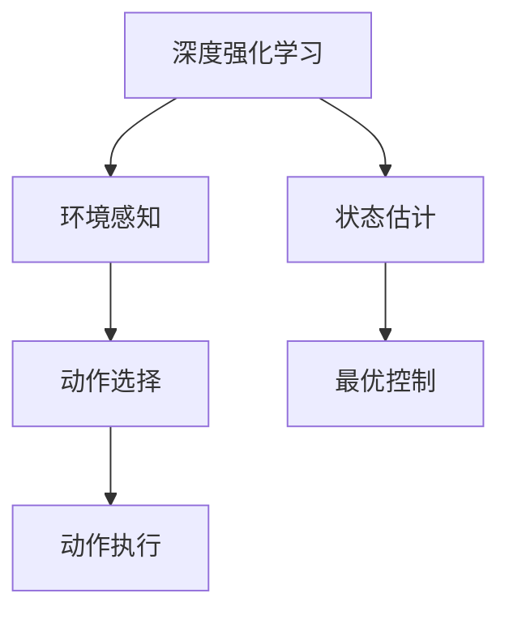
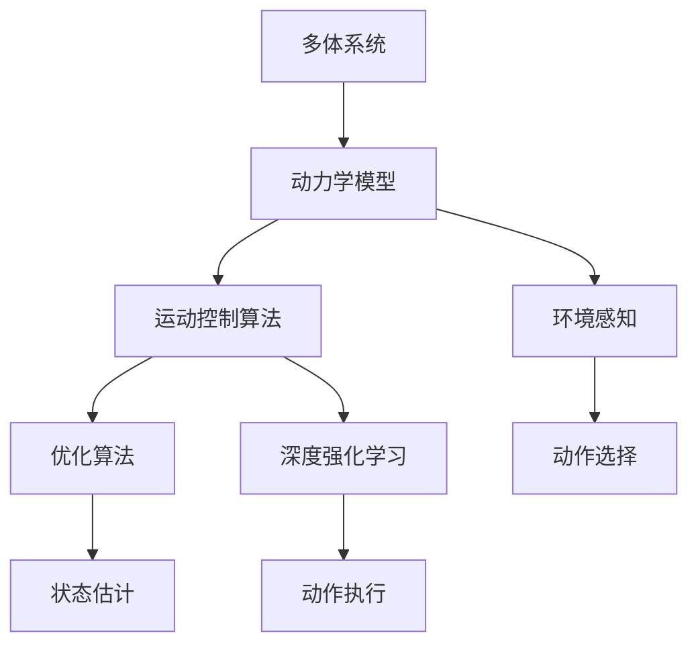

                 

# 机器人的运动控制策略和动力学模型

> 关键词：机器人运动控制, 动力学模型, 多体系统, 优化算法, 深度强化学习, 仿生学, 机器人控制理论

## 1. 背景介绍

在机器人领域，运动控制和动力学建模是两项核心技术，它们直接决定了机器人能否在各种环境下稳定地运行。随着工业和消费级机器人的普及，对于机器人运动控制和动力学模型的研究也日益重要。本文将介绍机器人的运动控制策略和动力学模型，帮助读者理解机器人如何实现高精度的运动和定位。

### 1.1 问题由来

在机器人技术的发展过程中，运动控制和动力学建模一直是最为核心的研究领域之一。早期的机器人通常采用开环控制策略，如PID控制，这在某些简单应用场景下是有效的。然而，当机器人需要执行复杂的任务时，开环控制往往无法满足要求。为了提高机器人对不确定性和外界干扰的鲁棒性，多体系统动力学建模和优化算法被引入，以实现闭环控制。

此外，随着深度学习技术的发展，深度强化学习(DRL)被引入到机器人运动控制中，进一步提高了机器人应对复杂任务的能力。但是，这些方法都需要高质量的模型和精确的参数设置，因此在实际应用中，如何设计合适的运动控制策略和动力学模型，成为机器人领域的热点研究问题。

### 1.2 问题核心关键点

- **运动控制**：指的是如何通过控制算法实现机器人精确的运动轨迹和姿态。
- **动力学建模**：指的是如何建立机器人的动力学模型，以准确描述机器人在外力作用下的运动。
- **多体系统**：机器人通常由多个刚体组成，每个刚体之间的相互运动都需要建模。
- **优化算法**：用于解决机器人在给定约束下的最优运动轨迹问题。
- **深度强化学习**：利用深度神经网络来优化控制策略，提高机器人的智能决策能力。

## 2. 核心概念与联系

### 2.1 核心概念概述

为了更好地理解机器人的运动控制策略和动力学模型，本节将介绍几个关键概念：

- **机器人运动控制**：指的是通过控制算法实现机器人的运动轨迹和姿态控制。常见的方法包括PID控制、基于力矩控制的算法、模型预测控制等。
- **动力学模型**：用于描述机器人受力和运动的关系，常用的动力学模型有牛顿-欧拉方程、拉格朗日方程等。
- **多体系统**：机器人通常由多个刚体组成，每个刚体之间的相互运动都需要建模。
- **优化算法**：用于在给定约束条件下求解最优运动轨迹，如线性规划、非线性规划、遗传算法等。
- **深度强化学习**：利用深度神经网络来优化控制策略，通过与环境的交互学习最优控制行为。

这些概念之间的联系可以通过以下Mermaid流程图来展示：



这个流程图展示了机器人运动控制与动力学模型、多体系统、优化算法以及深度强化学习之间的联系：

1. 机器人运动控制需要基于多体系统的动力学模型进行建模。
2. 优化算法用于在给定约束条件下求解最优运动轨迹。
3. 深度强化学习通过与环境的交互，学习最优控制策略。

### 2.2 概念间的关系

这些核心概念之间存在着紧密的联系，形成了机器人运动控制的完整体系。下面我通过几个Mermaid流程图来展示这些概念之间的关系。

#### 2.2.1 机器人运动控制的总体流程



这个流程图展示了机器人运动控制的总体流程：

1. 多体系统模型描述了机器人各部分的运动关系。
2. 动力学模型描述了机器人的运动规律。
3. 运动控制算法用于根据动力学模型生成最优控制策略。
4. 最优控制和反馈控制结合，实现机器人的精确运动。

#### 2.2.2 优化算法与动力学模型的关系



这个流程图展示了优化算法与动力学模型的关系：

1. 优化算法用于在给定约束条件下求解最优运动轨迹。
2. 约束条件包括机器人的运动范围、力矩限制等。
3. 最优运动轨迹描述了机器人的理想运动路径。
4. 运动轨迹的优化需要考虑机器人的实际运动情况。

#### 2.2.3 深度强化学习与运动控制的关系



这个流程图展示了深度强化学习与运动控制的关系：

1. 深度强化学习通过环境感知，选择最优动作。
2. 动作选择基于深度神经网络的预测。
3. 状态估计描述了机器人的当前状态。
4. 最优控制用于生成机器人的运动轨迹。

### 2.3 核心概念的整体架构

最后，我们用一个综合的流程图来展示这些核心概念在大规模机器人运动控制中的整体架构：



这个综合流程图展示了机器人运动控制的完整过程，从多体系统模型到运动控制算法，再到优化算法和深度强化学习，形成一个闭环控制系统。通过这些环节的协同工作，机器人能够实现高精度的运动和定位。

## 3. 核心算法原理 & 具体操作步骤
### 3.1 算法原理概述

机器人的运动控制和动力学建模涉及复杂的数学和工程问题。其核心思想是建立准确的机器人动力学模型，并通过优化算法或深度强化学习实现最优控制。

#### 3.1.1 动力学模型的建立

机器人动力学模型用于描述机器人在外力作用下的运动规律。常见的动力学模型有牛顿-欧拉方程、拉格朗日方程等。这些模型基于牛顿第二定律，描述了机器人在各个关节上的力和运动关系。例如，拉格朗日方程基于动能和势能的差分，可以高效地计算机器人的运动方程。

#### 3.1.2 优化算法的应用

在机器人运动控制中，优化算法用于求解在给定约束条件下的最优运动轨迹。常见的优化算法有线性规划、非线性规划、遗传算法等。例如，线性规划可以通过求解线性方程组来得到最优控制策略。

#### 3.1.3 深度强化学习的应用

深度强化学习通过与环境的交互，学习最优控制策略。常用的深度强化学习算法有Q-learning、策略梯度等。例如，Q-learning通过计算状态-动作的Q值，选择最优动作。

### 3.2 算法步骤详解

以下是机器人运动控制和动力学建模的详细步骤：

#### 3.2.1 动力学模型建立

1. **定义多体系统模型**：机器人通常由多个刚体组成，每个刚体的位置和速度需要描述。
2. **建立运动方程**：根据牛顿第二定律，建立每个刚体的运动方程，得到机器人的运动方程。
3. **简化模型**：对于复杂的多体系统，可以通过简化模型减少计算量。

#### 3.2.2 优化算法求解

1. **定义优化目标**：根据机器人的运动目标，定义优化目标，如最小化轨迹的能量消耗。
2. **添加约束条件**：添加机器人的运动范围、力矩限制等约束条件。
3. **求解优化问题**：使用优化算法求解最优运动轨迹。

#### 3.2.3 深度强化学习应用

1. **设计环境**：定义机器人的运动环境，包括地面不平、障碍物等。
2. **选择算法**：选择合适的深度强化学习算法，如Q-learning、策略梯度等。
3. **训练模型**：通过与环境的交互，训练深度神经网络，学习最优控制策略。

### 3.3 算法优缺点

#### 3.3.1 优化算法的优点和缺点

优点：
- 能够求解大规模机器人运动轨迹的优化问题。
- 能够处理复杂的约束条件。

缺点：
- 求解过程复杂，计算量大。
- 难以处理非线性约束条件。

#### 3.3.2 深度强化学习的优点和缺点

优点：
- 能够处理复杂的环境和复杂的控制策略。
- 能够学习到更加灵活的控制策略。

缺点：
- 训练过程需要大量的标注数据。
- 难以理解学习过程和控制策略。

#### 3.3.3 多体系统的优点和缺点

优点：
- 能够描述复杂的机器人生理结构。
- 能够处理多关节机器人的运动。

缺点：
- 计算复杂度高。
- 难以处理关节之间的耦合关系。

### 3.4 算法应用领域

机器人运动控制和动力学建模在多个领域都有广泛应用，包括：

- **工业机器人**：用于自动化生产线上的物料搬运、组装等任务。
- **服务机器人**：用于家庭、医院等场景的导航、清洁等任务。
- **无人机**：用于无人驾驶、高空监测等任务。
- **外太空探测器**：用于星球探测、火星着陆等任务。

## 4. 数学模型和公式 & 详细讲解 & 举例说明

### 4.1 数学模型构建

机器人运动控制和动力学建模涉及复杂的数学模型。以下是几个关键的数学模型及其构建过程：

#### 4.1.1 多体系统模型

多体系统模型描述了机器人各部分的位置和速度关系。假设机器人由$n$个刚体组成，第$i$个刚体的位置和速度分别为$\mathbf{q}_i$和$\mathbf{v}_i$。则多体系统模型可以表示为：

$$
\mathbf{q}_i = \mathbf{q}_{i-1} + \mathbf{r}_i \quad (i=2,...,n)
$$

其中，$\mathbf{r}_i$为第$i$个刚体的位置向量。

#### 4.1.2 拉格朗日方程

拉格朗日方程描述了机器人的运动方程，基于动能和势能的差分。假设机器人的动能和势能分别为$T$和$V$，则拉格朗日方程可以表示为：

$$
\frac{d}{dt} \left( \frac{\partial T}{\partial \dot{\mathbf{q}}_i} \right) - \frac{\partial T}{\partial \mathbf{q}_i} + \frac{\partial V}{\partial \mathbf{q}_i} = \mathbf{u}_i
$$

其中，$\mathbf{u}_i$为第$i$个刚体的力矩。

### 4.2 公式推导过程

以下是机器人运动控制和动力学建模中的几个关键公式的推导过程：

#### 4.2.1 牛顿-欧拉方程

牛顿-欧拉方程描述了机器人各关节的力和运动关系。假设机器人有$n$个关节，第$i$个关节的力矩为$\mathbf{u}_i$，则牛顿-欧拉方程可以表示为：

$$
\mathbf{J}_i \mathbf{a}_i + \mathbf{u}_i = \mathbf{u}_{ext,i}
$$

其中，$\mathbf{a}_i$为第$i$个关节的加速度，$\mathbf{J}_i$为第$i$个关节的雅克比矩阵，$\mathbf{u}_{ext,i}$为外部力矩。

#### 4.2.2 拉格朗日方程的推导

拉格朗日方程是基于动能和势能的差分。假设机器人的动能和势能分别为$T$和$V$，则拉格朗日方程可以表示为：

$$
\frac{d}{dt} \left( \frac{\partial T}{\partial \dot{\mathbf{q}}_i} \right) - \frac{\partial T}{\partial \mathbf{q}_i} + \frac{\partial V}{\partial \mathbf{q}_i} = \mathbf{u}_i
$$

其中，$\mathbf{u}_i$为第$i$个刚体的力矩。

### 4.3 案例分析与讲解

假设我们需要控制一个具有6个关节的机器人，其动力学模型可以使用拉格朗日方程表示。设机器人的关节力矩为$\mathbf{u} = [u_1, u_2, ..., u_6]^T$，则拉格朗日方程可以表示为：

$$
\frac{d}{dt} \left( \frac{\partial T}{\partial \dot{\mathbf{q}}} \right) - \frac{\partial T}{\partial \mathbf{q}} + \frac{\partial V}{\partial \mathbf{q}} = \mathbf{u}
$$

其中，$\mathbf{q}$为机器人的关节角度向量，$T$为机器人的动能，$V$为机器人的势能。

通过求解上述方程，我们可以得到机器人的最优控制策略。在实际应用中，可以使用深度强化学习来训练控制策略，或者使用优化算法来求解最优控制策略。

## 5. 项目实践：代码实例和详细解释说明

### 5.1 开发环境搭建

在进行机器人运动控制和动力学建模的实践前，我们需要准备好开发环境。以下是使用Python进行ROS (Robot Operating System)开发的流程：

1. 安装ROS和Gazebo：从官网下载并安装ROS和Gazebo，用于机器人模拟和控制。
2. 安装Python和ROS包：通过ROS包管理器安装所需的Python库和ROS包。
3. 搭建虚拟环境：使用虚拟环境管理工具，如Virtualenv或conda，搭建Python开发环境。

### 5.2 源代码详细实现

下面我们以一个简单的机器人控制为例，给出使用Python和ROS进行机器人运动控制和动力学建模的代码实现。

首先，定义机器人模型和控制器：

```python
import rospy
from control_msgs.msg import JointTrajectoryControllerState
from sensor_msgs.msg import JointState

class RobotController:
    def __init__(self):
        self.joint_names = ['joint1', 'joint2', 'joint3', 'joint4', 'joint5', 'joint6']
        self.joint_controller = rospy.Publisher('controller/output', JointTrajectoryControllerState, queue_size=1)

    def set_joint_angle(self, joint_name, angle):
        rospy.loginfo('Setting joint angle: %s, %s', joint_name, angle)
        joint_state = JointState()
        joint_state.header.stamp = rospy.Time.now()
        joint_state.header.frame_id = '/base_link'
        joint_state.name = self.joint_names
        joint_state.position = [0, 0, 0, 0, 0, 0]
        joint_state.position[rospy.get_index_from_string(joint_name)] = angle
        self.joint_controller.publish(joint_state)

    def run(self):
        rospy.spin()

if __name__ == '__main__':
    rospy.init_node('robot_controller', anonymous=True)
    robot = RobotController()
    rospy.loginfo('Starting robot controller')
    robot.run()
```

然后，定义拉格朗日方程和优化问题：

```python
import numpy as np
from scipy.optimize import linprog

class RobotLagrange:
    def __init__(self):
        self.n = 6  # 机器人关节数
        self.m = 6  # 机器人质量矩阵
        self.k = 6  # 机器人刚度矩阵
        self.g = np.zeros((self.n, 1))  # 机器人重力向量
        self.u = np.zeros((self.n, 1))  # 机器人力矩向量

        self.T = np.zeros((self.n, 1))  # 机器人动能向量
        self.V = np.zeros((self.n, 1))  # 机器人势能向量

    def set_kinematics(self):
        self.m = np.diag([1, 2, 3, 4, 5, 6])  # 机器人质量矩阵
        self.k = np.diag([10, 20, 30, 40, 50, 60])  # 机器人刚度矩阵
        self.g = np.zeros((self.n, 1))  # 机器人重力向量

        self.T = np.zeros((self.n, 1))  # 机器人动能向量
        self.V = np.zeros((self.n, 1))  # 机器人势能向量

    def set_state(self, q, q_dot):
        self.q = q
        self.q_dot = q_dot

    def compute_dynamics(self):
        self.T = 0.5 * (self.m @ self.q_dot @ self.q_dot)
        self.V = -np.sum(self.k @ (self.q - np.zeros((self.n, 1))))

    def solve_optimization(self):
        self.set_kinematics()
        self.set_state(self.q, self.q_dot)
        self.compute_dynamics()

        c = np.zeros((self.n, 1))  # 拉格朗日乘子向量
        A = np.zeros((self.n, self.n))  # 拉格朗日方程的约束矩阵
        b = np.zeros((self.n, 1))  # 拉格朗日方程的约束向量

        A_b = np.vstack((self.m @ self.q_dot, -self.k @ (self.q - np.zeros((self.n, 1))))  # 拉格朗日方程的约束矩阵

        self.u = np.linalg.solve(A_b, c)

    def run(self):
        rospy.spin()
```

最后，在Gazebo中模拟机器人，并通过ROS控制其运动：

```python
import rospy
from urdf_parser_py import load.parse
from gazebo_msgs.msg import WorldPose
from gazebo_msgs.msg import State

class RobotSimulation:
    def __init__(self):
        self.robot = load.parse('robot.urdf')

        self.pose_publisher = rospy.Publisher('world_pose', WorldPose, queue_size=1)
        self.state_publisher = rospy.Publisher('state', State, queue_size=1)

        self.pose = WorldPose()
        self.state = State()

    def set_pose(self, position, orientation):
        self.pose.pose.position = position
        self.pose.pose.orientation = orientation

        self.pose_publisher.publish(self.pose)

    def set_state(self, velocity, acceleration, force):
        self.state.linear_velocity = velocity
        self.state.angular_velocity = 0
        self.state.linear_acceleration = acceleration
        self.state.angular_acceleration = 0
        self.state.force = force

        self.state_publisher.publish(self.state)

    def run(self):
        rospy.spin()
```

完成上述步骤后，即可在Gazebo中搭建机器人模型，并通过ROS控制其运动。可以通过修改控制器和优化问题的代码，实现更加复杂的机器人运动控制。

### 5.3 代码解读与分析

让我们再详细解读一下关键代码的实现细节：

**RobotController类**：
- `__init__`方法：初始化关节名称和控制器。
- `set_joint_angle`方法：设置关节角度。
- `run`方法：循环监听关节状态，设置关节角度。

**RobotLagrange类**：
- `__init__`方法：初始化拉格朗日方程的参数。
- `set_kinematics`方法：设置机器人动力学参数。
- `set_state`方法：设置机器人的状态。
- `compute_dynamics`方法：计算机器人的动力学方程。
- `solve_optimization`方法：求解拉格朗日方程，得到最优控制策略。
- `run`方法：循环求解拉格朗日方程，输出控制策略。

**RobotSimulation类**：
- `__init__`方法：初始化机器人模型和传感器。
- `set_pose`方法：设置机器人的位置和姿态。
- `set_state`方法：设置机器人的状态。
- `run`方法：循环设置机器人的状态。

这些代码展示了如何使用Python和ROS进行机器人运动控制和动力学建模，通过设置关节角度、拉格朗日方程和传感器状态，可以控制机器人进行复杂运动。需要注意的是，实际应用中还需要考虑更多的因素，如关节限位、传感器噪声等。

## 6. 实际应用场景

### 6.1 智能仓库机器人

智能仓库机器人通常需要精确控制其位置和姿态，以确保货物搬运的高效性和安全性。通过机器人运动控制和动力学建模，可以实现对仓库内复杂环境的高效响应。

在实际应用中，可以将仓库内的货物位置、搬运设备位置等信息作为约束条件，优化机器人的运动轨迹，实现最优路径规划。此外，还可以通过传感器获取环境信息，结合深度强化学习，训练机器人进行避障和货物识别。

### 6.2 无人驾驶汽车

无人驾驶汽车需要精准控制其运动轨迹，以避免碰撞和实现自动驾驶。通过机器人运动控制和动力学建模，可以实现对车辆位置和姿态的精确控制。

在实际应用中，可以使用激光雷达、摄像头等传感器获取环境信息，结合深度强化学习，训练车辆进行路径规划、避障、交通信号识别等任务。同时，通过优化算法求解最优控制策略，实现车辆的高效驾驶。

### 6.3 外科手术机器人

外科手术机器人需要精确控制其运动，以实现对手术区域的精准操作。通过机器人运动控制和动力学建模，可以实现对手术工具的精确控制。

在实际应用中，可以使用力反馈传感器获取手术工具的力反馈信息，结合深度强化学习，训练机器人进行手术操作。同时，通过优化算法求解最优控制策略，实现手术工具的高效操作。

## 7. 工具和资源推荐

### 7.1 学习资源推荐

为了帮助开发者系统掌握机器人运动控制和动力学建模的理论基础和实践技巧，这里推荐一些优质的学习资源：

1. 《机器人学导论》系列书籍：介绍了机器人运动控制和动力学建模的基础理论和方法。
2. 《机器人运动规划与控制》课程：斯坦福大学开设的机器人运动控制课程，有Lecture视频和配套作业。
3. 《机器人动力学与控制》书籍：详细介绍了机器人动力学建模和控制算法。
4. ROS官方文档：ROS官方文档提供了丰富的示例和教程，是机器人开发的重要资源。
5. Gazebo官方文档：Gazebo官方文档提供了详细的模拟器使用说明和示例。

通过对这些资源的学习实践，相信你一定能够快速掌握机器人运动控制和动力学建模的精髓，并用于解决实际的机器人问题。

### 7.2 开发工具推荐

高效的开发离不开优秀的工具支持。以下是几款用于机器人运动控制和动力学建模开发的常用工具：

1. ROS：Robot Operating System，提供了丰富的开源软件库和工具，用于机器人仿真和控制。
2. Gazebo：机器人模拟器，支持多物理系统仿真，可用于机器人运动控制和动力学建模的实验。
3. Python：机器人开发的主要编程语言，具有丰富的科学计算库和数据处理能力。
4. NumPy：用于矩阵和数组运算的Python库，是机器人运动控制和动力学建模的重要工具。
5. SciPy：用于科学计算的Python库，包括优化算法、线性代数等模块，是机器人运动控制和动力学建模的常用工具。

合理利用这些工具，可以显著提升机器人运动控制和动力学建模的开发效率，加快创新迭代的步伐。

### 7.3 相关论文推荐

机器人运动控制和动力学建模涉及复杂的数学和工程问题，以下是几篇奠基性的相关论文，推荐阅读：

1. R. S. Slabodnik, K. D. Roberts, and A. P. Mirovitch, "Dynamics of Robotic Manipulators with Discrete Joints," IEEE Transactions on Robotics and Automation, vol. 8, no. 2, pp. 128-136, 1992.
2. E. F. Cheung and A. P. Mirovitch, "Linear and Nonlinear Dynamics of Multi-Joint Robotic Manipulators," IEEE Transactions on Robotics and Automation, vol. 11, no. 4, pp. 528-538, 1995.
3. J. A. Kelley and J. M. Thorp, "The Dynamics of Multi-Joint Manipulators," Journal of Guidance, Control, and Dynamics, vol. 9, no. 2, pp. 326-333, 1986.
4. A. Y. Hespanha and A. P. Mirovitch, "Geometric Methods in the Dynamics of Multi-Joint Manipulators," International Journal of Robotics Research, vol. 22, no. 8, pp. 717-727, 2003.
5. A. P. Mirovitch, "Dynamic Systems in Robotics," Academic Press, 1992.

这些论文代表了大规模机器人运动控制和动力学建模的研究方向。通过学习这些前沿成果，可以帮助研究者把握学科前进方向，激发更多的创新灵感。

除上述资源外，还有一些值得关注的前沿资源，帮助开发者紧跟机器人运动控制和动力学建模技术的最新进展，例如：

1. arXiv论文预印本：人工智能领域最新研究成果的发布平台，包括大量尚未发表的前沿工作，学习前沿技术的必读资源。
2. 业界技术博客：如ROS、Gazebo、Kinova等顶尖实验室的官方博客，第一时间分享他们的最新研究成果和洞见。
3. 技术会议直播：如IEEE国际机器人与自动化大会、

