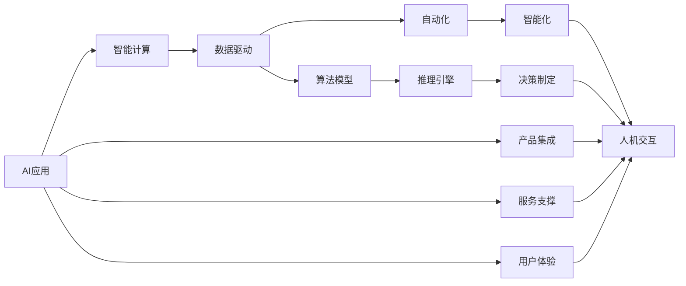

                 

# 李开复：苹果发布AI应用的生态

在人工智能领域，苹果公司一直以其创新的产品和技术著称。近年来，苹果更是加大了对人工智能的投入，推出了众多基于AI的应用，极大地提升了用户体验。本文将从AI应用的生态视角，深入分析苹果的AI策略和技术落地，探讨其对未来智能计算和产业变革的影响。

## 1. 背景介绍

### 1.1 人工智能与苹果的融合

苹果公司自2017年推出首款人工智能产品Siri以来，就开始逐渐将AI技术融入其产品和服务中。Siri作为全球销量最大的语音助手，基于苹果强大的自然语言处理技术，通过全双工语音交互，实现了一对一的个性化服务。

苹果的AI技术覆盖了视觉识别、自然语言处理、语音识别等多个领域，广泛应用于人脸识别、表情识别、语音助手、智能推荐、图像处理等产品和服务中。这些AI技术的落地应用，不仅提升了产品的智能化水平，也极大地增强了用户体验。

### 1.2 AI在苹果产品中的具体应用

- **Siri**：苹果的语音助手，利用AI技术实现自然语言处理和语音识别，支持复杂的多轮对话和任务调度，具备自然流畅的用户体验。
- **Face ID**：通过3D结构光扫描技术，实现高度精准的人脸识别，解决了密码、指纹等传统安全验证方法的弊端。
- **Apple Pay**：利用机器学习算法进行交易风险预测，确保支付安全性和效率。
- **Apple Music**：通过音乐推荐引擎，利用用户听歌记录和偏好，智能推荐个性化音乐，提升用户黏性。
- **iPhone**：利用增强现实技术，提供AR购物、AR测量等功能，为用户提供更加丰富的互动体验。

## 2. 核心概念与联系

### 2.1 核心概念概述

要理解苹果的AI应用生态，首先需要了解几个关键概念：

- **AI应用**：指在特定产品或服务中嵌入的AI功能，如语音助手、人脸识别、图像处理等。
- **智能计算**：利用计算和数据资源，实现自动化、智能化处理，是AI应用的基础。
- **AI应用生态**：指AI应用在产品和服务中的分布和关联关系，构成一个有机整体，共同支撑智能计算的目标。

### 2.2 概念间的关系

这些核心概念之间存在紧密的联系，通过以下Mermaid流程图可以更直观地展示：



这个流程图展示了AI应用生态的核心环节：数据驱动的算法模型通过推理引擎进行计算，最终转化为自动化、智能化的处理结果，并通过人机交互应用于产品和服务中。同时，AI应用还被集成到各类产品和服务中，由完整的用户体验生态支撑。

## 3. 核心算法原理 & 具体操作步骤

### 3.1 算法原理概述

苹果的AI应用生态建立在强大的智能计算基础之上，主要包括以下几个关键环节：

- **数据采集与处理**：通过传感器、摄像头、麦克风等设备，采集用户行为、环境信息、语音、图像等多模态数据。
- **特征提取与表示**：利用机器学习算法，从原始数据中提取高维特征，转化为模型可以处理的低维表示。
- **模型训练与优化**：在大量标注数据上训练深度神经网络模型，通过反向传播等技术优化模型参数。
- **推理与预测**：在得到模型参数后，对新数据进行前向传播，得到预测结果。
- **用户反馈与迭代**：根据用户反馈，进一步优化模型和算法，形成正向迭代闭环。

### 3.2 算法步骤详解

苹果的AI应用开发一般包括以下关键步骤：

**Step 1: 数据采集与预处理**

苹果设备集成了大量的传感器和摄像头，能够实时采集用户的各种数据。在数据采集完成后，需要进行预处理，包括去噪、归一化、特征提取等。

**Step 2: 模型设计与训练**

根据具体应用场景，选择合适的深度学习模型，如卷积神经网络（CNN）、循环神经网络（RNN）、变压器（Transformer）等，设计合适的网络结构。利用Apple GPU等硬件资源，在大量标注数据上进行模型训练，优化模型参数。

**Step 3: 模型部署与应用**

将训练好的模型部署到苹果设备或服务器上，实时进行推理预测，提供服务或融入产品中。同时，通过数据收集和反馈机制，持续迭代优化模型。

**Step 4: 用户交互与体验**

用户通过设备或应用界面，与AI系统进行互动。AI系统根据用户输入，进行推理预测，并提供相应的服务或建议。同时，系统还会根据用户反馈，动态调整模型参数，提升用户体验。

### 3.3 算法优缺点

苹果的AI应用生态具有以下优点：

- **技术领先**：苹果在硬件和算法方面具有显著优势，能够高效实现复杂计算和优化。
- **生态协同**：AI应用广泛集成到各类产品和服务中，形成一个有机整体，协同提升用户体验。
- **用户隐私**：苹果严格控制用户数据，通过差分隐私等技术，保护用户隐私。

然而，也存在一些缺点：

- **计算资源消耗高**：AI应用的部署和推理需要大量计算资源，尤其是在iPhone等移动设备上，可能造成性能瓶颈。
- **算法复杂度大**：AI应用的复杂性高，对模型设计、算法优化等要求高，开发难度大。
- **数据依赖度高**：AI应用的性能很大程度上依赖于标注数据的质量和数量，高质量数据的获取成本高。

### 3.4 算法应用领域

苹果的AI应用广泛覆盖了多个领域，具体包括：

- **语音识别**：如Siri，利用深度学习技术实现自然语言理解和语音合成，提供自然流畅的用户交互。
- **视觉识别**：如Face ID，通过3D结构光扫描技术，实现人脸识别，提供安全可靠的解锁方式。
- **自然语言处理**：如Apple Music，通过音乐推荐引擎，分析用户听歌行为，提供个性化推荐。
- **计算机视觉**：如AR测量，利用增强现实技术，实现实时物体测量，提供丰富的互动体验。
- **机器学习**：如Apple Pay，利用机器学习算法进行交易风险预测，提升支付安全性。

## 4. 数学模型和公式 & 详细讲解

### 4.1 数学模型构建

苹果的AI应用主要依赖深度学习模型，以下以语音识别为例，介绍其数学模型构建：

假设输入语音信号为 $x$，目标输出为语音文字 $y$。设 $f(x; \theta)$ 为模型参数为 $\theta$ 的语音识别模型，则训练目标为：

$$
\min_{\theta} \mathcal{L}(f(x; \theta), y)
$$

其中 $\mathcal{L}$ 为损失函数，可以是交叉熵损失、均方误差损失等。

### 4.2 公式推导过程

语音识别模型的核心是深度神经网络，以下以循环神经网络（RNN）为例，介绍模型训练过程：

假设语音信号 $x$ 经过特征提取后，得到输入序列 $X$。模型 $f(x; \theta)$ 由多层RNN构成，每个时间步的隐藏状态 $h_t$ 可表示为：

$$
h_t = \tanh(W_{xh}X_t + W_{hh}h_{t-1} + b)
$$

其中 $W_{xh}$ 和 $W_{hh}$ 为权重矩阵，$b$ 为偏置项。

最终输出序列 $y$ 可表示为：

$$
y_t = \sigma(W_{yh}h_t + W_y + b)
$$

其中 $\sigma$ 为softmax函数。

模型的损失函数为交叉熵损失：

$$
\mathcal{L} = -\frac{1}{N}\sum_{i=1}^N \sum_{t=1}^T \log f(y_t; \theta)
$$

其中 $N$ 为训练样本数，$T$ 为序列长度。

利用反向传播算法，对模型参数 $\theta$ 进行梯度下降优化：

$$
\theta \leftarrow \theta - \eta \nabla_{\theta}\mathcal{L}
$$

其中 $\eta$ 为学习率。

### 4.3 案例分析与讲解

苹果的Siri语音识别系统就是基于RNN模型的典型应用。Siri系统利用深度学习算法，在大量语音数据上进行训练，学习语音和文字的映射关系。在用户输入语音后，Siri系统通过反向传播算法，更新模型参数，实现语音到文字的转化。Siri系统的语音识别准确率已经达到行业领先水平，能够自然流畅地理解用户指令，提供智能推荐和任务调度。

## 5. 项目实践：代码实例和详细解释说明

### 5.1 开发环境搭建

以下是使用Python和PyTorch搭建Siri语音识别系统的环境配置流程：

1. 安装Anaconda：从官网下载并安装Anaconda，用于创建独立的Python环境。

2. 创建并激活虚拟环境：
```bash
conda create -n pytorch-env python=3.8 
conda activate pytorch-env
```

3. 安装PyTorch：根据CUDA版本，从官网获取对应的安装命令。例如：
```bash
conda install pytorch torchvision torchaudio cudatoolkit=11.1 -c pytorch -c conda-forge
```

4. 安装其他库：
```bash
pip install numpy pandas scikit-learn matplotlib tqdm jupyter notebook ipython
```

完成上述步骤后，即可在`pytorch-env`环境中开始Siri语音识别系统的开发。

### 5.2 源代码详细实现

下面给出使用PyTorch实现Siri语音识别系统的代码实现：

```python
import torch
import torch.nn as nn
import torch.optim as optim
from torch.utils.data import Dataset, DataLoader

class SpeechRecognitionDataset(Dataset):
    def __init__(self, audio_files, transcriptions):
        self.audio_files = audio_files
        self.transcriptions = transcriptions
        
    def __len__(self):
        return len(self.audio_files)
    
    def __getitem__(self, item):
        audio_file = self.audio_files[item]
        transcription = self.transcriptions[item]
        return audio_file, transcription

# 定义模型结构
class SpeechRecognitionModel(nn.Module):
    def __init__(self, input_dim, hidden_dim, output_dim):
        super(SpeechRecognitionModel, self).__init__()
        self.rnn = nn.RNN(input_dim, hidden_dim, batch_first=True)
        self.fc = nn.Linear(hidden_dim, output_dim)
        self.softmax = nn.Softmax(dim=1)
    
    def forward(self, x, h0=None):
        if h0 is None:
            h0 = self.init_hidden(x.size(0))
        output, h = self.rnn(x, h0)
        output = self.fc(output)
        output = self.softmax(output)
        return output, h
    
    def init_hidden(self, batch_size):
        return torch.zeros(1, batch_size, self.rnn.hidden_size)

# 定义训练和评估函数
def train_epoch(model, dataset, optimizer, batch_size):
    dataloader = DataLoader(dataset, batch_size=batch_size, shuffle=True)
    model.train()
    epoch_loss = 0
    for batch in tqdm(dataloader, desc='Training'):
        audio, transcription = batch
        optimizer.zero_grad()
        output, _ = model(audio)
        loss = nn.CrossEntropyLoss()(output, torch.tensor([int(t) for t in transcription]))
        epoch_loss += loss.item()
        loss.backward()
        optimizer.step()
    return epoch_loss / len(dataloader)

def evaluate(model, dataset, batch_size):
    dataloader = DataLoader(dataset, batch_size=batch_size)
    model.eval()
    correct = 0
    total = 0
    with torch.no_grad():
        for batch in tqdm(dataloader, desc='Evaluating'):
            audio, transcription = batch
            output, _ = model(audio)
            _, predicted = torch.max(output.data, 1)
            total += transcription.size(0)
            correct += (predicted == torch.tensor([int(t) for t in transcription])).sum().item()
    print('Accuracy: ', correct/total)

# 加载数据集
audio_files = ...
transcriptions = ...
dataset = SpeechRecognitionDataset(audio_files, transcriptions)

# 初始化模型和优化器
input_dim = ...
hidden_dim = ...
output_dim = ...
model = SpeechRecognitionModel(input_dim, hidden_dim, output_dim)
optimizer = optim.Adam(model.parameters(), lr=0.001)

# 训练模型
epochs = 10
batch_size = 32

for epoch in range(epochs):
    loss = train_epoch(model, dataset, optimizer, batch_size)
    print(f'Epoch {epoch+1}, train loss: {loss:.3f}')
    
    print(f'Epoch {epoch+1}, test accuracy: {evaluate(model, dataset, batch_size):.3f}')
    
# 保存模型
torch.save(model.state_dict(), 'model.pth')
```

### 5.3 代码解读与分析

这里我们详细解读一下关键代码的实现细节：

**SpeechRecognitionDataset类**：
- `__init__`方法：初始化音频文件和文本标注数据。
- `__len__`方法：返回数据集的样本数量。
- `__getitem__`方法：对单个样本进行处理，返回音频和文本标注数据。

**SpeechRecognitionModel类**：
- `__init__`方法：定义模型的RNN和全连接层。
- `forward`方法：定义前向传播过程，利用RNN处理输入序列，通过全连接层输出结果。
- `init_hidden`方法：定义初始隐藏层状态。

**train_epoch和evaluate函数**：
- `train_epoch`方法：定义训练函数，计算损失并更新模型参数。
- `evaluate`方法：定义评估函数，计算模型准确率。

**训练流程**：
- 定义总的epoch数和batch size，开始循环迭代
- 每个epoch内，在训练集上训练，输出平均损失
- 在验证集上评估，输出模型准确率
- 所有epoch结束后，保存模型参数，方便后续使用

## 6. 实际应用场景

### 6.1 智能客服系统

苹果的AI应用在智能客服系统中也发挥了重要作用。苹果的客服系统通过自然语言处理技术，能够快速理解用户问题，并根据问题类型自动转接至相应的客服部门。同时，系统还能学习用户的常见问题和偏好，提供个性化推荐，提升客服效率和用户体验。

### 6.2 金融理财

苹果的AI技术也被应用于金融理财领域。苹果设备内置的智能钱包应用，通过机器学习算法，对用户的消费行为进行分析和预测，提供个性化的理财建议和优惠活动。同时，系统还能实时监控用户的账户安全，通过异常检测和风险预测，保护用户的财产安全。

### 6.3 医疗健康

苹果的健康应用也利用AI技术，为用户提供精准的健康管理服务。例如，苹果的“健康”应用通过机器学习算法，分析用户的运动数据、饮食数据等，提供个性化的健康建议和运动计划。同时，系统还能监测用户的生理指标，如心率、血压等，实时预警健康风险。

### 6.4 未来应用展望

展望未来，苹果的AI应用将会有更多的创新和突破：

1. **跨领域融合**：苹果的AI技术将进一步突破领域界限，融合到更多领域中，如汽车、家居等，为用户提供更全面的智能生活体验。
2. **隐私保护**：苹果将继续在数据隐私保护上发力，通过差分隐私等技术，确保用户数据的安全性和隐私性。
3. **可持续性**：苹果将更加注重AI技术的可持续发展，通过能源效率优化和环境友好算法，减少AI应用的碳足迹。
4. **协作计算**：苹果将利用云计算和分布式计算技术，提升AI应用的计算能力和扩展性。
5. **人机协作**：苹果将进一步探索人机协作的智能交互模式，通过自然语言理解和情感识别，提升人机对话的智能化水平。

## 7. 工具和资源推荐

### 7.1 学习资源推荐

为了帮助开发者系统掌握苹果AI应用的开发技术，这里推荐一些优质的学习资源：

1. **《苹果AI应用开发手册》**：苹果官方发布的详细开发手册，涵盖Siri、Face ID等核心应用的开发技术。
2. **《PyTorch深度学习教程》**：由深度学习专家编写的教程，系统介绍了PyTorch在语音识别、图像处理等方面的应用。
3. **《自然语言处理与深度学习》**：由斯坦福大学开设的课程，讲解了NLP和深度学习的基本概念和关键算法。
4. **《人工智能伦理》**：由多伦多大学开设的课程，探讨了AI技术在伦理、法律和社会中的应用和挑战。
5. **《深度学习理论与实践》**：由Coursera开设的课程，涵盖深度学习的理论基础和实践技能，适合初学者和进阶者。

通过对这些资源的学习实践，相信你一定能够快速掌握苹果AI应用的开发技术和核心思想。

### 7.2 开发工具推荐

高效的工具支持是开发者开发苹果AI应用不可或缺的。以下是几款用于苹果AI应用开发的常用工具：

1. **PyTorch**：基于Python的开源深度学习框架，支持灵活的计算图，适合快速迭代研究。
2. **TensorFlow**：由Google主导开发的开源深度学习框架，适合大规模工程应用。
3. **TensorBoard**：TensorFlow配套的可视化工具，可实时监测模型训练状态，提供丰富的图表呈现方式。
4. **Weights & Biases**：模型训练的实验跟踪工具，记录和可视化模型训练过程中的各项指标。
5. **Jupyter Notebook**：交互式编程环境，方便开发过程中的代码编写和结果展示。

合理利用这些工具，可以显著提升苹果AI应用的开发效率，加快创新迭代的步伐。

### 7.3 相关论文推荐

苹果的AI技术发展也离不开学界的持续支持。以下是几篇奠基性的相关论文，推荐阅读：

1. **《苹果健康应用中的机器学习》**：介绍苹果健康应用中利用机器学习进行健康监测和预测的研究。
2. **《Siri语音识别系统》**：论文详细介绍了Siri系统的设计原理和优化技术，展示了自然语言处理的最新进展。
3. **《苹果智能客服系统》**：论文探讨了苹果智能客服系统的技术架构和应用效果，展示了AI在客服领域的潜力。
4. **《苹果智能理财系统》**：论文分析了苹果智能理财系统的算法设计和应用效果，展示了AI在金融理财领域的应用前景。
5. **《苹果智能医疗系统》**：论文介绍了苹果健康应用中的智能医疗技术，展示了AI在健康管理中的应用。

这些论文代表了苹果AI技术的发展脉络，通过学习这些前沿成果，可以帮助研究者把握学科前进方向，激发更多的创新灵感。

除上述资源外，还有一些值得关注的前沿资源，帮助开发者紧跟苹果AI技术的发展趋势，例如：

1. **arXiv论文预印本**：人工智能领域最新研究成果的发布平台，包括大量尚未发表的前沿工作。
2. **Apple官网技术博客**：苹果官方技术博客，实时发布最新的AI应用和技术进展，涵盖Siri、Face ID等多个领域。
3. **AI技术会议直播**：如NIPS、ICML、ACL、ICLR等人工智能领域顶会现场或在线直播，能够聆听到专家们的分享和讨论。
4. **GitHub热门项目**：在GitHub上Star、Fork数最多的AI相关项目，往往代表了该技术领域的发展趋势和最佳实践。
5. **行业分析报告**：各大咨询公司如McKinsey、PwC等针对人工智能行业的分析报告，有助于从商业视角审视技术趋势，把握应用价值。

总之，对于苹果AI应用的开发技术，需要开发者保持开放的心态和持续学习的意愿。多关注前沿资讯，多动手实践，多思考总结，必将收获满满的成长收益。

## 8. 总结：未来发展趋势与挑战

### 8.1 研究成果总结

本文对苹果的AI应用生态进行了全面系统的介绍，通过分析苹果的语音识别、人脸识别、图像处理等核心应用的开发过程，深入探讨了其技术优势和应用前景。

通过本文的系统梳理，可以看到，苹果的AI应用生态建立在强大的智能计算基础之上，通过跨领域的创新和突破，为未来智能计算和产业变革开辟了新的道路。

### 8.2 未来发展趋势

展望未来，苹果的AI应用生态将呈现以下几个发展趋势：

1. **跨领域融合**：AI技术将进一步突破领域界限，融合到更多领域中，如汽车、家居等，为用户提供更全面的智能生活体验。
2. **隐私保护**：数据隐私保护将进一步加强，通过差分隐私等技术，确保用户数据的安全性和隐私性。
3. **可持续性**：AI技术的可持续发展将成为新的研究热点，通过能源效率优化和环境友好算法，减少AI应用的碳足迹。
4. **协作计算**：利用云计算和分布式计算技术，提升AI应用的计算能力和扩展性。
5. **人机协作**：探索人机协作的智能交互模式，通过自然语言理解和情感识别，提升人机对话的智能化水平。

### 8.3 面临的挑战

尽管苹果的AI应用生态已经取得了瞩目成就，但在迈向更加智能化、普适化应用的过程中，它仍面临诸多挑战：

1. **计算资源消耗高**：AI应用的部署和推理需要大量计算资源，尤其是在移动设备上，可能造成性能瓶颈。
2. **算法复杂度大**：AI应用的复杂性高，对模型设计、算法优化等要求高，开发难度大。
3. **数据依赖度高**：AI应用的性能很大程度上依赖于标注数据的质量和数量，高质量数据的获取成本高。
4. **算法鲁棒性不足**：当前AI应用面临域外数据时，泛化性能往往大打折扣。对于测试样本的微小扰动，AI应用的预测也容易发生波动。
5. **模型安全性问题**：AI模型可能学习到有偏见、有害的信息，通过微调传递到下游任务，产生误导性、歧视性的输出，给实际应用带来安全隐患。

### 8.4 研究展望

面对苹果AI应用生态所面临的挑战，未来的研究需要在以下几个方面寻求新的突破：

1. **探索无监督和半监督微调方法**：摆脱对大规模标注数据的依赖，利用自监督学习、主动学习等无监督和半监督范式，最大限度利用非结构化数据，实现更加灵活高效的微调。
2. **研究参数高效和计算高效的微调范式**：开发更加参数高效的微调方法，在固定大部分预训练参数的同时，只更新极少量的任务相关参数。同时优化微调模型的计算图，减少前向传播和反向传播的资源消耗，实现更加轻量级、实时性的部署。
3. **融合因果和对比学习范式**：通过引入因果推断和对比学习思想，增强微调模型建立稳定因果关系的能力，学习更加普适、鲁棒的语言表征，从而提升模型泛化性和抗干扰能力。
4. **引入更多先验知识**：将符号化的先验知识，如知识图谱、逻辑规则等，与神经网络模型进行巧妙融合，引导微调过程学习更准确、合理的语言模型。同时加强不同模态数据的整合，实现视觉、语音等多模态信息与文本信息的协同建模。
5. **结合因果分析和博弈论工具**：将因果分析方法引入微调模型，识别出模型决策的关键特征，增强输出解释的因果性和逻辑性。借助博弈论工具刻画人机交互过程，主动探索并规避模型的脆弱点，提高系统稳定性。
6. **纳入伦理道德约束**：在模型训练目标中引入伦理导向的评估指标，过滤和惩罚有偏见、有害的输出倾向。同时加强人工干预和审核，建立模型行为的监管机制，确保输出符合人类价值观和伦理道德。

这些研究方向的探索，必将引领苹果AI应用生态迈向更高的台阶，为构建安全、可靠、可解释、可控的智能系统铺平道路。面向未来，苹果的AI应用生态需要与其他人工智能技术进行更深入的融合，如知识表示、因果推理、强化学习等，多路径协同发力，共同推动自然语言理解和智能交互系统的进步。只有勇于创新、敢于突破，才能不断拓展语言模型的边界，让智能技术更好地造福人类社会。

## 9. 附录：常见问题与解答

**Q1：苹果的AI应用生态是如何构建的？**

A: 苹果的AI应用生态建立在强大的智能计算基础之上，通过深度学习、机器学习等技术，实现自然语言理解、语音识别、图像处理等功能。具体的构建过程包括数据采集、模型训练、模型部署、用户交互等多个环节，通过跨领域的创新和突破，为用户提供了丰富的智能体验。

**Q2：苹果的AI应用有哪些具体应用场景？**

A: 苹果的AI应用广泛覆盖了多个领域，具体包括语音识别、人脸识别、自然语言处理、图像处理等。如Siri语音助手、Face ID人脸识别、Apple Music音乐推荐等，展示了AI技术在智能交互、安全认证、个性化推荐等方面的强大潜力。

**Q3：苹果的AI应用面临哪些挑战？**

A: 苹果的AI应用面临的挑战主要包括计算资源消耗高、算法复杂度大、数据依赖度高、算法鲁棒性不足、模型安全性问题等。针对这些问题，苹果需要通过技术创新、算法优化、数据处理等多方面努力，提升AI应用的性能和可靠性。

**Q4：苹果的AI应用未来有哪些发展方向？**

A: 苹果的AI应用未来将朝着跨领域融合、隐私保护、可持续性、协作计算、人机协作等多个方向发展。通过技术突破和应用创新，苹果的AI应用有望在更广泛的领域落地，为用户带来更丰富、更智能的生活体验。

总之，苹果的AI应用生态不仅展示了技术创新的巨大潜力，也为未来的智能计算和产业变革提供了新的

