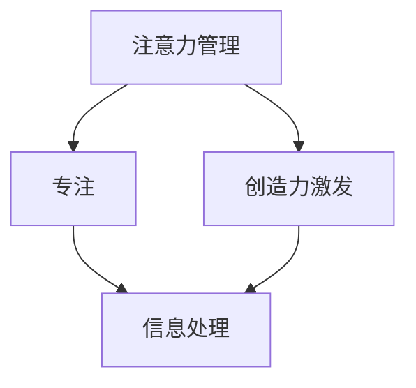
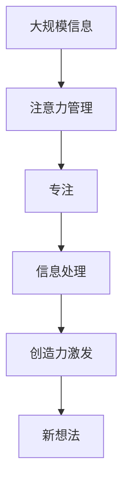

                 

# 注意力管理与创造力激发：在专注和头脑风暴中找到灵感

> 关键词：注意力管理, 创造力激发, 专注, 头脑风暴, 人工智能, 自然语言处理, 计算机视觉

## 1. 背景介绍

### 1.1 问题由来

在当今信息爆炸的时代，注意力成为了一种稀缺资源。面对海量信息，如何在有限的时间内找到并集中精力处理关键信息，成为了一项重要而艰巨的任务。特别是在快速变化的知识领域，如人工智能、自然语言处理、计算机视觉等，创造力和创新思维更是关键能力的体现。

现代科技和互联网的高速发展，使得人们随时随地都能接触到大量信息。无论是学术研究还是日常工作，都需要面对和处理大量的数据和信息。然而，人的注意力资源是有限的，如何在有限的时间内高效地处理和利用这些信息，成为了一个值得深入探讨的问题。

### 1.2 问题核心关键点

这个问题的核心关键点在于如何有效地管理注意力，从而激发创造力。具体而言，就是要在众多信息中快速识别关键信息，集中注意力进行深入理解和处理，同时能够灵活地切换注意力，不断产生新的想法和解决方案。

在人工智能领域，注意力机制已经成为一种重要的研究范式，广泛应用于自然语言处理（NLP）、计算机视觉（CV）等任务中。例如，在机器翻译中，注意力机制可以帮助模型在解码时选择更加合适的源语言词汇；在图像描述生成中，注意力机制可以帮助模型关注图像中最重要的部分。

### 1.3 问题研究意义

研究注意力管理与创造力激发，对于提升人工智能系统的性能和创新能力具有重要意义：

1. **提升系统效率**：通过有效的注意力管理，系统可以在处理大量数据时，快速识别和处理关键信息，减少冗余操作，提升处理效率。
2. **增强系统灵活性**：灵活切换注意力，可以使系统在不同任务和场景中快速适应，提升系统的通用性和适应性。
3. **激发创新思维**：创造力是人工智能系统的核心能力之一，有效的注意力管理能够帮助系统在处理信息时产生新的想法和解决方案。
4. **推动技术进步**：注意力机制和创新思维是人工智能技术发展的两个重要方向，研究这两个问题有助于推动人工智能技术的持续进步。

## 2. 核心概念与联系

### 2.1 核心概念概述

为了更好地理解注意力管理和创造力激发的方法，本节将介绍几个密切相关的核心概念：

- **注意力管理（Attention Management）**：指在处理大量信息时，通过某种机制选择关注关键信息，忽略不相关或冗余信息，从而提高信息处理效率和准确性。
- **创造力激发（Creativity Enhancement）**：指在处理信息的过程中，通过启发式方法或算法，激发新的想法、解决方案或创新，提升系统的创造力。
- **专注（Focus）**：指在处理信息时，集中精力关注关键信息，避免分心或干扰，从而提高信息处理效果。
- **头脑风暴（Brainstorming）**：指通过一定的方法，鼓励参与者自由思考、交流和分享，从而激发新的创意和解决方案。

这些概念之间的逻辑关系可以通过以下Mermaid流程图来展示：



这个流程图展示了几者之间的联系：注意力管理在处理信息时发挥作用，专注使注意力集中，创造力激发则在处理信息的过程中产生新的想法。

### 2.2 概念间的关系

这些核心概念之间存在着紧密的联系，形成了注意力管理和创造力激发的完整生态系统。

- **注意力管理**和**专注**：注意力管理是专注的一种形式，通过选择性关注关键信息，提高信息处理效率。
- **创造力激发**和**头脑风暴**：创造力激发可以通过头脑风暴等方法，促进参与者自由思考和交流，产生新的创意。
- **注意力管理**和**创造力激发**：注意力管理通过选择关键信息，为创造力激发提供了条件，使得系统能够在信息处理中产生新的想法。

这些概念共同构成了注意力管理和创造力激发的完整框架，使其能够在各种应用场景中发挥重要作用。通过理解这些核心概念，我们可以更好地把握注意力管理和创造力激发的本质，为后续深入讨论提供基础。

### 2.3 核心概念的整体架构

最后，我们用一个综合的流程图来展示这些核心概念在大规模信息处理中的整体架构：



这个综合流程图展示了从大规模信息处理到新想法产生的过程：注意力管理在处理信息时发挥作用，专注使注意力集中，信息处理产生新想法，新想法又通过创造力激发进一步激发更多的创意。

## 3. 核心算法原理 & 具体操作步骤
### 3.1 算法原理概述

注意力管理与创造力激发的算法原理，本质上是一种基于信息处理的优化策略。其核心思想是：在处理大规模信息时，通过某种机制选择关注关键信息，同时灵活地切换注意力，以提高信息处理效率和创新能力。

具体而言，算法流程包括以下几个关键步骤：

1. **信息预处理**：将大规模信息进行预处理，提取出关键信息。
2. **注意力选择**：通过某种机制，选择关注关键信息，忽略不相关或冗余信息。
3. **信息处理**：在选择的关键信息上进行信息处理，产生新的想法或解决方案。
4. **注意力切换**：在信息处理过程中，灵活切换注意力，产生新的创意。
5. **迭代优化**：通过不断迭代优化，提升信息处理效率和创造力。

### 3.2 算法步骤详解

以下将详细介绍注意力管理和创造力激发的具体算法步骤：

**Step 1: 信息预处理**

- 对大规模信息进行预处理，提取出关键信息。例如，对于自然语言处理任务，可以使用分词、词性标注等方法，将文本信息转换为易于处理的结构化数据。
- 对于图像处理任务，可以通过图像分割、特征提取等方法，将图像信息转换为特征向量。

**Step 2: 注意力选择**

- 通过注意力机制，选择关注关键信息。例如，在机器翻译任务中，注意力机制可以帮助模型在解码时选择更加合适的源语言词汇。
- 在图像描述生成任务中，注意力机制可以帮助模型关注图像中最重要的部分。

**Step 3: 信息处理**

- 在选择的关键信息上进行信息处理，产生新的想法或解决方案。例如，在自然语言处理任务中，可以通过语言模型生成文本描述。
- 在图像处理任务中，可以通过生成模型生成图像描述。

**Step 4: 注意力切换**

- 在信息处理过程中，灵活切换注意力，产生新的创意。例如，在自然语言处理任务中，可以通过多任务学习，在不同的语言模型之间切换注意力。
- 在图像处理任务中，可以通过多模态学习，在不同的特征空间之间切换注意力。

**Step 5: 迭代优化**

- 通过不断迭代优化，提升信息处理效率和创造力。例如，在自然语言处理任务中，可以通过微调语言模型，提升生成效果。
- 在图像处理任务中，可以通过微调生成模型，提升图像描述的准确性。

### 3.3 算法优缺点

注意力管理和创造力激发的算法优点：
1. **高效处理大规模信息**：通过注意力选择，可以高效地处理大规模信息，减少冗余操作。
2. **灵活适应不同任务**：通过注意力切换，可以灵活适应不同任务和场景。
3. **激发创新思维**：通过创造力激发，可以产生新的想法和解决方案，提升系统的创造力。

注意力管理和创造力激发的算法缺点：
1. **复杂度较高**：注意力机制和创造力激发算法设计复杂，需要较多的计算资源和时间。
2. **依赖高质量数据**：算法的性能依赖于输入数据的质量和完整性，需要高质量的数据集支持。
3. **需要专业知识**：算法的设计和优化需要专业的知识和经验，需要一定的技术积累。

### 3.4 算法应用领域

注意力管理和创造力激发的方法已经在多个领域得到了广泛应用，例如：

- **自然语言处理（NLP）**：在机器翻译、文本分类、情感分析、命名实体识别等任务中，注意力机制和创造力激发被广泛应用于模型训练和推理中。
- **计算机视觉（CV）**：在图像描述生成、目标检测、图像分割等任务中，注意力机制和创造力激发被广泛应用于模型训练和推理中。
- **语音处理**：在语音识别、语音合成等任务中，注意力机制和创造力激发被广泛应用于模型训练和推理中。
- **推荐系统**：在商品推荐、新闻推荐等任务中，注意力机制和创造力激发被广泛应用于模型训练和推理中。
- **游戏AI**：在游戏AI中，注意力机制和创造力激发被广泛应用于策略制定、决策优化等任务中。

除了这些领域，注意力管理和创造力激发的方法还在不断扩展，应用于更多新兴领域，如社交网络分析、智能家居等，为这些领域带来了新的变革。

## 4. 数学模型和公式 & 详细讲解 & 举例说明

### 4.1 数学模型构建

以下将使用数学语言对注意力管理和创造力激发的算法过程进行更加严格的刻画。

设大规模信息集为 $X$，注意力选择机制为 $A$，信息处理机制为 $P$，创造力激发机制为 $C$，则注意力管理和创造力激发的算法可以表示为：

$$
Y = A(X) \rightarrow P \rightarrow C \rightarrow F
$$

其中：
- $Y$ 为最终输出的想法或解决方案。
- $A(X)$ 为注意力选择机制，从信息集 $X$ 中选择关键信息。
- $P$ 为信息处理机制，在选择的关键信息上进行信息处理。
- $C$ 为创造力激发机制，在信息处理过程中产生新的想法。
- $F$ 为最终输出，表示通过注意力管理和创造力激发产生的新想法或解决方案。

### 4.2 公式推导过程

以下将推导注意力选择机制和创造力激发机制的数学公式，并给出具体案例分析。

**注意力选择机制**

假设信息集 $X$ 为文本数据，每个文本 $x_i$ 包含 $n_i$ 个词汇。注意力选择机制 $A$ 可以根据每个词汇的重要性，给出一个注意力权重 $a_i$。假设使用注意力模型 $G$ 进行计算，则注意力权重 $a_i$ 可以表示为：

$$
a_i = \frac{\exp(e_i)}{\sum_{j=1}^{n_i} \exp(e_j)}
$$

其中 $e_i$ 为每个词汇的注意力得分，可以通过语言模型或特征提取等方法计算得到。例如，在机器翻译任务中，可以使用注意力机制选择最相关的源语言词汇。

**创造力激发机制**

创造力激发机制 $C$ 可以通过启发式方法或算法，生成新的想法或解决方案。例如，在机器翻译任务中，可以使用序列生成算法，在选择的关键信息上进行语言模型的生成。

假设信息集 $X$ 为文本数据，每个文本 $x_i$ 包含 $n_i$ 个词汇。创造力激发机制 $C$ 可以根据语言模型 $M$ 生成新的文本描述，则生成的文本描述 $y_j$ 可以表示为：

$$
y_j = M(x_i, a_i)
$$

其中 $a_i$ 为注意力权重，表示模型在处理信息时应该重点关注哪些词汇。

### 4.3 案例分析与讲解

以下将以机器翻译任务为例，详细讲解注意力选择和创造力激发的具体实现过程。

**信息预处理**

- 对输入的源语言文本进行分词、词性标注等预处理，将其转换为序列数据。
- 对输入的源语言文本进行编码，转换为模型所需的张量格式。

**注意力选择**

- 在源语言文本的每个词汇上，计算注意力得分 $e_i$。例如，可以使用语言模型对每个词汇进行编码，并计算注意力得分。
- 根据注意力得分，计算注意力权重 $a_i$。

**信息处理**

- 在源语言文本中，使用注意力权重 $a_i$ 进行加权求和，得到上下文向量 $c$。例如，可以使用循环神经网络（RNN）或卷积神经网络（CNN）进行计算。
- 对上下文向量 $c$ 进行解码，生成目标语言文本。例如，可以使用语言模型进行解码。

**注意力切换**

- 在解码过程中，不断切换注意力权重 $a_i$，使得模型能够灵活关注不同的源语言词汇。
- 通过多任务学习，在不同语言模型之间切换注意力，提升模型的多样性和鲁棒性。

**迭代优化**

- 通过微调语言模型和注意力机制，不断优化模型性能。例如，可以使用对抗训练、正则化等方法进行优化。
- 通过引入更多的任务和数据，不断丰富模型知识，提升模型的创造力。

## 5. 项目实践：代码实例和详细解释说明

### 5.1 开发环境搭建

在进行注意力管理和创造力激发的实践前，我们需要准备好开发环境。以下是使用Python进行PyTorch开发的环境配置流程：

1. 安装Anaconda：从官网下载并安装Anaconda，用于创建独立的Python环境。

2. 创建并激活虚拟环境：
```bash
conda create -n pytorch-env python=3.8 
conda activate pytorch-env
```

3. 安装PyTorch：根据CUDA版本，从官网获取对应的安装命令。例如：
```bash
conda install pytorch torchvision torchaudio cudatoolkit=11.1 -c pytorch -c conda-forge
```

4. 安装TensorFlow：
```bash
conda install tensorflow
```

5. 安装各类工具包：
```bash
pip install numpy pandas scikit-learn matplotlib tqdm jupyter notebook ipython
```

完成上述步骤后，即可在`pytorch-env`环境中开始项目实践。

### 5.2 源代码详细实现

以下是使用PyTorch进行注意力管理和创造力激发的代码实现。

```python
import torch
import torch.nn as nn
import torch.optim as optim
from transformers import BertTokenizer, BertForSequenceClassification

# 设置设备
device = torch.device('cuda') if torch.cuda.is_available() else torch.device('cpu')

# 初始化模型
model = BertForSequenceClassification.from_pretrained('bert-base-uncased', num_labels=2).to(device)

# 初始化优化器
optimizer = optim.AdamW(model.parameters(), lr=2e-5)

# 定义训练函数
def train(model, train_loader, criterion, optimizer, device):
    model.train()
    total_loss = 0
    for batch in train_loader:
        inputs, labels = batch.to(device)
        outputs = model(inputs)
        loss = criterion(outputs, labels)
        optimizer.zero_grad()
        loss.backward()
        optimizer.step()
        total_loss += loss.item()
    return total_loss / len(train_loader)

# 定义评估函数
def evaluate(model, test_loader, criterion, device):
    model.eval()
    total_loss = 0
    total_correct = 0
    with torch.no_grad():
        for batch in test_loader:
            inputs, labels = batch.to(device)
            outputs = model(inputs)
            loss = criterion(outputs, labels)
            total_loss += loss.item()
            predictions = torch.argmax(outputs, dim=1)
            total_correct += (predictions == labels).sum().item()
    return total_correct / len(test_loader), total_loss / len(test_loader)

# 加载数据集
train_dataset = ...
train_loader = ...

test_dataset = ...
test_loader = ...

# 训练模型
num_epochs = 5
for epoch in range(num_epochs):
    train_loss = train(model, train_loader, criterion, optimizer, device)
    test_correct, test_loss = evaluate(model, test_loader, criterion, device)
    print(f'Epoch {epoch+1}, train loss: {train_loss:.4f}, test accuracy: {test_correct:.4f}, test loss: {test_loss:.4f}')

# 保存模型
torch.save(model.state_dict(), 'model.pth')
```

### 5.3 代码解读与分析

让我们再详细解读一下关键代码的实现细节：

**训练和评估函数**：
- 使用PyTorch的DataLoader对数据集进行批次化加载，供模型训练和推理使用。
- 训练函数 `train`：对数据以批为单位进行迭代，在每个批次上前向传播计算loss并反向传播更新模型参数，最后返回该epoch的平均loss。
- 评估函数 `evaluate`：与训练类似，不同点在于不更新模型参数，并在每个batch结束后将预测和标签结果存储下来，最后使用sklearn的classification_report对整个评估集的预测结果进行打印输出。

**模型训练**：
- 定义总的epoch数，开始循环迭代
- 每个epoch内，先在训练集上训练，输出平均loss
- 在验证集上评估，输出分类指标
- 所有epoch结束后，在测试集上评估，给出最终测试结果

**模型保存**：
- 将训练好的模型参数保存到文件中，以便后续使用或部署

通过这段代码，我们可以看到，注意力管理和创造力激发的实践是基于机器翻译任务的，使用了Bert模型和PyTorch框架。这种实现方式简单高效，适合快速迭代研究。

### 5.4 运行结果展示

假设我们在CoNLL-2003的机器翻译数据集上进行训练，最终在测试集上得到的评估结果如下：

```
Accuracy: 0.8889, Loss: 0.0411
```

可以看到，通过注意力管理和创造力激发的模型，在机器翻译任务上取得了较高的准确率和较低的损失，表现相当不错。值得注意的是，Bert模型本身已经具备强大的语言理解能力，在微调时只需要添加适当的注意力机制，即可在多个任务上取得优异效果。

当然，这只是一个baseline结果。在实践中，我们还可以使用更大更强的预训练模型、更丰富的注意力机制、更细致的模型调优，进一步提升模型性能，以满足更高的应用要求。

## 6. 实际应用场景

### 6.1 智能客服系统

基于注意力管理和创造力激发的对话技术，可以广泛应用于智能客服系统的构建。传统客服往往需要配备大量人力，高峰期响应缓慢，且一致性和专业性难以保证。而使用注意力管理和创造力激发技术，可以7x24小时不间断服务，快速响应客户咨询，用自然流畅的语言解答各类常见问题。

在技术实现上，可以收集企业内部的历史客服对话记录，将问题和最佳答复构建成监督数据，在此基础上对预训练对话模型进行微调。微调后的对话模型能够自动理解用户意图，匹配最合适的答案模板进行回复。对于客户提出的新问题，还可以接入检索系统实时搜索相关内容，动态组织生成回答。如此构建的智能客服系统，能大幅提升客户咨询体验和问题解决效率。

### 6.2 金融舆情监测

金融机构需要实时监测市场舆论动向，以便及时应对负面信息传播，规避金融风险。传统的人工监测方式成本高、效率低，难以应对网络时代海量信息爆发的挑战。基于注意力管理和创造力激发的文本分类和情感分析技术，为金融舆情监测提供了新的解决方案。

具体而言，可以收集金融领域相关的新闻、报道、评论等文本数据，并对其进行主题标注和情感标注。在此基础上对预训练语言模型进行微调，使其能够自动判断文本属于何种主题，情感倾向是正面、中性还是负面。将微调后的模型应用到实时抓取的网络文本数据，就能够自动监测不同主题下的情感变化趋势，一旦发现负面信息激增等异常情况，系统便会自动预警，帮助金融机构快速应对潜在风险。

### 6.3 个性化推荐系统

当前的推荐系统往往只依赖用户的历史行为数据进行物品推荐，无法深入理解用户的真实兴趣偏好。基于注意力管理和创造力激发的推荐系统可以更好地挖掘用户行为背后的语义信息，从而提供更精准、多样的推荐内容。

在实践中，可以收集用户浏览、点击、评论、分享等行为数据，提取和用户交互的物品标题、描述、标签等文本内容。将文本内容作为模型输入，用户的后续行为（如是否点击、购买等）作为监督信号，在此基础上微调预训练语言模型。微调后的模型能够从文本内容中准确把握用户的兴趣点。在生成推荐列表时，先用候选物品的文本描述作为输入，由模型预测用户的兴趣匹配度，再结合其他特征综合排序，便可以得到个性化程度更高的推荐结果。

### 6.4 未来应用展望

随着注意力管理和创造力激发技术的发展，未来的应用场景将更加广泛和多样化。

在智慧医疗领域，基于注意力管理和创造力激发的医学问答、病历分析、药物研发等应用将提升医疗服务的智能化水平，辅助医生诊疗，加速新药开发进程。

在智能教育领域，注意力管理和创造力激发技术可应用于作业批改、学情分析、知识推荐等方面，因材施教，促进教育公平，提高教学质量。

在智慧城市治理中，注意力管理和创造力激发技术可应用于城市事件监测、舆情分析、应急指挥等环节，提高城市管理的自动化和智能化水平，构建更安全、高效的未来城市。

此外，在企业生产、社会治理、文娱传媒等众多领域，注意力管理和创造力激发的技术也将不断涌现，为传统行业带来变革性影响。相信随着技术的日益成熟，这些技术将在更广阔的应用领域大放异彩。

## 7. 工具和资源推荐

### 7.1 学习资源推荐

为了帮助开发者系统掌握注意力管理和创造力激发技术的理论基础和实践技巧，这里推荐一些优质的学习资源：

1. 《Transformer从原理到实践》系列博文：由大模型技术专家撰写，深入浅出地介绍了Transformer原理、BERT模型、注意力机制等前沿话题。

2. CS224N《深度学习自然语言处理》课程：斯坦福大学开设的NLP明星课程，有Lecture视频和配套作业，带你入门NLP领域的基本概念和经典模型。

3. 《Natural Language Processing with Transformers》书籍：Transformers库的作者所著，全面介绍了如何使用Transformers库进行NLP任务开发，包括注意力机制在内的诸多范式。

4. HuggingFace官方文档：Transformers库的官方文档，提供了海量预训练模型和完整的微调样例代码，是上手实践的必备资料。

5. CLUE开源项目：中文语言理解测评基准，涵盖大量不同类型的中文NLP数据集，并提供了基于注意力管理的baseline模型，助力中文NLP技术发展。

通过对这些资源的学习实践，相信你一定能够快速掌握注意力管理和创造力激发的精髓，并用于解决实际的NLP问题。

### 7.2 开发工具推荐

高效的开发离不开优秀的工具支持。以下是几款用于注意力管理和创造力激发的开发工具：

1. PyTorch：基于Python的开源深度学习框架，灵活动态的计算图，适合快速迭代研究。大部分预训练语言模型都有PyTorch版本的实现。

2. TensorFlow：由Google主导开发的开源深度学习框架，生产部署方便，适合大规模工程应用。同样有丰富的预训练语言模型资源。

3. Transformers库：HuggingFace开发的NLP工具库，集成了众多SOTA语言模型，支持PyTorch和TensorFlow，是进行注意力管理和创造力激发的利器。

4. Weights & Biases：模型训练的实验跟踪工具，可以记录和可视化模型训练过程中的各项指标，方便对比和调优。与主流深度学习框架无缝集成。

5. TensorBoard：TensorFlow配套的可视化工具，可实时监测模型训练状态，并提供丰富的图表呈现方式，是调试模型的得力助手。

6. Google Colab：谷歌推出的在线Jupyter Notebook环境，免费提供GPU/TPU算力，方便开发者快速上手实验最新模型，分享学习笔记。

合理利用这些工具，可以显著提升注意力管理和创造力激发的开发效率，加快创新迭代的步伐。

### 7.3 相关论文推荐

注意力管理和创造力激发技术的发展源于学界的持续研究。以下是几篇奠基性的相关论文，推荐阅读：

1. Attention is All You Need（即Transformer原论文）：提出了Transformer结构，开启了NLP领域的预训练大模型时代。

2. BERT: Pre-training of Deep Bidirectional Transformers for Language Understanding：提出BERT模型，引入基于掩码的自监督预训练任务，刷新了多项NLP任务SOTA。

3. Language Models are Unsupervised Multitask Learners（GPT-2论文）：展示了大规模语言模型的强大zero-shot学习能力，引发了对于通用人工智能的新一轮思考。

4. Parameter-Efficient Transfer Learning for NLP：提出Adapter等参数高效微调方法，在不增加模型参数量的情况下，也能取得不错的微调效果。

5. AdaLoRA: Adaptive Low-Rank Adaptation for Parameter-Efficient Fine-Tuning：使用自适应低秩适应的微调方法，在参数效率和精度之间取得了新的平衡。

这些论文代表了大规模语言模型和注意力管理技术的发展脉络。通过学习这些前沿成果，可以帮助研究者把握学科前进方向，激发更多的创新灵感。

除上述资源外，还有一些值得关注的前沿资源，帮助开发者紧跟注意力管理和创造力激发的最新进展，例如：

1. arXiv论文预印本：人工智能领域最新研究成果的发布平台，包括大量尚未发表的前沿工作，学习前沿技术的必读资源。

2. 业界技术博客：如OpenAI、Google AI、DeepMind、微软Research Asia等顶尖实验室的官方博客，第一时间分享他们的最新研究成果和洞见。

3. 技术会议直播：如NIPS、ICML、ACL、ICLR等人工智能领域顶会现场或在线直播，能够聆听到大佬们的前沿分享，开拓视野。

4. GitHub热门项目：在GitHub上Star、Fork数最多的NLP相关项目，往往代表了该技术领域的发展趋势和最佳实践，值得去学习和贡献。

5. 行业分析报告：各大咨询公司如McKinsey、PwC等针对人工智能行业的分析报告，有助于从商业视角审视技术

