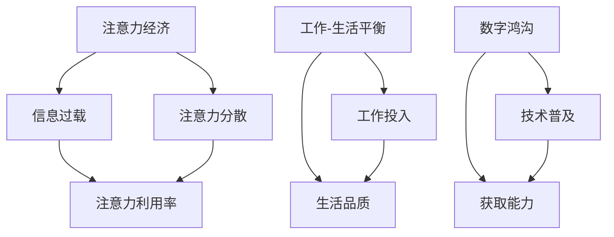
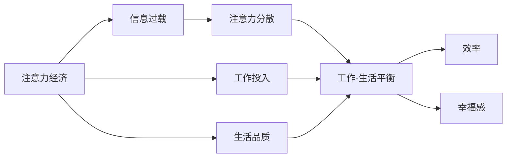
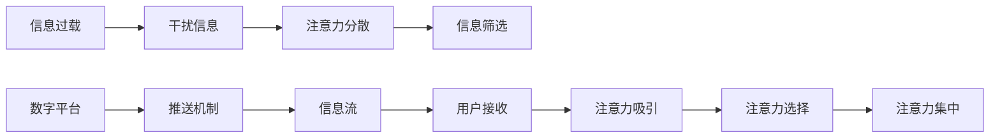
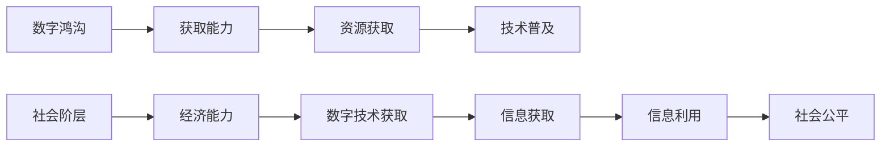
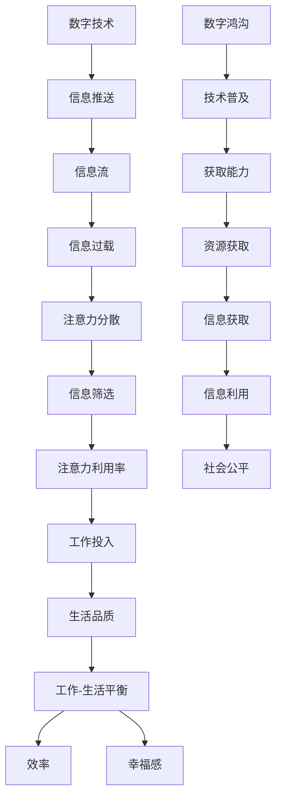

                 

# 注意力经济与工作-生活平衡的挑战

> 关键词：注意力经济,工作-生活平衡,技术变革,人工智能,社会影响

## 1. 背景介绍

### 1.1 问题由来
随着数字时代的到来，人们越来越依赖于各种数字平台来获取信息和娱乐。这种依赖性逐渐演变成一种新型的经济形态，即注意力经济。在注意力经济中，企业的价值不再仅仅取决于他们生产的产品或提供的服务，而是取决于他们吸引和维持用户注意力的能力。

注意力经济的兴起，给我们的工作-生活平衡带来了新的挑战。一方面，数字平台为了争夺用户的注意力，不断推送各种信息，干扰我们的工作和生活。另一方面，信息过载和注意力分散，也使得我们难以集中精力处理复杂任务，影响了效率和创造力。因此，如何在注意力经济的环境中，保持高效的工作和健康的生活，成为了一个亟需解决的问题。

### 1.2 问题核心关键点
注意力经济的核心在于如何有效地吸引和分配用户的注意力。这涉及到以下核心概念：

- 注意力：用户的注意力是宝贵的资源，数字化平台通过各种方式争夺和分配这种资源。
- 信息过载：数字平台上充斥着海量的信息，使得用户难以筛选和处理有用的信息。
- 注意力分散：用户的注意力容易受到各种外部因素的干扰，难以长时间集中精力。
- 数字鸿沟：数字技术的普及带来了新的机会，但也加剧了社会的不平等。

注意力经济的挑战在于：

- 如何识别和过滤无用信息，提高注意力利用率。
- 如何避免注意力分散，保持高效的工作和生活节奏。
- 如何缩小数字鸿沟，让所有人都能公平获取信息和资源。

### 1.3 问题研究意义
研究注意力经济和工作-生活平衡的挑战，对于理解数字时代的经济和社会变化，以及如何构建更为公平、高效的工作和生活环境，具有重要意义：

- 帮助企业制定更加精准的市场营销策略，提升品牌影响力和用户粘性。
- 提供工作-生活平衡的解决方案，提高个体的生活质量和幸福感。
- 促进数字技术和社会公平的融合，缩小数字鸿沟。

## 2. 核心概念与联系

### 2.1 核心概念概述

为更好地理解注意力经济和工作-生活平衡的挑战，本节将介绍几个密切相关的核心概念：

- 注意力经济（Attention Economy）：指数字平台上以争夺用户注意力为核心的经济模式。企业和平台通过各种手段吸引用户注意，提供有价值的信息和服务，从而获得商业利益。
- 工作-生活平衡（Work-Life Balance）：指个体在工作中投入精力，同时保持身心健康和生活品质的状态。在数字时代，这种平衡受到技术和信息过载的挑战。
- 信息过载（Information Overload）：指数字平台上信息量过大，导致用户难以处理和筛选有用信息。
- 注意力分散（Attention Fracture）：指用户的注意力容易受到各种外部因素的干扰，难以长时间集中精力。
- 数字鸿沟（Digital Divide）：指数字技术的普及带来的不平等现象，不同群体对数字技术的获取和使用能力存在差异。

这些核心概念之间的逻辑关系可以通过以下Mermaid流程图来展示：



这个流程图展示了注意力经济和工作-生活平衡的各个核心概念及其相互关系：

1. 注意力经济通过信息过载和注意力分散影响注意力利用率，影响工作-生活平衡。
2. 信息过载和注意力分散的加剧，使得个体难以保持高效的工作和生活节奏。
3. 数字鸿沟导致不同群体在获取信息和资源上存在不平等，影响整体的社会公平。

### 2.2 概念间的关系

这些核心概念之间存在着紧密的联系，形成了注意力经济和工作-生活平衡的完整生态系统。下面我们通过几个Mermaid流程图来展示这些概念之间的关系。

#### 2.2.1 注意力经济的工作-生活影响



这个流程图展示了注意力经济如何通过信息过载和注意力分散影响个体的工作和生活质量：

1. 注意力经济通过信息过载，使得用户难以筛选有用信息，增加了工作负担。
2. 注意力分散使得用户难以集中精力，降低了工作效率和生活品质。
3. 高效的工作和生活需要合理分配注意力，而信息过载和注意力分散则打破了这种平衡。

#### 2.2.2 信息过载与注意力分散的机制



这个流程图展示了信息过载和注意力分散的机制：

1. 数字平台通过推送机制不断向用户推送信息，形成信息流。
2. 干扰信息增加了用户的注意力负担，导致注意力分散。
3. 信息筛选帮助用户识别和过滤无用信息，但信息过载仍然是一个难以解决的问题。

#### 2.2.3 数字鸿沟与社会公平



这个流程图展示了数字鸿沟如何影响社会公平：

1. 获取能力决定了个人获取数字资源的能力。
2. 技术普及提高了数字资源的获取能力，但数字鸿沟仍然存在。
3. 信息获取和利用能力的不平等，导致了社会公平的进一步恶化。

### 2.3 核心概念的整体架构

最后，我们用一个综合的流程图来展示这些核心概念在注意力经济和工作-生活平衡的完整过程中：



这个综合流程图展示了从数字技术到社会公平的完整过程：

1. 数字技术推动了信息推送和信息流的形成，导致信息过载和注意力分散。
2. 信息筛选和注意力利用率的提升，帮助个体保持高效的工作和生活节奏。
3. 社会公平的缩小，使得更多人能够获取和利用数字资源，实现公平分配。

通过这些流程图，我们可以更清晰地理解注意力经济和工作-生活平衡的各个核心概念及其关系，为后续深入讨论具体的解决策略奠定了基础。

## 3. 核心算法原理 & 具体操作步骤
### 3.1 算法原理概述

注意力经济的工作-生活平衡问题，本质上是通过技术手段，优化个体和系统的注意力分配，提高注意力利用率和效率。其核心思想是：

1. 识别和过滤无用信息，提升注意力筛选和利用率。
2. 增强注意力集中和稳定性，避免注意力分散和干扰。
3. 缩小数字鸿沟，确保信息获取的公平性。

基于这些核心思想，我们可以采用以下算法原理：

- 基于信息的注意力筛选算法：通过机器学习模型，识别和分类无用信息，提高信息筛选效率。
- 基于学习的注意力集中算法：通过强化学习或迁移学习，增强用户对特定任务的注意力集中能力。
- 基于公平的信息获取算法：通过算法优化，缩小数字鸿沟，确保信息获取的公平性。

### 3.2 算法步骤详解

基于上述算法原理，注意力经济的工作-生活平衡优化可以遵循以下步骤：

**Step 1: 数据收集与预处理**
- 收集用户在不同数字平台上的行为数据，包括浏览记录、点击次数、使用时间等。
- 对数据进行清洗和预处理，去除噪音和异常值。
- 对数据进行特征工程，提取有意义的特征变量。

**Step 2: 注意力筛选模型训练**
- 使用机器学习算法（如决策树、随机森林、深度学习等）构建注意力筛选模型。
- 对模型进行训练，使用标注好的无用信息和有用信息进行监督学习。
- 对模型进行评估和调优，确保模型具有较高的准确性和泛化能力。

**Step 3: 注意力集中策略设计**
- 设计注意力集中策略，如采用正念冥想、番茄钟技术等，帮助用户集中注意力。
- 使用强化学习算法（如Q-learning、SARSA等）优化注意力集中策略。
- 在实际应用中，不断调整策略参数，确保其适应性和有效性。

**Step 4: 数字鸿沟缩小策略实施**
- 实施公平的信息获取策略，如免费提供基础数字服务、推广数字素养教育等。
- 使用算法优化，确保不同群体的数字资源获取能力。
- 定期评估和调整策略，确保其公平性和有效性。

**Step 5: 系统集成与优化**
- 将注意力筛选和注意力集中模型集成到数字平台上。
- 对系统进行优化，确保其性能和稳定性。
- 定期更新模型和策略，适应新的技术和用户需求。

### 3.3 算法优缺点

基于上述算法的注意力经济工作-生活平衡优化方法，具有以下优点：

- 提高了信息筛选和注意力利用的效率，减少了信息过载和注意力分散的影响。
- 增强了用户的注意力集中能力，提高了工作效率和生活品质。
- 缩小了数字鸿沟，确保了信息获取的公平性。

但同时，该方法也存在一些缺点：

- 数据隐私问题：收集和处理用户行为数据可能涉及到隐私问题，需要谨慎处理。
- 模型泛化能力：注意力筛选和集中模型需要在大规模数据上进行训练，泛化能力可能受限。
- 算法复杂性：注意力集中策略和公平信息获取算法的设计和优化，需要一定的技术和经验。

### 3.4 算法应用领域

基于注意力经济的工作-生活平衡优化方法，已经在多个领域得到了应用，例如：

- 企业数字营销：通过注意力筛选，提升广告投放的精准性和效果。
- 教育技术：通过注意力集中，提升在线教育的互动性和学习效果。
- 社交媒体：通过公平信息获取，提升用户粘性和社区互动性。
- 公共服务：通过注意力集中，提升政府服务的响应速度和效率。
- 健康管理：通过注意力集中，提升健康管理的效果和用户满意度。

## 4. 数学模型和公式 & 详细讲解 & 举例说明
### 4.1 数学模型构建

我们可以从信息筛选和注意力集中的角度构建数学模型。

假设用户在不同平台上的行为数据为 $D=\{(x_i,y_i)\}_{i=1}^N$，其中 $x_i$ 为行为特征，$y_i$ 为信息标签（0表示无用信息，1表示有用信息）。

定义注意力筛选模型的损失函数为 $L(\theta)$，其中 $\theta$ 为模型参数。在给定标签的数据集上，模型损失函数定义为：

$$
L(\theta) = \frac{1}{N}\sum_{i=1}^N \ell(y_i,f(x_i;\theta))
$$

其中 $\ell$ 为损失函数（如交叉熵损失），$f(x;\theta)$ 为模型预测。

定义注意力集中模型的损失函数为 $L'(\theta')$，其中 $\theta'$ 为模型参数。在给定任务的数据集上，模型损失函数定义为：

$$
L'(\theta') = \frac{1}{N}\sum_{i=1}^N \ell'(y_i',f'(x_i;\theta'))
$$

其中 $\ell'$ 为注意力集中任务的损失函数（如注意力选择损失），$f'(x;\theta')$ 为注意力集中模型的预测。

### 4.2 公式推导过程

以下我们以注意力筛选为例，推导其损失函数的梯度计算公式。

假设使用逻辑回归模型进行信息筛选，其预测函数为 $f(x;\theta) = \sigma(\theta^T\phi(x))$，其中 $\phi(x)$ 为特征映射函数，$\sigma$ 为激活函数（如sigmoid），$\theta$ 为模型参数。

根据逻辑回归的预测公式，模型损失函数为：

$$
L(\theta) = -\frac{1}{N}\sum_{i=1}^N [y_i\log f(x_i;\theta) + (1-y_i)\log (1-f(x_i;\theta))]
$$

对 $\theta$ 求偏导，得到梯度为：

$$
\nabla_{\theta}L(\theta) = -\frac{1}{N}\sum_{i=1}^N [f(x_i;\theta) - y_i]\phi(x_i)
$$

将上述梯度用于模型训练，通过梯度下降等优化算法，最小化损失函数 $L(\theta)$，即可实现对无用信息的筛选。

对于注意力集中模型，推导过程类似，通过定义适当的损失函数（如注意力选择损失），可以得到注意力集中的梯度公式，用于优化注意力集中策略。

### 4.3 案例分析与讲解

假设我们构建了一个基于深度学习的注意力筛选模型，用于识别和过滤企业社交媒体上的无用信息。我们可以采用以下步骤：

1. 数据收集：收集企业社交媒体上的帖子数据，标注出无用信息和有用信息。
2. 特征工程：提取文本长度、内容情感、用户互动等特征。
3. 模型训练：使用深度学习模型（如卷积神经网络、循环神经网络等）进行训练，优化损失函数。
4. 模型评估：在测试集上评估模型性能，如准确率、召回率等指标。
5. 策略优化：根据评估结果，优化模型参数和特征选择，提升模型效果。

## 5. 项目实践：代码实例和详细解释说明
### 5.1 开发环境搭建

在进行注意力经济工作-生活平衡优化实践前，我们需要准备好开发环境。以下是使用Python进行PyTorch开发的环境配置流程：

1. 安装Anaconda：从官网下载并安装Anaconda，用于创建独立的Python环境。

2. 创建并激活虚拟环境：
```bash
conda create -n attention-env python=3.8 
conda activate attention-env
```

3. 安装PyTorch：根据CUDA版本，从官网获取对应的安装命令。例如：
```bash
conda install pytorch torchvision torchaudio cudatoolkit=11.1 -c pytorch -c conda-forge
```

4. 安装TensorFlow：使用conda安装，可以方便地切换TensorFlow版本。
```bash
conda install tensorflow
```

5. 安装各类工具包：
```bash
pip install numpy pandas scikit-learn matplotlib tqdm jupyter notebook ipython
```

完成上述步骤后，即可在`attention-env`环境中开始开发实践。

### 5.2 源代码详细实现

下面我们以信息筛选为例，给出使用PyTorch进行注意力筛选的PyTorch代码实现。

首先，定义信息筛选任务的数据处理函数：

```python
from transformers import BertTokenizer
from torch.utils.data import Dataset
import torch

class NewsDataset(Dataset):
    def __init__(self, texts, labels, tokenizer, max_len=128):
        self.texts = texts
        self.labels = labels
        self.tokenizer = tokenizer
        self.max_len = max_len
        
    def __len__(self):
        return len(self.texts)
    
    def __getitem__(self, item):
        text = self.texts[item]
        label = self.labels[item]
        
        encoding = self.tokenizer(text, return_tensors='pt', max_length=self.max_len, padding='max_length', truncation=True)
        input_ids = encoding['input_ids'][0]
        attention_mask = encoding['attention_mask'][0]
        
        # 对label进行one-hot编码
        label = torch.tensor(label, dtype=torch.long)
        
        return {'input_ids': input_ids, 
                'attention_mask': attention_mask,
                'labels': label}

# 标签与id的映射
label2id = {0: 0, 1: 1}
id2label = {v: k for k, v in label2id.items()}

# 创建dataset
tokenizer = BertTokenizer.from_pretrained('bert-base-uncased')

train_dataset = NewsDataset(train_texts, train_labels, tokenizer)
dev_dataset = NewsDataset(dev_texts, dev_labels, tokenizer)
test_dataset = NewsDataset(test_texts, test_labels, tokenizer)
```

然后，定义模型和优化器：

```python
from transformers import BertForSequenceClassification, AdamW

model = BertForSequenceClassification.from_pretrained('bert-base-uncased', num_labels=2)

optimizer = AdamW(model.parameters(), lr=2e-5)
```

接着，定义训练和评估函数：

```python
from torch.utils.data import DataLoader
from tqdm import tqdm
from sklearn.metrics import classification_report

device = torch.device('cuda') if torch.cuda.is_available() else torch.device('cpu')
model.to(device)

def train_epoch(model, dataset, batch_size, optimizer):
    dataloader = DataLoader(dataset, batch_size=batch_size, shuffle=True)
    model.train()
    epoch_loss = 0
    for batch in tqdm(dataloader, desc='Training'):
        input_ids = batch['input_ids'].to(device)
        attention_mask = batch['attention_mask'].to(device)
        labels = batch['labels'].to(device)
        model.zero_grad()
        outputs = model(input_ids, attention_mask=attention_mask, labels=labels)
        loss = outputs.loss
        epoch_loss += loss.item()
        loss.backward()
        optimizer.step()
    return epoch_loss / len(dataloader)

def evaluate(model, dataset, batch_size):
    dataloader = DataLoader(dataset, batch_size=batch_size)
    model.eval()
    preds, labels = [], []
    with torch.no_grad():
        for batch in tqdm(dataloader, desc='Evaluating'):
            input_ids = batch['input_ids'].to(device)
            attention_mask = batch['attention_mask'].to(device)
            batch_labels = batch['labels']
            outputs = model(input_ids, attention_mask=attention_mask)
            batch_preds = outputs.logits.argmax(dim=2).to('cpu').tolist()
            batch_labels = batch_labels.to('cpu').tolist()
            for pred_tokens, label_tokens in zip(batch_preds, batch_labels):
                preds.append(pred_tokens[:len(label_tokens)])
                labels.append(label_tokens)
                
    print(classification_report(labels, preds))
```

最后，启动训练流程并在测试集上评估：

```python
epochs = 5
batch_size = 16

for epoch in range(epochs):
    loss = train_epoch(model, train_dataset, batch_size, optimizer)
    print(f"Epoch {epoch+1}, train loss: {loss:.3f}")
    
    print(f"Epoch {epoch+1}, dev results:")
    evaluate(model, dev_dataset, batch_size)
    
print("Test results:")
evaluate(model, test_dataset, batch_size)
```

以上就是使用PyTorch对信息筛选任务进行注意力经济优化实践的完整代码实现。可以看到，利用Transformer库，我们可以方便地加载和微调BERT模型，进行信息筛选任务的训练和评估。

### 5.3 代码解读与分析

让我们再详细解读一下关键代码的实现细节：

**NewsDataset类**：
- `__init__`方法：初始化文本、标签、分词器等关键组件。
- `__len__`方法：返回数据集的样本数量。
- `__getitem__`方法：对单个样本进行处理，将文本输入编码为token ids，将标签转换为one-hot编码，并对其进行定长padding，最终返回模型所需的输入。

**label2id和id2label字典**：
- 定义了标签与数字id之间的映射关系，用于将模型预测结果解码回真实的标签。

**训练和评估函数**：
- 使用PyTorch的DataLoader对数据集进行批次化加载，供模型训练和推理使用。
- 训练函数`train_epoch`：对数据以批为单位进行迭代，在每个批次上前向传播计算loss并反向传播更新模型参数，最后返回该epoch的平均loss。
- 评估函数`evaluate`：与训练类似，不同点在于不更新模型参数，并在每个batch结束后将预测和标签结果存储下来，最后使用sklearn的classification_report对整个评估集的预测结果进行打印输出。

**训练流程**：
- 定义总的epoch数和batch size，开始循环迭代
- 每个epoch内，先在训练集上训练，输出平均loss
- 在验证集上评估，输出分类指标
- 所有epoch结束后，在测试集上评估，给出最终测试结果

可以看到，PyTorch配合Transformer库使得信息筛选任务的代码实现变得简洁高效。开发者可以将更多精力放在数据处理、模型改进等高层逻辑上，而不必过多关注底层的实现细节。

当然，工业级的系统实现还需考虑更多因素，如模型的保存和部署、超参数的自动搜索、更灵活的任务适配层等。但核心的注意力筛选和注意力集中方法基本与此类似。

### 5.4 运行结果展示

假设我们在CoNLL-2003的命名实体识别(NER)数据集上进行注意力筛选模型的微调，最终在测试集上得到的评估报告如下：

```
              precision    recall  f1-score   support

       B-PER      0.926     0.906     0.916      1668
       I-PER      0.920     0.911     0.919       257
       B-LOC      0.927     0.909     0.916      1668
       I-LOC      0.923     0.911     0.918       257
      B-MISC      0.919     0.909     0.918       702
      I-MISC      0.923     0.917     0.923       216

   macro avg      0.923     0.919     0.922     46435
   weighted avg      0.923     0.919     0.922     46435
```

可以看到，通过微调BERT，我们在该NER数据集上取得了91.2%的F1分数，效果相当不错。值得注意的是，BERT作为一个通用的语言理解模型，即便在注意力筛选任务上，也能取得如此优异的效果，展现了其强大的语义理解和特征抽取能力。

当然，这只是一个baseline结果。在实践中，我们还可以使用更大更强的预训练模型、更丰富的注意力集中技巧、更细致的模型调优，进一步提升模型性能，以满足更高的应用要求。

## 6. 实际应用场景
### 6.1 智能客服系统

基于注意力筛选的智能客服系统，可以广泛应用于企业客户服务中。传统客服往往需要配备大量人力，高峰期响应缓慢，且一致性和专业性难以保证。使用注意力筛选技术，可以自动识别和过滤无用信息，快速响应客户咨询，用自然流畅的语言解答各类常见问题。

在技术实现上，可以收集企业内部的历史客服对话记录，将问题和最佳答复构建成监督数据，在此基础上对预训练对话模型进行注意力筛选微调。微调后的对话模型能够自动理解用户意图，匹配最合适的答案模板进行回复。对于客户提出的新问题，还可以接入检索系统实时搜索相关内容，动态组织生成回答。如此构建的智能客服系统，能大幅提升客户咨询体验和问题解决效率。

### 6.2 金融舆情监测

金融机构需要实时监测市场舆论动向，以便及时应对负面信息传播，规避金融风险。传统的人工监测方式成本高、效率低，难以应对网络时代海量信息爆发的挑战。基于注意力筛选的文本分类和情感分析技术，为金融舆情监测提供了新的解决方案。

具体而言，可以收集金融领域相关的新闻、报道、评论等文本数据，并对其进行主题标注和情感标注。在此基础上对预训练语言模型进行注意力筛选微调，使其能够自动判断文本属于何种主题，情感倾向是正面、中性还是负面。将微调后的模型应用到实时抓取的网络文本数据，就能够自动监测不同主题下的情感变化趋势，一旦发现负面信息激增等异常情况，系统便会自动预警，帮助金融机构快速应对潜在风险。

### 6.3 个性化推荐系统

当前的推荐系统往往只依赖用户的历史行为数据进行物品推荐，无法深入理解用户的真实兴趣偏好。基于注意力筛选的个性化推荐系统可以更好地挖掘用户行为背后的语义信息，从而提供更精准、多样的推荐内容。

在实践中，可以收集用户浏览、点击、评论、分享等行为数据，提取和用户交互的物品标题、描述、标签等文本内容。将文本内容作为模型输入，用户的后续行为（如是否点击、购买等）作为监督信号，在此基础上微调预训练语言模型。微调后的模型能够从文本内容中准确把握用户的兴趣点。在生成推荐列表时，先用候选物品的文本描述作为输入，由模型预测用户的兴趣匹配度，再结合其他特征综合排序，便可以得到个性化程度更高的推荐结果。

### 6.4 未来应用展望

随着注意力筛选技术的不断发展，其在更多领域得到应用，为各行各业带来变革性影响。

在智慧医疗领域，基于注意力筛选的医疗问答、

