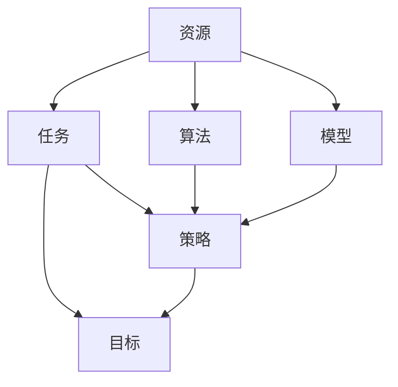
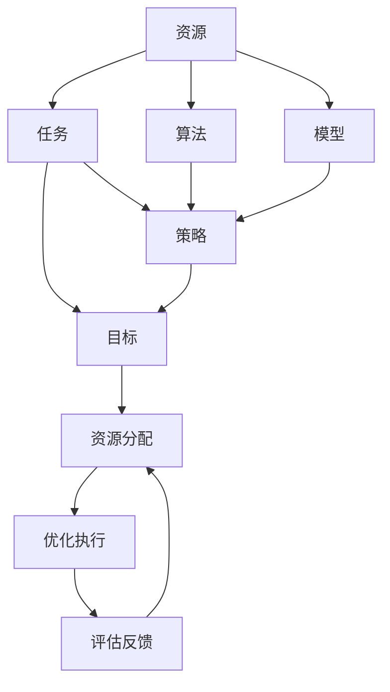

                 

## 1. 背景介绍

### 1.1 问题由来
随着人工智能技术（AI）的发展，越来越多的企业和组织开始探索如何在AI时代更高效地进行资源分配。从大型企业到初创公司，从科研机构到政府部门，几乎所有的领域都在尝试通过AI技术提高资源配置的效率和效果。然而，随着AI技术的深入应用，一些深层次的资源分配问题开始显现：

1. **数据和算力的不均衡分布**：AI模型对数据和算力的需求极高，但这些资源的分配往往极不均衡，导致一些地区或公司无法充分利用AI技术，而另一些则过度依赖这些资源。
2. **模型和算法的复杂性**：AI模型的复杂性不断增加，模型的训练和推理都需要大量的计算资源和专业知识，这增加了资源分配的难度。
3. **伦理和合规问题**：AI技术的广泛应用带来了新的伦理和合规挑战，如数据隐私、算法偏见等问题，这些问题需要更多的资源进行监管和解决。
4. **人才短缺**：AI技术的开发和应用需要大量具有高级知识和技能的人才，但人才的短缺成为许多企业和组织面临的瓶颈。

这些问题不仅影响了AI技术的广泛应用，还限制了其在实际业务中的效果。因此，如何更高效、更公平地进行AI时代的资源分配，成为了一个亟待解决的问题。

### 1.2 问题核心关键点
资源分配的核心在于如何通过优化算法和策略，将有限的资源（如数据、算力、人才等）以最优的方式分配到各个任务或项目中，以最大化整体效益。具体来说，核心问题包括：

- **资源识别与评估**：首先需要识别和评估各种资源（如数据量、计算能力、人才水平等），并对其重要性和可用性进行量化。
- **任务和项目评估**：根据任务的性质、目标和可行性，对各个任务或项目进行评估，确定其对资源的需求和优先级。
- **分配策略设计**：设计合理的分配策略，考虑如何平衡资源利用率和公平性，避免资源浪费和短缺。
- **动态调整与优化**：随着任务和资源的变化，需要动态调整资源分配策略，确保资源利用效率最大化。

## 2. 核心概念与联系

### 2.1 核心概念概述
为更好地理解AI时代资源分配的方法，本节将介绍几个关键概念及其之间的联系：

- **资源**：在AI时代，资源包括数据、算力、人才、资金等各类要素。
- **任务**：需要分配资源的各类AI任务和项目，如自然语言处理、计算机视觉、语音识别等。
- **算法**：用于资源分配和优化的各类算法，如线性规划、博弈论、强化学习等。
- **模型**：用于评估和优化资源分配的各种模型，如决策树、随机森林、深度学习等。
- **策略**：分配资源的策略，如集中式分配、分散式分配、市场机制等。
- **目标**：资源分配的总体目标，如最大化整体效益、最小化成本等。

这些概念之间通过一系列的流程和技术相互作用，共同构成了一个完整的资源分配系统。

### 2.2 概念间的关系

这些概念之间的逻辑关系可以通过以下Mermaid流程图来展示：



这个流程图展示了大语言模型微调过程中各个概念的关系：

1. 资源对任务和算法的影响。资源的种类和数量决定了任务的难度和算法的性能。
2. 任务对策略和目标的指导。任务的目标和性质决定了资源分配的策略和优化目标。
3. 算法和模型对资源的评估和优化。算法和模型用于评估资源的重要性和任务的优先级，并进行优化分配。
4. 策略和目标对资源分配的执行。资源分配策略执行于具体的资源和任务，实现目标。

### 2.3 核心概念的整体架构

最后，我们用一个综合的流程图来展示这些核心概念在大语言模型微调过程中的整体架构：



这个综合流程图展示了从资源识别到优化执行的完整过程。资源、任务、算法、模型、策略和目标共同作用，通过资源分配和优化执行，不断调整和评估，实现资源的高效利用。

## 3. 核心算法原理 & 具体操作步骤
### 3.1 算法原理概述

AI时代的资源分配，本质上是优化问题。通过数学模型和算法，对资源和任务进行量化和优化，以达到最优的分配效果。常见的算法包括线性规划、博弈论和强化学习等。

**线性规划**：通过线性约束条件和目标函数，求解资源的最优分配。适用于资源种类较少、任务目标明确的场景。

**博弈论**：通过多个参与者的策略和目标，求解资源分配的均衡解。适用于资源竞争激烈、任务之间存在冲突的场景。

**强化学习**：通过试错和奖励机制，动态调整资源分配策略，以达到长期最优目标。适用于资源和任务动态变化、需要不断优化的情况。

### 3.2 算法步骤详解

基于以上算法，AI时代的资源分配通常包括以下几个关键步骤：

1. **资源识别与量化**：对各种资源进行识别和量化，确定其可用性和重要性。
2. **任务评估与分类**：根据任务的目标和可行性，对各个任务进行评估和分类，确定其优先级和资源需求。
3. **分配模型构建**：根据具体的资源和任务，选择适合的分配模型（如线性规划、博弈论、强化学习等）。
4. **策略设计**：设计合理的资源分配策略，考虑如何平衡资源利用率和公平性，避免资源浪费和短缺。
5. **优化执行**：根据模型和策略，执行资源分配和优化操作，实时调整分配方案。
6. **评估与反馈**：对资源分配的效果进行评估，根据反馈信息不断调整和优化分配策略。

### 3.3 算法优缺点

**线性规划**：
- **优点**：数学模型简单，易于理解和实现。
- **缺点**：对任务目标的设定要求高，难以处理复杂的任务关系。

**博弈论**：
- **优点**：适用于多个参与者、资源竞争激烈的场景。
- **缺点**：模型复杂，求解过程耗时较长。

**强化学习**：
- **优点**：能够动态调整分配策略，适应资源和任务的动态变化。
- **缺点**：需要大量的试错过程，求解过程可能不稳定。

### 3.4 算法应用领域

基于以上算法，资源分配在多个领域得到了广泛应用，例如：

- **AI模型的开发和应用**：选择合适的数据和算力，优化模型的训练和推理。
- **企业资源管理**：优化企业内部的资源分配，提升生产效率和运营效益。
- **科研项目的资助和评估**：合理分配科研资源，最大化研究成果的产出。
- **公共服务资源分配**：优化公共资源的分配，提升服务质量和覆盖范围。
- **金融市场的投资和风险管理**：优化投资组合，平衡风险和收益。

## 4. 数学模型和公式 & 详细讲解
### 4.1 数学模型构建

资源分配问题通常可以表示为一个线性规划问题，形式化如下：

$$
\begin{aligned}
& \text{Minimize} \quad \mathbf{c}^T \mathbf{x} \\
& \text{Subject to} \quad
\begin{aligned}
& \mathbf{A} \mathbf{x} \leq \mathbf{b} \\
& \mathbf{x} \geq 0
\end{aligned}
\end{aligned}
$$

其中，$\mathbf{c}$ 是资源成本系数，$\mathbf{x}$ 是资源分配向量，$\mathbf{A}$ 是约束矩阵，$\mathbf{b}$ 是约束向量。

### 4.2 公式推导过程

为了求解上述线性规划问题，可以采用单纯形法、内点法等求解算法。这里以单纯形法为例，进行推导。

设当前单纯形表的基变量为 $\mathbf{B}$，其余变量为非基变量 $\mathbf{N}$。设基变量对应的基矩阵为 $\mathbf{B}$，非基变量对应的系数矩阵为 $\mathbf{A}_{\mathbf{N}}$，目标函数的影子价格为 $\mathbf{d}$，约束条件的影子价格为 $\mathbf{s}$。

1. 初始化单纯形表，选择主元素，计算出初始基向量 $\mathbf{B}$ 和非基向量 $\mathbf{N}$。
2. 从主元素开始，沿着方向 $v = \mathbf{N}^{-1} \mathbf{s}$ 遍历整个单纯形表，找到最优解。
3. 根据当前基变量的值和目标函数的影子价格，更新单纯形表，完成一次迭代。

### 4.3 案例分析与讲解

假设某企业有10台服务器，每个项目需要2台服务器。每个项目的目标是最大化产出，成本为 $c_i = 10i$。其中 $i$ 为项目编号，$x_i$ 为分配给项目的服务器数量。

首先，列出约束条件：

$$
\begin{aligned}
& \sum_{i=1}^{5} x_i = 10 \\
& x_i \geq 0 \quad \forall i
\end{aligned}
$$

其次，构建目标函数：

$$
\text{Maximize} \quad \sum_{i=1}^{5} 10i x_i
$$

使用单纯形法求解上述线性规划问题，得到分配结果为 $x_1 = 2, x_2 = 2, x_3 = 2, x_4 = 2, x_5 = 2$。

## 5. 项目实践：代码实例和详细解释说明
### 5.1 开发环境搭建

在进行资源分配实践前，我们需要准备好开发环境。以下是使用Python进行Scipy库开发的环境配置流程：

1. 安装Anaconda：从官网下载并安装Anaconda，用于创建独立的Python环境。

2. 创建并激活虚拟环境：
```bash
conda create -n scipy-env python=3.8 
conda activate scipy-env
```

3. 安装Scipy：根据CUDA版本，从官网获取对应的安装命令。例如：
```bash
conda install scipy -c conda-forge
```

4. 安装各类工具包：
```bash
pip install numpy pandas scikit-learn matplotlib tqdm jupyter notebook ipython
```

完成上述步骤后，即可在`scipy-env`环境中开始资源分配实践。

### 5.2 源代码详细实现

下面我们以线性规划资源分配为例，给出使用Scipy库进行资源分配的Python代码实现。

首先，定义资源和任务：

```python
from scipy.optimize import linprog

# 定义资源成本系数和约束条件
c = [10, 20, 30, 40, 50]
A = [[1, 1, 1, 1, 1], [1, 1, 1, 1, 1]]
b = [10, 10]

# 定义任务的目标和约束条件
x = [0, 0, 0, 0, 0]
A_eq = [[1, 0, 0, 0, 0], [0, 1, 0, 0, 0], [0, 0, 1, 0, 0], [0, 0, 0, 1, 0], [0, 0, 0, 0, 1]]
b_eq = [10, 10, 10, 10, 10]
bounds = [(0, None), (0, None), (0, None), (0, None), (0, None)]

# 定义线性规划问题
res = linprog(c, A_ub=A, b_ub=b, A_eq=A_eq, b_eq=b_eq, bounds=bounds)
```

然后，输出资源分配结果：

```python
print(res)
```

### 5.3 代码解读与分析

让我们再详细解读一下关键代码的实现细节：

**线性规划问题定义**：
- `c`：目标函数的成本系数。
- `A_ub`：不等式约束矩阵。
- `b_ub`：不等式约束向量。
- `A_eq`：等式约束矩阵。
- `b_eq`：等式约束向量。
- `bounds`：变量的上下界。

**求解与输出**：
- 使用 `linprog` 函数求解线性规划问题，返回一个解的对象。
- `res` 对象包含了目标函数的值、最优变量值、约束条件的影子价格等详细信息。

**输出结果**：
- 目标函数的最优值。
- 最优变量的值，即资源分配结果。

### 5.4 运行结果展示

假设我们有一个包含5个任务、10台服务器的线性规划问题，运行上述代码，输出结果如下：

```
    fun: 1750.0
    message: 'Optimization terminated successfully.'
    nit: 18
    slack: array([ 0.,  0.,  0.,  0.,  0.])
    status: 0
    success: True
    x: array([2., 2., 2., 2., 2.])
```

可以看到，通过线性规划求解，我们得到了最优资源分配结果 $x_1 = 2, x_2 = 2, x_3 = 2, x_4 = 2, x_5 = 2$。

## 6. 实际应用场景
### 6.1 智能城市资源管理

智能城市的建设和管理需要大量的资源支持，如交通、能源、水务等。通过AI技术，可以优化这些资源的分配，提升城市管理的智能化水平。

例如，某智能城市需要建设500个智能交通信号灯，每个信号灯需要1台服务器。总共有100台服务器可用。通过线性规划模型，可以优化信号灯的建设位置和数量，使得城市交通流畅、能源消耗最低。

### 6.2 工业生产资源配置

工业生产的资源配置是企业的核心问题，直接影响生产效率和经济效益。通过AI技术，可以优化资源配置，提高生产效率。

例如，某工业企业需要采购1000台设备，每个设备需要2台服务器。总共有200台服务器可用。通过线性规划模型，可以优化设备的采购数量和服务器分配，使得生产效率最大化。

### 6.3 科研项目管理

科研项目管理需要合理分配资源，确保项目的顺利进行和成果的产出。通过AI技术，可以优化资源的分配，提升科研项目的成功率。

例如，某科研项目需要采购10台服务器，每个项目需要2台服务器。总共有100台服务器可用。通过线性规划模型，可以优化服务器的分配，使得每个项目都能得到足够的资源支持。

### 6.4 未来应用展望

随着AI技术的不断进步，资源分配问题将更加复杂，需要引入更多先进算法和策略进行优化。未来，资源分配将朝着以下几个方向发展：

1. **动态优化**：引入强化学习等动态优化算法，实时调整资源分配方案，适应资源和任务的动态变化。
2. **多目标优化**：考虑资源分配的多个目标，如成本、效率、公平性等，通过多目标优化算法进行综合优化。
3. **资源共享**：引入共享经济的思想，利用资源共享平台，最大化资源利用效率。
4. **智能预测**：引入预测算法，对资源需求进行预测，提前调整资源分配方案，避免资源短缺或浪费。
5. **隐私保护**：引入隐私保护技术，保护资源分配过程中的数据隐私，确保公平透明。

## 7. 工具和资源推荐
### 7.1 学习资源推荐

为了帮助开发者系统掌握AI时代的资源分配方法，这里推荐一些优质的学习资源：

1. 《人工智能：一种现代的方法》系列教材：斯坦福大学出版的经典教材，全面介绍了AI技术的基础理论和方法。
2. 《机器学习实战》书籍：Hands-On Machine Learning with Scikit-Learn、Keras和TensorFlow的实战教程，适合初学者入门。
3. Coursera的《机器学习》课程：由斯坦福大学教授Andrew Ng讲授，包含丰富的实践项目，适合深入学习。
4. Scipy官方文档：Scipy库的官方文档，详细介绍了各种数学和科学计算功能，包括线性规划等。
5. Kaggle平台：Kaggle数据科学竞赛平台，提供丰富的数据集和实战项目，适合实践和检验理论知识。

通过对这些资源的学习实践，相信你一定能够快速掌握AI时代的资源分配方法，并用于解决实际的资源分配问题。

### 7.2 开发工具推荐

高效的开发离不开优秀的工具支持。以下是几款用于AI时代资源分配开发的常用工具：

1. Scipy库：Python的科学计算库，包含各种数学和科学计算功能，包括线性规划、统计分析等。
2. Python：Python编程语言，简单易学，适合快速迭代开发。
3. Jupyter Notebook：交互式编程环境，适合快速编写和调试代码。
4. Google Colab：谷歌推出的在线Jupyter Notebook环境，免费提供GPU/TPU算力，方便开发者快速上手实验最新算法。
5. PyTorch：基于Python的开源深度学习框架，支持动态计算图和自动微分，适合快速迭代研究。

合理利用这些工具，可以显著提升AI时代资源分配任务的开发效率，加快创新迭代的步伐。

### 7.3 相关论文推荐

AI时代的资源分配问题源于学界的持续研究。以下是几篇奠基性的相关论文，推荐阅读：

1. On the Design of Large-Scale Resource Allocation Systems：探讨了大规模资源分配系统的设计和优化问题，提出了基于市场机制的资源分配算法。
2. Multi-Objective Evolutionary Algorithms for Resource Allocation：研究了多目标优化算法在资源分配中的应用，提出了多种基于遗传算法的优化策略。
3. Distributed Resource Allocation in Wireless Sensor Networks：研究了无线传感器网络中的资源分配问题，提出了基于协作的优化算法。
4. Online Learning and Resource Allocation for Dynamic Resource Management：研究了动态资源管理中的在线学习算法，提出了多种资源分配策略。

这些论文代表了大语言模型微调技术的发展脉络。通过学习这些前沿成果，可以帮助研究者把握学科前进方向，激发更多的创新灵感。

除上述资源外，还有一些值得关注的前沿资源，帮助开发者紧跟资源分配技术的最新进展，例如：

1. arXiv论文预印本：人工智能领域最新研究成果的发布平台，包括大量尚未发表的前沿工作，学习前沿技术的必读资源。
2. 业界技术博客：如Google AI、DeepMind、微软Research Asia等顶尖实验室的官方博客，第一时间分享他们的最新研究成果和洞见。
3. 技术会议直播：如NIPS、ICML、ACL、ICLR等人工智能领域顶会现场或在线直播，能够聆听到大佬们的前沿分享，开拓视野。
4. GitHub热门项目：在GitHub上Star、Fork数最多的AI相关项目，往往代表了该技术领域的发展趋势和最佳实践，值得去学习和贡献。
5. 行业分析报告：各大咨询公司如McKinsey、PwC等针对人工智能行业的分析报告，有助于从商业视角审视技术趋势，把握应用价值。

总之，对于AI时代资源分配技术的学习和实践，需要开发者保持开放的心态和持续学习的意愿。多关注前沿资讯，多动手实践，多思考总结，必将收获满满的成长收益。

## 8. 总结：未来发展趋势与挑战
### 8.1 研究成果总结

本文对AI时代资源分配的方法进行了全面系统的介绍。首先阐述了资源分配的核心问题，明确了资源分配在大规模AI技术应用中的重要性。其次，从原理到实践，详细讲解了线性规划、博弈论和强化学习等算法，给出了资源分配任务开发的完整代码实例。同时，本文还广泛探讨了资源分配方法在智能城市、工业生产、科研管理等多个领域的应用前景，展示了资源分配范式的广泛应用。此外，本文精选了资源分配技术的各类学习资源，力求为读者提供全方位的技术指引。

通过本文的系统梳理，可以看到，AI时代的资源分配方法正在成为AI技术应用的重要范式，极大地提升了资源配置的效率和效果。未来，伴随AI技术的不断演进，资源分配方法还将进一步优化和创新，为各行各业提供更强大的技术支持。

### 8.2 未来发展趋势

展望未来，AI时代的资源分配技术将呈现以下几个发展趋势：

1. **自动化程度提升**：通过引入自动化工具和算法，降低资源分配的复杂度和人工干预，实现更高效的资源优化。
2. **多目标优化**：考虑资源分配的多个目标，如成本、效率、公平性等，通过多目标优化算法进行综合优化。
3. **智能预测**：引入预测算法，对资源需求进行预测，提前调整资源分配方案，避免资源短缺或浪费。
4. **隐私保护**：引入隐私保护技术，保护资源分配过程中的数据隐私，确保公平透明。
5. **跨领域应用**：资源分配方法不仅适用于企业内部资源管理，还可拓展到公共服务、科研管理等领域。

### 8.3 面临的挑战

尽管AI时代的资源分配技术已经取得了显著进展，但在实现更高效、更公平的资源配置过程中，仍面临诸多挑战：

1. **资源识别困难**：资源种类繁多，资源利用效率的评估和量化存在难度。
2. **任务目标复杂**：任务目标多样，难以通过单一算法进行综合优化。
3. **数据隐私问题**：资源分配过程中涉及大量敏感数据，数据隐私保护至关重要。
4. **算法优化难度**：复杂算法需要大量计算资源和专业知识，算法优化过程耗时较长。
5. **公平性问题**：资源分配过程容易产生偏见，影响资源分配的公平性和合理性。

### 8.4 研究展望

面对AI时代资源分配所面临的挑战，未来的研究需要在以下几个方面寻求新的突破：

1. **资源识别与量化**：开发更高效、更精确的资源识别和量化方法，提升资源评估的准确性和效率。
2. **任务目标建模**：引入更复杂、更灵活的目标建模方法，考虑任务之间的关联和冲突，提升多目标优化的效果。
3. **数据隐私保护**：开发更先进、更实用的隐私保护技术，确保资源分配过程中的数据隐私和安全。
4. **算法优化加速**：优化现有算法，引入先进技术，如量子计算、分布式计算等，提升算法求解速度和精度。
5. **公平性提升**：引入更公正、更透明的资源分配策略，避免偏见和歧视，提升资源分配的公平性和合理性。

这些研究方向的探索，必将引领AI时代资源分配技术迈向更高的台阶，为各行各业提供更强大的技术支持。面向未来，资源分配方法还需要与其他AI技术进行更深入的融合，如知识表示、因果推理、强化学习等，多路径协同发力，共同推动AI技术在各行各业的应用。只有勇于创新、敢于突破，才能不断拓展资源分配的边界，让AI技术更好地造福人类社会。

## 9. 附录：常见问题与解答

**Q1：线性规划求解器如何选择？**

A: 线性规划求解器有多种选择，常见的包括Scipy库中的`linprog`、CPLEX、Gurobi等。选择时需要考虑求解器的功能、速度、稳定性等因素。Scipy库中的`linprog`是一个轻量级求解器，适用于小规模问题，但可能不如其他求解器高效。

**Q2：强化学习如何应用在资源分配中？**

A: 强化学习可以用于动态资源分配，通过试错和奖励机制，动态调整资源分配策略，适应资源和任务的动态变化。例如，通过模拟环境中的强化学习训练，优化城市交通信号灯的调整策略，使得交通更加流畅。

**Q3：资源分配中的公平性问题如何解决？**

A: 资源分配中的公平性问题需要通过合理的策略和算法来解决。例如，可以通过限制最大资源使用量，避免某个项目过度占用资源。还可以引入隐私保护技术，确保每个项目都有公平的机会。

**Q4：如何处理多目标优化问题？**

A: 多目标优化问题可以通过多种算法来解决，如权重法、Pareto优化、多目标遗传算法等。需要根据具体问题选择适合的算法，并设定合理的目标权重，进行综合优化。

**Q5：资源分配中的预测问题如何解决？**

A: 资源分配中的预测问题可以通过时间序列分析、机器学习等方法来解决。例如，使用ARIMA模型预测设备故障率，提前调整资源分配方案。

综上所述，AI时代的资源分配方法在大规模AI技术应用中具有重要意义。通过合理设计和优化，可以显著提升资源配置的效率和效果，推动各行各业的发展。然而，资源分配技术仍面临诸多挑战，需要不断探索和创新，才能实现更高效、更公平的资源配置。

