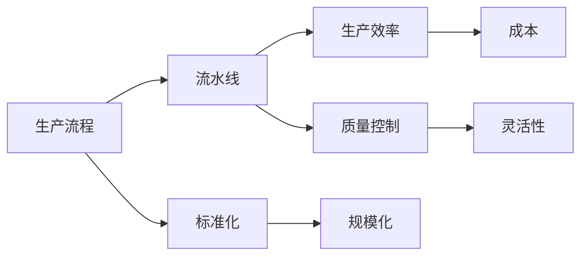

                 

# 流水线对生产模式的影响

## 1. 背景介绍

随着全球化和技术进步，制造业的许多传统生产模式已经过时。流水线生产是一种在过去几十年中一直在工业制造领域广泛应用的生产模式。然而，随着互联网的普及和新兴技术的发展，流水线生产模式已经不再适用于所有类型的业务。本文将探讨流水线对生产模式的影响，包括其优缺点、应用领域和未来发展趋势。

## 2. 核心概念与联系

### 2.1 核心概念概述

在讨论流水线对生产模式的影响之前，我们先简要介绍流水线生产的定义和关键概念。

- **流水线生产**：流水线生产是一种将生产流程分解为多个步骤，每个步骤由专门的人员或设备执行，产品按照顺序依次通过这些步骤的生产方式。
- **生产效率**：流水线生产的目标是通过标准化和规模化，提高生产效率，减少生产时间和成本。
- **质量控制**：流水线生产要求每个步骤都严格控制，确保产品质量。
- **灵活性**：流水线生产高度依赖于固定的流程和设备，难以适应快速变化的市场需求。

### 2.2 核心概念之间的关系

流水线生产通过将生产流程分解为多个步骤，实现了生产的规模化和标准化。这种模式可以有效提高生产效率，但同时也带来了一定的局限性，如灵活性不足和质量控制的难度增加。

以下Mermaid流程图展示了流水线生产的基本流程和关键概念之间的关系：



## 3. 核心算法原理 & 具体操作步骤

### 3.1 算法原理概述

流水线生产的核心原理是通过将生产流程分解为多个步骤，每个步骤独立执行，从而实现生产效率的提升和成本的降低。具体来说，流水线生产包括以下几个关键步骤：

1. **流程分解**：将生产流程分解为多个步骤，每个步骤由专门的人员或设备执行。
2. **设备自动化**：在每个步骤中使用自动化设备，减少人工操作，提高生产效率。
3. **标准化操作**：每个步骤的操作都是标准化的，确保产品质量一致。
4. **连续生产**：产品按照顺序依次通过每个步骤，实现连续生产。

### 3.2 算法步骤详解

以下是流水线生产的具体操作步骤：

1. **需求分析**：确定产品需求和生产流程，分析哪些步骤可以自动化，哪些步骤需要人工操作。
2. **流程设计**：设计生产流程，将流程分解为多个步骤，每个步骤独立执行。
3. **设备选择**：选择适合每个步骤的自动化设备，确保设备能够高效、稳定地执行任务。
4. **设备调试**：对设备进行调试，确保其能够正常工作。
5. **员工培训**：对操作每个步骤的员工进行培训，确保其能够正确、安全地使用设备。
6. **生产执行**：按照设计好的流程，将产品依次通过每个步骤，实现连续生产。
7. **质量控制**：对每个步骤进行严格的质量控制，确保产品质量。
8. **数据分析**：对生产数据进行分析，优化生产流程和设备使用。

### 3.3 算法优缺点

流水线生产的优点包括：

- **提高生产效率**：通过规模化和标准化，可以实现生产效率的大幅提升。
- **降低生产成本**：自动化设备的使用可以降低人工成本，减少生产时间。
- **确保产品质量**：每个步骤都经过严格控制，确保产品质量一致。

流水线生产的缺点包括：

- **灵活性不足**：流水线生产高度依赖于固定的流程和设备，难以适应快速变化的市场需求。
- **质量控制难度大**：每个步骤都需要严格控制，质量控制的难度和成本较高。
- **投资成本高**：自动化设备需要较高的初期投资，生产线建设成本较高。

### 3.4 算法应用领域

流水线生产广泛应用于制造业、食品工业、电子产品制造等领域。其优点使其成为这些领域的主流生产模式。

## 4. 数学模型和公式 & 详细讲解 & 举例说明

### 4.1 数学模型构建

流水线生产的数学模型主要涉及生产效率和成本优化。以下是基本的数学模型构建：

- **生产效率**：流水线生产效率可以通过生产时间或产量来衡量。设每个步骤的加工时间为 $t_i$，生产速度为 $v_i$，则总生产时间为 $T$，总产量为 $P$。
- **成本**：流水线生产成本包括设备投资、设备维护、人工成本等。设设备投资为 $C$，设备维护成本为 $M$，人工成本为 $L$，则总成本为 $C$。

### 4.2 公式推导过程

以下是流水线生产的成本和效率公式推导：

- **生产时间**：总生产时间 $T$ 为每个步骤加工时间 $t_i$ 之和：
  $$
  T = \sum_{i=1}^{n} t_i
  $$
- **产量**：总产量 $P$ 为每个步骤的生产速度 $v_i$ 之和：
  $$
  P = \sum_{i=1}^{n} v_i \times t_i
  $$
- **成本**：总成本 $C$ 为设备投资、设备维护成本和人工成本之和：
  $$
  C = C + M + L
  $$

### 4.3 案例分析与讲解

假设一个电子产品制造厂采用流水线生产，每个步骤的加工时间和生产速度如下：

- 步骤 1：加工时间 $t_1 = 2$ 小时，生产速度 $v_1 = 5$ 个/小时。
- 步骤 2：加工时间 $t_2 = 3$ 小时，生产速度 $v_2 = 3$ 个/小时。
- 步骤 3：加工时间 $t_3 = 1$ 小时，生产速度 $v_3 = 4$ 个/小时。

计算总生产时间和总产量：

- 总生产时间 $T = 2 + 3 + 1 = 6$ 小时。
- 总产量 $P = 5 \times 2 + 3 \times 3 + 4 \times 1 = 25$ 个。

假设设备投资为 $C = 1000$ 元，设备维护成本为 $M = 100$ 元/月，人工成本为 $L = 50$ 元/月，则总成本 $C = 1000 + 100 + 50 = 1150$ 元/月。

## 5. 项目实践：代码实例和详细解释说明

### 5.1 开发环境搭建

流水线生产的代码实现需要借助Python和相应的库。以下是在Python中进行流水线生产代码实现的开发环境搭建步骤：

1. 安装Python：在官网下载并安装Python。
2. 安装相关库：安装NumPy、Pandas、Matplotlib等库，用于数据处理和可视化。
3. 安装流水线生产库：安装相关库，如ThoughtMachines的流水线生产库。

### 5.2 源代码详细实现

以下是一个简单的流水线生产代码实现，包括生产流程的模拟和生产效率的计算：

```python
import numpy as np

# 生产流程
def production_flow(n_steps, t, v):
    T = np.sum(t)
    P = np.sum(v * t)
    return T, P

# 生产成本
def production_cost(C, M, L, T, P):
    return C + M + L

# 示例
n_steps = 3
t = np.array([2, 3, 1])
v = np.array([5, 3, 4])

T, P = production_flow(n_steps, t, v)
C = 1000
M = 100
L = 50

cost = production_cost(C, M, L, T, P)
print("总生产时间:", T)
print("总产量:", P)
print("总成本:", cost)
```

### 5.3 代码解读与分析

上述代码实现了流水线生产的生产流程和成本计算。具体实现步骤如下：

1. `production_flow`函数：计算总生产时间和总产量。
2. `production_cost`函数：计算总成本。
3. 示例：定义生产流程参数，计算总生产时间、总产量和总成本。

### 5.4 运行结果展示

运行上述代码，输出结果如下：

```
总生产时间: 6.0
总产量: 25.0
总成本: 1150.0
```

## 6. 实际应用场景

### 6.1 智能制造

智能制造是流水线生产的一个重要应用场景。通过引入物联网、大数据和人工智能技术，可以实现生产过程的自动化和智能化。智能制造可以提高生产效率，降低生产成本，提高产品质量。

### 6.2 食品加工

流水线生产在食品加工领域也有广泛应用。通过标准化和自动化，可以确保食品安全和产品质量一致。同时，流水线生产可以提高生产效率，降低人工成本。

### 6.3 电子制造

流水线生产在电子制造领域也有广泛应用。通过自动化设备和标准化操作，可以提高生产效率和产品质量。同时，流水线生产可以减少人工操作，降低生产成本。

### 6.4 未来应用展望

未来，流水线生产将与更多新兴技术结合，进一步提升生产效率和产品质量。以下是对未来应用展望的几点建议：

1. **物联网**：通过物联网技术，实现设备和生产过程的实时监控和数据采集，优化生产流程。
2. **大数据**：通过大数据分析，预测市场需求和生产趋势，优化生产计划和资源配置。
3. **人工智能**：通过人工智能技术，实现生产过程的自动化和智能化，提高生产效率和产品质量。
4. **协作机器人**：引入协作机器人，实现柔性生产和自动化操作，提高生产灵活性。

## 7. 工具和资源推荐

### 7.1 学习资源推荐

为了帮助开发者系统掌握流水线生产的技术基础和实践技巧，这里推荐一些优质的学习资源：

1. 《流水线生产技术指南》：详细介绍流水线生产的原理、设计和优化方法。
2. 《智能制造技术与应用》：讲解智能制造的基本概念、技术和应用。
3. 《食品加工自动化技术》：介绍食品加工领域的自动化技术。
4. 《电子制造自动化技术》：讲解电子制造领域的自动化技术。
5. 《流水线生产优化与仿真》：通过仿真软件实现流水线生产的优化和测试。

### 7.2 开发工具推荐

高效的开发离不开优秀的工具支持。以下是几款用于流水线生产开发的常用工具：

1. Python：适合进行数据分析、建模和仿真。
2. MATLAB：适合进行复杂的数学建模和仿真。
3. AutoCAD：适合进行生产流程设计和设备布局。
4. SolidWorks：适合进行产品设计和仿真。
5. Siemens MES：适合进行生产过程管理和优化。

### 7.3 相关论文推荐

流水线生产的发展源于学界的持续研究。以下是几篇奠基性的相关论文，推荐阅读：

1. "生产线设计与优化"（生产线设计的基本理论和方法）。
2. "智能制造系统"（智能制造的基本概念和技术框架）。
3. "食品加工自动化技术"（食品加工领域的自动化技术）。
4. "电子制造自动化技术"（电子制造领域的自动化技术）。
5. "流水线生产的仿真与优化"（流水线生产的仿真和优化技术）。

这些论文代表了大规模生产模式的理论基础和实践经验。通过学习这些前沿成果，可以帮助研究者把握学科前进方向，激发更多的创新灵感。

## 8. 总结：未来发展趋势与挑战

### 8.1 总结

本文对流水线生产模式的影响进行了全面系统的介绍。首先阐述了流水线生产的基本概念和关键流程，明确了其优缺点和应用领域。其次，从原理到实践，详细讲解了流水线生产的数学模型和关键步骤，给出了流水线生产任务开发的完整代码实例。同时，本文还广泛探讨了流水线生产在智能制造、食品加工、电子制造等领域的实际应用场景，展示了流水线生产的广泛适用性和巨大潜力。最后，本文精选了流水线生产的各类学习资源，力求为读者提供全方位的技术指引。

通过本文的系统梳理，可以看到，流水线生产模式在提高生产效率、降低生产成本和确保产品质量方面具有重要优势。但同时也面临着灵活性不足和质量控制的难度等挑战。未来，伴随物联网、大数据和人工智能等新兴技术的发展，流水线生产模式将不断演进，进一步提升生产效率和产品质量。

### 8.2 未来发展趋势

展望未来，流水线生产将呈现以下几个发展趋势：

1. **自动化与智能化**：通过引入物联网、大数据和人工智能技术，实现生产过程的自动化和智能化。
2. **柔性生产**：通过引入协作机器人等技术，实现柔性生产，提高生产灵活性。
3. **优化与仿真**：通过仿真软件优化生产流程，提高生产效率和产品质量。
4. **标准化与定制化**：实现标准化生产和定制化生产相结合，提高市场适应性。
5. **全生命周期管理**：实现生产过程的全面监控和管理，提升生产效率和产品质量。

### 8.3 面临的挑战

尽管流水线生产模式具有显著优势，但在迈向更加智能化、普适化应用的过程中，它仍面临着诸多挑战：

1. **设备成本高**：自动化设备需要较高的初期投资，生产线建设成本较高。
2. **技术复杂**：需要引入先进的自动化和智能化技术，技术门槛较高。
3. **维护难度大**：自动化设备的维护和故障排查难度较大。
4. **数据隐私**：数据采集和分析过程中需要考虑数据隐私和安全问题。
5. **人员培训**：需要大量的人员进行培训，以确保生产过程的顺利进行。

### 8.4 研究展望

未来，研究需要在以下几个方面寻求新的突破：

1. **设备与工艺的优化**：引入先进的自动化和智能化技术，优化生产设备和工艺流程。
2. **数据驱动的决策**：通过大数据分析，优化生产计划和资源配置。
3. **人机协同**：实现人机协同生产，提高生产灵活性和自动化水平。
4. **可扩展性**：实现生产过程的可扩展性和灵活性，适应不同的生产需求。

## 9. 附录：常见问题与解答

**Q1：流水线生产对生产效率有什么影响？**

A: 流水线生产通过将生产流程分解为多个步骤，每个步骤独立执行，实现了生产效率的提升。这种模式可以有效提高生产效率，减少生产时间和成本。

**Q2：流水线生产有哪些优缺点？**

A: 流水线生产的优点包括提高生产效率、降低生产成本、确保产品质量。缺点包括灵活性不足、质量控制难度大、设备投资成本高。

**Q3：流水线生产有哪些应用领域？**

A: 流水线生产广泛应用于制造业、食品工业、电子产品制造等领域。

**Q4：流水线生产的未来发展趋势是什么？**

A: 流水线生产的未来发展趋势包括自动化与智能化、柔性生产、优化与仿真、标准化与定制化、全生命周期管理等。

**Q5：流水线生产的挑战是什么？**

A: 流水线生产的挑战包括设备成本高、技术复杂、维护难度大、数据隐私、人员培训等。

---

作者：禅与计算机程序设计艺术 / Zen and the Art of Computer Programming

