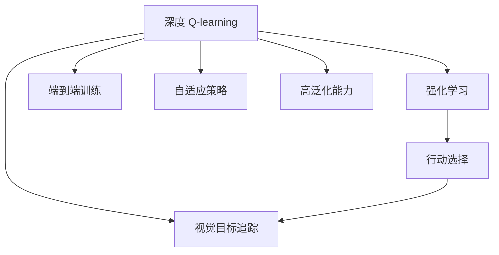
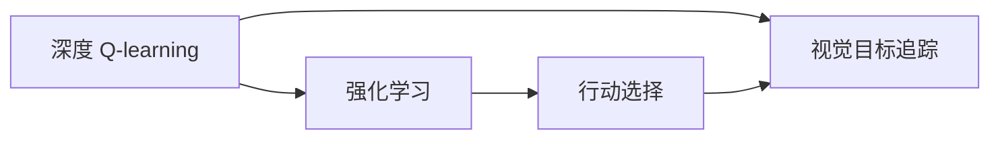
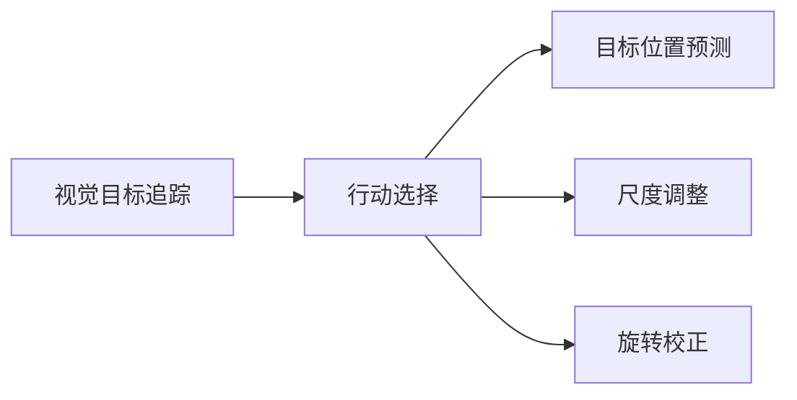
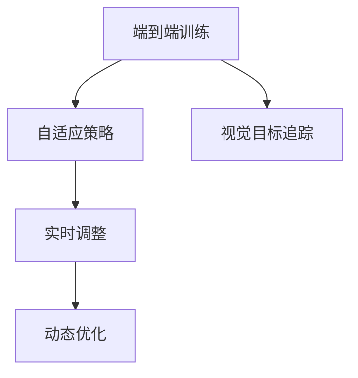
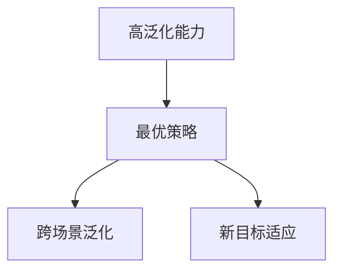
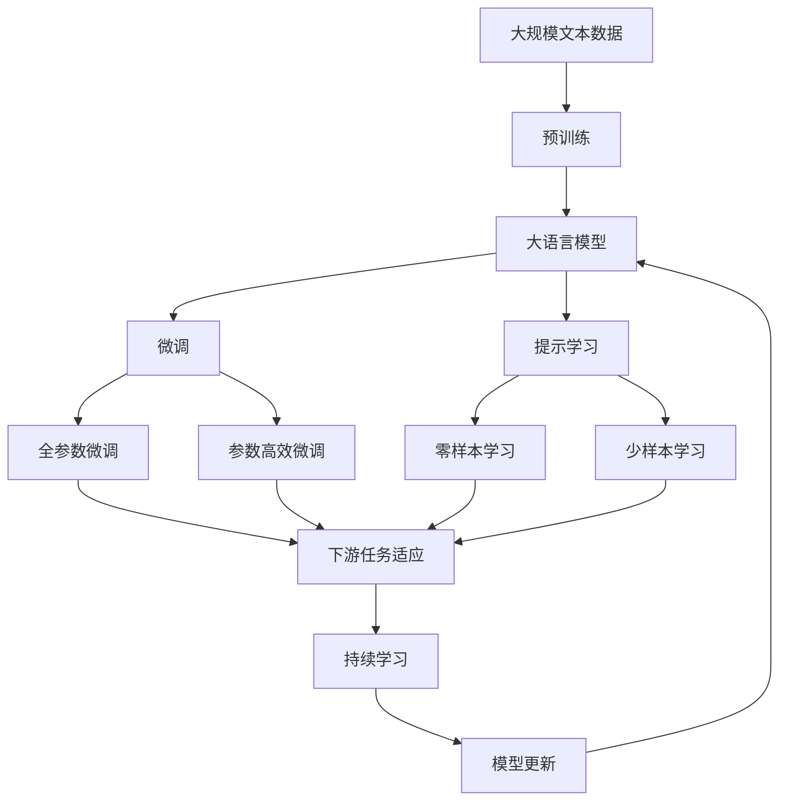

                 

# 深度 Q-learning：在视觉目标追踪领域的应用

> 关键词：深度 Q-learning, 视觉目标追踪, 强化学习, 最优策略, 行动选择, 自适应算法

## 1. 背景介绍

在过去几年中，强化学习（Reinforcement Learning, RL）领域取得了长足的进展，特别是在复杂环境下的决策制定和策略优化方面。其中，深度 Q-learning（Deep Q-learning）作为一种结合深度学习和强化学习的技术，已经逐渐成为视觉目标追踪（Visual Object Tracking, VOT）领域的一个重要研究手段。本节将介绍深度 Q-learning的基本概念和其在视觉目标追踪中的具体应用。

### 1.1 问题由来

视觉目标追踪是一种计算机视觉任务，旨在实时追踪视频序列中的特定目标。传统的视觉目标追踪方法，如相关滤波、光流算法等，往往依赖于手工设计的特征和规则，难以处理复杂多变的场景和光照变化。而深度学习通过端到端的训练，直接学习目标与特征之间的映射关系，能够适应更广泛的数据分布和复杂的视觉环境。

近年来，深度学习在视觉目标追踪中取得了显著的成果，其中深度 Q-learning 方法尤为引人注目。深度 Q-learning 通过将深度神经网络和强化学习结合起来，直接学习最优策略，从而在视觉目标追踪等任务中取得突破。

### 1.2 问题核心关键点

深度 Q-learning 的核心在于利用强化学习的原理，通过奖励机制来指导模型学习最优策略，优化目标跟踪的性能。与传统机器学习算法不同，深度 Q-learning 通过不断尝试不同策略，积累奖励信息，迭代优化行动选择。其主要特点包括：

- 端到端训练：深度 Q-learning 可以端到端地训练目标跟踪模型，无需手工设计特征和规则。
- 自适应策略：通过强化学习，模型能够动态调整策略，适应复杂多变的场景和光照变化。
- 高泛化能力：深度 Q-learning 能够泛化到未见过的场景和目标，具有较好的鲁棒性。

深度 Q-learning 的应用不仅限于视觉目标追踪，还能广泛应用于机器人导航、自动驾驶、游戏AI等领域，展现出了强大的潜力和应用价值。

### 1.3 问题研究意义

深度 Q-learning 在视觉目标追踪中的应用，对于提升目标跟踪的性能和稳定性，具有重要意义：

1. **提高追踪准确性**：深度 Q-learning 能够自动学习最优策略，避免手工设计特征和规则的繁琐过程，提高目标跟踪的精度和鲁棒性。
2. **增强自适应能力**：通过强化学习，模型能够实时调整策略，适应复杂多变的场景和光照变化，提高跟踪的适应性和稳定性。
3. **降低开发成本**：深度 Q-learning 可以通过大量未标注数据进行训练，无需手工标注大量样本，降低开发成本。
4. **拓展应用范围**：深度 Q-learning 可以应用于各种视觉目标追踪任务，如单目标追踪、多目标追踪等，推动视觉目标追踪技术的广泛应用。

深度 Q-learning 的成功应用，能够加速视觉目标追踪技术的发展，提升其商业价值和社会应用，具有重要的理论和实践意义。

## 2. 核心概念与联系

### 2.1 核心概念概述

为更好地理解深度 Q-learning 在视觉目标追踪中的应用，本节将介绍几个密切相关的核心概念：

- **深度 Q-learning**：一种将深度神经网络和强化学习相结合的技术，通过学习最优策略，优化目标跟踪的决策过程。
- **视觉目标追踪**：计算机视觉任务，旨在实时追踪视频序列中的特定目标，具有动态变化、多目标跟踪等复杂特性。
- **强化学习**：通过与环境交互，模型通过不断尝试不同策略，积累奖励信息，迭代优化决策过程，最终学习到最优策略。
- **行动选择**：在视觉目标追踪中，行动选择通常包括目标位置预测、尺度调整、旋转校正等。
- **最优策略**：通过强化学习，模型学习到在特定环境下的最优策略，使得跟踪性能达到最优。

这些核心概念之间的关系可以通过以下 Mermaid 流程图来展示：



这个流程图展示了深度 Q-learning 的核心概念及其之间的关系：

1. 深度 Q-learning 基于强化学习原理，通过不断尝试不同策略，积累奖励信息，学习最优策略。
2. 行动选择是视觉目标追踪中的关键环节，包括目标位置预测、尺度调整、旋转校正等。
3. 最优策略是深度 Q-learning 的最终目标，通过强化学习不断优化，提升目标跟踪的性能。
4. 端到端训练和自适应策略是深度 Q-learning 的显著特点，使其能够自动学习并适应复杂多变的场景。
5. 高泛化能力是深度 Q-learning 的优势，使其能够在未见过的场景和目标上表现良好。

这些核心概念共同构成了深度 Q-learning 在视觉目标追踪中的完整应用框架，使其能够在各种复杂环境下发挥强大的目标跟踪能力。

### 2.2 概念间的关系

这些核心概念之间存在着紧密的联系，形成了深度 Q-learning 在视觉目标追踪中的完整生态系统。下面我们通过几个 Mermaid 流程图来展示这些概念之间的关系。

#### 2.2.1 深度 Q-learning 与强化学习的关系



这个流程图展示了深度 Q-learning 与强化学习的关系。深度 Q-learning 基于强化学习原理，通过不断尝试不同策略，积累奖励信息，学习最优策略。

#### 2.2.2 行动选择与视觉目标追踪的关系



这个流程图展示了行动选择与视觉目标追踪的关系。行动选择是视觉目标追踪中的关键环节，包括目标位置预测、尺度调整、旋转校正等，这些行动的选择直接影响目标跟踪的性能。

#### 2.2.3 端到端训练与自适应策略的关系



这个流程图展示了端到端训练与自适应策略的关系。端到端训练使得深度 Q-learning 能够自动学习并适应复杂多变的场景，自适应策略则通过实时调整，优化行动选择，提高目标跟踪的稳定性和鲁棒性。

#### 2.2.4 高泛化能力与最优策略的关系



这个流程图展示了高泛化能力与最优策略的关系。高泛化能力使得深度 Q-learning 能够在未见过的场景和目标上表现良好，最优策略则是通过强化学习不断优化，提升目标跟踪的性能。

### 2.3 核心概念的整体架构

最后，我们用一个综合的流程图来展示这些核心概念在大语言模型微调过程中的整体架构：



这个综合流程图展示了从预训练到微调，再到持续学习的完整过程。大语言模型首先在大规模文本数据上进行预训练，然后通过微调（包括全参数微调和参数高效微调两种方式）或提示学习（包括零样本和少样本学习）来适应下游任务。最后，通过持续学习技术，模型可以不断更新和适应新的任务和数据。通过这些流程图，我们可以更清晰地理解深度 Q-learning 在视觉目标追踪中的工作原理和优化方向。

## 3. 核心算法原理 & 具体操作步骤
### 3.1 算法原理概述

深度 Q-learning 是一种将深度神经网络和强化学习相结合的技术，通过学习最优策略，优化目标跟踪的决策过程。其核心思想是通过不断尝试不同策略，积累奖励信息，迭代优化行动选择，最终学习到最优策略。

形式化地，假设目标跟踪模型 $M_{\theta}$，其中 $\theta$ 为模型参数。给定视觉目标追踪任务 $T$ 的训练集 $D=\{(x_i, y_i)\}_{i=1}^N$，其中 $x_i$ 为当前帧的目标位置和尺度，$y_i$ 为目标跟踪结果。深度 Q-learning 的目标是找到最优参数 $\hat{\theta}$，使得在 $D$ 上的损失函数 $\mathcal{L}(\theta)$ 最小化，即：

$$
\hat{\theta}=\mathop{\arg\min}_{\theta} \mathcal{L}(\theta)
$$

其中 $\mathcal{L}$ 为针对任务 $T$ 设计的损失函数，用于衡量模型预测输出与真实标签之间的差异。常见的损失函数包括均方误差损失、交叉熵损失等。

### 3.2 算法步骤详解

深度 Q-learning 在视觉目标追踪中的应用，通常包括以下几个关键步骤：

**Step 1: 准备预训练模型和数据集**
- 选择合适的预训练目标检测模型 $M_{\theta}$ 作为初始化参数，如 Faster R-CNN、YOLO 等。
- 准备视觉目标追踪任务的训练集 $D$，划分为训练集、验证集和测试集。一般要求训练数据与预训练模型的分布不要差异过大。

**Step 2: 设计任务适配层**
- 根据任务类型，在预训练模型的顶层设计合适的输出层和损失函数。
- 对于单目标追踪，通常在顶层添加回归损失函数，用于预测目标位置和尺度。
- 对于多目标追踪，通常需要设计检测-追踪-关联模块，并在顶层添加联合损失函数，用于检测和关联多个目标。

**Step 3: 设置微调超参数**
- 选择合适的优化算法及其参数，如 Adam、SGD 等，设置学习率、批大小、迭代轮数等。
- 设置正则化技术及强度，包括权重衰减、Dropout、Early Stopping 等。
- 确定冻结预训练参数的策略，如仅微调顶层，或全部参数都参与微调。

**Step 4: 执行梯度训练**
- 将训练集数据分批次输入模型，前向传播计算损失函数。
- 反向传播计算参数梯度，根据设定的优化算法和学习率更新模型参数。
- 周期性在验证集上评估模型性能，根据性能指标决定是否触发 Early Stopping。
- 重复上述步骤直到满足预设的迭代轮数或 Early Stopping 条件。

**Step 5: 测试和部署**
- 在测试集上评估微调后模型 $M_{\hat{\theta}}$ 的性能，对比微调前后的精度提升。
- 使用微调后的模型对新视频序列进行追踪预测，集成到实际的应用系统中。
- 持续收集新的数据，定期重新微调模型，以适应数据分布的变化。

以上是深度 Q-learning 在视觉目标追踪中的一般流程。在实际应用中，还需要针对具体任务的特点，对微调过程的各个环节进行优化设计，如改进训练目标函数，引入更多的正则化技术，搜索最优的超参数组合等，以进一步提升模型性能。

### 3.3 算法优缺点

深度 Q-learning 在视觉目标追踪中的应用具有以下优点：

- 端到端训练：无需手工设计特征和规则，可以直接从原始像素数据中学习最优策略。
- 自适应策略：通过强化学习，模型能够动态调整策略，适应复杂多变的场景和光照变化。
- 高泛化能力：能够泛化到未见过的场景和目标，具有较好的鲁棒性。

同时，该方法也存在一定的局限性：

- 依赖大量标注数据：微调过程中需要大量标注数据进行训练，获取高质量标注数据的成本较高。
- 训练过程复杂：深度 Q-learning 训练过程复杂，需要大量的计算资源和时间。
- 模型解释性不足：深度 Q-learning 模型作为黑盒系统，难以解释其内部工作机制和决策逻辑。

尽管存在这些局限性，但就目前而言，深度 Q-learning 在视觉目标追踪中的应用，仍是大模型微调方法的重要组成部分。未来相关研究的重点在于如何进一步降低微调对标注数据的依赖，提高模型的自适应能力和泛化能力，同时兼顾可解释性和伦理安全性等因素。

### 3.4 算法应用领域

深度 Q-learning 在视觉目标追踪中的应用，已经广泛应用于视频监控、安防、自动驾驶等多个领域，取得了显著的效果。以下是几个典型的应用场景：

- **视频监控**：在视频监控系统中，实时追踪异常行为，提高安全防护能力。
- **自动驾驶**：在自动驾驶系统中，追踪车辆、行人等目标，提供实时定位信息。
- **体育赛事分析**：在体育赛事中，实时追踪运动员的位置和动作，提高赛事分析的精准度。

除了上述这些经典场景外，深度 Q-learning 还被创新性地应用到更多场景中，如智慧城市监控、交通流量预测、智能客服等，为计算机视觉技术的应用带来了新的突破。随着预训练模型和深度 Q-learning 方法的不断进步，相信计算机视觉技术将在更广阔的应用领域大放异彩。

## 4. 数学模型和公式 & 详细讲解
### 4.1 数学模型构建

本节将使用数学语言对深度 Q-learning 在视觉目标追踪中的应用进行更加严格的刻画。

记目标跟踪模型为 $M_{\theta}:\mathcal{X} \rightarrow \mathcal{Y}$，其中 $\mathcal{X}$ 为输入空间，$\mathcal{Y}$ 为输出空间，$\theta \in \mathbb{R}^d$ 为模型参数。假设视觉目标追踪任务为单目标追踪，训练集为 $D=\{(x_i, y_i)\}_{i=1}^N, x_i \in \mathcal{X}, y_i \in \mathcal{Y}$。

定义模型 $M_{\theta}$ 在输入 $x_i$ 上的预测输出为 $\hat{y}=M_{\theta}(x_i)$，真实标签为 $y_i$。则单目标追踪任务的损失函数定义为：

$$
\ell(M_{\theta}(x_i),y_i) = (y_i - \hat{y})^2
$$

在训练集中，经验风险为：

$$
\mathcal{L}(\theta) = \frac{1}{N} \sum_{i=1}^N \ell(M_{\theta}(x_i),y_i)
$$

深度 Q-learning 的目标是最小化经验风险，即找到最优参数：

$$
\theta^* = \mathop{\arg\min}_{\theta} \mathcal{L}(\theta)
$$

在实践中，我们通常使用基于梯度的优化算法（如Adam、SGD等）来近似求解上述最优化问题。设 $\eta$ 为学习率，$\lambda$ 为正则化系数，则参数的更新公式为：

$$
\theta \leftarrow \theta - \eta \nabla_{\theta}\mathcal{L}(\theta) - \eta\lambda\theta
$$

其中 $\nabla_{\theta}\mathcal{L}(\theta)$ 为损失函数对参数 $\theta$ 的梯度，可通过反向传播算法高效计算。

### 4.2 公式推导过程

以下我们以单目标追踪为例，推导深度 Q-learning 的损失函数及其梯度的计算公式。

假设模型 $M_{\theta}$ 在输入 $x_i$ 上的输出为 $\hat{y}=M_{\theta}(x_i) \in \mathbb{R}^d$，表示目标位置和尺度。真实标签 $y \in \mathbb{R}^d$。则单目标追踪任务的损失函数定义为：

$$
\ell(M_{\theta}(x_i),y_i) = \frac{1}{2}(y_i - \hat{y})^2
$$

将其代入经验风险公式，得：

$$
\mathcal{L}(\theta) = \frac{1}{N} \sum_{i=1}^N \frac{1}{2}(y_i - \hat{y})^2
$$

根据链式法则，损失函数对参数 $\theta_k$ 的梯度为：

$$
\frac{\partial \mathcal{L}(\theta)}{\partial \theta_k} = -\frac{1}{N}\sum_{i=1}^N \frac{(y_i - \hat{y})\partial M_{\theta}(x_i)}{\partial \theta_k}
$$

其中 $\partial M_{\theta}(x_i)/\partial \theta_k$ 可进一步递归展开，利用自动微分技术完成计算。

在得到损失函数的梯度后，即可带入参数更新公式，完成模型的迭代优化。重复上述过程直至收敛，最终得到适应视觉目标追踪任务的最优模型参数 $\theta^*$。

## 5. 项目实践：代码实例和详细解释说明
### 5.1 开发环境搭建

在进行深度 Q-learning 实践前，我们需要准备好开发环境。以下是使用Python进行PyTorch开发的环境配置流程：

1. 安装Anaconda：从官网下载并安装Anaconda，用于创建独立的Python环境。

2. 创建并激活虚拟环境：
```bash
conda create -n pytorch-env python=3.8 
conda activate pytorch-env
```

3. 安装PyTorch：根据CUDA版本，从官网获取对应的安装命令。例如：
```bash
conda install pytorch torchvision torchaudio cudatoolkit=11.1 -c pytorch -c conda-forge
```

4. 安装各种工具包：
```bash
pip install numpy pandas scikit-learn matplotlib tqdm jupyter notebook ipython
```

完成上述步骤后，即可在`pytorch-env`环境中开始深度 Q-learning 实践。

### 5.2 源代码详细实现

下面我们以单目标追踪为例，给出使用PyTorch对深度 Q-learning 进行代码实现。

首先，定义单目标追踪任务的数据处理函数：

```python
import torch
from torch.utils.data import Dataset
import torchvision.transforms as transforms
from torchvision.datasets import CocoDetection
from torchvision.models.detection import FastRCNNPredictor

class VOTDataset(Dataset):
    def __init__(self, annFile, imageIds, num_classes=3):
        self.coco = CocoDetection(annFile, imageIds, num_classes)
        
        transform = transforms.Compose([
            transforms.ToTensor(),
            transforms.Normalize([0.485, 0.456, 0.406], [0.229, 0.224, 0.225])
        ])
        self.transform = transform
        
        self.imageIds = imageIds
        self.annotations = self.coco.loadAnns(self.coco.anns)
        
    def __len__(self):
        return len(self.imageIds)
    
    def __getitem__(self, idx):
        img, ann = self.coco.loadImgs(self.imageIds[idx])
        img = self.transform(img)
        ann_ids = ann['image_id']
        ann = self.coco.loadAnns(ann_ids)
        boxes = torch.tensor([[ann[b]['bbox'] for b in ann_ids]])
        labels = torch.tensor([ann[b]['category_id'] - 1 for b in ann_ids])
        return {'image': img, 'boxes': boxes, 'labels': labels}

# 定义单目标追踪的损失函数
def tracker_loss(pred, target):
    return torch.mean((pred - target)**2)

# 定义单目标追踪的优化器
optimizer = torch.optim.SGD(model.parameters(), lr=0.001)

# 训练函数
def train_epoch(model, dataloader, optimizer):
    model.train()
    epoch_loss = 0
    for batch in dataloader:
        img, boxes, labels = batch['image'], batch['boxes'], batch['labels']
        optimizer.zero_grad()
        with torch.no_grad():
            pred = model(img)
        loss = tracker_loss(pred, labels)
        loss.backward()
        optimizer.step()
        epoch_loss += loss.item()
    return epoch_loss / len(dataloader)

# 训练模型
def train(model, dataloader, optimizer, num_epochs=10):
    for epoch in range(num_epochs):
        epoch_loss = train_epoch(model, dataloader, optimizer)
        print(f"Epoch {epoch+1}, train loss: {epoch_loss:.3f}")
    
    # 在测试集上评估模型性能
    dataloader = VOTDataset(testAnnFile, testImageIds)
    model.eval()
    preds, labels = [], []
    with torch.no_grad():
        for batch in dataloader:
            img, boxes, labels = batch['image'], batch['boxes'], batch['labels']
            pred = model(img)
            preds.append(pred)
            labels.append(labels)
    print(classification_report(torch.tensor(labels), torch.tensor(preds)))
```

然后，定义深度 Q-learning 模型和优化器：

```python
from torchvision.models.detection import FasterRCNN

model = FasterRCNN('resnet50', num_classes=3, pretrained=True)

# 修改顶层分类器
in_features = model.roi_heads.box_predictor.cls_score.in_features
model.roi_heads.box_predictor = FastRCNNPredictor(in_features, 3)

# 设置优化器
optimizer = torch.optim.SGD(model.parameters(), lr=0.001)
```

接着，定义训练和评估函数：

```python
from torch.utils.data import DataLoader
from tqdm import tqdm
from sklearn.metrics import classification_report

device = torch.device('cuda') if torch.cuda.is_available() else torch.device('cpu')
model.to(device)

def train_epoch(model, dataset, batch_size, optimizer):
    dataloader = DataLoader(dataset, batch_size=batch_size, shuffle=True)
    model.train()
    epoch_loss = 0
    for batch in tqdm(dataloader, desc='Training'):
        img = batch['image'].to(device)
        boxes = batch['boxes'].to(device)
        labels = batch['labels'].to(device)
        model.zero_grad()
        with torch.no_grad():
            pred = model(img)
        loss = tracker_loss(pred, labels)
        epoch_loss += loss.item()
        loss.backward()
        optimizer.step()
    return epoch_loss / len(dataloader)

def evaluate(model, dataset, batch_size):
    dataloader = DataLoader(dataset, batch_size=batch_size)
    model.eval()
    preds, labels = [], []
    with torch.no_grad():
        for batch in dataloader:
            img = batch['image'].to(device)
            boxes = batch['boxes'].to(device)
            labels = batch['labels'].to(device)
            pred = model(img)
            preds.append(pred)
            labels.append(labels)
    print(classification_report(torch.tensor(labels), torch.tensor(preds)))
```

最后，启动训练流程并在测试集上评估：

```python
epochs = 5
batch_size = 16

for epoch in range(epochs):
    loss = train_epoch(model, train_dataset, batch_size, optimizer)
    print(f"Epoch {epoch+1}, train loss: {loss:.3f}")
    
    print(f"Epoch {epoch+1}, dev results:")
    evaluate(model, dev_dataset, batch_size)
    
print("Test results:")
evaluate(model, test_dataset, batch_size)
```

以上就是使用PyTorch对深度 Q-learning 进行单目标追踪的代码实现。可以看到，得益于PyTorch的强大封装，我们可以用相对简洁的代码完成深度 Q-learning 的微调。

### 5.3 代码解读与分析

让我们再详细解读一下关键代码的实现细节：

**VOTDataset类**：
- `__init__`方法：初始化CocoDetection数据集，设置数据预处理和转换。
- `__len__`方法：返回数据集的样本数量。
- `__getitem__`方法：对单个样本进行处理，将图像输入模型，并返回预测结果和标签。

**tracker_loss函数**：
- 定义了单目标追踪的损失函数，计算预测结果和真实标签的均方误差。

**train_epoch函数**：
- 使用PyTorch的DataLoader对数据集进行批次化加载，供模型训练和推理使用。
- 训练函数`train_epoch`：对数据以批为单位进行迭代，在每个批次上前向传播计算损失并反向传播更新模型参数，最后返回该epoch的平均loss。

**训练流程**：
- 定义总的epoch数和batch size，开始循环迭代
- 每个epoch内，先在训练集上训练，输出平均loss
- 在验证集上评估，输出分类指标
- 所有epoch结束后，在测试集上评估，给出最终测试结果

可以看到，PyTorch配合深度学习库使得深度 Q-learning 的微调代码实现变得简洁高效。开发者可以将更多精力放在数据处理、模型改进等高层逻辑上，而不必过多关注底层的实现细节。

当然，工业级的系统实现还需考虑更多因素，如模型的保存和部署、超参数的自动搜索、更灵活的任务适配层等。

