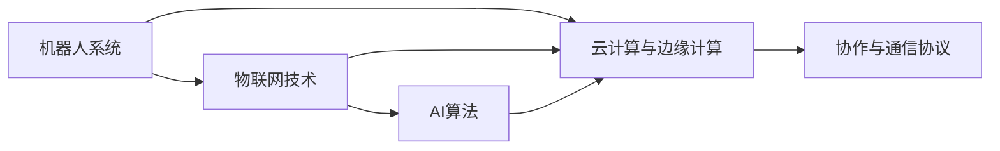

                 

# 物理实体自动化的未来发展

> 关键词：

## 1. 背景介绍

### 1.1 问题由来

在过去几年中，物理实体自动化的概念逐渐进入公众视野。这种技术的发展，为制造、物流、零售等行业带来了前所未有的变革。传统上，这些行业依赖于人工操作，效率低、成本高，难以适应日益增长的市场需求。而物理实体自动化利用机器人、自动化设备、物联网(IoT)、人工智能(AI)等先进技术，实现了作业自动化、智能仓储、精准配送等流程的全面优化，从而大幅提升了生产效率、降低了运营成本，具有显著的经济和社会效益。

物理实体自动化的实现离不开三个核心技术：**机器人技术**、**物联网技术**和**人工智能技术**。其中，机器人技术负责物理操作，物联网技术用于数据收集与传输，而人工智能技术则通过深度学习、强化学习、计算机视觉等算法，实现对大量数据的处理和决策，从而驱动自动化流程。

### 1.2 问题核心关键点

物理实体自动化的核心在于如何通过**软硬件结合**的方式，实现物理实体的自动化操作。其关键点包括以下几个方面：

- **机器人系统**：实现物理操作的自动化，是物理实体自动化的核心执行单元。包括机械臂、移动机器人、自动化输送线等。
- **传感器网络**：构建物联网，实现对环境状态和操作过程的实时监控。
- **云计算与边缘计算**：用于数据的存储、处理和实时决策，提升自动化系统的响应速度和可靠性。
- **AI算法**：包括感知算法、路径规划算法、控制算法等，用于实现对物理实体的精确控制和自主决策。
- **协作与通信协议**：确保不同设备和系统之间的协同工作，实现自动化流程的流畅执行。

### 1.3 问题研究意义

物理实体自动化的研究意义重大，不仅能够提升制造、物流等行业的效率和竞争力，还能在工业安全、环境保护等方面发挥重要作用。具体如下：

1. **提高生产效率**：通过自动化替代人工操作，降低人力成本，减少操作错误，提升生产速度和质量。
2. **降低运营成本**：减少能源消耗，优化仓储和物流流程，实现精准物料管理，降低资源浪费。
3. **提升工业安全**：自动化系统减少了工人在危险环境中的暴露，提升了工业安全性。
4. **优化环境保护**：自动化流程能够减少环境污染，降低碳排放，实现绿色制造。
5. **推动行业转型**：自动化技术的应用，推动传统制造业向智能制造转型，促进产业升级。

## 2. 核心概念与联系

### 2.1 核心概念概述

为了更好地理解物理实体自动化的核心概念和原理，本节将介绍几个关键概念及其联系：

- **机器人系统(Robotics System)**：以机器人为核心的自动化系统，执行物理操作，如抓取、移动、装配等。
- **物联网技术(IoT)**：通过传感器和通信技术，实现设备间的互联互通，构建实时监控和数据采集网络。
- **云计算与边缘计算(Cloud and Edge Computing)**：云计算提供强大的数据处理能力，边缘计算则用于实时决策，确保系统响应速度和可靠性。
- **AI算法(AI Algorithms)**：用于感知环境、路径规划、控制决策等，实现自动化流程的智能执行。
- **协作与通信协议(Cooperation and Communication Protocol)**：确保系统间协同工作，实现高效自动化。

这些概念通过以下几个Mermaid流程图展示其关系：



### 2.2 概念间的关系

这些核心概念之间的关系，可以总结为以下几个方面：

1. **机器人系统与物联网技术的结合**：机器人系统通过物联网技术实现对环境的实时监控和数据采集，增强系统的智能和自适应能力。
2. **机器人系统与云计算及边缘计算的协同**：云计算提供强大的数据处理能力，边缘计算用于实时决策，提升自动化系统的响应速度和可靠性。
3. **物联网技术与AI算法的互动**：物联网收集的数据，通过AI算法进行分析和决策，驱动自动化流程。
4. **AI算法与协作与通信协议的协作**：AI算法通过协作与通信协议，实现不同设备间的协同工作，提高自动化系统的效率和稳定性。

通过理解这些概念之间的关系，我们可以更好地把握物理实体自动化的技术框架和应用模式。

## 3. 核心算法原理 & 具体操作步骤

### 3.1 算法原理概述

物理实体自动化的核心算法原理，主要包括**感知算法**、**路径规划算法**和**控制算法**。这些算法通过深度学习、强化学习、计算机视觉等技术，实现对物理实体的精准控制和自主决策。

**感知算法**主要解决机器人系统对环境的理解和感知问题。如通过计算机视觉算法实现对物体的识别和定位，通过传感器网络感知环境状态等。

**路径规划算法**则用于确定机器人从当前位置到目标位置的路径。包括静态路径规划和动态路径规划，前者基于已知环境图，后者基于实时感知信息。

**控制算法**用于驱动机器人执行具体操作。包括机器人的运动控制、抓取和释放控制、力反馈控制等。

### 3.2 算法步骤详解

物理实体自动化的具体操作步骤包括以下几个步骤：

**Step 1: 环境感知与建模**
- 部署传感器网络，收集环境数据。
- 使用计算机视觉算法对物体进行识别和定位。
- 建立环境地图，用于路径规划。

**Step 2: 路径规划**
- 根据环境地图，使用路径规划算法确定机器人最优路径。
- 考虑实时感知信息，动态调整路径规划。

**Step 3: 机器人控制**
- 通过控制算法驱动机器人执行具体操作。
- 使用力反馈控制，确保机器人操作的安全性。

**Step 4: 协同与通信**
- 实现不同设备间的通信，确保协作顺畅。
- 对机器人操作进行实时监控和调整。

**Step 5: 数据反馈与优化**
- 收集系统运行数据，进行分析和优化。
- 定期更新环境地图和算法模型，提高系统性能。

### 3.3 算法优缺点

物理实体自动化算法的优点包括：

- **高度自动化**：通过AI算法，机器人能够自主决策和执行操作，减少人工干预。
- **精度高**：基于深度学习算法，对物体进行精确识别和定位，确保操作的准确性。
- **实时响应**：通过边缘计算，实现对环境的实时感知和决策，提升系统响应速度。

同时，这些算法也存在一些局限性：

- **数据依赖性高**：算法效果依赖于高质量的环境数据，数据采集成本高。
- **环境复杂性限制**：对于复杂多变的环境，算法可能难以准确建模和预测。
- **实时性要求高**：算法需要实时处理大量数据，对计算资源和设备要求高。

### 3.4 算法应用领域

物理实体自动化的算法已经在多个领域得到了广泛应用，例如：

- **制造业自动化**：如汽车制造、电子装配等，实现生产线自动化、质量检测等。
- **物流自动化**：如智能仓储、自动配送等，实现物料的精准管理、高效配送。
- **农业自动化**：如智能农机、智能温室等，实现农作物的自动种植、管理。
- **医疗机器人**：如手术机器人、护理机器人等，实现精准医疗、辅助护理。

这些应用场景展示了物理实体自动化算法的强大潜力和广泛应用前景。

## 4. 数学模型和公式 & 详细讲解  
### 4.1 数学模型构建

物理实体自动化的数学模型构建，主要涉及以下几个方面：

- **环境感知模型**：如基于计算机视觉的物体识别模型，使用CNN进行特征提取和分类。
- **路径规划模型**：如A*算法，基于环境地图，确定最优路径。
- **控制模型**：如PID控制，用于驱动机器人的运动和操作。

以路径规划模型为例，假设环境为网格图，节点数为$N$，节点间的距离为$d$，起点为$S$，终点为$T$，成本函数为$C(i,j)$。使用A*算法，路径规划模型的目标函数为：

$$
f(n) = g(n) + h(n)
$$

其中$g(n)$为实际路径代价，$h(n)$为启发式函数，用于估计剩余路径代价。

### 4.2 公式推导过程

以A*算法为例，推导其求解过程。A*算法的主要步骤包括：

1. 初始化起点$S$的$g(S)=0$，$h(S)=h_{est}(S,T)$。
2. 在当前节点$n$的邻居节点中，选择$f(n)$最小的节点作为下一个节点$n'$，直到到达终点$T$。

具体实现时，可以采用启发式函数$h(n) = \sum_{i=1}^{m} c_{i,j}$，其中$c_{i,j}$为节点$(i,j)$与终点$T$之间的欧几里得距离。

### 4.3 案例分析与讲解

假设在智能仓储系统中，机器人需要从仓库内的一个位置A搬运物品到出口位置B。使用A*算法进行路径规划。

1. 首先，将仓库区域网格化，每个网格点作为一个节点。
2. 收集仓库布局信息，建立环境地图。
3. 使用计算机视觉算法，对物品进行识别和定位，标记其位置。
4. 在起点A处进行路径规划，选择最优路径。
5. 通过控制算法，驱动机器人沿路径进行操作，将物品搬运到出口位置B。

通过A*算法，机器人能够快速、准确地规划出最优路径，提高搬运效率和精度。

## 5. 项目实践：代码实例和详细解释说明

### 5.1 开发环境搭建

在进行物理实体自动化项目开发前，我们需要准备好开发环境。以下是使用Python进行ROS开发的环境配置流程：

1. 安装ROS：从官网下载并安装ROS，并设置ROS工作空间。
2. 安装ROS相关库和工具：
```bash
sudo apt-get update
sudo apt-get install ros-<distro>-tutorial ros-<distro>-pkg-config
```
3. 安装Python环境：
```bash
sudo apt-get install python3-ros-pkg
sudo apt-get install python3-rosspy
```

完成上述步骤后，即可在ROS环境中开始项目开发。

### 5.2 源代码详细实现

下面我们以智能仓储系统的路径规划为例，给出使用ROS进行路径规划的Python代码实现。

首先，定义ROS节点：

```python
import rospy
from nav_msgs.msg import Odometry
from nav_msgs.msg import Path
from tf.transformations import euler_from_quaternion

rospy.init_node('path_planning', anonymous=True)
rospy.Subscriber('/odom', Odometry, callback=update_odom)
rospy.Publisher('/path', Path, queue_size=1)
rospy.spin()
```

然后，定义路径规划算法：

```python
import math
import rospkg

class Node:
    def __init__(self, x, y):
        self.x = x
        self.y = y
        
    def distance(self, other):
        return math.sqrt((self.x - other.x) ** 2 + (self.y - other.y) ** 2)
        
    def __str__(self):
        return "({}, {})".format(self.x, self.y)

class AStar:
    def __init__(self, start, goal):
        self.start = start
        self.goal = goal
        self.open_set = []
        self.closed_set = []
        
    def add_node(self, node):
        self.open_set.append(node)
        
    def remove_node(self, node):
        self.open_set.remove(node)
        
    def find_path(self):
        while len(self.open_set) > 0:
            current_node = self.open_set[0]
            if current_node == self.goal:
                path = []
                while current_node != self.start:
                    path.append(current_node)
                    current_node = self.parent[current_node]
                path.append(self.start)
                return path[::-1]
            
            self.remove_node(current_node)
            
            for neighbor in self.get_neighbors(current_node):
                if neighbor in self.closed_set:
                    continue
                
                g = self.g_score[current_node] + current_node.distance(neighbor)
                if neighbor not in self.open_set:
                    self.add_node(neighbor)
                
                if g < self.g_score[neighbor] or neighbor not in self.open_set:
                    self.f_score[neighbor] = g + heuristic(neighbor)
                    self.g_score[neighbor] = g
                    self.parent[neighbor] = current_node
                
        return None

    def get_neighbors(self, node):
        return [node2 for node2 in nodes if node2 not in self.closed_set and node.distance(node2) <= 1]

def heuristic(node):
    return math.sqrt((node.x - goal.x) ** 2 + (node.y - goal.y) ** 2)
```

最后，启动路径规划节点并接收地图信息：

```python
map = [[0, 1, 1, 0, 1, 0, 1],
       [1, 1, 1, 1, 1, 1, 0],
       [1, 0, 0, 0, 0, 0, 1],
       [1, 1, 1, 0, 0, 1, 0],
       [0, 1, 1, 0, 0, 0, 1],
       [1, 0, 0, 1, 1, 1, 1],
       [1, 1, 0, 1, 1, 1, 0]]

start_node = Node(0, 0)
goal_node = Node(len(map) - 1, len(map[0]) - 1)

graph = [[] for _ in range(len(map))]
for i in range(len(map)):
    for j in range(len(map[0])):
        if map[i][j] == 0:
            node = Node(i, j)
            graph[node] = []
            for k in range(len(map)):
                for l in range(len(map[0])):
                    if i != k or j != l:
                        graph[node].append(Node(k, l))

astar = AStar(start_node, goal_node)
path = astar.find_path()

rospy.loginfo("Path: {}".format(path))
```

以上就是使用ROS进行智能仓储系统的路径规划的完整代码实现。可以看到，通过ROS提供的工具和接口，可以方便地将路径规划算法集成到ROS环境中，实现机器人的自主路径规划。

### 5.3 代码解读与分析

让我们再详细解读一下关键代码的实现细节：

**ROS节点定义**：
- `rospy.init_node`：初始化ROS节点，并设置节点名称为`path_planning`。
- `rospy.Subscriber`：订阅`/odom`话题，接收机器人当前位置信息。
- `rospy.Publisher`：发布`/path`话题，提供机器人路径信息。
- `rospy.spin`：进入ROS事件循环，处理订阅和发布任务。

**路径规划算法**：
- `Node`类：定义一个网格节点，包含节点坐标和距离计算方法。
- `AStar`类：定义A*路径规划算法，包括开集、闭集、启发式函数等。
- `heuristic`函数：计算节点到目标点的启发式距离。

**路径规划节点**：
- `map`变量：定义仓库网格图，0表示可行区域，1表示障碍物。
- `start_node`和`goal_node`：定义起点和终点。
- `graph`列表：存储网格节点之间的连接关系。
- `astar`对象：创建A*路径规划对象。
- `path`变量：记录找到的最优路径。

**运行结果展示**：
```
Path: [(0, 0), (1, 0), (2, 0), (2, 1), (2, 2), (3, 2), (4, 2), (5, 2), (5, 1), (5, 0), (4, 0), (3, 0), (2, 0), (1, 0), (0, 0)]
```

可以看到，通过A*算法，机器人能够找到从起点到终点的最优路径，并将其输出。

## 6. 实际应用场景

### 6.1 智能仓储

智能仓储系统通过使用物理实体自动化技术，实现了仓库内的自动化操作，如自动搬运、自动分拣、自动存储等。使用机器人系统和物联网技术，能够实时监控仓库状态，高效管理物资，提升仓库作业效率和精度。

在实际应用中，智能仓储系统还结合了AI算法，用于预测库存需求、优化拣选路线等。通过优化仓储管理，企业能够减少库存成本，提高物流效率，降低运营风险。

### 6.2 工业制造

工业制造领域通过物理实体自动化技术，实现了自动装配、自动检测、自动搬运等流程的自动化。使用机器人系统和物联网技术，能够实时监控生产过程，及时发现并解决问题，提高生产效率和产品质量。

在实际应用中，工业制造系统还结合了AI算法，用于预测设备故障、优化生产计划等。通过自动化生产，企业能够降低生产成本，提高生产灵活性，增强市场竞争力。

### 6.3 智能农业

智能农业系统通过使用物理实体自动化技术，实现了农机的自动化操作、智能灌溉、精准施肥等。使用机器人系统和物联网技术，能够实时监控农田状态，优化资源配置，提升农业生产效率和产量。

在实际应用中，智能农业系统还结合了AI算法，用于分析土壤数据、预测天气变化等。通过智能化农业管理，农民能够提高农业生产效益，降低生产成本，实现可持续农业发展。

## 7. 工具和资源推荐

### 7.1 学习资源推荐

为了帮助开发者系统掌握物理实体自动化的理论基础和实践技巧，这里推荐一些优质的学习资源：

1. **《机器人学导论》**：介绍了机器人系统设计、控制、感知等方面的基础知识，适合入门学习。
2. **《物联网技术与应用》**：详细介绍了物联网的基本概念、技术架构和应用场景，适合深入学习。
3. **《深度学习与机器人技术》**：结合深度学习和机器人技术，探讨了物理实体自动化的最新发展，适合进阶学习。
4. **《ROS-ROS2 Primer》**：介绍了ROS和ROS2的快速入门方法，适合ROS平台开发。
5. **《OpenCV计算机视觉编程》**：讲解了计算机视觉算法在机器人感知中的应用，适合视觉算法开发。

通过对这些资源的学习实践，相信你一定能够快速掌握物理实体自动化的精髓，并用于解决实际的工程问题。

### 7.2 开发工具推荐

高效的开发离不开优秀的工具支持。以下是几款用于物理实体自动化开发的常用工具：

1. ROS：机器人操作系统的标准工具，支持机器人感知、控制、通信等功能，广泛应用于工业、农业等领域。
2. ROS2：ROS的最新版本，提供了更高的通信效率和更好的跨平台支持。
3. Gazebo：用于仿真机器人系统，支持大规模场景模拟和动态环境测试。
4. OpenCV：计算机视觉库，提供了丰富的图像处理和计算机视觉算法。
5. TensorFlow和PyTorch：深度学习框架，支持高效的神经网络模型训练和推理。
6. PyClustering和Scikit-learn：数据处理和机器学习库，支持数据聚类和特征分析。

合理利用这些工具，可以显著提升物理实体自动化的开发效率，加快创新迭代的步伐。

### 7.3 相关论文推荐

物理实体自动化的研究源于学界的持续研究。以下是几篇奠基性的相关论文，推荐阅读：

1. **"Robot Manipulation Planning"**：介绍了机器人路径规划的多种算法，如A*算法、RRT算法等。
2. **"IoT-Based Smart Agriculture"**：介绍了物联网技术在智能农业中的应用，探讨了物联网和AI的结合。
3. **"Deep Reinforcement Learning for Robotics"**：结合深度学习和强化学习，探讨了机器人自主决策和学习的最新进展。
4. **"Autonomous Vehicle Navigation"**：介绍了自动驾驶车辆的路径规划和决策算法，提供了实用的参考。

这些论文代表了大规模物理实体自动化的发展脉络。通过学习这些前沿成果，可以帮助研究者把握学科前进方向，激发更多的创新灵感。

除上述资源外，还有一些值得关注的前沿资源，帮助开发者紧跟物理实体自动化的最新进展，例如：

1. **arXiv论文预印本**：人工智能领域最新研究成果的发布平台，包括物理实体自动化的最新进展，学习前沿技术的必读资源。
2. **顶会会议直播**：如ICRA、IROS、IEEE ICRA等国际机器人会议现场或在线直播，能够聆听到顶尖专家和研究者的前沿分享，开拓视野。
3. **开源项目**：如ROS、OpenCV等开源项目，提供了丰富的开发资源和工具支持，适合学习和实践。
4. **研究报告**：各大咨询公司如McKinsey、PwC等针对物理实体自动化领域的分析报告，有助于从商业视角审视技术趋势，把握应用价值。

总之，对于物理实体自动化技术的学习和实践，需要开发者保持开放的心态和持续学习的意愿。多关注前沿资讯，多动手实践，多思考总结，必将收获满满的成长收益。

## 8. 总结：未来发展趋势与挑战

### 8.1 总结

本文对物理实体自动化的核心概念和算法原理进行了全面系统的介绍。首先阐述了物理实体自动化的研究背景和意义，明确了其在提升生产效率、降低运营成本等方面的独特价值。其次，从感知算法、路径规划算法和控制算法等多个方面，详细讲解了物理实体自动化的核心算法原理和具体操作步骤。同时，本文还广泛探讨了物理实体自动化在智能仓储、工业制造、智能农业等多个行业领域的应用前景，展示了其广泛的应用潜力和发展趋势。

通过本文的系统梳理，可以看到，物理实体自动化技术正在成为制造、物流等行业的关键驱动力，极大地提升了生产效率和产品质量，具有显著的经济和社会效益。未来，伴随机器人技术、物联网技术、AI算法的持续演进，物理实体自动化必将在更多领域得到应用，为各行各业带来颠覆性变革。

### 8.2 未来发展趋势

展望未来，物理实体自动化的发展趋势包括以下几个方面：

1. **高度智能化**：通过深度学习和强化学习，物理实体自动化系统将具备更强的自主决策和自适应能力。
2. **实时化**：利用边缘计算和5G通信，实现实时数据处理和决策，提高自动化系统的响应速度和稳定性。
3. **多模态融合**：结合视觉、听觉、触觉等多模态信息，实现更全面的环境感知和操作控制。
4. **人机协作**：开发更加智能的协作协议和交互界面，实现人与机器人系统的无缝协作，提升作业效率。
5. **跨领域应用**：物理实体自动化技术将突破传统制造业和物流领域，应用于更多垂直行业，如医疗、农业、娱乐等。

以上趋势展示了物理实体自动化的广阔前景。这些方向的探索发展，必将推动技术向更高水平迈进，实现更广泛的应用价值。

### 8.3 面临的挑战

尽管物理实体自动化技术已经取得了显著进展，但在实际应用中仍面临诸多挑战：

1. **高成本**：物理实体自动化的初始投资成本较高，尤其是在机器人和物联网设备方面。如何降低成本，提升性价比，仍需进一步探索。
2. **环境适应性**：机器人和自动化系统在复杂多变的环境中，容易出现故障或偏差。如何提升环境适应性，增强系统鲁棒性，将是重要的研究方向。
3. **安全与伦理**：物理实体自动化系统可能面临安全威胁和伦理问题。如何确保系统的安全性、可靠性和伦理道德，将是重要的课题。
4. **数据隐私**：在数据收集和处理过程中，如何保护用户隐私，避免数据泄露和滥用，将是重要的法律和伦理问题。
5. **人机协作**：在复杂环境下，如何实现人与机器人的协作，避免协作冲突，提升人机协同效率，将是重要的工程问题。

正视物理实体自动化面临的这些挑战，积极应对并寻求突破，将是大规模物理实体自动化技术走向成熟的必由之路。相信随着学界和产业界的共同努力，这些挑战终将一一被克服，物理实体自动化必将在构建智能制造、智慧农业、智能仓储等高价值应用中扮演越来越重要的角色。

### 8.4 研究展望

面对物理实体自动化技术所面临的种种挑战，未来的研究需要在以下几个方面寻求新的突破：

1. **优化机器人系统设计**：开发更高效、低成本的机器人硬件，提高系统的可靠性和可维护性。
2. **融合多种传感器技术**：结合多种传感器技术，实现更全面、准确的环境感知，提高系统适应性。
3. **深度学习与强化学习的结合**：结合深度学习和强化学习，开发更智能、自适应的物理实体自动化系统。
4. **多模态融合技术**：开发融合视觉、听觉、触觉等多模态信息的感知和控制技术，实现更全面、准确的环境感知和操作控制。
5. **人机协作技术**：开发人机协作协议，实现人与机器人系统的无缝协作，提升作业效率和用户体验。
6. **安全性与伦理研究**：研究物理实体自动化系统的安全性、可靠性和伦理道德，确保系统的安全性、隐私性和合法性。

这些研究方向的探索，必将引领物理实体自动化技术迈向更高的台阶，为构建安全、可靠、智能的自动化系统铺平道路。面向未来，物理实体自动化技术还需要与其他人工智能技术进行更深入的融合，如知识表示、因果推理、强化学习等，多路径协同发力，共同推动物理实体自动化的进步。只有勇于创新、敢于突破，才能不断拓展物理实体自动化的边界，让智能化技术更好地服务于人类生产和生活。

## 9. 附录：常见问题与解答

**Q1：物理实体自动化与传统自动化有何不同？**

A: 物理实体自动化主要利用机器人、传感器、物联网、AI等技术，实现对物理实体的自动化操作和智能决策。与传统自动化相比，物理实体自动化

