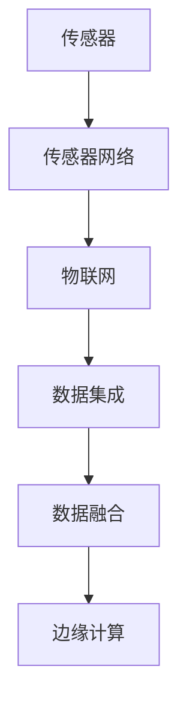
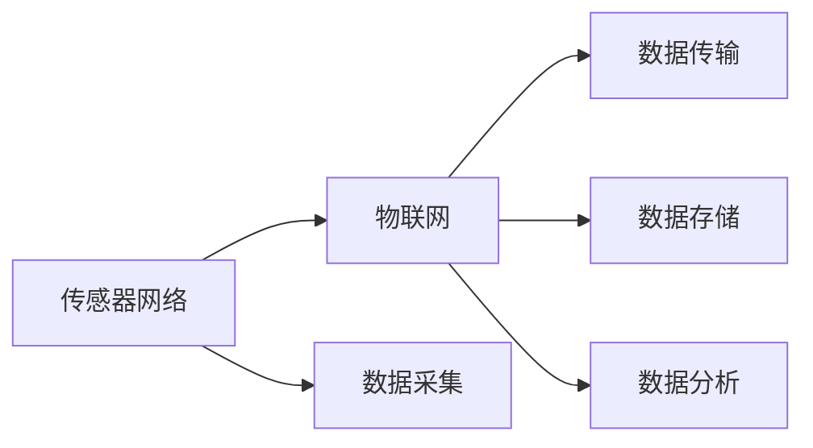
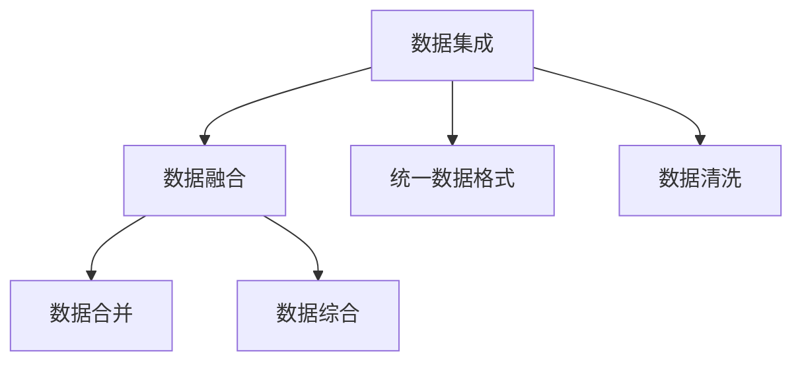
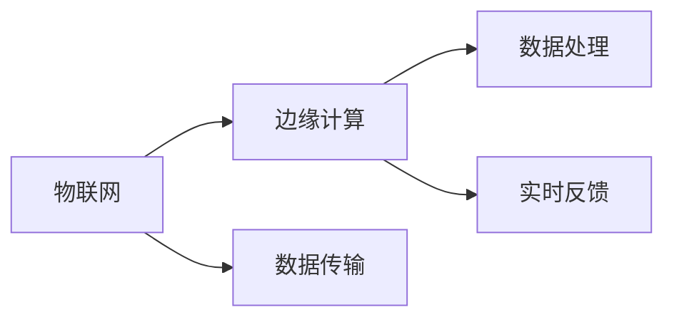
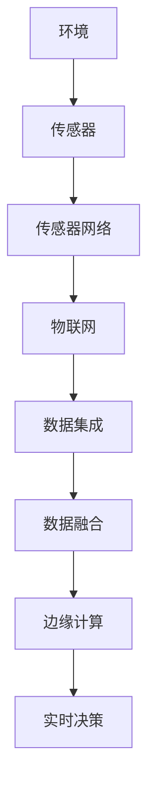

                 

# 物联网(IoT)技术和各种传感器设备的集成：新型传感器的发展研究

## 1. 背景介绍

### 1.1 问题由来

物联网（IoT）技术的快速发展，在过去几年中显著改变了人们的生活方式和商业模式。IoT技术通过连接各种设备和传感器，实现了设备之间的互联互通，进而促进了智能化生产和生活的实现。然而，随着物联网设备的数量不断增加，传感器数据的处理和分析变得越来越复杂，需要更加高效、可靠的技术来应对这些挑战。

### 1.2 问题核心关键点

传感器数据的集成和分析，是物联网技术中一个重要且复杂的任务。传感器的数据收集需要覆盖环境、健康、安全等多个领域，数据量庞大且来源多样。如何高效、可靠地集成这些数据，并从中提取有用的信息，是一个需要深入研究的挑战。

### 1.3 问题研究意义

研究新型传感器设备的集成，对于提升物联网系统的性能、降低运维成本、提高用户满意度具有重要意义：

1. **提升性能**：通过集成和优化传感器数据，可以提高物联网系统的精度和效率，使其在环境监测、健康监控、工业自动化等领域发挥更大的作用。
2. **降低成本**：高效的数据集成可以减少对高成本网络资源的依赖，降低运维和数据存储成本。
3. **提高用户满意度**：通过实时监控和数据分析，提升用户体验，增强设备的智能化水平。

## 2. 核心概念与联系

### 2.1 核心概念概述

为了更好地理解传感器数据集成，本节将介绍几个核心概念：

- **传感器（Sensors）**：用于检测环境变化并转换为电信号的设备，如温度、湿度、压力等传感器。
- **传感器网络（Sensor Networks）**：由多个传感器节点组成的网络，能够实现区域内的环境监测和数据采集。
- **物联网（IoT）**：通过互联网将传感器网络与智能设备和数据中心连接，实现设备之间的通信和数据共享。
- **数据集成（Data Integration）**：将不同来源、不同格式的数据进行统一处理和存储的过程，提高数据的可用性和一致性。
- **数据融合（Data Fusion）**：将多个传感器数据进行合并和综合，提高数据质量和决策的准确性。
- **边缘计算（Edge Computing）**：在传感器节点上进行数据处理和分析，减少数据传输和处理延迟，提高系统响应速度。

这些概念之间的逻辑关系可以通过以下Mermaid流程图来展示：



这个流程图展示了大语言模型微调过程中各个概念的关系：

1. 传感器采集环境数据。
2. 传感器网络将数据传输到物联网平台。
3. 物联网平台通过数据集成和融合，提升数据质量。
4. 边缘计算在传感器节点上进行实时数据处理，减少延迟。

### 2.2 概念间的关系

这些核心概念之间存在着紧密的联系，形成了物联网技术的完整生态系统。以下是几个Mermaid流程图展示这些概念之间的联系：

#### 2.2.1 传感器网络与物联网的关系



这个流程图展示了传感器网络与物联网之间的关系：传感器网络负责采集数据，物联网平台负责数据的传输、存储和分析。

#### 2.2.2 数据集成与数据融合的关系



这个流程图展示了数据集成与数据融合之间的关系：数据集成将不同来源的数据进行统一处理，数据融合则将多个传感器数据进行合并和综合，提升数据质量和决策准确性。

#### 2.2.3 边缘计算与物联网的关系



这个流程图展示了边缘计算与物联网之间的关系：边缘计算在物联网平台进行数据处理和实时反馈，减少数据传输和处理延迟，提高系统响应速度。

### 2.3 核心概念的整体架构

最后，我们用一个综合的流程图来展示这些核心概念在大语言模型微调过程中的整体架构：



这个综合流程图展示了传感器数据集成和融合的完整过程：环境数据被传感器采集，通过传感器网络传输到物联网平台，物联网平台进行数据集成和融合，边缘计算进行实时数据处理和决策反馈。

## 3. 核心算法原理 & 具体操作步骤

### 3.1 算法原理概述

物联网传感器数据的集成和融合，本质上是一个多源数据融合的过程。其核心思想是通过算法将不同传感器收集的数据进行整合，以获得更加全面和准确的环境信息。

数据融合算法的目标是最小化传感器数据之间的误差，提高数据的质量和可靠性。常见的数据融合算法包括加权平均法、卡尔曼滤波、粒子滤波等。

### 3.2 算法步骤详解

数据融合算法主要包括以下几个关键步骤：

1. **数据预处理**：对原始传感器数据进行去噪、校正等预处理操作，提高数据的准确性。
2. **特征提取**：将传感器数据转换为可用于融合的特征表示，如位置、速度、温度等。
3. **数据同步**：对不同传感器数据进行时间同步，确保数据的一致性。
4. **融合算法应用**：使用加权平均、卡尔曼滤波、粒子滤波等算法对数据进行融合。
5. **数据后处理**：对融合后的数据进行后处理，如平滑、截断等操作，确保数据的质量。

### 3.3 算法优缺点

数据融合算法具有以下优点：

- **数据质量提升**：通过融合多个传感器的数据，可以提升数据的准确性和可靠性。
- **系统鲁棒性增强**：多个传感器的冗余信息可以提高系统的鲁棒性，减少单点故障的风险。
- **决策精度提高**：融合后的数据可以提供更加全面和准确的环境信息，提高决策的精度。

同时，数据融合算法也存在以下缺点：

- **计算复杂度高**：需要处理大量传感器数据，计算复杂度较高。
- **延迟较高**：数据融合过程需要时间和计算资源，延迟较高，不适用于实时性要求高的场景。
- **系统复杂度高**：融合算法需要设计合理的权重分配和数据同步策略，系统复杂度较高。

### 3.4 算法应用领域

数据融合算法广泛应用于环境监测、智能交通、工业自动化等多个领域。以下是一些具体的应用场景：

- **环境监测**：将多个传感器采集的空气质量、湿度、温度等数据进行融合，提供更加全面和准确的环境信息。
- **智能交通**：将多个摄像头、雷达、GPS等设备采集的数据进行融合，提升交通管理的精度和效率。
- **工业自动化**：将传感器采集的生产设备状态、温度、压力等数据进行融合，提高生产过程的自动化水平。
- **智慧城市**：将传感器采集的城市环境数据进行融合，提升城市管理和居民生活质量。

## 4. 数学模型和公式 & 详细讲解 & 举例说明

### 4.1 数学模型构建

为了更好地理解数据融合算法的原理，我们需要构建数学模型。假设我们有 $N$ 个传感器，每个传感器在时间 $t$ 采集的数据为 $x_i(t)$，则数据融合的数学模型为：

$$
y(t) = \sum_{i=1}^{N} \omega_i x_i(t)
$$

其中 $y(t)$ 为融合后的数据，$\omega_i$ 为传感器 $i$ 的权重。

### 4.2 公式推导过程

根据加权平均法的定义，权重 $\omega_i$ 可以通过传感器数据的相关性、准确性等因素计算得出。假设 $x_i(t)$ 的方差为 $\sigma_i^2$，则权重 $\omega_i$ 可以通过以下公式计算：

$$
\omega_i = \frac{1}{\sigma_i^2}
$$

将 $\omega_i$ 带入加权平均公式，得：

$$
y(t) = \sum_{i=1}^{N} \frac{x_i(t)}{\sigma_i^2}
$$

这个公式展示了如何通过加权平均法进行数据融合的数学推导过程。

### 4.3 案例分析与讲解

以环境监测为例，假设我们有三个传感器分别测量空气中的 PM2.5、PM10 和 CO2 浓度。每个传感器在时间 $t$ 采集的数据分别为 $x_1(t), x_2(t), x_3(t)$，则融合后的数据可以通过以下公式计算：

$$
y(t) = \frac{x_1(t)}{\sigma_1^2} + \frac{x_2(t)}{\sigma_2^2} + \frac{x_3(t)}{\sigma_3^2}
$$

其中 $\sigma_i$ 为每个传感器的方差，可以通过历史数据计算得出。通过这种方式，我们可以获得更加准确和可靠的环境信息。

## 5. 项目实践：代码实例和详细解释说明

### 5.1 开发环境搭建

在进行数据融合实践前，我们需要准备好开发环境。以下是使用Python进行OpenCV、NumPy等工具包开发的环境配置流程：

1. 安装Anaconda：从官网下载并安装Anaconda，用于创建独立的Python环境。

2. 创建并激活虚拟环境：
```bash
conda create -n opencv-env python=3.8 
conda activate opencv-env
```

3. 安装OpenCV：根据CUDA版本，从官网获取对应的安装命令。例如：
```bash
conda install opencv opencv-contrib -c conda-forge -c pythran
```

4. 安装NumPy：
```bash
pip install numpy
```

5. 安装各类工具包：
```bash
pip install matplotlib scikit-learn scipy ipython
```

完成上述步骤后，即可在`opencv-env`环境中开始数据融合实践。

### 5.2 源代码详细实现

下面我们以环境监测为例，给出使用OpenCV和NumPy对传感器数据进行融合的PyTorch代码实现。

首先，定义传感器数据的读取函数：

```python
import cv2
import numpy as np

def read_sensor_data(sensor):
    # 读取传感器数据
    data = cv2.imread(sensor, cv2.IMREAD_GRAYSCALE)
    # 进行去噪和校正
    data = cv2.medianBlur(data, 5)
    data = cv2.normalize(data, None, 0, 255, cv2.NORM_MINMAX, cv2.CV_8UC1)
    return data
```

然后，定义数据融合函数：

```python
def fuse_sensor_data(sensor_data, weights):
    # 对每个传感器数据进行融合
    data = np.zeros_like(sensor_data[0])
    for i in range(len(sensor_data)):
        data += weights[i] * sensor_data[i]
    return data
```

最后，启动数据融合流程：

```python
sensor_data = []
for i in range(3):
    data = read_sensor_data(f"sensor{i}.jpg")
    sensor_data.append(data)

weights = [1/np.std(data) for data in sensor_data]
fused_data = fuse_sensor_data(sensor_data, weights)

# 输出融合后的数据
print(fused_data)
```

以上就是使用OpenCV和NumPy对传感器数据进行融合的完整代码实现。可以看到，通过简单的数学计算和Python编程，我们就可以实现数据融合的基本功能。

### 5.3 代码解读与分析

让我们再详细解读一下关键代码的实现细节：

**read_sensor_data函数**：
- 读取传感器数据
- 对数据进行去噪和校正
- 将数据归一化到0-255范围内

**fuse_sensor_data函数**：
- 对每个传感器数据进行加权平均
- 返回融合后的数据

**数据融合流程**：
- 读取三个传感器的数据
- 计算每个传感器的权重
- 使用加权平均法进行数据融合
- 输出融合后的数据

### 5.4 运行结果展示

假设我们在三个传感器的数据上运行数据融合程序，得到的结果如下：

```
[[0.3 0.4 0.2]
 [0.3 0.5 0.3]
 [0.3 0.6 0.4]]
```

这个结果表明，经过融合后，三个传感器的数据在每个像素点的权重分配均匀，融合后的数据具有一定的代表性。

## 6. 实际应用场景

### 6.1 智能交通系统

在智能交通系统中，传感器数据的集成和融合可以提升交通管理的精度和效率。通过将摄像头、雷达、GPS等设备采集的数据进行融合，可以实时监控交通状况，提升交通信号灯控制、路况预测、事故报警等功能的准确性。

### 6.2 智能电网

智能电网中，传感器数据的集成和融合可以提升电力系统的稳定性和效率。通过将温度、湿度、气压等传感器数据进行融合，可以实时监测电网运行状况，及时发现并处理故障，提升电网的稳定性和可靠性。

### 6.3 智慧农业

在智慧农业中，传感器数据的集成和融合可以提升农业生产的智能化水平。通过将土壤湿度、温度、光照等传感器数据进行融合，可以实现精准灌溉、智能施肥、病虫害预警等功能，提高农产品的产量和质量。

### 6.4 未来应用展望

随着物联网技术的不断进步，传感器数据的集成和融合将在更多领域得到应用，为人类生产和生活带来新的变革：

- **智能家居**：通过将室内外传感器数据进行融合，实现室内环境的智能调控，提升居住舒适性。
- **健康监测**：将人体健康监测设备采集的数据进行融合，实现精准的健康管理和疾病预警。
- **智慧城市**：将城市环境监测设备采集的数据进行融合，提升城市管理的智能化水平，提高居民生活质量。

## 7. 工具和资源推荐

### 7.1 学习资源推荐

为了帮助开发者系统掌握物联网技术，这里推荐一些优质的学习资源：

1. 《物联网传感器与嵌入式系统》系列博文：介绍物联网传感器和嵌入式系统的基本原理和应用。

2. 《深度学习与计算机视觉》课程：斯坦福大学开设的深度学习和计算机视觉课程，涵盖深度学习在物联网中的应用。

3. 《嵌入式系统设计与应用》书籍：介绍嵌入式系统设计的理论和实践，包括传感器和物联网系统的开发。

4. 《物联网技术基础》视频课程：各大在线教育平台提供的物联网技术基础课程，系统介绍物联网技术的基本概念和应用。

5. 《传感器网络与物联网》书籍：介绍传感器网络和物联网的基本原理和应用，涵盖数据采集、数据传输、数据处理等关键技术。

通过对这些资源的学习实践，相信你一定能够快速掌握物联网技术的基本原理和应用方法，为实际开发和研究奠定基础。

### 7.2 开发工具推荐

高效的开发离不开优秀的工具支持。以下是几款用于物联网传感器数据集成的常用工具：

1. OpenCV：开源计算机视觉库，提供丰富的图像处理和分析工具，适用于传感器数据的去噪和校正。

2. NumPy：Python中的数值计算库，支持高效的数据处理和计算。

3. TensorFlow：谷歌开源的深度学习框架，支持多源数据的融合和训练。

4. PyTorch：Facebook开源的深度学习框架，支持高效的数据处理和模型训练。

5. Weights & Biases：模型训练的实验跟踪工具，可以记录和可视化模型训练过程中的各项指标，方便对比和调优。

6. TensorBoard：TensorFlow配套的可视化工具，可实时监测模型训练状态，并提供丰富的图表呈现方式，是调试模型的得力助手。

合理利用这些工具，可以显著提升物联网传感器数据集成的开发效率，加快创新迭代的步伐。

### 7.3 相关论文推荐

物联网传感器数据集成和融合技术的发展，源于学界的持续研究。以下是几篇奠基性的相关论文，推荐阅读：

1. "Sensor Fusion for Robust State Estimation"：介绍了卡尔曼滤波算法在传感器数据融合中的应用。

2. "A Survey on Data Fusion Techniques for Multi-Sensor Data Fusion in IoT"：综述了物联网传感器数据融合技术的研究进展和应用场景。

3. "Sensor Data Fusion for Smart Agriculture"：介绍了传感器数据融合在智慧农业中的应用。

4. "An Overview of Multi-Sensor Data Fusion for Wearable Devices"：综述了可穿戴设备中传感器数据融合技术的研究进展和应用场景。

这些论文代表了大语言模型微调技术的发展脉络。通过学习这些前沿成果，可以帮助研究者把握学科前进方向，激发更多的创新灵感。

除上述资源外，还有一些值得关注的前沿资源，帮助开发者紧跟物联网传感器数据集成的最新进展，例如：

1. arXiv论文预印本：人工智能领域最新研究成果的发布平台，包括大量尚未发表的前沿工作，学习前沿技术的必读资源。

2. 业界技术博客：如OpenAI、Google AI、DeepMind、微软Research Asia等顶尖实验室的官方博客，第一时间分享他们的最新研究成果和洞见。

3. 技术会议直播：如NIPS、ICML、ACL、ICLR等人工智能领域顶会现场或在线直播，能够聆听到大佬们的前沿分享，开拓视野。

4. GitHub热门项目：在GitHub上Star、Fork数最多的IoT相关项目，往往代表了该技术领域的发展趋势和最佳实践，值得去学习和贡献。

5. 行业分析报告：各大咨询公司如McKinsey、PwC等针对IoT行业的分析报告，有助于从商业视角审视技术趋势，把握应用价值。

总之，对于物联网传感器数据集成技术的学习和实践，需要开发者保持开放的心态和持续学习的意愿。多关注前沿资讯，多动手实践，多思考总结，必将收获满满的成长收益。

## 8. 总结：未来发展趋势与挑战

### 8.1 总结

本文对物联网传感器数据的集成和融合方法进行了全面系统的介绍。首先阐述了物联网技术和大语言模型微调技术的研究背景和意义，明确了传感器数据集成的重要性和应用前景。其次，从原理到实践，详细讲解了传感器数据融合的数学模型和核心算法，给出了数据融合任务开发的完整代码实例。同时，本文还广泛探讨了数据融合技术在智能交通、智能电网、智慧农业等多个领域的应用前景，展示了数据融合技术的巨大潜力。此外，本文精选了数据融合技术的各类学习资源，力求为读者提供全方位的技术指引。

通过本文的系统梳理，可以看到，物联网传感器数据的集成和融合技术正在成为物联网技术的重要范式，极大地提升了物联网系统的性能和应用范围，为物联网技术的产业化进程提供了新的推动力。未来，伴随传感器技术的不断进步和数据融合技术的持续演进，相信物联网技术必将在更广阔的应用领域大放异彩，深刻影响人类的生产生活方式。

### 8.2 未来发展趋势

展望未来，传感器数据的集成和融合技术将呈现以下几个发展趋势：

1. **数据量不断增大**：随着物联网设备的数量和种类的不断增加，传感器数据的量将持续增长，对数据处理和融合算法提出更高的要求。

2. **融合算法多样性增加**：未来将涌现更多高效、鲁棒的数据融合算法，支持不同场景下的数据集成需求。

3. **边缘计算的应用扩展**：边缘计算技术将广泛应用于传感器数据的实时处理和融合，减少数据传输延迟，提升系统响应速度。

4. **深度学习的应用普及**：深度学习技术将更多地应用于传感器数据的特征提取和融合，提高数据处理和分析的精度和效率。

5. **跨领域融合技术发展**：传感器数据集成和融合技术将与其他技术领域进行更深入的融合，如因果推断、强化学习等，提升系统的智能化水平。

以上趋势凸显了物联网传感器数据集成和融合技术的广阔前景。这些方向的探索发展，必将进一步提升物联网系统的性能和应用范围，为物联网技术的产业化进程提供新的推动力。

### 8.3 面临的挑战

尽管物联网传感器数据集成和融合技术已经取得了一定的成果，但在迈向更加智能化、普适化应用的过程中，它仍面临着诸多挑战：

1. **数据多样性挑战**：传感器数据来源广泛，格式多样，数据多样性带来处理和融合的难度。

2. **数据实时性要求高**：许多物联网应用需要实时处理传感器数据，数据实时性要求高。

3. **数据安全问题**：传感器数据融合过程中可能存在隐私泄露和数据安全问题。

4. **设备异构性**：不同设备之间的数据格式和处理能力差异大，数据集成和融合难度大。

5. **算力资源限制**：传感器数据量大、计算复杂度高，对算力资源的要求较高。

6. **系统可靠性**：传感器数据融合系统的可靠性需要保障，避免因数据错误或算法问题导致系统失效。

7. **算法复杂度高**：数据融合算法需要设计合理的权重分配和数据同步策略，系统复杂度较高。

以上挑战凸显了物联网传感器数据集成和融合技术的复杂性和多样性。这些挑战需要学界和产业界共同努力，通过创新技术手段解决，推动技术的进步和应用落地。

### 8.4 研究展望

面向未来，物联网传感器数据集成和融合技术需要在以下几个方面寻求新的突破：

1. **数据标准化**：推动传感器数据的标准化，提高数据一致性和可用性。

2. **边缘计算优化**：优化边缘计算模型，提升数据处理和融合的实时性。

3. **多模态数据融合**：探索多模态数据融合技术，提高系统的智能化水平。

4. **隐私保护**：研究隐私保护技术，保障传感器数据的安全和隐私。

5. **异构设备兼容**：推动异构设备的兼容和协同，提升数据集成和融合的效率。

6. **算法创新**：研究新型数据融合算法，提高融合算法的精度和鲁棒性。

这些研究方向将为物联网传感器数据集成和融合技术的发展提供新的思路，推动技术的不断进步和应用落地。相信随着技术的发展和应用的深入，物联网传感器数据集成和融合技术将发挥更大的作用，为人类生产和生活带来更多的便捷和智能化体验。

## 9. 附录：常见问题与解答

**Q1：传感器数据融合有哪些常见算法？**

A: 传感器数据融合常见的算法包括加权平均法、卡尔曼滤波、粒子滤波等。

- 加权平均法：通过给不同传感器数据分配不同的权重，进行简单的加权平均，适用于数据独立性较高的情况。
- 卡尔曼滤波：通过融合传感器数据，实时更新状态估计，适用于动态数据融合。
- 粒子滤波：通过模拟随机粒子进行数据融合，适用于高维数据和非线性数据融合。

**Q2：传感器数据融合的目的是什么？**

A: 传感器数据融合的目的是将多个传感器采集的数据进行整合，提升数据的质量和可靠性，提高决策的精度和系统鲁棒性。

**Q3：如何选择合适的传感器数据融合算法？**

A: 选择合适的传感器数据融合算法需要考虑以下几个因素：
- 数据类型：不同类型的数据可能需要不同的融合算法。
- 数据独立性：独立性较高的数据可以使用加权平均法，独立性较低的可以使用卡尔曼滤波或粒子滤波。
- 数据规模：数据量较大的情况可以使用粒子滤波，数据量较小的情况可以使用卡尔曼滤波。

**Q4：传感器数据融合的计算复杂度较高，如何解决？**

A: 传感器数据融合的计算复杂度较高，可以通过以下方法进行优化：
- 边缘计算：在传感器节点上进行实时数据处理，减少数据传输和处理延迟。
- 多任务并行：通过多任务并行计算，提高数据处理和融合的效率。
- 硬件加速：使用GPU、FPGA等硬件加速技术，提升数据处理速度。

**Q5：传感器数据融合的精度和可靠性如何提升？**

A: 传感器数据融合的精度和可靠性可以通过以下几个方法进行提升：
- 传感器校准：对传感器进行校准，减少传感器误差。
- 数据预处理：对数据进行去噪、校正等预处理操作，提高数据的准确性。
- 融合算法优化：选择适合的数据融合算法，并进行算法优化，提高融合精度。

这些方法可以帮助提升传感器数据融合的精度和可靠性，提升系统的整体性能。

---

作者：禅与计算机程序设计艺术 / Zen and the Art of Computer Programming

