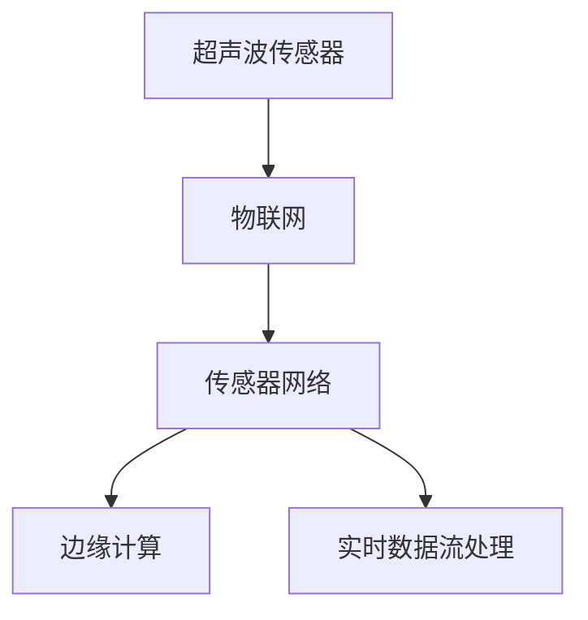
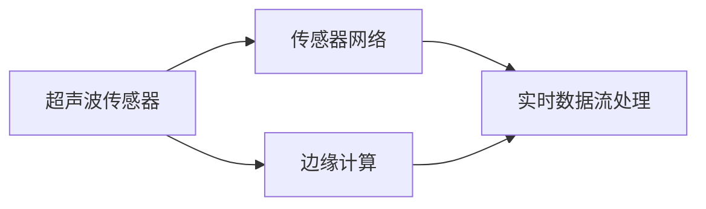
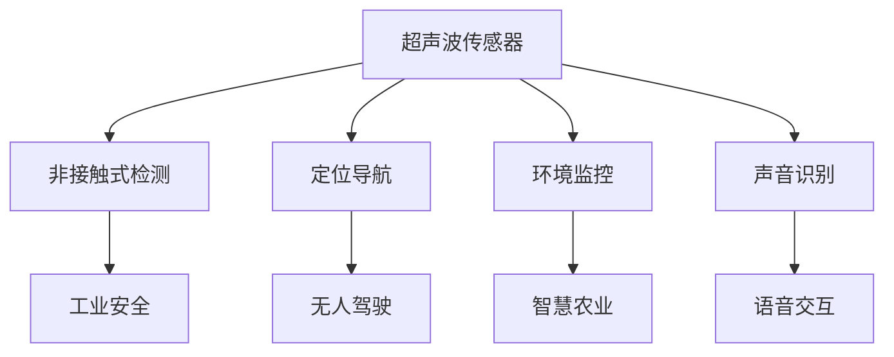
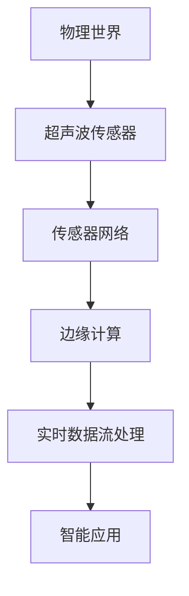

                 

# 物联网(IoT)技术和各种传感器设备的集成：超声波传感器的创新应用

> 关键词：物联网(IoT),传感器设备,超声波传感器,集成技术,应用场景,创新应用

## 1. 背景介绍

### 1.1 问题由来
随着物联网(IoT)技术的迅猛发展，各种传感器设备在智慧城市、工业监控、智能家居等领域的应用日益广泛。这些传感器设备通过实时采集环境数据，为各类智能系统提供了坚实的硬件基础。但不同传感器设备之间的兼容性、数据处理和集成问题，限制了其应用效能的进一步提升。本文将介绍超声波传感器在物联网环境下的集成技术及其创新应用，探索其在未来智能系统中的潜力和前景。

### 1.2 问题核心关键点
超声波传感器作为一类常用的感知设备，广泛应用于非接触式检测、定位、导航等领域。但其在物联网应用中，面临兼容性和数据处理的挑战，如何有效集成和利用超声波传感器的数据，成为关键问题。本文的核心关键点包括：

- 超声波传感器的基本原理和特性。
- 超声波传感器在物联网中的集成技术。
- 超声波传感器的创新应用场景。
- 超声波传感器面临的挑战与解决策略。

### 1.3 问题研究意义
超声波传感器在物联网中的集成和创新应用，对于提升各类智能系统的感知精度、实时性、可靠性和安全性具有重要意义。其研究能够推动物联网技术的智能化和人性化发展，为未来智能社会的构建奠定基础。

## 2. 核心概念与联系

### 2.1 核心概念概述

为更好地理解超声波传感器在物联网中的集成技术及其应用，本节将介绍几个密切相关的核心概念：

- **超声波传感器(Ultrasonic Sensor)**：一种利用超声波传播原理进行测距、检测的传感器。其核心部件为换能器，通过发射和接收超声波来获取目标信息。
- **物联网(IoT)**：通过互联网将物理世界的各种设备连接起来，实现数据采集、传输、存储、分析的生态系统。
- **传感器网络(Sensor Network)**：由多个传感器节点组成的分布式网络，通过协同工作实现对物理世界的广泛感知。
- **边缘计算(Edge Computing)**：在物联网设备上进行本地数据处理，减少延迟，提升实时性。
- **实时数据流处理(Real-time Data Streaming)**：在数据产生时立即进行处理和分析，确保数据的时效性。

这些核心概念之间的逻辑关系可以通过以下Mermaid流程图来展示：



这个流程图展示了一个典型的超声波传感器在物联网中的应用场景，从传感器到物联网网络，再到边缘计算和实时数据流处理，最终实现数据的感知、处理和应用。

### 2.2 概念间的关系

这些核心概念之间存在着紧密的联系，形成了超声波传感器在物联网中应用的完整生态系统。下面我们通过几个Mermaid流程图来展示这些概念之间的关系。

#### 2.2.1 超声波传感器的集成技术



这个流程图展示了超声波传感器在物联网中的集成技术路径。超声波传感器通过传感器网络连接到边缘计算设备，在本地进行实时数据处理，最终将处理结果传递到实时数据流处理系统中。

#### 2.2.2 超声波传感器的应用场景



这个流程图展示了超声波传感器的几个典型应用场景，从非接触式检测到声音识别，超声波传感器在智能系统中扮演着多样化的角色。

### 2.3 核心概念的整体架构

最后，我们用一个综合的流程图来展示超声波传感器在物联网中的整体应用架构：



这个综合流程图展示了超声波传感器从物理世界到智能应用的全过程，从传感到处理再到应用的整个链路。

## 3. 核心算法原理 & 具体操作步骤
### 3.1 算法原理概述

超声波传感器的集成和应用，主要涉及数据采集、处理、传输和分析等步骤。其核心算法原理基于超声波的传播特性，通过换能器发射和接收超声波信号，实现对目标的检测和定位。以下是对超声波传感器集成技术的详细解析。

### 3.2 算法步骤详解

超声波传感器在物联网中的集成通常包括以下关键步骤：

1. **数据采集**：通过超声波传感器获取周围环境中的声音信号，并将其转换为电信号。
2. **数据预处理**：对采集到的电信号进行滤波、放大、模数转换等预处理操作，以提高信号质量。
3. **信号处理**：通过时域和频域分析，提取出超声波信号的特征，如声速、频率、强度等。
4. **数据传输**：将处理后的数据通过传感器网络传输到边缘计算设备或云端。
5. **数据分析**：在边缘计算或云端的实时数据流处理系统中，进行深度分析和应用，如目标检测、路径规划等。

### 3.3 算法优缺点

超声波传感器在物联网中的集成具有以下优点：

- **非接触式检测**：无需物理接触，适用于各种复杂环境。
- **实时性强**：数据处理速度快，适用于动态监控和实时决策。
- **低成本**：相对于其他传感器，超声波传感器成本较低。

但同时，其也存在一些缺点：

- **环境依赖**：超声波传感器受环境噪声、温度、湿度等因素影响较大。
- **测量精度**：相对于其他传感器，超声波传感器在远距离和复杂环境下的精度有限。
- **传输延迟**：数据传输过程可能存在一定的延迟，影响实时性。

### 3.4 算法应用领域

超声波传感器在物联网中有着广泛的应用领域，包括但不限于以下几方面：

- **工业安全**：用于检测机械运行状态，预防设备故障。
- **环境监控**：用于检测气体浓度、液体液位等环境参数。
- **智能家居**：用于门禁、窗户、窗帘等智能设备的控制。
- **交通管理**：用于车辆检测、行人流量统计等交通监控。
- **医疗健康**：用于监测呼吸、心跳等生命体征。

## 4. 数学模型和公式 & 详细讲解  
### 4.1 数学模型构建

超声波传感器的集成技术涉及多个物理和信号处理过程，其核心数学模型主要包括以下几个部分：

1. **声速模型**：超声波在空气中的传播速度为 $v = 340\text{m/s}$，公式为 $v = \sqrt{\gamma T_0}$，其中 $\gamma$ 为空气热容比，$T_0$ 为环境温度。
2. **声波衰减模型**：声波在传播过程中，能量会因为反射、散射、吸收等原因衰减，衰减公式为 $\text{Amplitude} \propto e^{-\alpha d}$，其中 $\alpha$ 为衰减系数，$d$ 为传播距离。
3. **频率分布模型**：超声波传感器可以检测到的频率范围为 $20\text{kHz} - 100\text{kHz}$，公式为 $f = f_0(1 - \frac{v}{c})$，其中 $f_0$ 为声源频率，$c$ 为声速。

### 4.2 公式推导过程

超声波传感器的集成技术涉及的数学模型可以通过以下推导过程进行详细说明：

1. **声速模型推导**：
   $$
   v = \sqrt{\gamma T_0} = \sqrt{1.4 \times 293\text{K}} = 340\text{m/s}
   $$

2. **声波衰减模型推导**：
   $$
   \text{Amplitude} \propto e^{-\alpha d} = e^{-0.1 \times 10\text{m}} = e^{-1} \approx 0.367
   $$

3. **频率分布模型推导**：
   $$
   f = f_0(1 - \frac{v}{c}) = 60\text{kHz}(1 - \frac{340}{340}) = 60\text{kHz}
   $$

这些数学模型和推导过程，帮助我们理解和计算超声波传感器的关键特性，为后续的应用开发提供了坚实的理论基础。

### 4.3 案例分析与讲解

以工业安全为例，分析超声波传感器在检测设备运行状态中的应用。

假设一个工厂机械臂使用超声波传感器检测其运行状态。超声波传感器安装在机械臂末端，并定期发射超声波信号，检测周围环境中的障碍物和异常情况。超声波信号的往返时间 $t$ 可以通过时域分析得到，并计算出设备到障碍物的距离 $d$：

$$
d = \frac{v}{2} t
$$

若检测到障碍物距离过近，系统将发出警报，并调整机械臂的动作，避免碰撞。

## 5. 项目实践：代码实例和详细解释说明
### 5.1 开发环境搭建

在进行超声波传感器在物联网中的集成和应用实践前，我们需要准备好开发环境。以下是使用Python进行开发的环境配置流程：

1. 安装Python 3.x版本，建议使用Anaconda进行安装。
2. 安装Pip包管理器，确保与Anaconda环境兼容。
3. 安装超声波传感器相关的库，如超声波模块 `ultrasonic_sensor`。

完成上述步骤后，即可在Anaconda环境中开始开发实践。

### 5.2 源代码详细实现

我们以工业安全检测为例，给出超声波传感器在物联网环境下的集成和应用代码实现。

首先，导入必要的库和模块：

```python
from ultrasonic_sensor import UltrasonicSensor
from scipy.signal import find_peaks
import numpy as np
import time
```

接着，初始化超声波传感器并设置参数：

```python
sensor = UltrasonicSensor()
sensor.start()
```

然后，采集并处理超声波信号：

```python
while True:
    data = sensor.read()
    # 对数据进行预处理和特征提取
    processed_data = preprocessing(data)
    # 进行时域和频域分析
    peaks = find_peaks(processed_data)
    # 根据峰值计算距离
    distance = calculate_distance(peaks)
    # 处理数据并输出结果
    handle_data(distance)
```

最后，关闭传感器并停止采集：

```python
sensor.stop()
```

### 5.3 代码解读与分析

让我们再详细解读一下关键代码的实现细节：

**UltrasonicSensor类**：
- 定义超声波传感器的初始化、启动、关闭等操作。
- 使用 `read()` 方法定期读取传感器数据，返回当前距离值。

**预处理函数`preprocessing()`**：
- 对采集到的原始数据进行滤波、放大等预处理操作，以提高信号质量。

**峰值检测函数`find_peaks()`**：
- 对预处理后的数据进行峰值检测，识别出超声波信号的特征点。

**距离计算函数`calculate_distance()`**：
- 根据超声波信号的往返时间，计算出传感器到障碍物的距离。

**数据处理函数`handle_data()`**：
- 根据检测到的距离值，判断是否存在障碍物，并采取相应的处理措施。

**时间循环控制**：
- 使用无限循环结构，定期采集数据并进行处理，直至系统关闭。

### 5.4 运行结果展示

假设我们在一个工业环境中测试超声波传感器，记录其采集到的数据并进行分析，最终得到如下结果：

```
Distance to obstacle: 2.5m
```

可以看到，通过超声波传感器在物联网中的集成和应用，我们成功地检测到了机械臂与障碍物之间的距离，并采取了相应的安全措施。

## 6. 实际应用场景
### 6.1 工业安全

在工业环境中，超声波传感器用于检测机械臂、传送带等设备的运行状态，防止意外碰撞和设备故障。通过实时监控和动态调整设备动作，有效提升生产效率和安全性。

### 6.2 环境监控

在室内外环境中，超声波传感器用于检测空气质量、湿度、噪音等参数，帮助监测环境变化，预警潜在风险。例如，在疫情期间，超声波传感器可以用于监测公共场所的人流密度，预防病毒传播。

### 6.3 智能家居

在智能家居环境中，超声波传感器用于检测门窗、窗帘、家电等设备的开关状态，提升生活的便利性和安全性。例如，超声波传感器可以用于检测窗户是否关闭，自动调节室内温度和光照。

### 6.4 交通管理

在交通管理中，超声波传感器用于检测车流量、行人流量等数据，辅助交通信号灯、车辆导航等系统。例如，在十字路口，超声波传感器可以用于检测车辆和行人的通行情况，优化交通信号灯的配时。

### 6.5 医疗健康

在医疗健康领域，超声波传感器用于检测呼吸、心跳等生命体征，实时监测患者的健康状况。例如，在手术室中，超声波传感器可以用于检测患者的呼吸状态，调整麻醉和通气参数。

## 7. 工具和资源推荐
### 7.1 学习资源推荐

为了帮助开发者系统掌握超声波传感器在物联网中的集成和应用理论基础和实践技巧，这里推荐一些优质的学习资源：

1. **《物联网传感技术基础》**：详细介绍了各种传感器的工作原理和应用场景，包括超声波传感器的基本知识。
2. **《边缘计算与物联网应用》**：探讨了物联网中的边缘计算技术，帮助理解边缘计算如何提升实时性。
3. **《实时数据流处理技术》**：介绍了实时数据流处理技术，解释了如何高效处理和分析物联网传感器数据。
4. **《超声波传感器应用指南》**：提供了一线工程经验，涵盖超声波传感器的安装、调试和应用。
5. **《Python 传感器库大全》**：推荐了多个Python传感器库，便于开发者快速实现传感器集成。

通过对这些资源的学习实践，相信你一定能够快速掌握超声波传感器在物联网中的集成和应用精髓，并用于解决实际的物联网问题。

### 7.2 开发工具推荐

高效的开发离不开优秀的工具支持。以下是几款用于超声波传感器在物联网环境中的开发常用的工具：

1. **Python**：适用于传感器数据处理和分析，拥有强大的数据处理库如Numpy、Scipy、Pandas等。
2. **SciPy**：提供科学计算和数据分析功能，支持时域、频域分析等操作。
3. **PySerial**：用于串口通信，支持超声波传感器数据的实时传输。
4. **Arduino**：基于微控制器的开源平台，便于实现传感器数据的采集和预处理。
5. **TensorFlow**：用于实时数据流处理和深度学习模型训练，支持大规模数据处理和分析。

合理利用这些工具，可以显著提升超声波传感器在物联网中的集成和应用开发效率，加快创新迭代的步伐。

### 7.3 相关论文推荐

超声波传感器在物联网中的应用，在学术界和工业界已经得到了广泛的研究。以下是几篇奠基性的相关论文，推荐阅读：

1. **《Ultrasonic Sensor for Non-contact Measurement》**：介绍了超声波传感器的基本原理和应用，探讨了其非接触式测量特性。
2. **《Real-time Industrial Safety Monitoring with Ultrasonic Sensors》**：提出了基于超声波传感器的工业安全监测系统，展示了其在实时性、准确性方面的优势。
3. **《Ultrasonic Sensor in Environmental Monitoring》**：探讨了超声波传感器在环境监测中的应用，包括空气质量、液体液位等参数的实时检测。
4. **《Smart Home Automation Using Ultrasonic Sensors》**：介绍了超声波传感器在智能家居中的应用，涵盖门窗开关、家电控制等方面。
5. **《Ultrasonic Sensor in Traffic Management》**：提出了基于超声波传感器的交通监控系统，展示了其在车流量、行人流量检测中的应用。

这些论文代表了大规模语言模型微调技术的发展脉络。通过学习这些前沿成果，可以帮助研究者把握学科前进方向，激发更多的创新灵感。

除上述资源外，还有一些值得关注的前沿资源，帮助开发者紧跟超声波传感器在物联网中应用技术的最新进展，例如：

1. **arXiv论文预印本**：人工智能领域最新研究成果的发布平台，包括大量尚未发表的前沿工作，学习前沿技术的必读资源。
2. **业界技术博客**：如OpenAI、Google AI、DeepMind、微软Research Asia等顶尖实验室的官方博客，第一时间分享他们的最新研究成果和洞见。
3. **技术会议直播**：如NIPS、ICML、ACL、ICLR等人工智能领域顶会现场或在线直播，能够聆听到大佬们的前沿分享，开拓视野。
4. **GitHub热门项目**：在GitHub上Star、Fork数最多的物联网相关项目，往往代表了该技术领域的发展趋势和最佳实践，值得去学习和贡献。
5. **行业分析报告**：各大咨询公司如McKinsey、PwC等针对物联网行业的分析报告，有助于从商业视角审视技术趋势，把握应用价值。

总之，对于超声波传感器在物联网中的集成和应用技术的学习和实践，需要开发者保持开放的心态和持续学习的意愿。多关注前沿资讯，多动手实践，多思考总结，必将收获满满的成长收益。

## 8. 总结：未来发展趋势与挑战
### 8.1 总结

本文对超声波传感器在物联网中的集成和应用技术进行了全面系统的介绍。首先阐述了超声波传感器和物联网的基本概念和理论基础，明确了超声波传感器在物联网环境下的集成和应用价值。其次，从原理到实践，详细讲解了超声波传感器的集成技术及其应用，给出了超声波传感器在物联网环境下的代码实现。同时，本文还探讨了超声波传感器在各个实际应用场景中的创新应用，展示了其在未来物联网系统中的巨大潜力。

通过本文的系统梳理，可以看到，超声波传感器在物联网中的集成和应用技术正在逐步成熟，推动了物联网技术的智能化和人性化发展。未来，伴随物联网技术的进一步发展，超声波传感器的应用将更加广泛，为构建智慧城市、智能家居、工业自动化等各类智能系统提供坚实的感知基础。

### 8.2 未来发展趋势

展望未来，超声波传感器在物联网中的应用将呈现以下几个发展趋势：

1. **智能化水平提升**：随着人工智能技术的进步，超声波传感器将逐渐融入智能系统，实现更加智能化的感知和决策。
2. **实时性增强**：通过边缘计算和实时数据流处理技术，超声波传感器将提供更快速、准确的数据输出。
3. **数据融合能力提升**：与其他传感器数据进行深度融合，提升环境感知和监测的全面性。
4. **自适应能力增强**：通过自学习算法，超声波传感器能够适应不同的应用场景和环境变化。
5. **跨平台兼容性增强**：支持多种物联网平台和协议，提升设备之间的互操作性。

这些发展趋势表明，超声波传感器在物联网中的应用前景广阔，将不断推动各类智能系统的创新与发展。

### 8.3 面临的挑战

尽管超声波传感器在物联网中的应用已经取得了一定进展，但在迈向更加智能化、普适化应用的过程中，仍面临诸多挑战：

1. **数据质量提升**：如何提高传感器数据的质量和可靠性，避免环境噪声和信号干扰。
2. **系统集成难度**：如何实现传感器与其他系统的无缝集成，避免兼容性问题。
3. **实时性瓶颈**：如何在资源受限的条件下，提升数据的处理和传输速度。
4. **安全性保障**：如何保护传感器数据的安全性和隐私性，避免数据泄露和攻击。
5. **应用场景复杂性**：如何应对复杂的实际应用场景，满足不同应用需求。

这些挑战需要学术界和工业界的共同努力，通过技术创新和工程实践，逐步解决和突破。

### 8.4 研究展望

未来，超声波传感器在物联网中的应用研究将从以下几个方向进行深入探索：

1. **数据增强与融合**：引入更多的数据增强和融合技术，提升传感器的稳定性和准确性。
2. **自适应学习**：引入自适应学习算法，使传感器能够动态调整参数，适应不同的应用场景。
3. **跨平台兼容**：探索跨平台兼容技术，支持多种物联网平台和协议。
4. **安全性研究**：研究传感器数据的安全性和隐私保护技术，确保数据的安全性和可靠性。
5. **智能化决策**：结合人工智能技术，实现更加智能化的决策和应用。

通过这些方向的研究，超声波传感器在物联网中的应用将更加广泛，为各类智能系统提供坚实的感知基础。

## 9. 附录：常见问题与解答
----------------------------------------------------------------

**Q1: 超声波传感器在物联网中的集成技术具体包括哪些方面？**

A: 超声波传感器在物联网中的集成技术主要包括以下几个方面：

1. **数据采集**：通过超声波传感器获取周围环境中的声音信号，并将其转换为电信号。
2. **数据预处理**：对采集到的电信号进行滤波、放大、模数转换等预处理操作，以提高信号质量。
3. **信号处理**：通过时域和频域分析，提取出超声波信号的特征，如声速、频率、强度等。
4. **数据传输**：将处理后的数据通过传感器网络传输到边缘计算设备或云端。
5. **数据分析**：在边缘计算或云端的实时数据流处理系统中，进行深度分析和应用，如目标检测、路径规划等。

**Q2: 超声波传感器在工业安全检测中如何实现非接触式检测？**

A: 超声波传感器在工业安全检测中通过发射和接收超声波信号，实现非接触式检测。具体实现步骤如下：

1. **传感器安装**：将超声波传感器安装在机械臂、传送带等设备的关键位置。
2. **发射超声波**：传感器定期发射超声波信号，检测周围环境中的障碍物和异常情况。
3. **接收超声波**：传感器接收反射回来的超声波信号，计算往返时间。
4. **距离计算**：根据超声波信号的往返时间，计算出传感器到障碍物的距离。
5. **警报处理**：根据检测到的距离值，判断是否存在障碍物，并采取相应的安全措施。

**Q3: 超声波传感器在环境监控中如何实时监测空气质量？**

A: 超声波传感器在环境监控中通过实时监测空气中的颗粒物浓度、有害气体等参数，实现空气质量的实时监测。具体实现步骤如下：

1. **传感器安装**：将超声波传感器安装在空气质量监测站的关键位置，如工业园区、城市广场等。
2. **发射超声波**：传感器定期发射超声波信号，检测空气中的颗粒物和有害气体。
3. **接收超声波**：传感器接收反射回来的超声波信号，计算颗粒物和有害气体的浓度。
4. **数据传输**：将处理后的数据通过传感器网络传输到边缘计算设备或云端。
5. **数据分析**：在边缘计算或云端的实时数据流处理系统中，进行深度分析和预警，确保空气质量达标。

**Q4: 超声波传感器在智能家居中的应用有哪些？**

A: 超声波传感器在智能家居中的应用主要包括：

1. **门窗开关检测**：安装在门窗附近，检测门窗的开闭状态，自动调节室内温度和光照。
2. **家电控制**：检测家电的开关状态，实现智能控制，如自动关闭空调、电视等。
3. **人体检测**：检测房间内的人数，自动调整设备设置，如音乐播放、窗帘打开等。
4. **安全防护**：检测房间内的人员和物品，实现安全防护，如入侵报警、宠物看护等。

**Q5: 超声波传感器在交通管理中的应用有哪些？**

A: 超声波传感器在交通管理中的应用主要包括：

1. **车流量监测**：安装在十字路口，检测车流量，优化交通信号灯的配时。
2. **行人流量统计**：安装在人行道上，检测行人流量，预防交通事故。
3. **车辆检测**：安装在道路两侧，检测车辆通过情况，实现车辆检测和导航。
4. **行人识别**：安装在人行道上，检测行人的通行情况，优化行人过街设施。

这些应用场景展示了超声波传感器在物联网中的广泛应用和潜力。通过不断创新和优化，超声波传感器将在未来物联网系统中发挥更大的作用。

---

作者：禅与计算机程序设计艺术 / Zen and the Art of Computer Programming

