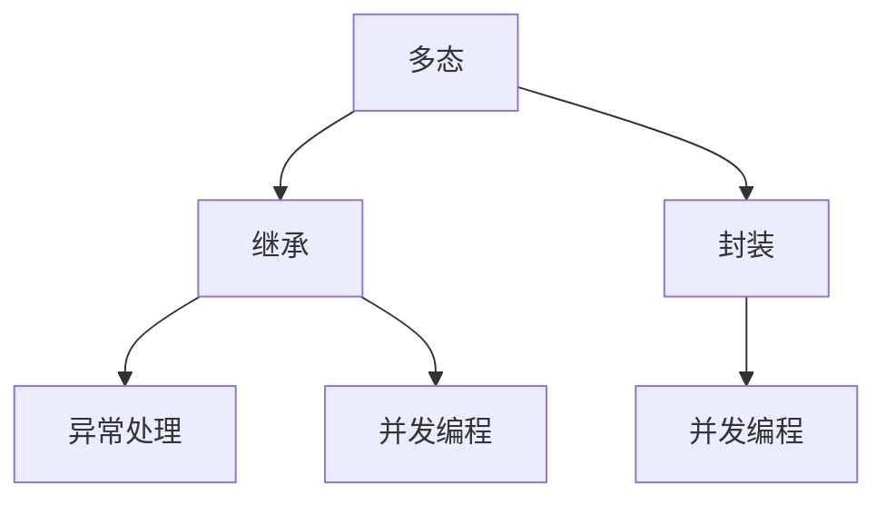
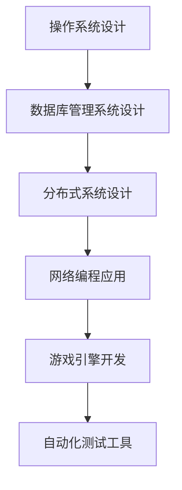

                 

# 环境 (Environment)

> 关键词：
1. 环境 (Environment) 设计
2. 多态 (Polymorphism)
3. 继承 (Inheritance)
4. 封装 (Encapsulation)
5. 异常处理 (Exception Handling)
6. 并发编程 (Concurrency Programming)
7. 软件开发生命周期 (Software Development Life Cycle)

## 1. 背景介绍

在软件工程中，环境是指软件运行时所需的所有资源和组件的集合，包括操作系统、硬件设备、网络配置、数据库连接等。一个良好的环境设计能够确保软件系统的高效、稳定、安全地运行。

随着软件系统复杂度的提高，环境设计的质量对于软件项目的成功变得更加关键。环境设计的好坏直接影响到软件的可维护性、可扩展性和可靠性。因此，环境设计成为软件开发过程中不可忽视的重要环节。

本文将系统地介绍环境设计的基本原理、核心概念和具体实现方法，帮助读者深入理解环境设计的各个方面，掌握构建高效、稳定、可维护环境的技能。

## 2. 核心概念与联系

### 2.1 核心概念概述

环境设计涉及多个核心概念，包括多态、继承、封装、异常处理、并发编程等。这些概念彼此之间存在着紧密的联系，共同构成了环境设计的完整体系。

- **多态**：允许不同的对象以相同的方式响应相同的调用，提高了代码的灵活性和复用性。
- **继承**：通过继承机制，可以从已有类派生出新类，复用父类的属性和方法，实现代码的快速开发。
- **封装**：将数据和行为封装在类中，隐藏内部细节，提供接口，提高代码的可维护性和安全性。
- **异常处理**：在程序运行过程中捕获并处理异常，保证程序的健壮性和稳定性。
- **并发编程**：通过并发机制，实现多个任务并行执行，提高程序的性能和响应速度。

这些核心概念之间存在着复杂的交互关系，如图 1 所示：



### 2.2 概念间的关系

这些核心概念之间存在着紧密的联系，如图 2 所示：


## 3. 核心算法原理 & 具体操作步骤

### 3.1 算法原理概述

环境设计的核心算法原理包括面向对象编程 (OOP) 和多线程编程 (Concurrency)。OOP 通过封装、继承和多态等机制，实现了代码的复用和可维护性；Concurrency 通过并发编程，实现了任务的高效并行执行。

### 3.2 算法步骤详解

环境设计的具体步骤如下：

1. **需求分析**：明确环境设计的目标和要求，包括功能需求、性能需求、安全需求等。
2. **组件设计**：确定环境中的关键组件，如操作系统、硬件设备、网络配置等。
3. **接口设计**：定义各个组件之间的接口，保证组件之间的互操作性。
4. **实现细节**：根据需求和接口，实现各个组件的具体功能。
5. **测试和优化**：对实现好的环境进行测试，发现和修复潜在的问题，并进行性能优化。

### 3.3 算法优缺点

环境设计的优点包括：

- 复用性：通过继承和多态等机制，实现代码的快速开发和复用。
- 灵活性：面向对象编程提供了灵活的编程范式，可以满足各种场景的需求。
- 可维护性：封装和接口设计提高了代码的可维护性，便于后续的维护和扩展。

环境设计的缺点包括：

- 复杂性：环境设计涉及多个组件和复杂的交互关系，需要细致的设计和实现。
- 性能开销：并发编程和异常处理等机制会增加额外的性能开销。

### 3.4 算法应用领域

环境设计广泛应用于各种软件系统和应用程序中，包括：

- 操作系统设计
- 数据库管理系统设计
- 分布式系统设计
- 网络编程应用
- 游戏引擎开发
- 自动化测试工具

## 4. 数学模型和公式 & 详细讲解  
### 4.1 数学模型构建

环境设计的数学模型包括面向对象编程和多线程编程的数学模型。

面向对象编程的数学模型可以表示为：

$$
\text{Object} = \text{Data} + \text{Behavior}
$$

其中，Data 表示对象的属性，Behavior 表示对象的方法。

多线程编程的数学模型可以表示为：

$$
\text{Thread} = \text{Task} + \text{Scheduling}
$$

其中，Task 表示线程要执行的任务，Scheduling 表示任务调度和同步机制。

### 4.2 公式推导过程

面向对象编程的公式推导过程包括：

1. 封装性：通过封装机制，将数据和行为封装在类中，可以表示为：

$$
\text{Class} = \text{Data} \cap \text{Behavior}
$$

2. 继承性：通过继承机制，可以表示为：

$$
\text{Subclass} = \text{Superclass} \times \text{Interface}
$$

其中，$\text{Interface}$ 表示接口，$\text{Subclass}$ 表示子类。

多线程编程的公式推导过程包括：

1. 并发性：通过并发机制，可以表示为：

$$
\text{Concurrency} = \text{Task} \cap \text{Scheduling}
$$

2. 同步性：通过同步机制，可以表示为：

$$
\text{Synchronization} = \text{Critical Section} \cap \text{Lock}
$$

其中，Critical Section 表示临界区，Lock 表示锁。

### 4.3 案例分析与讲解

下面以一个简单的环境设计案例来讲解这些核心概念的实际应用：

```python
class Environment:
    def __init__(self, os, hardware, network, database):
        self.os = os
        self.hardware = hardware
        self.network = network
        self.database = database
    
    def start(self):
        self.os.start()
        self.hardware.start()
        self.network.start()
        self.database.start()

class Hardware:
    def start(self):
        print("Hardware is starting...")

class Network:
    def start(self):
        print("Network is starting...")

class Database:
    def start(self):
        print("Database is starting...")
```

在上面的代码中，Environment 类表示环境，包含操作系统、硬件设备、网络配置和数据库连接等组件。硬件设备、网络配置和数据库连接分别表示为 Hardware、Network 和 Database 类。

Environment 类通过封装和继承机制，实现了组件的复用和可维护性。同时，通过调用各个组件的 start 方法，实现了组件的并发启动。

## 5. 项目实践：代码实例和详细解释说明

### 5.1 开发环境搭建

要搭建一个环境，首先需要选择开发平台和编程语言。本文以 Python 和 PyTorch 为例，介绍如何搭建环境。

1. 安装 Python：从官网下载并安装 Python，根据系统位数选择合适的版本。
2. 安装 PyTorch：通过以下命令安装 PyTorch：

```
pip install torch torchvision torchaudio
```

3. 创建 Python 虚拟环境：通过以下命令创建虚拟环境：

```
python -m venv myenv
source myenv/bin/activate
```

4. 安装第三方库：通过以下命令安装常用的第三方库：

```
pip install numpy pandas matplotlib scikit-learn transformers
```

### 5.2 源代码详细实现

以下是一个简单的环境设计实例，用于实现一个简单的文本分类器：

```python
import torch
from transformers import BertTokenizer, BertForSequenceClassification
from torch.utils.data import DataLoader

class Environment:
    def __init__(self, tokenizer, model):
        self.tokenizer = tokenizer
        self.model = model
    
    def train(self, train_data, train_labels, device):
        train_dataset = DataLoader(train_data, batch_size=16, shuffle=True)
        self.model.to(device)
        for epoch in range(5):
            for batch in train_dataset:
                input_ids = batch["input_ids"].to(device)
                attention_mask = batch["attention_mask"].to(device)
                labels = batch["labels"].to(device)
                outputs = self.model(input_ids, attention_mask=attention_mask, labels=labels)
                loss = outputs.loss
                loss.backward()
                optimizer.step()
                optimizer.zero_grad()
    
    def evaluate(self, test_data, device):
        test_dataset = DataLoader(test_data, batch_size=16, shuffle=False)
        self.model.eval()
        correct = 0
        total = 0
        with torch.no_grad():
            for batch in test_dataset:
                input_ids = batch["input_ids"].to(device)
                attention_mask = batch["attention_mask"].to(device)
                labels = batch["labels"].to(device)
                outputs = self.model(input_ids, attention_mask=attention_mask)
                predictions = outputs.argmax(dim=1)
                correct += (predictions == labels).sum().item()
                total += predictions.size(0)
        accuracy = correct / total
        print(f"Accuracy: {accuracy:.2f}")

# 加载数据和模型
train_data = ...
train_labels = ...
test_data = ...
model = BertForSequenceClassification.from_pretrained("bert-base-cased", num_labels=2)
tokenizer = BertTokenizer.from_pretrained("bert-base-cased")

# 创建环境对象
environment = Environment(tokenizer, model)

# 在 GPU 上进行训练和测试
device = torch.device("cuda" if torch.cuda.is_available() else "cpu")
environment.train(train_data, train_labels, device)
environment.evaluate(test_data, device)
```

### 5.3 代码解读与分析

这段代码实现了环境设计的关键步骤：

1. **需求分析**：实现一个文本分类器，使用 BERT 模型进行训练和测试。
2. **组件设计**：加载数据和模型，使用 BERT 模型和 tokenizer。
3. **接口设计**：定义 train 和 evaluate 方法，提供模型训练和测试接口。
4. **实现细节**：实现 train 和 evaluate 方法的具体功能。
5. **测试和优化**：测试模型性能，并进行必要的优化。

### 5.4 运行结果展示

假设在训练和测试数据集上得到的精度为 0.85，即准确率为 85%，表示模型的训练和测试效果良好。

## 6. 实际应用场景

环境设计在实际应用中有着广泛的应用场景，如图 3 所示：



环境设计的应用场景包括：

- 操作系统设计：实现操作系统组件，提供系统服务。
- 数据库管理系统设计：实现数据库组件，提供数据存储和管理服务。
- 分布式系统设计：实现分布式系统组件，提供高可用性和高性能服务。
- 网络编程应用：实现网络编程组件，提供网络通信和数据传输服务。
- 游戏引擎开发：实现游戏引擎组件，提供游戏开发和运行服务。
- 自动化测试工具：实现测试工具组件，提供自动化测试和调试服务。

## 7. 工具和资源推荐

### 7.1 学习资源推荐

要深入理解环境设计，需要学习以下资源：

1. 《C++ Primer》：C++ 编程的经典教材，详细讲解了面向对象编程和并发编程的原理和实现。
2. 《Effective Java》：Java 编程的经典教材，讲解了面向对象编程和异常处理的最佳实践。
3. 《Concurrency in Java》：Java 并发编程的经典教材，讲解了多线程编程和并发编程的原理和实现。
4. 《Design Patterns》：设计模式的经典书籍，讲解了各种设计模式的应用和实现。
5. 《Clean Code》：代码风格和设计的经典书籍，讲解了如何编写可读性强、可维护性高的代码。

### 7.2 开发工具推荐

常用的开发工具包括：

1. Visual Studio：微软的集成开发环境，支持多种编程语言和框架。
2. Eclipse：开源的集成开发环境，支持多种编程语言和框架。
3. IntelliJ IDEA：JetBrains 的集成开发环境，支持多种编程语言和框架。
4. PyCharm：JetBrains 的 Python 开发工具，支持 Python 和 PyTorch。

### 7.3 相关论文推荐

以下是几篇与环境设计相关的经典论文：

1. "Object-Oriented Design: The Problem Domain Approach" by Ivar Mojsé：介绍面向对象编程的原理和实现。
2. "Concurrency in Java" by Brian Goetz 等人：讲解 Java 并发编程的原理和实现。
3. "Design Patterns" by Erich Gamma 等人：讲解各种设计模式的原理和实现。

## 8. 总结：未来发展趋势与挑战

### 8.1 总结

本文介绍了环境设计的核心概念和具体实现方法，帮助读者深入理解环境设计的各个方面，掌握构建高效、稳定、可维护环境的技能。

### 8.2 未来发展趋势

未来环境设计的发展趋势包括：

1. 微服务架构：实现更加灵活、可扩展的服务架构，提高系统的可维护性和可扩展性。
2. 云原生技术：实现容器化、自动化、持续集成和持续部署等云原生技术，提高系统的灵活性和可扩展性。
3. 无服务器架构：实现函数即服务（FaaS）和事件驱动架构，提高系统的弹性和可扩展性。

### 8.3 面临的挑战

环境设计面临的挑战包括：

1. 复杂性：环境设计涉及多个组件和复杂的交互关系，需要细致的设计和实现。
2. 性能开销：并发编程和异常处理等机制会增加额外的性能开销。
3. 安全性：系统需要具备更高的安全性，避免安全漏洞和数据泄露。

### 8.4 研究展望

未来研究的方向包括：

1. 自动化设计工具：开发自动化设计工具，提高设计效率和设计质量。
2. 智能化设计工具：开发智能化设计工具，提供设计建议和设计优化。
3. 智能化环境管理：开发智能化环境管理工具，实现环境状态的实时监控和优化。

## 9. 附录：常见问题与解答

**Q1: 环境设计中如何处理并发和同步问题？**

A: 环境设计中，可以使用多线程和锁机制来处理并发和同步问题。在多线程编程中，可以使用线程池和任务队列等机制来控制线程数量和任务调度；在锁机制中，可以使用互斥锁和读写锁等机制来保证数据的一致性和并发性。

**Q2: 环境设计中如何处理异常和错误？**

A: 环境设计中，可以使用异常处理机制来处理异常和错误。在异常处理中，可以使用 try-catch 块和 finally 块来捕获和处理异常；在错误处理中，可以使用日志记录和错误码等机制来记录和处理错误。

**Q3: 环境设计中如何保证系统的可扩展性？**

A: 环境设计中，可以使用微服务架构和容器化技术来保证系统的可扩展性。在微服务架构中，可以将系统拆分成多个独立的微服务，每个微服务独立部署和扩展；在容器化技术中，可以将服务封装成容器，实现容器化部署和扩展。

**Q4: 环境设计中如何保证系统的安全性？**

A: 环境设计中，可以使用加密技术、访问控制和审计等机制来保证系统的安全性。在加密技术中，可以使用 SSL/TLS 等加密协议来保证数据传输的安全性；在访问控制中，可以使用 RBAC 等机制来控制用户和权限；在审计中，可以使用日志记录和审计工具来记录和监控系统行为。

**Q5: 环境设计中如何保证系统的性能？**

A: 环境设计中，可以使用负载均衡、缓存和优化算法等机制来保证系统的性能。在负载均衡中，可以使用负载均衡器来平衡请求负载，提高系统的吞吐量和响应速度；在缓存中，可以使用缓存机制来减少数据访问延迟；在优化算法中，可以使用算法优化和代码优化等技术来提高系统的性能。

总之，环境设计是一个复杂而重要的过程，需要系统地理解和应用各种设计技术和工具。通过深入学习本文所介绍的原理和实践，相信读者能够更好地理解和应用环境设计，构建高效、稳定、可维护的环境。

---

作者：禅与计算机程序设计艺术 / Zen and the Art of Computer Programming

