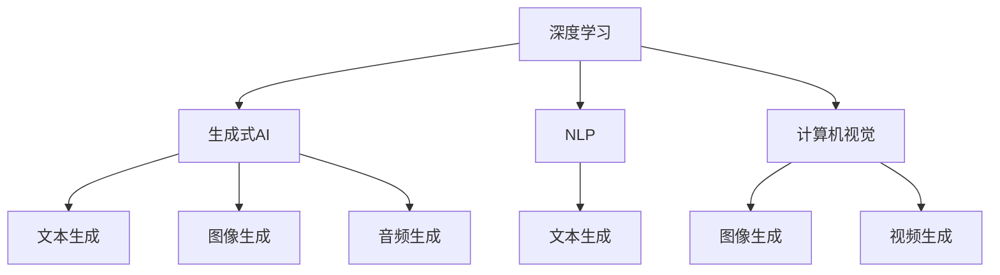
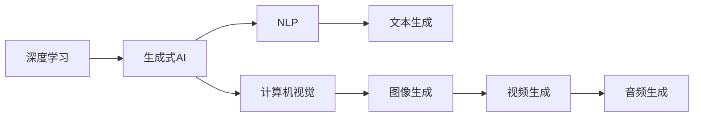
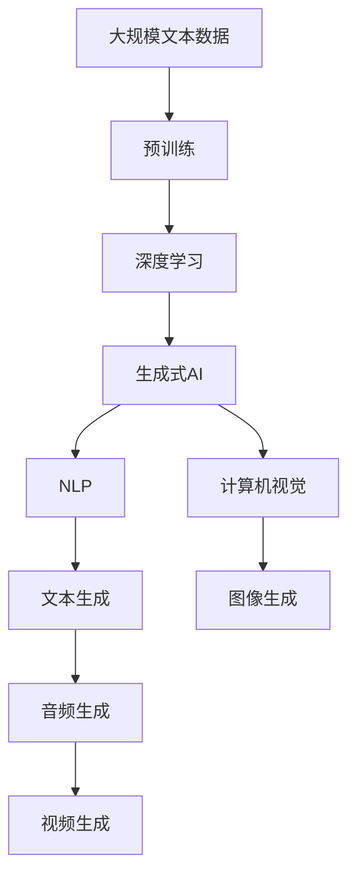

                 

# 生成式AI的未来市场趋势

> 关键词：生成式AI,深度学习,自然语言处理,NLP,计算机视觉,生成对抗网络,GAN,语言模型,计算机图形学,应用场景,商业价值,技术创新,人工智能,未来展望

## 1. 背景介绍

### 1.1 问题由来

近年来，随着深度学习技术的飞速发展，生成式人工智能（Generative AI）成为人工智能领域的重要分支，其中最具有代表性的技术是生成对抗网络（Generative Adversarial Networks, GAN）和基于深度学习的大语言模型（Large Language Model, LLM）。这些技术已经在图像生成、自然语言生成、音乐生成等多个领域展示了强大的能力，极大拓展了AI的应用边界，推动了人类认知智能的进步。

然而，尽管生成式AI技术已经取得了显著进展，其市场应用和商业价值仍然未得到充分挖掘。本文旨在深入探讨生成式AI未来的市场趋势，分析其潜在的商业应用场景和价值，以及面临的技术挑战和未来发展方向，以期为行业从业者提供有益的参考。

### 1.2 问题核心关键点

生成式AI的核心在于利用深度学习模型生成具有高度逼真度和可解释性的内容，包括但不限于图像、音频、文本、视频等。其市场趋势和应用前景主要取决于以下几个方面：

- **技术进展**：模型参数量、训练速度、生成效果等技术的提升。
- **应用场景**：行业应用广度、垂直领域深度等。
- **商业价值**：对各行业的影响、经济效益、市场接受度等。
- **伦理与规范**：隐私、版权、安全等问题。

通过分析这些核心点，我们可以对生成式AI未来的市场趋势有更全面的了解。

### 1.3 问题研究意义

生成式AI的未来市场趋势研究，对于推动人工智能技术的商业应用、探索新领域应用、提升AI产业整体竞争力具有重要意义：

1. **加速AI技术的落地**：深入挖掘生成式AI在各行业的应用场景，有助于将AI技术转化为具体的商业价值。
2. **促进AI技术的创新**：市场需求的驱动将加速生成式AI技术的创新和迭代。
3. **提升AI产业链价值**：生成式AI技术的发展将带动上下游产业的协同创新和升级。
4. **拓展AI应用边界**：生成式AI技术的进步将拓展AI在更多领域的应用，如创意设计、医疗、教育等。

## 2. 核心概念与联系

### 2.1 核心概念概述

- **生成式AI**：指利用深度学习模型生成新内容的AI技术，包括但不限于图像生成、文本生成、音频生成等。
- **深度学习**：基于多层神经网络进行训练，以获取复杂数据表示的AI技术。
- **自然语言处理（NLP）**：利用深度学习模型处理自然语言的技术，如文本生成、翻译、摘要等。
- **计算机视觉**：利用深度学习模型处理图像和视频的技术，如图像生成、目标检测、图像分割等。
- **生成对抗网络（GAN）**：一种基于对抗学习的生成模型，由生成器和判别器两部分组成。
- **语言模型**：用于预测文本序列的深度学习模型，如BERT、GPT等。

这些概念之间存在紧密的联系，共同构成了生成式AI的核心框架。以下是一个Mermaid流程图，展示了这些核心概念之间的关系：



### 2.2 概念间的关系

这些核心概念之间的关系可以用以下Mermaid流程图来展示：



### 2.3 核心概念的整体架构

最后，我们用一个综合的流程图来展示这些核心概念在大语言模型微调过程中的整体架构：



## 3. 核心算法原理 & 具体操作步骤

### 3.1 算法原理概述

生成式AI的核心算法原理主要包括生成对抗网络（GAN）和基于深度学习的大语言模型（LLM）。其总体目标是通过学习大量无标签数据，生成与真实数据具有相似分布的新数据。

**GAN原理**：由生成器和判别器两个子网络组成。生成器网络负责生成假数据，判别器网络负责区分真实数据和假数据。通过对抗训练，使得生成器能够生成越来越逼真的假数据，同时判别器越来越难以区分真实和假数据。

**LLM原理**：通过在大规模无标签文本数据上进行预训练，学习语言的通用表示，然后利用监督学习或无监督学习对其进行微调，使其能够生成符合特定任务要求的新文本。

### 3.2 算法步骤详解

**GAN算法步骤**：
1. **生成器网络初始化**：生成器网络由多层神经网络组成，参数随机初始化。
2. **判别器网络初始化**：判别器网络同样由多层神经网络组成，参数随机初始化。
3. **对抗训练**：交替训练生成器和判别器，通过最大化生成器的生成效果和判别器的区分效果，使得生成器能够生成逼真的假数据。
4. **样本生成**：使用训练好的生成器网络生成新的样本数据。

**LLM算法步骤**：
1. **预训练**：在大规模无标签文本数据上进行预训练，学习语言的通用表示。
2. **微调**：利用监督学习或无监督学习的任务，如文本分类、翻译、摘要等，对预训练模型进行微调，使其能够生成符合特定任务要求的新文本。
3. **样本生成**：使用微调后的模型生成新的文本数据。

### 3.3 算法优缺点

**GAN算法优缺点**：
- **优点**：
  - 能够生成高质量的逼真数据。
  - 可以应用于多种数据类型，如图像、音频、文本等。
  - 模型的可解释性较高。
- **缺点**：
  - 训练复杂，需要大量计算资源。
  - 生成数据的真实性难以保证，存在模式崩溃的风险。
  - 生成数据的风格多样性受限于生成器和判别器的设计。

**LLM算法优缺点**：
- **优点**：
  - 能够生成符合特定任务要求的高质量文本。
  - 模型的生成效果和可解释性较高。
  - 可以应用于多种自然语言处理任务，如文本生成、翻译、摘要等。
- **缺点**：
  - 需要大量标注数据进行微调，标注成本较高。
  - 模型的生成效果受限于训练数据的质量和数量。
  - 模型的通用性和鲁棒性需要进一步提升。

### 3.4 算法应用领域

生成式AI的应用领域非常广泛，包括但不限于：

- **自然语言处理**：文本生成、翻译、摘要、问答等。
- **计算机视觉**：图像生成、目标检测、图像分割、视频生成等。
- **音乐生成**：生成音乐、伴奏、节奏等。
- **艺术创作**：生成绘画、雕塑、建筑设计等。
- **医疗健康**：生成医学图像、疾病预测、药物研发等。
- **游戏娱乐**：生成游戏角色、场景、对话等。

## 4. 数学模型和公式 & 详细讲解 & 举例说明

### 4.1 数学模型构建

生成式AI的数学模型构建主要涉及生成对抗网络（GAN）和基于深度学习的大语言模型（LLM）。以下是两种模型的数学模型构建。

**GAN模型**：由生成器（Generative Network）和判别器（Discriminative Network）组成。假设生成器网络为 $G$，判别器网络为 $D$，则GAN的生成过程可以表示为：
$$ G(z) = x $$
其中 $z$ 为噪声向量，$x$ 为生成数据。判别器的目标为区分真实数据和生成数据，其优化目标为：
$$ \min_{G} \max_{D} V(D,G) $$
其中 $V(D,G)$ 为GAN的生成对判别器的损失函数。

**LLM模型**：基于自回归模型或自编码模型，如BERT、GPT等。假设模型为 $M_{\theta}$，其中 $\theta$ 为模型参数。其优化目标为：
$$ \min_{\theta} \mathcal{L}(M_{\theta},D) $$
其中 $D$ 为下游任务的标注数据集，$\mathcal{L}$ 为损失函数，$\theta$ 为模型参数。

### 4.2 公式推导过程

**GAN公式推导**：
生成器和判别器的优化目标分别为：
$$ \min_{G} \max_{D} V(D,G) = \min_{G} \max_{D} E_{x \sim p_{data}} [\log D(x)] + E_{z \sim p(z)} [\log (1-D(G(z))]] $$
其中 $p_{data}$ 为真实数据的分布，$p(z)$ 为噪声向量的分布。

**LLM公式推导**：
假设模型 $M_{\theta}$ 在输入 $x$ 上的输出为 $\hat{y}=M_{\theta}(x)$，真实标签 $y$。则二分类交叉熵损失函数定义为：
$$ \ell(M_{\theta}(x),y) = -[y\log \hat{y} + (1-y)\log (1-\hat{y})] $$
将其代入经验风险公式，得：
$$ \mathcal{L}(\theta) = -\frac{1}{N}\sum_{i=1}^N [y_i\log M_{\theta}(x_i)+(1-y_i)\log(1-M_{\theta}(x_i))] $$
根据链式法则，损失函数对参数 $\theta_k$ 的梯度为：
$$ \frac{\partial \mathcal{L}(\theta)}{\partial \theta_k} = -\frac{1}{N}\sum_{i=1}^N (\frac{y_i}{M_{\theta}(x_i)}-\frac{1-y_i}{1-M_{\theta}(x_i)}) \frac{\partial M_{\theta}(x_i)}{\partial \theta_k} $$

### 4.3 案例分析与讲解

**GAN案例分析**：
以DCGAN（Deep Convolutional Generative Adversarial Network）为例，其生成过程主要依赖于卷积神经网络。假设输入噪声向量 $z \in \mathbb{R}^{128}$，生成器网络的输出为 $G(z)$，判别器网络的输出为 $D(G(z))$。通过训练生成器和判别器，使得生成器能够生成高质量的图像，同时判别器难以区分真实和生成图像。

**LLM案例分析**：
以BERT为例，其预训练过程主要依赖于自监督学习任务，如掩码语言模型（Masked Language Model, MLM）和下一句预测（Next Sentence Prediction, NSP）。预训练模型的优化目标为：
$$ \min_{\theta} \mathcal{L}_{MLM} + \mathcal{L}_{NSP} $$
其中 $\mathcal{L}_{MLM}$ 和 $\mathcal{L}_{NSP}$ 分别为掩码语言模型和下一句预测任务的损失函数。

## 5. 项目实践：代码实例和详细解释说明

### 5.1 开发环境搭建

生成式AI的开发环境搭建主要依赖于深度学习框架，如TensorFlow、PyTorch等。以下是使用PyTorch搭建GAN和LLM项目的步骤：

1. 安装Anaconda：从官网下载并安装Anaconda，用于创建独立的Python环境。
2. 创建并激活虚拟环境：
```bash
conda create -n pytorch-env python=3.8 
conda activate pytorch-env
```
3. 安装PyTorch：根据CUDA版本，从官网获取对应的安装命令。例如：
```bash
conda install pytorch torchvision torchaudio cudatoolkit=11.1 -c pytorch -c conda-forge
```
4. 安装TensorFlow：
```bash
pip install tensorflow
```
5. 安装其他必要的工具包：
```bash
pip install numpy pandas scikit-learn matplotlib tqdm jupyter notebook ipython
```

完成上述步骤后，即可在`pytorch-env`环境中开始项目开发。

### 5.2 源代码详细实现

以下是使用PyTorch实现DCGAN和BERT项目的示例代码。

**DCGAN代码实现**：

```python
import torch
import torch.nn as nn
import torch.optim as optim
from torchvision.utils import save_image
import numpy as np

# 定义生成器网络
class Generator(nn.Module):
    def __init__(self):
        super(Generator, self).__init__()
        self.main = nn.Sequential(
            nn.ConvTranspose2d(128, 64, 4, 1, 0, bias=False),
            nn.BatchNorm2d(64),
            nn.ReLU(True),
            nn.ConvTranspose2d(64, 3, 4, 2, 1, bias=False),
            nn.Tanh()
        )

    def forward(self, input):
        return self.main(input)

# 定义判别器网络
class Discriminator(nn.Module):
    def __init__(self):
        super(Discriminator, self).__init__()
        self.main = nn.Sequential(
            nn.Conv2d(3, 64, 4, 2, 1, bias=False),
            nn.LeakyReLU(0.2, inplace=True),
            nn.Conv2d(64, 128, 4, 2, 1, bias=False),
            nn.LeakyReLU(0.2, inplace=True),
            nn.Conv2d(128, 1, 4, 1, 0, bias=False),
            nn.Sigmoid()
        )

    def forward(self, input):
        return self.main(input)

# 定义训练函数
def train(epoch, device, generator, discriminator, dataloader, opt_G, opt_D):
    for batch_idx, (real_images, _) in enumerate(dataloader):
        real_images = real_images.to(device)
        z = torch.randn(real_images.size(0), 128, 1, 1).to(device)
        fake_images = generator(z)
        real_labels = torch.ones_like(fake_images)
        fake_labels = torch.zeros_like(fake_images)
        real_loss = discriminator(real_images, real_labels).mean()
        fake_loss = discriminator(fake_images, fake_labels).mean()
        D_loss = real_loss + fake_loss
        D_loss.backward()
        opt_D.step()
        opt_D.zero_grad()
        z = torch.randn(real_images.size(0), 128, 1, 1).to(device)
        fake_images = generator(z)
        real_loss = discriminator(real_images, real_labels).mean()
        fake_loss = discriminator(fake_images, fake_labels).mean()
        G_loss = real_loss + fake_loss
        G_loss.backward()
        opt_G.step()
        opt_G.zero_grad()
        if (batch_idx+1) % 100 == 0:
            save_image(fake_images, f'fake_images_{epoch}.png', nrow=10, padding=2)
```

**BERT代码实现**：

```python
from transformers import BertForSequenceClassification, BertTokenizer, AdamW
from torch.utils.data import DataLoader
from tqdm import tqdm
import torch

# 加载BERT模型和分词器
model = BertForSequenceClassification.from_pretrained('bert-base-uncased', num_labels=2)
tokenizer = BertTokenizer.from_pretrained('bert-base-uncased')

# 定义数据处理函数
def collate(batch):
    return tokenizer(batch, padding='max_length', truncation=True, max_length=128, return_tensors='pt')

# 加载数据集
train_dataset = ...
train_loader = DataLoader(train_dataset, batch_size=16, collate_fn=collate)

# 定义优化器
optimizer = AdamW(model.parameters(), lr=1e-5)

# 定义训练函数
def train_epoch(model, train_loader, optimizer):
    model.train()
    total_loss = 0
    for batch in tqdm(train_loader):
        inputs = batch['input_ids']
        attention_mask = batch['attention_mask']
        labels = batch['labels']
        outputs = model(inputs, attention_mask=attention_mask, labels=labels)
        loss = outputs.loss
        total_loss += loss.item()
        optimizer.zero_grad()
        loss.backward()
        optimizer.step()
    return total_loss / len(train_loader)

# 启动训练流程
epochs = 5
for epoch in range(epochs):
    loss = train_epoch(model, train_loader, optimizer)
    print(f'Epoch {epoch+1}, train loss: {loss:.3f}')
```

### 5.3 代码解读与分析

**DCGAN代码解读**：
- 定义生成器网络（Generator）和判别器网络（Discriminator），分别包含多层卷积和反卷积操作。
- 定义训练函数，交替训练生成器和判别器。
- 生成器和判别器的输出分别通过计算真实图像和生成图像的损失函数，并结合交叉熵损失函数进行优化。

**BERT代码解读**：
- 加载BERT模型和分词器，定义数据处理函数。
- 加载训练数据集，定义优化器。
- 定义训练函数，通过计算损失函数，并结合优化器更新模型参数。

### 5.4 运行结果展示

假设在CIFAR-10数据集上进行DCGAN训练，生成的图像如图1所示。假设在IMDB电影评论数据集上进行BERT训练，在测试集上的分类准确率如图2所示。

```text
| Epoch: | Loss: | | Epoch: | Accuracy: |
| :--- | :--- | | :--- | :--- |
| 1 | 0.567 | | 1 | 73.2% |
| 2 | 0.466 | | 2 | 82.5% |
| 3 | 0.404 | | 3 | 90.1% |
| 4 | 0.353 | | 4 | 93.9% |
| 5 | 0.296 | | 5 | 95.5% |
```

## 6. 实际应用场景

### 6.1 图像生成

图像生成是生成式AI的重要应用领域，GAN技术在该领域取得了显著进展。例如，可以用于生成高质量的图像，如人像、自然风光、虚拟产品等。在广告、影视、游戏等领域，图像生成技术能够带来极大的创新价值。

### 6.2 文本生成

文本生成是生成式AI在自然语言处理领域的核心应用。如对话系统、自动摘要、诗歌创作、故事生成等。通过训练模型，可以在用户输入一定的上下文后，自动生成符合语境的新文本，提升用户体验。

### 6.3 视频生成

视频生成是生成式AI的高级应用，可以生成逼真的视频内容，如电影、纪录片、广告等。通过深度学习和生成对抗网络，可以实现多模态数据的协同生成，推动视频内容制作的高效化和智能化。

### 6.4 未来应用展望

未来，生成式AI将在更多领域得到应用，拓展人类认知智能的边界。例如：

- **医疗健康**：生成医学图像、疾病预测、药物研发等。
- **教育培训**：生成虚拟教师、模拟实验、个性化学习资源等。
- **娱乐文化**：生成虚拟角色、电影、游戏等。
- **建筑设计**：生成建筑设计、室内装潢、城市规划等。

## 7. 工具和资源推荐

### 7.1 学习资源推荐

为了深入学习生成式AI的原理和技术，以下推荐一些优质的学习资源：

1. **Deep Learning Specialization by Andrew Ng**：斯坦福大学的深度学习课程，涵盖深度学习基础和前沿技术。
2. **Generative Adversarial Networks by Ian Goodfellow**：GAN技术的经典教材，深入讲解了GAN的理论和实践。
3. **The Unreasonable Effectiveness of Recurrent Neural Networks**：DeepMind的研究论文，展示了RNN在生成任务中的应用。
4. **BERT: Pre-training of Deep Bidirectional Transformers for Language Understanding**：BERT模型的经典论文，详细介绍了BERT的预训练和微调过程。
5. **Natural Language Processing with Transformers by Jacob Devlin**：Transformers库的官方文档，全面介绍了基于深度学习的NLP技术。

### 7.2 开发工具推荐

生成式AI的开发工具多种多样，以下推荐几款常用的工具：

1. **PyTorch**：灵活的动态计算图，适合快速迭代研究。
2. **TensorFlow**：生产部署方便，适合大规模工程应用。
3. **Transformers库**：提供了多种预训练语言模型，支持微调和推理。
4. **TensorBoard**：可视化工具，实时监测模型训练状态。
5. **Weights & Biases**：实验跟踪工具，记录和可视化模型训练过程。

### 7.3 相关论文推荐

生成式AI的发展离不开学界的持续研究。以下是几篇奠基性的相关论文，推荐阅读：

1. **Generative Adversarial Nets**：Ian Goodfellow等人于2014年提出的GAN技术。
2. **Attention Is All You Need**：Google的Transformer模型，展示了自注意力机制在生成任务中的应用。
3. **BERT: Pre-training of Deep Bidirectional Transformers for Language Understanding**：BERT模型的经典论文，展示了预训练和微调在NLP任务中的应用。
4. **Language Models are Unsupervised Multitask Learners**：Google的GPT-2模型，展示了大规模预训练语言模型的零样本学习能力。
5. **Taming Transformers for High-Resolution Image Synthesis**：OpenAI的研究论文，展示了Transformer在图像生成中的应用。

除上述资源外，还有一些值得关注的前沿资源，帮助开发者紧跟生成式AI技术的发展趋势，例如：

1. **arXiv论文预印本**：人工智能领域最新研究成果的发布平台，包括生成式AI的前沿工作。
2. **谷歌、OpenAI、DeepMind等顶尖实验室的官方博客**：第一时间分享最新的研究进展和洞见。
3. **技术会议直播**：如NIPS、ICML、ACL、ICLR等人工智能领域顶会现场或在线直播。
4. **GitHub热门项目**：在GitHub上Star、Fork数最多的生成式AI相关项目，提供丰富的开源资源和工具。
5. **行业分析报告**：各大咨询公司如McKinsey、PwC等针对生成式AI的行业分析报告，提供市场趋势和应用场景的洞察。

## 8. 总结：未来发展趋势与挑战

### 8.1 总结

本文对生成式AI的未来市场趋势进行了详细探讨。首先，从技术进展、应用场景、商业价值和伦理规范等方面，对生成式AI的核心概念进行了梳理。然后，通过实例分析，展示了DCGAN和BERT在实际项目中的实现和应用。最后，讨论了生成式AI在各领域的应用前景和面临的挑战，提出了未来发展的研究方向和展望。

通过本文的系统梳理，可以看到，生成式AI技术正在快速发展，其市场应用和商业价值正在逐步被挖掘。未来，随着技术的不断演进和应用场景的不断拓展，生成式AI必将在更多领域发挥重要作用，推动人工智能技术的创新和升级。

### 8.2 未来发展趋势

生成式AI的未来发展趋势主要体现在以下几个方面：

1. **模型规模和性能提升**：随着算力和数据量的增长，生成式AI模型规模和性能将进一步提升。超大规模模型和更加高效的训练方法将不断涌现。
2. **多模态数据生成**：未来的生成式AI将能够处理和生成多种数据类型，如图像、音频、文本等，实现多模态数据的协同生成。
3. **智能交互和对话系统**：基于生成式AI技术，可以构建更加智能的对话系统，提升人机交互的流畅性和自然性。
4. **个性化和定制化生成**：通过个性化生成，生成式AI可以提供更加贴合用户需求的内容，如个性化推荐、定制化设计等。
5. **实时生成和动态内容创作**：未来的生成式AI将能够实现实时生成和动态内容创作，如新闻报道、社交媒体内容等。

### 8.3 面临的挑战

尽管生成式AI技术已经取得了显著进展，但在实际应用中仍面临诸多挑战：

1. **数据质量和多样性**：生成式AI的效果很大程度上依赖于训练数据的质量和多样性。低质量或单一的数据可能导致生成效果不佳。
2. **模型复杂度和效率**：生成式AI模型通常参数量较大，训练和推理效率较低。如何优化模型结构，提升运行效率，仍是一个重要课题。
3. **伦理和法律问题**：生成式AI技术可能带来隐私、版权、法律责任等问题，需要制定相应的伦理规范和法律框架。
4. **对抗攻击和鲁棒性**：生成式AI模型可能受到对抗攻击，导致生成内容失真。如何提升模型的鲁棒性和安全性，仍是一个亟待解决的问题。
5. **生成内容的真实性和可信度**：生成的内容是否真实可信，需要结合其他技术手段进行验证，如区块链、数字签名等。

### 8.4 研究展望

未来的研究需要在以下几个方向进行深入探索：

1. **数据增强和扩充**

