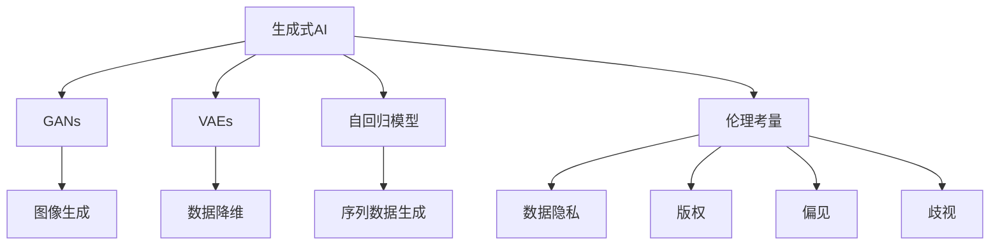
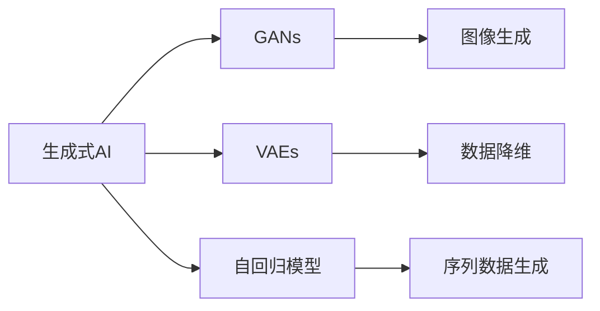
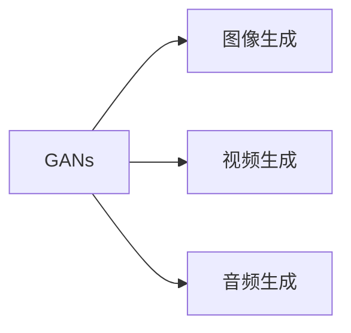
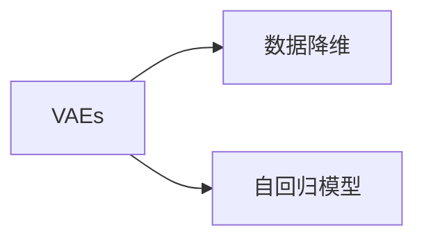
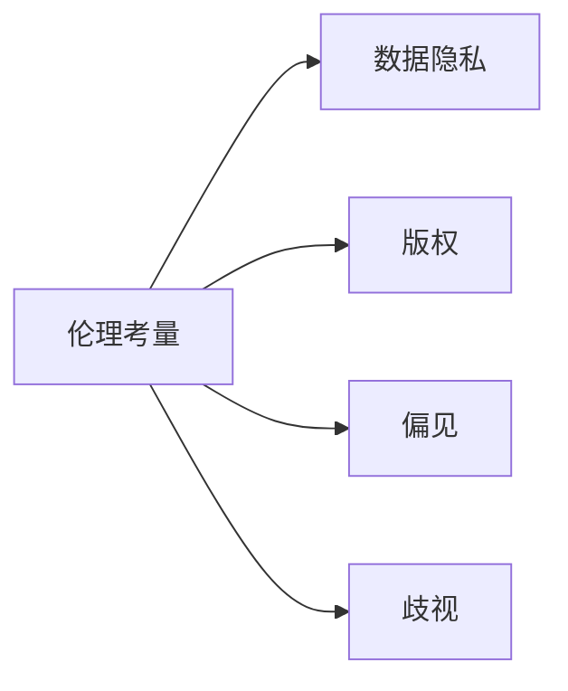
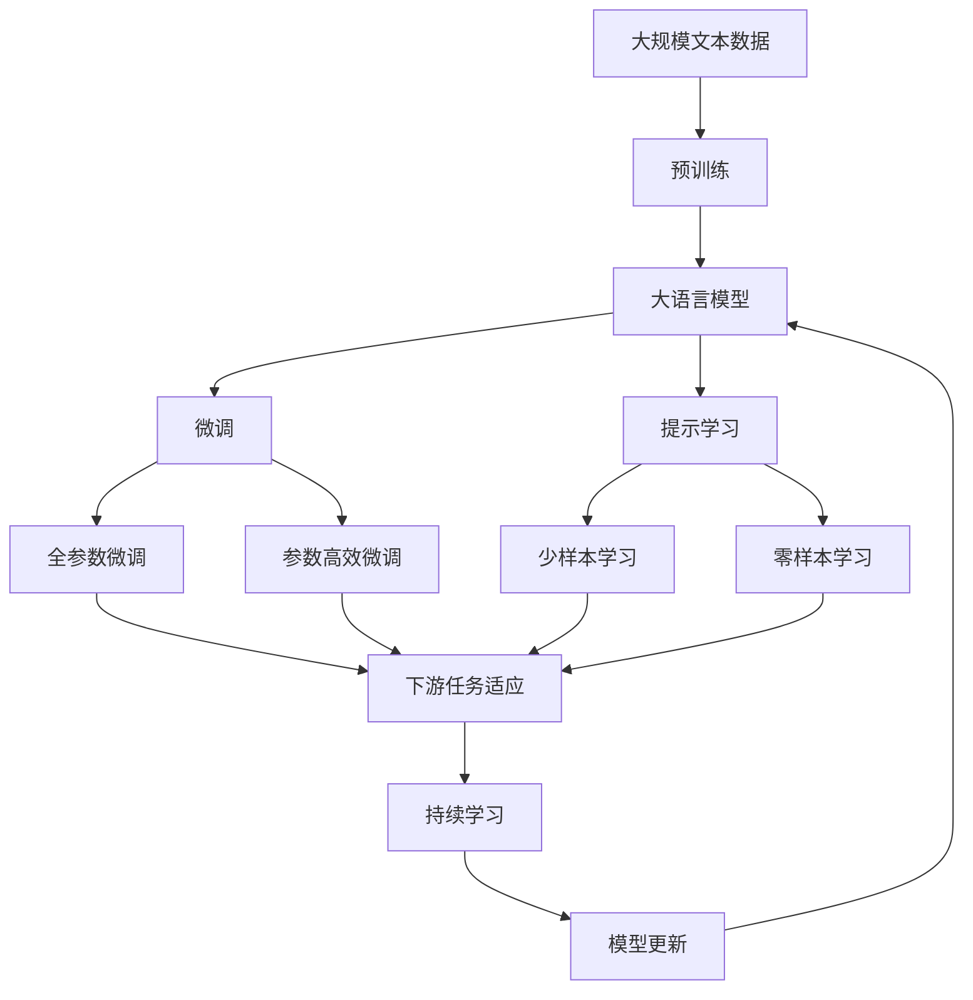

                 

# 生成式AI：金矿还是泡沫？第一部分：回归商业本质

> 关键词：生成式AI, 商业本质, 技术泡沫, 商业应用, 伦理考量, 未来展望

## 1. 背景介绍

### 1.1 问题由来
近年来，随着深度学习技术的迅猛发展，生成式人工智能（Generative AI）成为了一个炙手可热的领域。从图像生成、语音合成到文本创作，生成式AI在多个领域展示了其强大的创造力和应用潜力。生成式AI的核心技术包括生成对抗网络（GANs）、变分自编码器（VAEs）、自回归模型等，这些技术使得AI系统能够从无到有地生成各种内容，极大地拓展了AI的想象空间。

然而，伴随着技术的热潮，关于生成式AI的商业价值、应用前景以及潜在风险的讨论也在不断升温。一方面，生成式AI的应用场景广泛，能够带来显著的经济和社会效益；另一方面，其复杂的技术实现和伦理问题也让许多人对其商业应用前景产生疑虑。本文旨在深入探讨生成式AI的商业本质，剖析其技术实现、应用场景和伦理考量，并展望其未来发展方向，力求为业界提供一种更加全面、深入的视角。

### 1.2 问题核心关键点
生成式AI的核心问题在于其技术实现、应用场景和伦理考量。以下从这三个方面进行深入探讨：

1. **技术实现**：生成式AI的核心技术包括生成对抗网络（GANs）、变分自编码器（VAEs）、自回归模型等。这些技术如何工作？它们的原理是什么？目前有哪些主流模型？这些技术在实际应用中如何优化和调整？

2. **应用场景**：生成式AI在商业上有着广泛的应用场景，如图像生成、视频生成、语音合成、文本创作等。这些应用场景在商业中的价值如何？如何衡量？未来可能的应用场景有哪些？

3. **伦理考量**：生成式AI技术在商业应用中涉及诸多伦理问题，如数据隐私、版权、偏见、歧视等。如何在商业应用中避免这些伦理问题？

### 1.3 问题研究意义
生成式AI技术的深入研究不仅对技术本身有重要意义，也对商业应用有深远影响。其研究意义体现在以下几个方面：

1. **技术突破**：生成式AI技术的应用和优化能够推动AI领域的进一步发展，带来更多突破性的研究成果。

2. **商业应用**：生成式AI在多个领域的应用能够带来显著的经济效益和社会效益，推动相关产业的发展。

3. **伦理考量**：生成式AI的伦理问题直接影响到其商业应用的可行性和接受度，需要在技术实现和商业应用中引起足够重视。

4. **未来展望**：探讨生成式AI的商业本质，有助于行业更好地理解其潜力与限制，从而在未来的发展中避免陷入技术泡沫，实现可持续发展。

## 2. 核心概念与联系

### 2.1 核心概念概述

为更好地理解生成式AI的商业本质，本节将介绍几个关键概念，并揭示它们之间的联系：

- **生成式AI**：通过深度学习模型生成新的、有价值的信息的技术，如生成对抗网络（GANs）、变分自编码器（VAEs）、自回归模型等。

- **生成对抗网络（GANs）**：由两个神经网络组成，一个生成网络生成假样本，另一个判别网络判断样本的真假，两者通过对抗训练不断优化，最终生成高质量的样本。

- **变分自编码器（VAEs）**：通过将高维数据压缩到低维空间再解压，实现数据的生成和重构，常用于图像生成和数据降维。

- **自回归模型**：通过先预测前一个时间步的输出，然后利用这个输出作为下一个时间步的输入，实现序列数据的生成，如循环神经网络（RNNs）和变换器（Transformers）等。

- **伦理考量**：生成式AI技术在商业应用中涉及诸多伦理问题，如数据隐私、版权、偏见、歧视等。

这些概念之间的联系可以通过以下Mermaid流程图来展示：



这个流程图展示了生成式AI的各个核心概念以及它们之间的联系：

1. **生成式AI**是这些技术的基础，包括GANs、VAEs和自回归模型等。
2. **GANs**、**VAEs**和**自回归模型**分别在图像生成、数据降维和序列数据生成方面具有不同的优势。
3. **伦理考量**是这些技术在商业应用中必须面对的重要问题。

### 2.2 概念间的关系

这些核心概念之间存在着紧密的联系，形成了生成式AI的完整生态系统。下面我们通过几个Mermaid流程图来展示这些概念之间的关系。

#### 2.2.1 生成式AI的技术范式



这个流程图展示了生成式AI的三种主要技术范式：GANs、VAEs和自回归模型。这些技术范式各自有着不同的优势和应用场景。

#### 2.2.2 GANs的应用场景



这个流程图展示了GANs在图像生成、视频生成和音频生成中的应用场景。GANs能够生成高质量的图像、视频和音频，这些生成内容在娱乐、广告、虚拟现实等领域有着广泛的应用。

#### 2.2.3 数据降维与序列数据生成



这个流程图展示了VAEs和自回归模型在数据降维和序列数据生成中的应用。VAEs能够将高维数据压缩到低维空间，实现数据降维，常用于图像压缩和特征提取。自回归模型能够生成序列数据，如文本、音频和视频，常用于自然语言处理、语音合成和视频生成等。

#### 2.2.4 伦理考量与数据隐私



这个流程图展示了伦理考量在不同方面的具体应用。数据隐私、版权、偏见和歧视是生成式AI技术在商业应用中必须面对的重要伦理问题。

### 2.3 核心概念的整体架构

最后，我们用一个综合的流程图来展示这些核心概念在大语言模型微调过程中的整体架构：



这个综合流程图展示了从预训练到微调，再到持续学习的完整过程。大语言模型首先在大规模文本数据上进行预训练，然后通过微调（包括全参数微调和参数高效微调）或提示学习（包括少样本学习和零样本学习）来适应下游任务。最后，通过持续学习技术，模型可以不断更新和适应新的任务和数据。

## 3. 核心算法原理 & 具体操作步骤
### 3.1 算法原理概述

生成式AI的算法原理主要基于深度学习模型，通过训练模型生成新的、有价值的信息。其核心思想是通过对大量样本的学习，使得模型能够掌握生成新样本的规律，从而在给定输入的情况下生成高质量的输出。

生成对抗网络（GANs）是生成式AI中最具代表性的算法之一。GANs由两个神经网络组成，一个生成网络（Generator）生成假样本，另一个判别网络（Discriminator）判断样本的真假。通过对抗训练，生成网络和判别网络不断优化，最终生成高质量的样本。GANs的核心算法流程如下：

1. **生成过程**：生成网络接收随机噪声作为输入，生成假样本。
2. **判别过程**：判别网络接收输入样本，输出判别结果，判断样本是真实样本还是假样本。
3. **对抗训练**：生成网络和判别网络交替进行训练，生成网络试图欺骗判别网络，判别网络试图识别真伪。
4. **模型优化**：通过最大化生成网络和判别网络的对抗损失，训练生成网络生成高质量的样本。

### 3.2 算法步骤详解

生成式AI的算法实现一般包括以下几个关键步骤：

**Step 1: 准备生成模型和数据集**
- 选择合适的生成模型，如GANs、VAEs或自回归模型。
- 准备生成任务的数据集，划分为训练集、验证集和测试集。一般要求数据集与生成模型的输出分布接近。

**Step 2: 设计损失函数**
- 根据生成任务，设计合适的损失函数，如GANs的对抗损失函数、VAEs的重构损失函数等。
- 损失函数应包括生成样本与真实样本之间的差异，以及生成模型的梯度消失问题等。

**Step 3: 设置训练参数**
- 选择合适的优化算法及其参数，如Adam、SGD等，设置学习率、批大小、迭代轮数等。
- 设置正则化技术及强度，包括权重衰减、Dropout等。
- 确定冻结生成网络的策略，如仅微调生成网络顶层，或全部参数都参与微调。

**Step 4: 执行梯度训练**
- 将训练集数据分批次输入模型，前向传播计算损失函数。
- 反向传播计算参数梯度，根据设定的优化算法和学习率更新模型参数。
- 周期性在验证集上评估模型性能，根据性能指标决定是否触发 Early Stopping。
- 重复上述步骤直到满足预设的迭代轮数或 Early Stopping 条件。

**Step 5: 测试和部署**
- 在测试集上评估生成后模型 $M_{\hat{\theta}}$ 的性能，对比生成前后的精度提升。
- 使用生成后模型对新样本进行推理预测，集成到实际的应用系统中。
- 持续收集新的数据，定期重新生成模型，以适应数据分布的变化。

以上是生成式AI的典型流程。在实际应用中，还需要根据具体生成任务的特点，对生成模型和数据集进行优化设计，如改进损失函数，引入更多的正则化技术，搜索最优的超参数组合等，以进一步提升生成效果。

### 3.3 算法优缺点

生成式AI在图像生成、视频生成、语音合成、文本创作等方面取得了显著的进展，具有以下优点：

- **高质量生成**：生成式AI能够生成高质量的图像、视频、音频和文本，与真实样本几乎无法区分。
- **多样性生成**：生成式AI能够生成多样化的样本，满足不同应用场景的需求。
- **高效学习**：生成式AI能够通过少量数据进行快速学习，减少对标注数据的需求。

然而，生成式AI也存在一些局限性：

- **技术复杂**：生成式AI技术实现较为复杂，需要大量的计算资源和专业知识。
- **数据依赖**：生成式AI的效果很大程度上依赖于训练数据的质量和数量，获取高质量训练数据的成本较高。
- **伦理风险**：生成式AI生成内容可能包含不真实、有害的信息，需对其伦理风险进行严格监管。

尽管存在这些局限性，但生成式AI在多个领域展示了其强大的潜力，成为人工智能技术发展的重要方向。

### 3.4 算法应用领域

生成式AI在多个领域的应用场景广泛，以下列举一些典型的应用：

- **图像生成**：通过GANs生成高质量的图像，如人脸生成、图像修复、艺术创作等。
- **视频生成**：通过GANs生成逼真的视频，如动画制作、虚拟现实、视频剪辑等。
- **语音合成**：通过VAEs和自回归模型生成自然流畅的语音，如智能客服、虚拟助手、语音翻译等。
- **文本创作**：通过自回归模型生成逼真自然的文本，如自动写作、文本摘要、对话系统等。
- **数据增强**：通过GANs生成假样本，用于数据增强，提升模型的泛化能力。
- **个性化推荐**：通过生成式模型生成个性化推荐内容，提升用户满意度。

除了这些应用，生成式AI还在游戏设计、医学影像分析、智能制造等领域有着广泛的应用前景。随着技术的发展，生成式AI的应用领域将进一步拓展，带来更多的商业价值。

## 4. 数学模型和公式 & 详细讲解 & 举例说明

### 4.1 数学模型构建

本节将使用数学语言对生成式AI的算法进行更加严格的刻画。

记生成式AI的生成模型为 $M_{\theta}:\mathcal{X} \rightarrow \mathcal{Y}$，其中 $\mathcal{X}$ 为输入空间，$\mathcal{Y}$ 为输出空间，$\theta$ 为模型参数。假设生成任务为生成 $k$ 维向量 $y$，在数据集 $D=\{(x_i,y_i)\}_{i=1}^N, x_i \in \mathcal{X}, y_i \in \mathcal{Y}$ 上训练生成模型。生成模型的损失函数定义为：

$$
\mathcal{L}(\theta) = \frac{1}{N} \sum_{i=1}^N \ell(M_{\theta}(x_i),y_i)
$$

其中 $\ell$ 为损失函数，用于衡量生成模型输出与真实标签之间的差异。

生成对抗网络（GANs）的生成损失和判别损失分别定义为：

$$
L_G = \mathbb{E}_{x \sim p_x}[\log(1-D(x))]
$$

$$
L_D = \mathbb{E}_{x \sim p_x}[\log D(x)] + \mathbb{E}_{z \sim p_z}[\log(1-D(G(z)))]
$$

其中 $p_x$ 为真实数据分布，$p_z$ 为噪声分布，$G(z)$ 为生成网络，$D(x)$ 为判别网络。GANs的目标是最大化生成损失 $L_G$，最小化判别损失 $L_D$。

### 4.2 公式推导过程

下面以GANs为例，推导其生成损失和判别损失的计算公式。

首先，定义生成网络 $G$ 和判别网络 $D$ 的输出为 $G(z)$ 和 $D(x)$。设 $p_G$ 和 $p_D$ 分别为 $G$ 和 $D$ 的概率密度函数，$p_x$ 和 $p_z$ 分别为真实数据分布和噪声分布。

生成网络的生成损失 $L_G$ 计算如下：

$$
L_G = \mathbb{E}_{z \sim p_z}[\log(1-D(G(z)))]
$$

判别网络的判别损失 $L_D$ 计算如下：

$$
L_D = \mathbb{E}_{x \sim p_x}[\log D(x)] + \mathbb{E}_{z \sim p_z}[\log(1-D(G(z))))
$$

将生成网络 $G$ 和判别网络 $D$ 的输出代入，得：

$$
L_G = \mathbb{E}_{z \sim p_z}[\log(1-D(G(z)))
$$

$$
L_D = \mathbb{E}_{x \sim p_x}[\log D(x)] + \mathbb{E}_{z \sim p_z}[\log(1-D(G(z)))
$$

将上述损失函数代入生成式AI的损失函数 $\mathcal{L}(\theta)$，得：

$$
\mathcal{L}(\theta) = \frac{1}{N} \sum_{i=1}^N [\ell(M_{\theta}(x_i),y_i)]
$$

其中 $M_{\theta}$ 为生成模型，$x_i$ 为输入样本，$y_i$ 为生成样本。

### 4.3 案例分析与讲解

假设我们在MNIST数据集上进行GANs的图像生成实验，以下代码展示了如何构建生成模型和训练模型：

```python
import torch
import torch.nn as nn
import torch.optim as optim
import torchvision.transforms as transforms
from torchvision.datasets import MNIST
from torch.utils.data import DataLoader
from torchvision.utils import save_image

# 定义生成模型
class Generator(nn.Module):
    def __init__(self):
        super(Generator, self).__init__()
        self.fc1 = nn.Linear(100, 256)
        self.fc2 = nn.Linear(256, 784)
        self.fc3 = nn.Linear(784, 784)

    def forward(self, x):
        x = torch.relu(self.fc1(x))
        x = torch.tanh(self.fc2(x))
        x = torch.sigmoid(self.fc3(x))
        return x

# 定义判别模型
class Discriminator(nn.Module):
    def __init__(self):
        super(Discriminator, self).__init__()
        self.fc1 = nn.Linear(784, 256)
        self.fc2 = nn.Linear(256, 128)
        self.fc3 = nn.Linear(128, 1)

    def forward(self, x):
        x = torch.relu(self.fc1(x))
        x = torch.tanh(self.fc2(x))
        x = torch.sigmoid(self.fc3(x))
        return x

# 准备数据集
train_dataset = MNIST(root='./data', train=True, transform=transforms.ToTensor(), download=True)
train_loader = DataLoader(train_dataset, batch_size=128, shuffle=True)

# 初始化模型和优化器
G = Generator()
D = Discriminator()
G_opt = optim.Adam(G.parameters(), lr=0.001)
D_opt = optim.Adam(D.parameters(), lr=0.001)

# 训练过程
for epoch in range(100):
    for batch_idx, (x, y) in enumerate(train_loader):
        # 将输入数据转化为Tensor
        x = x.view(-1, 28*28)
        # 生成器
        G_opt.zero_grad()
        G_input = torch.randn(batch_size, 100)
        G_output = G(G_input)
        D_output = D(G_output)
        # 计算生成器损失
        loss_G = nn.BCELoss()(D_output, torch.ones_like(D_output))
        # 判别器
        D_opt.zero_grad()
        real_output = D(x)
        fake_output = D(G_output)
        # 计算判别器损失
        loss_D = nn.BCELoss()(torch.cat((real_output, fake_output), dim=0), torch.cat((torch.ones_like(real_output), torch.zeros_like(fake_output)), dim=0))
        # 综合损失
        loss = loss_G + loss_D
        # 反向传播
        loss.backward()
        # 更新模型参数
        G_opt.step()
        D_opt.step()

        # 打印训练信息
        if (batch_idx + 1) % 100 == 0:
            print(f'Epoch [{epoch+1}/{100}], Batch {batch_idx+1}/{len(train_loader)}, Loss_G: {loss_G.item():.4f}, Loss_D: {loss_D.item():.4f}')
            # 保存生成样本
            save_image(G(G_input).detach().cpu(), f'generated_images/{epoch+1}-{batch_idx+1}.png', nrow=10, padding=2)
```

这段代码展示了GANs在图像生成中的应用。首先定义生成器和判别器模型，然后准备训练数据集，并初始化优化器。在训练过程中，交替更新生成器和判别器的参数，通过对抗训练优化生成器，使生成网络能够生成逼真的图像。训练过程中，每100个batch输出一次生成样本，并保存生成的图像。

## 5. 项目实践：代码实例和详细解释说明
### 5.1 开发环境搭建

在进行生成式AI项目实践前，我们需要准备好开发环境。以下是使用Python进行TensorFlow开发的环境配置流程：

1. 安装Anaconda：从官网下载并安装Anaconda，用于创建独立的Python环境。

2. 创建并激活虚拟环境：
```bash
conda create -n tf-env python=3.8 
conda activate tf-env
```

3. 安装TensorFlow：根据CUDA版本，从官网获取对应的安装命令。例如：
```bash
conda install tensorflow tensorflow-gpu -c conda-forge
```

4. 安装各类工具包：
```bash
pip install numpy pandas scikit-learn matplotlib tqdm jupyter notebook ipython
```

完成上述步骤后，即可在`tf-env`环境中开始生成式AI项目实践。

### 5.2 源代码详细实现

下面我们以图像生成任务为例，给出使用TensorFlow实现GANs的代码实现。

首先，定义GANs的生成器和判别器：

```python
import tensorflow as tf
from tensorflow.keras import layers

# 定义生成器
def make_generator_model():
    model = tf.keras.Sequential()
    model.add(layers.Dense(256, use_bias=False, input_shape=(100,)))
    model.add(layers.BatchNormalization())
    model.add(layers.LeakyReLU())
    model.add(layers.Dense(512))
    model.add(layers.BatchNormalization())
    model.add(layers.LeakyReLU())
    model.add(layers.Dense(784, activation='tanh'))
    return model

# 定义判别器
def make_discriminator_model():
    model = tf.keras.Sequential()
    model.add(layers.Flatten(input_shape=(28, 28, 1)))
    model.add(layers.Dense(256))
    model.add(layers.LeakyReLU())
    model.add(layers.Dropout(0.3))
    model.add(layers.Dense(1, activation='sigmoid'))
    return model
```

然后，定义损失函数和优化器：

```python
# 定义损失函数
def discriminator_loss(real_output, fake_output):
    real_loss = binary_crossentropy(tf.ones_like(real_output), real_output)
    fake_loss = binary_crossentropy(tf.zeros_like(fake_output), fake_output)
    return real_loss + fake_loss

def generator_loss(fake_output):
    return binary_crossentropy(tf.ones_like(fake_output), fake_output)

# 定义优化器
generator_optimizer = tf.keras.optimizers.Adam(1e-4)
discriminator_optimizer = tf.keras.optimizers.Adam(1e-4)
```

接着，定义训练函数：

```python
# 定义训练函数
@tf.function
def train_step(images):
    noise = tf.random.normal([BATCH_SIZE, LATENT_DIM])

    with tf.GradientTape() as gen_tape, tf.GradientTape() as disc_tape:
        generated_images = generator(noise, training=True)

        real_output = discriminator(images, training=True)
        fake_output = discriminator(generated_images, training=True)

        gen_loss = generator_loss(fake_output)
        disc_loss = discriminator_loss(real_output, fake_output)

    gradients_of_generator = gen_tape.gradient(gen_loss, generator.trainable_variables)
    gradients_of_discriminator = disc_tape.gradient(disc_loss, discriminator.trainable_variables)

    generator_optimizer.apply_gradients(zip(gradients_of_generator, generator.trainable_variables))
    discriminator_optimizer.apply_gradients(zip(gradients_of_discriminator, discriminator.trainable_variables))
```

最后，启动训练流程并在测试集上评估：

```python
# 加载数据集
(train_images, train_labels), (_, _) = tf.keras.datasets.mnist.load_data()
train_images = train_images.reshape(train_images.shape[0], 28, 28, 1).astype('float32')
train_images = (train_images - 127.5) / 127.5

# 定义超参数
BATCH_SIZE = 256
LATENT_DIM = 100

# 初始化模型和优化器
generator = make_generator_model()
discriminator = make_discriminator_model()
generator_optimizer = tf.keras.optimizers.Adam(1e-4)
discriminator_optimizer = tf.keras.optimizers.Adam(1e-4)

# 训练过程
EPOCHS = 50
for epoch in range(EPOCHS):
    for image_batch in train_dataset:
        train_step(image_batch)

    # 每epoch生成一批新的图像
    random_latent_vectors = tf.random.normal([BATCH_SIZE, LATENT_DIM])
    generated_images = generator(random_latent_vectors, training=False)
    plt.figure(figsize=(BATCH_SIZE, BATCH_SIZE // 4))
    plt.imshow(generated_images[0])
    plt.show()
```

以上就是使用TensorFlow实现GANs的完整代码实现。可以看到，TensorFlow提供了强大的Tensor计算能力，使得GANs的代码实现简洁高效。

### 5.3 代码解读与分析

让我们再详细解读一下关键代码的实现细节：

**make_generator_model和make_discriminator_model函数**：
- `make_generator_model`和`make_discriminator_model`分别定义了生成器和判别器的模型结构。

**discriminator_loss和generator_loss函数**：
- `discriminator_loss`函数计算判别器损失，包含真实样本和生成样本的交叉熵损失。
- `generator_loss`函数计算生成器损失，包含生成样本的交叉熵损失。

**

