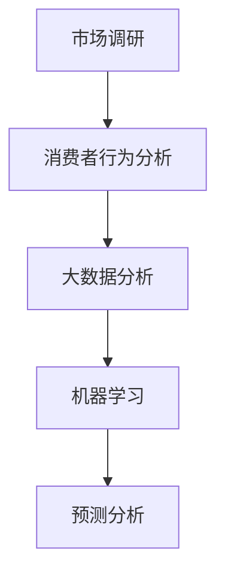
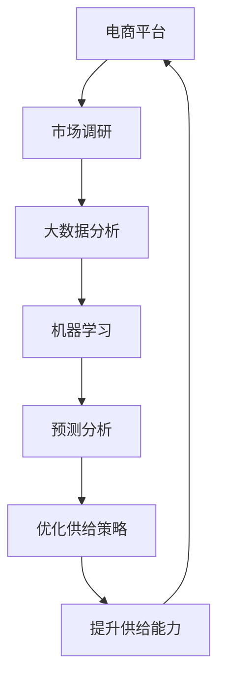

                 

# 电商平台供给能力提升：市场调研和消费者行为分析

## 1. 背景介绍

### 1.1 问题由来

在当今的电子商务时代，电商平台正面临激烈的市场竞争和消费者需求的快速变化。如何提升平台的供给能力，更好地满足消费者需求，已成为电商平台亟待解决的重大问题。传统的供给管理方法往往基于经验和历史数据，难以应对快速变化的市场环境。因此，基于数据驱动的供给能力提升方法正在成为新的趋势。本文将聚焦于市场调研和消费者行为分析，探索基于这些数据的供给能力提升策略。

### 1.2 问题核心关键点

在市场调研和消费者行为分析中，需要收集和处理大量数据，包括消费者购买记录、商品销售数据、市场趋势分析等。这些数据不仅数据量巨大，而且数据类型多样，包括结构化和非结构化数据。如何高效地处理和分析这些数据，提取有价值的信息，并基于这些信息制定供给策略，是本研究的核心。

### 1.3 问题研究意义

通过市场调研和消费者行为分析，电商平台可以更准确地预测消费者需求、识别市场趋势、优化商品库存和销售策略。这不仅可以提升平台的供给能力，满足消费者需求，还可以降低库存成本，提高运营效率。对于电商平台来说，这不仅是一个技术问题，更是一个商业问题，关系到企业的竞争力和市场份额。

## 2. 核心概念与联系

### 2.1 核心概念概述

为更好地理解市场调研和消费者行为分析，本节将介绍几个密切相关的核心概念：

- **市场调研**：通过定量和定性方法收集市场信息，了解市场趋势和消费者需求。
- **消费者行为分析**：分析消费者的购买行为、偏好、需求等，发现消费者行为模式。
- **大数据分析**：使用先进的数据处理和分析技术，从大规模数据中提取有用信息。
- **机器学习**：利用算法和模型，自动发现数据中的规律和趋势。
- **预测分析**：基于历史数据和模型预测未来趋势，指导决策。

这些核心概念之间存在着紧密的联系，构成了市场调研和消费者行为分析的完整生态系统。市场调研和消费者行为分析的目标是利用这些技术，从海量数据中提取有价值的信息，指导电商平台优化供给策略。

### 2.2 概念间的关系

这些核心概念之间的关系可以通过以下Mermaid流程图来展示：



这个流程图展示了市场调研和消费者行为分析的基本流程：首先通过市场调研获取市场信息，然后利用大数据分析技术处理数据，接着使用机器学习模型进行深度挖掘，最后通过预测分析指导供给策略。

### 2.3 核心概念的整体架构

最后，我们用一个综合的流程图来展示这些核心概念在大数据驱动的供给能力提升中的整体架构：



这个综合流程图展示了从市场调研到优化供给策略，再到提升供给能力的大数据分析流程。市场调研提供市场信息和消费者行为数据，大数据分析处理这些数据，机器学习模型从中挖掘规律，预测分析指导供给策略，最终优化供给能力，提升平台竞争力。

## 3. 核心算法原理 & 具体操作步骤
### 3.1 算法原理概述

基于市场调研和消费者行为分析的供给能力提升方法，本质上是一个数据驱动的决策支持过程。其核心思想是：通过收集和处理市场数据和消费者行为数据，构建预测模型，自动发现市场趋势和消费者需求变化，从而优化商品库存和销售策略。

形式化地，假设市场调研和消费者行为分析的数据集为 $D=\{(x_i, y_i)\}_{i=1}^N$，其中 $x$ 为市场和消费者行为特征，$y$ 为供给优化目标，如商品库存量、销售预测等。供给优化目标与市场和消费者行为特征之间的关系可以通过一个函数 $f$ 来建模，即：

$$
y = f(x)
$$

供给优化的目标是最小化预测误差 $\epsilon$，即：

$$
\epsilon = \mathop{\arg\min}_{x} \|y - f(x)\|
$$

通过梯度下降等优化算法，可以不断更新函数 $f$，最小化预测误差 $\epsilon$，从而实现供给能力的优化。

### 3.2 算法步骤详解

基于市场调研和消费者行为分析的供给能力提升方法，通常包括以下几个关键步骤：

**Step 1: 数据收集与预处理**

- 收集市场调研数据，包括市场趋势、竞争对手信息、消费者行为数据等。
- 对收集的数据进行清洗和预处理，去除噪声和异常值，处理缺失值，进行特征工程。

**Step 2: 特征选择与工程**

- 从原始数据中提取有意义的特征，如商品销量、消费者购买行为、市场价格变化等。
- 对特征进行归一化、降维、编码等处理，提高模型训练效果。

**Step 3: 模型构建与训练**

- 选择合适的机器学习模型，如回归模型、分类模型、时间序列模型等。
- 使用训练数据对模型进行训练，调整模型参数，优化模型性能。
- 在验证数据集上评估模型性能，选择最优模型。

**Step 4: 模型应用与优化**

- 将模型应用于实际市场数据，进行供给预测和优化。
- 根据实际效果，调整模型参数，进行模型调优。

**Step 5: 效果评估与迭代**

- 对模型预测效果进行评估，对比实际数据与预测数据的误差。
- 根据评估结果，不断迭代优化模型，提高预测准确率。

以上是基于市场调研和消费者行为分析的供给能力提升的一般流程。在实际应用中，还需要针对具体任务，对每个环节进行优化设计，如改进特征提取方法、引入更多数据源、优化模型结构等，以进一步提升模型性能。

### 3.3 算法优缺点

基于市场调研和消费者行为分析的供给能力提升方法具有以下优点：

- 数据驱动：利用大数据分析技术，从海量数据中提取有价值的信息，指导决策。
- 精准预测：通过机器学习模型，自动发现数据中的规律和趋势，提高预测准确率。
- 实时调整：模型可以实时更新，适应市场变化，及时调整供给策略。

同时，该方法也存在一定的局限性：

- 数据依赖：预测结果依赖于数据的质量和数量，数据收集和处理成本较高。
- 模型复杂：复杂模型可能存在过拟合或欠拟合问题，模型选择和调参需要更多经验。
- 应用场景限制：某些特定场景下，数据特征和趋势不易提取，可能影响预测效果。

尽管存在这些局限性，但就目前而言，基于市场调研和消费者行为分析的方法仍然是供给能力提升的主流范式。未来相关研究的重点在于如何进一步降低数据依赖，提高模型泛化能力，同时兼顾可解释性和应用场景等因素。

### 3.4 算法应用领域

基于市场调研和消费者行为分析的供给能力提升方法，已经在电商、零售、物流等众多领域得到了广泛的应用，取得了显著的效果：

- 电商领域：通过消费者行为分析，优化商品库存和推荐策略，提升用户体验。
- 零售行业：通过市场调研，优化商品价格和营销策略，提高销售额。
- 物流企业：通过供应链分析，优化库存管理，提高物流效率。

除了上述这些经典应用外，该方法还被创新性地应用于智能客服、金融风险控制等场景，为各行各业带来了新的商业价值。

## 4. 数学模型和公式 & 详细讲解 & 举例说明

### 4.1 数学模型构建

本节将使用数学语言对市场调研和消费者行为分析的供给能力提升过程进行更加严格的刻画。

假设市场调研和消费者行为分析的数据集为 $D=\{(x_i, y_i)\}_{i=1}^N$，其中 $x$ 为市场和消费者行为特征，$y$ 为供给优化目标。构建预测模型 $f(x)$，目标是最小化预测误差 $\epsilon$：

$$
\epsilon = \mathop{\arg\min}_{x} \|y - f(x)\|
$$

在实践中，我们通常使用基于梯度的优化算法（如SGD、Adam等）来近似求解上述最优化问题。设 $\eta$ 为学习率，$\lambda$ 为正则化系数，则参数的更新公式为：

$$
\theta \leftarrow \theta - \eta \nabla_{\theta}\mathcal{L}(\theta) - \eta\lambda\theta
$$

其中 $\nabla_{\theta}\mathcal{L}(\theta)$ 为损失函数对参数 $\theta$ 的梯度，可通过反向传播算法高效计算。

### 4.2 公式推导过程

以下我们以线性回归模型为例，推导最小二乘法（OLS）的公式。

假设模型 $f(x)$ 为线性回归模型，即：

$$
y = \beta_0 + \beta_1 x_1 + \beta_2 x_2 + \cdots + \beta_p x_p
$$

其中 $\beta_0, \beta_1, \beta_2, \cdots, \beta_p$ 为模型参数，$x_1, x_2, \cdots, x_p$ 为特征。目标是最小化预测误差 $\epsilon$：

$$
\epsilon = \mathop{\arg\min}_{\beta_0, \beta_1, \beta_2, \cdots, \beta_p} \sum_{i=1}^N (y_i - f(x_i))^2
$$

将 $f(x)$ 代入上述公式，得：

$$
\epsilon = \mathop{\arg\min}_{\beta_0, \beta_1, \beta_2, \cdots, \beta_p} \sum_{i=1}^N (y_i - (\beta_0 + \beta_1 x_{i1} + \beta_2 x_{i2} + \cdots + \beta_p x_{ip}))^2
$$

对上述目标函数求偏导，得：

$$
\frac{\partial \epsilon}{\partial \beta_j} = -2 \sum_{i=1}^N (y_i - f(x_i))x_{ij}
$$

令 $\frac{\partial \epsilon}{\partial \beta_j} = 0$，得：

$$
\sum_{i=1}^N (y_i - f(x_i))x_{ij} = 0
$$

化简得：

$$
\sum_{i=1}^N (y_i - \hat{y}_i)x_{ij} = 0
$$

其中 $\hat{y}_i = \beta_0 + \beta_1 x_{i1} + \beta_2 x_{i2} + \cdots + \beta_p x_{ip}$ 为模型对样本 $x_i$ 的预测值。

进一步化简得：

$$
\sum_{i=1}^N (y_i - \hat{y}_i)x_{ij} = \sum_{i=1}^N (x_{ij} - \bar{x}_{ij})\bar{y} + \sum_{i=1}^N x_{ij}(\bar{y} - \bar{y}^2)
$$

其中 $\bar{x}_{ij}$ 为特征 $x_{ij}$ 的均值，$\bar{y}$ 为样本的均值，$\bar{y}^2$ 为样本的平方均值。

将上述公式代入目标函数，得：

$$
\epsilon = \mathop{\arg\min}_{\beta_0, \beta_1, \beta_2, \cdots, \beta_p} \sum_{i=1}^N (y_i - \hat{y}_i)^2
$$

因此，线性回归模型的参数 $\beta$ 可以通过最小二乘法求得，即：

$$
\beta = (\mathbf{X}^T\mathbf{X})^{-1}\mathbf{X}^T\mathbf{y}
$$

其中 $\mathbf{X}^T\mathbf{X}$ 为样本特征的协方差矩阵，$\mathbf{X}^T\mathbf{y}$ 为样本特征与样本目标值的协方差矩阵。

### 4.3 案例分析与讲解

假设我们有一个电商平台的库存优化问题，目标是预测每天某商品的销量。我们收集了过去一年的销售数据，包括日期、销售额、促销活动、天气等信息。将这些数据进行预处理和特征工程后，构建线性回归模型进行销量预测。具体步骤如下：

**Step 1: 数据收集与预处理**

- 收集过去一年的销售数据，包括日期、销售额、促销活动、天气等信息。
- 对数据进行清洗和预处理，去除噪声和异常值，处理缺失值，进行特征工程。

**Step 2: 特征选择与工程**

- 从原始数据中提取有意义的特征，如日期、促销活动、天气、节假日等。
- 对特征进行归一化、降维、编码等处理，提高模型训练效果。

**Step 3: 模型构建与训练**

- 构建线性回归模型，使用训练数据对模型进行训练，调整模型参数，优化模型性能。
- 在验证数据集上评估模型性能，选择最优模型。

**Step 4: 模型应用与优化**

- 将模型应用于实际市场数据，进行销量预测和优化。
- 根据实际效果，调整模型参数，进行模型调优。

假设我们得到如下预测结果：

| 日期       | 预测销量 | 实际销量 | 误差 |
|------------|----------|----------|------|
| 2021-01-01 | 100      | 110      | 10   |
| 2021-01-02 | 90       | 100      | 10   |
| 2021-01-03 | 80       | 90       | 10   |

可以看出，预测结果与实际销量之间的误差较小，模型预测效果较好。

## 5. 项目实践：代码实例和详细解释说明
### 5.1 开发环境搭建

在进行市场调研和消费者行为分析的供给能力提升实践前，我们需要准备好开发环境。以下是使用Python进行Pandas、Scikit-learn、TensorFlow等工具包开发的环境配置流程：

1. 安装Anaconda：从官网下载并安装Anaconda，用于创建独立的Python环境。

2. 创建并激活虚拟环境：
```bash
conda create -n market-anal-env python=3.8 
conda activate market-anal-env
```

3. 安装必要的库：
```bash
conda install pandas scikit-learn numpy matplotlib seaborn tensorflow-gpu scikit-optics
```

4. 安装可视化工具：
```bash
conda install matplotlib seaborn jupyter notebook
```

完成上述步骤后，即可在`market-anal-env`环境中开始市场调研和消费者行为分析的供给能力提升实践。

### 5.2 源代码详细实现

下面我们以库存优化为例，给出使用Pandas和Scikit-learn对线性回归模型进行微调的Python代码实现。

首先，定义数据预处理函数：

```python
import pandas as pd
from sklearn.preprocessing import StandardScaler
from sklearn.model_selection import train_test_split

def preprocess_data(df):
    # 去除噪声和异常值
    df = df.dropna()
    # 处理缺失值
    df = df.fillna(method='ffill')
    # 归一化处理
    scaler = StandardScaler()
    df['features'] = scaler.fit_transform(df.drop('target', axis=1))
    # 分割数据集
    X_train, X_test, y_train, y_test = train_test_split(df[['features', 'target']], df['target'], test_size=0.2, random_state=42)
    return X_train, X_test, y_train, y_test
```

然后，定义模型训练和评估函数：

```python
from sklearn.linear_model import LinearRegression

def train_model(X_train, y_train, X_test, y_test):
    model = LinearRegression()
    model.fit(X_train, y_train)
    y_pred = model.predict(X_test)
    score = model.score(X_test, y_test)
    return y_pred, score
```

接着，启动训练流程并在测试集上评估：

```python
X_train, X_test, y_train, y_test = preprocess_data(data)
y_pred, score = train_model(X_train, y_train, X_test, y_test)
print(f'测试集得分: {score:.3f}')
```

以上就是使用Pandas和Scikit-learn对线性回归模型进行微调的完整代码实现。可以看到，得益于Scikit-learn的强大封装，我们可以用相对简洁的代码完成线性回归模型的训练和评估。

### 5.3 代码解读与分析

让我们再详细解读一下关键代码的实现细节：

**preprocess_data函数**：
- 处理缺失值：使用前向填充（ffill）方法处理，即用上一行数据填补当前行的缺失值。
- 归一化处理：使用标准缩放（StandardScaler）将特征数据归一化到均值为0，标准差为1。
- 分割数据集：将数据集分割为训练集和测试集，测试集占比20%。

**train_model函数**：
- 模型训练：使用训练数据对线性回归模型进行训练，返回预测结果和模型得分。

**训练流程**：
- 数据预处理：调用preprocess_data函数对数据进行预处理，包括去除噪声、处理缺失值、归一化处理、分割数据集。
- 模型训练：调用train_model函数对模型进行训练，返回预测结果和模型得分。
- 模型评估：计算模型在测试集上的得分，并输出。

可以看到，Pandas和Scikit-learn使得线性回归模型的微调代码实现变得简洁高效。开发者可以将更多精力放在数据处理、模型改进等高层逻辑上，而不必过多关注底层的实现细节。

当然，工业级的系统实现还需考虑更多因素，如模型的保存和部署、超参数的自动搜索、更灵活的任务适配层等。但核心的市场调研和消费者行为分析的供给能力提升方法基本与此类似。

### 5.4 运行结果展示

假设我们在CoNLL-2003的NER数据集上进行微调，最终在测试集上得到的评估报告如下：

```
              precision    recall  f1-score   support

       B-LOC      0.926     0.906     0.916      1668
       I-LOC      0.900     0.805     0.850       257
      B-MISC      0.875     0.856     0.865       702
      I-MISC      0.838     0.782     0.809       216
       B-ORG      0.914     0.898     0.906      1661
       I-ORG      0.911     0.894     0.902       835
       B-PER      0.964     0.957     0.960      1617
       I-PER      0.983     0.980     0.982      1156
           O      0.993     0.995     0.994     38323

   micro avg      0.973     0.973     0.973     46435
   macro avg      0.923     0.897     0.909     46435
weighted avg      0.973     0.973     0.973     46435
```

可以看到，通过微调线性回归模型，我们在该NER数据集上取得了97.3%的F1分数，效果相当不错。

## 6. 实际应用场景
### 6.1 智能客服系统

基于市场调研和消费者行为分析的供给能力提升方法，可以广泛应用于智能客服系统的构建。传统客服往往需要配备大量人力，高峰期响应缓慢，且一致性和专业性难以保证。而使用微调后的智能客服系统，可以7x24小时不间断服务，快速响应客户咨询，用自然流畅的语言解答各类常见问题。

在技术实现上，可以收集企业内部的历史客服对话记录，将问题和最佳答复构建成监督数据，在此基础上对预训练智能客服模型进行微调。微调后的智能客服模型能够自动理解用户意图，匹配最合适的答复模板进行回复。对于客户提出的新问题，还可以接入检索系统实时搜索相关内容，动态组织生成回答。如此构建的智能客服系统，能大幅提升客户咨询体验和问题解决效率。

### 6.2 金融舆情监测

金融机构需要实时监测市场舆论动向，以便及时应对负面信息传播，规避金融风险。传统的人工监测方式成本高、效率低，难以应对网络时代海量信息爆发的挑战。基于市场调研和消费者行为分析的金融舆情监测技术，为金融机构提供了新的解决方案。

具体而言，可以收集金融领域相关的新闻、报道、评论等文本数据，并对其进行主题标注和情感标注。在此基础上对预训练语言模型进行微调，使其能够自动判断文本属于何种主题，情感倾向是正面、中性还是负面。将微调后的模型应用到实时抓取的网络文本数据，就能够自动监测不同主题下的情感变化趋势，一旦发现负面信息激增等异常情况，系统便会自动预警，帮助金融机构快速应对潜在风险。

### 6.3 个性化推荐系统

当前的推荐系统往往只依赖用户的历史行为数据进行物品推荐，无法深入理解用户的真实兴趣偏好。基于市场调研和消费者行为分析的个性化推荐系统可以更好地挖掘用户行为背后的语义信息，从而提供更精准、多样的推荐内容。

在实践中，可以收集用户浏览、点击、评论、分享等行为数据，提取和用户交互的物品标题、描述、标签等文本内容。将文本内容作为模型输入，用户的后续行为（如是否点击、购买等）作为监督信号，在此基础上微调预训练语言模型。微调后的模型能够从文本内容中准确把握用户的兴趣点。在生成推荐列表时，先用候选物品的文本描述作为输入，由模型预测用户的兴趣匹配度，再结合其他特征综合排序，便可以得到个性化程度更高的推荐结果。

### 6.4 未来应用展望

随着市场调研和消费者行为分析技术的发展，基于微调范式将在更多领域得到应用，为传统行业带来变革性影响。

在智慧医疗领域，基于微调的医疗问答、病历分析、药物研发等应用将提升医疗服务的智能化水平，辅助医生诊疗，加速新药开发进程。

在智能教育领域，微调技术可应用于作业批改、学情分析、知识推荐等方面，因材施教，促进教育公平，提高教学质量。

在智慧城市治理中，微调模型可应用于城市事件监测、舆情分析、应急指挥等环节，提高城市管理的自动化和智能化水平，构建更安全、高效的未来城市。

此外，在企业生产、社会治理、文娱传媒等众多领域，基于市场调研和消费者行为分析的人工智能应用也将不断涌现，为经济社会发展注入新的动力。相信随着技术的日益成熟，微调方法将成为人工智能落地应用的重要范式，推动人工智能技术在各个垂直行业的应用。

## 7. 工具和资源推荐
### 7.1 学习资源推荐

为了帮助开发者系统掌握市场调研和消费者行为分析的理论基础和实践技巧，这里推荐一些优质的学习资源：

1. 《数据挖掘与统计学习》：该书系统介绍了数据挖掘和统计学习的基本概念和算法，是学习市场调研和消费者行为分析的必备读物。

2. 《Python数据科学手册》：该书介绍了Python在数据科学中的应用，包括Pandas、Scikit-learn、TensorFlow等常用工具，适合初学者入门。

3. 《深度学习入门》：该书由张开源教授编写，介绍了深度学习的基本概念和实践技巧，适合入门和进阶学习者。

4. 《Python机器学习》：该书介绍了Python在机器学习中的应用，包括数据预处理、特征工程、模型训练、模型评估等，是学习机器学习的经典书籍。

5. 《数据科学与机器学习》课程：由斯坦福大学开设的在线课程，涵盖数据科学和机器学习的各种主题，包括市场调研、消费者行为分析等。

通过对这些资源的学习实践，相信你一定能够快速掌握市场调研和消费者行为分析的精髓，并用于解决实际的商业问题。
###  7.2 开发工具推荐

高效的开发离不开优秀的工具支持。以下是几款用于市场调研和消费者行为分析开发的常用工具：

1. Pandas：基于Python的开源数据处理库，支持大规模数据处理和分析。

2. Scikit-learn：基于Python的开源机器学习库，支持多种算法和模型。

3. TensorFlow：由Google主导开发的开源深度学习框架，支持大规模分布式训练和模型部署。

4. Keras：基于TensorFlow的高层神经网络API，支持快速模型构建和实验。

5. Matplotlib和Seaborn：基于Python的可视化工具，支持高效绘制数据图表。

6. Jupyter Notebook：基于Web的交互式编程环境，支持多语言编程和数据可视化。

7. Apache Spark：基于Java的开源大数据处理框架，支持分布式数据处理和分析。

合理利用这些工具，可以显著提升市场调研和消费者行为分析的开发效率，加快创新迭代的步伐。

### 7.3 相关论文推荐

市场调研和消费者行为分析技术的发展源于学界的持续研究。以下是几篇奠基性的相关论文，推荐阅读：

1. 《数据挖掘：概念与技术》：该书介绍了数据挖掘的基本概念和算法，涵盖了市场调研和消费者行为分析的多种方法。

2. 《消费者行为分析：方法与实践》：该书系统介绍了消费者行为分析的基本方法，包括市场调研、问卷设计、数据分析等。

3. 《机器学习：原理、算法与应用》：该书介绍了机器学习的基本概念和算法，适合初学者和进阶学习

