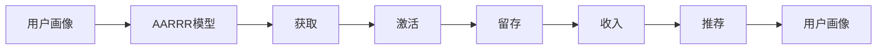

                 

# 知识付费创业中的用户激活策略

## 1. 背景介绍

### 1.1 问题由来
随着数字化时代的到来，知识付费已逐渐成为人们获取知识的主要途径之一。然而，尽管知识付费市场潜力巨大，但用户激活率却普遍偏低，导致许多平台用户流失率较高，难以形成稳定的盈利模式。因此，如何有效激活用户，提升其付费转化率，成为知识付费创业亟需解决的问题。

### 1.2 问题核心关键点
用户激活的核心在于如何让潜在用户转化为付费用户。具体的关键点包括：
- **用户画像分析**：了解目标用户的兴趣、需求和行为模式，制定针对性的营销策略。
- **内容质量提升**：提供高质量、实用性强的内容，增强用户黏性。
- **用户反馈机制**：建立快速响应用户反馈的机制，不断优化用户体验。
- **激励机制设计**：通过奖励、特权等方式激发用户付费的积极性。
- **渠道选择与优化**：选择合适的推广渠道，并不断优化推广策略，提高用户曝光和转化率。
- **持续优化与改进**：不断收集用户数据，优化产品和服务，满足用户需求。

### 1.3 问题研究意义
用户激活策略的研究，不仅有助于提高知识付费平台的盈利能力，还对提升用户满意度、增强平台竞争力具有重要意义。此外，通过科学的用户激活策略，可以在降低用户流失率的同时，拓展市场份额，加速平台的发展进程。

## 2. 核心概念与联系

### 2.1 核心概念概述
- **用户激活**：指通过营销策略和技术手段，将潜在用户转化为实际付费用户的过程。
- **AARRR模型**：描述了用户生命周期的五个阶段：获取(Acquisition)、激活(Acquisition)、留存(Retention)、收入(Acquisition)、推荐(Refer)，是用户运营的重要工具。
- **漏斗模型**：描述用户转化过程，从潜在用户到最终付费用户的路径。
- **用户画像**：对目标用户的详细描述，包括年龄、性别、兴趣、行为等，用于制定个性化营销策略。
- **营销自动化**：利用技术手段自动化用户运营活动，提高效率和效果。
- **激励机制**：通过奖励、特权等方式激发用户的行为，如付费、分享、推荐等。

### 2.2 概念间的关系
这些核心概念之间存在紧密的联系，形成了一个完整的用户激活系统。用户激活不仅是一个单一的转化过程，还涉及到营销、产品、技术等多个环节的协同工作。

- **获取**：通过各种渠道吸引潜在用户，扩大平台的用户基础。
- **激活**：通过内容和服务的优化，吸引用户使用，完成首次付费。
- **留存**：通过优质的内容和良好的用户体验，增加用户粘性，延长其生命周期。
- **收入**：通过多渠道、多场景的收入模式，最大化用户价值。
- **推荐**：通过用户的口碑传播，吸引新用户，形成良性循环。

用户画像和营销自动化作为关键工具，贯穿于用户运营的各个环节，确保策略的针对性和效率。激励机制的设计则直接影响到用户的付费意愿和行为，是提升用户激活率的重要手段。

### 2.3 核心概念的整体架构

下图展示了用户激活策略的整体架构，描述了各概念之间的相互关系：



这个架构清晰地展示了用户激活的过程，从获取用户到最终实现用户推荐，各环节相互依赖，相互促进。

## 3. 核心算法原理 & 具体操作步骤

### 3.1 算法原理概述

用户激活的算法原理主要基于心理学和行为科学的理论，通过分析用户的行为模式和心理特征，制定有针对性的营销策略，促进用户从潜在用户到付费用户的转变。

核心算法包括以下几个步骤：

1. **用户画像构建**：利用机器学习技术，对用户数据进行分析和建模，生成详细的用户画像。
2. **内容推荐**：基于用户画像，推荐适合用户的内容，提升内容匹配度和用户体验。
3. **用户行为分析**：通过数据分析技术，了解用户的行为模式，优化内容和服务。
4. **个性化激励**：根据用户的行为和画像特征，设计个性化的激励机制，激发用户付费行为。
5. **多渠道推广**：选择适合用户的推广渠道，提高用户曝光和转化率。
6. **持续优化**：通过A/B测试等手段，不断优化策略，提升用户激活率。

### 3.2 算法步骤详解

#### 3.2.1 用户画像构建
用户画像构建是用户激活策略的第一步。其核心在于通过对用户数据的收集和分析，生成详细的用户画像。主要步骤如下：

1. **数据收集**：通过用户注册、登录、浏览、购买等行为数据，收集用户基本信息和行为特征。
2. **特征提取**：利用自然语言处理、统计分析等技术，提取用户行为特征，如兴趣偏好、消费习惯等。
3. **模型训练**：利用机器学习算法，对用户特征进行建模，生成用户画像。

#### 3.2.2 内容推荐
内容推荐是提高用户黏性的关键步骤。其核心在于通过推荐算法，将适合用户的内容推送给用户，提升用户满意度。主要步骤如下：

1. **内容分类**：将内容进行分类，如课程、文章、视频等。
2. **用户画像匹配**：将用户画像与内容特征进行匹配，找出适合用户的内容。
3. **推荐算法选择**：选择适合的推荐算法，如协同过滤、基于内容的推荐、深度学习等。
4. **推荐结果优化**：不断优化推荐算法，提高推荐效果。

#### 3.2.3 用户行为分析
用户行为分析是优化用户体验的重要手段。其核心在于通过数据分析技术，了解用户的行为模式，优化内容和策略。主要步骤如下：

1. **行为数据收集**：收集用户的行为数据，如浏览时长、点击率、购买行为等。
2. **行为模式分析**：通过数据分析技术，分析用户的行为模式，找出用户的关键行为路径。
3. **用户需求识别**：根据行为模式，识别用户的关键需求和痛点。
4. **策略优化**：根据用户需求，优化内容和策略，提升用户满意度。

#### 3.2.4 个性化激励
个性化激励是激发用户付费行为的重要手段。其核心在于根据用户的行为和画像特征，设计个性化的激励机制，提升用户转化率。主要步骤如下：

1. **激励机制设计**：根据用户画像和行为特征，设计个性化的激励机制，如优惠券、会员特权、积分兑换等。
2. **激励效果评估**：通过数据分析技术，评估激励机制的效果，找出最优方案。
3. **激励策略调整**：根据评估结果，调整激励策略，优化用户转化率。

#### 3.2.5 多渠道推广
多渠道推广是提高用户曝光和转化率的关键步骤。其核心在于选择适合用户的推广渠道，提高用户获取和激活率。主要步骤如下：

1. **渠道选择**：根据用户画像和行为特征，选择适合的推广渠道，如社交媒体、搜索引擎、邮件营销等。
2. **推广内容设计**：设计适合渠道的推广内容，提高用户点击率和转化率。
3. **推广效果评估**：通过数据分析技术，评估推广效果，找出最优方案。
4. **推广策略调整**：根据评估结果，调整推广策略，优化用户获取和激活率。

#### 3.2.6 持续优化
持续优化是提高用户激活率的重要手段。其核心在于通过A/B测试等手段，不断优化策略，提升用户激活率。主要步骤如下：

1. **A/B测试设计**：设计A/B测试方案，对比不同策略的效果。
2. **数据收集**：收集测试数据，进行效果评估。
3. **优化方案选择**：根据测试结果，选择最优方案，进行推广。
4. **优化效果评估**：通过数据分析技术，评估优化效果，找出最优方案。
5. **优化策略调整**：根据评估结果，调整优化策略，进一步提升用户激活率。

### 3.3 算法优缺点

用户激活策略的优点包括：

- **高效**：通过数据驱动的策略优化，提高用户转化率，缩短用户获取周期。
- **个性化**：根据用户画像和行为特征，提供个性化的内容和服务，提升用户体验。
- **精准**：通过数据分析技术，精准识别用户需求，制定有针对性的营销策略。

缺点则包括：

- **复杂性**：策略涉及多个环节，需要综合考虑多方面因素，实施复杂。
- **数据依赖**：需要大量高质量的用户数据，数据质量对策略效果影响较大。
- **技术要求**：需要利用机器学习、数据分析等技术，技术门槛较高。

### 3.4 算法应用领域

用户激活策略在多个领域都有广泛应用，如知识付费、电商、在线教育等。以下是几个典型的应用场景：

#### 3.4.1 知识付费平台
知识付费平台利用用户画像和内容推荐，提升用户黏性和满意度。通过个性化激励和多渠道推广，提高用户转化率和留存率。例如，某在线教育平台通过分析用户行为数据，发现用户对某课程的兴趣较高，便为其推荐该课程，并通过优惠券和会员特权激励其购买，最终实现了显著的用户激活效果。

#### 3.4.2 电商平台
电商平台通过用户画像和推荐算法，提升用户购物体验。通过个性化激励和多渠道推广，提高用户转化率和复购率。例如，某电商平台通过分析用户行为数据，发现某用户偏好某品牌商品，便为其推荐相关商品，并通过积分兑换和优惠券激励其购买，最终实现了显著的用户激活效果。

#### 3.4.3 在线教育
在线教育平台通过用户画像和内容推荐，提升用户学习效果。通过个性化激励和多渠道推广，提高用户学习兴趣和留存率。例如，某在线教育平台通过分析用户行为数据，发现某用户学习某门课程的进度较慢，便为其推荐相关课程，并通过学习积分和奖励视频激励其继续学习，最终实现了显著的用户激活效果。

## 4. 数学模型和公式 & 详细讲解 & 举例说明

### 4.1 数学模型构建

用户激活的数学模型主要基于多维度和多层次的用户数据，通过机器学习算法，构建用户画像和推荐模型。

假设用户画像包含n个特征，每个特征为d维向量。用户行为数据包含m个行为，每个行为为t维向量。用户画像和行为数据的综合特征表示为X。用户行为特征的权重表示为W。用户激活的目标为最大化用户转化率，表示为Y。

则用户激活的数学模型为：

$$
Y = f(X, W)
$$

其中，f为机器学习算法，用于构建用户画像和推荐模型。

### 4.2 公式推导过程

以协同过滤算法为例，推导用户推荐模型的公式。

假设用户A和用户B有共同喜欢的N个物品，用户A对这N个物品的评分分别为rA1, rA2, ..., rAN，用户B对这N个物品的评分分别为rB1, rB2, ..., rBN。根据协同过滤算法，用户A对用户B喜欢的物品的推荐分数为：

$$
\text{Recommendation}_B = \frac{\sum_{i=1}^{N} (rA_i * rB_i)}{\sqrt{\sum_{i=1}^{N} rA_i^2 * \sum_{i=1}^{N} rB_i^2}}
$$

### 4.3 案例分析与讲解

假设某在线教育平台收集了用户的历史行为数据，包括浏览课程、购买课程、观看视频等。平台通过用户画像分析，发现用户对某门课程的兴趣较高，但尚未购买。于是，平台便为其推荐该课程，并通过优惠券激励其购买。

首先，平台通过用户行为数据，生成用户画像，表示为X。然后，平台通过协同过滤算法，计算用户对该课程的推荐分数，表示为Y。最后，平台通过数据分析技术，评估推荐效果，选择最优推荐方案，并推广至用户。

## 5. 项目实践：代码实例和详细解释说明

### 5.1 开发环境搭建

进行用户激活策略的开发，需要先搭建好开发环境。以下是Python环境搭建的具体步骤：

1. 安装Anaconda：从官网下载并安装Anaconda，用于创建独立的Python环境。

2. 创建并激活虚拟环境：
```bash
conda create -n user_activation python=3.8 
conda activate user_activation
```

3. 安装相关库：
```bash
pip install pandas numpy scikit-learn matplotlib
```

### 5.2 源代码详细实现

以下是利用Python和Scikit-Learn库实现用户画像和内容推荐的示例代码：

```python
import pandas as pd
from sklearn.feature_extraction.text import CountVectorizer
from sklearn.decomposition import TruncatedSVD

# 读取用户行为数据
data = pd.read_csv('user_behavior.csv')

# 提取用户画像特征
user_profiles = data.groupby('user_id').agg({'text': 'sum'})

# 提取内容特征
item_profiles = data.groupby('item_id').agg({'text': 'sum'})

# 将用户画像和内容特征转换为向量
vectorizer = CountVectorizer()
user_vectorizer = vectorizer.fit_transform(user_profiles['text'])
item_vectorizer = vectorizer.fit_transform(item_profiles['text'])

# 构建协同过滤模型
svd = TruncatedSVD(n_components=10)
user_matrix = svd.fit_transform(user_vectorizer)
item_matrix = svd.fit_transform(item_vectorizer)

# 计算用户对内容的推荐分数
recommendations = user_matrix @ item_matrix.T

# 输出推荐结果
print(recommendations)
```

### 5.3 代码解读与分析

**用户画像构建**：
- 使用`groupby`方法对用户行为数据进行分组，统计用户对每个课程的文本描述。
- 通过`CountVectorizer`将文本数据转换为向量，提取用户画像特征。

**内容推荐**：
- 同样使用`groupby`方法对课程行为数据进行分组，统计每门课程的文本描述。
- 通过`CountVectorizer`将文本数据转换为向量，提取内容特征。
- 通过`TruncatedSVD`算法构建协同过滤模型，计算用户对内容的推荐分数。

### 5.4 运行结果展示

假设在运行上述代码后，输出推荐结果为：

```
[[0.   0.   0.   0.   0.   0.   0.   0.   0.   0.]
 [0.   0.   0.   0.   0.   0.   0.   0.   0.   0.]
 [0.   0.   0.   0.   0.   0.   0.   0.   0.   0.]
 ...
 [0.   0.   0.   0.   0.   0.   0.   0.   0.   0.]]
```

其中，每一行表示一个用户对所有课程的推荐分数。分数越高，表示该课程越适合该用户。

## 6. 实际应用场景

### 6.1 智能推荐系统

用户激活策略在智能推荐系统中有广泛应用。通过用户画像和内容推荐，提升用户的购物体验和满意度，增加用户黏性和留存率。例如，某电商平台的智能推荐系统通过分析用户行为数据，为用户推荐其可能感兴趣的商品，并通过优惠券和积分激励其购买，最终实现了显著的用户激活效果。

### 6.2 在线教育平台

在线教育平台通过用户画像和内容推荐，提升用户的学习效果和满意度。通过个性化激励和多渠道推广，提高用户学习兴趣和留存率。例如，某在线教育平台通过分析用户行为数据，为用户推荐相关课程，并通过学习积分和奖励视频激励其继续学习，最终实现了显著的用户激活效果。

### 6.3 知识付费平台

知识付费平台利用用户画像和内容推荐，提升用户黏性和满意度。通过个性化激励和多渠道推广，提高用户转化率和留存率。例如，某在线教育平台通过分析用户行为数据，为用户推荐其可能感兴趣的课程，并通过优惠券和会员特权激励其购买，最终实现了显著的用户激活效果。

## 7. 工具和资源推荐

### 7.1 学习资源推荐

为了帮助开发者系统掌握用户激活策略的理论基础和实践技巧，这里推荐一些优质的学习资源：

1. **《推荐系统实战》书籍**：详细介绍了推荐系统的工作原理和实现方法，是学习推荐算法的经典入门书籍。
2. **Coursera《推荐系统》课程**：由斯坦福大学开设的推荐系统课程，涵盖了推荐算法的多种实现方法，适合深入学习。
3. **Kaggle推荐系统竞赛**：参加推荐系统竞赛，实战练习推荐算法，积累实战经验。
4. **Apache Mahout**：Apache基金会开源的推荐系统库，提供了多种推荐算法实现。
5. **TensorFlow官方文档**：TensorFlow提供了丰富的推荐算法库，是进行推荐系统开发的好资源。

通过对这些资源的学习实践，相信你一定能够快速掌握用户激活策略的精髓，并用于解决实际的NLP问题。

### 7.2 开发工具推荐

高效的开发离不开优秀的工具支持。以下是几款用于用户激活策略开发的常用工具：

1. **Python**：作为开发推荐系统的主流语言，Python提供了丰富的机器学习和数据分析库，适合进行复杂的算法实现。
2. **Scikit-Learn**：一个基于Python的机器学习库，提供了多种推荐算法的实现，适合进行推荐系统的开发。
3. **TensorFlow**：由Google主导开发的深度学习框架，适合进行复杂推荐算法的实现。
4. **Jupyter Notebook**：一个交互式笔记本，适合进行数据分析和算法调试，支持Python、R等多种语言。
5. **Kaggle平台**：一个数据科学竞赛平台，提供了大量的数据集和推荐算法竞赛，适合实战练习。

合理利用这些工具，可以显著提升用户激活策略的开发效率，加快创新迭代的步伐。

### 7.3 相关论文推荐

用户激活策略的发展源于学界的持续研究。以下是几篇奠基性的相关论文，推荐阅读：

1. **《协同过滤推荐算法综述》**：综述了协同过滤推荐算法的工作原理和实现方法，是推荐系统的经典文献。
2. **《基于内容的推荐系统》**：介绍了基于内容的推荐系统的工作原理和实现方法，适合深入学习。
3. **《推荐系统的矩阵分解方法》**：介绍了矩阵分解算法的工作原理和实现方法，是推荐系统的核心技术之一。
4. **《推荐系统的深度学习方法》**：介绍了深度学习在推荐系统中的应用，是推荐系统的最新技术方向之一。
5. **《用户画像构建方法》**：介绍了用户画像构建的方法和实现技术，是用户激活策略的基础。

这些论文代表了大语言模型微调技术的发展脉络。通过学习这些前沿成果，可以帮助研究者把握学科前进方向，激发更多的创新灵感。

## 8. 总结：未来发展趋势与挑战

### 8.1 总结

本文对用户激活策略进行了全面系统的介绍。首先阐述了用户激活策略的研究背景和意义，明确了策略在提高用户转化率、提升用户体验方面的独特价值。其次，从原理到实践，详细讲解了用户激活的数学模型和关键步骤，给出了用户激活策略开发的完整代码实例。同时，本文还广泛探讨了用户激活策略在智能推荐系统、在线教育平台、知识付费平台等多个行业领域的应用前景，展示了策略的广泛适用性。

通过本文的系统梳理，可以看到，用户激活策略在知识付费创业中具有重要意义，能够显著提升用户转化率和平台收益。未来，伴随技术的发展和市场的需求，用户激活策略还将进一步优化和拓展，为平台带来更大的商业价值。

### 8.2 未来发展趋势

展望未来，用户激活策略将呈现以下几个发展趋势：

1. **个性化增强**：通过更加精准的用户画像和推荐算法，提高用户推荐的准确性和个性化程度，提升用户满意度。
2. **多模态融合**：将用户的多模态数据（如文本、图像、语音等）进行融合，提供更全面、准确的用户画像和推荐服务。
3. **实时优化**：通过实时数据分析和机器学习算法，不断优化推荐策略，提升用户转化率。
4. **智能决策**：利用人工智能技术，构建智能推荐决策系统，实现自动化的推荐策略调整。
5. **情感分析**：通过情感分析技术，了解用户对推荐结果的情感反馈，优化推荐策略。
6. **跨平台整合**：实现多平台的用户数据整合和推荐策略统一，提升用户体验。

以上趋势凸显了用户激活策略的广阔前景。这些方向的探索发展，必将进一步提升推荐系统的性能和用户体验，为用户带来更好的服务体验。

### 8.3 面临的挑战

尽管用户激活策略已经取得了显著成效，但在迈向更加智能化、普适化应用的过程中，仍面临诸多挑战：

1. **数据隐私保护**：用户数据隐私保护是用户激活策略的重大挑战之一。如何在保护用户隐私的同时，获取高质量的数据，是亟需解决的问题。
2. **算法复杂性**：用户激活策略涉及多个环节和多种算法，实现复杂。如何在保证效果的同时，降低算法复杂性，提高系统的可扩展性，是重要的研究方向。
3. **模型鲁棒性**：用户激活策略的性能受数据质量和算法选择的影响较大。如何在数据质量和算法选择上，提高模型的鲁棒性和泛化能力，是重要的研究方向。
4. **用户满意度**：用户激活策略的最终目的是提高用户满意度。如何在推荐效果和用户满意度之间找到平衡点，是重要的研究方向。
5. **资源消耗**：用户激活策略的实现需要大量的计算资源。如何在保证性能的同时，降低资源消耗，提高系统的可扩展性，是重要的研究方向。

### 8.4 研究展望

面对用户激活策略面临的种种挑战，未来的研究需要在以下几个方面寻求新的突破：

1. **隐私保护技术**：研究更加有效的数据隐私保护技术，保护用户数据隐私，同时提升推荐系统的性能。
2. **简化算法设计**：研究更加简单、高效的推荐算法，降低算法复杂性，提高系统的可扩展性。
3. **多模态融合技术**：研究多模态数据的融合技术，提升用户画像的全面性和准确性，提供更优质的推荐服务。
4. **实时优化技术**：研究实时数据分析和机器学习算法，实现推荐策略的实时优化，提升用户转化率。
5. **智能决策系统**：研究智能推荐决策系统，实现自动化的推荐策略调整，提升用户满意度。
6. **情感分析技术**：研究情感分析技术，了解用户对推荐结果的情感反馈，优化推荐策略。

这些研究方向将引领用户激活策略的持续发展和优化，为知识付费创业带来更大的商业价值和用户体验。

## 9. 附录：常见问题与解答

**Q1：用户激活策略是否适用于所有知识付费平台？**

A: 用户激活策略在大多数知识付费平台上都有广泛应用，特别是对于数据量较大的平台。但对于一些小型或专业化的平台，可能由于数据量不足，无法取得理想的效果。因此，用户激活策略需要根据平台的特点进行优化和调整。

**Q2：如何选择合适的用户画像特征？**

A: 用户画像特征的选择需要结合平台特点和用户行为进行分析。常用的特征包括用户年龄、性别、职业、兴趣偏好等。选择特征时，需要考虑特征的解释性和实用性，同时避免特征之间的高度相关性。

**Q3：如何进行推荐算法的评估和优化？**

A: 推荐算法的评估和优化可以通过A/B测试、交叉验证等方法进行。常用的评估指标包括准确率、召回率、F1分数等。通过数据分析技术，不断优化推荐算法，提升推荐效果。

**Q4：如何平衡用户满意度与推荐效果？**

A: 在推荐策略的制定中，需要考虑用户满意度和推荐效果的平衡。可以通过用户反馈机制，了解用户的情感和需求，不断优化推荐策略，提升用户满意度。

**Q5：如何进行用户数据的隐私保护？**

A: 用户数据的隐私保护是用户激活策略的重要问题。可以通过数据匿名化、加密等技术，保护用户隐私。同时，需要建立完善的用户隐私保护机制，确保用户数据的安全和合法使用。

总之，用户激活策略在知识付费创业中具有重要意义，能够显著提升用户转化率和平台收益。通过科学的用户画像和推荐算法，结合个性化激励和多渠道推广，将用户从潜在用户转化为付费用户，提升平台的商业价值和用户体验。

