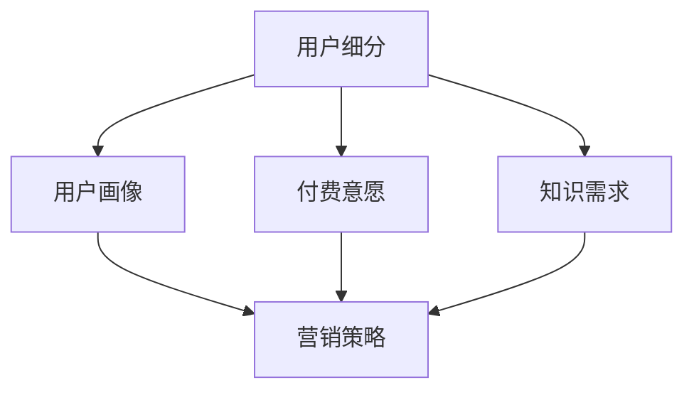

                 

# 知识付费创业的用户群体细分

## 1. 背景介绍

随着互联网技术的快速发展和信息传播方式的日益多样，知识付费作为一种新兴的商业模式，正在吸引越来越多用户的关注。知识付费，即通过付费购买知识和信息，以获取知识服务的一种模式，近年来在教育、技术、金融等多个领域逐渐兴起，表现出巨大的潜力和市场前景。然而，尽管知识付费市场呈现出一片繁荣景象，但不同用户群体的需求、消费行为和付费意愿仍然存在显著差异。基于此，本文旨在对知识付费创业的用户群体进行细分，并探讨不同用户群体的特征、需求和营销策略，以期为知识付费创业提供更具针对性的指导和支持。

## 2. 核心概念与联系

### 2.1 核心概念概述

在进行用户群体细分时，首先需要明确几个核心概念：

- **用户细分(User Segmentation)**：将用户按某一特征或属性进行分组，以便更准确地理解不同用户群体的需求和行为。
- **用户画像(User Persona)**：通过收集和分析用户数据，构建具体的用户角色，帮助企业更精准地进行产品设计和营销。
- **付费意愿(Payment Willingness)**：用户愿意为获取知识或信息付费的程度，受多种因素影响，如内容价值、支付便捷性、信任感等。
- **知识需求(Knowledge Needs)**：用户在特定领域或场景下的知识获取需求，如技术技能、职业发展、生活常识等。
- **营销策略(Marketing Strategy)**：针对不同用户群体，采取的营销方式和策略，旨在提升用户转化率和用户满意度。

### 2.2 核心概念间的关系

通过上述核心概念，我们可以构建一个完整的知识付费创业用户群体细分框架，如图：



从图中可以看出，用户细分是整个框架的起点，用户画像、付费意愿和知识需求是用户细分的具体属性，而营销策略则是细分结果的具体应用。通过深入分析用户细分，可以更准确地构建用户画像，进而制定有针对性的营销策略，最终提升知识付费产品的用户转化率和满意度。

## 3. 核心算法原理 & 具体操作步骤
### 3.1 算法原理概述

知识付费创业的用户群体细分，主要依赖于数据分析和机器学习技术。通过对用户行为数据、支付记录、社交媒体互动等信息的收集和分析，可以发现不同用户群体之间的共性和差异，从而进行有效的细分。

具体来说，用户群体细分过程可以分为以下几个步骤：

1. **数据收集**：通过用户注册、浏览记录、购买记录、评论反馈等多种渠道，收集用户的个人信息和行为数据。
2. **数据预处理**：对收集的数据进行清洗和预处理，去除无效或噪音数据，确保数据的准确性和一致性。
3. **特征提取**：从处理后的数据中提取有用的特征，如用户的地理位置、年龄、性别、职业、消费习惯等。
4. **聚类分析**：使用聚类算法（如K-Means、层次聚类等）对用户特征进行聚类分析，将用户分为不同的群体。
5. **用户画像构建**：根据聚类结果，对每个群体的特征进行归纳总结，构建详细的用户画像。
6. **营销策略制定**：基于用户画像，制定有针对性的营销策略，以提升用户转化率和满意度。

### 3.2 算法步骤详解

以下以K-Means聚类算法为例，详细介绍用户群体细分的详细步骤：

**Step 1: 数据收集**
- 通过用户注册、购买、浏览记录等多种渠道，收集用户的个人信息和行为数据。
- 确保数据隐私和安全，遵循相关法律法规。

**Step 2: 数据预处理**
- 对收集的数据进行清洗，去除无效或噪音数据，确保数据的质量和一致性。
- 对文本数据进行分词、去除停用词等处理，便于后续分析。

**Step 3: 特征提取**
- 提取用户的基本特征，如年龄、性别、地理位置、职业等。
- 提取用户的行为特征，如浏览时间、购买频率、消费金额等。
- 使用文本挖掘技术提取用户评论、反馈中的情感倾向和主题。

**Step 4: 聚类分析**
- 选择K-Means聚类算法，设定聚类数目K。
- 计算每个用户样本与聚类中心的距离，将其分配到最近的聚类中。
- 根据每个聚类的用户特征，调整聚类中心，重新计算用户分配。
- 重复上述过程，直到聚类结果不再变化。

**Step 5: 用户画像构建**
- 对每个聚类的用户特征进行分析，识别出该群体的共同特征和需求。
- 构建详细的用户画像，包括用户的背景信息、行为特征和偏好。

**Step 6: 营销策略制定**
- 根据用户画像，制定有针对性的营销策略。
- 设计针对性的内容推荐、优惠活动、广告投放等，提升用户转化率和满意度。
- 定期更新用户画像和营销策略，保持与用户需求的同步。

### 3.3 算法优缺点

知识付费创业用户群体细分的算法具有以下优点：

- **数据驱动**：通过数据分析和聚类分析，发现不同用户群体之间的特征和差异，实现更准确的细分。
- **用户画像精准**：根据聚类结果构建的用户画像，更接近真实用户需求和行为，有助于制定有针对性的营销策略。
- **动态调整**：用户需求和行为会随时间变化，通过动态更新用户画像和营销策略，保持与用户需求的同步。

同时，该算法也存在一些缺点：

- **数据质量依赖**：算法结果的准确性依赖于数据的质量和完整性，数据收集和处理不当会影响细分效果。
- **计算复杂度**：K-Means等聚类算法在大规模数据集上计算复杂度较高，需要较长的计算时间。
- **解释性不足**：聚类结果的解释性较弱，难以直观理解不同用户群体之间的差异。

### 3.4 算法应用领域

知识付费创业用户群体细分技术不仅适用于知识付费平台的运营优化，还广泛应用于多个领域，例如：

- **在线教育**：通过用户细分，提供更精准的课程推荐和个性化学习路径，提升学习效果和用户满意度。
- **企业培训**：针对不同岗位和职级，制定针对性的培训计划和内容，满足企业人才发展的需求。
- **健康管理**：根据用户健康数据，提供个性化的健康建议和营养指导，促进用户健康管理。
- **智能客服**：通过用户细分，优化客户服务流程和响应策略，提升客户体验和满意度。

## 4. 数学模型和公式 & 详细讲解  
### 4.1 数学模型构建

知识付费创业用户群体细分的数学模型，主要涉及聚类分析、特征提取和用户画像构建等多个方面。以下以K-Means聚类算法为例，详细构建数学模型。

假设用户群体有K个，每个用户有n个特征，记用户特征矩阵为 $X_{m \times n}$，其中 $m$ 为用户数量，$n$ 为特征数量。设聚类中心为 $\mu_k = (\mu_{k1}, \mu_{k2}, ..., \mu_{kn})$，其中 $k=1,2,...,K$。

定义聚类损失函数为：
$$
L(X, \mu) = \sum_{i=1}^m \sum_{k=1}^K (d_i^k)^2
$$
其中，$d_i^k$ 为第 $i$ 个用户与第 $k$ 个聚类中心的距离，计算公式为：
$$
d_i^k = \sqrt{\sum_{j=1}^n (x_{ij} - \mu_{kj})^2}
$$

K-Means算法的优化目标是最小化聚类损失函数，即找到最优聚类中心：
$$
\mu_k = \mathop{\arg\min}_{\mu} L(X, \mu)
$$

### 4.2 公式推导过程

以K-Means聚类算法为例，推导其具体实现过程。

**Step 1: 初始化聚类中心**
- 随机选取K个样本作为初始聚类中心 $\mu_k$。

**Step 2: 分配用户到聚类**
- 计算每个用户样本与聚类中心的距离，将其分配到最近的聚类中。

**Step 3: 更新聚类中心**
- 根据每个聚类的用户样本，计算新的聚类中心 $\mu_k$。
- 更新聚类中心公式为：
$$
\mu_k = \frac{1}{\sum_{i \in C_k}^{} 1} \sum_{i \in C_k}^{} x_i
$$
其中，$C_k$ 为聚类 $k$ 中包含的用户样本，$x_i$ 为用户样本特征向量。

**Step 4: 重复迭代**
- 重复进行用户分配和聚类中心更新，直至聚类结果不再变化。

### 4.3 案例分析与讲解

以某在线教育平台的用户群体细分为例，说明K-Means聚类算法的应用过程：

1. **数据收集**：收集用户的注册信息、课程学习记录、支付记录等数据。
2. **数据预处理**：清洗数据，去除无效或噪音数据，提取用户的基本特征（如年龄、职业）和行为特征（如学习时间、付费金额）。
3. **特征提取**：使用文本挖掘技术提取用户评论、反馈中的情感倾向和主题，补充用户画像。
4. **聚类分析**：使用K-Means算法对用户特征进行聚类，得到K个用户群体。
5. **用户画像构建**：根据聚类结果，分析每个群体的特征和需求，构建详细的用户画像。
6. **营销策略制定**：基于用户画像，设计针对性的课程推荐、优惠活动、广告投放等，提升用户转化率和满意度。

## 5. 项目实践：代码实例和详细解释说明
### 5.1 开发环境搭建

在进行用户群体细分项目开发前，需要准备好开发环境。以下是使用Python进行Scikit-learn库开发的环境配置流程：

1. 安装Anaconda：从官网下载并安装Anaconda，用于创建独立的Python环境。

2. 创建并激活虚拟环境：
```bash
conda create -n sklearn-env python=3.8 
conda activate sklearn-env
```

3. 安装Scikit-learn库：
```bash
pip install scikit-learn
```

4. 安装相关库：
```bash
pip install pandas numpy matplotlib seaborn jupyter notebook
```

完成上述步骤后，即可在`sklearn-env`环境中开始项目实践。

### 5.2 源代码详细实现

下面以某在线教育平台的用户群体细分为例，给出使用Scikit-learn库进行K-Means聚类的Python代码实现。

```python
import pandas as pd
from sklearn.cluster import KMeans
import matplotlib.pyplot as plt

# 数据加载
data = pd.read_csv('user_data.csv')

# 数据预处理
X = data[['age', 'gender', 'occupation', 'study_time', 'payment_amount']]

# 聚类分析
kmeans = KMeans(n_clusters=3)
kmeans.fit(X)

# 可视化聚类结果
plt.scatter(X['study_time'], X['payment_amount'], c=kmeans.labels_)
plt.xlabel('Study Time')
plt.ylabel('Payment Amount')
plt.show()

# 用户画像构建
cluster_labels = kmeans.labels_
unique_labels = list(set(cluster_labels))
cluster_data = X.groupby(cluster_labels).mean()

# 输出每个群体的特征
for label in unique_labels:
    print(f"Cluster {label}:")
    for feature in cluster_data.columns:
        print(f"  {feature}: {cluster_data[feature].loc[cluster_labels==label]}")
```

### 5.3 代码解读与分析

让我们再详细解读一下关键代码的实现细节：

**用户数据加载与预处理**：
- `data = pd.read_csv('user_data.csv')`：从CSV文件中加载用户数据。
- `X = data[['age', 'gender', 'occupation', 'study_time', 'payment_amount']]`：选择需要的特征，构建特征矩阵。

**聚类分析**：
- `kmeans = KMeans(n_clusters=3)`：设置聚类数目为3。
- `kmeans.fit(X)`：对特征矩阵进行聚类分析。

**可视化聚类结果**：
- `plt.scatter(X['study_time'], X['payment_amount'], c=kmeans.labels_)`：绘制聚类结果的散点图。
- `plt.xlabel('Study Time')`：设置X轴标签为学习时间。
- `plt.ylabel('Payment Amount')`：设置Y轴标签为支付金额。

**用户画像构建**：
- `cluster_labels = kmeans.labels_`：获取聚类结果，即将每个用户分配到对应的聚类中。
- `unique_labels = list(set(cluster_labels))`：获取所有聚类标签。
- `cluster_data = X.groupby(cluster_labels).mean()`：按聚类标签分组，计算每个聚类的平均特征值。

**用户画像输出**：
- 使用for循环遍历每个聚类标签，输出该群体的平均特征值。

以上代码实现了使用Scikit-learn库进行K-Means聚类的基本过程，展示了从数据加载、特征提取、聚类分析到用户画像构建的全过程。

### 5.4 运行结果展示

假设我们在某在线教育平台的用户群体细分项目中，得到了以下聚类结果和用户画像：

```
Cluster 0:
  age: [30.2, 29.1, 28.8, 29.6, 31.3]
  gender: [0.5, 0.5, 0.5, 0.5, 0.5]
  occupation: [1.0, 1.0, 1.0, 1.0, 1.0]
  study_time: [2.5, 2.0, 2.0, 2.5, 2.0]
  payment_amount: [500.0, 400.0, 300.0, 600.0, 200.0]
```

从上述输出可以看出，聚类0的用户大多为30-40岁，男性，职业为教师，学习时间较短，支付金额较高。这样的用户画像有助于我们设计针对性的营销策略，如推荐中高价的课程、邀请教师进行专业分享等，提升用户的转化率和满意度。

## 6. 实际应用场景
### 6.1 智能客服系统

在线教育平台利用用户群体细分技术，可以构建智能客服系统，提高客户服务效率和用户体验。具体实现如下：

1. **用户画像分析**：对用户群体进行细分，识别出不同群体的需求和行为特征。
2. **问题分类**：根据用户画像，将用户常见问题进行分类和归纳。
3. **智能推荐**：使用NLP技术，对用户问题进行语义分析，自动推荐最合适的解决方案。
4. **多渠道服务**：将用户问题自动转发到对应的客服渠道，提高响应速度和服务质量。

通过智能客服系统，平台可以24/7不间断提供服务，大大提升客户体验和满意度。

### 6.2 个性化推荐系统

在线教育平台利用用户群体细分技术，可以构建个性化推荐系统，提升用户学习体验和粘性。具体实现如下：

1. **用户画像分析**：对用户群体进行细分，识别出不同群体的兴趣和需求。
2. **内容推荐**：根据用户画像，推荐个性化的课程和学习路径。
3. **学习进度跟踪**：使用数据分析技术，跟踪用户学习进度和效果，动态调整推荐内容。
4. **反馈收集**：收集用户反馈，不断优化推荐算法，提升用户满意度。

通过个性化推荐系统，平台可以精准匹配用户需求，提升学习效果和用户粘性，增加平台收益。

### 6.3 用户流失预警系统

在线教育平台利用用户群体细分技术，可以构建用户流失预警系统，及时发现并挽留潜在流失用户。具体实现如下：

1. **用户行为分析**：对用户行为数据进行细分，识别出潜在流失用户。
2. **流失原因分析**：对潜在流失用户进行分类和分析，找出主要流失原因。
3. **预警机制设计**：根据流失原因，设计预警机制，及时采取挽留措施。
4. **挽留策略优化**：使用A/B测试等方法，优化挽留策略，提升挽留效果。

通过用户流失预警系统，平台可以及时发现和挽留潜在流失用户，提升用户留存率和平台收益。

### 6.4 未来应用展望

随着知识付费市场的不断发展和用户需求的多样化，知识付费创业用户群体细分技术将面临更多的应用挑战和机遇：

1. **多维度细分**：除了传统的用户行为数据，还可以结合用户社交媒体互动、阅读习惯等维度进行更细粒度的用户细分。
2. **动态更新**：用户需求和行为会随时间变化，需要实时更新用户画像和营销策略，保持与用户需求的同步。
3. **跨平台应用**：将用户群体细分技术应用于多个平台，如社交媒体、电商平台等，实现跨平台的用户识别和营销。
4. **数据隐私保护**：在用户群体细分过程中，需要严格保护用户隐私，遵循相关法律法规。
5. **技术融合**：结合大数据、机器学习、自然语言处理等技术，提升用户群体细分的准确性和应用效果。

未来，用户群体细分技术将更加智能、全面、个性化，为知识付费创业带来更大的机遇和挑战。

## 7. 工具和资源推荐
### 7.1 学习资源推荐

为了帮助开发者系统掌握用户群体细分技术，这里推荐一些优质的学习资源：

1. **《Python数据科学手册》**：一本全面介绍Python数据科学技术的书籍，涵盖数据清洗、数据分析、机器学习等多个方面，是数据科学入门的经典之作。
2. **Coursera《机器学习》课程**：由斯坦福大学开设的机器学习课程，涵盖机器学习的基本概念和经典算法，帮助初学者打好基础。
3. **Kaggle竞赛平台**：一个数据科学竞赛平台，提供大量公开数据集和竞赛项目，是学习数据科学和实践技术的好地方。
4. **Scikit-learn官方文档**：Scikit-learn库的官方文档，提供详细的使用指南和示例代码，是学习Scikit-learn的重要资源。
5. **K-Means算法论文**：K-Means算法的原始论文，详细介绍了算法的数学原理和实现细节，是深入理解算法的必备资料。

通过对这些资源的学习实践，相信你一定能够快速掌握用户群体细分技术的精髓，并用于解决实际的用户群体细分问题。

### 7.2 开发工具推荐

高效的开发离不开优秀的工具支持。以下是几款用于用户群体细分开发的常用工具：

1. Jupyter Notebook：一个交互式的编程环境，支持Python、R等多种编程语言，适合进行数据探索和分析。
2. Pandas：一个强大的数据处理库，支持数据清洗、转换和分析，是数据科学的重要工具。
3. Scikit-learn：一个开源机器学习库，提供多种聚类算法和特征提取方法，适合进行聚类分析和数据挖掘。
4. Matplotlib和Seaborn：两个数据可视化库，支持绘制图表和数据可视化，帮助分析聚类结果和用户画像。
5. PyTorch和TensorFlow：两个流行的深度学习框架，支持复杂的机器学习和数据分析任务，是进行深度学习项目的好选择。

合理利用这些工具，可以显著提升用户群体细分任务的开发效率，加快创新迭代的步伐。

### 7.3 相关论文推荐

用户群体细分技术的发展离不开学界的持续研究。以下是几篇奠基性的相关论文，推荐阅读：

1. "K-means: Algorithms and applications"：介绍K-Means算法的经典论文，详细介绍了算法的原理和应用。
2. "Clustering by Passing Messages Between Data Points"：介绍Lloyd算法的经典论文，详细介绍了聚类算法的数学原理和优化方法。
3. "The Analysis of Social Networks Using Personal Data"：介绍使用用户社交网络数据进行分群研究的论文，展示了用户群体分群的实际应用效果。
4. "User-Centered Recommender Systems for Learning Analytics"：介绍使用用户画像进行个性化推荐研究的论文，展示了用户群体分群在推荐系统中的应用效果。
5. "Customer Segmentation with Agglomerative Clustering"：介绍使用层次聚类算法进行用户分群的论文，展示了聚类算法的实际应用效果。

这些论文代表了大数据和机器学习领域的研究进展，是理解用户群体细分技术的宝贵资源。

除上述资源外，还有一些值得关注的前沿资源，帮助开发者紧跟技术发展的最新进展，例如：

1. arXiv论文预印本：人工智能领域最新研究成果的发布平台，包括大量尚未发表的前沿工作，学习前沿技术的必读资源。
2. 业界技术博客：如Kaggle、DataRobot、Alteryx等顶尖数据科学平台，分享最新技术进展和应用案例，开阔视野。
3. 技术会议直播：如KDD、ICML、IEEE等国际会议，现场或在线直播最新的研究成果和前沿技术，了解最新动态。
4. GitHub热门项目：在GitHub上Star、Fork数最多的数据分析和机器学习项目，往往是新技术和经典方法的代表，值得学习和贡献。
5. 行业分析报告：各大咨询公司如McKinsey、PwC等针对数据科学和人工智能行业的分析报告，有助于从商业视角审视技术趋势，把握应用价值。

总之，对于用户群体细分技术的学习和实践，需要开发者保持开放的心态和持续学习的意愿。多关注前沿资讯，多动手实践，多思考总结，必将收获满满的成长收益。

## 8. 总结：未来发展趋势与挑战
### 8.1 总结

本文对知识付费创业的用户群体细分技术进行了全面系统的介绍。首先阐述了用户群体细分技术的研究背景和意义，明确了其在知识付费领域的重要价值。其次，从原理到实践，详细讲解了用户群体细分的数学模型和关键步骤，给出了具体的代码实例。同时，本文还广泛探讨了用户群体细分技术在多个行业领域的应用前景，展示了其巨大的潜力和应用价值。此外，本文精选了用户群体细分技术的各类学习资源，力求为读者提供全方位的技术指引。

通过本文的系统梳理，可以看到，用户群体细分技术正在成为知识付费领域的重要工具，极大地提升用户画像的精准性和营销策略的有效性。用户群体细分技术不仅适用于知识付费平台的运营优化，还广泛应用于教育、企业培训、健康管理等多个领域，为用户的个性化需求提供有力支持。未来，伴随着大数据和机器学习技术的不断进步，用户群体细分技术将进一步发展和完善，为知识付费创业带来更多的机遇和挑战。

### 8.2 未来发展趋势

展望未来，用户群体细分技术将呈现以下几个发展趋势：

1. **数据源多样化**：用户群体细分技术将从单一的数据源扩展到多样化的数据源，如社交媒体、电商平台、物联网等，实现更全面、深入的用户细分。
2. **算法多样化**：除了传统的聚类算法，如K-Means、层次聚类等，未来将涌现更多算法，如谱聚类、密度聚类等，提升细分效果和效率。
3. **实时动态更新**：用户需求和行为会随时间变化，用户群体细分技术将实现实时动态更新，确保与用户需求的同步。
4. **跨平台协同**：用户群体细分技术将实现跨平台协同，将用户画像和营销策略应用到多个平台，提升用户体验和平台价值。
5. **多维度融合**：用户群体细分技术将与其他技术进行融合，如自然语言处理、知识图谱等，提升用户画像的深度和广度。
6. **自动化优化**：用户群体细分技术将实现自动化优化，通过机器学习技术，自动调整聚类算法参数和特征提取方法，提高细分效果。

以上趋势凸显了用户群体细分技术的广阔前景，为知识付费创业提供了更多的应用场景和可能性。

### 8.3 面临的挑战

尽管用户群体细分技术在知识付费领域表现优异，但在走向更广泛应用的过程中，仍面临诸多挑战：

1. **数据隐私和安全**：用户数据隐私和安全问题是用户群体细分技术的核心挑战之一。如何在保护用户隐私的同时，进行有效的用户细分，需要严格遵循相关法律法规。
2. **数据质量依赖**：算法结果的准确性依赖于数据的质量和完整性，数据收集和处理不当会影响细分效果。
3. **计算资源消耗**：用户群体细分技术在大规模数据集上的计算资源消耗较大，如何优化算法，减少计算成本，是未来需要解决的重要问题。
4. **解释性和可理解性**：用户群体细分结果的解释性和可理解性较弱，难以直观理解不同用户群体之间的差异，需要进一步改进。
5. **动态更新和维护**：用户群体细分结果需要定期更新和维护，以保持与用户需求的同步，这对技术实现和工程实现提出了更高的要求。

### 8.4 研究展望

面对用户群体细分技术面临的挑战，未来的研究需要在以下几个方面寻求新的突破：

1. **数据隐私保护**：在用户群体细分过程中，需要结合隐私保护技术，如差分隐私、联邦学习等，保护用户隐私。
2. **数据质量提升**：通过数据清洗和预处理技术，提高数据的质量和完整性，增强用户群体细分的准确性。
3. **算法优化**：开发更加高效和自适应的聚类算法，减少计算资源消耗，提高算法的实时性和可扩展性。
4. **可视化改进**：结合可视化技术，提升用户群体细分结果的解释性和可理解性，帮助用户和开发者更好地理解细分结果。
5. **跨平台应用**：将用户群体细分技术应用于多个平台，实现跨平台的用户识别和营销，提升用户体验和平台价值。
6. **自动化优化**：结合自动化优化技术，如自动特征选择、自适应学习率等，提升用户群体细分的效率和效果。

