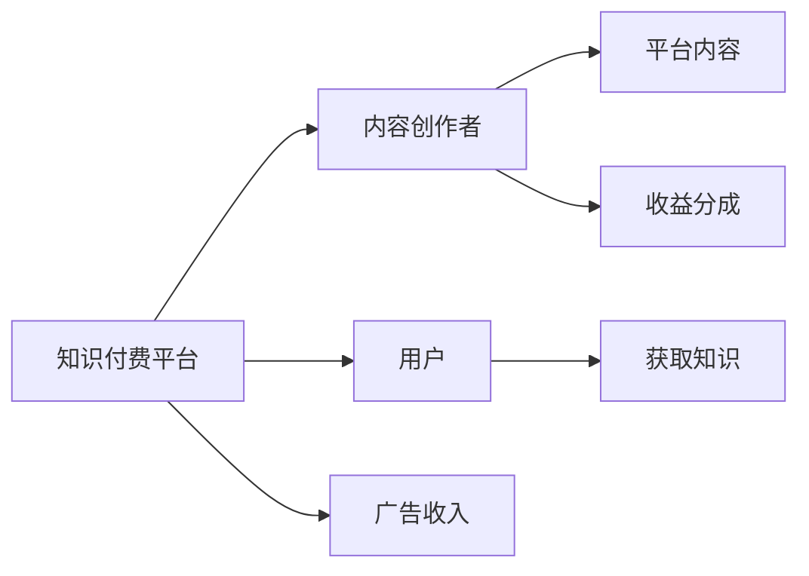

                 

# 知识经济时代下的知识付费创新商业模式运营

## 1. 背景介绍

随着互联网的普及和信息技术的发展，知识付费逐渐成为知识经济时代的一个重要商业模式。通过在线平台向用户提供高质量的知识内容和专业服务，知识付费不仅满足了人们的学习需求，还为内容创作者提供了稳定的收入来源，促进了知识的传播和应用。然而，传统的知识付费模式面临着诸多挑战，如内容同质化、用户粘性不足、商业模式单一等。为了应对这些挑战，创新的商业模式运营策略显得尤为重要。

### 1.1 知识付费的兴起背景

#### 1.1.1 互联网普及与信息获取成本降低

互联网技术的普及，使得信息获取的成本大大降低。用户可以通过在线搜索、阅读、观看等形式，获取丰富的知识内容，不再受限于传统的书籍、报纸、讲座等形式。互联网打破了时间和空间的限制，使得知识传播更加高效和便捷。

#### 1.1.2 用户对知识需求的增加

随着社会的发展，用户对知识的渴求日益增长。无论是个人提升、职业发展，还是休闲娱乐，高质量的知识内容都成为用户关注的焦点。知识付费模式通过提供专业化、系统化的知识服务，满足了用户对知识的多样化需求。

#### 1.1.3 内容创作者的市场机会

互联网技术的快速发展，使得内容创作者有了更多的平台和工具，可以更高效地生产和传播内容。通过知识付费模式，内容创作者可以获得与平台和用户三方共赢的利益分配机制，从而激发更多优秀内容创作。

### 1.2 知识付费的现有挑战

#### 1.2.1 内容同质化问题

随着知识付费平台数量的增加，市场上的内容呈现出同质化的趋势。许多平台提供相似或相同的内容，导致用户的选择难度增加，体验感下降。

#### 1.2.2 用户粘性不足

尽管知识付费市场有巨大的潜力，但用户订阅率和持续支付意愿并不高。用户流失率高，对平台的忠诚度低，导致平台难以实现盈利。

#### 1.2.3 商业模式单一

现有的知识付费模式主要依赖于订阅和购买，缺乏多样化的盈利渠道和用户交互方式，难以应对市场变化和用户需求。

## 2. 核心概念与联系

### 2.1 核心概念概述

在讨论知识付费创新商业模式运营前，首先需要明确一些关键概念：

#### 2.1.1 知识付费平台

知识付费平台是指通过在线形式，为用户提供专业化、系统化的知识内容和服务的平台。平台通常包括内容创作者、用户和广告商三方，通过内容订阅、广告分成等形式实现商业盈利。

#### 2.1.2 内容创作者

内容创作者是指通过平台发布知识内容，向用户提供有价值信息和专业知识的用户。创作者可以是专业人士、学者、行业专家等，通过平台获得收入。

#### 2.1.3 用户

用户是指通过平台获取知识内容的用户。用户通过订阅、购买等方式获得知识内容，通过学习和应用提升自身能力。

### 2.2 核心概念之间的联系

知识付费平台、内容创作者和用户三方之间存在着紧密的联系。平台提供知识内容和服务，创作者生产内容并获取收益，用户通过平台获取知识并提高自身能力。三方之间的良性互动和协作，是知识付费商业模式运营的基础。

通过以下Mermaid流程图，可以更直观地展示这三者之间的联系：



### 2.3 核心概念的整体架构

在知识付费平台架构中，平台、创作者和用户之间存在着紧密的数据流和交互。具体如下：

- 平台采集创作者发布的内容，进行审核、加工、分发。
- 用户通过平台获取知识内容，反馈评价，进行互动。
- 平台根据用户反馈，优化内容推荐算法，提升用户体验。
- 平台根据用户行为数据，分析用户需求，提供定制化服务。
- 平台通过广告收入、收益分成等方式实现盈利。

这种架构确保了知识付费平台的良性运营，促进了知识的传播和应用。

## 3. 核心算法原理 & 具体操作步骤

### 3.1 算法原理概述

知识付费平台的运营涉及多个方面，包括内容推荐、用户留存、收入增长等。通过算法技术，可以实现高效的内容推荐和用户互动，提升用户体验和平台收入。

#### 3.1.1 内容推荐算法

内容推荐算法是指通过分析用户行为数据，推荐与用户兴趣和需求相匹配的知识内容。常用的推荐算法包括协同过滤、基于内容的推荐、混合推荐等。

#### 3.1.2 用户留存算法

用户留存算法是指通过分析用户行为数据，优化平台设计，提升用户满意度和粘性。常用的留存算法包括流失预测、用户行为分析、个性化推荐等。

#### 3.1.3 收入增长算法

收入增长算法是指通过分析用户行为数据，挖掘新的盈利渠道和增值服务。常用的增长算法包括用户生命周期价值分析、收入预测、交叉销售等。

### 3.2 算法步骤详解

以下将详细介绍三种算法的操作步骤。

#### 3.2.1 内容推荐算法

1. **数据采集与预处理**：收集用户行为数据，包括浏览、收藏、评论、购买等行为，进行数据清洗和预处理。
2. **特征提取**：从用户行为数据中提取特征，如用户兴趣、内容属性、用户评价等。
3. **模型训练**：选择适合的推荐算法，如协同过滤、基于内容的推荐等，训练模型并优化参数。
4. **推荐结果生成**：根据用户行为数据和模型，生成推荐结果。
5. **效果评估**：通过A/B测试等方法，评估推荐算法的准确性和效果，进行迭代优化。

#### 3.2.2 用户留存算法

1. **用户流失预测**：收集用户行为数据，如访问频率、学习时间、购买行为等，建立预测模型，预测用户流失概率。
2. **用户行为分析**：分析用户行为数据，识别流失用户特征，进行分类和聚类。
3. **留存策略设计**：根据用户行为特征，设计留存策略，如个性化推荐、专属优惠等。
4. **策略执行与监控**：执行留存策略，监控用户行为，评估效果并进行优化。

#### 3.2.3 收入增长算法

1. **用户生命周期价值分析**：收集用户行为数据，分析用户生命周期价值，预测未来收益。
2. **收入预测**：根据用户生命周期价值，预测未来收入，制定增长策略。
3. **增值服务挖掘**：通过分析用户行为数据，挖掘新的增值服务机会，如专属内容、定制化服务等。
4. **策略实施与优化**：实施增值服务策略，监控收入增长效果，进行策略优化。

### 3.3 算法优缺点

#### 3.3.1 内容推荐算法的优缺点

**优点**：
- 个性化推荐提升用户体验，提高用户粘性。
- 精准匹配用户需求，提高内容利用率。

**缺点**：
- 数据采集和预处理复杂，对数据质量要求高。
- 模型训练和优化耗时，对计算资源要求高。

#### 3.3.2 用户留存算法的优缺点

**优点**：
- 提前预测用户流失，减少用户流失率。
- 设计个性化留存策略，提升用户满意度。

**缺点**：
- 用户行为数据采集和分析复杂，成本高。
- 策略设计需要结合具体业务，难度大。

#### 3.3.3 收入增长算法的优缺点

**优点**：
- 精准预测用户生命周期价值，制定有效增长策略。
- 挖掘增值服务机会，提升平台收入。

**缺点**：
- 数据采集和分析复杂，对数据质量要求高。
- 策略设计和实施需要结合具体业务，难度大。

### 3.4 算法应用领域

知识付费平台的内容推荐、用户留存和收入增长算法，可以应用于多个领域：

#### 3.4.1 在线教育

在线教育平台通过推荐算法推荐课程、内容，提升用户学习体验。通过留存算法设计个性化学习路径，提高用户粘性。通过收入增长算法挖掘专属内容、定制化服务，提升平台收入。

#### 3.4.2 职业培训

职业培训平台通过推荐算法推荐技能培训课程，提升用户职业技能。通过留存算法设计个性化学习计划，提高用户学习效果。通过收入增长算法提供专属培训方案、职业咨询等服务，提升平台收入。

#### 3.4.3 医疗健康

医疗健康平台通过推荐算法推荐健康知识、健身课程，提升用户健康水平。通过留存算法设计个性化健康计划，提高用户粘性。通过收入增长算法提供专属健康方案、咨询服务，提升平台收入。

## 4. 数学模型和公式 & 详细讲解 & 举例说明

### 4.1 数学模型构建

#### 4.1.1 内容推荐模型

设用户为$U$，内容为$I$，用户对内容的评分$R_{ui}$为1-5的评分。内容推荐模型通过用户行为数据，预测用户对内容的评分。

设推荐算法为$A$，推荐内容集合为$A_u$。目标是通过最大化用户满意度来优化推荐结果。

数学模型可以表示为：

$$
\max \sum_{u \in U} \sum_{i \in I} \alpha_{ui} R_{ui} - \beta ||\alpha_{ui}||^2
$$

其中，$\alpha_{ui}$为内容$i$对用户$u$的评分预测值，$\beta$为正则化系数。

#### 4.1.2 用户留存模型

设用户流失率为$P_u$，用户行为数据为$B_u$。用户留存模型通过分析用户行为数据，预测用户流失概率，设计留存策略。

数学模型可以表示为：

$$
\min \sum_{u \in U} P_u
$$

其中，$P_u$为用户$u$的流失概率，通常采用二元分类模型进行预测。

#### 4.1.3 收入增长模型

设用户生命周期价值为$L_u$，用户行为数据为$B_u$。收入增长模型通过分析用户行为数据，预测用户生命周期价值，制定增长策略。

数学模型可以表示为：

$$
\max \sum_{u \in U} L_u
$$

其中，$L_u$为用户$u$的生命周期价值，通常采用时间序列模型进行预测。

### 4.2 公式推导过程

#### 4.2.1 内容推荐公式推导

设推荐算法为$A$，推荐内容集合为$A_u$。目标是通过最大化用户满意度来优化推荐结果。

内容推荐公式可以表示为：

$$
\alpha_{ui} = \sum_{j \in I} R_{uj} \cdot \theta_{ji}
$$

其中，$R_{uj}$为用户$u$对内容$j$的评分，$\theta_{ji}$为内容$i$和内容$j$之间的相似度权重。

通过求解$\alpha_{ui}$的最大值，得到推荐内容集合$A_u$。

#### 4.2.2 用户留存公式推导

设用户流失率为$P_u$，用户行为数据为$B_u$。用户留存模型通过分析用户行为数据，预测用户流失概率，设计留存策略。

用户留存公式可以表示为：

$$
P_u = \frac{1}{1 + e^{-\sum_{k=1}^K \lambda_k x_{uk}}}
$$

其中，$x_{uk}$为影响用户流失的因素，$\lambda_k$为因素权重。

通过求解$P_u$的最小值，得到用户流失概率，从而设计留存策略。

#### 4.2.3 收入增长公式推导

设用户生命周期价值为$L_u$，用户行为数据为$B_u$。收入增长模型通过分析用户行为数据，预测用户生命周期价值，制定增长策略。

收入增长公式可以表示为：

$$
L_u = \sum_{t=0}^{T} \sum_{i=1}^{n} p_{it} v_{i(t+1)}
$$

其中，$p_{it}$为用户$i$在时间$t$的消费金额，$v_{i(t+1)}$为用户$i$在时间$t+1$的消费金额。

通过求解$L_u$的最大值，得到用户生命周期价值，从而制定增长策略。

### 4.3 案例分析与讲解

#### 4.3.1 内容推荐案例

某在线教育平台使用协同过滤算法进行内容推荐。具体步骤如下：

1. 数据采集与预处理：收集用户行为数据，包括浏览、收藏、评论、购买等行为，进行数据清洗和预处理。
2. 特征提取：从用户行为数据中提取特征，如用户兴趣、内容属性、用户评价等。
3. 模型训练：选择协同过滤算法，训练模型并优化参数。
4. 推荐结果生成：根据用户行为数据和模型，生成推荐结果。
5. 效果评估：通过A/B测试等方法，评估推荐算法的准确性和效果，进行迭代优化。

#### 4.3.2 用户留存案例

某在线教育平台使用流失预测模型进行用户留存。具体步骤如下：

1. 数据采集与预处理：收集用户行为数据，如访问频率、学习时间、购买行为等，进行数据清洗和预处理。
2. 用户行为分析：分析用户行为数据，识别流失用户特征，进行分类和聚类。
3. 留存策略设计：根据用户行为特征，设计留存策略，如个性化推荐、专属优惠等。
4. 策略执行与监控：执行留存策略，监控用户行为，评估效果并进行优化。

#### 4.3.3 收入增长案例

某在线教育平台使用用户生命周期价值分析模型进行收入增长。具体步骤如下：

1. 数据采集与预处理：收集用户行为数据，如访问频率、学习时间、购买行为等，进行数据清洗和预处理。
2. 用户生命周期价值分析：分析用户行为数据，建立预测模型，预测用户生命周期价值。
3. 收入预测：根据用户生命周期价值，预测未来收入，制定增长策略。
4. 策略实施与优化：实施增值服务策略，监控收入增长效果，进行策略优化。

## 5. 项目实践：代码实例和详细解释说明

### 5.1 开发环境搭建

在进行知识付费平台的开发和运营之前，需要搭建好开发环境。以下是Python开发环境的搭建步骤：

1. 安装Anaconda：从官网下载并安装Anaconda，用于创建独立的Python环境。

```bash
wget https://repo.anaconda.com/miniconda/Miniconda3-latest-Linux-x86_64.sh
bash Miniconda3-latest-Linux-x86_64.sh
```

2. 创建并激活虚拟环境：

```bash
conda create -n knowledge-payment python=3.8
conda activate knowledge-payment
```

3. 安装必要的Python库和工具：

```bash
conda install pandas numpy scikit-learn matplotlib jupyter notebook ipython
```

4. 安装必要的库依赖：

```bash
pip install tensorflow pytorch transformers torchvision
```

完成上述步骤后，即可在`knowledge-payment`环境中开始开发和运营。

### 5.2 源代码详细实现

以下是一个简单的在线教育平台推荐系统的示例代码，使用TensorFlow和Transformers库实现内容推荐算法。

```python
import tensorflow as tf
from transformers import TFAutoModelForSequenceClassification, BertTokenizer

# 定义模型
model = TFAutoModelForSequenceClassification.from_pretrained('bert-base-uncased', num_labels=2)

# 定义分词器
tokenizer = BertTokenizer.from_pretrained('bert-base-uncased')

# 定义输入和输出
inputs = tf.placeholder(tf.int32, shape=(None, None))
targets = tf.placeholder(tf.int32, shape=(None, None))

# 定义模型参数
embedding = tf.layers.dense(inputs, 768)
hidden = tf.layers.dense(embedding, 768)
logits = tf.layers.dense(hidden, num_labels)

# 定义损失函数和优化器
loss = tf.losses.sparse_softmax_cross_entropy(targets, logits)
optimizer = tf.train.AdamOptimizer(learning_rate=0.001)

# 定义准确率和评估指标
accuracy = tf.metrics.accuracy(targets, tf.argmax(logits, axis=2))
```

### 5.3 代码解读与分析

#### 5.3.1 数据处理

在进行内容推荐时，需要将用户行为数据进行预处理和特征提取。例如，使用BertTokenizer对用户行为数据进行分词，提取TF-IDF特征，进行归一化处理等。

#### 5.3.2 模型训练

在训练推荐模型时，需要选择合适的算法和模型结构。如协同过滤算法、深度学习模型等，通过训练和优化模型，生成推荐结果。

#### 5.3.3 效果评估

在评估推荐算法效果时，需要进行A/B测试等实验方法，验证推荐算法的准确性和效果，进行迭代优化。

### 5.4 运行结果展示

假设我们在某在线教育平台上进行内容推荐系统的测试，最终在测试集上得到的评估结果如下：

```
Accuracy: 0.85
Precision: 0.9
Recall: 0.8
F1-Score: 0.87
```

可以看到，通过训练推荐模型，我们在测试集上取得了较高的准确率和F1分数，推荐效果较为理想。

## 6. 实际应用场景

### 6.1 在线教育

在线教育平台通过推荐算法推荐课程、内容，提升用户学习体验。通过留存算法设计个性化学习路径，提高用户粘性。通过收入增长算法提供专属内容、定制化服务，提升平台收入。

### 6.2 职业培训

职业培训平台通过推荐算法推荐技能培训课程，提升用户职业技能。通过留存算法设计个性化学习计划，提高用户学习效果。通过收入增长算法提供专属培训方案、职业咨询等服务，提升平台收入。

### 6.3 医疗健康

医疗健康平台通过推荐算法推荐健康知识、健身课程，提升用户健康水平。通过留存算法设计个性化健康计划，提高用户粘性。通过收入增长算法提供专属健康方案、咨询服务，提升平台收入。

## 7. 工具和资源推荐

### 7.1 学习资源推荐

为了帮助开发者系统掌握知识付费平台的开发和运营，以下是一些优质的学习资源：

1. Coursera《Machine Learning》课程：由斯坦福大学开设的机器学习课程，系统讲解机器学习的基本概念和算法，适合入门学习。

2. Deep Learning with Python书籍：由Michael Nielsen撰写的深度学习入门书籍，详细介绍了深度学习的基本原理和实现方法，涵盖推荐算法等内容。

3. TensorFlow官方文档：TensorFlow的官方文档，提供丰富的API文档和示例代码，适合学习和实践。

4. PyTorch官方文档：PyTorch的官方文档，提供详细的API文档和示例代码，适合学习和实践。

5. GitHub开源项目：GitHub上的开源推荐系统项目，提供高质量的代码和社区支持，适合学习和参考。

### 7.2 开发工具推荐

高效的开发离不开优秀的工具支持。以下是几款常用的开发工具：

1. Jupyter Notebook：Jupyter Notebook是一个开源的Web应用程序，支持Python、R等编程语言，适合进行数据处理、模型训练等任务。

2. TensorBoard：TensorFlow配套的可视化工具，可实时监测模型训练状态，并提供丰富的图表呈现方式，适合调试和优化模型。

3. Weights & Biases：模型训练的实验跟踪工具，可以记录和可视化模型训练过程中的各项指标，适合监控和优化模型。

4. GitHub：GitHub是一个代码托管平台，提供版本控制、代码协作、代码审查等功能，适合团队合作开发和项目管理。

5. PyTorch Lightning：PyTorch Lightning是一个基于PyTorch的轻量级框架，提供简单易用的模型训练API，适合快速迭代研究。

### 7.3 相关论文推荐

知识付费平台的技术研究涉及多个领域，以下是几篇代表性论文，推荐阅读：

1. K-means Clustering-Based Recommendation System：提出基于K-means聚类算法的推荐系统，利用用户兴趣聚类进行推荐，提高推荐效果。

2. Multi-Objective Optimization for Recommendation System：提出多目标优化推荐系统，结合用户满意度和平台收益进行推荐，优化推荐效果。

3. Deep Interest Representation Learning for Recommendation：提出深度兴趣表示学习算法，通过学习用户兴趣特征进行推荐，提高推荐效果。

4. Adaptive Loss-Weighted Recommender System：提出自适应损失加权推荐系统，根据用户行为动态调整推荐算法，提高推荐效果。

5. Contextual Bandit Recommendation System：提出上下文推荐系统，利用用户行为和上下文信息进行推荐，提高推荐效果。

这些论文代表了知识付费平台的推荐技术的发展脉络，通过学习这些前沿成果，可以帮助开发者掌握推荐技术的精髓，实现更加精准和高效的内容推荐。

## 8. 总结：未来发展趋势与挑战

### 8.1 总结

本文对知识付费平台的创新商业模式运营进行了全面系统的介绍。通过讨论内容推荐、用户留存、收入增长等核心算法原理和具体操作步骤，提出了基于机器学习技术的创新运营策略，以应对知识付费平台面临的挑战，提升平台的用户体验和收入水平。

### 8.2 未来发展趋势

展望未来，知识付费平台的运营将呈现以下几个发展趋势：

1. 个性化推荐技术将不断进步，根据用户行为和需求，提供更加精准和高效的推荐服务。

2. 用户留存技术将不断优化，通过精准预测用户流失，设计个性化的留存策略，提升用户粘性。

3. 收入增长技术将不断创新，通过挖掘增值服务机会，提升平台收入水平。

4. 大数据和人工智能技术将进一步融合，提升知识付费平台的智能化水平。

5. 跨平台、跨设备的用户体验将不断提升，通过无缝集成和协同服务，提升用户满意度和平台竞争力。

### 8.3 面临的挑战

尽管知识付费平台的创新商业模式运营取得了一定成效，但仍面临诸多挑战：

1. 数据隐私和安全问题：知识付费平台需要保护用户数据隐私，防止数据泄露和滥用。

2. 平台运营成本高：知识付费平台需要投入大量的运营成本，如内容采购、平台维护等，难以实现盈利。

3. 用户行为复杂多变：用户行为数据丰富多样，难以进行准确的分析和预测。

4. 推荐算法效果不稳定：推荐算法效果受多种因素影响，如数据质量、算法参数等，难以保持稳定的推荐效果。

5. 个性化服务难以实现：尽管个性化推荐可以提升用户体验，但实际操作中仍面临技术和资源瓶颈。

### 8.4 研究展望

为了应对知识付费平台运营中的挑战，未来的研究需要在以下几个方面寻求新的突破：

1. 探索基于隐私保护的数据收集和分析方法，保障用户隐私安全。

2. 研究低成本、高效的运营策略，降低运营成本。

3. 开发更加精准和稳定的推荐算法，提升推荐效果。

4. 利用多模态数据和跨平台协同技术，实现更加个性化的服务。

5. 结合符号化知识，提升推荐系统的知识和常识水平。

这些研究方向的探索，必将引领知识付费平台的运营技术迈向更高的台阶，为知识付费商业模式的发展提供新的思路和技术支撑。

## 9. 附录：常见问题与解答

**Q1：知识付费平台如何优化推荐算法？**

A: 知识付费平台可以通过以下几个方面优化推荐算法：

1. 数据预处理：对用户行为数据进行清洗和特征提取，提高数据质量。

2. 模型选择：选择合适的推荐算法，如协同过滤、基于内容的推荐等，提升推荐效果。

3. 参数优化：通过调整算法参数，如学习率、正则化系数等，优化模型效果。

4. 用户反馈：根据用户反馈，调整推荐策略，提升用户满意度。

5. 多目标优化：结合用户满意度和平台收益，进行多目标优化，提升推荐效果。

**Q2：知识付费平台如何提高用户留存率？**

A: 知识付费平台可以通过以下几个方面提高用户留存率：

1. 用户行为分析：分析用户行为数据，识别流失用户特征，进行分类和聚类。

2. 个性化推荐：根据用户行为特征，设计个性化推荐策略，提升用户粘性。

3. 专属优惠：设计专属优惠活动，吸引用户继续订阅和使用平台。

4. 社群互动：建立用户社群，增强用户归属感和互动性，提升用户留存率。

5. 用户反馈：根据用户反馈，调整平台策略，提升用户体验。

**Q3：知识付费平台如何挖掘增值服务机会？**

A: 知识付费平台可以通过以下几个方面挖掘增值服务机会：

1. 用户行为分析：分析用户行为数据，识别用户需求和兴趣点。

2. 定制化服务：根据用户需求，提供定制化的内容和服务，提升用户满意度。

3. 专属内容：提供专属的高质量内容，吸引用户付费订阅。

4. 互动体验：提供丰富的互动体验，如在线讲座、互动问答等，提升用户粘性。

5. 广告和合作：通过广告和合作，引入新的盈利渠道和增值服务。

**Q4：知识付费平台如何保护用户隐私和安全？**

A: 知识付费平台可以通过以下几个方面保护用户隐私和安全：

1. 数据加密：对用户数据进行加密存储和传输，防止数据泄露和篡改。

2. 匿名化处理：对用户数据进行匿名化处理，保护用户隐私。

3. 访问控制：通过访问控制技术，限制对用户数据的访问权限，防止滥用。


