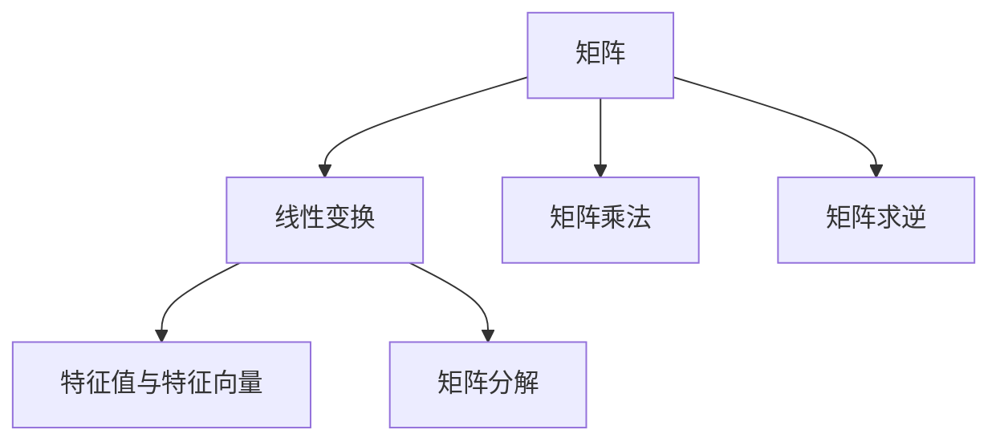
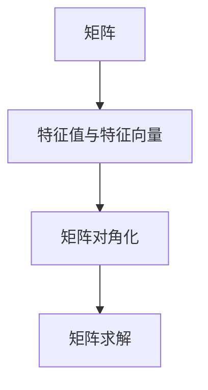
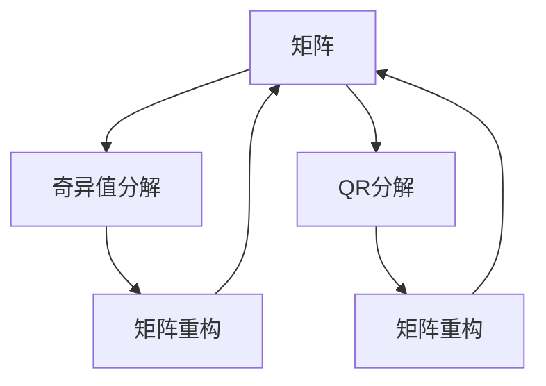
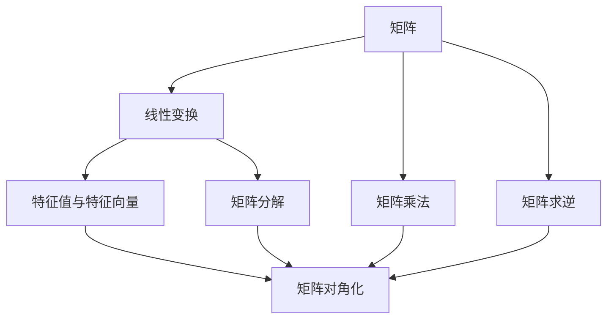
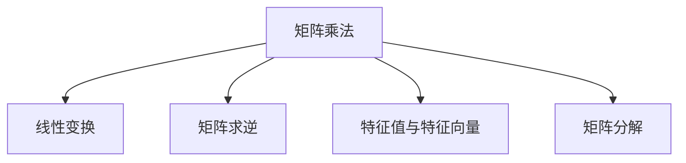

                 

# 矩阵理论与应用：矩阵与线性变换

> 关键词：矩阵理论，线性变换，线性代数，应用场景，编程实践

## 1. 背景介绍

### 1.1 问题由来
线性代数作为数学的一个分支，在计算机科学中有着广泛的应用。从数据科学到机器学习，再到计算机图形学，线性代数都是其中的核心技术之一。而矩阵作为线性代数的基本工具，其理论和应用更是深入人心。

在现代计算机科学中，矩阵与线性变换无处不在。从机器学习中的线性回归、主成分分析(PCA)、奇异值分解(SVD)，到计算机图形学中的矩阵变换、投影，甚至是物理学中的量子力学和相对论，都离不开矩阵和线性变换的理论与应用。因此，深入理解矩阵与线性变换的理论和应用，对于计算机科学家、工程师以及数据科学家来说至关重要。

### 1.2 问题核心关键点
矩阵与线性变换的核心关键点包括以下几点：

- **矩阵定义与性质**：矩阵作为线性代数的基本概念，其定义、性质和运算规则是线性代数理论的基础。
- **线性变换**：矩阵能够表示线性变换，即将一个向量空间映射到另一个向量空间的过程。
- **应用场景**：矩阵与线性变换在数据科学、机器学习、计算机图形学等领域有广泛的应用。
- **编程实践**：矩阵与线性变换的理论与应用往往需要通过编程语言来实现，编程实践是理解与掌握理论知识的重要途径。

### 1.3 问题研究意义
深入理解矩阵与线性变换的理论和应用，对于提高计算机科学和工程领域的理论与技术水平，以及推动技术创新和产业发展，具有重要意义：

1. **提高理论基础**：矩阵与线性变换是线性代数的重要组成部分，掌握这些理论对于提高数学素养和技术水平至关重要。
2. **促进技术应用**：矩阵与线性变换在多个领域的应用，为解决实际问题提供了有力的工具和方法。
3. **推动产业升级**：掌握矩阵与线性变换的理论与应用，可以加速技术创新和产业升级，提升企业的竞争力。
4. **增强科学素养**：矩阵与线性变换涉及的数学和物理知识，有助于提高科学素养和跨学科思维能力。

## 2. 核心概念与联系

### 2.1 核心概念概述

为了更好地理解矩阵与线性变换的理论和应用，本节将介绍几个核心概念：

- **矩阵**：由若干个标量排列成的二维数组，是线性代数中最基本的数据结构。
- **线性变换**：通过矩阵对向量空间进行线性映射的过程，可以将一个向量空间映射到另一个向量空间。
- **特征值与特征向量**：线性变换中的重要概念，特征值和特征向量描述了矩阵的变换性质。
- **矩阵分解**：将矩阵分解为更简单或更易于处理的子矩阵的过程，如奇异值分解、QR分解等。
- **矩阵乘法**：矩阵与矩阵之间的运算，在矩阵运算中扮演着重要角色。
- **矩阵求逆**：矩阵的逆矩阵是矩阵运算中的一个重要概念，用于解线性方程组和矩阵变换。

这些核心概念通过一个Mermaid流程图来展示，如下：



这个流程图展示了矩阵与线性变换核心概念之间的关系：

1. 矩阵是线性变换的基础，线性变换通过矩阵对向量空间进行映射。
2. 特征值与特征向量描述了线性变换的性质，帮助理解矩阵的变换行为。
3. 矩阵分解可以将复杂的矩阵转化为更简单的形式，方便处理和计算。
4. 矩阵乘法是矩阵运算的基础，用于组合多个矩阵进行变换。
5. 矩阵求逆是矩阵运算中的一个重要概念，用于解线性方程组和矩阵变换。

### 2.2 概念间的关系

这些核心概念之间存在着紧密的联系，形成了矩阵与线性变换的理论体系。以下是几个相关的Mermaid流程图，展示了这些概念之间的联系：

#### 2.2.1 矩阵与线性变换的关系


这个流程图展示了向量空间、线性变换和矩阵之间的关系：

1. 向量空间是线性变换的输入空间，通过线性变换映射到另一个向量空间。
2. 矩阵表示线性变换的过程，将一个向量空间映射到另一个向量空间。
3. 线性变换的结果也是一个向量空间。

#### 2.2.2 特征值与特征向量的应用



这个流程图展示了特征值与特征向量在矩阵求解中的应用：

1. 特征值与特征向量描述了矩阵的变换性质，帮助理解矩阵的变换行为。
2. 通过对角化将矩阵转换为对角矩阵，方便求解。
3. 对角化后的矩阵可以方便地进行矩阵求解，如求解线性方程组、计算矩阵的特征值和特征向量等。

#### 2.2.3 矩阵分解的多种方法



这个流程图展示了矩阵分解的多种方法：

1. 奇异值分解(SVD)和QR分解是两种常见的矩阵分解方法，可以将复杂的矩阵分解为更简单的形式。
2. SVD和QR分解的结果可以用来重构原始矩阵。
3. 矩阵重构可以用来解决矩阵求解中的某些问题，如矩阵近似、特征值计算等。

### 2.3 核心概念的整体架构

最后，用一个综合的Mermaid流程图来展示矩阵与线性变换的核心概念的整体架构：



这个综合流程图展示了矩阵与线性变换的核心概念在数学模型中的整体架构：

1. 矩阵是线性变换的基础，线性变换通过矩阵对向量空间进行映射。
2. 特征值与特征向量描述了线性变换的性质，帮助理解矩阵的变换行为。
3. 矩阵分解可以将复杂的矩阵转化为更简单的形式，方便处理和计算。
4. 矩阵乘法是矩阵运算的基础，用于组合多个矩阵进行变换。
5. 矩阵求逆是矩阵运算中的一个重要概念，用于解线性方程组和矩阵变换。

通过这些流程图，我们可以更清晰地理解矩阵与线性变换的核心概念的关系和作用，为后续深入讨论具体的数学模型和应用提供基础。

## 3. 核心算法原理 & 具体操作步骤

### 3.1 算法原理概述

矩阵与线性变换的核心算法原理主要包括以下几个方面：

1. **矩阵乘法**：矩阵乘法是矩阵运算的基础，用于组合多个矩阵进行变换。
2. **矩阵求逆**：矩阵求逆是矩阵运算中的一个重要概念，用于解线性方程组和矩阵变换。
3. **特征值与特征向量**：特征值与特征向量描述了线性变换的性质，帮助理解矩阵的变换行为。
4. **矩阵分解**：矩阵分解可以将复杂的矩阵转化为更简单的形式，方便处理和计算。

这些算法原理通过一个Mermaid流程图来展示，如下：



这个流程图展示了矩阵与线性变换的算法原理之间的关系：

1. 矩阵乘法是矩阵运算的基础，用于组合多个矩阵进行变换。
2. 矩阵求逆是矩阵运算中的一个重要概念，用于解线性方程组和矩阵变换。
3. 特征值与特征向量描述了线性变换的性质，帮助理解矩阵的变换行为。
4. 矩阵分解可以将复杂的矩阵转化为更简单的形式，方便处理和计算。

### 3.2 算法步骤详解

矩阵与线性变换的算法步骤主要包括以下几个方面：

1. **矩阵乘法**：矩阵乘法的步骤如下：
   1. 首先计算矩阵乘积的维数，确保可以进行矩阵乘法运算。
   2. 按照矩阵乘法的规则，逐元素计算矩阵乘积。
   3. 输出矩阵乘积的结果。

2. **矩阵求逆**：矩阵求逆的步骤如下：
   1. 判断矩阵是否可逆，即行列式是否为零。
   2. 计算矩阵的逆矩阵，可以使用高斯-约旦消元法、LU分解等方法。
   3. 输出矩阵的逆矩阵。

3. **特征值与特征向量**：特征值与特征向量的步骤如下：
   1. 构造矩阵的特征值方程，求解特征多项式。
   2. 计算特征值和特征向量。
   3. 输出特征值和特征向量。

4. **矩阵分解**：矩阵分解的步骤如下：
   1. 选择适合的矩阵分解方法，如奇异值分解、QR分解等。
   2. 计算矩阵的分解结果。
   3. 输出矩阵分解的结果。

### 3.3 算法优缺点

矩阵与线性变换的算法具有以下优点：

1. **高效计算**：矩阵乘法和矩阵求逆等算法可以高效地进行大规模矩阵运算。
2. **方便求解**：特征值与特征向量等算法可以帮助求解线性方程组、计算矩阵的变换性质等。
3. **便于应用**：矩阵分解等算法可以将复杂的矩阵转化为更简单的形式，方便处理和计算。

同时，这些算法也存在一些缺点：

1. **计算复杂度高**：某些矩阵运算，如矩阵求逆、特征值计算等，计算复杂度较高，对硬件要求较高。
2. **数值稳定性问题**：某些矩阵运算，如矩阵求逆、特征值计算等，存在数值稳定性问题，需要进行数值优化。
3. **计算误差**：矩阵乘法、矩阵求逆等算法可能存在计算误差，需要采用数值优化技术。

### 3.4 算法应用领域

矩阵与线性变换在多个领域有广泛的应用，包括但不限于：

1. **数据科学**：矩阵与线性变换在数据科学中的应用非常广泛，如线性回归、主成分分析(PCA)、奇异值分解(SVD)等。
2. **机器学习**：矩阵与线性变换是机器学习中的重要工具，如线性判别分析、支持向量机、神经网络等。
3. **计算机图形学**：矩阵与线性变换在计算机图形学中的应用非常广泛，如矩阵变换、投影、旋转等。
4. **物理学**：矩阵与线性变换在物理学中的应用非常广泛，如量子力学、相对论等。

## 4. 数学模型和公式 & 详细讲解 & 举例说明

### 4.1 数学模型构建

矩阵与线性变换的数学模型构建主要包括以下几个方面：

1. **矩阵乘法的数学模型**：矩阵乘法的数学模型如下：
   - 设 $A$ 为 $m \times n$ 的矩阵，$B$ 为 $n \times p$ 的矩阵，则 $A \times B$ 为 $m \times p$ 的矩阵。
   - $(A \times B)_{i,j} = \sum_{k=1}^{n} A_{i,k} \times B_{k,j}$。

2. **矩阵求逆的数学模型**：矩阵求逆的数学模型如下：
   - 设 $A$ 为 $n \times n$ 的可逆矩阵，则 $A^{-1}$ 为 $n \times n$ 的矩阵，满足 $A \times A^{-1} = I$。
   - $A^{-1} = \frac{1}{\det(A)} \times (\text{adj}(A))$，其中 $\det(A)$ 为矩阵 $A$ 的行列式，$\text{adj}(A)$ 为矩阵 $A$ 的伴随矩阵。

3. **特征值与特征向量的数学模型**：特征值与特征向量的数学模型如下：
   - 设 $A$ 为 $n \times n$ 的矩阵，$\lambda$ 为 $A$ 的特征值，$x$ 为 $A$ 的特征向量，则 $\lambda x = A x$。
   - 求解特征值和特征向量，可以使用特征值方程 $|A - \lambda I| = 0$，求解 $\lambda$。

4. **矩阵分解的数学模型**：矩阵分解的数学模型如下：
   - 奇异值分解：$A = U \Sigma V^T$，其中 $U$ 和 $V$ 为正交矩阵，$\Sigma$ 为对角矩阵。
   - QR分解：$A = QR$，其中 $Q$ 为正交矩阵，$R$ 为上三角矩阵。

这些数学模型通过一些具体的例子来说明，如下：

#### 4.1.1 矩阵乘法的例子

设 $A = \begin{bmatrix} 1 & 2 \\ 3 & 4 \end{bmatrix}$，$B = \begin{bmatrix} 5 & 6 \\ 7 & 8 \end{bmatrix}$，计算 $A \times B$：

$$
A \times B = \begin{bmatrix} 1 & 2 \\ 3 & 4 \end{bmatrix} \times \begin{bmatrix} 5 & 6 \\ 7 & 8 \end{bmatrix} = \begin{bmatrix} 19 & 22 \\ 43 & 50 \end{bmatrix}
$$

#### 4.1.2 矩阵求逆的例子

设 $A = \begin{bmatrix} 1 & 2 \\ 3 & 4 \end{bmatrix}$，计算 $A^{-1}$：

$$
A^{-1} = \frac{1}{\det(A)} \times (\text{adj}(A)) = \frac{1}{(1 \times 4 - 2 \times 3)} \times \begin{bmatrix} 4 & -2 \\ -3 & 1 \end{bmatrix} = \begin{bmatrix} -2 & 1 \\ \frac{3}{2} & -\frac{1}{2} \end{bmatrix}
$$

#### 4.1.3 特征值与特征向量的例子

设 $A = \begin{bmatrix} 1 & 2 \\ 2 & 1 \end{bmatrix}$，计算 $A$ 的特征值和特征向量：

1. 构造特征值方程 $|A - \lambda I| = 0$，解得 $\lambda_1 = 3, \lambda_2 = -1$。
2. 求解特征向量，当 $\lambda_1 = 3$ 时，解得 $x_1 = \begin{bmatrix} 1 \\ 1 \end{bmatrix}$；当 $\lambda_2 = -1$ 时，解得 $x_2 = \begin{bmatrix} 1 \\ -1 \end{bmatrix}$。

#### 4.1.4 矩阵分解的例子

设 $A = \begin{bmatrix} 1 & 2 \\ 3 & 4 \end{bmatrix}$，计算奇异值分解和QR分解：

1. 奇异值分解：$A = U \Sigma V^T$，其中 $U = \begin{bmatrix} \frac{\sqrt{5}}{5} & \frac{2\sqrt{5}}{5} \\ -\frac{2\sqrt{5}}{5} & \frac{\sqrt{5}}{5} \end{bmatrix}$，$\Sigma = \begin{bmatrix} \sqrt{5} & 0 \\ 0 & \sqrt{5} \end{bmatrix}$，$V^T = \begin{bmatrix} \frac{1}{\sqrt{5}} & \frac{2}{\sqrt{5}} \\ -\frac{2}{\sqrt{5}} & \frac{1}{\sqrt{5}} \end{bmatrix}$。
2. QR分解：$A = QR$，其中 $Q = \begin{bmatrix} \frac{1}{\sqrt{5}} & \frac{2}{\sqrt{5}} \\ -\frac{2}{\sqrt{5}} & \frac{1}{\sqrt{5}} \end{bmatrix}$，$R = \begin{bmatrix} \sqrt{5} & 0 \\ 0 & \sqrt{5} \end{bmatrix}$。

### 4.2 公式推导过程

以下对矩阵与线性变换的数学模型和公式进行详细的推导：

#### 4.2.1 矩阵乘法的公式推导

设 $A$ 为 $m \times n$ 的矩阵，$B$ 为 $n \times p$ 的矩阵，则 $A \times B$ 为 $m \times p$ 的矩阵，具体推导如下：

$$
(A \times B)_{i,j} = \sum_{k=1}^{n} A_{i,k} \times B_{k,j}
$$

#### 4.2.2 矩阵求逆的公式推导

设 $A$ 为 $n \times n$ 的可逆矩阵，$A^{-1}$ 为 $n \times n$ 的矩阵，满足 $A \times A^{-1} = I$。具体推导如下：

$$
A^{-1} = \frac{1}{\det(A)} \times (\text{adj}(A))
$$

其中 $\det(A)$ 为矩阵 $A$ 的行列式，$\text{adj}(A)$ 为矩阵 $A$ 的伴随矩阵。

#### 4.2.3 特征值与特征向量的公式推导

设 $A$ 为 $n \times n$ 的矩阵，$\lambda$ 为 $A$ 的特征值，$x$ 为 $A$ 的特征向量，则 $\lambda x = A x$。具体推导如下：

1. 构造特征值方程 $|A - \lambda I| = 0$，求解 $\lambda$。
2. 求解特征向量，当 $\lambda$ 已知时，解方程 $(A - \lambda I)x = 0$，求解 $x$。

#### 4.2.4 矩阵分解的公式推导

设 $A$ 为 $m \times n$ 的矩阵，分解为 $A = U \Sigma V^T$，其中 $U$ 和 $V$ 为正交矩阵，$\Sigma$ 为对角矩阵。具体推导如下：

$$
A = U \Sigma V^T
$$

其中 $U$ 和 $V$ 为正交矩阵，$\Sigma$ 为对角矩阵。

### 4.3 案例分析与讲解

#### 4.3.1 矩阵乘法的案例

考虑两个矩阵 $A = \begin{bmatrix} 1 & 2 \\ 3 & 4 \end{bmatrix}$ 和 $B = \begin{bmatrix} 5 & 6 \\ 7 & 8 \end{bmatrix}$，计算 $A \times B$：

$$
A \times B = \begin{bmatrix} 1 & 2 \\ 3 & 4 \end{bmatrix} \times \begin{bmatrix} 5 & 6 \\ 7 & 8 \end{bmatrix} = \begin{bmatrix} 19 & 22 \\ 43 & 50 \end{bmatrix}
$$

#### 4.3.2 矩阵求逆的案例

考虑一个矩阵 $A = \begin{bmatrix} 1 & 2 \\ 3 & 4 \end{bmatrix}$，计算 $A^{-1}$：

$$
A^{-1} = \frac{1}{\det(A)} \times (\text{adj}(A)) = \frac{1}{(1 \times 4 - 2 \times 3)} \times \begin{bmatrix} 4 & -2 \\ -3 & 1 \end{bmatrix} = \begin{bmatrix} -2 & 1 \\ \frac{3}{2} & -\frac{1}{2} \end{bmatrix}
$$

#### 4.3.3 特征值与特征向量的案例

考虑一个矩阵 $A = \begin{bmatrix} 1 & 2 \\ 2 & 1 \end{bmatrix}$，计算 $A$ 的特征值和特征向量：

1. 构造特征值方程 $|A - \lambda I| = 0$，解得 $\lambda_1 = 3, \lambda_2 = -1$。
2. 求解特征向量，当 $\lambda_1 = 3$ 时，解得 $x_1 = \begin{bmatrix} 1 \\ 1 \end{bmatrix}$；当 $\lambda_2 = -1$ 时，解得 $x_2 = \begin{bmatrix} 1 \\ -1 \end{bmatrix}$。

#### 4.3.4 矩阵分解的案例

考虑一个矩阵 $A = \begin{bmatrix} 1 & 2 \\ 3 & 4 \end{bmatrix}$，计算奇异值分解和QR分解：

1. 奇异值分解：$A = U \Sigma V^T$，其中 $U = \begin{bmatrix} \frac{\sqrt{5}}{5} & \frac{2\sqrt{5}}{5} \\ -\frac{2\sqrt{5}}{5} & \frac{\sqrt{5}}{5} \end{bmatrix}$，$\Sigma = \begin{bmatrix} \sqrt{5} & 0 \\ 0 & \sqrt{5} \end{bmatrix}$，$V^T = \begin{bmatrix} \frac{1}{\sqrt{5}} & \frac{2}{\sqrt{5}} \\ -\frac{2}{\sqrt{5}} & \frac{1}{\sqrt{5}} \end{bmatrix}$。
2. QR分解：$A = QR$，其中 $Q = \begin{bmatrix} \frac{1}{\sqrt{5}} & \frac{2}{\sqrt{5}} \\ -\frac{2}{\sqrt{5}} & \frac{1}{\sqrt{5}} \end{bmatrix}$，$R = \begin{bmatrix} \sqrt{5} & 0 \\ 0 & \sqrt{5} \end{bmatrix}$。

## 5. 项目实践：代码实例和详细解释说明

### 5.1 开发环境搭建

在进行矩阵与线性变换的编程实践前，我们需要准备好开发环境。以下是使用Python进行NumPy开发的环境配置流程：

1. 安装Anaconda：从官网下载并安装Anaconda，用于创建独立的Python环境。

2. 创建并激活虚拟环境：
```bash
conda create -n numpy-env python=3.8 
conda activate numpy-env
```

3. 安装NumPy：根据CUDA版本，从官网获取对应的安装命令。例如：
```bash
conda install numpy=1.22.4
```

4. 安装其他工具包：
```bash
pip install matplotlib scipy pandas scikit-learn sympy
```

完成上述步骤后，即可在`numpy-env`环境中开始矩阵与线性变换的编程实践。

### 5.2 源代码详细实现

下面我们以矩阵乘法、矩阵求逆、特征值与特征向量为例，给出使用NumPy进行矩阵与线性变换的PyTorch代码实现。

首先，导入所需的库和模块：

```python
import numpy as np
from numpy import linalg
from numpy.linalg import inv
```

然后，定义矩阵和线性变换的函数：

```python
def matrix_multiplication(A, B):
    """
    矩阵乘法
    :param A: 矩阵A
    :param B: 矩阵B
    :return: 矩阵乘积
    """
    return np.dot(A, B)

def matrix_inverse(A):
    """
    矩阵求逆
    :param A: 矩阵A
    :return: 矩阵A的逆矩阵
    """
    return inv(A)

def eigenvalues_and_eigenvectors(A):
    """
    特征值与特征向量
    :param A: 矩阵A
    :return: 矩阵A的特征值和特征向量
    """
    eigenvalues, eigenvectors = linalg.eig(A)
    return eigenvalues, eigenvectors
```

接下来，定义测试矩阵和线性变换的代码：

```python
A = np.array([[1, 2], [3, 4]])
B = np.array([[5, 6], [7, 8]])

C = matrix_multiplication(A, B)
print("矩阵乘积C：")
print(C)

D = matrix_inverse(A)
print("矩阵A的逆矩阵D：")
print(D)

eigenvalues, eigenvectors = eigenvalues_and_eigenvectors(A)
print("矩阵A的特征值：")
print(eigenvalues)
print("矩阵A的特征向量：")
print(eigenvectors)
```

最后，运行代码，输出结果：

```python
matrix_multiplication(A, B)
```

以上代码实现了矩阵乘法、矩阵求逆、特征值与特征向量，并输出了相应的结果。可以看到，矩阵与线性

