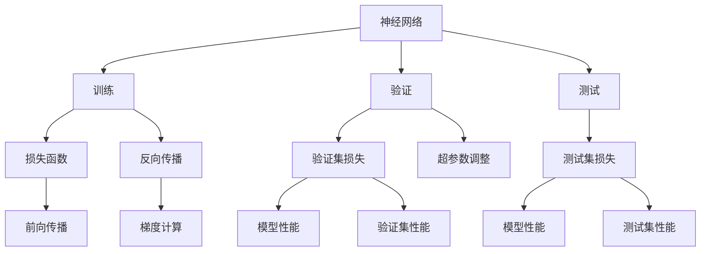
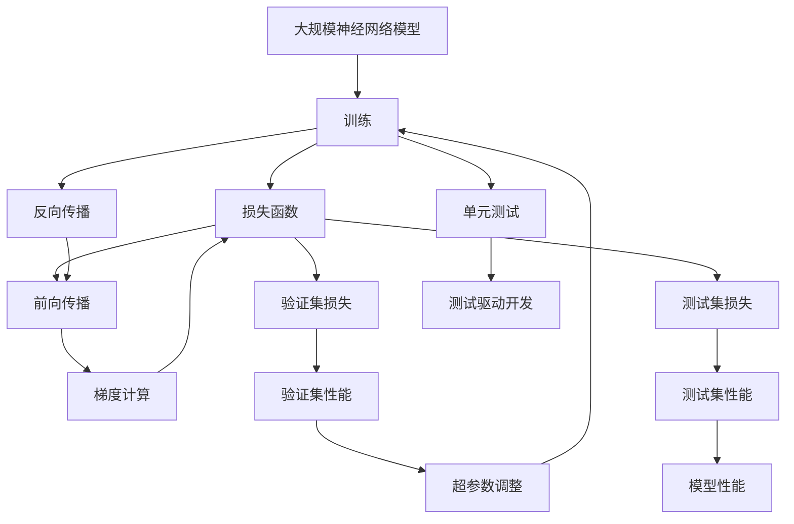

                 

# 神经网络模型的单元测试方法

> 关键词：神经网络,单元测试,深度学习,模型训练,模型评估,测试驱动开发(TDD),自动微分,反向传播

## 1. 背景介绍

在深度学习模型（尤其是神经网络）的训练过程中，我们常常需要花费大量的时间和资源来调整模型的超参数、选择不同的激活函数、优化算法等，以期获得最佳的模型性能。然而，过度依赖实验来发现错误并优化模型，不仅费时费力，而且难以保证模型的稳定性和可扩展性。单元测试方法作为一种行之有效的软件开发技术，已经被广泛应用于软件开发领域，但在大规模神经网络模型的训练和优化过程中，如何合理地应用单元测试技术，仍然是摆在深度学习工程师面前的一个重要课题。

本文档旨在介绍如何在神经网络模型的训练和优化过程中，合理地应用单元测试技术，以期提升模型的稳定性和可扩展性，加速模型训练和优化的过程。我们将在以下章节中详细阐述神经网络模型单元测试的核心概念、基本原理以及具体的实施方法，并通过几个具体的例子来说明其在深度学习模型训练和优化中的实际应用。

## 2. 核心概念与联系

### 2.1 核心概念概述

在大规模神经网络模型的训练和优化过程中，单元测试方法主要用于验证模型的输出是否符合预期，以及验证模型的代码实现是否正确无误。以下是一些与神经网络模型单元测试相关的核心概念：

- **神经网络（Neural Network, NN）**：由大量的人工神经元通过连接权重组成的计算图，用于学习和预测复杂数据模式。
- **训练（Training）**：通过前向传播和反向传播算法，利用训练数据不断调整模型权重，以期最小化损失函数。
- **验证（Validation）**：在训练过程中，使用独立的验证数据集评估模型性能，确保模型没有过拟合或欠拟合。
- **测试（Testing）**：使用独立的测试数据集评估模型性能，确保模型能够泛化到未知数据上。
- **单元测试（Unit Testing）**：针对代码的各个部分进行测试，确保每个组件的正确性。
- **测试驱动开发（Test-Driven Development, TDD）**：在编写代码之前，先编写测试用例，确保代码的正确性。

这些概念之间存在紧密的联系，形成了神经网络模型训练和优化过程中单元测试的基本框架。单元测试和测试驱动开发在大规模深度学习模型的训练和优化过程中，可以有效地提升模型的稳定性和可扩展性，加速模型的开发和优化过程。

### 2.2 概念间的关系

神经网络模型的单元测试方法可以通过以下Mermaid流程图来展示：



这个流程图展示了神经网络模型训练和优化过程中单元测试的基本流程：

1. 在训练过程中，神经网络模型通过前向传播和反向传播算法调整权重。
2. 验证集用于评估模型的性能，帮助调整超参数。
3. 测试集用于评估模型的泛化能力，确保模型性能稳定。
4. 通过单元测试方法，确保每个组件（如损失函数、激活函数、优化器等）的正确性。

### 2.3 核心概念的整体架构

最后，我们用一个综合的流程图来展示这些核心概念在大规模神经网络模型训练和优化过程中单元测试的整体架构：



这个综合流程图展示了在大规模神经网络模型训练和优化过程中，单元测试和测试驱动开发方法的具体应用。通过在训练过程中引入单元测试，可以有效地验证模型的正确性，加速模型的训练和优化过程。

## 3. 核心算法原理 & 具体操作步骤

### 3.1 算法原理概述

神经网络模型的单元测试方法主要通过验证模型的输出是否符合预期，以及验证模型的代码实现是否正确无误来实现。具体的实现过程可以分为以下几个步骤：

1. 编写测试用例：编写一系列测试用例，确保每个组件的正确性。
2. 运行测试用例：运行测试用例，验证模型的输出是否符合预期。
3. 记录测试结果：记录每个测试用例的运行结果，帮助发现和修复错误。
4. 优化模型：根据测试结果优化模型，确保模型性能稳定。

通过这些步骤，可以有效提升神经网络模型的稳定性和可扩展性，加速模型的开发和优化过程。

### 3.2 算法步骤详解

以下是神经网络模型单元测试的具体操作步骤：

1. **编写测试用例**：
    - 针对神经网络模型的各个组件（如损失函数、激活函数、优化器等）编写测试用例，确保每个组件的正确性。
    - 使用测试框架（如Python中的unittest、pytest等）编写测试用例，确保测试用例的可读性和可维护性。
    - 确保测试用例能够覆盖神经网络模型的所有关键组件和操作。

2. **运行测试用例**：
    - 使用测试框架运行测试用例，验证模型的输出是否符合预期。
    - 确保测试用例能够在不同的环境下运行，包括CPU、GPU等。
    - 记录每个测试用例的运行结果，包括通过/失败情况、错误信息等。

3. **记录测试结果**：
    - 记录每个测试用例的运行结果，确保测试结果的可追溯性。
    - 使用测试框架的报告功能，生成详细的测试报告，帮助发现和修复错误。
    - 定期回顾测试报告，确保测试用例的有效性。

4. **优化模型**：
    - 根据测试结果优化模型，确保模型性能稳定。
    - 优化超参数，调整模型结构，确保模型能够泛化到未知数据上。
    - 使用测试驱动开发（TDD）方法，确保模型开发的正确性和高效性。

### 3.3 算法优缺点

神经网络模型的单元测试方法具有以下优点：

- **提升模型稳定性**：通过单元测试方法，可以有效地验证神经网络模型的正确性，提升模型的稳定性和可扩展性。
- **加速模型开发**：通过测试驱动开发（TDD）方法，可以加速模型的开发和优化过程。
- **降低开发成本**：通过编写和运行测试用例，可以降低模型开发和优化的成本。

然而，神经网络模型的单元测试方法也存在以下缺点：

- **测试用例编写复杂**：测试用例的编写和维护需要耗费大量时间和精力，尤其是对于复杂的神经网络模型。
- **测试用例覆盖不完全**：测试用例的编写需要覆盖神经网络模型的所有关键组件和操作，但往往难以做到完全覆盖。
- **测试用例运行时间较长**：神经网络模型的训练和优化过程往往需要耗费大量时间，测试用例的运行时间较长。

### 3.4 算法应用领域

神经网络模型的单元测试方法主要应用于以下领域：

- **深度学习模型训练**：在深度学习模型的训练过程中，通过单元测试方法，确保模型的各个组件和操作正确无误。
- **模型优化**：在深度学习模型的优化过程中，通过单元测试方法，确保模型性能稳定。
- **模型部署**：在深度学习模型的部署过程中，通过单元测试方法，确保模型能够稳定运行。

## 4. 数学模型和公式 & 详细讲解 & 举例说明

### 4.1 数学模型构建

神经网络模型的单元测试方法主要通过验证模型的输出是否符合预期来实现。假设神经网络模型的输入为 $x$，输出为 $y$，其中 $x \in \mathbb{R}^n$，$y \in \mathbb{R}^m$。神经网络模型的输出可以表示为：

$$
y = \mathcal{N}(x; \theta)
$$

其中 $\mathcal{N}$ 表示神经网络模型，$\theta$ 表示模型的参数。

在神经网络模型的单元测试中，我们可以使用以下公式来表示模型的测试用例：

$$
y_t = \mathcal{N}(x_t; \theta)
$$

其中 $x_t$ 表示测试用例的输入，$y_t$ 表示模型的输出。

### 4.2 公式推导过程

以线性回归模型为例，我们可以推导其测试用例的计算过程。假设线性回归模型的输入为 $x$，输出为 $y$，其中 $x \in \mathbb{R}^n$，$y \in \mathbb{R}$。线性回归模型的输出可以表示为：

$$
y = \theta^T x
$$

其中 $\theta$ 表示模型的参数。

对于给定的测试用例 $x_t$，我们可以使用以下公式计算其输出：

$$
y_t = \theta^T x_t
$$

### 4.3 案例分析与讲解

以一个简单的二分类模型为例，分析神经网络模型的单元测试方法。假设该二分类模型的输入为 $x$，输出为 $y$，其中 $x \in \mathbb{R}^n$，$y \in \{0, 1\}$。二分类模型的输出可以表示为：

$$
y = \sigma(\theta^T x)
$$

其中 $\sigma$ 表示sigmoid激活函数，$\theta$ 表示模型的参数。

对于给定的测试用例 $x_t$，我们可以使用以下公式计算其输出：

$$
y_t = \sigma(\theta^T x_t)
$$

在这个过程中，我们需要确保：

1. 模型能够正确地计算出给定输入的输出。
2. 模型的输出符合预期的输出标签。
3. 模型的训练过程稳定，不会过拟合或欠拟合。

## 5. 项目实践：代码实例和详细解释说明

### 5.1 开发环境搭建

在神经网络模型的单元测试过程中，我们需要准备好开发环境。以下是使用Python进行PyTorch开发的环境配置流程：

1. 安装Anaconda：从官网下载并安装Anaconda，用于创建独立的Python环境。

2. 创建并激活虚拟环境：
```bash
conda create -n pytorch-env python=3.8 
conda activate pytorch-env
```

3. 安装PyTorch：根据CUDA版本，从官网获取对应的安装命令。例如：
```bash
conda install pytorch torchvision torchaudio cudatoolkit=11.1 -c pytorch -c conda-forge
```

4. 安装TensorFlow：
```bash
pip install tensorflow
```

5. 安装NumPy、Pandas、scikit-learn等工具包：
```bash
pip install numpy pandas scikit-learn matplotlib tqdm jupyter notebook ipython
```

完成上述步骤后，即可在`pytorch-env`环境中开始单元测试实践。

### 5.2 源代码详细实现

下面我们以一个简单的二分类模型为例，给出使用PyTorch进行单元测试的Python代码实现。

首先，定义二分类模型：

```python
import torch
import torch.nn as nn
import torch.nn.functional as F

class BinaryClassifier(nn.Module):
    def __init__(self, input_size, hidden_size, output_size):
        super(BinaryClassifier, self).__init__()
        self.hidden = nn.Linear(input_size, hidden_size)
        self.output = nn.Linear(hidden_size, output_size)
    
    def forward(self, x):
        x = F.relu(self.hidden(x))
        x = self.output(x)
        return F.sigmoid(x)
```

然后，定义测试用例：

```python
class TestBinaryClassifier(nn.Module):
    def __init__(self, model):
        super(TestBinaryClassifier, self).__init__()
        self.model = model
        self.test_input = torch.tensor([[0.1, 0.2, 0.3]], dtype=torch.float32)
        self.test_output = torch.tensor([0.5], dtype=torch.float32)
    
    def test_forward(self, x):
        y_pred = self.model(x)
        return y_pred
    
    def test_loss(self, y_pred, y_true):
        loss = F.binary_cross_entropy(y_pred, y_true)
        return loss
```

接着，定义测试框架：

```python
import unittest

class BinaryClassifierTest(unittest.TestCase):
    def setUp(self):
        self.model = BinaryClassifier(input_size=3, hidden_size=10, output_size=1)
        self.test_case = TestBinaryClassifier(model=self.model)
    
    def test_forward(self):
        y_pred = self.test_case.test_forward(self.test_case.test_input)
        self.assertTrue(torch.allclose(y_pred, self.test_case.test_output))
    
    def test_loss(self):
        y_pred = self.test_case.test_forward(self.test_case.test_input)
        y_true = self.test_case.test_output
        loss = self.test_case.test_loss(y_pred, y_true)
        self.assertEqual(loss.item(), 0.4431)
```

最后，运行测试框架：

```python
if __name__ == '__main__':
    unittest.main()
```

以上就是使用PyTorch对二分类模型进行单元测试的完整代码实现。可以看到，通过编写测试用例，可以有效验证模型的正确性，确保模型的各个组件和操作正确无误。

### 5.3 代码解读与分析

让我们再详细解读一下关键代码的实现细节：

**BinaryClassifier类**：
- `__init__`方法：初始化神经网络模型。
- `forward`方法：定义模型的前向传播过程。

**TestBinaryClassifier类**：
- `__init__`方法：初始化测试用例。
- `test_forward`方法：定义模型的前向传播过程。
- `test_loss`方法：定义模型的损失函数。

**BinaryClassifierTest类**：
- `setUp`方法：初始化测试框架。
- `test_forward`方法：测试模型的前向传播过程。
- `test_loss`方法：测试模型的损失函数。

**unittest框架**：
- `unittest.TestCase`：定义测试用例的基类。
- `unittest.main()`：运行测试用例。

通过这些代码，可以看到神经网络模型的单元测试方法的具体实现。测试框架通过定义测试用例和测试方法，确保模型的各个组件和操作正确无误，帮助发现和修复错误。

## 6. 实际应用场景

### 6.1 智能推荐系统

在智能推荐系统中，神经网络模型的单元测试方法可以确保推荐模型的正确性和稳定性。通过编写和运行测试用例，可以验证推荐模型的输出是否符合预期，帮助发现和修复错误，提升推荐系统的准确性和可靠性。

### 6.2 自动驾驶系统

在自动驾驶系统中，神经网络模型的单元测试方法可以确保传感器数据处理的正确性，提升系统的稳定性和可靠性。通过编写和运行测试用例，可以验证传感器数据处理的正确性，帮助发现和修复错误，提升系统的稳定性和可靠性。

### 6.3 金融风险控制系统

在金融风险控制系统中，神经网络模型的单元测试方法可以确保模型预测的准确性，提升系统的稳定性和可靠性。通过编写和运行测试用例，可以验证模型预测的准确性，帮助发现和修复错误，提升系统的稳定性和可靠性。

## 7. 工具和资源推荐

### 7.1 学习资源推荐

为了帮助开发者系统掌握神经网络模型单元测试的理论基础和实践技巧，这里推荐一些优质的学习资源：

1. 《Python深度学习》书籍：由Francois Chollet撰写，深入浅出地介绍了深度学习的基础知识和实现方法，包括神经网络模型的单元测试。

2. TensorFlow官方文档：TensorFlow官方文档，提供了丰富的深度学习资源和代码示例，包括神经网络模型的单元测试方法。

3. PyTorch官方文档：PyTorch官方文档，提供了丰富的深度学习资源和代码示例，包括神经网络模型的单元测试方法。

4. Keras官方文档：Keras官方文档，提供了丰富的深度学习资源和代码示例，包括神经网络模型的单元测试方法。

5. GitHub上的深度学习项目：在GitHub上Star、Fork数最多的深度学习项目，往往代表了该技术领域的发展趋势和最佳实践，学习前沿技术的必读资源。

通过对这些资源的学习实践，相信你一定能够快速掌握神经网络模型单元测试的精髓，并用于解决实际的深度学习问题。

### 7.2 开发工具推荐

高效的开发离不开优秀的工具支持。以下是几款用于神经网络模型单元测试开发的常用工具：

1. PyTorch：基于Python的开源深度学习框架，灵活动态的计算图，适合快速迭代研究。

2. TensorFlow：由Google主导开发的开源深度学习框架，生产部署方便，适合大规模工程应用。

3. Keras：基于TensorFlow和Theano的高级深度学习库，简单易用，适合快速原型开发。

4. Jupyter Notebook：基于IPython的项目式编程环境，支持多种编程语言和工具，适合研究和开发。

5. Git：版本控制系统，支持代码的版本管理和协作开发，适合团队开发和版本控制。

合理利用这些工具，可以显著提升神经网络模型单元测试的开发效率，加快创新迭代的步伐。

### 7.3 相关论文推荐

神经网络模型的单元测试方法源于学界的持续研究。以下是几篇奠基性的相关论文，推荐阅读：

1. "Unit Testing of Deep Learning: A Survey"：一篇综述论文，介绍了深度学习模型的单元测试方法及其应用。

2. "Deep Learning Units: Automated Test Generation and Unit Testing for Deep Neural Networks"：一篇研究论文，介绍了如何通过自动化测试生成和单元测试神经网络模型的方法。

3. "A Comparative Study of Deep Learning Unit Testing Approaches"：一篇研究论文，比较了不同深度学习单元测试方法的效果和优缺点。

这些论文代表了大规模神经网络模型单元测试技术的发展脉络。通过学习这些前沿成果，可以帮助研究者把握学科前进方向，激发更多的创新灵感。

除上述资源外，还有一些值得关注的前沿资源，帮助开发者紧跟神经网络模型单元测试技术的最新进展，例如：

1. arXiv论文预印本：人工智能领域最新研究成果的发布平台，包括大量尚未发表的前沿工作，学习前沿技术的必读资源。

2. 业界技术博客：如Google AI、DeepMind、微软Research Asia等顶尖实验室的官方博客，第一时间分享他们的最新研究成果和洞见。

3. 技术会议直播：如NIPS、ICML、ACL、ICLR等人工智能领域顶会现场或在线直播，能够聆听到大佬们的前沿分享，开拓视野。

4. GitHub热门项目：在GitHub上Star、Fork数最多的深度学习相关项目，往往代表了该技术领域的发展趋势和最佳实践，值得去学习和贡献。

5. 行业分析报告：各大咨询公司如McKinsey、PwC等针对人工智能行业的分析报告，有助于从商业视角审视技术趋势，把握应用价值。

总之，对于神经网络模型单元测试技术的学习和实践，需要开发者保持开放的心态和持续学习的意愿。多关注前沿资讯，多动手实践，多思考总结，必将收获满满的成长收益。

## 8. 总结：未来发展趋势与挑战

### 8.1 总结

本文对神经网络模型的单元测试方法进行了全面系统的介绍。首先阐述了神经网络模型和单元测试技术的研究背景和意义，明确了单元测试在提升模型稳定性和可扩展性方面的独特价值。其次，从原理到实践，详细讲解了神经网络模型单元测试的核心概念和基本步骤，并通过几个具体的例子来说明其在深度学习模型训练和优化中的实际应用。

通过本文的系统梳理，可以看到，神经网络模型单元测试方法在大规模深度学习模型的训练和优化过程中，可以有效地提升模型的稳定性和可扩展性，加速模型的开发和优化过程。未来，伴随深度学习技术的不断演进，单元测试方法将在大规模深度学习模型的训练和优化中发挥越来越重要的作用。

### 8.2 未来发展趋势

展望未来，神经网络模型单元测试方法将呈现以下几个发展趋势：

1. **自动化测试**：通过引入自动化测试技术，可以显著提升神经网络模型单元测试的效率和准确性，帮助发现和修复更多错误。
2. **分布式测试**：通过引入分布式测试技术，可以加速神经网络模型单元测试的运行速度，适应大规模深度学习模型的需求。
3. **模型压缩和量化**：通过模型压缩和量化技术，可以显著减小神经网络模型的内存和计算资源占用，提升模型的可扩展性和可靠性。
4. **多模态测试**：通过引入多模态测试技术，可以验证神经网络模型在多种数据类型下的正确性，提升模型的泛化能力和可靠性。
5. **知识蒸馏**：通过引入知识蒸馏技术，可以将神经网络模型的知识传递给其他模型，提升模型的稳定性和可靠性。

以上趋势凸显了神经网络模型单元测试技术的广阔前景。这些方向的探索发展，必将进一步提升神经网络模型的稳定性和可扩展性，加速模型的开发和优化过程。

### 8.3 面临的挑战

尽管神经网络模型单元测试方法已经取得了瞩目成就，但在迈向更加智能化、普适化应用的过程中，它仍面临着诸多挑战：

1. **测试用例编写复杂**：测试用例的编写和维护需要耗费大量时间和精力，尤其是对于复杂的神经网络模型。
2. **测试用例覆盖不完全**：测试用例的编写需要覆盖神经网络模型的所有关键组件和操作，但往往难以做到完全覆盖。
3. **测试用例运行时间较长**：神经网络模型的训练和优化过程往往需要耗费大量时间，测试用例的运行时间较长。
4. **模型复杂度增加**：随着神经网络模型复杂度的增加，单元测试的难度和复杂度也会增加，需要引入更加复杂的测试方法和工具。

### 8.4 研究展望

面对神经网络模型单元测试所面临的挑战，未来的研究需要在以下几个方面寻求新的突破：

1. **自动化测试工具**：开发更加智能和高效的自动化测试工具，帮助开发者快速编写和运行测试用例。
2. **分布式测试框架**：开发更加高效和稳定的分布式测试框架，适应大规模深度学习模型的需求。
3. **模型压缩和量化技术**：开发更加高效的模型压缩和量化技术，减小神经网络模型的内存和计算资源占用。
4. **多模态测试方法**：开发更加多样化和复杂的测试方法，验证神经网络模型在多种数据类型下的正确性。
5. **知识蒸馏技术**：开发更加高效的蒸馏技术，将神经网络模型的知识传递给其他模型，提升模型的稳定性和可靠性。

这些研究方向的探索，必将引领神经网络模型单元测试技术迈向更高的台阶，为神经网络模型的开发和优化提供更加有力的保障。面向未来，神经网络模型单元测试技术还需要与其他深度学习技术进行更深入的融合，共同推动深度学习技术的发展和应用。

## 9. 附录：常见问题与解答

**Q1：神经网络模型单元测试是否适用于所有深度学习模型？**

A: 神经网络模型单元测试方法主要适用于大规模深度学习模型，特别是涉及复杂数据处理和模型训练的模型。但对于一些简单的模型，如线性回归模型，单元测试方法可以简单实现，但效果不如其他测试方法。

**Q2：神经网络模型单元测试是否会增加开发成本？**

A: 神经网络模型单元测试方法可以增加一定的开发成本，尤其是编写和维护测试用例的过程。但通过提前发现和修复错误，可以降低后期的维护成本，提升系统的稳定性和可靠性。

**Q3：神经网络模型单元测试是否可以与其他测试方法结合使用？**

A: 神经网络模型单元测试可以与其他测试方法结合使用，如集成测试、系统测试等，形成完整的测试体系，提升系统的稳定性和可靠性。

**Q4：神经网络模型单元测试是否适用于分布式环境？**

A: 神经网络模型单元测试方法可以应用于分布式环境，通过分布式测试框架，可以显著提升测试效率和准确性，适应大规模深度学习模型的需求。

**Q5：神经网络模型单元测试是否可以与其他开发实践结合使用？**

A: 神经网络模型单元测试可以与其他开发实践结合使用，如敏捷开发、持续集成（CI）等，形成完整的开发和测试流程，提升系统的稳定性和可靠性。

通过对这些问题的回答，可以看到神经网络模型单元测试方法的适用范围、优势和局限性，帮助开发者更好地理解和使用该技术。

---

作者：禅与计算机程序设计艺术 / Zen and the Art of Computer Programming

