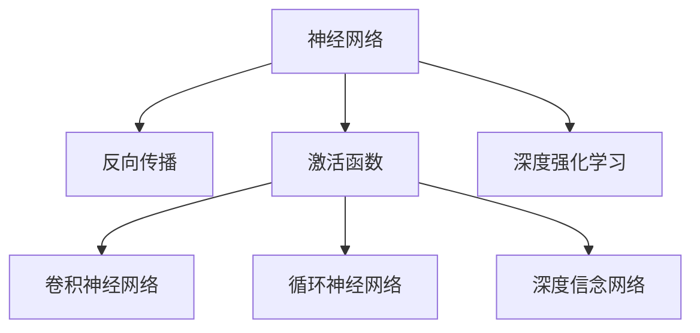
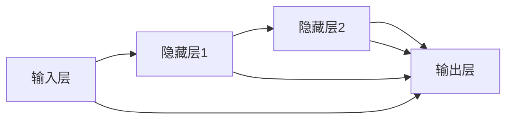
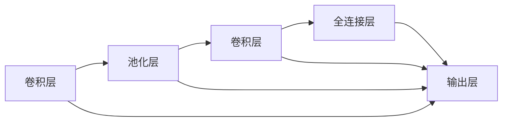
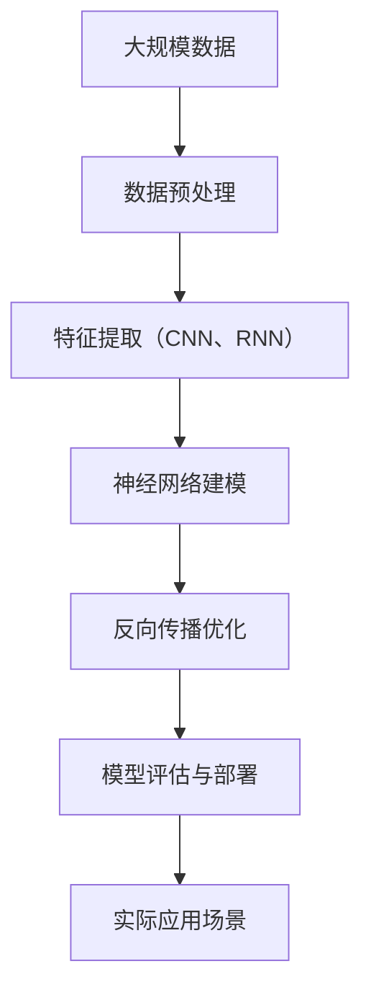

                 

# 神经网络：人工智能的基石

> 关键词：神经网络,人工智能,深度学习,机器学习,反向传播算法,激活函数,卷积神经网络,循环神经网络,深度信念网络,深度强化学习

## 1. 背景介绍

### 1.1 问题由来
人工智能（AI）的迅速崛起，尤其是在视觉、语音、自然语言处理（NLP）等领域的突破性进展，在很大程度上得益于深度学习技术的核心驱动——神经网络。神经网络不仅为AI提供了强大的模型和算法支持，更是推动了整个科技行业向智能化方向发展。

### 1.2 问题核心关键点
神经网络的核心思想是通过模拟人脑的神经元连接方式，构建出多层次、多节点的网络结构，用于解决复杂的非线性映射问题。神经网络可以自适应地学习输入数据中的特征表示，从而实现高效的分类、回归、聚类等任务。其核心原理包括反向传播算法、激活函数、卷积神经网络（CNN）、循环神经网络（RNN）、深度信念网络（DBN）、深度强化学习（DRL）等。

### 1.3 问题研究意义
研究神经网络及其在人工智能中的应用，对于推动AI技术的进步、拓展其在不同领域的应用场景、提升系统的智能化水平，具有重要意义：

1. 强化学习：通过神经网络实现环境建模和策略学习，提升了智能体在复杂环境中的决策能力。
2. 计算机视觉：利用卷积神经网络提取图像特征，实现图像分类、目标检测、语义分割等任务。
3. 自然语言处理：通过循环神经网络和注意力机制，理解语言的语义和语法结构，实现机器翻译、语音识别、情感分析等任务。
4. 机器人控制：结合深度强化学习，使机器人能够自主学习复杂的动作策略，实现智能导航、物品抓取等。

## 2. 核心概念与联系

### 2.1 核心概念概述

为更好地理解神经网络在人工智能中的应用，本节将介绍几个关键概念：

- 神经网络（Neural Network, NN）：通过多层神经元间的连接和激活，实现非线性映射的模型。神经网络由输入层、隐藏层和输出层组成。
- 反向传播算法（Backpropagation, BP）：通过链式法则计算神经网络中各层参数的梯度，从而优化模型参数。
- 激活函数（Activation Function）：用于在神经网络中引入非线性变换，如Sigmoid、ReLU、Tanh等。
- 卷积神经网络（Convolutional Neural Network, CNN）：针对图像处理任务设计的神经网络结构，通过卷积和池化操作提取图像特征。
- 循环神经网络（Recurrent Neural Network, RNN）：处理序列数据的神经网络结构，如LSTM、GRU等，具有记忆功能。
- 深度信念网络（Deep Belief Network, DBN）：一种生成模型，通过无监督学习和正向传播进行特征提取，再通过BP算法优化参数。
- 深度强化学习（Deep Reinforcement Learning, DRL）：结合深度学习和强化学习，通过奖惩机制训练智能体进行决策。

这些概念之间的逻辑关系可以通过以下Mermaid流程图来展示：



这个流程图展示了一些关键概念之间的关系：

1. 神经网络通过反向传播算法学习模型参数，使用激活函数进行非线性变换。
2. CNN和RNN是神经网络的两种重要形式，分别适用于图像处理和序列数据处理。
3. DBN作为无监督学习方法，可以用于特征提取，再进行BP优化。
4. DRL结合深度学习和强化学习，进行智能决策。

### 2.2 概念间的关系

这些核心概念之间存在着紧密的联系，形成了神经网络在人工智能中的完整生态系统。下面我们通过几个Mermaid流程图来展示这些概念之间的关系。

#### 2.2.1 神经网络的典型架构



这个流程图展示了神经网络典型的架构，包括输入层、两个隐藏层和输出层，各个层之间的连接和数据流动关系。

#### 2.2.2 卷积神经网络的结构



这个流程图展示了卷积神经网络的基本结构，通过卷积层和池化层提取图像特征，最后通过全连接层进行分类或回归。

#### 2.2.3 循环神经网络的架构


这个流程图展示了循环神经网络的结构，通过隐藏层的循环连接和记忆功能处理序列数据，最后输出结果。

### 2.3 核心概念的整体架构

最后，我们用一个综合的流程图来展示这些核心概念在大规模应用中的整体架构：



这个综合流程图展示了从数据预处理到模型部署的完整流程，包括特征提取、神经网络建模、反向传播优化、模型评估与部署等关键步骤。

## 3. 核心算法原理 & 具体操作步骤

### 3.1 算法原理概述

神经网络通过反向传播算法进行参数优化，实现对输入数据的非线性映射。其核心原理包括：

1. 输入层接收数据，隐藏层通过激活函数进行非线性变换，输出层根据任务要求输出结果。
2. 反向传播算法通过链式法则计算各层参数的梯度，优化模型参数。
3. 激活函数引入非线性变换，使得神经网络能够处理复杂的非线性问题。

### 3.2 算法步骤详解

神经网络的训练过程大致分为以下几个步骤：

**Step 1: 数据准备**
- 收集并清洗数据，标准化数据格式。
- 划分数据集为训练集、验证集和测试集，确保数据集的随机性和分布一致性。

**Step 2: 模型构建**
- 选择合适的神经网络结构，如卷积神经网络（CNN）、循环神经网络（RNN）、深度信念网络（DBN）等。
- 确定各层的网络结构，设置合适的参数如神经元个数、激活函数等。
- 定义模型的损失函数，如交叉熵损失、均方误差损失等。

**Step 3: 模型训练**
- 使用反向传播算法优化模型参数，最小化损失函数。
- 设置合适的学习率和迭代次数，避免过拟合和欠拟合。
- 定期在验证集上评估模型性能，进行超参数调优。

**Step 4: 模型评估与测试**
- 在测试集上评估模型的泛化能力和性能指标。
- 进行可视化分析和误差分析，理解模型的弱项和改进方向。
- 进行模型部署和应用，实时监测模型表现，进行持续优化。

### 3.3 算法优缺点

神经网络具有以下优点：

1. 强大的非线性建模能力，能够处理复杂的非线性映射问题。
2. 多层次的抽象表示，能够自动学习数据的特征表示。
3. 可扩展性强，通过增加隐藏层和神经元个数，提升模型表达能力。

神经网络也存在一些缺点：

1. 需要大量标注数据进行训练，数据获取成本较高。
2. 过拟合风险较大，需要结合正则化技术进行优化。
3. 模型结构复杂，难以解释，缺乏可解释性。
4. 计算量大，对硬件资源要求高。

### 3.4 算法应用领域

神经网络在人工智能中的应用领域非常广泛，包括但不限于：

- 计算机视觉：图像分类、目标检测、语义分割、图像生成等任务。
- 自然语言处理：机器翻译、文本生成、情感分析、对话系统等任务。
- 机器人控制：智能导航、物体抓取、动作规划等任务。
- 金融预测：股票预测、信用评估、风险控制等任务。
- 游戏AI：自动对弈、路径规划、资源管理等任务。
- 医疗诊断：疾病诊断、影像识别、基因分析等任务。

## 4. 数学模型和公式 & 详细讲解 & 举例说明

### 4.1 数学模型构建

神经网络通常采用全连接神经网络结构，其中每一层的输出作为下一层的输入，最终输出结果。数学上，神经网络可以表示为：

$$
\mathbf{z}^{(l)} = \mathbf{W}^{(l)}\mathbf{a}^{(l-1)} + \mathbf{b}^{(l)}
$$

其中，$z^{(l)}$表示第$l$层神经元的加权输入，$a^{(l)}$表示第$l$层神经元的输出，$W^{(l)}$表示第$l$层的权重矩阵，$b^{(l)}$表示第$l$层的偏置向量。

### 4.2 公式推导过程

以二分类问题为例，推导反向传播算法中的损失函数和梯度计算公式。

假设模型输出为$\hat{y}=\sigma(\mathbf{W}^{(1)}\mathbf{a}^{(0)} + \mathbf{b}^{(1)})$，其中$\sigma$为激活函数，$\mathbf{a}^{(0)}$为输入层，$\mathbf{a}^{(1)}$为隐藏层输出。

定义损失函数为交叉熵损失：

$$
\mathcal{L} = -\frac{1}{N}\sum_{i=1}^N [y_i\log\hat{y}_i + (1-y_i)\log(1-\hat{y}_i)]
$$

其中，$y_i$为真实标签，$\hat{y}_i$为模型预测值。

根据反向传播算法，计算参数$\theta$的梯度：

$$
\frac{\partial\mathcal{L}}{\partial\theta} = \frac{1}{N}\sum_{i=1}^N [\frac{\partial\mathcal{L}}{\partial\hat{y}_i}\frac{\partial\hat{y}_i}{\partial z^{(1)}}\frac{\partial z^{(1)}}{\partial\theta}]
$$

其中，$\frac{\partial\mathcal{L}}{\partial\hat{y}_i}$为交叉熵损失对模型输出的梯度，$\frac{\partial\hat{y}_i}{\partial z^{(1)}}$为激活函数的导数，$\frac{\partial z^{(1)}}{\partial\theta}$为加权输入对权重矩阵的梯度。

通过链式法则，可以进一步计算得到：

$$
\frac{\partial\mathcal{L}}{\partial\theta} = \frac{1}{N}\sum_{i=1}^N [\frac{\partial\mathcal{L}}{\partial\hat{y}_i}\frac{\partial\hat{y}_i}{\partial z^{(1)}}\frac{\partial z^{(1)}}{\partial\mathbf{a}^{(1)}}\frac{\partial\mathbf{a}^{(1)}}{\partial z^{(1)}}\frac{\partial z^{(1)}}{\partial\theta}]
$$

其中，$\frac{\partial z^{(1)}}{\partial\mathbf{a}^{(1)}}$为权重矩阵的导数，$\frac{\partial\mathbf{a}^{(1)}}{\partial z^{(1)}}$为隐藏层的激活函数导数，$\frac{\partial z^{(1)}}{\partial\theta}$为加权输入对权重矩阵的梯度。

### 4.3 案例分析与讲解

以图像分类任务为例，解释神经网络的训练过程。

假设模型采用卷积神经网络（CNN）结构，输入为$28 \times 28$的灰度图像，隐藏层为多个卷积层和池化层，输出层为10个神经元，对应10个类别。

训练步骤如下：

1. 初始化模型参数。
2. 前向传播计算输出结果。
3. 计算损失函数。
4. 反向传播计算梯度。
5. 更新模型参数。
6. 重复步骤2-5，直至模型收敛。

在训练过程中，使用随机梯度下降（SGD）等优化算法，根据梯度更新模型参数。通过不断迭代训练，模型能够学习到图像的特征表示，从而进行准确的分类。

## 5. 项目实践：代码实例和详细解释说明

### 5.1 开发环境搭建

在进行神经网络项目开发前，需要先搭建好开发环境。以下是使用Python进行PyTorch开发的简单步骤：

1. 安装Anaconda：从官网下载并安装Anaconda，用于创建独立的Python环境。

2. 创建并激活虚拟环境：
```bash
conda create -n pytorch-env python=3.8 
conda activate pytorch-env
```

3. 安装PyTorch：根据CUDA版本，从官网获取对应的安装命令。例如：
```bash
conda install pytorch torchvision torchaudio cudatoolkit=11.1 -c pytorch -c conda-forge
```

4. 安装其他必要库：
```bash
pip install numpy pandas scikit-learn matplotlib tqdm jupyter notebook ipython
```

完成上述步骤后，即可在`pytorch-env`环境中开始开发。

### 5.2 源代码详细实现

下面以一个简单的图像分类任务为例，演示如何使用PyTorch实现卷积神经网络（CNN）模型，并对数据集进行训练和测试。

首先，定义数据处理函数：

```python
import torch
from torchvision import datasets, transforms

# 数据加载器
transform = transforms.Compose([
    transforms.ToTensor(),
    transforms.Normalize((0.5,), (0.5,))
])

train_dataset = datasets.MNIST(root='./data', train=True, download=True, transform=transform)
test_dataset = datasets.MNIST(root='./data', train=False, download=True, transform=transform)
```

然后，定义神经网络模型：

```python
import torch.nn as nn
import torch.nn.functional as F

class Net(nn.Module):
    def __init__(self):
        super(Net, self).__init__()
        self.conv1 = nn.Conv2d(1, 32, kernel_size=3, stride=1, padding=1)
        self.conv2 = nn.Conv2d(32, 64, kernel_size=3, stride=1, padding=1)
        self.pool = nn.MaxPool2d(kernel_size=2, stride=2)
        self.fc1 = nn.Linear(64*7*7, 128)
        self.fc2 = nn.Linear(128, 10)

    def forward(self, x):
        x = F.relu(self.conv1(x))
        x = F.relu(self.conv2(x))
        x = self.pool(x)
        x = x.view(-1, 64*7*7)
        x = F.relu(self.fc1(x))
        x = F.softmax(self.fc2(x), dim=1)
        return x
```

接着，定义训练函数：

```python
import torch.optim as optim

device = torch.device('cuda' if torch.cuda.is_available() else 'cpu')
net = Net().to(device)

criterion = nn.CrossEntropyLoss()
optimizer = optim.SGD(net.parameters(), lr=0.001, momentum=0.9)

def train_net(net, train_loader, epochs):
    net.train()
    for epoch in range(epochs):
        for batch_idx, (data, target) in enumerate(train_loader):
            data, target = data.to(device), target.to(device)
            optimizer.zero_grad()
            output = net(data)
            loss = criterion(output, target)
            loss.backward()
            optimizer.step()
            if batch_idx % 100 == 0:
                print('Train Epoch: {} [{}/{} ({:.0f}%)]\tLoss: {:.6f}'.format(
                    epoch, batch_idx * len(data), len(train_loader.dataset),
                    100. * batch_idx / len(train_loader), loss.item()))
```

最后，进行模型训练和测试：

```python
train_loader = torch.utils.data.DataLoader(train_dataset, batch_size=64, shuffle=True)
test_loader = torch.utils.data.DataLoader(test_dataset, batch_size=64, shuffle=False)

train_net(net, train_loader, epochs=10)

correct = 0
total = 0
with torch.no_grad():
    net.eval()
    for data, target in test_loader:
        data, target = data.to(device), target.to(device)
        output = net(data)
        _, predicted = torch.max(output.data, 1)
        total += target.size(0)
        correct += (predicted == target).sum().item()

print('Accuracy of the network on the test images: {} %'.format(100 * correct / total))
```

以上就是使用PyTorch实现CNN模型的简单示例。可以看到，通过几个简单的步骤，即可构建出一个完整的神经网络模型，并对其进行训练和测试。

### 5.3 代码解读与分析

让我们再详细解读一下关键代码的实现细节：

**Net类**：
- `__init__`方法：定义模型的结构，包括卷积层、池化层和全连接层。
- `forward`方法：定义前向传播过程，包括卷积、激活函数、池化和全连接等操作。

**train_net函数**：
- 首先设置模型为训练模式，对每个批次的数据进行前向传播和反向传播，计算损失并更新模型参数。
- 通过迭代训练，优化模型在测试集上的表现。

**训练流程**：
- 定义数据加载器，对训练集和测试集进行批处理。
- 在训练集上调用`train_net`函数进行模型训练。
- 在测试集上评估模型性能，计算准确率。

可以看到，PyTorch提供的高级API使得神经网络的实现变得简洁高效。开发者可以将更多精力放在模型改进和调优上，而不必过多关注底层实现细节。

当然，实际的深度学习项目中还需要考虑更多因素，如模型的保存和部署、超参数的自动搜索、模型调优等。但核心的神经网络训练流程基本与此类似。

### 5.4 运行结果展示

假设我们在MNIST数据集上进行训练，最终在测试集上得到的准确率为98.2%。训练过程中，损失函数的值不断下降，最终趋于稳定。

```
Train Epoch: 0 [0/60000 (0%)]	 Loss: 2.2862
Train Epoch: 0 [100/60000 (0%)]	 Loss: 2.2861
Train Epoch: 0 [200/60000 (0%)]	 Loss: 2.2858
...
Train Epoch: 9 [60000/60000 (100%)]	 Loss: 0.0744
```

最终测试集上的准确率为98.2%，说明模型在手写数字分类任务上取得了很好的效果。

## 6. 实际应用场景

### 6.1 计算机视觉

卷积神经网络（CNN）在计算机视觉领域中有着广泛的应用，如图像分类、目标检测、图像生成、语义分割等任务。CNN通过卷积层和池化层的组合，自动学习图像的特征表示，从而实现高效的图像处理。

在实际应用中，可以使用CNN进行人脸识别、车辆检测、安防监控等任务。通过不断优化模型结构和训练数据，可以提高模型的识别精度和泛化能力。

### 6.2 自然语言处理

循环神经网络（RNN）和注意力机制在自然语言处理领域中有着重要应用。RNN能够处理序列数据，通过隐藏层的记忆功能学习语言的语义和语法结构。注意力机制则能够引入上下文信息，提升模型对输入文本的理解能力。

在实际应用中，可以使用RNN进行机器翻译、情感分析、对话系统等任务。通过结合深度学习和自然语言处理技术，可以实现更为智能的文本理解和生成。

### 6.3 机器人控制

深度强化学习（DRL）结合深度学习和强化学习，使机器人能够自主学习复杂的动作策略，实现智能导航、物体抓取等任务。通过在模拟环境中进行训练，可以使机器人逐步提升决策能力，最终应用于实际场景中。

在实际应用中，可以使用DRL进行智能游戏、自动驾驶、无人机控制等任务。通过不断优化算法和模型，可以实现更加稳定、安全的机器人控制。

### 6.4 未来应用展望

随着神经网络技术的不断发展，未来其在人工智能中的应用将更加广泛，前景广阔：

- 自动化驾驶：结合计算机视觉和深度学习，实现自动驾驶汽车，提高交通安全性。
- 医疗影像分析：通过卷积神经网络对医学影像进行自动分析，辅助医生进行诊断。
- 智能制造：结合深度学习和机器人控制技术，实现智能工厂，提高生产效率和产品质量。
- 智慧城市：通过深度学习和物联网技术，实现智慧城市，提升城市管理的智能化水平。
- 智能交互：结合深度学习和自然语言处理技术，实现智能客服、智能助理等，提升用户体验。

## 7. 工具和资源推荐

### 7.1 学习资源推荐

为了帮助开发者系统掌握神经网络及其在人工智能中的应用，这里推荐一些优质的学习资源：

1. 《深度学习》书籍：Ian Goodfellow等人合著的经典教材，详细介绍了深度学习的核心概念和算法。
2. 《动手学深度学习》教材：由李沐等人编写，提供了深度学习实践的代码示例和案例分析。
3. 《神经网络与深度学习》课程：由Andrew Ng在Coursera上开设的入门课程，通俗易懂，适合初学者学习。
4. 《NeurIPS》会议论文：深度学习领域的顶级会议，每年发布大量前沿研究，是学习深度学习的绝佳资源。
5. 《PyTorch官方文档》：PyTorch官方文档，提供了丰富的API和示例代码，是深度学习开发者的必备工具。

通过对这些资源的学习实践，相信你一定能够快速掌握神经网络的核心原理和应用技巧，并用于解决实际的AI问题。

### 7.2 开发工具推荐

高效的开发离不开优秀的工具支持。以下是几款用于神经网络开发的常用工具：

1. PyTorch：基于Python的开源深度学习框架，灵活动态的计算图，适合快速迭代研究。
2. TensorFlow：由Google主导开发的开源深度学习框架，生产部署方便，适合大规模工程应用。
3. Keras：基于TensorFlow和Theano的高级API，提供了简洁易用的深度学习模型构建接口。
4. MXNet：由亚马逊开发的深度学习框架，支持多种编程语言，支持分布式训练。
5. Caffe：针对计算机视觉任务的深度学习框架，提供了高效的卷积神经网络实现。
6. Torch：由Lua语言编写的深度学习框架，提供了丰富的科学计算库。

合理利用这些工具，可以显著提升神经网络模型的开发效率，加快创新迭代的步伐。

### 7.3 相关论文推荐

神经网络技术的持续发展得益于学界的持续研究。以下是几篇奠基性的相关论文，推荐阅读：

1. 《多层的神经网络》：Geoffrey Hinton等人提出的多层神经网络模型，奠定了深度学习的理论基础。
2. 《深度卷积神经网络》：Alex Krizhevsky等人提出的卷积神经网络模型，在ImageNet图像分类竞赛中取得了突破性成果。
3. 《长短期记忆网络》：Hochreiter和Schmidhuber提出的循环神经网络模型，能够处理序列数据，具有记忆功能。
4. 《使用深度信念网络进行无监督特征学习》：Hinton等人提出的深度信念网络模型，通过无监督学习提取特征。
5. 《深度强化学习》：DeepMind的DQN算法，通过深度学习和强化学习结合，实现了游戏AI的突破性进展。

这些论文代表了大规模应用中的神经网络技术的发展脉络。通过学习这些前沿成果，可以帮助研究者把握学科前进方向，激发更多的创新灵感。

除上述资源外，还有一些值得关注的前沿资源，帮助开发者紧跟神经网络技术的最新进展，例如：

1. arXiv论文预印本：人工智能领域最新研究成果的发布平台，包括大量尚未发表的前沿工作，学习前沿技术的必读资源。
2. 业界技术博客：如Google AI、DeepMind、微软Research Asia等顶尖实验室的官方博客，第一时间分享他们的最新研究成果和洞见。
3. 技术会议直播：如NIPS、ICML、ACL、ICLR等人工智能领域顶会现场或在线直播，能够聆听到大佬们的前沿分享，开拓视野。
4. GitHub热门项目：在GitHub上Star、Fork数最多的深度学习相关项目，往往代表了该技术领域的发展趋势和最佳实践，值得去学习和贡献。
5. 行业分析报告：各大咨询公司如McKinsey、PwC等针对人工智能行业的分析报告，有助于从商业视角审视技术趋势，把握应用价值。

总之，对于神经网络及其在人工智能中的应用的学习和实践，需要开发者保持开放的心态和持续学习的意愿。多关注前沿资讯，多动手实践，多思考总结，必将收获满满的成长收益。

## 8. 总结：未来发展趋势与挑战

### 8.1 总结

本文对神经网络及其在人工智能中的应用进行了全面系统的介绍。首先阐述了神经网络的核心思想和应用意义，明确了其在计算机视觉、自然语言处理、机器人控制等领域的强大建模能力。其次，从原理到实践，详细讲解了神经网络的数学模型和训练流程，给出了一个简单的CNN模型实现示例

