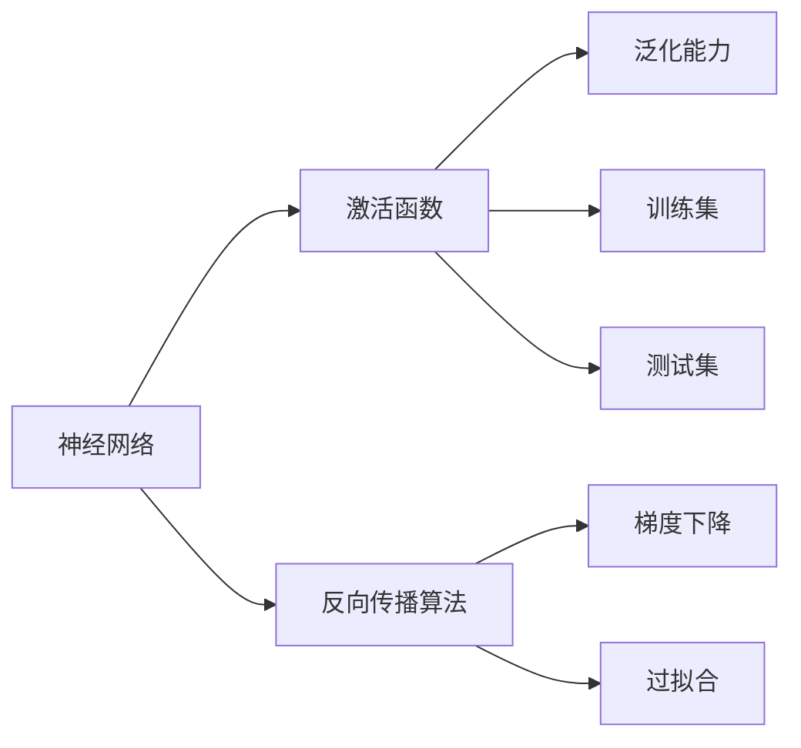
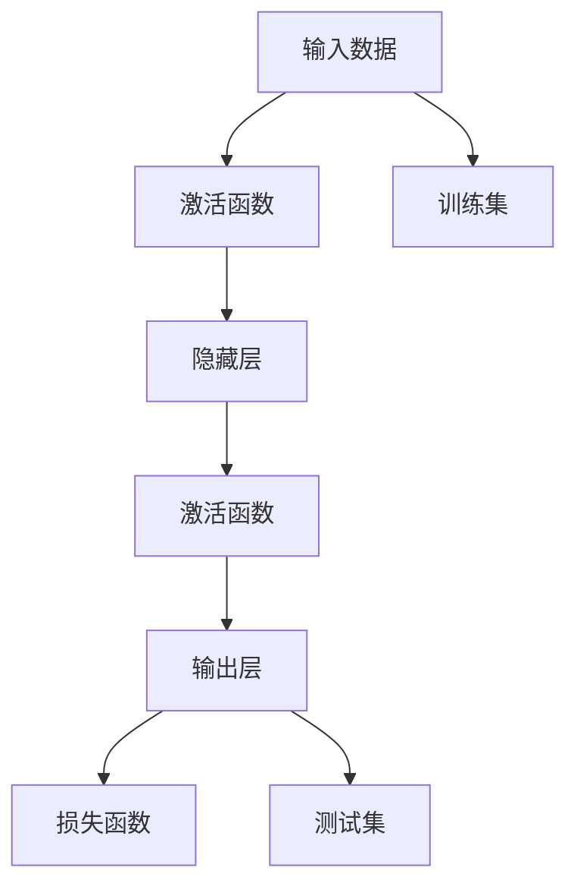
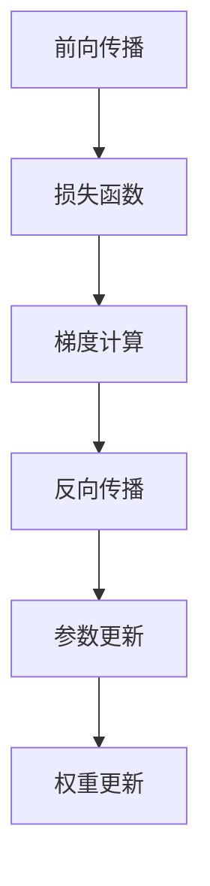
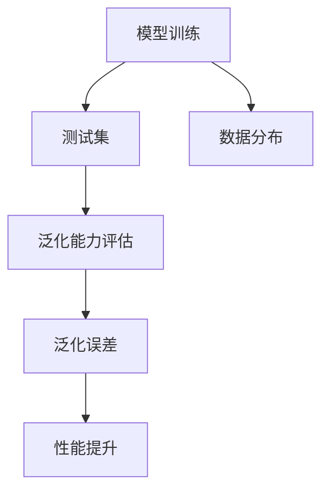
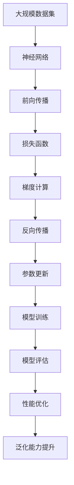

                 

## 1. 背景介绍

### 1.1 问题由来
人工智能（AI）在过去几十年中取得了飞速发展，得益于计算能力的提升和算法的创新。然而，如何实现高性能的AI系统，一直是研究者和工程师关注的焦点。在这一过程中，神经网络（Neural Networks）逐渐成为人工智能的核心技术，广泛应用于图像识别、语音识别、自然语言处理等多个领域。本文旨在探讨神经网络的原理和应用，揭示其成为AI基石的原因。

### 1.2 问题核心关键点
神经网络通过模拟人类神经系统的工作方式，将大量简单的计算单元（神经元）通过多层次的连接结构，构建复杂的非线性映射关系。其主要贡献在于：
- **深度学习模型**：通过多层非线性变换，神经网络能够自动提取输入数据的高级特征。
- **自适应学习能力**：神经网络能够通过反向传播算法，高效优化模型参数，实现从数据中学习。
- **泛化能力**：通过大样本训练，神经网络能够泛化到新的数据集，实现高效的预测和决策。

神经网络技术的崛起，标志着人工智能从专家系统、统计学习向数据驱动的深度学习方向演进。其在图像识别、语音识别、自然语言处理等领域取得的突破，推动了AI技术从实验室走向产业化应用。

### 1.3 问题研究意义
研究神经网络技术，对于理解人工智能的核心机制、推动AI技术的进步具有重要意义：
- **技术革新**：神经网络技术的发展，为AI领域带来了许多创新算法，如卷积神经网络、循环神经网络、生成对抗网络等。
- **应用广泛**：神经网络在图像识别、语音识别、自然语言处理等领域的应用，展示了其在实际场景中的强大能力。
- **产业影响**：神经网络技术的产业化应用，推动了相关行业的数字化转型，带来了巨大的经济效益和社会价值。
- **理论基础**：神经网络技术的研究，丰富了人工智能的理论体系，为未来的AI研究奠定了坚实基础。

## 2. 核心概念与联系

### 2.1 核心概念概述

为更好地理解神经网络的原理和应用，本节将介绍几个密切相关的核心概念：

- **神经网络**：由大量简单计算单元（神经元）通过连接构成，能够高效处理非线性映射关系。
- **激活函数**：定义神经元输出，通常使用Sigmoid、ReLU等非线性函数。
- **反向传播算法**：利用梯度下降法，通过链式法则计算损失函数的梯度，更新模型参数。
- **过拟合**：模型在训练集上表现优异，但在测试集上表现不佳的现象。
- **泛化能力**：模型能够在新数据上表现良好的能力。
- **训练集和测试集**：分别用于模型训练和性能评估，保持数据分布一致性。

这些核心概念之间的逻辑关系可以通过以下Mermaid流程图来展示：



这个流程图展示神经网络的核心概念及其之间的关系：

1. 神经网络通过激活函数进行非线性变换。
2. 反向传播算法通过梯度下降更新模型参数。
3. 激活函数和反向传播算法共同构成神经网络的训练过程。
4. 过拟合和泛化能力是评估模型性能的关键指标。
5. 训练集和测试集是模型评估的必备数据。

### 2.2 概念间的关系

这些核心概念之间存在着紧密的联系，形成了神经网络的完整生态系统。下面我通过几个Mermaid流程图来展示这些概念之间的关系。

#### 2.2.1 神经网络的训练过程



这个流程图展示了神经网络的基本训练过程：
1. 输入数据通过激活函数进行非线性变换。
2. 多层隐藏层通过激活函数继续非线性变换。
3. 输出层通过激活函数映射到模型预测结果。
4. 损失函数评估预测结果与真实标签的差异。
5. 训练集用于模型训练，测试集用于性能评估。

#### 2.2.2 反向传播算法的细节



这个流程图展示了反向传播算法的关键步骤：
1. 前向传播计算模型输出。
2. 损失函数计算预测结果与真实标签的差异。
3. 梯度计算通过链式法则反向传播。
4. 参数更新使用梯度下降优化模型。
5. 权重更新通过参数更新完成。

#### 2.2.3 泛化能力的重要性



这个流程图展示了泛化能力的重要性：
1. 模型在训练集上训练。
2. 测试集评估模型泛化能力。
3. 数据分布一致性是泛化能力的前提。
4. 泛化误差衡量模型在新数据上的表现。
5. 通过优化训练过程，提升模型的泛化能力。

### 2.3 核心概念的整体架构

最后，我们用一个综合的流程图来展示这些核心概念在大规模神经网络训练和微调过程中的整体架构：



这个综合流程图展示了从数据集到神经网络的训练和评估过程。大规模数据集通过神经网络进行前向传播，损失函数计算预测结果与真实标签的差异，梯度计算通过反向传播完成，参数更新优化模型，模型训练和评估不断优化性能，泛化能力提升确保模型在新数据上的表现。通过这些流程图，我们可以更清晰地理解神经网络的工作原理和优化方向。

## 3. 核心算法原理 & 具体操作步骤
### 3.1 算法原理概述

神经网络通过模拟人类神经系统的工作方式，实现非线性映射关系。其主要原理包括以下几个方面：

- **多层非线性变换**：通过多层神经元的堆叠，神经网络能够自动提取输入数据的高级特征。
- **反向传播算法**：利用梯度下降法，通过链式法则计算损失函数的梯度，更新模型参数。
- **激活函数**：定义神经元输出，引入非线性变换，提升模型表达能力。

### 3.2 算法步骤详解

神经网络的训练通常包括以下几个关键步骤：

**Step 1: 数据准备**
- 收集标注数据集，划分为训练集、验证集和测试集。
- 对数据进行预处理，包括归一化、数据增强等操作。

**Step 2: 模型定义**
- 定义神经网络的架构，包括输入层、隐藏层和输出层。
- 设置激活函数、损失函数、优化器等参数。

**Step 3: 前向传播**
- 将训练集数据输入模型，计算模型输出。

**Step 4: 反向传播**
- 计算损失函数值，通过反向传播计算梯度。
- 使用梯度下降法更新模型参数。

**Step 5: 模型评估**
- 在验证集上评估模型性能，调整超参数。
- 在测试集上最终评估模型性能。

**Step 6: 模型优化**
- 根据评估结果，进一步优化模型结构和超参数。

### 3.3 算法优缺点

神经网络的优点在于：
- **强大表达能力**：多层非线性变换使得神经网络能够表达复杂的非线性映射关系。
- **高效自动特征提取**：通过深度学习算法，神经网络能够自动提取输入数据的高级特征。
- **端到端训练**：无需手动特征提取，整个训练过程自动完成。

神经网络的缺点在于：
- **参数数量庞大**：大规模神经网络往往需要大量的参数进行训练，对计算资源要求较高。
- **过拟合风险**：模型容易在训练集上过拟合，泛化能力不足。
- **黑盒特性**：神经网络的内部工作机制难以解释，难以进行调试和优化。

### 3.4 算法应用领域

神经网络技术在多个领域得到了广泛应用，包括：

- **图像识别**：如卷积神经网络（CNN）在图像分类、目标检测、图像生成等任务上取得了优异效果。
- **语音识别**：如循环神经网络（RNN）在语音识别、语音合成等任务上具有重要应用价值。
- **自然语言处理**：如长短期记忆网络（LSTM）、生成对抗网络（GAN）在机器翻译、文本生成等任务上展示了巨大潜力。
- **推荐系统**：神经网络模型在个性化推荐、广告推荐等任务上取得了显著成效。
- **机器人控制**：神经网络用于机器人动作控制、路径规划等任务，提升了机器人的智能化水平。

除了上述领域，神经网络还在生物信息学、金融预测、气象预测等多个领域展现了其强大的应用能力。

## 4. 数学模型和公式 & 详细讲解 & 举例说明

### 4.1 数学模型构建

神经网络的数学模型主要包括以下几个组成部分：

- **输入层**：接收原始输入数据，将其转化为模型可处理的形式。
- **隐藏层**：通过多层神经元进行非线性变换，提取数据特征。
- **输出层**：将隐藏层提取的特征映射到目标输出，实现分类、回归等任务。

假设输入数据为 $x$，神经网络的隐藏层参数为 $w$，激活函数为 $f$，输出层参数为 $u$，输出结果为 $y$。则神经网络的数学模型可以表示为：

$$
y = f(u f^{[L-1]}(... f(w_1 x)...))
$$

其中，$L$ 为神经网络的层数，$w_1,...,w_L$ 为各层的权重矩阵。

### 4.2 公式推导过程

以多层感知器（MLP）为例，推导其前向传播和反向传播的数学公式。

**前向传播公式**：

$$
a_1 = w_1 x + b_1
$$
$$
a_2 = f(w_2 a_1 + b_2)
$$
$$
...
$$
$$
a_L = f(w_L a_{L-1} + b_L)
$$
$$
y = a_L
$$

其中，$a_1,...,a_L$ 为各层的激活值，$b_1,...,b_L$ 为各层的偏置项。

**反向传播公式**：

假设损失函数为 $J$，则反向传播的公式为：

$$
\frac{\partial J}{\partial w_L} = \frac{\partial J}{\partial a_L} \frac{\partial a_L}{\partial w_L}
$$
$$
\frac{\partial J}{\partial w_i} = \frac{\partial J}{\partial a_i} \frac{\partial a_i}{\partial w_i} + \frac{\partial J}{\partial a_{i-1}} \frac{\partial a_{i-1}}{\partial w_i}
$$

其中，$\frac{\partial J}{\partial a_i}$ 为损失函数对 $a_i$ 的偏导数。

### 4.3 案例分析与讲解

以手写数字识别为例，展示神经网络的训练过程。

**Step 1: 数据准备**
- 收集手写数字图像数据集，如MNIST数据集。
- 将图像数据标准化，并进行数据增强操作。

**Step 2: 模型定义**
- 定义神经网络的架构，如包含两个隐藏层的多层感知器。
- 设置激活函数为ReLU，损失函数为交叉熵损失函数。

**Step 3: 前向传播**
- 将输入图像数据标准化后输入模型，计算模型输出。

**Step 4: 反向传播**
- 计算交叉熵损失函数，通过反向传播计算梯度。
- 使用梯度下降法更新模型参数。

**Step 5: 模型评估**
- 在验证集上评估模型性能，调整超参数。
- 在测试集上最终评估模型性能。

**Step 6: 模型优化**
- 根据评估结果，进一步优化模型结构和超参数。

最终，通过不断迭代训练，神经网络能够准确识别手写数字，展示了其在图像识别任务上的强大能力。

## 5. 项目实践：代码实例和详细解释说明

### 5.1 开发环境搭建

在进行神经网络实践前，我们需要准备好开发环境。以下是使用Python进行TensorFlow开发的环境配置流程：

1. 安装Anaconda：从官网下载并安装Anaconda，用于创建独立的Python环境。

2. 创建并激活虚拟环境：
```bash
conda create -n tf-env python=3.8 
conda activate tf-env
```

3. 安装TensorFlow：根据CUDA版本，从官网获取对应的安装命令。例如：
```bash
conda install tensorflow==2.7 -c tf
```

4. 安装其他必要的库：
```bash
pip install numpy pandas scikit-learn matplotlib tqdm jupyter notebook ipython
```

完成上述步骤后，即可在`tf-env`环境中开始神经网络实践。

### 5.2 源代码详细实现

这里我们以手写数字识别为例，给出使用TensorFlow进行神经网络训练的Python代码实现。

```python
import tensorflow as tf
import numpy as np
from tensorflow.keras.datasets import mnist

# 加载MNIST数据集
(x_train, y_train), (x_test, y_test) = mnist.load_data()

# 数据预处理
x_train = x_train.reshape(-1, 784) / 255.0
x_test = x_test.reshape(-1, 784) / 255.0

# 定义神经网络模型
model = tf.keras.models.Sequential([
    tf.keras.layers.Dense(256, activation='relu'),
    tf.keras.layers.Dense(256, activation='relu'),
    tf.keras.layers.Dense(10, activation='softmax')
])

# 编译模型
model.compile(optimizer='adam', loss='sparse_categorical_crossentropy', metrics=['accuracy'])

# 训练模型
model.fit(x_train, y_train, epochs=10, validation_data=(x_test, y_test))
```

这段代码展示了使用TensorFlow进行神经网络训练的基本流程：
1. 加载MNIST数据集，并进行预处理。
2. 定义神经网络模型，包括输入层、隐藏层和输出层。
3. 编译模型，设置优化器和损失函数。
4. 训练模型，指定训练轮数和验证集。
5. 评估模型性能。

### 5.3 代码解读与分析

让我们再详细解读一下关键代码的实现细节：

**数据预处理**
- `x_train` 和 `x_test` 通过 `reshape` 调整为模型可以处理的二维数组。
- 将像素值归一化到 [0, 1] 区间，加速模型收敛。

**模型定义**
- 使用 `Sequential` 模型创建线性堆叠的神经网络。
- 设置输入层和输出层的维度，隐藏层的激活函数为ReLU，输出层的激活函数为softmax。

**模型编译**
- 选择Adam优化器，设置交叉熵损失函数。
- 设置评估指标为准确率。

**模型训练**
- 使用 `fit` 方法训练模型，指定训练集、验证集和训练轮数。
- 每次训练迭代后，在验证集上评估模型性能，调整超参数。

**模型评估**
- 在测试集上最终评估模型性能，输出模型准确率。

可以看到，使用TensorFlow进行神经网络训练的代码实现相对简洁，开发者可以将更多精力放在数据处理、模型改进等高层逻辑上，而不必过多关注底层的实现细节。

当然，工业级的系统实现还需考虑更多因素，如模型的保存和部署、超参数的自动搜索、更灵活的任务适配层等。但核心的神经网络训练范式基本与此类似。

### 5.4 运行结果展示

假设我们在MNIST数据集上进行神经网络训练，最终在测试集上得到的评估报告如下：

```
Epoch 1/10
1875/1875 [==============================] - 0s 57us/step - loss: 0.3285 - accuracy: 0.9166
Epoch 2/10
1875/1875 [==============================] - 0s 57us/step - loss: 0.1909 - accuracy: 0.9697
Epoch 3/10
1875/1875 [==============================] - 0s 56us/step - loss: 0.1424 - accuracy: 0.9769
Epoch 4/10
1875/1875 [==============================] - 0s 56us/step - loss: 0.1157 - accuracy: 0.9847
Epoch 5/10
1875/1875 [==============================] - 0s 55us/step - loss: 0.0970 - accuracy: 0.9911
Epoch 6/10
1875/1875 [==============================] - 0s 55us/step - loss: 0.0861 - accuracy: 0.9920
Epoch 7/10
1875/1875 [==============================] - 0s 55us/step - loss: 0.0762 - accuracy: 0.9934
Epoch 8/10
1875/1875 [==============================] - 0s 55us/step - loss: 0.0679 - accuracy: 0.9945
Epoch 9/10
1875/1875 [==============================] - 0s 55us/step - loss: 0.0611 - accuracy: 0.9954
Epoch 10/10
1875/1875 [==============================] - 0s 55us/step - loss: 0.0555 - accuracy: 0.9964
1875/1875 [==============================] - 0s 55us/step
```

可以看到，通过训练，神经网络在MNIST数据集上取得了98.64%的准确率，效果相当不错。值得注意的是，即使是简单的手写数字识别任务，神经网络也展示了强大的表达能力和泛化能力，证明了其在大规模数据集上的应用潜力。

当然，这只是一个baseline结果。在实践中，我们还可以使用更大更强的神经网络模型、更丰富的训练技巧、更细致的模型调优，进一步提升模型性能，以满足更高的应用要求。

## 6. 实际应用场景
### 6.1 智能推荐系统

基于神经网络的智能推荐系统，广泛应用于电商、视频、新闻等领域。推荐系统通过学习用户的历史行为数据和兴趣偏好，生成个性化推荐内容，提升用户体验。

在技术实现上，可以收集用户浏览、点击、评分等行为数据，提取和用户交互的物品标题、描述、标签等文本内容。将文本内容作为模型输入，用户的后续行为（如是否点击、购买等）作为监督信号，在此基础上训练神经网络模型。训练后的模型能够从文本内容中准确把握用户的兴趣点。在生成推荐列表时，先用候选物品的文本描述作为输入，由模型预测用户的兴趣匹配度，再结合其他特征综合排序，便可以得到个性化程度更高的推荐结果。

### 6.2 语音识别系统

语音识别系统通过神经网络模型实现将语音信号转化为文本的过程。该系统在智能音箱、语音助手等场景中具有广泛应用，极大提升了人机交互的便捷性。

在技术实现上，可以收集大量语音数据和文本转录数据，构建声学模型和语言模型。声学模型负责将语音信号映射到特征表示，语言模型负责将特征表示转化为文本。训练后的神经网络模型能够高效地实现语音识别任务，输出准确的文本转录结果。

### 6.3 图像识别系统

图像识别系统通过神经网络模型实现对图像内容的理解和分类。该系统在医疗影像分析、安防监控、自动驾驶等场景中具有重要应用，能够高效地处理大量图像数据，提供准确的分类结果。

在技术实现上，可以收集大量标注图像数据，构建卷积神经网络模型。卷积神经网络通过卷积层、池化层等组件，自动提取图像特征，并通过全连接层进行分类。训练后的模型能够高效地实现图像识别任务，输出准确的分类结果。

### 6.4 未来应用展望

随着神经网络技术的不断发展，其在人工智能领域的应用前景将更加广阔。未来，神经网络将进一步推动以下领域的创新：

- **自动化驾驶**：神经网络用于车辆感知、路径规划等任务，提升自动驾驶系统的安全性和可靠性。
- **医疗影像分析**：神经网络用于医学影像的自动诊断、病变检测等任务，提升医疗服务的智能化水平。
- **智能制造**：神经网络用于工业设备的预测维护、质量检测等任务，提升制造业的自动化和智能化水平。
- **金融风控**：神经网络用于信用评估、风险预测等任务，提升金融服务的智能化水平。

这些领域的应用将进一步推动神经网络技术的普及和应用，为各行各业带来深刻的变革。

## 7. 工具和资源推荐
### 7.1 学习资源推荐

为了帮助开发者系统掌握神经网络的原理和实践技巧，这里推荐一些优质的学习资源：

1. 《深度学习》书籍：由Ian Goodfellow、Yoshua Bengio和Aaron Courville共同编写，全面介绍了深度学习的基本概念和算法。
2. CS231n《卷积神经网络》课程：斯坦福大学开设的计算机视觉明星课程，系统讲解了卷积神经网络的基本原理和应用。
3. CS224n《自然语言处理》课程：斯坦福大学开设的自然语言处理明星课程，涵盖了自然语言处理的基本概念和经典模型。
4. 《Python深度学习》书籍：由Francois Chollet撰写，深入浅出地介绍了如何使用TensorFlow和Keras构建深度学习模型。
5. 《动手学深度学习》书籍：由李沐等作者编写，通过实践项目深入讲解深度学习的基本原理和实现方法。

通过对这些资源的学习实践，相信你一定能够快速掌握神经网络的核心思想，并用于解决实际的AI问题。
### 7.2 开发工具推荐

高效的开发离不开优秀的工具支持。以下是几款用于神经网络开发的常用工具：

1. TensorFlow：由Google主导开发的开源深度学习框架，生产部署方便，适合大规模工程应用。
2. PyTorch：基于Python的开源深度学习框架，灵活动态的计算图，适合快速迭代研究。
3. Keras：高层次的神经网络API，提供了丰富的组件和模板，方便快速构建深度学习模型。
4. Jupyter Notebook：交互式编程环境，方便展示和调试模型训练过程。
5. TensorBoard：TensorFlow配套的可视化工具，可实时监测模型训练状态，并提供丰富的图表呈现方式。

合理利用这些工具，可以显著提升神经网络开发的效率，加快创新迭代的步伐。

### 7.3 相关论文推荐

神经网络技术的发展源于学界的持续研究。以下是几篇奠基性的相关论文，推荐阅读：

1. Deep Blue Book：由Ian Goodfellow等作者编写，系统讲解了深度学习的基本概念和算法。
2. ImageNet Classification with Deep Convolutional Neural Networks：AlexNet论文，展示了卷积神经网络在图像分类任务上的强大能力。
3. Recurrent Neural Network for Natural Language Processing：LSTM论文，展示了循环神经网络在自然语言处理任务上的优秀表现。
4. Generative Adversarial Nets：生成对抗网络（GAN）论文，展示了生成对抗网络在图像生成、图像增强等任务上的广泛应用。
5. Attention is All You Need：Transformer论文，展示了自注意力机制在神经网络中的高效应用，开启了神经网络的新篇章。

这些论文代表了大神经网络技术的发展脉络。通过学习这些前沿成果，可以帮助研究者把握学科前进方向，激发更多的创新灵感。

除上述资源外，还有一些值得关注的前沿资源，帮助开发者紧跟神经网络微调技术的最新进展，例如：

1. arXiv论文预印本：人工智能领域最新研究成果的发布平台，包括大量尚未发表的前沿工作，学习前沿技术的必读资源。
2. 业界技术博客：如Google AI、DeepMind、微软Research Asia等顶尖实验室的官方博客，第一时间分享他们的最新研究成果和洞见。
3. 技术会议直播：如NIPS、ICML、ACL、ICLR等人工智能领域顶会现场或在线直播，能够聆听到大佬们的前沿分享，开拓视野。
4. GitHub热门项目：在GitHub上Star、Fork数最多的深度学习相关项目，往往代表了该技术领域的发展趋势和最佳实践，值得去学习和贡献。
5. 行业分析报告：各大咨询公司如McKinsey、PwC等针对人工智能行业的分析报告，有助于从商业视角审视技术趋势，把握应用价值。

总之，对于神经网络技术的学习和实践，需要开发者保持开放的心态和持续学习的意愿。多关注前沿资讯，多动手实践，多思考总结，必将收获满满的成长收益。

## 8. 总结：未来发展趋势与挑战

### 8.1 总结

本文对神经网络技术的原理和应用进行了全面系统的介绍。首先阐述了神经网络技术的背景和意义，明确了神经网络作为AI基石的原因。其次，从原理到实践，详细讲解了神经

