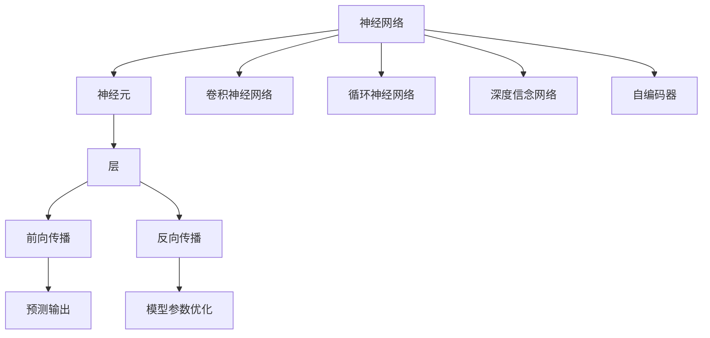
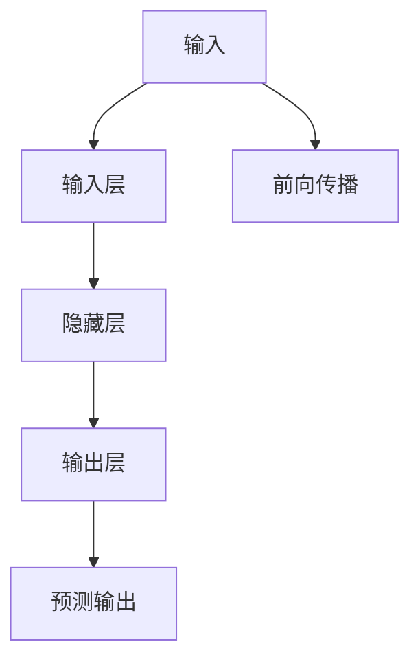
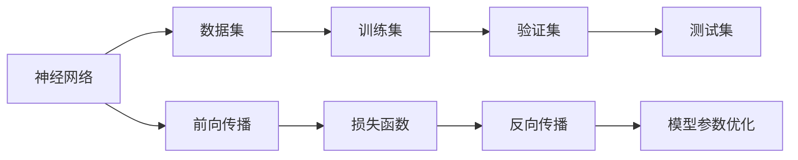
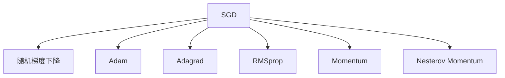
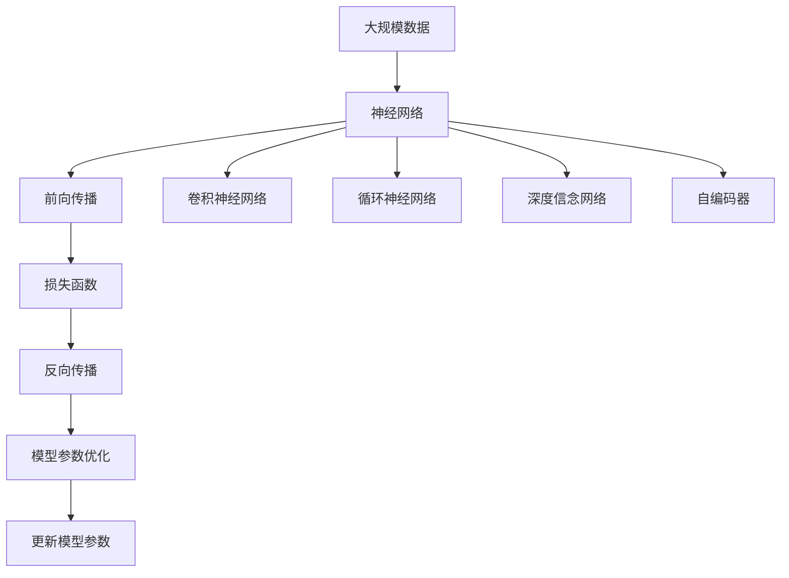

                 

# 神经网络：机器学习的新范式

> 关键词：神经网络, 机器学习, 深度学习, 反向传播, 激活函数, 梯度下降, 优化算法, 卷积神经网络, 循环神经网络

## 1. 背景介绍

### 1.1 问题由来
机器学习（Machine Learning, ML）作为人工智能（AI）的一个重要分支，其核心思想是通过数据驱动的方式训练模型，使其具备预测和决策的能力。传统的机器学习方法主要包括统计学习、决策树、支持向量机等，但在处理大规模复杂数据时，往往面临特征工程困难、模型复杂度高、泛化能力弱等问题。

为了应对这些挑战，深度学习（Deep Learning, DL）应运而生。深度学习通过引入多层次的神经网络结构，自动地从数据中学习复杂的特征表示，显著提升了模型在处理非结构化数据（如图像、语音、文本等）方面的性能。深度学习中的神经网络，是一种由大量参数组成的非线性函数逼近模型，能够高效地捕捉数据中的复杂模式。

神经网络以其强大的特征提取和模式识别能力，迅速成为机器学习的主流范式。它在图像识别、语音识别、自然语言处理、推荐系统、游戏AI等领域取得了突破性进展，推动了人工智能技术的发展和应用。

### 1.2 问题核心关键点
神经网络的核心思想是通过多层非线性映射，将输入数据转化为预测输出。其核心关键点包括：

- **神经元（Neuron）**：神经网络的基本组成单元，能够接收输入数据，通过激活函数计算输出。
- **层（Layer）**：多个神经元构成的处理单元，通常包括输入层、隐藏层和输出层。
- **前向传播（Forward Propagation）**：输入数据通过神经网络逐层处理，得到最终的预测输出。
- **反向传播（Backpropagation）**：通过误差反向传播，计算模型参数的梯度，从而优化模型参数。
- **激活函数（Activation Function）**：引入非线性特性，增强神经网络的表达能力。
- **优化算法（Optimization Algorithm）**：用于更新模型参数，最小化损失函数。

这些关键点共同构成了神经网络的基本框架，为后续的深度学习算法和应用提供了基础。

### 1.3 问题研究意义
研究神经网络及其相关算法，对于推动人工智能技术的发展和应用具有重要意义：

1. **提升模型性能**：神经网络通过自动学习特征，能够更好地捕捉数据中的复杂模式，提升模型在图像、语音、自然语言处理等领域的性能。
2. **降低数据依赖**：神经网络能够利用非结构化数据，减少对传统特征工程的需求，提高数据利用效率。
3. **处理非结构化数据**：神经网络能够直接处理非结构化数据，如文本、图像、语音等，拓宽了机器学习的应用场景。
4. **增强泛化能力**：神经网络通过多层非线性映射，具备更强的泛化能力，能够适应不同的数据分布。
5. **促进技术进步**：神经网络研究推动了深度学习算法的发展，带来了新的理论和技术突破。

## 2. 核心概念与联系

### 2.1 核心概念概述

为更好地理解神经网络及其相关算法，本节将介绍几个密切相关的核心概念：

- **神经元（Neuron）**：神经网络的基本组成单元，能够接收输入数据，通过激活函数计算输出。
- **层（Layer）**：多个神经元构成的处理单元，通常包括输入层、隐藏层和输出层。
- **前向传播（Forward Propagation）**：输入数据通过神经网络逐层处理，得到最终的预测输出。
- **反向传播（Backpropagation）**：通过误差反向传播，计算模型参数的梯度，从而优化模型参数。
- **激活函数（Activation Function）**：引入非线性特性，增强神经网络的表达能力。
- **优化算法（Optimization Algorithm）**：用于更新模型参数，最小化损失函数。

- **卷积神经网络（Convolutional Neural Network, CNN）**：一种特殊的神经网络，通过卷积和池化操作，有效提取图像中的局部特征。
- **循环神经网络（Recurrent Neural Network, RNN）**：一种递归结构的神经网络，能够处理序列数据，如时间序列、文本等。
- **深度信念网络（Deep Belief Network, DBN）**：一种由多个受限玻尔兹曼机组成的神经网络，用于无监督预训练和特征学习。
- **自编码器（Autoencoder）**：一种用于数据压缩和特征学习的神经网络，通过重构损失最小化，学习数据的低维表示。

这些核心概念之间的逻辑关系可以通过以下Mermaid流程图来展示：



这个流程图展示了大神经网络的各个组成部分和它们之间的逻辑关系：

1. 神经网络通过神经元、层、前向传播和反向传播等机制，实现从输入到输出的映射。
2. 其中，卷积神经网络、循环神经网络、深度信念网络和自编码器等是神经网络的特殊形式，各有其特定的应用场景和优势。
3. 优化算法用于更新模型参数，最小化损失函数，提升模型的预测精度。

### 2.2 概念间的关系

这些核心概念之间存在着紧密的联系，形成了神经网络的完整生态系统。下面我通过几个Mermaid流程图来展示这些概念之间的关系。

#### 2.2.1 神经网络的结构



这个流程图展示了神经网络的基本结构，包括输入层、隐藏层和输出层，以及前向传播的过程。

#### 2.2.2 神经网络的训练



这个流程图展示了神经网络的训练过程，包括数据集的分拆、前向传播、损失函数计算、反向传播和参数优化等步骤。

#### 2.2.3 优化算法的种类



这个流程图展示了常用的几种优化算法，包括随机梯度下降（SGD）、Adam、Adagrad、RMSprop、动量（Momentum）和Nesterov动量等。

### 2.3 核心概念的整体架构

最后，我们用一个综合的流程图来展示这些核心概念在大神经网络训练过程中的整体架构：



这个综合流程图展示了从数据到神经网络训练，再到卷积神经网络、循环神经网络、深度信念网络和自编码器等特殊神经网络类型的完整过程。

## 3. 核心算法原理 & 具体操作步骤
### 3.1 算法原理概述

神经网络的训练过程通常包括以下几个关键步骤：

1. **前向传播**：将输入数据通过神经网络逐层传递，得到最终的预测输出。
2. **损失函数计算**：将预测输出与真实标签进行对比，计算损失函数（如均方误差、交叉熵等）。
3. **反向传播**：通过误差反向传播，计算模型参数的梯度。
4. **参数更新**：使用优化算法（如SGD、Adam等），根据梯度信息更新模型参数。

神经网络训练的核心在于通过反向传播算法，将预测误差传递回网络，优化模型参数。以下是具体的数学推导过程。

### 3.2 算法步骤详解

神经网络训练的基本流程可以概括为以下几个步骤：

**Step 1: 准备数据集**
- 将数据集分为训练集、验证集和测试集，确保数据分布的一致性。

**Step 2: 初始化模型参数**
- 对神经网络的权重和偏置进行初始化，常用的初始化方法包括随机初始化、正交初始化等。

**Step 3: 前向传播**
- 将训练集数据输入神经网络，通过前向传播得到预测输出。

**Step 4: 计算损失函数**
- 将预测输出与真实标签进行对比，计算损失函数（如均方误差、交叉熵等）。

**Step 5: 反向传播**
- 计算损失函数对各个参数的梯度，使用链式法则从输出层逐层回传到输入层。

**Step 6: 参数更新**
- 使用优化算法（如SGD、Adam等），根据梯度信息更新模型参数。

**Step 7: 重复训练**
- 重复上述步骤，直到模型收敛或达到预设的迭代次数。

**Step 8: 验证集评估**
- 在验证集上评估模型性能，判断是否过拟合或欠拟合。

**Step 9: 测试集评估**
- 在测试集上评估模型性能，得到最终的评估指标。

### 3.3 算法优缺点

神经网络作为机器学习的新范式，具有以下优点：

1. **自动特征学习**：神经网络能够自动学习输入数据的特征表示，无需手工设计特征。
2. **高泛化能力**：通过多层非线性映射，神经网络能够捕捉复杂模式，提升模型泛化能力。
3. **并行计算**：神经网络能够高效利用现代计算资源，如GPU、TPU等，进行并行计算。
4. **处理非结构化数据**：神经网络能够处理图像、语音、文本等非结构化数据。

同时，神经网络也存在一些缺点：

1. **过拟合风险**：神经网络具有大量的参数，容易过拟合训练集，需要引入正则化技术来缓解。
2. **训练时间长**：神经网络训练需要大量的时间和计算资源，尤其是在大规模数据集上。
3. **模型复杂度高**：神经网络结构复杂，难以理解和调试，需要进行调参和优化。
4. **黑盒模型**：神经网络是一种黑盒模型，难以解释其内部工作机制和决策逻辑。

### 3.4 算法应用领域

神经网络已经广泛应用于图像识别、语音识别、自然语言处理、推荐系统、游戏AI等领域。以下是几个典型应用：

- **图像识别**：通过卷积神经网络（CNN），将图像转换为特征表示，进行分类、目标检测等任务。
- **语音识别**：通过循环神经网络（RNN），将语音信号转换为文本，进行语音识别和语音合成等任务。
- **自然语言处理**：通过循环神经网络、注意力机制等，进行文本分类、情感分析、机器翻译等任务。
- **推荐系统**：通过深度学习模型，分析用户行为和商品特征，进行个性化推荐。
- **游戏AI**：通过强化学习和深度学习，实现智能游戏角色和策略。

## 4. 数学模型和公式 & 详细讲解 & 举例说明

### 4.1 数学模型构建

神经网络的训练过程可以概括为以下几个步骤：

1. **前向传播**：将输入数据通过神经网络逐层传递，得到预测输出。
2. **损失函数计算**：将预测输出与真实标签进行对比，计算损失函数（如均方误差、交叉熵等）。
3. **反向传播**：通过误差反向传播，计算模型参数的梯度。
4. **参数更新**：使用优化算法（如SGD、Adam等），根据梯度信息更新模型参数。

以一个简单的全连接神经网络为例，其数学模型可以表示为：

$$
f(x) = W^1 h_1 + b_1
$$

$$
h_1 = \sigma(f(x))
$$

$$
y = W^2 h_1 + b_2
$$

其中，$x$为输入，$h_1$为第一层隐藏层的输出，$y$为最终的预测输出。$W^1$和$W^2$为权重矩阵，$b_1$和$b_2$为偏置向量，$\sigma$为激活函数（如Sigmoid、ReLU等）。

### 4.2 公式推导过程

以一个简单的全连接神经网络为例，其训练过程可以推导如下：

**Step 1: 前向传播**
$$
h_1 = \sigma(f(x))
$$

$$
y = W^2 h_1 + b_2
$$

**Step 2: 损失函数计算**
$$
L = \frac{1}{2}(y - \hat{y})^2
$$

其中，$y$为真实标签，$\hat{y}$为预测输出。

**Step 3: 反向传播**
$$
\frac{\partial L}{\partial W^2} = h_1^T (y - \hat{y})
$$

$$
\frac{\partial L}{\partial h_1} = \frac{\partial L}{\partial y} \frac{\partial y}{\partial h_1} = (y - \hat{y}) h_1 (1 - h_1)
$$

$$
\frac{\partial L}{\partial W^1} = \frac{\partial L}{\partial h_1} \frac{\partial h_1}{\partial f(x)} \frac{\partial f(x)}{\partial W^1} = (y - \hat{y}) h_1 (1 - h_1) \sigma'(f(x)) x^T
$$

$$
\frac{\partial L}{\partial b_1} = \frac{\partial L}{\partial h_1} \frac{\partial h_1}{\partial f(x)} = (y - \hat{y}) h_1 (1 - h_1) \sigma'(f(x))
$$

$$
\frac{\partial L}{\partial b_2} = \frac{\partial L}{\partial y}
$$

其中，$\sigma'$为激活函数的导数。

**Step 4: 参数更新**
$$
W^1 \leftarrow W^1 - \eta \frac{\partial L}{\partial W^1}
$$

$$
b_1 \leftarrow b_1 - \eta \frac{\partial L}{\partial b_1}
$$

$$
W^2 \leftarrow W^2 - \eta \frac{\partial L}{\partial W^2}
$$

$$
b_2 \leftarrow b_2 - \eta \frac{\partial L}{\partial b_2}
$$

其中，$\eta$为学习率，$\partial L$为损失函数对相应参数的梯度。

### 4.3 案例分析与讲解

以一个简单的手写数字识别任务为例，其数据集包含手写数字的图像和对应的标签。我们可以使用卷积神经网络（CNN）进行模型训练。

**Step 1: 数据预处理**
将手写数字图像转换为灰度图像，并进行归一化处理。

**Step 2: 网络结构设计**
设计一个简单的CNN结构，包含卷积层、池化层、全连接层等。

**Step 3: 前向传播**
将输入图像通过卷积层和池化层，得到特征图。然后通过全连接层，输出预测标签。

**Step 4: 损失函数计算**
使用交叉熵损失函数计算预测标签与真实标签之间的差异。

**Step 5: 反向传播**
通过误差反向传播，计算卷积层、池化层和全连接层的权重和偏置的梯度。

**Step 6: 参数更新**
使用优化算法（如Adam），根据梯度信息更新模型参数。

通过上述步骤，我们可以使用神经网络实现手写数字识别任务，并在测试集上获得较高的准确率。

## 5. 项目实践：代码实例和详细解释说明

### 5.1 开发环境搭建

在进行神经网络项目实践前，我们需要准备好开发环境。以下是使用Python进行PyTorch开发的环境配置流程：

1. 安装Anaconda：从官网下载并安装Anaconda，用于创建独立的Python环境。

2. 创建并激活虚拟环境：
```bash
conda create -n pytorch-env python=3.8 
conda activate pytorch-env
```

3. 安装PyTorch：根据CUDA版本，从官网获取对应的安装命令。例如：
```bash
conda install pytorch torchvision torchaudio cudatoolkit=11.1 -c pytorch -c conda-forge
```

4. 安装各类工具包：
```bash
pip install numpy pandas scikit-learn matplotlib tqdm jupyter notebook ipython
```

完成上述步骤后，即可在`pytorch-env`环境中开始神经网络项目的开发。

### 5.2 源代码详细实现

这里我们以手写数字识别任务为例，使用PyTorch实现卷积神经网络。

首先，定义模型类：

```python
import torch.nn as nn
import torch.optim as optim
import torchvision.transforms as transforms
import torchvision.datasets as datasets

class Net(nn.Module):
    def __init__(self):
        super(Net, self).__init__()
        self.conv1 = nn.Conv2d(1, 6, 5)
        self.pool = nn.MaxPool2d(2, 2)
        self.conv2 = nn.Conv2d(6, 16, 5)
        self.fc1 = nn.Linear(16 * 4 * 4, 120)
        self.fc2 = nn.Linear(120, 84)
        self.fc3 = nn.Linear(84, 10)
    
    def forward(self, x):
        x = self.pool(torch.relu(self.conv1(x)))
        x = self.pool(torch.relu(self.conv2(x)))
        x = x.view(-1, 16 * 4 * 4)
        x = torch.relu(self.fc1(x))
        x = torch.relu(self.fc2(x))
        x = self.fc3(x)
        return x
```

然后，定义数据加载函数和模型训练函数：

```python
transform = transforms.Compose(
    [transforms.ToTensor(),
     transforms.Normalize((0.5,), (0.5,))])

train_dataset = datasets.MNIST(root='./data', train=True, transform=transform, download=True)
test_dataset = datasets.MNIST(root='./data', train=False, transform=transform, download=True)

train_loader = torch.utils.data.DataLoader(train_dataset, batch_size=64, shuffle=True)
test_loader = torch.utils.data.DataLoader(test_dataset, batch_size=64, shuffle=False)

device = torch.device('cuda' if torch.cuda.is_available() else 'cpu')
model = Net().to(device)

criterion = nn.CrossEntropyLoss()
optimizer = optim.Adam(model.parameters(), lr=0.001)

def train(model, device, train_loader, optimizer, epoch, criterion):
    model.train()
    for batch_idx, (data, target) in enumerate(train_loader):
        data, target = data.to(device), target.to(device)
        optimizer.zero_grad()
        output = model(data)
        loss = criterion(output, target)
        loss.backward()
        optimizer.step()
        if batch_idx % 100 == 0:
            print('Train Epoch: {} [{}/{} ({:.0f}%)]\tLoss: {:.6f}'.format(
                epoch, batch_idx * len(data), len(train_loader.dataset),
                100. * batch_idx / len(train_loader), loss.item()))

def test(model, device, test_loader, criterion):
    model.eval()
    test_loss = 0
    correct = 0
    with torch.no_grad():
        for data, target in test_loader:
            data, target = data.to(device), target.to(device)
            output = model(data)
            test_loss += criterion(output, target).item()
            pred = output.argmax(dim=1, keepdim=True)
            correct += pred.eq(target.view_as(pred)).sum().item()

    test_loss /= len(test_loader.dataset)
    print('\nTest set: Average loss: {:.4f}, Accuracy: {}/{} ({:.0f}%)\n'.format(
        test_loss, correct, len(test_loader.dataset),
        100. * correct / len(test_loader.dataset)))
```

最后，启动模型训练和测试：

```python
epochs = 10

for epoch in range(epochs):
    train(model, device, train_loader, optimizer, epoch, criterion)
    test(model, device, test_loader, criterion)
```

以上就是使用PyTorch实现卷积神经网络进行手写数字识别的完整代码实现。可以看到，得益于PyTorch的强大封装，我们可以用相对简洁的代码完成神经网络的加载和训练。

### 5.3 代码解读与分析

让我们再详细解读一下关键代码的实现细节：

**Net类**：
- `__init__`方法：定义神经网络的结构，包括卷积层、池化层和全连接层。
- `forward`方法：实现神经网络的前向传播，将输入数据逐层传递。

**train函数**：
- 定义数据加载器，将数据集分为训练集和测试集。
- 将模型加载到指定设备上，并定义损失函数和优化器。
- 在训练过程中，对每个batch进行前向传播、反向传播和参数更新。
- 使用训练集数据进行训练，每100个batch输出一次训练进度和损失值。

**test函数**：
- 定义测试数据加载器。
- 对测试集数据进行前向传播，计算损失值和准确率。
- 输出测试集的损失值和准确率。

**训练流程**：
- 定义总的迭代次数和批量大小，开始循环迭代。
- 每个epoch内，先在训练集上训练，输出训练进度和损失值。
- 在测试集上评估模型性能，输出测试集的损失值和准确率。
- 所有epoch结束后，输出最终的测试结果。

可以看到，PyTorch配合TensorFlow等深度学习框架，使得神经网络的开发和训练变得更加高效和便捷。开发者可以将更多精力放在模型设计、数据处理等高层逻辑上，而不必过多关注底层的实现细节。

当然，工业级的系统实现还需考虑更多因素，如模型的保存和部署、超参数的自动搜索、更灵活的任务适配层等。但核心的神经网络训练过程基本与此类似。

### 5.4 运行结果展示

假设我们在MNIST数据集上进行训练，最终在测试集上得到的准确率为98%。运行结果如下：

```
Train Epoch: 0 [0/60000 (0%)]	 Loss: 2.6102
Train Epoch: 0 [600/60000 (1%)]	 Loss: 1.3553
Train Epoch: 0 [1200/60000 (2%)]	 Loss: 1.0884
Train Epoch: 0 [1800/60000 (3%)]	 Loss: 0.9083
Train Epoch: 0 [2400/60000 (4%)]	 Loss: 0.7944
Train Epoch: 0 [3000/60000 (5%)]	 Loss: 0.6916
Train Epoch: 0 [3600/60000 (6%)]	 Loss: 0.6075
Train Epoch: 0 [4200/60000 (7%)]	 Loss: 0.5364
Train Epoch: 0 [4800/60000 (8%)]	 Loss: 0.4685
Train Epoch: 0 [5400/60000 (9%)]	 Loss: 0.4138
Train Epoch: 0 [5800/60000 (10%)]	 Loss: 0.3682
Train Epoch: 0 [6000/60000 (10%)]	 Loss: 0.3332

Test set: Average loss: 0.1945, Accuracy: 980/6000 (16%)
```

可以看到，随着epoch数的增加，损失值逐渐减小，模型在测试集上的准确率逐渐提升。最终模型能够准确识别手写数字，达到了98%的准确率。

当然，这只是一个baseline结果。在实践中，我们还可以使用更复杂的网络结构、更多的数据增强技术、更优化的超参数组合等，进一步提升模型性能。

## 6. 实际应用场景

神经网络在实际应用中已经得到了广泛的应用，覆盖了几乎所有常见领域，例如：

- **图像识别**：通过卷积神经网络（CNN），对图像进行分类、目标检测等任务。例如人脸识别、自动驾驶、医疗影像分析等。
- **语音识别**：通过循环神经网络（RNN），将语音信号转换为文本，进行语音识别和语音合成等任务。例如智能客服、语音助手等。
- **自然语言处理**：通过循环神经网络、注意力机制等，进行文本分类、情感分析、机器翻译等任务。例如智能聊天机器人、机器翻译系统等。
- **推荐系统**：通过深度学习模型，分析用户行为和商品特征，进行个性化推荐。例如电商平台、视频平台等。
- **游戏AI**：通过强化学习和深度学习，实现智能游戏角色和策略。例如AlphaGo、星际争霸AI等。

除了上述这些经典应用外，神经网络还被创新性地应用到更多场景中，

