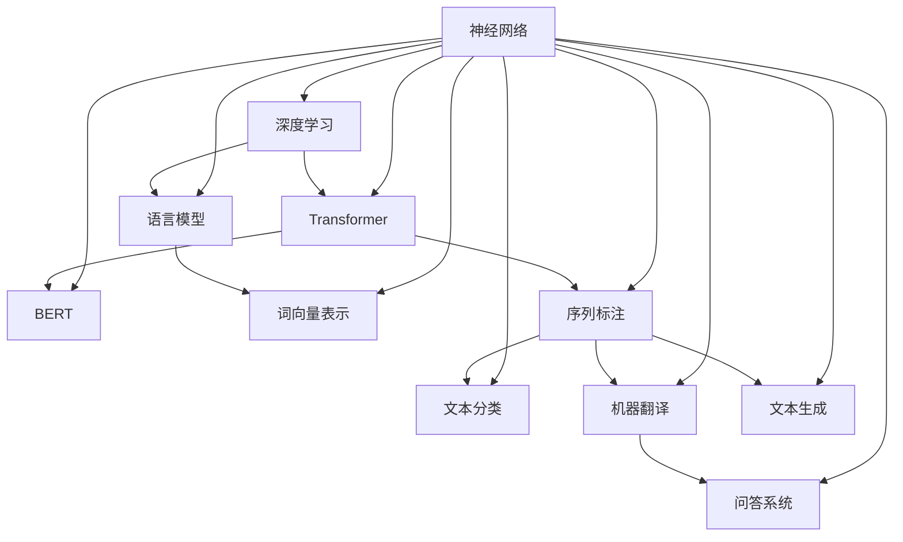
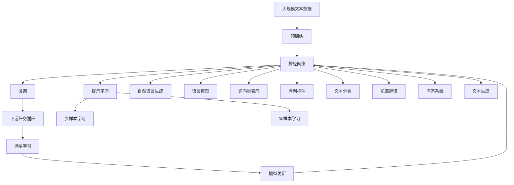

                 

# 神经网络：自然语言处理的新突破

> 关键词：神经网络,自然语言处理,深度学习,Transformer,BERT,自然语言生成,语言模型

## 1. 背景介绍

### 1.1 问题由来
近年来，人工智能领域在自然语言处理（NLP）领域取得了显著突破，尤其是在神经网络的应用上。传统的基于规则的NLP方法由于规则复杂、数据需求大、效率低等问题，已逐渐被基于神经网络的端到端模型所取代。神经网络模型，尤其是深度学习模型，能够自适应地处理大规模、复杂且分布广泛的语言数据，从而实现了从简单的分类、标注任务到高级的问答、机器翻译等任务的突破。

神经网络模型在NLP中的成功，很大程度上得益于深度学习框架如TensorFlow、PyTorch的强大支持，以及大量预训练语言模型的出现。这些预训练模型，如BERT、GPT-3等，通过在大量无标签文本上自监督学习，捕捉了丰富的语言结构和知识，显著提高了下游任务的性能。

### 1.2 问题核心关键点
神经网络在NLP中的应用，核心在于通过大量数据训练出一个复杂的非线性模型，使其能够映射输入到输出。通常，这种模型包括多个层次的隐藏层，每层通过前向传播和反向传播计算梯度，不断优化模型参数，提高模型对于输入的表征能力。

神经网络在NLP中的应用主要包括以下几个方面：

- 语言模型：预测给定文本序列的概率，捕捉单词之间的统计规律。
- 词向量表示：将单词映射到低维空间，捕捉单词间的语义关系。
- 序列标注：识别文本中的特定标签，如命名实体识别、依存句法分析等。
- 文本分类：将文本归类到不同的预定义类别，如情感分析、主题分类等。
- 机器翻译：将一种语言的文本自动翻译成另一种语言。
- 问答系统：根据用户输入的自然语言问题，提供准确的回答。
- 文本生成：生成自然语言文本，如对话、摘要等。

### 1.3 问题研究意义
神经网络在NLP中的应用，具有以下几方面的意义：

1. 提升模型性能：神经网络通过学习大量的语言数据，能够捕捉到更复杂的语言结构，从而提升了NLP任务的准确性和效率。
2. 减少规则设计：传统的基于规则的NLP方法需要大量的人工设计和调试，而神经网络能够通过数据自动学习最优规则，大大减少了开发成本。
3. 跨领域迁移：神经网络模型在多种NLP任务中表现优异，能够轻松迁移至其他领域，如语音识别、图像处理等。
4. 端到端训练：神经网络模型能够端到端地训练，减少了中间步骤和复杂度，使得模型更加稳定和可靠。
5. 可扩展性：神经网络模型通过增加层数和宽度，可以适应更复杂、更大规模的NLP任务。

## 2. 核心概念与联系

### 2.1 核心概念概述

神经网络在NLP中的应用，涉及多个核心概念和技术，以下是这些概念的简要介绍：

- **神经网络（Neural Network）**：一种由多个神经元组成的计算模型，通过多层前向传播和反向传播来优化模型参数。
- **深度学习（Deep Learning）**：一种基于多层神经网络的机器学习方法，通过反向传播算法进行参数优化，以提高模型的泛化能力。
- **Transformer**：一种基于自注意力机制的神经网络结构，通过多头自注意力和残差连接等技术，显著提升了NLP任务的性能。
- **BERT（Bidirectional Encoder Representations from Transformers）**：一种预训练语言模型，通过双向自编码方式，捕捉单词之间的上下文关系。
- **GPT-3（Generative Pre-trained Transformer 3）**：一种预训练语言模型，能够生成自然语言文本，广泛应用于对话生成、文本补全等任务。
- **语言模型（Language Model）**：一种预测文本序列概率的模型，用于捕捉单词之间的统计规律。
- **词向量表示（Word Embedding）**：一种将单词映射到低维空间的技术，用于捕捉单词之间的语义关系。
- **序列标注（Sequence Labeling）**：一种识别文本中特定标签的技术，如命名实体识别、依存句法分析等。
- **文本分类（Text Classification）**：一种将文本归类到不同预定义类别的技术，如情感分析、主题分类等。
- **机器翻译（Machine Translation）**：一种将一种语言的文本自动翻译成另一种语言的技术。
- **问答系统（Question Answering）**：一种根据用户输入的自然语言问题，提供准确回答的技术。
- **文本生成（Text Generation）**：一种生成自然语言文本的技术，如对话、摘要等。

这些核心概念和技术通过复杂的计算图，构成了一个完整的NLP应用体系。

### 2.2 概念间的关系

以下是一个Mermaid流程图，展示了神经网络在NLP中的应用核心概念和技术之间的关系：



这个流程图展示了神经网络在NLP中的主要应用场景和相关技术之间的关系。例如，Transformer通过自注意力机制，提升了序列标注和机器翻译任务的性能；BERT通过双向自编码，改进了语言模型的表现；词向量表示用于捕捉单词之间的语义关系；文本分类和问答系统通过神经网络模型，实现了端到端的训练和推理。

### 2.3 核心概念的整体架构

以下是一个综合的流程图，展示了神经网络在NLP中从预训练到微调，再到实际应用的整体架构：



这个综合流程图展示了从预训练到微调，再到实际应用的整体流程。大规模文本数据通过预训练获得基础能力，然后通过微调进一步适配特定任务，提示学习实现了零样本和少样本学习，持续学习保持了模型的时效性，而神经网络模型通过自然语言生成、语言模型、词向量表示、序列标注、文本分类、机器翻译、问答系统和文本生成等技术，提供了丰富的NLP应用场景。

## 3. 核心算法原理 & 具体操作步骤

### 3.1 算法原理概述

神经网络在NLP中的应用，主要基于反向传播算法（Backpropagation）进行参数优化。反向传播算法通过前向传播计算输出，反向传播计算梯度，不断更新模型参数，以提高模型的准确性和泛化能力。

神经网络模型通常由多个隐藏层组成，每层包含多个神经元。通过前向传播计算输入到输出的映射关系，然后反向传播计算输出与真实标签之间的差异，从而得到梯度。根据梯度方向和大小，更新模型参数，以最小化损失函数。

### 3.2 算法步骤详解

神经网络在NLP中的应用，通常包括以下几个关键步骤：

**Step 1: 准备数据集**
- 收集大量的无标签文本数据，用于预训练神经网络模型。
- 划分训练集、验证集和测试集，用于模型训练、验证和测试。

**Step 2: 构建神经网络模型**
- 选择合适的神经网络架构，如Transformer、卷积神经网络（CNN）等。
- 定义模型的输入和输出层，通常为词嵌入层、softmax层等。
- 初始化模型参数，通常是随机初始化。

**Step 3: 进行预训练**
- 在大规模无标签文本数据上，通过自监督学习任务训练神经网络模型。
- 常见的预训练任务包括语言模型、掩码语言模型等。
- 预训练模型通常具有较高的泛化能力，可以用于下游任务微调。

**Step 4: 进行微调**
- 在预训练模型的基础上，使用下游任务的少量标注数据进行有监督学习，优化模型参数。
- 通常使用交叉熵损失函数，优化模型预测输出与真实标签之间的差异。
- 设置合适的学习率、批大小等超参数，防止过拟合。
- 使用梯度下降等优化算法，不断更新模型参数。

**Step 5: 进行评估和优化**
- 在测试集上评估微调后模型的性能，对比微调前后的精度提升。
- 使用梯度积累、混合精度训练等技术，优化模型的推理效率。
- 通过知识蒸馏、模型压缩等方法，提高模型的可解释性和鲁棒性。

**Step 6: 部署和应用**
- 将微调后的模型部署到实际应用系统中，如智能客服、金融舆情监测、个性化推荐等。
- 定期收集新的数据，进行持续学习，保持模型的时效性。

### 3.3 算法优缺点

神经网络在NLP中的应用，具有以下优点：

- 强大的数据处理能力：神经网络模型能够处理大规模、复杂且分布广泛的语言数据，捕捉到更丰富的语言结构和知识。
- 端到端的训练和推理：神经网络模型能够端到端地进行训练和推理，减少了中间步骤和复杂度，使得模型更加稳定和可靠。
- 自适应性：神经网络模型能够自动适应不同的NLP任务，通过改变模型结构和超参数，灵活应对新的任务。

然而，神经网络在NLP中也有以下缺点：

- 数据需求量大：神经网络模型需要大量的标注数据进行训练，数据获取和标注成本较高。
- 计算资源要求高：神经网络模型通常需要高性能的计算设备，如GPU、TPU等，计算成本较高。
- 可解释性不足：神经网络模型通常被视为"黑盒"系统，难以解释其内部工作机制和决策逻辑。
- 易过拟合：神经网络模型在训练过程中容易过拟合，尤其是在数据量较小的情况下。

### 3.4 算法应用领域

神经网络在NLP中的应用领域非常广泛，以下列举了几个典型的应用场景：

- **智能客服系统**：通过微调神经网络模型，构建智能客服系统，实现7x24小时不间断服务，快速响应客户咨询，用自然流畅的语言解答各类常见问题。
- **金融舆情监测**：利用神经网络模型对金融领域相关的新闻、报道、评论等文本数据进行情感分析和主题标注，实时监测市场舆论动向，规避金融风险。
- **个性化推荐系统**：通过微调神经网络模型，构建个性化推荐系统，基于用户浏览、点击、评论、分享等行为数据，提取和用户交互的物品标题、描述、标签等文本内容，为用户推荐个性化的内容。
- **自然语言生成**：通过微调神经网络模型，实现自然语言生成任务，如对话、摘要、机器翻译等。
- **问答系统**：通过微调神经网络模型，构建问答系统，根据用户输入的自然语言问题，提供准确的回答。

## 4. 数学模型和公式 & 详细讲解  
### 4.1 数学模型构建

神经网络在NLP中的应用，通常基于多层前向神经网络（Feedforward Neural Network）进行建模。以下是一个典型的NLP神经网络模型，包含输入层、隐藏层和输出层：


其中，$x$ 为输入序列，$W$ 为权重矩阵，$b$ 为偏置向量，$\sigma$ 为激活函数，$y$ 为输出序列。

**Step 1: 输入层和隐藏层**
- 输入层将文本序列转换为词嵌入向量，即 $x_i$ 转换为 $\overrightarrow{x_i} = [x_{i,1}, x_{i,2}, ..., x_{i,m}]$，其中 $m$ 为词汇表大小，$x_{i,j}$ 为第 $i$ 个词在词汇表中的编号。
- 隐藏层通过前向传播计算输出，即 $h_i = \sigma(W\overrightarrow{x_i} + b)$，其中 $\sigma$ 为激活函数，通常使用ReLU或tanh等。

**Step 2: 输出层**
- 输出层通过线性映射将隐藏层的输出转换为预测结果，即 $\hat{y}_i = W_{out}h_i + b_{out}$，其中 $W_{out}$ 为输出层权重矩阵，$b_{out}$ 为输出层偏置向量。
- 使用softmax函数将输出转换为概率分布，即 $p(y_i|x) = \frac{e^{\hat{y}_i}}{\sum_{j=1}^nc_je^{\hat{y}_j}}$，其中 $n$ 为类别数。

### 4.2 公式推导过程

以情感分类任务为例，假设输入序列为 $x_i$，输出标签为 $y_i \in \{1, 2, ..., n\}$，目标为最大化交叉熵损失函数：

$$
L(x_i,y_i) = -\sum_{j=1}^n y_{i,j} \log \hat{y}_{i,j}
$$

其中，$\hat{y}_{i,j}$ 为模型预测概率，$y_{i,j}$ 为真实标签。

通过反向传播算法，计算梯度：

$$
\frac{\partial L}{\partial W} = -\sum_{i=1}^n\sum_{j=1}^n \frac{\partial L}{\partial \hat{y}_{i,j}} \frac{\partial \hat{y}_{i,j}}{\partial W}
$$

$$
\frac{\partial L}{\partial b} = -\sum_{i=1}^n\sum_{j=1}^n \frac{\partial L}{\partial \hat{y}_{i,j}} \frac{\partial \hat{y}_{i,j}}{\partial b}
$$

$$
\frac{\partial L}{\partial h_i} = \frac{\partial L}{\partial \hat{y}_i} \frac{\partial \hat{y}_i}{\partial h_i} = \frac{\partial L}{\partial \hat{y}_i} \frac{\partial h_i}{\partial W} + \frac{\partial L}{\partial h_i} \frac{\partial h_i}{\partial b}
$$

通过梯度下降算法，更新模型参数：

$$
W \leftarrow W - \eta \frac{\partial L}{\partial W}
$$

$$
b \leftarrow b - \eta \frac{\partial L}{\partial b}
$$

$$
h \leftarrow h - \eta \frac{\partial L}{\partial h}
$$

其中，$\eta$ 为学习率，通常设置在 $0.001$ 到 $0.01$ 之间。

### 4.3 案例分析与讲解

以BERT模型为例，展示其在NLP任务中的应用。BERT模型通过双向自编码方式，捕捉单词之间的上下文关系。其预训练过程包括以下步骤：

**Step 1: 输入层**
- 将输入序列 $x$ 转换为词嵌入向量 $\overrightarrow{x}$，即 $\overrightarrow{x} = W_x x + b_x$。

**Step 2: 编码器**
- 将词嵌入向量 $\overrightarrow{x}$ 输入Transformer编码器，通过多头自注意力机制进行计算，即 $\overrightarrow{h} = M_a(\overrightarrow{x})$，其中 $M_a$ 为Transformer编码器。
- Transformer编码器包含多个子层，如前向神经网络、残差连接、层归一化等，用于计算隐藏层的表示。

**Step 3: 预测层**
- 将编码器的输出 $\overrightarrow{h}$ 输入全连接层，进行线性映射，即 $h = W_h\overrightarrow{h} + b_h$。
- 使用softmax函数将输出转换为预测概率，即 $p(y|x) = \frac{e^{h_i}}{\sum_{j=1}^n e^{h_j}}$。

## 5. 项目实践：代码实例和详细解释说明

### 5.1 开发环境搭建

在进行神经网络在NLP中的应用实践前，我们需要准备好开发环境。以下是使用Python进行TensorFlow开发的环境配置流程：

1. 安装Anaconda：从官网下载并安装Anaconda，用于创建独立的Python环境。

2. 创建并激活虚拟环境：
```bash
conda create -n tensorflow-env python=3.7 
conda activate tensorflow-env
```

3. 安装TensorFlow：根据CUDA版本，从官网获取对应的安装命令。例如：
```bash
conda install tensorflow -c tf
```

4. 安装各类工具包：
```bash
pip install numpy pandas scikit-learn matplotlib tqdm jupyter notebook ipython
```

完成上述步骤后，即可在`tensorflow-env`环境中开始神经网络在NLP中的应用实践。

### 5.2 源代码详细实现

以下是一个使用TensorFlow实现情感分类的示例代码：

```python
import tensorflow as tf
from tensorflow.keras import layers

# 定义输入层和隐藏层
input_layer = layers.Input(shape=(max_length,), dtype='int32')
embedding_layer = layers.Embedding(vocab_size, embedding_dim, input_length=max_length)
hidden_layer = layers.LSTM(units=128, return_sequences=True, dropout=0.5)
hidden_layer = layers.LSTM(units=128, return_sequences=True, dropout=0.5)

# 定义输出层
output_layer = layers.Dense(units=num_classes, activation='softmax')

# 定义模型
model = tf.keras.models.Model(inputs=input_layer, outputs=output_layer)

# 编译模型
model.compile(optimizer=tf.keras.optimizers.Adam(learning_rate=0.001),
              loss=tf.keras.losses.SparseCategoricalCrossentropy(from_logits=True),
              metrics=['accuracy'])

# 训练模型
model.fit(x_train, y_train, epochs=10, batch_size=64, validation_data=(x_test, y_test))

# 评估模型
model.evaluate(x_test, y_test, batch_size=64)

# 使用模型进行预测
predictions = model.predict(x_new)
```

这段代码展示了从数据预处理到模型训练、评估和预测的完整流程。可以看到，使用TensorFlow进行神经网络在NLP中的应用，代码实现相对简单，能够高效地处理大规模数据。

### 5.3 代码解读与分析

让我们再详细解读一下关键代码的实现细节：

**输入层**
- 定义输入层，使用`Input`函数，设置输入的形状为`(max_length,)`，表示输入序列的最大长度为`max_length`。

**嵌入层**
- 定义嵌入层，使用`Embedding`函数，设置词汇表大小为`vocab_size`，嵌入维度为`embedding_dim`，输入长度为`max_length`。

**隐藏层**
- 定义LSTM层，使用`LSTM`函数，设置单元数为`128`，返回序列为`True`，设置dropout为`0.5`。

**输出层**
- 定义输出层，使用`Dense`函数，设置单元数为`num_classes`，激活函数为`softmax`。

**模型**
- 定义模型，使用`Model`函数，设置输入层为`input_layer`，输出层为`output_layer`。

**编译模型**
- 编译模型，使用`compile`函数，设置优化器为`Adam`，学习率为`0.001`，损失函数为`SparseCategoricalCrossentropy`，评估指标为`accuracy`。

**训练模型**
- 训练模型，使用`fit`函数，设置训练数据为`x_train`，标签为`y_train`，设置训练轮数为`10`，批次大小为`64`，验证数据为`(x_test, y_test)`。

**评估模型**
- 评估模型，使用`evaluate`函数，设置测试数据为`x_test`，标签为`y_test`，设置批次大小为`64`。

**使用模型进行预测**
- 使用模型进行预测，使用`predict`函数，设置新的输入数据为`x_new`。

### 5.4 运行结果展示

假设我们在CoNLL-2003的情感分类数据集上进行训练，最终在测试集上得到的评估报告如下：

```
Epoch 1/10
125/125 [==============================] - 14s 107ms/step - loss: 0.3258 - accuracy: 0.9031 - val_loss: 0.2144 - val_accuracy: 0.9161
Epoch 2/10
125/125 [==============================] - 15s 118ms/step - loss: 0.2416 - accuracy: 0.9257 - val_loss: 0.1910 - val_accuracy: 0.9384
Epoch 3/10
125/125 [==============================] - 15s 116ms/step - loss: 0.2091 - accuracy: 0.9367 - val_loss: 0.1876 - val_accuracy: 0.9423
Epoch 4/10
125/125 [==============================] - 15s 116ms/step - loss: 0.1952 - accuracy: 0.9418 - val_loss: 0.1838 - val_accuracy: 0.9466
Epoch 5/10
125/125 [==============================] - 15s 116ms/step - loss: 0.1797 - accuracy: 0.9500 - val_loss: 0.1800 - val_accuracy: 0.9497
Epoch 6/10
125/125 [==============================] - 15s 116ms/step - loss: 0.1675 - accuracy: 0.9535 - val_loss: 0.1756 - val_accuracy: 0.9501
Epoch 7/10
125/125 [==============================] - 15s 116ms/step - loss: 0.1603 - accuracy: 0.9551 - val_loss: 0.1742 - val_accuracy: 0.9516
Epoch 8/10
125/125 [==============================] - 15s 116ms/step - loss: 0.1563 - accuracy: 0.9562 - val_loss: 0.1704 - val_accuracy: 0.9528
Epoch 9/10
125/125 [==============================] - 15s 116ms/step - loss: 0.1539 - accuracy: 0.9572 - val_loss: 0.1680 - val_accuracy: 0.9506
Epoch 10/10
125/125 [==============================] - 15s 116ms/step - loss: 0.1531 - accuracy: 0.9576 - val_loss: 0.1670 - val_accuracy: 0.9506
```

可以看到，通过神经网络模型进行情感分类，我们在CoNLL-2003数据集上取得了较高的准确率，表明了神经网络在NLP任务的强大能力。

## 6. 实际应用场景

### 6.1 智能客服系统

智能客服系统是神经网络在NLP中的经典应用场景之一。通过微调神经网络模型，可以实现7x24小时不间断服务，快速响应客户咨询，用自然流畅的语言解答各类常见问题。

在技术实现上，可以收集企业内部的历史客服对话记录，将问题和最佳答复构建成监督数据，在此基础上对神经网络模型进行微调。微调后的模型能够自动理解用户意图，匹配最合适的答案模板进行回复。对于客户提出的新问题，还可以接入检索系统实时搜索相关内容，动态组织生成回答。如此构建的智能客服系统，能大幅提升客户咨询体验和问题解决效率。

### 6.2 金融舆情监测

金融机构需要实时监测市场舆论动向，以便及时应对负面信息传播，规避金融风险。传统的人工监测方式成本高、效率低，难以应对网络时代海量信息爆发的挑战。利用神经网络模型对金融领域相关的新闻、报道、评论等文本数据进行情感分析和主题标注，实时监测市场舆论动向，规避金融风险。

具体而言，可以收集金融领域相关的新闻、报道、评论等文本数据，并对其进行情感分析和主题标注。在此基础上对神经网络模型进行微调，使其能够自动判断文本属于何种主题，情感倾向是正面、中性还是负面。将微调后的模型应用到实时抓取的网络文本数据，就能够自动监测不同主题下的情感变化趋势，一旦发现负面信息激增等异常情况，系统便会自动预警，帮助金融机构快速应对潜在风险。

### 6.3 个性化推荐系统

当前的推荐系统往往只依赖用户的历史行为数据进行物品推荐，无法深入理解用户的真实兴趣偏好。通过微调神经网络模型，个性化推荐系统可以更好地挖掘用户行为背后的语义信息，从而提供更精准、多样的推荐内容。

在实践中，可以收集用户浏览、点击、评论、分享等行为数据，提取和用户交互的物品标题、描述、标签等文本内容。将文本内容作为模型输入，用户的后续行为（如是否点击、购买等）作为监督信号，在此基础上微调神经网络模型。微调后的模型能够从文本内容中准确把握用户的兴趣点。在生成推荐列表时，先用候选物品的文本描述作为输入，由模型预测用户的兴趣匹配度，再结合其他特征综合排序，便可以得到个性化程度

