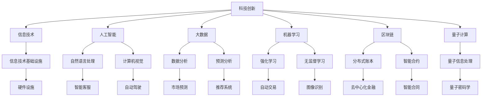

                 

# 科技创新：社会进步的阶梯

> 关键词：科技创新,社会进步,信息技术,人工智能,大数据,机器学习,区块链,量子计算

## 1. 背景介绍

### 1.1 问题由来

随着科技的快速进步，人类社会正在经历前所未有的变革。从蒸汽机的发明到互联网的普及，每一次重大的科技创新都极大地改变了人类的生产方式和生活模式。当前，以人工智能、大数据、区块链为代表的科技创新正在进一步加速这一进程。本文将探讨这些技术如何推动社会进步，以及未来科技创新可能带来的更大影响。

### 1.2 问题核心关键点

科技创新对于社会进步的推动作用体现在多个方面：
- 提高生产效率：通过自动化、智能化生产，减少人力成本，提升产品质量和生产效率。
- 促进经济增长：新技术推动新兴产业的崛起，创造新的就业机会，加速经济增长。
- 改善生活质量：科技创新带来更多便捷和舒适的生活体验，如智能家居、在线教育等。
- 提升社会治理水平：信息技术和大数据分析用于优化社会管理和公共服务。
- 推动科学研究：科技创新手段不断更新，加速科学发现和技术进步。

### 1.3 问题研究意义

了解科技创新如何影响社会进步，对于制定科学的科技政策和规划，以及推动社会的持续健康发展具有重要意义。科技进步带来新的机遇和挑战，需要政府、企业、科研机构和个人共同努力，促进技术的合理应用和普及。

## 2. 核心概念与联系

### 2.1 核心概念概述

为了更好地理解科技创新对社会进步的驱动作用，本文将介绍一些关键概念及其联系：

- **科技创新**：指在技术领域所进行的创新活动，包括理论创新、技术创新和应用创新等。
- **社会进步**：指通过科技进步提高人类生活质量、优化社会结构、提升生产效率、促进经济发展等方面的进步。
- **信息技术**：包括计算机技术、通信技术、网络技术、数据技术等，是推动社会进步的重要力量。
- **人工智能**：通过机器学习、深度学习等技术，使计算机系统具备类人智能，广泛应用于图像识别、自然语言处理等领域。
- **大数据**：通过处理和分析海量数据，提取有价值的信息，用于决策支持和科学研究。
- **机器学习**：指让计算机从数据中学习规律和模式，自动化地改进算法以提升性能。
- **区块链**：一种去中心化的分布式账本技术，用于保障数据安全、透明和不可篡改。
- **量子计算**：利用量子力学的原理，实现计算能力的极大提升，有潜力解决传统计算机无法解决的复杂问题。

这些概念之间相互关联，共同构成了推动社会进步的科技生态系统。

### 2.2 概念间的关系

以下Mermaid流程图展示了这些核心概念之间的关系：



这个流程图展示了科技创新是如何通过多种技术手段，提升信息技术、人工智能、大数据等领域的核心能力，最终推动社会进步。

## 3. 核心算法原理 & 具体操作步骤

### 3.1 算法原理概述

科技创新通常涉及多个领域的跨学科融合。以人工智能为例，其核心算法原理包括：

- **机器学习算法**：包括监督学习、无监督学习、半监督学习、强化学习等，用于从数据中提取规律和模式。
- **深度学习算法**：通过多层神经网络模拟人脑的感知和认知过程，用于图像识别、自然语言处理等复杂任务。
- **强化学习算法**：通过与环境的互动，学习最优策略，用于智能决策和游戏等场景。

这些算法相互配合，形成了人工智能的强大能力，推动了多个行业的创新应用。

### 3.2 算法步骤详解

科技创新的一般步骤包括：

1. **基础研究**：通过科学研究，发现和验证新的理论和技术方法。
2. **技术开发**：基于理论，开发出可行的技术方案和产品原型。
3. **试验验证**：在实验室或实际环境中，验证技术的可行性和效果。
4. **产业应用**：将技术应用于实际生产和服务中，推动社会进步。
5. **优化迭代**：根据应用反馈，不断优化和改进技术，提升性能和可靠性。

### 3.3 算法优缺点

科技创新带来了巨大的经济和社会效益，但也存在一些挑战：

- **优点**：
  - 提高生产效率：自动化技术取代部分人力，减少成本，提高效率。
  - 优化资源配置：大数据和人工智能优化了资源利用率，提升了服务质量。
  - 促进新产业崛起：新兴技术催生了新的产业和就业机会，带动经济增长。
- **缺点**：
  - 技术依赖性：过度依赖技术，可能忽视人的情感和伦理问题。
  - 安全风险：新技术带来新的安全风险，如数据泄露、隐私侵犯等。
  - 就业影响：部分岗位被机器取代，需要重新培训和适应新技术。

### 3.4 算法应用领域

科技创新已经在多个领域得到广泛应用：

- **医疗健康**：AI辅助诊断、基因编辑、智能监控等。
- **金融服务**：智能投顾、反欺诈、量化交易等。
- **教育培训**：在线教育、智能推荐、语言学习等。
- **交通出行**：自动驾驶、智能交通管理、共享经济等。
- **环境保护**：大数据监测、智能检测、节能减排等。

这些应用展示了科技创新如何渗透到各个行业，推动社会进步。

## 4. 数学模型和公式 & 详细讲解 & 举例说明

### 4.1 数学模型构建

以机器学习为例，其核心数学模型包括：

- **监督学习**：模型通过已标注的训练数据，学习输入和输出之间的映射关系。
- **无监督学习**：模型通过未标注的数据，发现数据的内在结构和规律。
- **半监督学习**：结合少量标注数据和大量未标注数据，提升模型性能。
- **强化学习**：模型通过与环境的交互，学习最优策略，用于决策和控制。

### 4.2 公式推导过程

以下以监督学习中的线性回归为例，推导模型公式和梯度下降算法：

假设有一个线性回归模型 $y = \theta_0 + \theta_1x_1 + \theta_2x_2 + ... + \theta_nx_n$，其中 $\theta_0, \theta_1, ..., \theta_n$ 为模型的参数，$x_1, x_2, ..., x_n$ 为输入特征，$y$ 为输出标签。

模型的损失函数为均方误差损失：

$$
L(\theta) = \frac{1}{N}\sum_{i=1}^N(y_i - (\theta_0 + \theta_1x_{i1} + \theta_2x_{i2} + ... + \theta_nx_{in}))^2
$$

梯度下降算法的更新公式为：

$$
\theta_j = \theta_j - \eta\frac{\partial L(\theta)}{\partial \theta_j}
$$

其中，$\eta$ 为学习率，$\frac{\partial L(\theta)}{\partial \theta_j}$ 为损失函数对参数 $\theta_j$ 的偏导数。

### 4.3 案例分析与讲解

以深度学习中的卷积神经网络(CNN)为例，其结构如图：

```
Input Layer (Image)
Convolutional Layer
Pooling Layer
Fully Connected Layer
Output Layer (Class)
```

卷积神经网络通过卷积层、池化层、全连接层等结构，从图像中提取特征，并用于分类任务。卷积层的权重和偏置矩阵通过反向传播算法更新，以最小化损失函数。

## 5. 项目实践：代码实例和详细解释说明

### 5.1 开发环境搭建

为了进行科技创新项目开发，需要准备相应的开发环境。以下是使用Python和PyTorch开发深度学习应用的环境配置流程：

1. 安装Anaconda：从官网下载并安装Anaconda，用于创建独立的Python环境。
2. 创建并激活虚拟环境：
```bash
conda create -n myenv python=3.8
conda activate myenv
```
3. 安装PyTorch：根据CUDA版本，从官网获取对应的安装命令。例如：
```bash
conda install pytorch torchvision torchaudio cudatoolkit=11.1 -c pytorch -c conda-forge
```
4. 安装各类工具包：
```bash
pip install numpy pandas scikit-learn matplotlib tqdm jupyter notebook ipython
```

完成上述步骤后，即可在`myenv`环境中开始科技创新项目的开发。

### 5.2 源代码详细实现

以下是一个简单的深度学习应用实例，用于手写数字识别。

首先，定义数据处理函数：

```python
import numpy as np
from torchvision import datasets, transforms

def load_mnist(data_path):
    train_dataset = datasets.MNIST(data_path, train=True, download=True, transform=transforms.ToTensor())
    test_dataset = datasets.MNIST(data_path, train=False, download=True, transform=transforms.ToTensor())
    return train_dataset, test_dataset
```

然后，定义模型和优化器：

```python
import torch
import torch.nn as nn
import torch.optim as optim

class CNN(nn.Module):
    def __init__(self):
        super(CNN, self).__init__()
        self.conv1 = nn.Conv2d(1, 10, kernel_size=5)
        self.conv2 = nn.Conv2d(10, 20, kernel_size=5)
        self.fc1 = nn.Linear(320, 50)
        self.fc2 = nn.Linear(50, 10)
    
    def forward(self, x):
        x = nn.functional.relu(nn.functional.max_pool2d(nn.functional.relu(self.conv1(x)), (2, 2)))
        x = nn.functional.relu(nn.functional.max_pool2d(nn.functional.relu(self.conv2(x)), (2, 2)))
        x = x.view(-1, 320)
        x = nn.functional.relu(self.fc1(x))
        x = self.fc2(x)
        return nn.functional.log_softmax(x, dim=1)

model = CNN()
optimizer = optim.SGD(model.parameters(), lr=0.001)
```

接着，定义训练和评估函数：

```python
import torch.nn.functional as F

def train_epoch(model, dataset, batch_size, optimizer):
    model.train()
    for batch_idx, (data, target) in enumerate(dataset):
        data, target = data.to(device), target.to(device)
        optimizer.zero_grad()
        output = model(data)
        loss = F.nll_loss(output, target)
        loss.backward()
        optimizer.step()

def evaluate(model, dataset, batch_size):
    model.eval()
    correct = 0
    total = 0
    with torch.no_grad():
        for data, target in dataset:
            data, target = data.to(device), target.to(device)
            output = model(data)
            _, predicted = torch.max(output.data, 1)
            total += target.size(0)
            correct += (predicted == target).sum().item()
    return correct / total
```

最后，启动训练流程并在测试集上评估：

```python
device = torch.device('cuda' if torch.cuda.is_available() else 'cpu')
model.to(device)

train_dataset, test_dataset = load_mnist('~/mnist')
train_loader = torch.utils.data.DataLoader(train_dataset, batch_size=64, shuffle=True)
test_loader = torch.utils.data.DataLoader(test_dataset, batch_size=64)

epochs = 10

for epoch in range(epochs):
    train_epoch(model, train_loader, batch_size=64, optimizer=optimizer)
    print(f'Epoch {epoch+1}, train loss: {loss:.4f}')
    acc = evaluate(model, test_loader, batch_size=64)
    print(f'Epoch {epoch+1}, test acc: {acc:.4f}')
```

以上就是使用PyTorch对手写数字识别进行深度学习的完整代码实现。

### 5.3 代码解读与分析

让我们再详细解读一下关键代码的实现细节：

**load_mnist函数**：
- 使用`torchvision.datasets.MNIST`加载MNIST数据集。

**CNN模型**：
- 定义了一个简单的卷积神经网络，包括两个卷积层、两个池化层和两个全连接层。
- 通过`nn.functional.relu`和`nn.functional.max_pool2d`进行激活和池化操作。

**训练和评估函数**：
- 使用`nn.functional.log_softmax`计算模型输出。
- 在训练过程中，使用`nn.functional.nll_loss`计算交叉熵损失。

**模型训练和评估流程**：
- 将模型移动到GPU上，加快训练速度。
- 使用`torch.utils.data.DataLoader`加载数据集。
- 循环进行训练和评估，输出损失和准确率。

## 6. 实际应用场景

### 6.1 智能客服系统

基于深度学习和大数据的智能客服系统可以自动化处理大量的客户咨询，提高响应速度和质量。例如，通过训练一个深度学习模型，可以从聊天记录中提取用户意图，自动匹配最佳回复，甚至进行自动回话。

### 6.2 金融风险管理

金融领域可以利用深度学习模型进行风险评估和预测，识别潜在的欺诈行为和市场波动。例如，通过训练一个基于时间序列数据的预测模型，可以提前预警市场风险，保护投资者的利益。

### 6.3 智能交通管理

智能交通管理系统可以通过深度学习和大数据，优化交通流量和调度，减少拥堵和事故。例如，通过训练一个图像识别模型，可以自动识别交通信号和路标，优化信号灯的调控，提升交通效率。

### 6.4 个性化推荐系统

个性化推荐系统可以通过深度学习模型，分析用户的行为和偏好，推荐个性化的商品和服务。例如，通过训练一个基于用户行为数据的推荐模型，可以预测用户可能感兴趣的商品，提升电商平台的转化率。

## 7. 工具和资源推荐

### 7.1 学习资源推荐

为了帮助开发者系统掌握深度学习技术，这里推荐一些优质的学习资源：

1. **《深度学习》（Ian Goodfellow, Yoshua Bengio, Aaron Courville）**：深度学习领域的经典教材，全面介绍了深度学习的基本概念和应用。
2. **Coursera《深度学习专项课程》**：斯坦福大学开设的深度学习课程，由Andrew Ng主讲，适合初学者系统学习深度学习。
3. **Kaggle深度学习竞赛**：通过参加Kaggle竞赛，实战练习深度学习技能，积累经验。
4. **GitHub深度学习项目**：在GitHub上浏览和学习深度学习项目代码，了解最新研究进展。
5. **斯坦福大学CS231n课程**：面向计算机视觉领域的深度学习课程，内容深入浅出。

### 7.2 开发工具推荐

为了高效开发深度学习应用，推荐以下工具：

1. **PyTorch**：基于Python的开源深度学习框架，支持动态计算图和丰富的模型库。
2. **TensorFlow**：由Google主导开发的深度学习框架，支持分布式训练和生产部署。
3. **Jupyter Notebook**：强大的数据科学和机器学习开发环境，支持代码编写、数据可视化、交互式计算。
4. **Git**：版本控制系统，方便团队协作和管理代码。
5. **Docker**：容器化技术，方便模型部署和管理。

### 7.3 相关论文推荐

深度学习领域的研究进展迅速，以下是几篇具有代表性的论文，推荐阅读：

1. **《ImageNet Classification with Deep Convolutional Neural Networks》**：AlexNet论文，展示了卷积神经网络在图像分类任务上的出色性能。
2. **《Deep Learning》（Goodfellow等）**：深度学习领域的经典教材，涵盖深度学习的基本概念和应用。
3. **《Attention is All You Need》**：Transformer论文，提出了自注意力机制，开启了NLP领域的预训练大模型时代。
4. **《Object Detection with a Single Neural Network》**：YOLO论文，提出了单阶段目标检测算法，在实时性和准确率上取得了新的突破。

## 8. 总结：未来发展趋势与挑战

### 8.1 总结

本文对科技创新如何推动社会进步进行了全面系统的探讨。科技创新通过信息技术、人工智能、大数据等技术手段，显著提高了生产效率，优化了资源配置，催生了新的产业和就业机会，提升了社会治理水平和科学研究能力。未来，科技创新将继续为社会进步提供强大的动力。

### 8.2 未来发展趋势

未来，科技创新将呈现以下几个趋势：

1. **跨领域融合**：不同领域的技术将进一步融合，形成更加智能化和自动化的系统。例如，物联网与AI结合，实现智能家居和智慧城市。
2. **边缘计算**：在边缘设备上实现数据处理和分析，降低数据传输成本，提高实时性。
3. **量子计算**：量子计算有望解决传统计算无法解决的问题，推动科学研究和技术创新。
4. **人机协同**：AI系统与人类协作，提升决策和执行的效率和效果，形成更加智能化的工作模式。
5. **可持续创新**：通过技术手段，实现能源、环境等领域的可持续发展，提升人类生活质量。

### 8.3 面临的挑战

尽管科技创新带来了巨大的效益，但也面临一些挑战：

1. **数据隐私和安全**：数据泄露和隐私侵犯是科技应用中的重大风险。需要加强数据保护和隐私管理。
2. **伦理和法律问题**：AI系统可能导致伦理和法律问题，例如自动驾驶引发的交通事故责任。
3. **资源消耗和成本**：大规模深度学习模型和高性能计算需要大量资源和成本。需要优化算法和硬件。
4. **技术壁垒和普及**：深度学习技术复杂度高，需要专业知识和技能。需要降低技术门槛，推动普及应用。

### 8.4 研究展望

未来的科技创新研究需要关注以下几个方向：

1. **高效计算和模型压缩**：开发更高效的计算模型和算法，优化资源消耗。
2. **跨模态融合**：结合视觉、听觉、语言等多模态数据，提升系统的综合性能。
3. **伦理和社会影响**：研究AI系统的伦理和法律问题，推动可持续发展。
4. **智能化决策支持**：基于AI系统进行智能决策支持，提升决策的科学性和精准性。

## 9. 附录：常见问题与解答

**Q1：科技创新是如何推动社会进步的？**

A: 科技创新通过提高生产效率、优化资源配置、催生新产业和就业机会、提升社会治理水平和科学研究能力等方面，显著推动了社会进步。例如，深度学习技术在医疗、金融、交通等领域的应用，极大地提升了服务质量和效率。

**Q2：科技创新面临哪些挑战？**

A: 科技创新面临数据隐私和安全、伦理和法律问题、资源消耗和成本、技术壁垒和普及等挑战。需要加强数据保护、伦理研究、算法优化和普及教育，推动科技创新更好地服务于社会。

**Q3：未来科技创新的发展趋势是什么？**

A: 未来科技创新的发展趋势包括跨领域融合、边缘计算、量子计算、人机协同和可持续发展。这些趋势将推动技术进步，提升人类生活质量。

**Q4：如何应对科技创新的挑战？**

A: 应对科技创新挑战需要加强数据保护、伦理研究、算法优化和普及教育。政府、企业和科研机构需要共同努力，推动科技创新更好地服务于社会。

---

作者：禅与计算机程序设计艺术 / Zen and the Art of Computer Programming

