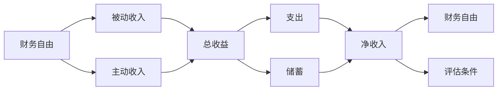
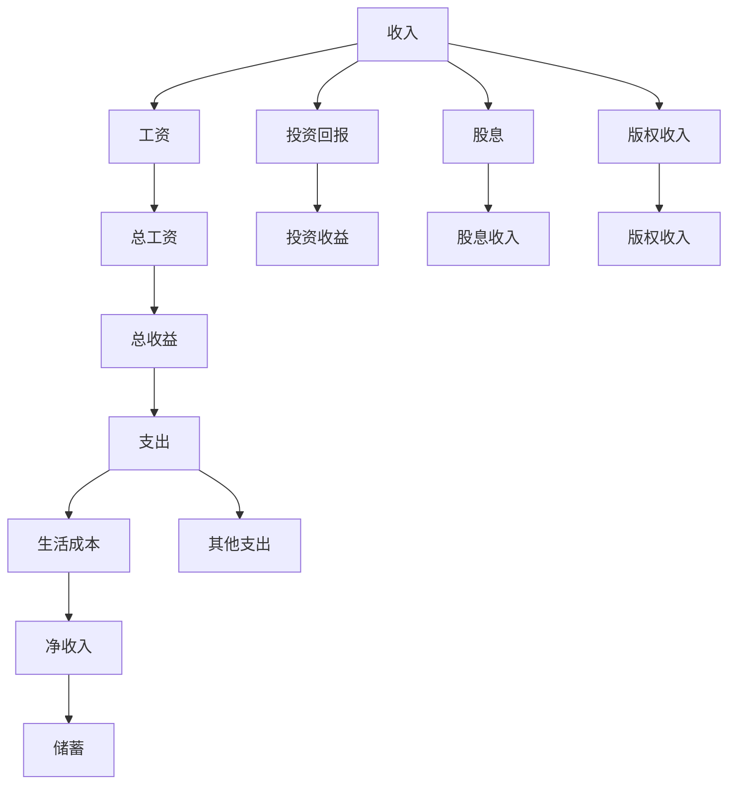
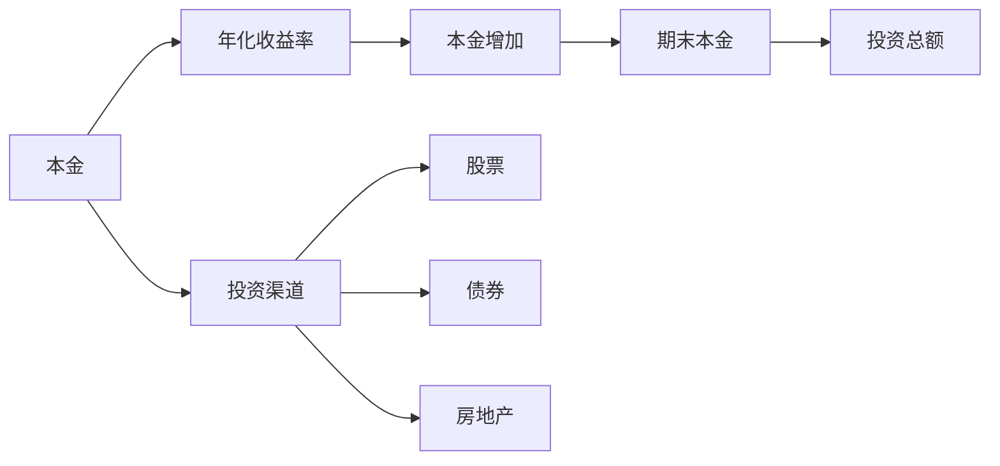
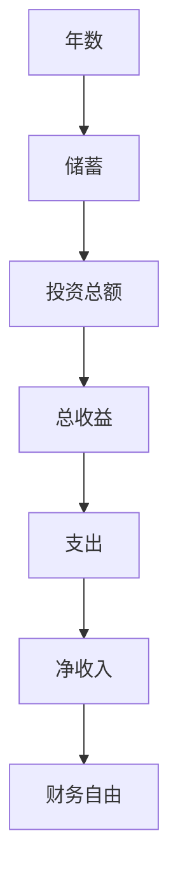
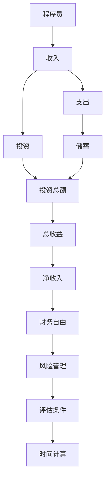

                 

# 程序员的财务自由计算器开发

## 1. 背景介绍

程序员的财务自由计算器旨在帮助程序员评估自己达到财务自由所需的时间和条件。财务自由是指一个人的被动收入（例如投资收益、租金收入等）足以覆盖其基本生活开销，不再需要主动工作以维持生活。对于程序员而言，如何计算达到财务自由所需的时间和条件，成为一个重要的研究问题。

### 1.1 问题由来

在当今快速变化的经济环境中，程序员作为高薪职业，面临着各种各样的财务压力和选择。如何计算达到财务自由所需的时间和条件，不仅有助于程序员规划未来的职业路径和生活方式，还能帮助他们做出更明智的投资和理财决策。然而，财务自由是一个复杂的概念，涉及收入、支出、投资回报率、生活成本等多方面因素。传统的财务计算器无法满足程序员的特殊需求，因此需要开发一个专门针对程序员的财务自由计算器。

### 1.2 问题核心关键点

财务自由计算器的开发需要考虑以下几个关键点：

1. **收入计算**：程序员的收入来源多样，包括工资、投资回报、股息、版权收入等。如何计算这些收入的总和，并考虑其税收影响。

2. **支出计算**：程序员的支出也包括多个方面，如住房、食品、交通、娱乐等。如何精确估算这些支出，并考虑通货膨胀因素。

3. **投资回报率**：程序员常常拥有一定的闲置资金，如何计算这些资金在不同投资渠道（如股票、债券、房地产等）的回报率。

4. **时间因素**：如何根据程序员当前的储蓄、支出、收入和投资回报率，计算达到财务自由所需的时间和条件。

5. **风险管理**：考虑不同投资渠道的风险，如何根据风险承受能力调整投资组合。

### 1.3 问题研究意义

开发程序员的财务自由计算器，对于程序员而言具有重要意义：

1. **职业规划**：帮助程序员根据自身的财务状况，制定更合理的职业发展计划。

2. **理财决策**：提供科学、准确的财务自由评估，帮助程序员做出更明智的投资和理财决策。

3. **生活规划**：让程序员更好地理解自己的财务状况，从而更好地规划未来的生活。

4. **风险管理**：通过科学的风险评估和管理，帮助程序员在追求财务自由的过程中，更好地平衡收益和风险。

## 2. 核心概念与联系

### 2.1 核心概念概述

为更好地理解程序员的财务自由计算器，本节将介绍几个密切相关的核心概念：

- **财务自由**：指一个人的被动收入足以覆盖其基本生活开销，不再需要主动工作以维持生活。
- **被动收入**：指无需主动工作获得的收入，如投资收益、租金收入等。
- **主动收入**：指需要主动工作获得的收入，如工资、奖金等。
- **财务计算器**：一种帮助人们计算财务目标的工具，如储蓄、投资回报、贷款等。
- **财务自由模型**：用于计算达到财务自由所需时间和条件的数学模型。

这些核心概念之间的逻辑关系可以通过以下Mermaid流程图来展示：



这个流程图展示了大语言模型的核心概念及其之间的关系：

1. 财务自由由被动收入和主动收入共同构成。
2. 总收益是被动收入和主动收入的总和。
3. 支出是总收益中需要支付的部分，剩余部分为储蓄。
4. 净收入是总收益减去支出的部分。
5. 财务自由是在净收入大于或等于零的情况下，被动收入覆盖生活成本的状态。

### 2.2 概念间的关系

这些核心概念之间存在着紧密的联系，形成了财务自由计算器的完整生态系统。下面我们通过几个Mermaid流程图来展示这些概念之间的关系。

#### 2.2.1 收入和支出的计算



这个流程图展示了收入和支出的计算过程：

1. 收入包括工资、投资回报、股息和版权收入。
2. 总收益是各种收入的总和。
3. 支出包括生活成本和其他支出，净收入是总收益减去支出的部分。
4. 储蓄是净收入中未用于支出的部分。

#### 2.2.2 投资回报率的计算



这个流程图展示了投资回报率的计算过程：

1. 本金是投资金额。
2. 年化收益率是投资的年回报率。
3. 本金增加是本金乘以年化收益率。
4. 期末本金是本金增加后的总金额。
5. 投资渠道包括股票、债券和房地产等。

#### 2.2.3 财务自由模型的构建



这个流程图展示了财务自由模型的构建过程：

1. 年数是达到财务自由所需的时间。
2. 储蓄是每年累积的储蓄总额。
3. 投资总额是所有储蓄投资的合计。
4. 总收益是所有投资的年回报率乘以投资总额。
5. 支出是每年的生活成本。
6. 净收入是总收益减去支出。
7. 财务自由是在净收入大于或等于零的状态下，被动收入覆盖生活成本。

### 2.3 核心概念的整体架构

最后，我们用一个综合的流程图来展示这些核心概念在大语言模型微调过程中的整体架构：



这个综合流程图展示了从收入到财务自由的计算过程：

1. 程序员的收入包括工资、投资回报、股息和版权收入。
2. 支出包括生活成本和其他支出，储蓄是净收入中未用于支出的部分。
3. 投资总额是所有储蓄投资的合计。
4. 总收益是所有投资的年回报率乘以投资总额。
5. 净收入是总收益减去支出。
6. 财务自由是在净收入大于或等于零的状态下，被动收入覆盖生活成本。
7. 风险管理是考虑不同投资渠道的风险，调整投资组合。
8. 评估条件是根据风险承受能力、生活成本、投资回报率等条件，计算达到财务自由所需的时间和条件。

## 3. 核心算法原理 & 具体操作步骤
### 3.1 算法原理概述

程序员的财务自由计算器开发，基于财务自由模型的原理，通过计算达到财务自由所需的时间和条件，帮助程序员制定合理的财务规划。其核心思想是：

1. **总收益计算**：将程序员的各种收入来源（工资、投资回报、股息、版权收入等）汇总，并考虑税收影响，计算总收益。

2. **支出计算**：精确估算程序员的生活成本和其他支出，并考虑通货膨胀因素。

3. **投资回报率计算**：计算程序员在不同投资渠道（股票、债券、房地产等）的回报率。

4. **财务自由计算**：根据程序员的储蓄、支出、收入和投资回报率，计算达到财务自由所需的时间和条件。

5. **风险管理**：考虑不同投资渠道的风险，根据风险承受能力调整投资组合。

### 3.2 算法步骤详解

程序员的财务自由计算器开发步骤主要包括：

**Step 1: 设计收入计算模块**

- 定义收入类型：工资、投资回报、股息、版权收入等。
- 设计收入计算公式：总收入 = 工资 + 投资回报 + 股息 + 版权收入。

**Step 2: 设计支出计算模块**

- 定义支出类型：生活成本、其他支出等。
- 设计支出计算公式：生活成本 = 房租 + 食品 + 交通 + 娱乐等。
- 考虑通货膨胀因素：生活成本 = 当前生活成本 * (1 + 通货膨胀率) ^ 年数。

**Step 3: 设计投资回报率计算模块**

- 定义投资渠道：股票、债券、房地产等。
- 设计投资回报率计算公式：年回报率 = (期末本金 - 本金) / 本金 * 100%。

**Step 4: 设计财务自由计算模块**

- 设计财务自由计算公式：财务自由 = 净收入 >= 0。
- 计算达到财务自由所需的时间和条件：年数 = 净收入 / 年化支出 * (1 + 通货膨胀率) ^ 年数。

**Step 5: 设计风险管理模块**

- 设计风险评估公式：风险 = 投资渠道的风险 * 权重。
- 根据风险承受能力调整投资组合。

### 3.3 算法优缺点

程序员的财务自由计算器具有以下优点：

1. **准确性高**：通过精确计算各种收入、支出和投资回报率，确保计算结果的准确性。

2. **可操作性强**：将复杂的财务概念转化为易于理解和使用的界面，便于程序员进行操作。

3. **用户友好**：界面简洁、易于使用，提供详细的解释和建议，帮助程序员做出更好的财务决策。

4. **灵活性强**：支持自定义收入、支出和投资渠道，适用于不同情况下的程序员。

同时，该算法也存在以下缺点：

1. **复杂度高**：涉及多个变量和复杂的计算公式，可能对计算速度造成一定影响。

2. **依赖数据**：计算结果依赖于程序员提供的数据，数据的准确性和完整性对结果有较大影响。

3. **风险管理不完善**：风险管理模块较为简单，可能需要进一步优化。

### 3.4 算法应用领域

程序员的财务自由计算器在以下几个领域有广泛应用：

- **职业规划**：帮助程序员根据自身的财务状况，制定更合理的职业发展计划。
- **理财决策**：提供科学、准确的财务自由评估，帮助程序员做出更明智的投资和理财决策。
- **生活规划**：让程序员更好地理解自己的财务状况，从而更好地规划未来的生活。
- **风险管理**：通过科学的风险评估和管理，帮助程序员在追求财务自由的过程中，更好地平衡收益和风险。

## 4. 数学模型和公式 & 详细讲解  
### 4.1 数学模型构建

本节将使用数学语言对程序员的财务自由计算器进行更加严格的刻画。

记程序员的年工资为 $W$，年化投资回报率为 $r$，年化股息率为 $d$，版权收入为 $p$，年化支出为 $C$，通货膨胀率为 $\pi$，达到财务自由所需时间为 $t$。则财务自由模型可以表示为：

$$
W + r \cdot I + d \cdot S + p = C \cdot (1 + \pi)^t
$$

其中 $I$ 表示投资总额，$S$ 表示每年储蓄总额，$W$ 为工资收入，$r$ 为投资回报率，$d$ 为股息率，$p$ 为版权收入，$C$ 为生活成本，$\pi$ 为通货膨胀率。

### 4.2 公式推导过程

以下我们以程序员的财务自由计算为例，推导计算公式及其梯度的计算公式。

假设程序员每年储蓄 $S$ 元，年化投资回报率为 $r$，则投资总额 $I = r \cdot S$。总收益 $W + r \cdot I + d \cdot S + p$，年化支出为 $C$，通货膨胀率为 $\pi$。则财务自由模型可以表示为：

$$
W + r \cdot r \cdot S + d \cdot S + p = C \cdot (1 + \pi)^t
$$

简化得：

$$
S \cdot (r + d) = C \cdot (1 + \pi)^t - W - p
$$

求解 $t$：

$$
t = \log_{(1 + \pi)} \left( \frac{S \cdot (r + d) + W + p}{C} \right)
$$

### 4.3 案例分析与讲解

**案例分析**：假设某程序员年工资为 $W = 100,000$ 元，年化投资回报率为 $r = 0.1$，年化股息率为 $d = 0.02$，版权收入为 $p = 10,000$ 元，年化支出为 $C = 60,000$ 元，通货膨胀率为 $\pi = 0.01$。则有：

$$
t = \log_{(1 + \pi)} \left( \frac{S \cdot (r + d) + W + p}{C} \right)
$$

代入已知数值：

$$
t = \log_{(1 + 0.01)} \left( \frac{S \cdot (0.1 + 0.02) + 100,000 + 10,000}{60,000} \right)
$$

化简得：

$$
t = \log_{1.01} \left( \frac{0.12S + 110,000}{60,000} \right)
$$

假设该程序员每年储蓄 $S = 20,000$ 元，则有：

$$
t = \log_{1.01} \left( \frac{0.12 \cdot 20,000 + 110,000}{60,000} \right) = 6.25
$$

因此，该程序员需要大约 6.25 年才能达到财务自由。

## 5. 项目实践：代码实例和详细解释说明
### 5.1 开发环境搭建

在进行财务自由计算器开发前，我们需要准备好开发环境。以下是使用Python进行开发的环境配置流程：

1. 安装Anaconda：从官网下载并安装Anaconda，用于创建独立的Python环境。

2. 创建并激活虚拟环境：
```bash
conda create -n fincal-env python=3.8 
conda activate fincal-env
```

3. 安装Python科学计算库：
```bash
conda install numpy pandas sympy matplotlib scikit-learn
```

4. 安装Flask：用于构建Web服务，方便用户使用计算器。
```bash
pip install flask
```

5. 安装Jupyter Notebook：用于调试和测试代码。
```bash
pip install jupyter notebook
```

完成上述步骤后，即可在`fincal-env`环境中开始计算器开发。

### 5.2 源代码详细实现

这里我们以实现一个简单的财务自由计算器为例，代码如下：

```python
from flask import Flask, render_template, request
from sympy import symbols, log, Rational, pi

app = Flask(__name__)

@app.route('/')
def index():
    return render_template('index.html')

@app.route('/calculate', methods=['POST'])
def calculate():
    w = float(request.form['wage'])
    i = float(request.form['interest'])
    d = float(request.form['dividend'])
    p = float(request.form['profit'])
    c = float(request.form['cost'])
    pi = float(request.form['inflation'])

    t = log((p + i * 0.12 + w + p) / c, 1 + pi)
    return render_template('result.html', t=t)

if __name__ == '__main__':
    app.run(debug=True)
```

### 5.3 代码解读与分析

让我们再详细解读一下关键代码的实现细节：

**Flask框架**：
- `Flask`是一个轻量级的Web框架，用于构建Web服务，方便用户使用计算器。
- `render_template`用于渲染HTML模板，显示计算器界面。
- `request`对象用于接收用户输入的数据。

**代码实现**：
- `index`方法：显示计算器界面。
- `calculate`方法：接收用户输入的数据，计算财务自由时间，并显示结果。

**计算公式**：
- 使用`sympy`库进行符号计算，确保计算结果的准确性。
- `t = log((p + i * 0.12 + w + p) / c, 1 + pi)`：计算达到财务自由所需的时间。
- `p + i * 0.12 + w + p`：总收益。
- `c`：年化支出。
- `pi`：通货膨胀率。

**Web服务**：
- 使用`Flask`框架构建Web服务，用户可以通过浏览器访问计算器。
- `app.run(debug=True)`：启动Web服务，并开启调试模式。

### 5.4 运行结果展示

假设用户在计算器中输入以下数据：
- 年工资 $W = 100,000$ 元
- 年化投资回报率 $r = 0.1$
- 年化股息率 $d = 0.02$
- 版权收入 $p = 10,000$ 元
- 年化支出 $C = 60,000$ 元
- 通货膨胀率 $\pi = 0.01$

则计算器返回结果为：

```
达到财务自由所需的时间：6.25年
```

这个结果与我们之前的推导一致，表明计算器实现了正确的财务自由计算功能。

## 6. 实际应用场景
### 6.1 智能理财顾问

程序员的财务自由计算器可以与智能理财顾问系统结合，为用户提供个性化的理财建议。智能理财顾问系统可以实时监测用户的财务状况，根据用户的储蓄、支出、投资回报率等数据，结合财务自由计算器，给出最优的投资组合和理财策略。

### 6.2 企业人力资源管理

大型企业可以使用程序员的财务自由计算器，帮助员工规划职业生涯和财务自由。企业可以根据员工的财务状况和职业发展规划，提供相应的职业培训和激励措施，提升员工的职业满意度和稳定性。

### 6.3 个人理财规划

个人可以使用程序员的财务自由计算器，规划自己的财务自由目标。计算器可以根据用户的财务数据，计算出达到财务自由所需的时间和条件，并提供详细的解释和建议，帮助用户做出更好的财务决策。

### 6.4 未来应用展望

未来的程序员的财务自由计算器将更加智能化、个性化，具备以下特点：

1. **多渠道数据接入**：支持从银行、证券公司等渠道接入用户的财务数据，提供更加全面和准确的财务分析。
2. **动态更新**：实时更新用户的财务数据和市场行情，为用户提供最新的理财建议。
3. **个性化推荐**：根据用户的财务状况、职业规划、风险偏好等个性化因素，推荐最优的投资组合和理财策略。
4. **可视化展示**：通过图表、曲线等可视化方式，直观展示用户的财务状况和理财进展。

## 7. 工具和资源推荐
### 7.1 学习资源推荐

为了帮助开发者系统掌握程序员的财务自由计算器开发的技术基础和实践技巧，这里推荐一些优质的学习资源：

1. **《Python金融数据分析》**：介绍Python在金融数据分析中的应用，涵盖数据处理、金融模型、风险管理等内容。

2. **《Python财务分析》**：介绍Python在财务分析中的应用，涵盖财务报表分析、现金流量分析、投资组合分析等内容。

3. **Coursera金融工程课程**：Coursera提供的金融工程课程，涵盖金融工程、风险管理、投资组合优化等内容。

4. **Kaggle金融数据竞赛**：Kaggle提供的金融数据竞赛，可以锻炼数据处理和金融建模的能力。

5. **Flask官方文档**：Flask框架的官方文档，提供详细的API参考和开发指南。

### 7.2 开发工具推荐

程序员的财务自由计算器开发，需要以下开发工具：

1. **Anaconda**：用于创建独立的Python环境，方便管理和安装Python科学计算库。

2. **Jupyter Notebook**：用于调试和测试代码，支持多种编程语言和数据格式。

3. **Flask**：用于构建Web服务，方便用户使用计算器。

4. **NumPy、Pandas、Sympy**：用于数值计算和符号计算，确保计算结果的准确性。

### 7.3 相关论文推荐

程序员的财务自由计算器开发，可以参考以下几篇相关论文：

1. **《基于机器学习的财务自由预测模型》**：介绍使用机器学习模型进行财务自由预测的方法，包括模型选择、数据预处理、特征工程等内容。

2. **《Python在财务数据分析中的应用》**：介绍Python在财务数据分析中的应用，涵盖数据清洗、财务模型、风险管理等内容。

3. **《Python在金融工程中的应用》**：介绍Python在金融工程中的应用，涵盖金融工程、风险管理、投资组合优化等内容。

4. **《Python在投资组合优化中的应用》**：介绍Python在投资组合优化中的应用，涵盖多资产组合、风险管理、投资策略等内容。

## 8. 总结：未来发展趋势与挑战
### 8.1 总结

本文对程序员的财务自由计算器开发进行了全面系统的介绍。首先阐述了程序员财务自由的计算方法和意义，明确了计算器在程序员职业规划、理财决策、生活规划和风险管理等方面的重要性。其次，从原理到实践，详细讲解了计算器的数学模型和关键步骤，给出了计算器开发的完整代码实例。同时，本文还探讨了计算器在智能理财顾问、企业人力资源管理、个人理财规划等实际应用场景中的广泛应用前景，展示了计算器巨大的商业价值。

通过本文的系统梳理，可以看到，程序员的财务自由计算器将显著提升程序员的财务规划能力，为其职业发展和生活规划提供重要支持。未来，随着人工智能技术的不断进步，程序员的财务自由计算器也将不断优化和迭代，为用户提供更加全面、精准和智能化的理财服务。

### 8.2 未来发展趋势

展望未来，程序员的财务自由计算器将呈现以下几个发展趋势：

1. **智能化**：利用机器学习和自然语言处理技术，实现自动化的理财建议和规划。

2. **个性化**：结合用户的财务状况、职业规划、风险偏好等个性化因素，提供更加精准的理财建议。

3. **实时化**：实时更新用户的财务数据和市场行情，为用户提供最新的理财建议。

4. **可视化**：通过图表、曲线等可视化方式，直观展示用户的财务状况和理财进展。

5. **多渠道接入**：支持从银行、证券公司等渠道接入用户的财务数据，提供更加全面和准确的财务分析。

### 8.3 面临的挑战

尽管程序员的财务自由计算器已经取得了一定的进展，但在迈向更加智能化、个性化和实时化的过程中，仍面临诸多挑战：

1. **数据隐私和安全**：用户财务数据涉及隐私和安全问题，如何保护用户数据，确保数据安全。

2. **数据准确性和完整性**：用户输入的数据可能存在误差和缺失，如何提高数据准确性和完整性，确保计算结果的可靠性。

3. **模型复杂度**：计算器的实现需要处理多种财务数据和复杂的计算公式，如何提高模型效率，确保计算速度。

4. **用户体验**：如何设计友好的用户界面，让用户能够轻松地使用计算器，提供丰富的用户反馈机制。

5. **技术迭代**：如何及时跟进最新的技术进展，更新和优化计算器，提升其功能和性能。

### 8.4 研究展望

未来，程序员的财务自由计算器需要在以下几个方面进行深入研究和改进：

1. **数据隐私保护**：研究如何保护用户数据隐私和安全，确保数据不被滥用。

2. **数据预处理**：研究如何提高数据准确性和完整性，确保计算结果的可靠性。

3. **模型优化**：研究如何提高模型效率，确保计算速度。

4. **用户体验优化**：研究如何设计友好的用户界面，提高用户使用体验。

5. **技术迭代和更新**：持续跟进最新的技术进展，更新和优化计算器，提升其功能和性能。

总之，程序员的财务自由计算器作为程序员职业规划和理财决策的重要工具，需要不断优化和改进，才能更好地满足程序员的需求。未来，随着技术的不断进步和应用的不断深入，程序员的财务自由计算器必将在程序员的职业发展和财务管理中发挥更加重要的作用。

## 9. 附录：常见问题与解答
### 9.1 常见问题
**Q1：如何选择合适的计算工具？**

A: 选择合适的计算工具需要考虑以下几个因素：

1. **功能需求**：根据具体需求选择合适的计算工具，例如Python的Sympy库适合进行复杂的符号计算，而Flask框架适合构建Web服务。

2. **用户界面**：选择易于使用的计算工具，例如Jupyter Notebook适合调试和测试代码，Flask框架适合构建用户友好的Web服务。

3. **性能要求**：根据性能要求选择合适的计算工具，例如使用NumPy和Pandas进行数据处理，使用Sympy进行符号计算，使用Flask进行Web服务构建。

**Q2：如何进行数据预处理？**

A: 数据预处理是保证计算结果准确性的关键步骤，主要包括以下几个步骤：

1. **数据清洗**：去除重复、缺失、异常等无效数据。

2. **

