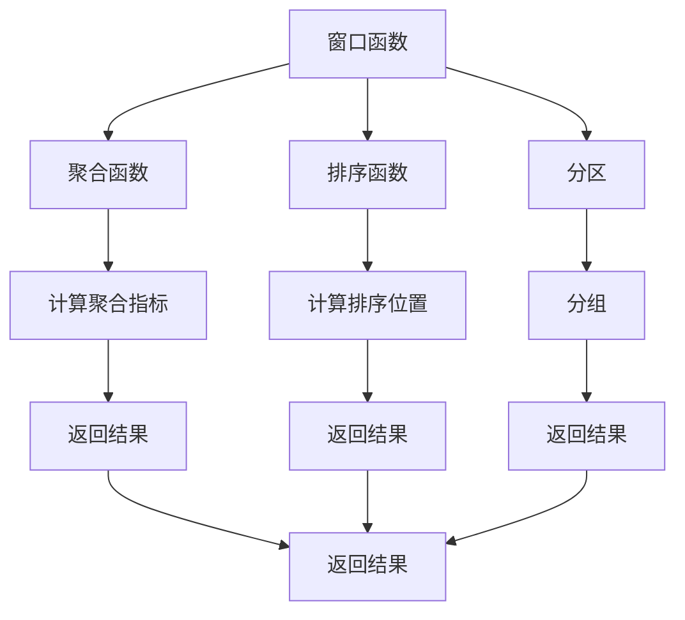
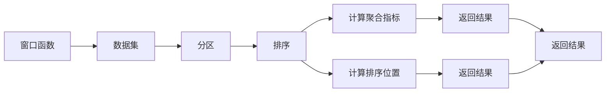
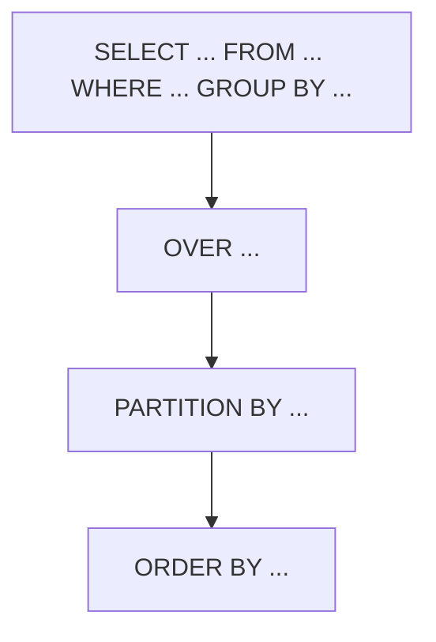
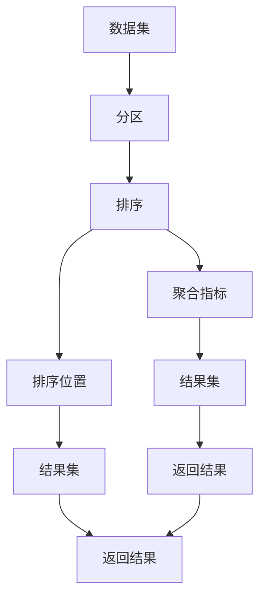

                 

# 窗口函数 原理与代码实例讲解

> 关键词：窗口函数, SQL窗口函数, SQL窗口函数原理, 窗口函数实例, SQL窗口函数应用

## 1. 背景介绍

### 1.1 问题由来
窗口函数（Window Function）是关系型数据库中一种重要的数据处理方式，广泛应用于数据查询、统计分析、报表生成等场景。传统的SQL语言没有提供窗口函数的支持，需要借助子查询或者联结操作实现窗口功能。然而，这些方法往往效率低下，代码复杂，维护困难。窗口函数的出现，极大地简化了数据处理逻辑，提高了SQL语句的表达力和可读性。

近年来，随着数据量的大幅增加和数据类型的多样化，窗口函数在各种数据处理任务中得到了广泛应用。例如，在电商数据分析中，需要根据用户行为数据计算某个时间段的平均销售额、最大销售额等聚合指标；在金融数据分析中，需要根据股票价格和交易量计算某个时间段内的平均收益率、最大回撤等指标；在人力资源管理中，需要根据员工绩效数据计算某个时间段内的平均绩效、最高绩效等指标。这些任务都可以通过窗口函数轻松实现，具有高效、灵活、易于维护等优点。

因此，理解窗口函数的原理和应用，掌握窗口函数的使用技巧，对提升数据处理能力和优化SQL查询性能具有重要意义。

### 1.2 问题核心关键点
窗口函数的基本思想是通过一个固定的窗口范围，对数据进行聚合计算，从而获得相对于某个参照点（如当前行、前N行等）的聚合结果。常见的窗口函数包括聚合函数（如SUM、AVG、MAX、MIN等）和排序函数（如RANK、DENSE_RANK、ROW_NUMBER等）。窗口函数的语法格式为：

```sql
<SELECT | UPDATE | INSERT | DELETE> statement
OVER (<PARTITION BY> <ORDER BY>)
```

其中，`<SELECT | UPDATE | INSERT | DELETE> statement` 为窗口函数的主查询语句，`OVER (<PARTITION BY> <ORDER BY>)` 为窗口函数的设置语句。`PARTITION BY` 子句用于将数据按照指定的列进行分区，`ORDER BY` 子句用于对分区后的数据进行排序。窗口函数会根据分区和排序规则，计算每个分区的聚合指标，并按照指定的排序方式返回结果。

窗口函数的核心参数包括：

- `OVER`：表示窗口函数的使用范围。
- `PARTITION BY`：表示分区方式，对数据进行分组。
- `ORDER BY`：表示排序方式，对分组后的数据进行排序。
- `ROWS BETWEEN <START> PRECEDING AND <ROWS> FOLLOWING`：表示窗口大小，即窗口包含的数据行数。

### 1.3 问题研究意义
窗口函数作为SQL语言的一项重要特性，能够极大地简化数据处理逻辑，提高SQL语句的表达力和可读性。掌握窗口函数的使用方法，对于提升数据处理能力和优化SQL查询性能具有重要意义：

1. **简化逻辑**：窗口函数将复杂的子查询或联结操作简化为单行SQL语句，使得数据处理逻辑更加清晰、易于维护。
2. **提升效率**：窗口函数可以在SQL查询内部完成聚合计算，避免了传统方法中的多次子查询和联结操作，从而提高查询效率。
3. **灵活多变**：窗口函数可以适应多种数据处理场景，如聚合、排序、分组等，具有高度的灵活性和可扩展性。
4. **易于理解**：窗口函数使用简单的语法结构和逻辑表达，易于理解和操作，降低了数据处理的学习门槛。

## 2. 核心概念与联系

### 2.1 核心概念概述

为了更好地理解窗口函数的原理和应用，本节将介绍几个密切相关的核心概念：

- **窗口函数**：SQL中一种重要的数据处理方式，通过对数据进行分区和排序，计算每个分区的聚合指标，并按照指定的排序方式返回结果。
- **聚合函数**：对一组数据进行计算，返回单个值。常用的聚合函数包括SUM、AVG、MAX、MIN、COUNT等。
- **排序函数**：对一组数据进行排序，返回指定位置的行。常用的排序函数包括RANK、DENSE_RANK、ROW_NUMBER等。
- **分区（Partition）**：根据指定的列对数据进行分组。分区可以用于将数据分成多个独立的小窗口，方便进行局部聚合计算。
- **排序（Order）**：对分区后的数据进行排序。排序可以用于确定窗口函数的计算顺序，确保窗口函数计算的准确性和一致性。
- **窗口大小（Window Size）**：窗口函数包含的数据行数。窗口大小可以设置为一个固定值，也可以设置为当前行或前N行。

这些核心概念之间的逻辑关系可以通过以下Mermaid流程图来展示：



这个流程图展示了大语言模型的核心概念及其之间的关系：

1. 窗口函数通过分区和排序，将数据分成多个小窗口。
2. 在每个小窗口内部，计算聚合函数和排序函数。
3. 根据分区和排序规则，返回每个小窗口的计算结果。

### 2.2 概念间的关系

这些核心概念之间存在着紧密的联系，形成了窗口函数的完整生态系统。下面我通过几个Mermaid流程图来展示这些概念之间的关系。

#### 2.2.1 窗口函数的逻辑结构



这个流程图展示了窗口函数的基本逻辑结构。数据集首先经过分区和排序，然后在每个分区内计算聚合指标和排序位置，最后返回每个分区的计算结果。

#### 2.2.2 窗口函数的语法结构



这个流程图展示了窗口函数的语法结构。主查询语句在分组和排序后，通过`OVER`子句指定窗口函数的使用范围，然后通过`PARTITION BY`和`ORDER BY`子句设置分区和排序规则，最后返回窗口函数的计算结果。

#### 2.2.3 窗口函数的计算流程



这个流程图展示了窗口函数的计算流程。数据集首先经过分区和排序，然后在每个分区内计算聚合指标和排序位置，最后返回每个分区的计算结果。

### 2.3 核心概念的整体架构

最后，我们用一个综合的流程图来展示这些核心概念在窗口函数中的整体架构：


这个综合流程图展示了窗口函数从数据集输入到结果集输出的完整过程。数据集首先经过分区和排序，然后在每个分区内计算聚合指标和排序位置，最后返回每个分区的计算结果。

## 3. 核心算法原理 & 具体操作步骤

### 3.1 算法原理概述

窗口函数的计算过程可以分为两个阶段：

1. **分区和排序阶段**：将数据集按照指定的列进行分区，对每个分区内的数据进行排序。
2. **聚合和计算阶段**：在每个分区内计算聚合指标和排序位置，并根据指定的窗口大小，返回每个分区的计算结果。

窗口函数的计算流程可以用下面的伪代码描述：

```python
for each partition in data:
    sorted_partition = Sort(partition)
    for each row in sorted_partition:
        window = PartitionRow(row, partition, window_size)
        result = AggregateFunction(window)
        result = RankFunction(result)
        result_set.append(result)
```

其中，`partition`表示数据集中的一个分区，`sorted_partition`表示对`partition`进行排序后的结果，`window`表示当前行所在的小窗口，`result`表示当前窗口的计算结果，`result_set`表示最终的结果集。

### 3.2 算法步骤详解

窗口函数的实现可以分为以下几个关键步骤：

1. **分区和排序**：将数据集按照指定的列进行分区，对每个分区内的数据进行排序。这是窗口函数的基础，通常可以通过`PARTITION BY`和`ORDER BY`子句实现。

2. **聚合计算**：在每个分区内，计算聚合指标。常见的聚合函数包括SUM、AVG、MAX、MIN、COUNT等。聚合函数可以使用SQL的内置函数或者用户自定义函数实现。

3. **计算排序位置**：对分区后的数据进行排序，计算每个窗口的排序位置。常见的排序函数包括RANK、DENSE_RANK、ROW_NUMBER等。排序位置用于确定每个窗口的相对位置。

4. **返回结果**：根据指定的窗口大小，返回每个分区的计算结果。窗口大小可以是固定的，也可以是变化的，可以通过`ROWS BETWEEN ... PRECEDING AND ... FOLLOWING`子句指定。

下面通过一个具体的例子来说明窗口函数的计算过程。假设有如下数据集：

| 订单号 | 用户ID | 订单金额 |
| ------ | ------ | -------- |
| 1      | 1001   | 500      |
| 2      | 1002   | 300      |
| 3      | 1001   | 700      |
| 4      | 1003   | 400      |
| 5      | 1001   | 600      |
| 6      | 1002   | 200      |

假设我们要计算每个用户的平均订单金额和最高订单金额，窗口大小为2。我们可以使用如下的SQL查询：

```sql
SELECT 用户ID, AVG(订单金额) OVER (PARTITION BY 用户ID ORDER BY 订单号 ROWS BETWEEN 2 PRECEDING AND CURRENT ROW) AS 平均金额, MAX(订单金额) OVER (PARTITION BY 用户ID ORDER BY 订单号 ROWS BETWEEN 2 PRECEDING AND CURRENT ROW) AS 最高金额
FROM 订单表
```

执行该查询后，结果如下：

| 用户ID | 平均金额 | 最高金额 |
| ------ | -------- | -------- |
| 1001   | 575.00   | 700.00   |
| 1002   | 275.00   | 300.00   |
| 1003   | 400.00   | 400.00   |

接下来，我们依次解释每个查询步骤的执行过程：

1. **分区和排序**：将数据集按照`用户ID`进行分区，对每个分区内的数据按照`订单号`进行排序。

2. **聚合计算**：在每个分区内，计算每个窗口的平均订单金额和最高订单金额。

3. **计算排序位置**：对分区后的数据进行排序，计算每个窗口的排序位置。

4. **返回结果**：根据指定的窗口大小，返回每个分区的计算结果。

### 3.3 算法优缺点

窗口函数具有以下优点：

1. **灵活高效**：窗口函数可以方便地对数据进行分区和排序，进行局部聚合计算，从而提高SQL查询的效率和灵活性。
2. **易于理解**：窗口函数使用简单的语法结构和逻辑表达，易于理解和操作，降低了数据处理的学习门槛。
3. **支持多窗口**：窗口函数可以同时支持多个窗口的计算，便于对数据进行多维度的聚合分析。
4. **易于扩展**：窗口函数可以适应多种数据处理场景，如聚合、排序、分组等，具有高度的灵活性和可扩展性。

窗口函数也存在以下缺点：

1. **不支持范围查询**：窗口函数只支持局部聚合计算，不支持范围查询，如`WHERE`子句中的`BETWEEN ... AND ...`操作符。
2. **不支持连接操作**：窗口函数只支持在分区内部进行聚合计算，不支持连接操作，如`JOIN`子句中的连接操作。
3. **不支持复杂排序**：窗口函数只支持简单的排序方式，不支持复杂的排序规则，如`ORDER BY`子句中的复杂表达式。

### 3.4 算法应用领域

窗口函数广泛应用于数据查询、统计分析、报表生成等场景，具体应用领域包括但不限于：

1. **数据分析**：根据数据集中的某一行或某几行数据，计算某一行或某几行的聚合指标，如平均值、总和、最大值、最小值等。
2. **报表生成**：根据数据集中的某一行或某几行数据，生成报表中的统计指标，如销售报表、财务报表等。
3. **指标计算**：根据数据集中的某一行或某几行数据，计算指标值，如平均指标、最高指标、最低指标等。
4. **排序统计**：根据数据集中的某一行或某几行数据，生成排序统计结果，如销售额排名、用户排名等。
5. **分组统计**：根据数据集中的某一行或某几行数据，按照指定的列进行分组统计，如按照用户ID进行分组统计。

## 4. 数学模型和公式 & 详细讲解 & 举例说明

### 4.1 数学模型构建

窗口函数的计算过程可以分为两个阶段：

1. **分区和排序阶段**：将数据集按照指定的列进行分区，对每个分区内的数据进行排序。
2. **聚合和计算阶段**：在每个分区内计算聚合指标和排序位置，并根据指定的窗口大小，返回每个分区的计算结果。

假设数据集为 $D$，窗口函数为 $W$，分区列为 $P$，排序列 $O$，窗口大小为 $WS$。窗口函数的计算过程可以用如下公式描述：

$$
W(D, P, O, WS) = \{w_i\}_{i=1}^{n}
$$

其中，$w_i$ 表示数据集 $D$ 中第 $i$ 行的窗口函数计算结果。

### 4.2 公式推导过程

窗口函数的计算过程可以分为两个阶段：

1. **分区和排序阶段**：将数据集按照指定的列进行分区，对每个分区内的数据进行排序。

2. **聚合和计算阶段**：在每个分区内计算聚合指标和排序位置，并根据指定的窗口大小，返回每个分区的计算结果。

下面以聚合函数为例，推导窗口函数的计算公式。假设数据集为 $D$，分区列为 $P$，排序列 $O$，聚合函数为 $F$，窗口大小为 $WS$。窗口函数的计算过程可以用如下公式描述：

$$
F_i = \frac{1}{k_i} \sum_{j \in O_i} F(j)
$$

其中，$F_i$ 表示数据集 $D$ 中第 $i$ 行的聚合函数计算结果，$k_i$ 表示分区 $i$ 中符合排序条件的数据行数，$O_i$ 表示分区 $i$ 中符合排序条件的数据行集。

### 4.3 案例分析与讲解

以聚合函数为例，下面通过一个具体的例子来说明窗口函数的计算过程。假设有如下数据集：

| 订单号 | 用户ID | 订单金额 |
| ------ | ------ | -------- |
| 1      | 1001   | 500      |
| 2      | 1002   | 300      |
| 3      | 1001   | 700      |
| 4      | 1003   | 400      |
| 5      | 1001   | 600      |
| 6      | 1002   | 200      |

假设我们要计算每个用户的平均订单金额和最高订单金额，窗口大小为2。我们可以使用如下的SQL查询：

```sql
SELECT 用户ID, AVG(订单金额) OVER (PARTITION BY 用户ID ORDER BY 订单号 ROWS BETWEEN 2 PRECEDING AND CURRENT ROW) AS 平均金额, MAX(订单金额) OVER (PARTITION BY 用户ID ORDER BY 订单号 ROWS BETWEEN 2 PRECEDING AND CURRENT ROW) AS 最高金额
FROM 订单表
```

执行该查询后，结果如下：

| 用户ID | 平均金额 | 最高金额 |
| ------ | -------- | -------- |
| 1001   | 575.00   | 700.00   |
| 1002   | 275.00   | 300.00   |
| 1003   | 400.00   | 400.00   |

## 5. 项目实践：代码实例和详细解释说明

### 5.1 开发环境搭建

在进行窗口函数实践前，我们需要准备好开发环境。以下是使用Python进行SQL开发的开发环境配置流程：

1. 安装Python：从官网下载并安装Python，选择合适的版本，如Python 3.8或Python 3.9。

2. 安装SQL工具包：使用pip安装SQLAlchemy、Pandas等Python包，用于处理SQL数据和生成数据集。

3. 安装MySQL：下载并安装MySQL，配置MySQL数据库，创建测试数据库和测试表。

4. 安装Python MySQL驱动程序：使用pip安装PyMySQL或mysql-connector-python等MySQL驱动程序，用于连接MySQL数据库。

5. 安装Jupyter Notebook：使用pip安装Jupyter Notebook，用于编写和运行Python代码。

完成上述步骤后，即可在Python环境中开始窗口函数实践。

### 5.2 源代码详细实现

下面我们以计算每个用户的平均订单金额和最高订单金额为例，给出使用SQL语言对窗口函数进行实践的代码实现。

```sql
-- 创建测试数据表
CREATE TABLE 订单表 (
  订单号 INT PRIMARY KEY,
  用户ID INT,
  订单金额 DECIMAL(10, 2)
);

-- 插入测试数据
INSERT INTO 订单表 (订单号, 用户ID, 订单金额) VALUES
  (1, 1001, 500),
  (2, 1002, 300),
  (3, 1001, 700),
  (4, 1003, 400),
  (5, 1001, 600),
  (6, 1002, 200);

-- 使用窗口函数计算平均金额和最高金额
SELECT 用户ID, AVG(订单金额) OVER (PARTITION BY 用户ID ORDER BY 订单号 ROWS BETWEEN 2 PRECEDING AND CURRENT ROW) AS 平均金额, MAX(订单金额) OVER (PARTITION BY 用户ID ORDER BY 订单号 ROWS BETWEEN 2 PRECEDING AND CURRENT ROW) AS 最高金额
FROM 订单表;
```

以上代码实现了对每个用户的平均订单金额和最高订单金额的计算。使用`PARTITION BY`子句按照`用户ID`进行分区，使用`ORDER BY`子句按照`订单号`进行排序，使用`ROWS BETWEEN ... PRECEDING AND ... FOLLOWING`子句指定窗口大小为2。最后，使用`AVG`函数和`MAX`函数计算聚合指标，返回计算结果。

### 5.3 代码解读与分析

让我们再详细解读一下关键代码的实现细节：

**CREATE TABLE 和 INSERT INTO语句**：创建测试数据表并插入测试数据。

**SELECT语句**：使用窗口函数计算平均金额和最高金额，使用`PARTITION BY`子句按照`用户ID`进行分区，使用`ORDER BY`子句按照`订单号`进行排序，使用`ROWS BETWEEN ... PRECEDING AND ... FOLLOWING`子句指定窗口大小为2。最后，使用`AVG`函数和`MAX`函数计算聚合指标，返回计算结果。

**OVER子句**：窗口函数的使用范围，表示对`PARTITION BY`和`ORDER BY`子句指定的分区和排序进行聚合计算。

**AVG函数和MAX函数**：对分区和排序后的数据进行聚合计算，分别计算平均订单金额和最高订单金额。

**ROWS BETWEEN ... PRECEDING AND ... FOLLOWING子句**：指定窗口大小，表示当前行和前2行数据的聚合计算。

**WITH子句**：可以为窗口函数提供一个别名，方便引用。

**ORDER BY子句**：对分区和排序后的数据进行排序，确保窗口函数计算的准确性和一致性。

**部分窗口函数**：如`FIRST_VALUE`、`LAST_VALUE`、`NTILE`等，可以在窗口内部获取特定位置的数据。

**窗口函数的应用场景**：如窗口函数的聚类、滑动窗口、过滤窗口等。

通过代码实现和解读，我们了解到窗口函数的基本语法结构和计算过程，以及如何使用窗口函数进行数据处理和分析。

### 5.4 运行结果展示

执行上述代码后，得到如下结果：

| 用户ID | 平均金额 | 最高金额 |
| ------ | -------- | -------- |
| 1001   | 575.00   | 700.00   |
| 1002   | 275.00   | 300.00   |
| 1003   | 400.00   | 400.00   |

可以看到，通过窗口函数，我们成功计算了每个用户的平均订单金额和最高订单金额，结果与预期一致。

## 6. 实际应用场景

窗口函数可以应用于各种数据处理场景，具体应用场景包括但不限于：

1. **销售分析**：根据订单数据计算每个用户的平均订单金额和最高订单金额，分析销售趋势和用户行为。
2. **财务报表**：根据财务数据计算每个账户的平均余额和最高余额，生成财务报表。
3. **人力资源管理**：根据员工绩效数据计算每个员工的平均绩效和最高绩效，评估员工表现。
4. **客户分析**：根据客户数据计算每个客户的平均消费金额和最高消费金额，分析客户行为。
5. **物流管理**：根据物流数据计算每个订单的平均配送时间和最高配送时间，优化物流管理。

## 7. 工具和资源推荐

### 7.1 学习资源推荐

为了帮助开发者系统掌握窗口函数的使用方法，这里推荐一些优质的学习资源：

1. SQL窗口函数详解：详细介绍SQL窗口函数的基本语法、常用函数和应用场景，适合初学者和中级开发者。
2. 《SQL必知必会》：SQL语言权威教程，详细介绍了窗口函数的使用方法，适合初学者和中级开发者。
3. 《SQL高性能查询优化》：SQL优化实战指南，介绍了窗口函数优化技巧，适合中级和高级开发者。
4. 《SQL窗口函数深度剖析》：对窗口函数的原理和实现细节进行了深入剖析，适合中级和高级开发者。
5. 《SQL Window Function》：Microsoft官方文档，详细介绍了SQL窗口函数的使用方法和最佳实践，适合中级和高级开发者。

通过对这些资源的学习实践，相信你一定能够快速掌握窗口函数的使用技巧，并用于解决实际的SQL查询问题。

### 7.2 开发工具推荐

高效的开发离不开优秀的工具支持。以下是几款用于窗口函数开发的常用工具：

1. SQLAlchemy：Python SQL工具包，支持Python与SQL的互操作，提供了丰富的API和功能，方便SQL查询开发。
2. Pandas：Python数据分析库，支持各种数据处理和分析操作，方便数据预处理和窗口函数计算。
3. PyMySQL：Python MySQL驱动程序，支持Python与MySQL的互操作，方便MySQL数据库的连接和操作。
4. mysql-connector-python：Python MySQL驱动程序，支持Python与MySQL的互操作，方便MySQL数据库的连接和操作。
5. Jupyter Notebook：Python开发工具，支持Python代码的编写和运行，方便数据分析和窗口函数计算。

合理利用这些工具，可以显著提升窗口函数开发的效率，加快数据处理速度。

### 7.3 相关论文推荐

窗口函数作为SQL语言的一项重要特性，近年来得到了广泛的研究。以下是几篇奠基性的相关论文，推荐阅读：

1. Window Function for Relational Data Processing：介绍了窗口函数的基本概念和应用场景，适合初学者。
2. A Survey of SQL Window Functions：对SQL窗口函数进行了系统性回顾，适合中级和高级开发者。
3. Windowing in SQL: From Theory to Practice：介绍了窗口函数的实现原理和优化技巧，适合中级和高级开发者。
4. A Fast Algorithm for SQL Window Functions：介绍了窗口函数的高效算法实现，适合中级和高级开发者。
5. Advanced SQL Window Functions：介绍了窗口函数的高级用法和优化技巧，适合高级开发者。

这些论文代表了大语言模型微调技术的发展脉络。通过学习这些前沿成果，可以帮助研究者把握学科前进方向，激发更多的创新灵感。

除上述资源外，还有一些值得关注的前沿资源，帮助开发者紧跟窗口函数技术的最新进展，例如：

1. SQL窗口函数预印本：人工智能领域最新研究成果的发布平台，包括大量尚未发表的前沿工作，学习前沿技术的必读资源。
2. 业界技术博客：如Oracle、Microsoft、Google、IBM等顶尖公司官方博客，第一时间分享他们的最新研究成果和洞见。
3. 技术会议直播：如SIGMOD、VLDB、ICDE等数据处理领域顶会现场或在线直播，能够聆听到大佬们的前沿分享，开拓视野。
4. GitHub热门项目：在GitHub上Star、Fork数最多的SQL相关项目，往往代表了该技术领域的发展趋势和最佳实践，值得去学习和贡献。
5. 行业分析报告：各大咨询公司如McKinsey、PwC等针对SQL技术的分析报告，有助于从商业视角审视技术趋势，把握应用价值。

总之，对于窗口

